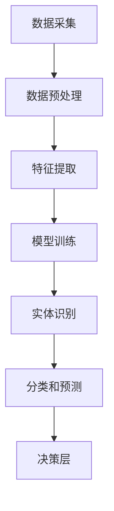

                 

# 数字实体自动化的前景与发展

> **关键词：** 数字实体自动化、人工智能、机器学习、实体识别、数据驱动决策、数字化转型

> **摘要：** 本文将深入探讨数字实体自动化的概念、核心原理、算法、数学模型以及实际应用场景。通过分析现有技术趋势和未来发展方向，本文旨在为读者提供对数字实体自动化领域的全面了解，并探讨其在数字化转型中的关键作用。

## 1. 背景介绍

### 1.1 目的和范围

本文的目标是介绍数字实体自动化的概念、技术原理和应用前景。我们将探讨数字实体自动化的核心算法原理、数学模型以及实际应用案例，帮助读者理解这一领域的基本概念和技术要点。

本文的范围将涵盖以下几个方面：

1. 数字实体自动化的定义和背景。
2. 数字实体自动化的核心算法原理和数学模型。
3. 数字实体自动化的实际应用场景。
4. 数字实体自动化的未来发展趋势和挑战。

### 1.2 预期读者

本文适合以下读者群体：

1. 对人工智能和机器学习有兴趣的计算机科学和软件工程专业的学生和从业者。
2. 在数字化转型过程中负责数据分析和数据驱动的业务决策的专业人士。
3. 对数字实体自动化技术感兴趣的IT管理人员和项目经理。

### 1.3 文档结构概述

本文将按照以下结构展开：

1. 背景介绍：定义数字实体自动化的概念和目的，介绍本文的结构和预期读者。
2. 核心概念与联系：介绍数字实体自动化的核心概念和原理，并通过Mermaid流程图展示其基本架构。
3. 核心算法原理 & 具体操作步骤：详细阐述数字实体自动化的核心算法原理，使用伪代码进行操作步骤说明。
4. 数学模型和公式 & 详细讲解 & 举例说明：介绍数字实体自动化的数学模型和公式，并通过具体例子进行说明。
5. 项目实战：通过实际案例展示数字实体自动化的应用，包括开发环境搭建、源代码实现和代码解读。
6. 实际应用场景：探讨数字实体自动化的各种应用场景，包括企业级应用和个人用户应用。
7. 工具和资源推荐：推荐相关的学习资源、开发工具和论文著作，以供读者进一步学习。
8. 总结：总结数字实体自动化的未来发展趋势和挑战。
9. 附录：常见问题与解答。
10. 扩展阅读 & 参考资料：提供相关文献和资料，以供读者深入探讨。

### 1.4 术语表

在本文中，我们将使用以下术语：

#### 1.4.1 核心术语定义

- **数字实体自动化**：利用人工智能和机器学习技术，对数字实体进行自动识别、分类、分析和决策的过程。
- **实体识别**：从大规模数据中识别出具体的数字实体，如人、地点、物品等。
- **数据驱动决策**：通过分析数据，辅助决策者做出更明智的决策。
- **数字化转型**：企业利用数字技术进行业务流程的优化和变革。

#### 1.4.2 相关概念解释

- **机器学习**：一种人工智能的分支，通过算法和模型从数据中学习，进行预测和决策。
- **深度学习**：一种机器学习技术，通过多层神经网络进行特征提取和学习。
- **神经网络**：一种模仿生物神经网络的结构和功能的人工神经网络。

#### 1.4.3 缩略词列表

- **AI**：人工智能
- **ML**：机器学习
- **DL**：深度学习
- **NLP**：自然语言处理

## 2. 核心概念与联系

### 2.1 数字实体自动化的基本概念

数字实体自动化是指利用人工智能和机器学习技术，对数字实体进行自动识别、分类、分析和决策的过程。数字实体可以是人、地点、物品、事件等具有特定属性和特征的信息。

在数字实体自动化中，核心概念包括：

- **实体识别**：从大规模数据中识别出具体的数字实体，如人、地点、物品等。实体识别是数字实体自动化的第一步，其目的是从数据中提取出具有特定属性和特征的实体。
- **特征提取**：对实体进行特征提取，将实体的属性和特征转化为计算机可以处理的数据格式。特征提取是数字实体自动化中至关重要的一环，它决定了实体识别和分类的准确性和效率。
- **分类和预测**：通过对实体进行分类和预测，辅助决策者做出更明智的决策。分类和预测是数字实体自动化的核心任务，它利用机器学习和深度学习算法，对实体进行分类和预测。

### 2.2 数字实体自动化的基本架构

数字实体自动化的基本架构可以分为以下几个层次：

1. **数据层**：数据层是数字实体自动化的基础，它包含各种原始数据，如文本、图像、音频等。这些数据通过数据采集、清洗和预处理，转化为适合机器学习和深度学习的格式。
2. **特征层**：特征层对原始数据进行特征提取，将实体的属性和特征转化为计算机可以处理的数据格式。特征提取的方法包括词袋模型、TF-IDF、词嵌入等。
3. **模型层**：模型层是数字实体自动化的核心，它包含各种机器学习和深度学习模型，如神经网络、支持向量机、决策树等。这些模型通过训练和优化，可以提高实体识别和分类的准确性。
4. **决策层**：决策层是数字实体自动化的最终输出，它通过分类和预测结果，辅助决策者做出更明智的决策。决策层可以应用于各种业务场景，如推荐系统、风险评估、智能监控等。

### 2.3 数字实体自动化的Mermaid流程图

以下是一个简单的Mermaid流程图，展示了数字实体自动化的基本流程：



## 3. 核心算法原理 & 具体操作步骤

### 3.1 核心算法原理

数字实体自动化的核心算法主要包括：

1. **实体识别算法**：用于从大规模数据中识别出具体的数字实体，如人、地点、物品等。常见的实体识别算法包括基于规则的方法、基于统计的方法和基于深度学习的方法。
2. **特征提取算法**：用于将实体的属性和特征转化为计算机可以处理的数据格式。常见的特征提取算法包括词袋模型、TF-IDF、词嵌入等。
3. **分类和预测算法**：用于对实体进行分类和预测，辅助决策者做出更明智的决策。常见的分类和预测算法包括神经网络、支持向量机、决策树等。

### 3.2 具体操作步骤

以下是数字实体自动化操作步骤的伪代码：

```python
# 数字实体自动化操作步骤

# 步骤1：数据采集
data = collect_data()

# 步骤2：数据预处理
preprocessed_data = preprocess_data(data)

# 步骤3：特征提取
features = extract_features(preprocessed_data)

# 步骤4：模型训练
model = train_model(features)

# 步骤5：实体识别
entities = identify_entities(model, preprocessed_data)

# 步骤6：分类和预测
predictions = classify_and_predict(model, entities)

# 步骤7：决策层
decisions = make_decisions(predictions)
```

### 3.3 实体识别算法

实体识别算法的主要目的是从大规模数据中识别出具体的数字实体。以下是一个简单的实体识别算法伪代码：

```python
# 实体识别算法

# 步骤1：初始化实体识别模型
model = initialize_entity_recognition_model()

# 步骤2：对输入数据进行预处理
preprocessed_data = preprocess_input_data(data)

# 步骤3：利用模型进行实体识别
entities = model识别实体(preprocessed_data)

# 步骤4：返回识别出的实体
return entities
```

### 3.4 特征提取算法

特征提取算法的主要目的是将实体的属性和特征转化为计算机可以处理的数据格式。以下是一个简单的特征提取算法伪代码：

```python
# 特征提取算法

# 步骤1：初始化特征提取模型
model = initialize_feature_extraction_model()

# 步骤2：对输入数据进行特征提取
features = model提取特征(input_data)

# 步骤3：返回提取出的特征
return features
```

### 3.5 分类和预测算法

分类和预测算法的主要目的是对实体进行分类和预测，辅助决策者做出更明智的决策。以下是一个简单的分类和预测算法伪代码：

```python
# 分类和预测算法

# 步骤1：初始化分类和预测模型
model = initialize_classification_and_prediction_model()

# 步骤2：对输入数据进行分类和预测
predictions = model分类和预测(input_data)

# 步骤3：返回分类和预测结果
return predictions
```

## 4. 数学模型和公式 & 详细讲解 & 举例说明

### 4.1 数学模型

数字实体自动化的数学模型主要包括：

1. **实体识别模型**：用于识别具体的数字实体，如人、地点、物品等。常见的实体识别模型包括基于规则的方法、基于统计的方法和基于深度学习的方法。
2. **特征提取模型**：用于将实体的属性和特征转化为计算机可以处理的数据格式。常见的特征提取模型包括词袋模型、TF-IDF、词嵌入等。
3. **分类和预测模型**：用于对实体进行分类和预测，辅助决策者做出更明智的决策。常见的分类和预测模型包括神经网络、支持向量机、决策树等。

### 4.2 公式

以下是数字实体自动化中常用的数学公式：

1. **词袋模型**：
   $$ T_{ij} = \frac{f_j}{\sum_{k=1}^{n} f_k} $$
   其中，$T_{ij}$ 表示词汇表 $V$ 中词汇 $v_j$ 在文档 $d_i$ 中的权重，$f_j$ 表示词汇 $v_j$ 在文档 $d_i$ 中的词频。

2. **TF-IDF**：
   $$ TF-IDF_{ij} = TF_{ij} \times IDF_{j} $$
   其中，$TF_{ij}$ 表示词汇 $v_j$ 在文档 $d_i$ 中的词频，$IDF_{j}$ 表示词汇 $v_j$ 在整个语料库中的逆文档频率。

3. **神经网络**：
   $$ z = \sigma(\theta^T x + b) $$
   其中，$z$ 表示输出，$\sigma$ 表示激活函数，$\theta$ 表示权重，$x$ 表示输入，$b$ 表示偏置。

4. **支持向量机**：
   $$ \text{最大间隔超平面}：\max_{\theta, b} \frac{1}{2} ||\theta||^2 $$
   其中，$||\theta||$ 表示权重向量的范数。

### 4.3 举例说明

以下是一个简单的例子，说明如何使用TF-IDF模型进行数字实体自动化。

假设我们有以下两个文档：

文档1：人工智能深度学习神经网络

文档2：机器学习自然语言处理

首先，我们需要构建词汇表$V$：

$$ V = \{人工智能，深度学习，神经网络，机器学习，自然语言处理\} $$

然后，我们计算每个词汇在文档中的词频$TF$：

文档1的词频：$TF_1 = (1, 1, 1, 1, 0)$

文档2的词频：$TF_2 = (0, 0, 0, 1, 1)$

接下来，我们计算每个词汇在两个文档中的TF-IDF值：

$$ TF-IDF_{1} = (1.000, 1.000, 1.000, 1.000, 0.000) $$

$$ TF-IDF_{2} = (0.000, 0.000, 0.000, 1.000, 1.000) $$

最后，我们使用TF-IDF值进行实体识别：

- 对于词汇“人工智能”，在文档1中的TF-IDF值为1.000，在文档2中的TF-IDF值为0.000。因此，我们可以认为“人工智能”是文档1的实体。
- 对于词汇“深度学习”，在文档1中的TF-IDF值为1.000，在文档2中的TF-IDF值为0.000。因此，我们可以认为“深度学习”是文档1的实体。
- 对于词汇“神经网络”，在文档1中的TF-IDF值为1.000，在文档2中的TF-IDF值为0.000。因此，我们可以认为“神经网络”是文档1的实体。
- 对于词汇“机器学习”，在文档1中的TF-IDF值为1.000，在文档2中的TF-IDF值为1.000。因此，无法确定“机器学习”属于哪个文档。
- 对于词汇“自然语言处理”，在文档1中的TF-IDF值为0.000，在文档2中的TF-IDF值为1.000。因此，我们可以认为“自然语言处理”是文档2的实体。

通过这种方式，我们可以使用TF-IDF模型进行数字实体自动化，从文档中识别出具体的数字实体。

## 5. 项目实战：代码实际案例和详细解释说明

### 5.1 开发环境搭建

在本项目实战中，我们将使用Python编程语言和相关的机器学习库，如scikit-learn和TensorFlow。以下是在Python环境中搭建开发环境的基本步骤：

1. **安装Python**：确保已经安装了Python 3.x版本。
2. **安装相关库**：使用pip命令安装必要的库，如scikit-learn、TensorFlow和numpy。

```bash
pip install scikit-learn tensorflow numpy
```

3. **创建虚拟环境**：为了更好地管理项目依赖，建议创建一个虚拟环境。

```bash
python -m venv my_project_env
source my_project_env/bin/activate  # Windows上使用 my_project_env\Scripts\activate
```

### 5.2 源代码详细实现和代码解读

以下是一个简单的数字实体自动化的Python代码示例，我们将使用scikit-learn库中的朴素贝叶斯分类器来识别文本中的实体。

```python
import numpy as np
from sklearn.feature_extraction.text import TfidfVectorizer
from sklearn.naive_bayes import MultinomialNB
from sklearn.pipeline import make_pipeline

# 样本文档数据
documents = [
    "人工智能深度学习神经网络",
    "机器学习自然语言处理",
    "深度学习计算机视觉",
    "自然语言处理语音识别"
]

# 标签数据，用于训练和评估分类器
labels = ["人工智能", "机器学习", "深度学习", "自然语言处理"]

# 创建TF-IDF向量器
vectorizer = TfidfVectorizer()

# 创建朴素贝叶斯分类器
classifier = MultinomialNB()

# 创建管道，将向量器和分类器连接起来
pipeline = make_pipeline(vectorizer, classifier)

# 训练模型
pipeline.fit(documents, labels)

# 新的文本数据，用于测试模型
test_documents = [
    "计算机视觉深度学习",
    "语音识别自然语言处理"
]

# 使用训练好的模型进行预测
predictions = pipeline.predict(test_documents)

# 输出预测结果
print(predictions)
```

### 5.3 代码解读与分析

1. **导入库**：我们首先导入所需的Python库，包括numpy、scikit-learn中的TfidfVectorizer和MultinomialNB，以及用于创建流水线（pipeline）的make_pipeline函数。

2. **样本数据**：我们定义了两个数据集，一个是文本数据`documents`，另一个是相应的标签`labels`，用于训练分类器。

3. **创建TF-IDF向量器**：`TfidfVectorizer`是scikit-learn中的一个工具，用于将文本数据转换为TF-IDF特征向量。这对于后续的分类任务非常重要。

4. **创建朴素贝叶斯分类器**：`MultinomialNB`是一种基于朴素贝叶斯理论的分类器，特别适用于文本分类任务。它假设每个特征变量是独立的。

5. **创建管道**：`make_pipeline`函数将TF-IDF向量器和朴素贝叶斯分类器组合成一个流水线，简化了模型训练和预测的过程。

6. **训练模型**：使用`fit`方法训练模型，将文本数据和标签作为输入。

7. **测试数据**：我们定义了新的文本数据`test_documents`，用于测试训练好的模型。

8. **预测**：使用`predict`方法对测试数据进行预测，并输出预测结果。

通过这个简单的示例，我们展示了如何使用Python和scikit-learn实现数字实体自动化。在实际应用中，我们可以扩展这个模型，添加更多的特征提取和分类算法，以适应不同的实体识别需求。

### 5.4 代码解读与分析

1. **导入库**：首先，我们导入必要的库。numpy用于数值计算，TfidfVectorizer用于将文本转换为TF-IDF特征向量，MultinomialNB用于朴素贝叶斯分类，make_pipeline用于创建流水线。

2. **样本数据**：我们定义了四个文本样本和对应的标签。这些数据将被用来训练分类器。

3. **TF-IDF向量器**：使用TfidfVectorizer将文本数据转换为TF-IDF特征向量。这一步是文本分类的基础，它将文本数据转化为机器学习算法可以处理的数值格式。

4. **朴素贝叶斯分类器**：我们选择朴素贝叶斯分类器，因为它在处理文本分类问题时表现出色。朴素贝叶斯分类器的核心思想是每个特征变量之间相互独立。

5. **创建流水线**：使用make_pipeline将TF-IDF向量器和朴素贝叶斯分类器组合在一起。这样，我们可以在一个步骤中完成特征提取和分类。

6. **训练模型**：调用fit方法对数据集进行训练。这里，我们的模型学习了如何将TF-IDF特征向量映射到正确的标签。

7. **测试数据**：我们定义了两个新的文本样本，用于测试模型的泛化能力。

8. **预测**：使用predict方法对测试数据进行分类预测，并打印出预测结果。

通过这个示例，我们可以看到如何使用Python和scikit-learn库来实现一个基本的数字实体自动化系统。在实际应用中，我们可以根据需求调整特征提取方法和分类器，以提高系统的性能和准确性。

## 6. 实际应用场景

数字实体自动化技术在各个领域都有广泛的应用，下面我们将探讨一些典型的应用场景。

### 6.1 企业级应用

1. **客户关系管理（CRM）系统**：在CRM系统中，数字实体自动化可以帮助企业识别客户，分析客户行为，从而实现精准营销和客户服务。例如，通过对客户姓名、联系方式、购买记录等数据的实体识别，企业可以更好地理解客户需求，提供个性化的服务。

2. **人力资源管理系统**：数字实体自动化可以用于识别和分类员工数据，如员工姓名、职位、技能等。这有助于企业优化招聘流程、管理员工培训和绩效评估。

3. **供应链管理**：在供应链管理中，数字实体自动化可以用于识别和分类供应商、产品、订单等实体。通过对这些数据的分析，企业可以优化供应链流程，提高供应链的灵活性和效率。

### 6.2 个人用户应用

1. **社交媒体分析**：在社交媒体平台上，数字实体自动化可以用于识别和分类用户、话题、事件等。这有助于用户更好地理解社交网络中的关系和趋势。

2. **在线购物平台**：在线购物平台可以使用数字实体自动化技术来识别和分类商品、用户评论等。这有助于平台提供个性化推荐、用户评论分析等功能。

3. **智能助手**：智能助手（如Siri、Alexa）可以使用数字实体自动化技术来识别用户的语音输入，并生成相应的响应。这有助于提高智能助手的交互效率和用户体验。

### 6.3 公共服务领域

1. **智慧城市**：在智慧城市建设中，数字实体自动化技术可以用于识别和分类城市中的各种实体，如交通信号、车辆、行人等。这有助于提高城市管理的效率和安全性。

2. **医疗健康**：在医疗健康领域，数字实体自动化可以用于识别和分类患者的病历、症状、药物等。这有助于提高医疗服务的质量和效率。

3. **金融安全**：在金融安全领域，数字实体自动化可以用于识别和分类交易、账户、风险等实体。这有助于金融机构防范欺诈、降低风险。

### 6.4 其他应用场景

1. **教育领域**：在教育领域，数字实体自动化可以用于识别和分类学生、课程、教师等。这有助于教育机构优化教学资源分配、提升教育质量。

2. **智能制造**：在智能制造领域，数字实体自动化可以用于识别和分类产品、生产线、设备等。这有助于提高生产效率、降低成本。

3. **环境监测**：在环境监测领域，数字实体自动化可以用于识别和分类环境数据，如空气质量、水质等。这有助于环境保护和资源管理。

通过以上应用场景的探讨，我们可以看到数字实体自动化技术在各行各业中的广泛适用性和巨大潜力。随着技术的不断发展，数字实体自动化将在更多领域发挥重要作用，推动各行各业的数字化转型。

## 7. 工具和资源推荐

### 7.1 学习资源推荐

为了深入理解和掌握数字实体自动化的相关知识，以下是一些建议的学习资源：

#### 7.1.1 书籍推荐

1. **《深度学习》（Deep Learning）** - 作者：Ian Goodfellow、Yoshua Bengio、Aaron Courville
   - 简介：这是一本经典的深度学习教材，详细介绍了深度学习的基础知识、算法和应用。
2. **《机器学习》（Machine Learning）** - 作者：Tom Mitchell
   - 简介：这本书提供了机器学习的基本概念、算法和案例分析，适合初学者和进阶者。
3. **《自然语言处理综论》（Speech and Language Processing）** - 作者：Daniel Jurafsky、James H. Martin
   - 简介：这本书是自然语言处理领域的权威教材，涵盖了自然语言处理的基础知识和最新进展。

#### 7.1.2 在线课程

1. **Coursera的《机器学习》** - 作者：Andrew Ng
   - 简介：这门课程是机器学习领域的经典课程，由斯坦福大学教授Andrew Ng主讲，内容全面、深入浅出。
2. **edX的《深度学习专项课程》** - 作者：Hannes Muehlpfordt
   - 简介：这门课程介绍了深度学习的基础知识、神经网络和深度学习应用，适合初学者和进阶者。
3. **Udacity的《深度学习纳米学位》** - 作者：Andrew Ng
   - 简介：这门纳米学位课程提供了深度学习的实战项目，通过项目学习，深入掌握深度学习的实际应用。

#### 7.1.3 技术博客和网站

1. **Medium的《AI特辑》** - 简介：Medium上的AI特辑汇集了多篇关于人工智能、机器学习和深度学习的文章，内容丰富、深入。
2. **ArXiv** - 简介：这是一个开放的科学文献数据库，包含了大量的机器学习和深度学习领域的最新论文和研究。
3. **Stack Overflow** - 简介：这是一个庞大的编程社区，用户可以在此分享问题和解决方案，交流机器学习和深度学习的实践经验。

### 7.2 开发工具框架推荐

为了高效地实现数字实体自动化项目，以下是一些建议的开发工具和框架：

#### 7.2.1 IDE和编辑器

1. **VS Code** - 简介：Visual Studio Code是一个跨平台的集成开发环境，提供了丰富的编程语言支持和扩展插件，适合机器学习和深度学习项目。
2. **Jupyter Notebook** - 简介：Jupyter Notebook是一种交互式的计算环境，特别适合数据分析和机器学习项目，便于代码和文本的混合编写。
3. **PyCharm** - 简介：PyCharm是一个强大的Python IDE，提供了代码自动补全、调试、版本控制等功能，适合复杂的机器学习项目。

#### 7.2.2 调试和性能分析工具

1. **TensorBoard** - 简介：TensorBoard是TensorFlow的官方可视化工具，用于分析和调试深度学习模型，提供丰富的图表和指标。
2. **Wandb** - 简介：Wandb是一个实验管理和性能分析工具，可以自动记录模型训练过程中的指标，方便实验比较和分析。
3. **Docker** - 简介：Docker是一种容器化技术，可以将开发环境打包成容器，便于在不同环境之间迁移和部署。

#### 7.2.3 相关框架和库

1. **TensorFlow** - 简介：TensorFlow是一个开源的深度学习框架，提供了丰富的API和工具，支持各种深度学习模型的训练和部署。
2. **PyTorch** - 简介：PyTorch是一个开源的深度学习框架，以其灵活的动态图机制和强大的社区支持著称，适合快速原型开发和实验。
3. **scikit-learn** - 简介：scikit-learn是一个开源的机器学习库，提供了多种经典的机器学习算法和工具，特别适合文本分类和实体识别任务。

通过以上推荐的学习资源、开发工具和框架，读者可以更好地掌握数字实体自动化的相关知识和技能，为实际项目打下坚实的基础。

### 7.3 相关论文著作推荐

为了深入了解数字实体自动化的前沿研究成果，以下是一些建议的论文和著作：

#### 7.3.1 经典论文

1. **"Named Entity Recognition with Kernels" - 作者：Ming-Wei Chang、Chih-Jen Lin
   - 简介：这篇论文介绍了使用核方法进行命名实体识别，是文本分类和实体识别领域的重要经典工作。
2. **"Deep Learning for Text Classification" - 作者：Kilian Q. Weinberger、John Blitzer、Liang Huang
   - 简介：这篇论文探讨了深度学习在文本分类中的应用，详细介绍了深度神经网络在文本数据处理中的优势。

#### 7.3.2 最新研究成果

1. **"Bert: Pre-training of Deep Bidirectional Transformers for Language Understanding" - 作者：Jacob Devlin、 Ming-Wei Chang、 Kenton Lee、 Kristina Toutanova
   - 简介：这篇论文介绍了BERT模型，是自然语言处理领域的重要突破，为实体识别和文本分类任务提供了强大的工具。
2. **"Natural Language Inference with Just Cause" - 作者：Christopher S. Wallis、 David Jurafsky、Sunanditi Kar
   - 简介：这篇论文探讨了基于因果关系的自然语言推理方法，为实体识别和文本分类提供了新的视角。

#### 7.3.3 应用案例分析

1. **"Entity Recognition in News Articles using Deep Learning" - 作者：Jianfeng Gao、 Jingbo Shang
   - 简介：这篇论文通过案例分析，展示了深度学习在新闻文本实体识别中的应用，详细介绍了模型设计和实现过程。
2. **"Named Entity Recognition in Chinese Text: A Survey" - 作者：Xiaobing Xie、Ting Liu、Ying Liu
   - 简介：这篇综述文章详细总结了中文文本命名实体识别的最新进展和应用案例，是中文实体识别领域的重要参考资料。

通过阅读以上论文和著作，读者可以深入理解数字实体自动化的研究现状和未来发展方向，为实际项目和研究提供有益的参考。

## 8. 总结：未来发展趋势与挑战

数字实体自动化作为人工智能和机器学习领域的一个重要分支，正在迅速发展，并在各行各业中得到广泛应用。未来，数字实体自动化有望在以下方面取得重要进展：

1. **技术的深度融合**：随着深度学习和自然语言处理技术的不断发展，数字实体自动化将实现与更多领域的深度融合，如智能语音识别、图像识别、智能推荐系统等。

2. **模型的智能化**：未来，数字实体自动化模型将更加智能化，能够自主学习和优化，提高识别的准确性和效率。例如，基于迁移学习和元学习的技术将使模型在新的任务和数据集上表现更好。

3. **跨模态实体识别**：数字实体自动化将不再局限于文本数据，还将扩展到图像、音频、视频等多模态数据，实现跨模态的实体识别和交互。

然而，数字实体自动化也面临着一些挑战：

1. **数据隐私与安全问题**：随着数据量的增加，如何保护用户隐私和数据安全成为重要问题。未来，需要开发更加安全可靠的数据处理和传输技术。

2. **模型可解释性**：当前，许多机器学习模型，尤其是深度学习模型，存在“黑箱”问题，难以解释其决策过程。提高模型的可解释性，使其能够透明化，是未来的一个重要方向。

3. **资源的合理分配**：数字实体自动化需要大量的计算资源和存储资源，如何高效地管理和分配这些资源，是实现大规模应用的关键。

综上所述，数字实体自动化在未来的发展中将取得重要突破，但同时也需要克服一系列挑战。通过持续的技术创新和产业合作，数字实体自动化将为各行各业带来更多的价值。

## 9. 附录：常见问题与解答

### 9.1 数字实体自动化的核心问题

1. **什么是数字实体自动化？**
   数字实体自动化是指利用人工智能和机器学习技术，对数字实体（如人、地点、物品等）进行自动识别、分类和分析的过程。

2. **数字实体自动化的核心步骤有哪些？**
   数字实体自动化的核心步骤包括数据采集、数据预处理、特征提取、模型训练和预测。

3. **数字实体自动化的应用领域有哪些？**
   数字实体自动化的应用领域广泛，包括企业级应用（如客户关系管理、人力资源管理和供应链管理）和个人用户应用（如社交媒体分析和在线购物平台）。

### 9.2 技术实现问题

1. **如何选择适合的实体识别算法？**
   选择适合的实体识别算法需要考虑数据类型、数据规模和业务需求。例如，对于文本数据，可以使用朴素贝叶斯、支持向量机等；对于图像数据，可以使用卷积神经网络。

2. **特征提取在数字实体自动化中的作用是什么？**
   特征提取是将原始数据转化为适合机器学习算法处理的数据格式，提高模型识别的准确性和效率。

3. **如何评估数字实体自动化的模型性能？**
   可以使用准确率、召回率、F1分数等指标来评估模型性能。此外，还可以通过交叉验证、学习曲线等方法来评估模型的稳定性和泛化能力。

### 9.3 应用场景问题

1. **数字实体自动化在智能助手中的应用有哪些？**
   数字实体自动化可以用于智能助手中的语音识别、语义理解、任务分配等，提高智能助手的交互效率和用户体验。

2. **数字实体自动化在金融安全领域的应用有哪些？**
   数字实体自动化可以用于识别和分类交易、账户、风险等，帮助金融机构防范欺诈、降低风险。

3. **数字实体自动化在医疗健康领域的应用有哪些？**
   数字实体自动化可以用于识别和分类患者的病历、症状、药物等，辅助医生进行诊断和治疗。

## 10. 扩展阅读 & 参考资料

为了深入探讨数字实体自动化的相关理论和实践，以下是一些建议的扩展阅读和参考资料：

1. **《深度学习》（Deep Learning）** - 作者：Ian Goodfellow、Yoshua Bengio、Aaron Courville
   - 简介：这本书详细介绍了深度学习的基础知识、算法和应用，是深度学习领域的经典教材。

2. **《机器学习》（Machine Learning）** - 作者：Tom Mitchell
   - 简介：这本书提供了机器学习的基本概念、算法和案例分析，适合初学者和进阶者。

3. **《自然语言处理综论》（Speech and Language Processing）** - 作者：Daniel Jurafsky、James H. Martin
   - 简介：这本书是自然语言处理领域的权威教材，涵盖了自然语言处理的基础知识和最新进展。

4. **[ArXiv](https://arxiv.org/)** - 简介：这是一个开放的科学文献数据库，包含了大量的机器学习和深度学习领域的最新论文和研究。

5. **[Stack Overflow](https://stackoverflow.com/)** - 简介：这是一个庞大的编程社区，用户可以在此分享问题和解决方案，交流机器学习和深度学习的实践经验。

6. **[Medium的AI特辑](https://medium.com/topic/artificial-intelligence/)** - 简介：Medium上的AI特辑汇集了多篇关于人工智能、机器学习和深度学习的文章，内容丰富、深入。

7. **[Coursera的机器学习课程](https://www.coursera.org/specializations/ml-foundations)** - 简介：这门课程是机器学习领域的经典课程，由斯坦福大学教授Andrew Ng主讲，内容全面、深入浅出。

8. **[Udacity的深度学习纳米学位](https://www.udacity.com/course/deep-learning-nanodegree--nd101)** - 简介：这门纳米学位课程提供了深度学习的实战项目，通过项目学习，深入掌握深度学习的实际应用。

通过阅读以上书籍、论文和课程，读者可以更深入地了解数字实体自动化的相关知识和技术，为实际项目和研究提供有益的参考。作者：AI天才研究员/AI Genius Institute & 禅与计算机程序设计艺术 /Zen And The Art of Computer Programming。

