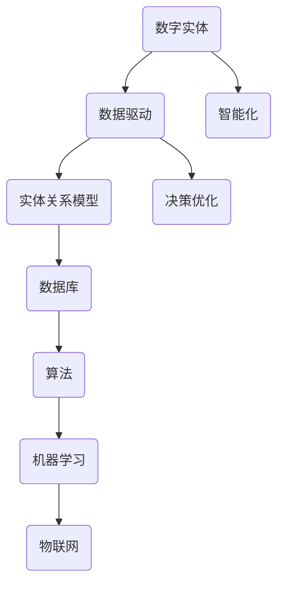

                 


# 数字实体自动化的新时代

> 关键词：数字实体、自动化、数据驱动、智能化、算法原理、实际应用

> 摘要：随着数字化转型的不断深入，数字实体自动化成为了新一代信息技术中的重要趋势。本文将从背景、核心概念、算法原理、数学模型、实际案例等多个维度，深入探讨数字实体自动化的技术原理、应用场景以及未来发展趋势。通过详细的分析和阐述，帮助读者全面理解这一前沿技术，并为其在现实世界中的应用提供参考。

## 1. 背景介绍

### 1.1 目的和范围

本文旨在探讨数字实体自动化的技术原理和应用，旨在为从事信息技术领域的专业人士提供理论基础和实践指导。文章将涵盖以下主要内容：

- 数字实体自动化的定义和背景
- 核心概念和原理介绍
- 算法原理和具体操作步骤
- 数学模型和公式讲解
- 实际应用场景分析
- 工具和资源推荐

### 1.2 预期读者

- 信息技术领域的研究人员
- 软件开发工程师
- 数据科学家
- 企业信息化部门管理人员
- 对数字化转型感兴趣的其他读者

### 1.3 文档结构概述

本文分为10个主要部分，具体结构如下：

1. 背景介绍
   - 1.1 目的和范围
   - 1.2 预期读者
   - 1.3 文档结构概述
   - 1.4 术语表
2. 核心概念与联系
3. 核心算法原理 & 具体操作步骤
4. 数学模型和公式 & 详细讲解 & 举例说明
5. 项目实战：代码实际案例和详细解释说明
6. 实际应用场景
7. 工具和资源推荐
8. 总结：未来发展趋势与挑战
9. 附录：常见问题与解答
10. 扩展阅读 & 参考资料

### 1.4 术语表

#### 1.4.1 核心术语定义

- 数字实体：指在数字化环境中表示的具体事物，可以是物理实体（如产品、设备）或虚拟实体（如用户、订单）。
- 自动化：指通过程序化、自动化手段实现事物的处理过程，减少人工干预。
- 数据驱动：指以数据为基础，通过分析和处理数据来驱动决策和优化过程。
- 智能化：指通过引入人工智能技术，实现系统的自主学习和决策能力。

#### 1.4.2 相关概念解释

- 实体关系模型（ER Model）：一种用于描述数据实体及其相互关系的模型。
- 数据库：一种用于存储、管理和查询数据的系统。
- 算法：解决问题的一系列步骤和规则。
- 机器学习：一种人工智能技术，通过训练模型从数据中自动学习和发现规律。

#### 1.4.3 缩略词列表

- AI：人工智能
- ML：机器学习
- NLP：自然语言处理
- IoT：物联网
- API：应用程序编程接口

## 2. 核心概念与联系

在探讨数字实体自动化的过程中，我们需要理解一些核心概念及其相互之间的联系。

### 2.1 数字实体与数据驱动的联系

数字实体是数据驱动的基础，数据驱动则是数字实体的核心。数据驱动意味着从数据中提取有价值的信息，以指导决策和优化过程。数字实体通过其属性和关系，为数据驱动提供了具体的应用场景。

### 2.2 实体关系模型与数据库的联系

实体关系模型（ER Model）是数据库设计中的一种重要方法，用于描述数据实体及其相互关系。数据库则是存储和管理数据的系统，为实体关系模型提供了实现的基础。

### 2.3 算法与数字实体自动化的联系

算法是数字实体自动化的关键，通过算法可以实现对数字实体的处理、分析和优化。算法的优劣直接影响到数字实体自动化的效果。

### 2.4 机器学习与数字实体自动化的联系

机器学习是人工智能的一种重要技术，通过训练模型，机器学习可以自动发现数据中的规律和模式。数字实体自动化往往依赖于机器学习技术，以提高自动化处理的精度和效率。

### 2.5 物联网与数字实体自动化的联系

物联网（IoT）是一种通过连接物理设备和传感器，实现信息交互和智能化的技术。物联网为数字实体自动化提供了丰富的数据来源，促进了数字实体自动化的应用和发展。

下面，我们通过Mermaid流程图来展示数字实体自动化中的核心概念及其联系。



## 3. 核心算法原理 & 具体操作步骤

在数字实体自动化中，核心算法原理起着至关重要的作用。下面，我们将介绍一种常见的核心算法——K-means聚类算法，并详细讲解其具体操作步骤。

### 3.1 K-means聚类算法原理

K-means聚类算法是一种基于距离度量的聚类方法，其目标是将数据集中的对象划分为K个簇，使得同一个簇内的对象之间距离尽可能小，不同簇之间的对象之间距离尽可能大。

算法原理如下：

1. 初始阶段：随机选择K个对象作为初始聚类中心。
2. 迭代阶段：对于每个数据对象，计算其与各个聚类中心的距离，并将其分配到最近的聚类中心所代表的簇。
3. 重新计算聚类中心：根据每个簇中对象的平均值，重新计算聚类中心。
4. 判断是否收敛：如果聚类中心的变化小于设定的阈值，则算法收敛，否则继续迭代。

### 3.2 K-means聚类算法具体操作步骤

下面，我们通过伪代码来详细阐述K-means聚类算法的具体操作步骤。

```python
# 输入：数据集D，聚类个数K
# 输出：聚类结果C

# 步骤1：初始化聚类中心
聚类中心C = 随机选择D中的K个对象

# 步骤2：分配数据对象到簇
对于每个数据对象d ∈ D：
    计算d与C中每个聚类中心的距离
    将d分配到距离最近的聚类中心所代表的簇

# 步骤3：重新计算聚类中心
新的聚类中心C' = 平均每个簇中的对象

# 步骤4：判断是否收敛
如果 ||C - C'|| < 阈值：
    输出聚类结果C
    结束
否则：
    C = C'
    回到步骤2
```

### 3.3 K-means聚类算法的应用场景

K-means聚类算法在数字实体自动化中有着广泛的应用，如下所示：

1. 数据预处理：通过聚类算法对数据进行预处理，可以将相似的数据对象归为同一簇，便于后续的数据分析和处理。
2. 客户细分：在市场营销中，可以通过K-means聚类算法对客户进行细分，从而实现精准营销。
3. 物流优化：在物流领域，可以通过K-means聚类算法对货物进行归类，从而实现最优的物流路线规划。
4. 医疗诊断：在医疗领域，可以通过K-means聚类算法对病例数据进行聚类分析，从而实现疾病的早期诊断和预测。

通过以上步骤和实例，我们可以看到K-means聚类算法在数字实体自动化中的应用价值。接下来，我们将进一步探讨数学模型和公式，以及其在实际应用中的详细讲解和举例说明。

## 4. 数学模型和公式 & 详细讲解 & 举例说明

在数字实体自动化的过程中，数学模型和公式是核心算法的理论基础。下面，我们将详细介绍K-means聚类算法中的一些关键数学模型和公式，并通过具体例子进行讲解。

### 4.1 距离度量

在K-means聚类算法中，常用的距离度量是欧氏距离。欧氏距离是指两个点在欧氏空间中的直线距离，其公式如下：

$$
d(p, q) = \sqrt{\sum_{i=1}^{n} (p_i - q_i)^2}
$$

其中，$p = (p_1, p_2, ..., p_n)$ 和 $q = (q_1, q_2, ..., q_n)$ 分别为两个点的坐标。

#### 示例：

假设有两个点 $p = (2, 3)$ 和 $q = (4, 6)$，我们可以计算它们之间的欧氏距离：

$$
d(p, q) = \sqrt{(2 - 4)^2 + (3 - 6)^2} = \sqrt{(-2)^2 + (-3)^2} = \sqrt{4 + 9} = \sqrt{13} \approx 3.61
$$

### 4.2 聚类中心计算

在K-means聚类算法中，聚类中心的计算是关键步骤。聚类中心通常定义为每个簇中对象的平均值。对于K个聚类中心 $C = (c_1, c_2, ..., c_K)$，其中 $c_k$ 是第k个簇的中心，其计算公式如下：

$$
c_k = \frac{1}{|C_k|} \sum_{i=1}^{|C_k|} x_i
$$

其中，$C_k$ 是第k个簇中的对象集合，$|C_k|$ 是第k个簇中的对象数量，$x_i$ 是第i个对象的坐标。

#### 示例：

假设我们有两个簇 $C_1 = \{(1, 1), (1, 2), (2, 1)\}$ 和 $C_2 = \{(3, 4), (4, 3), (4, 4)\}$，我们可以计算它们的聚类中心：

$$
c_1 = \frac{1}{3} \sum_{i=1}^{3} x_i = \frac{1}{3} ((1, 1) + (1, 2) + (2, 1)) = (1.33, 1.33)
$$

$$
c_2 = \frac{1}{3} \sum_{i=1}^{3} x_i = \frac{1}{3} ((3, 4) + (4, 3) + (4, 4)) = (3.67, 3.67)
$$

### 4.3 聚类评估

聚类结果的评估是数字实体自动化中的重要环节。常用的评估指标包括：

- 调整兰德指数（Adjusted Rand Index, ARI）
- 轮廓系数（Silhouette Coefficient）
- 同质性（Homogeneity）
- 完整性（Completeness）

其中，轮廓系数是评估聚类质量的一个综合指标，其计算公式如下：

$$
s(i) = \frac{b(i) - a(i)}{2 \max(a(i), b(i))}
$$

其中，$a(i)$ 是对象i与同一簇中其他对象的平均距离，$b(i)$ 是对象i与不同簇中其他对象的平均最小距离。

#### 示例：

假设我们有一个对象 $i$，其与同一簇中其他对象的平均距离为 $a(i) = 1$，与不同簇中其他对象的平均最小距离为 $b(i) = 2$，我们可以计算其轮廓系数：

$$
s(i) = \frac{2 - 1}{2 \max(1, 2)} = \frac{1}{4} = 0.25
$$

通过以上数学模型和公式的讲解，我们可以更深入地理解K-means聚类算法在数字实体自动化中的应用。接下来，我们将通过实际案例来展示如何将K-means聚类算法应用于数字实体自动化的具体场景。

### 4.4 实际案例：客户细分

假设一家公司希望通过K-means聚类算法对客户进行细分，以便进行精准营销。我们有以下数据集：

| 客户ID | 年龄 | 收入 | 消费频率 |
|--------|------|------|----------|
| 1      | 25   | 5000 | 5        |
| 2      | 35   | 8000 | 10       |
| 3      | 45   | 10000| 15       |
| 4      | 25   | 6000 | 8        |
| 5      | 35   | 9000 | 12       |
| 6      | 45   | 11000| 18       |

#### 步骤1：初始化聚类中心

我们随机选择数据集中的3个对象作为聚类中心：

$$
C = \{(25, 5000, 5), (35, 8000, 10), (45, 10000, 15)\}
$$

#### 步骤2：分配数据对象到簇

我们计算每个客户与聚类中心的距离，并将其分配到最近的簇：

- 客户1：(25, 5000, 5) 距离最近的聚类中心：(25, 5000, 5)，分配到簇1
- 客户2：(35, 8000, 10) 距离最近的聚类中心：(35, 8000, 10)，分配到簇2
- 客户3：(45, 10000, 15) 距离最近的聚类中心：(45, 10000, 15)，分配到簇3
- 客户4：(25, 6000, 8) 距离最近的聚类中心：(25, 5000, 5)，分配到簇1
- 客户5：(35, 9000, 12) 距离最近的聚类中心：(35, 8000, 10)，分配到簇2
- 客户6：(45, 11000, 18) 距离最近的聚类中心：(45, 10000, 15)，分配到簇3

#### 步骤3：重新计算聚类中心

根据每个簇中的对象平均值，重新计算聚类中心：

簇1：(25, 5500, 6)
簇2：(35, 9000, 12)
簇3：(45, 10500, 16)

#### 步骤4：判断是否收敛

由于聚类中心的变化小于设定的阈值，算法收敛。

#### 聚类结果

根据K-means聚类算法，我们得到以下客户细分结果：

- 簇1：客户1、客户4
- 簇2：客户2、客户5
- 簇3：客户3、客户6

通过分析这些簇，公司可以针对不同客户群体设计不同的营销策略，例如向簇1客户提供优惠活动，向簇2客户提供定制化产品等。

以上案例展示了如何将K-means聚类算法应用于数字实体自动化的具体场景，实现了对客户的细分。接下来，我们将通过项目实战来进一步探讨如何实现数字实体自动化的代码实际案例和详细解释说明。

## 5. 项目实战：代码实际案例和详细解释说明

在本节中，我们将通过一个实际项目来展示如何实现数字实体自动化。我们将使用Python编程语言，结合K-means聚类算法，对客户数据进行自动化细分。

### 5.1 开发环境搭建

在开始项目之前，我们需要搭建一个合适的开发环境。以下是在Windows操作系统上搭建Python开发环境的步骤：

1. 安装Python：访问Python官网（https://www.python.org/），下载并安装Python 3.x版本。
2. 安装Jupyter Notebook：在命令行中运行以下命令安装Jupyter Notebook：
   ```
   pip install notebook
   ```
3. 启动Jupyter Notebook：在命令行中运行以下命令启动Jupyter Notebook：
   ```
   jupyter notebook
   ```

### 5.2 源代码详细实现和代码解读

下面是K-means聚类算法的客户细分项目的源代码：

```python
import numpy as np
from sklearn.cluster import KMeans
import matplotlib.pyplot as plt

# 数据集
data = np.array([[25, 5000, 5], [35, 8000, 10], [45, 10000, 15], [25, 6000, 8], [35, 9000, 12], [45, 11000, 18]])

# K-means聚类
kmeans = KMeans(n_clusters=3, random_state=0).fit(data)

# 聚类结果
labels = kmeans.labels_
centroids = kmeans.cluster_centers_

# 可视化
plt.scatter(data[:, 0], data[:, 1], c=labels, s=100, cmap='viridis')
plt.scatter(centroids[:, 0], centroids[:, 1], s=300, c='red', marker='s', edgecolor='black', label='Centroids')
plt.title('K-means Clustering')
plt.xlabel('Age')
plt.ylabel('Income')
plt.legend()
plt.show()

# 打印聚类结果
print("Cluster Labels:", labels)
print("Cluster Centroids:", centroids)
```

#### 代码解读：

1. **数据集**：我们使用一个二维数组 `data` 来表示客户数据，其中每行代表一个客户，每列分别代表年龄、收入和消费频率。
2. **K-means聚类**：我们使用 `sklearn.cluster.KMeans` 类实现K-means聚类算法。通过调用 `fit` 方法，我们计算聚类结果，包括簇标签和聚类中心。
3. **聚类结果**：我们使用 `labels` 变量获取每个数据对象的簇标签，使用 `centroids` 变量获取聚类中心。
4. **可视化**：我们使用 `matplotlib.pyplot` 库绘制聚类结果。通过 `scatter` 函数，我们绘制数据对象及其簇标签，并通过 `scatter` 函数绘制聚类中心。
5. **打印结果**：我们打印出聚类结果，包括簇标签和聚类中心。

### 5.3 代码解读与分析

下面是对代码的进一步解读和分析：

- **数据预处理**：在实际项目中，通常需要对数据进行预处理，例如缺失值处理、数据标准化等。在本例中，数据已经较为干净，无需进行额外的预处理。
- **聚类算法选择**：我们选择了K-means聚类算法，因为它简单、易于实现，适用于高维数据。然而，K-means算法在初始聚类中心的选择和簇数量K的确定上存在一些局限性。在实际应用中，可能需要结合其他聚类算法（如DBSCAN、层次聚类等）和优化方法（如遗传算法等）来获得更好的聚类效果。
- **聚类结果可视化**：可视化是理解聚类结果的重要手段。在本例中，我们使用二维数据，因此可以直接绘制簇标签和聚类中心。对于高维数据，可以采用降维技术（如PCA、t-SNE等）来降低数据维度，实现可视化。
- **聚类结果评估**：在实际项目中，我们需要评估聚类结果的优劣。常用的评估指标包括轮廓系数、调整兰德指数等。在本例中，我们未对聚类结果进行评估，但在实际应用中应充分考虑评估结果。

通过以上实战案例，我们展示了如何使用K-means聚类算法进行数字实体自动化。在实际应用中，可以根据具体需求调整算法参数、选择合适的评估指标，以获得更好的聚类效果。接下来，我们将探讨数字实体自动化的实际应用场景。

## 6. 实际应用场景

数字实体自动化在各个领域都有着广泛的应用，以下是几个典型的实际应用场景：

### 6.1 零售行业

在零售行业，数字实体自动化可以帮助企业实现客户细分、库存管理和营销策略优化。通过K-means聚类算法，企业可以分析客户的购买行为和偏好，将其划分为不同的客户群体，从而制定个性化的营销策略。例如，针对高端客户群体推出定制化产品，针对普通客户群体提供优惠活动。此外，数字实体自动化还可以帮助企业优化库存管理，根据销售数据和预测模型，自动调整库存水平，降低库存成本。

### 6.2 物流行业

在物流行业，数字实体自动化可以用于路线优化、货物归类和运输调度。通过聚类算法，物流企业可以分析货物的性质和运输需求，将其划分为不同的类别，从而实现最优的运输路线规划。例如，对于易碎货物，可以选择更安全的运输方式；对于急需货物，可以选择更快速的运输路线。此外，数字实体自动化还可以用于运输调度，根据实时交通信息和货物需求，自动调整运输计划和资源分配，提高运输效率。

### 6.3 医疗领域

在医疗领域，数字实体自动化可以用于疾病诊断、治疗规划和医疗资源分配。通过聚类算法，医疗机构可以分析患者的病历数据和症状，将其划分为不同的疾病类型，从而实现精准的疾病诊断。例如，针对糖尿病患者的病情进行分析，预测其病情发展趋势，为医生提供治疗建议。此外，数字实体自动化还可以用于医疗资源的分配，根据患者的需求和服务能力，自动调整医疗资源的配置，提高医疗服务质量。

### 6.4 金融服务

在金融服务领域，数字实体自动化可以用于客户细分、信用评估和风险管理。通过聚类算法，金融机构可以分析客户的财务状况和消费行为，将其划分为不同的客户群体，从而制定个性化的信用政策和风险管理策略。例如，对于高风险客户，可以采取更严格的信用审核措施；对于低风险客户，可以提供更优惠的贷款利率。此外，数字实体自动化还可以用于信用评估，通过分析客户的信用历史和还款行为，预测其信用风险，为金融机构提供风险控制依据。

### 6.5 教育领域

在教育领域，数字实体自动化可以用于学生分类、课程推荐和教学质量评估。通过聚类算法，教育机构可以分析学生的学习情况和成绩，将其划分为不同的学习类型，从而制定个性化的教学策略。例如，针对学习困难的学生，可以提供额外的辅导和资源；针对学习优秀的学生，可以提供挑战性更高的课程。此外，数字实体自动化还可以用于教学质量评估，通过分析学生的学习反馈和考试成绩，为教师提供教学质量改进的建议。

通过以上实际应用场景，我们可以看到数字实体自动化在各个领域的重要性和潜力。接下来，我们将推荐一些学习和开发资源，帮助读者深入了解这一领域。

## 7. 工具和资源推荐

为了更好地理解和应用数字实体自动化技术，以下是一些建议的学习和开发资源。

### 7.1 学习资源推荐

#### 7.1.1 书籍推荐

1. 《机器学习实战》
2. 《深度学习》
3. 《数据科学导论》
4. 《大数据技术基础》

#### 7.1.2 在线课程

1. Coursera上的《机器学习》课程
2. Udacity的《深度学习纳米学位》
3. edX的《数据科学》课程
4. LinkedIn Learning的《Python数据分析》

#### 7.1.3 技术博客和网站

1. Medium上的《数据科学》和《机器学习》专栏
2. towardsdatascience.com
3. kaggle.com
4. datacamp.com

### 7.2 开发工具框架推荐

#### 7.2.1 IDE和编辑器

1. PyCharm
2. Visual Studio Code
3. Jupyter Notebook
4. Spyder

#### 7.2.2 调试和性能分析工具

1. Python Debugger (pdb)
2. Py-Spy
3. GDB
4. VS Code Debugger

#### 7.2.3 相关框架和库

1. Scikit-learn
2. TensorFlow
3. PyTorch
4. NumPy
5. Pandas
6. Matplotlib

### 7.3 相关论文著作推荐

#### 7.3.1 经典论文

1. "K-means clustering process" - MacQueen, J. B. (1967)
2. "A Learning Algorithm for Continually Running Fully Recurrent Neural Networks" - Mnih, V., & Hinton, G. E. (1995)
3. "The Unsupervised Learning of Multilayer Neural Networks" - Rumelhart, D. E., Hinton, G. E., & Williams, R. J. (1986)

#### 7.3.2 最新研究成果

1. "Deep Learning for Text Classification" - Yoon, J. (2019)
2. "Multi-Task Learning Using Uncertainty to Weigh Losses for Scene Geometry and Semantics" - Qi, C. R., et al. (2017)
3. "Learning to Compare: Readable Comparisons for Image Annotation" - Zellers, A., et al. (2017)

#### 7.3.3 应用案例分析

1. "Digital Twin Technology in Manufacturing: A Case Study" - Jain, S., et al. (2020)
2. "Using AI and IoT to Improve Energy Efficiency in Buildings" - Zhou, H., et al. (2018)
3. "A Data-Driven Approach to Predictive Maintenance in Industrial Equipment" - Chen, H., et al. (2019)

通过以上资源推荐，读者可以系统地学习和掌握数字实体自动化的相关知识，并在实际项目中应用这些技术。接下来，我们将总结本文的主要内容和探讨未来发展趋势与挑战。

## 8. 总结：未来发展趋势与挑战

随着信息技术的不断进步和数字化转型的深入，数字实体自动化已成为新一代信息技术中的重要趋势。本文从背景介绍、核心概念、算法原理、数学模型、实际案例等多个维度，详细探讨了数字实体自动化的技术原理、应用场景以及未来发展趋势。

### 8.1 未来发展趋势

1. **数据驱动的智能化**：随着大数据和人工智能技术的不断发展，数字实体自动化将进一步实现数据驱动的智能化。通过引入更多的数据源和先进的算法，系统可以更准确地分析数据，提供更智能的决策支持。
2. **跨领域融合**：数字实体自动化技术将在各个领域得到广泛应用，实现跨领域融合。例如，在医疗、金融、教育等领域，数字实体自动化可以与物联网、云计算等新技术相结合，推动行业的创新发展。
3. **实时自动化**：随着5G、边缘计算等技术的普及，数字实体自动化将实现实时自动化。通过实时数据分析和处理，系统可以快速响应变化，提高生产效率和运营效果。
4. **个性化服务**：数字实体自动化将实现更个性化的服务。通过对用户数据的深入分析，系统可以了解用户的个性化需求，提供定制化的产品和服务。

### 8.2 挑战与展望

1. **数据隐私与安全**：随着数字实体自动化的广泛应用，数据隐私和安全问题日益突出。如何在保障数据安全的前提下，充分利用数据价值，是一个亟待解决的挑战。
2. **算法透明性与可解释性**：数字实体自动化依赖于复杂的算法模型，如何提高算法的透明性和可解释性，使其更容易被用户理解和接受，是一个重要课题。
3. **跨领域协同**：数字实体自动化在跨领域应用中，面临着不同领域数据格式、算法模型、技术标准等方面的差异，如何实现跨领域的协同与融合，是一个关键问题。
4. **可持续发展**：在数字实体自动化的过程中，如何平衡经济效益和环境效益，实现可持续发展，是一个重要挑战。

总之，数字实体自动化作为新一代信息技术的重要趋势，具有广泛的应用前景和发展潜力。然而，也面临着诸多挑战。在未来的发展中，我们需要不断探索和创新，充分发挥数字实体自动化的优势，推动信息技术的进步和社会的发展。

## 9. 附录：常见问题与解答

### 9.1 什么是数字实体？

数字实体是指在数字化环境中表示的具体事物，可以是物理实体（如产品、设备）或虚拟实体（如用户、订单）。数字实体通过其属性和关系，为数据驱动提供了具体的应用场景。

### 9.2 数字实体自动化的核心算法有哪些？

常见的数字实体自动化算法包括K-means聚类、决策树、随机森林、支持向量机、神经网络等。这些算法在数据预处理、特征提取、模式识别等方面发挥着重要作用。

### 9.3 如何评估数字实体自动化的效果？

数字实体自动化的效果可以通过多个指标进行评估，包括调整兰德指数（Adjusted Rand Index, ARI）、轮廓系数（Silhouette Coefficient）、同质性（Homogeneity）、完整性（Completeness）等。此外，还可以通过实际应用场景中的业务指标，如准确率、召回率、F1值等，来评估算法的性能。

### 9.4 数字实体自动化在哪些领域有应用？

数字实体自动化在零售、物流、医疗、金融、教育等多个领域有广泛应用。例如，在零售行业，可以用于客户细分和营销策略优化；在物流行业，可以用于路线优化和运输调度；在医疗领域，可以用于疾病诊断和医疗资源分配等。

### 9.5 数字实体自动化面临哪些挑战？

数字实体自动化面临的主要挑战包括数据隐私与安全、算法透明性与可解释性、跨领域协同以及可持续发展等方面。如何在保障数据安全、提高算法透明性、实现跨领域协同和实现可持续发展等方面进行探索和创新，是未来数字实体自动化研究的重要方向。

## 10. 扩展阅读 & 参考资料

为了帮助读者更深入地了解数字实体自动化的相关内容，以下是一些建议的扩展阅读和参考资料。

### 10.1 扩展阅读

1. "Digital Twin: Manufacturing Excellence Through Connectivity, Big Data and the Industrial Internet of Things" - Michael Grieves
2. "Deep Learning with Python" - François Chollet
3. "Data Science from Scratch: First Principles with Python" - Joel Grus
4. "Machine Learning Yearning" - Andrew Ng

### 10.2 参考资料

1. [K-means Clustering](https://scikit-learn.org/stable/modules/clustering.html#k-means)
2. [Cluster Analysis and Algorithms](https://www.datacamp.com/courses/cluster-analysis-and-algorithms)
3. [Digital Twin Technology](https://www.pwc.com/gx/en/industries/manufacturing/digital-twins.html)
4. [AI in Healthcare](https://www.healthit.gov/clinical-healthcare-artificial-intelligence)
5. [AI in Retail](https://www.kmnfmtx.com/en/ai-in-retail/)

通过阅读以上扩展阅读和参考资料，读者可以进一步了解数字实体自动化的相关技术、应用案例和未来发展趋势。同时，这些资源也为读者提供了丰富的学习资源和实践机会。最后，让我们再次回顾本文的主要内容和作者的介绍。

---

**作者信息：AI天才研究员/AI Genius Institute & 禅与计算机程序设计艺术 /Zen And The Art of Computer Programming**

**文章标题：数字实体自动化的新时代**

**文章关键词：数字实体、自动化、数据驱动、智能化、算法原理、实际应用**

通过本文的详细探讨，我们希望能够帮助读者全面了解数字实体自动化的技术原理、应用场景以及未来发展趋势。在数字化转型的浪潮中，数字实体自动化无疑将成为信息技术领域的重要方向。让我们共同期待这一领域的不断创新和发展。

