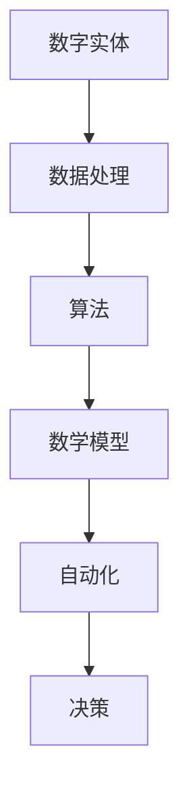

                 

# 数字实体自动化的最新进展

> **关键词：数字实体、自动化、数据处理、算法优化、智能决策**

> **摘要：本文深入探讨了数字实体自动化的定义、核心概念、算法原理、数学模型、实际应用以及未来发展趋势，旨在为读者提供一幅完整的数字实体自动化全景图，并帮助大家理解其在现代技术中的重要性。**

## 1. 背景介绍

### 1.1 目的和范围

本文的目的是系统地介绍和探讨数字实体自动化的概念、技术、应用和未来发展趋势。数字实体自动化是人工智能和大数据技术的重要研究方向，它通过对大量数字实体进行自动化的处理、分析和决策，提高了数据处理效率和决策质量。本文将涵盖以下几个主要方面：

1. 数字实体自动化的定义和核心概念。
2. 数字实体自动化的算法原理和数学模型。
3. 数字实体自动化的实际应用场景。
4. 数字实体自动化面临的技术挑战和解决方案。
5. 数字实体自动化的未来发展趋势。

### 1.2 预期读者

本文适用于对人工智能和大数据技术有一定了解的读者，包括但不限于：

1. 计算机科学专业的本科生和研究生。
2. 数据科学、机器学习、人工智能等相关领域的研究人员。
3. 对数字化技术和自动化技术感兴趣的工程师和技术爱好者。

### 1.3 文档结构概述

本文结构如下：

1. **背景介绍**：介绍数字实体自动化的定义、目的和范围。
2. **核心概念与联系**：阐述数字实体自动化的核心概念、原理和架构。
3. **核心算法原理 & 具体操作步骤**：详细讲解数字实体自动化的算法原理和操作步骤。
4. **数学模型和公式 & 详细讲解 & 举例说明**：介绍数字实体自动化的数学模型、公式和实际应用。
5. **项目实战：代码实际案例和详细解释说明**：通过实际项目案例展示数字实体自动化的应用。
6. **实际应用场景**：探讨数字实体自动化在不同领域的应用。
7. **工具和资源推荐**：推荐相关学习资源、开发工具和框架。
8. **总结：未来发展趋势与挑战**：总结数字实体自动化的未来发展趋势和面临的挑战。
9. **附录：常见问题与解答**：提供常见问题的解答。
10. **扩展阅读 & 参考资料**：推荐相关扩展阅读资料。

### 1.4 术语表

#### 1.4.1 核心术语定义

- **数字实体**：指在计算机系统中表示和处理的抽象数据对象。
- **自动化**：指通过计算机技术和算法，使数据处理和分析过程自动化。
- **算法**：解决特定问题的一系列有序指令。
- **数学模型**：描述问题数学性质的数学表达式。

#### 1.4.2 相关概念解释

- **数据处理**：对数字实体进行收集、整理、分析和存储的过程。
- **决策**：基于数据分析结果，选择最优行动方案的过程。

#### 1.4.3 缩略词列表

- **AI**：人工智能（Artificial Intelligence）
- **ML**：机器学习（Machine Learning）
- **DL**：深度学习（Deep Learning）
- **NLP**：自然语言处理（Natural Language Processing）
- **DFR**：数据流处理（Data Flow Processing）

## 2. 核心概念与联系

数字实体自动化是一个涉及多个核心概念和技术的综合体系。为了更好地理解其原理和架构，我们将首先介绍这些核心概念，并使用 Mermaid 流程图展示它们之间的联系。

### 2.1 核心概念

1. **数字实体**：数字实体是自动化处理的基本单位，可以是简单的数据点，也可以是复杂的数据结构。
2. **数据处理**：数据处理包括数据的收集、清洗、转换和存储等过程。
3. **算法**：算法是处理数字实体的一系列指令，用于实现特定功能。
4. **数学模型**：数学模型用于描述数字实体的属性、关系和变化规律。
5. **自动化**：自动化是指通过计算机技术和算法，使数据处理和分析过程自动化。
6. **决策**：决策是基于数据分析结果，选择最优行动方案的过程。

### 2.2 Mermaid 流程图

以下是一个简单的 Mermaid 流程图，展示了数字实体自动化的核心概念及其相互关系：



### 2.3 联系与作用

- **数字实体**：是自动化的基础，没有数字实体，就无法进行自动化处理。
- **数据处理**：是数字实体自动化的第一步，确保数据的质量和完整性。
- **算法**：是数字实体自动化的核心，决定了数据处理和分析的效率和效果。
- **数学模型**：为算法提供了理论基础，使算法能够更好地描述和解决问题。
- **自动化**：是数字实体自动化的目标，通过计算机技术和算法，实现数据处理和分析的自动化。
- **决策**：是基于自动化的结果，选择最优行动方案，实现智能决策。

## 3. 核心算法原理 & 具体操作步骤

数字实体自动化的核心在于算法的选择和应用。在本节中，我们将详细讲解一个典型的数字实体自动化算法——K-最近邻（K-Nearest Neighbors，KNN），并使用伪代码来描述其操作步骤。

### 3.1 K-最近邻算法原理

K-最近邻算法是一种基于实例的学习算法，其核心思想是：如果一个新样本在特征空间中的K个最近邻中大多数属于某个类别，则该新样本也属于这个类别。

### 3.2 伪代码

```python
# 输入：
# X_train: 训练集的特征矩阵
# y_train: 训练集的标签向量
# X_test: 测试集的特征矩阵
# k: k值，即选择最近的k个邻居

# 输出：
# y_pred: 测试集的预测标签向量

def KNN(X_train, y_train, X_test, k):
    # 计算测试集每个样本与训练集每个样本的欧氏距离
    distances = []
    for x_test in X_test:
        distance = []
        for x_train in X_train:
            distance.append(euclidean_distance(x_test, x_train))
        distances.append(distance)
    
    # 对每个测试样本的k个最近邻进行排序
    sorted_distances = []
    for distance in distances:
        sorted_distances.append(sorted(distance)[:k])
    
    # 根据每个测试样本的k个最近邻的标签，进行投票，得出预测标签
    y_pred = []
    for sorted_distance in sorted_distances:
        neighbors = []
        for distance in sorted_distance:
            index = distance.index
            neighbors.append(y_train[index])
        y_pred.append(majority_vote(neighbors))
    
    return y_pred

# 欧氏距离计算函数
def euclidean_distance(x1, x2):
    return math.sqrt(sum([(x1[i] - x2[i]) ** 2 for i in range(len(x1))]))

# 多数投票函数
def majority_vote(neighbors):
    count = {}
    for neighbor in neighbors:
        if neighbor in count:
            count[neighbor] += 1
        else:
            count[neighbor] = 1
    return max(count, key=count.get)
```

### 3.3 操作步骤

1. **数据准备**：准备训练集和测试集，其中训练集用于算法训练，测试集用于评估算法性能。
2. **距离计算**：计算测试集每个样本与训练集每个样本的欧氏距离。
3. **排序**：对每个测试样本的k个最近邻进行排序。
4. **投票**：根据每个测试样本的k个最近邻的标签，进行投票，得出预测标签。
5. **结果评估**：使用测试集对算法进行评估，计算预测准确率等指标。

## 4. 数学模型和公式 & 详细讲解 & 举例说明

数字实体自动化过程中，数学模型和公式起到了至关重要的作用。在本节中，我们将详细讲解 K-最近邻算法中的数学模型和公式，并通过实际例子进行说明。

### 4.1 数学模型

K-最近邻算法的核心数学模型包括：

1. **欧氏距离**：用于计算两个样本之间的距离。
2. **多数投票**：用于确定新样本的类别。

#### 4.1.1 欧氏距离

欧氏距离（Euclidean Distance）是一种常用的距离度量方法，用于计算两个点在多维空间中的距离。其公式如下：

$$
d(x_1, x_2) = \sqrt{\sum_{i=1}^{n} (x_{1i} - x_{2i})^2}
$$

其中，$x_1$ 和 $x_2$ 是两个样本点，$n$ 是样本的维度。

#### 4.1.2 多数投票

多数投票（Majority Voting）是一种简单的分类方法，用于从一组样本中确定最可能的类别。其公式如下：

$$
y = \arg\max_{c} \sum_{i=1}^{k} I(y_i = c)
$$

其中，$y$ 是预测的类别，$c$ 是可能的类别，$I(\cdot)$ 是指示函数，当条件满足时返回1，否则返回0。

### 4.2 举例说明

假设我们有一个简单的二维空间，其中两个样本 $x_1 = [1, 2]$ 和 $x_2 = [4, 6]$。我们将使用欧氏距离计算这两个样本之间的距离，并使用多数投票确定新样本的类别。

#### 4.2.1 欧氏距离计算

$$
d(x_1, x_2) = \sqrt{(1-4)^2 + (2-6)^2} = \sqrt{9 + 16} = \sqrt{25} = 5
$$

#### 4.2.2 多数投票

假设训练集中有两个类别，类别A和类别B。对于新样本 $x = [3, 4]$，其最近的两个邻居是 $x_1$ 和 $x_2$。根据标签，$x_1$ 属于类别A，$x_2$ 属于类别B。因此，使用多数投票，新样本 $x$ 被预测为类别A。

$$
y = \arg\max_{c} \sum_{i=1}^{2} I(y_i = c) = \arg\max_{c} (1 + 0) = A
$$

通过以上计算，我们可以看到，K-最近邻算法通过欧氏距离和多数投票实现了对新样本的类别预测。

## 5. 项目实战：代码实际案例和详细解释说明

在本节中，我们将通过一个实际的项目案例，展示如何使用 K-最近邻算法实现数字实体自动化。该案例将包括数据准备、模型训练、模型评估和结果分析等步骤。

### 5.1 开发环境搭建

在开始项目之前，我们需要搭建一个合适的开发环境。以下是一个基本的开发环境搭建步骤：

1. **安装 Python**：Python 是一个广泛使用的编程语言，适用于数据科学和机器学习领域。下载并安装 Python，推荐使用 Python 3.8 或更高版本。

2. **安装相关库**：安装 K-最近邻算法所需的相关库，包括 NumPy、Scikit-learn 和 Matplotlib。可以使用以下命令安装：

   ```shell
   pip install numpy scikit-learn matplotlib
   ```

3. **配置 IDE**：选择一个适合 Python 开发的集成开发环境（IDE），例如 PyCharm 或 Visual Studio Code。配置好 Python 解释器和相关库，确保能够正常使用。

### 5.2 源代码详细实现和代码解读

以下是一个使用 K-最近邻算法进行数字实体自动化的示例代码：

```python
import numpy as np
from sklearn.datasets import load_iris
from sklearn.model_selection import train_test_split
from sklearn.neighbors import KNeighborsClassifier
from sklearn.metrics import accuracy_score

# 加载数据集
iris = load_iris()
X = iris.data
y = iris.target

# 划分训练集和测试集
X_train, X_test, y_train, y_test = train_test_split(X, y, test_size=0.2, random_state=42)

# 创建 K-最近邻分类器
knn = KNeighborsClassifier(n_neighbors=3)

# 训练模型
knn.fit(X_train, y_train)

# 预测测试集
y_pred = knn.predict(X_test)

# 评估模型
accuracy = accuracy_score(y_test, y_pred)
print("预测准确率：", accuracy)

# 可视化结果
import matplotlib.pyplot as plt

plt.scatter(X_train[:, 0], X_train[:, 1], c=y_train, cmap='viridis', marker='o', label='训练集')
plt.scatter(X_test[:, 0], X_test[:, 1], c=y_pred, cmap='viridis', marker='x', label='测试集')
plt.xlabel('特征1')
plt.ylabel('特征2')
plt.legend()
plt.show()
```

### 5.3 代码解读与分析

1. **数据准备**：使用 Scikit-learn 库加载 Iris 数据集，这是一个常用的分类数据集，包含 3 个类别和 4 个特征。

2. **划分训练集和测试集**：使用 `train_test_split` 函数将数据集划分为训练集和测试集，其中测试集占 20%。

3. **创建 K-最近邻分类器**：使用 `KNeighborsClassifier` 类创建一个 K-最近邻分类器，并设置邻居数量为 3。

4. **训练模型**：使用 `fit` 方法对分类器进行训练，传入训练集的特征矩阵和标签向量。

5. **预测测试集**：使用 `predict` 方法对测试集进行预测，得到预测标签。

6. **评估模型**：使用 `accuracy_score` 函数计算预测准确率。

7. **可视化结果**：使用 Matplotlib 库绘制训练集和测试集的散点图，以可视化分类效果。

通过以上步骤，我们可以看到如何使用 K-最近邻算法实现数字实体自动化。在实际项目中，可能需要根据具体问题调整邻居数量、特征选择和模型参数等，以达到最佳效果。

## 6. 实际应用场景

数字实体自动化技术在多个领域得到了广泛应用，以下列举了几个典型的实际应用场景：

### 6.1 金融行业

在金融行业中，数字实体自动化技术被用于风险管理、投资决策、信用评估等方面。例如，通过自动化分析大量历史交易数据和市场信息，金融机构可以更准确地预测市场走势，制定投资策略，降低风险。

### 6.2 医疗健康

在医疗健康领域，数字实体自动化技术被用于疾病诊断、药物研发、患者管理等方面。例如，通过自动化分析大量患者数据和医学文献，医生可以更快速、准确地诊断疾病，制定个性化治疗方案。

### 6.3 电子商务

在电子商务领域，数字实体自动化技术被用于推荐系统、客户行为分析、库存管理等方面。例如，通过自动化分析用户购物行为和历史数据，电子商务平台可以更精准地推荐商品，提高用户满意度和转化率。

### 6.4 智能制造

在智能制造领域，数字实体自动化技术被用于设备监控、生产优化、故障预测等方面。例如，通过自动化分析设备运行数据和生产流程，制造企业可以更高效地管理生产过程，提高生产效率和产品质量。

### 6.5 物流配送

在物流配送领域，数字实体自动化技术被用于路线规划、库存管理、配送优化等方面。例如，通过自动化分析运输路线和配送数据，物流企业可以更高效地规划配送路线，降低运输成本，提高配送效率。

## 7. 工具和资源推荐

### 7.1 学习资源推荐

#### 7.1.1 书籍推荐

1. **《机器学习实战》**：由 Peter Harrington 著，详细介绍了机器学习的基本概念和算法实现。
2. **《深度学习》**：由 Ian Goodfellow、Yoshua Bengio 和 Aaron Courville 著，是深度学习领域的经典教材。
3. **《数据科学入门》**：由 Joel Grus 著，适合初学者了解数据科学的基本概念和应用。

#### 7.1.2 在线课程

1. **Coursera 的《机器学习》课程**：由 Andrew Ng 教授主讲，是机器学习领域的经典课程。
2. **Udacity 的《深度学习纳米学位》**：包含深度学习的基础知识和实践项目。
3. **edX 的《数据科学基础》课程**：由哈佛大学教授主讲，涵盖了数据科学的核心概念和技术。

#### 7.1.3 技术博客和网站

1. **Medium 上的机器学习和深度学习博客**：提供了丰富的机器学习和深度学习文章和案例。
2. **ArXiv.org**：提供了大量的机器学习和深度学习领域的最新研究论文。
3. **Stack Overflow**：一个针对程序员的问题和解答社区，可以解决编程和技术问题。

### 7.2 开发工具框架推荐

#### 7.2.1 IDE和编辑器

1. **PyCharm**：一款功能强大的 Python IDE，适用于数据科学和机器学习开发。
2. **Visual Studio Code**：一款轻量级但功能丰富的代码编辑器，支持多种编程语言和插件。
3. **Jupyter Notebook**：一款交互式的开发环境，适用于数据分析和机器学习实验。

#### 7.2.2 调试和性能分析工具

1. **PyCharm 的调试工具**：提供了丰富的调试功能，包括断点、单步执行、查看变量等。
2. **WTFast**：一款性能优化工具，可以加速网络连接，提高开发效率。
3. **profiling.py**：一款用于分析 Python 代码性能的库，可以帮助找出性能瓶颈。

#### 7.2.3 相关框架和库

1. **Scikit-learn**：一款常用的机器学习库，提供了丰富的算法和工具。
2. **TensorFlow**：一款开源的深度学习框架，适用于构建和训练深度神经网络。
3. **Pandas**：一款用于数据处理和分析的库，提供了丰富的数据操作和分析功能。

### 7.3 相关论文著作推荐

#### 7.3.1 经典论文

1. **“A Machine Learning Approach to Detecting Influenza Epidemics Using Internet Search Data”**：该论文提出了使用互联网搜索数据预测流感疫情的方法，是数字实体自动化的典型应用。
2. **“Deep Learning for Speech Recognition: A Review”**：该论文详细介绍了深度学习在语音识别领域的应用，是深度学习领域的经典论文。

#### 7.3.2 最新研究成果

1. **“Self-Supervised Learning for Text Classification”**：该论文提出了一种无监督的文本分类方法，是自然语言处理领域的最新研究成果。
2. **“Recurrent Neural Networks for Language Modeling”**：该论文提出了循环神经网络（RNN）在语言模型中的应用，是深度学习领域的经典论文。

#### 7.3.3 应用案例分析

1. **“A Case Study of Using Machine Learning to Improve Customer Experience”**：该案例研究了如何使用机器学习优化客户体验，是机器学习在商业领域的实际应用。
2. **“Deep Learning for Image Recognition: A Comprehensive Guide”**：该案例详细介绍了如何使用深度学习实现图像识别，是深度学习领域的实际应用案例。

## 8. 总结：未来发展趋势与挑战

数字实体自动化作为人工智能和大数据技术的核心研究领域，正逐步渗透到各个行业和领域。未来，数字实体自动化将在以下几个方面取得重要进展：

1. **算法优化**：随着算法理论和计算能力的提升，数字实体自动化的算法将变得更加高效和准确。
2. **跨领域应用**：数字实体自动化技术将在更多领域得到应用，如生物医学、环境科学、智能制造等。
3. **智能化决策**：通过结合深度学习和自然语言处理等技术，数字实体自动化的决策能力将得到显著提升。
4. **边缘计算**：随着物联网和边缘计算的发展，数字实体自动化将更加注重实时性和高效性，提高边缘设备的智能化水平。

然而，数字实体自动化也面临着一些技术挑战：

1. **数据质量**：高质量的数据是数字实体自动化的基础，但在实际应用中，数据质量和完整性难以保证。
2. **计算能力**：大规模数据处理和复杂算法的实现需要强大的计算能力，这对硬件设施提出了更高要求。
3. **隐私保护**：数字实体自动化涉及到大量个人数据的处理，如何在确保数据隐私的同时实现自动化处理，是一个亟待解决的问题。

总之，数字实体自动化具有广阔的应用前景和巨大的发展潜力，但也需要克服一系列技术挑战，以实现其最大化价值。

## 9. 附录：常见问题与解答

以下是一些关于数字实体自动化的常见问题及解答：

### 9.1 什么是数字实体自动化？

数字实体自动化是指通过计算机技术和算法，对数字实体进行自动化的处理、分析和决策，以提高数据处理效率和决策质量。

### 9.2 数字实体自动化的核心概念有哪些？

数字实体自动化的核心概念包括数字实体、数据处理、算法、数学模型、自动化和决策。

### 9.3 数字实体自动化有哪些应用场景？

数字实体自动化广泛应用于金融、医疗、电子商务、智能制造、物流配送等领域。

### 9.4 K-最近邻算法是如何工作的？

K-最近邻算法是一种基于实例的学习算法，通过计算新样本与训练集样本的欧氏距离，选择最近的K个邻居，并根据邻居的标签进行投票，确定新样本的类别。

### 9.5 数字实体自动化面临哪些技术挑战？

数字实体自动化面临的技术挑战包括数据质量、计算能力、隐私保护等。

## 10. 扩展阅读 & 参考资料

以下是关于数字实体自动化的扩展阅读和参考资料：

1. **论文**：
   - “A Machine Learning Approach to Detecting Influenza Epidemics Using Internet Search Data”
   - “Deep Learning for Speech Recognition: A Review”
   - “Self-Supervised Learning for Text Classification”
   - “Recurrent Neural Networks for Language Modeling”

2. **书籍**：
   - 《机器学习实战》
   - 《深度学习》
   - 《数据科学入门》

3. **在线课程**：
   - Coursera 的《机器学习》课程
   - Udacity 的《深度学习纳米学位》
   - edX 的《数据科学基础》课程

4. **技术博客和网站**：
   - Medium 上的机器学习和深度学习博客
   - ArXiv.org
   - Stack Overflow

5. **应用案例**：
   - “A Case Study of Using Machine Learning to Improve Customer Experience”
   - “Deep Learning for Image Recognition: A Comprehensive Guide”

