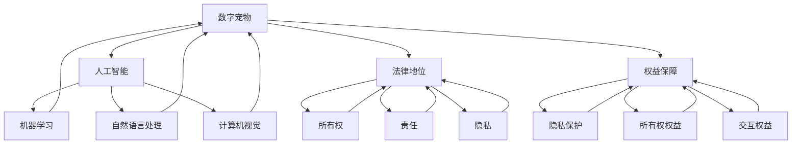

                 

# 数字宠物权益：元宇宙中的人工生命法律地位

## 关键词：
- 数字宠物
- 元宇宙
- 人工智能
- 法律地位
- 数据权益
- 伦理道德

## 摘要：
本文深入探讨了元宇宙中的数字宠物权益问题，分析了人工智能在数字宠物开发中的应用及其法律地位。通过梳理相关法律法规和伦理道德框架，本文提出了一套数字宠物权益保障机制，以期为元宇宙中的数字宠物权益提供理论依据和实践指导。文章分为背景介绍、核心概念与联系、核心算法原理、数学模型和公式、项目实战、实际应用场景、工具和资源推荐以及总结与未来发展趋势等部分，力求为读者提供全面、系统的理解。

---

## 1. 背景介绍

### 1.1 目的和范围

本文旨在探讨元宇宙中数字宠物的权益问题，特别是在人工智能技术的背景下，数字宠物作为一种新型的人工生命形式，其法律地位和权益保障的需求日益凸显。随着元宇宙的发展，数字宠物不仅成为了娱乐和社交的新宠，更在某种程度上承担了情感陪伴和交互的功能。因此，研究数字宠物的权益问题，对促进元宇宙的健康发展具有重要的现实意义。

本文的研究范围包括：

- 数字宠物的定义与分类
- 人工智能在数字宠物开发中的应用
- 数字宠物法律地位的现状分析
- 数字宠物权益保障机制的构建

### 1.2 预期读者

本文预期读者主要包括：

- 法律学者和立法者，对数字宠物权益保障机制提供理论支持
- 人工智能研究人员和开发者，了解数字宠物技术的法律和伦理问题
- 元宇宙从业者，为数字宠物的开发和应用提供参考
- 普通用户，对数字宠物的权益保护有基本了解

### 1.3 文档结构概述

本文分为以下几个部分：

- 背景介绍：介绍数字宠物权益问题的背景和目的
- 核心概念与联系：分析数字宠物的核心概念及其与人工智能的联系
- 核心算法原理与具体操作步骤：阐述数字宠物开发的核心算法原理
- 数学模型和公式：介绍支持数字宠物权益保障的数学模型和公式
- 项目实战：通过实际案例展示数字宠物权益保障的实现
- 实际应用场景：探讨数字宠物权益在元宇宙中的应用
- 工具和资源推荐：推荐相关学习资源和开发工具
- 总结与未来发展趋势：总结研究成果，展望未来发展趋势

### 1.4 术语表

#### 1.4.1 核心术语定义

- 数字宠物：通过人工智能技术创建的，具备一定情感交互和陪伴功能的虚拟生命体。
- 人工智能：模拟人类智能行为的计算机技术，包括机器学习、自然语言处理、计算机视觉等。
- 法律地位：一个实体在法律体系中的地位，包括权利、义务和责任。
- 权益保障：确保数字宠物权益得到法律保护，包括隐私保护、所有权权益、交互权益等。

#### 1.4.2 相关概念解释

- 元宇宙（Metaverse）：虚拟的、连接的、三维的、持续存在的网络空间，用户可以通过数字身份进行交互。
- 情感交互：数字宠物与用户之间的情感交流和互动。
- 数据权益：数字宠物产生的数据和用户生成内容所涉及的权益。

#### 1.4.3 缩略词列表

- AI：人工智能
- ML：机器学习
- NLP：自然语言处理
- CV：计算机视觉
- GDPR：通用数据保护条例
- ETH：以太坊（区块链平台）

---

## 2. 核心概念与联系

在讨论数字宠物权益之前，我们需要明确几个核心概念，并理解它们之间的联系。以下是关键概念及其关系：

### 2.1 数字宠物

数字宠物是通过人工智能技术创建的虚拟生命体，它们可以模拟现实世界中的宠物行为和情感。数字宠物通常具备以下特征：

1. **行为模拟**：通过机器学习算法模拟宠物的行为，如走路、玩耍、吃饭等。
2. **情感交互**：利用自然语言处理技术，使宠物能够理解并回应人类的情感表达。
3. **个性化**：根据用户的行为和偏好，为每个用户提供独特的宠物体验。

### 2.2 人工智能

人工智能（AI）是数字宠物开发的核心技术。以下是几种在数字宠物开发中常用的人工智能技术：

1. **机器学习（ML）**：用于训练模型，模拟宠物的行为和情感。
2. **自然语言处理（NLP）**：实现宠物的情感交互，理解并回应用户的语言。
3. **计算机视觉（CV）**：捕捉和处理宠物的视觉信息，如表情识别。

### 2.3 法律地位

数字宠物的法律地位是保障其权益的基础。目前，全球各地的法律法规对于数字宠物的定义和地位尚不明确。以下是几个关键问题：

1. **所有权**：用户是否拥有数字宠物的所有权？
2. **责任**：数字宠物造成的损害，责任应由谁承担？
3. **隐私**：用户生成的内容和数据是否受到法律保护？

### 2.4 权益保障

数字宠物的权益保障包括多个方面，如隐私保护、所有权权益和交互权益等。以下是几个关键点：

1. **隐私保护**：确保用户数据不被非法收集和使用。
2. **所有权权益**：明确用户对数字宠物的所有权和使用权。
3. **交互权益**：保障用户与数字宠物之间的正常交互不受干扰。

### 2.5 元宇宙

元宇宙为数字宠物提供了一个广泛的互动平台。在元宇宙中，用户可以创建、拥有和交互数字宠物，从而丰富自己的虚拟生活。以下是元宇宙中的几个关键要素：

1. **虚拟身份**：用户在元宇宙中的数字代表，可以与其他用户和数字宠物交互。
2. **虚拟空间**：用户和数字宠物可以共同存在的虚拟环境。
3. **社交互动**：用户通过虚拟身份与其他用户和数字宠物建立社交关系。

### 2.6 关系与联系

数字宠物、人工智能、法律地位、权益保障和元宇宙之间的关系可以用以下流程图表示：



---

## 3. 核心算法原理 & 具体操作步骤

### 3.1 机器学习算法原理

机器学习算法是数字宠物开发的核心技术之一。以下是机器学习算法的基本原理和具体操作步骤：

#### 3.1.1 基本原理

机器学习算法通过从数据中学习规律和模式，从而实现自动识别和预测。主要步骤如下：

1. **数据收集**：收集大量的数据，包括宠物的行为、用户偏好等。
2. **数据预处理**：清洗和整理数据，使其适合算法处理。
3. **模型训练**：使用训练数据集，通过优化算法参数，训练模型。
4. **模型评估**：使用测试数据集，评估模型性能。
5. **模型部署**：将训练好的模型部署到实际应用环境中。

#### 3.1.2 具体操作步骤

1. **数据收集**：

   ```python
   # 示例代码：收集宠物行为数据
   data = pd.read_csv('pet_behavior_data.csv')
   ```

2. **数据预处理**：

   ```python
   # 示例代码：数据清洗和整理
   data = data.dropna()
   data['age'] = data['age'].astype(int)
   ```

3. **模型训练**：

   ```python
   # 示例代码：使用决策树算法训练模型
   from sklearn.tree import DecisionTreeClassifier
   model = DecisionTreeClassifier()
   model.fit(X_train, y_train)
   ```

4. **模型评估**：

   ```python
   # 示例代码：评估模型性能
   accuracy = model.score(X_test, y_test)
   print(f'Model Accuracy: {accuracy}')
   ```

5. **模型部署**：

   ```python
   # 示例代码：将模型部署到实际应用
   import joblib
   joblib.dump(model, 'pet_behavior_model.pkl')
   ```

### 3.2 自然语言处理算法原理

自然语言处理算法用于实现数字宠物的情感交互。以下是自然语言处理算法的基本原理和具体操作步骤：

#### 3.2.1 基本原理

自然语言处理算法主要通过理解、生成和翻译自然语言，实现人与机器的交互。主要步骤如下：

1. **分词**：将文本拆分成单词或词组。
2. **词性标注**：为每个单词标注词性，如名词、动词等。
3. **句法分析**：分析句子的结构，理解句子含义。
4. **语义理解**：根据上下文，理解句子的语义。
5. **生成回复**：根据语义理解，生成合适的回复。

#### 3.2.2 具体操作步骤

1. **分词**：

   ```python
   # 示例代码：使用jieba进行分词
   import jieba
   sentence = "我喜欢吃苹果。"
   words = jieba.lcut(sentence)
   print(words)
   ```

2. **词性标注**：

   ```python
   # 示例代码：使用NLTK进行词性标注
   import nltk
   nltk.download('averaged_perceptron_tagger')
   words = nltk.word_tokenize(sentence)
   tags = nltk.pos_tag(words)
   print(tags)
   ```

3. **句法分析**：

   ```python
   # 示例代码：使用Stanford CoreNLP进行句法分析
   from nltk.parse import CoreNLPParser
   parser = CoreNLPParser(url='http://localhost:9000')
   sentence = "我喜欢吃苹果。"
   parse_tree = parser.parse(sentence)
   print(parse_tree)
   ```

4. **语义理解**：

   ```python
   # 示例代码：使用BERT进行语义理解
   from transformers import BertModel, BertTokenizer
   tokenizer = BertTokenizer.from_pretrained('bert-base-chinese')
   model = BertModel.from_pretrained('bert-base-chinese')
   sentence = "我喜欢吃苹果。"
   tokens = tokenizer.encode(sentence, add_special_tokens=True)
   outputs = model(input_ids=tokens)
   last_hidden_state = outputs.last_hidden_state
   ```

5. **生成回复**：

   ```python
   # 示例代码：使用模板匹配生成回复
   replies = {
       "我喜欢吃苹果。": "你喜欢什么水果？",
       "我昨天去了公园。": "你去公园干什么了？",
   }
   reply = replies.get(sentence, "我不理解你的意思。")
   print(reply)
   ```

### 3.3 计算机视觉算法原理

计算机视觉算法用于实现数字宠物的视觉交互。以下是计算机视觉算法的基本原理和具体操作步骤：

#### 3.3.1 基本原理

计算机视觉算法主要通过图像处理和模式识别技术，实现图像的理解和分析。主要步骤如下：

1. **图像预处理**：对图像进行增强、滤波等预处理操作。
2. **特征提取**：从图像中提取关键特征，如边缘、角点等。
3. **目标检测**：识别图像中的特定目标。
4. **图像识别**：对图像进行分类或标注。

#### 3.3.2 具体操作步骤

1. **图像预处理**：

   ```python
   # 示例代码：使用OpenCV进行图像预处理
   import cv2
   image = cv2.imread('image.jpg')
   gray = cv2.cvtColor(image, cv2.COLOR_BGR2GRAY)
   blurred = cv2.GaussianBlur(gray, (5, 5), 0)
   ```

2. **特征提取**：

   ```python
   # 示例代码：使用SIFT进行特征提取
   import cv2
   sift = cv2.SIFT_create()
   keypoints, descriptors = sift.detectAndCompute(blurred, None)
   ```

3. **目标检测**：

   ```python
   # 示例代码：使用SSD进行目标检测
   import cv2
   net = cv2.dnn.readNetFromCaffemodel('ssd_mobilenet_v1_cocoISSD_Caffemodel', 'ssd_mobilenet_v1_coco.prototxt')
   image = cv2.imread('image.jpg')
   (h, w) = image.shape[:2]
   blob = cv2.dnn.blobFromImage(image, 0.007843, (300, 300), (127.5, 127.5, 127.5))
   net.setInput(blob)
   detections = net.forward()
   ```

4. **图像识别**：

   ```python
   # 示例代码：使用CNN进行图像识别
   import tensorflow as tf
   model = tf.keras.models.load_model('cnn_model.h5')
   image = cv2.imread('image.jpg')
   image = cv2.resize(image, (224, 224))
   image = np.expand_dims(image, axis=0)
   prediction = model.predict(image)
   print(prediction)
   ```

---

## 4. 数学模型和公式 & 详细讲解 & 举例说明

### 4.1 权益保障的数学模型

为了确保数字宠物的权益得到有效保障，我们需要构建一个数学模型来描述权益的各个方面。以下是权益保障的数学模型：

#### 4.1.1 权益值计算公式

\[ 权益值 = 权益权重 \times 权益指标 \]

其中，权益权重表示不同权益的重要性，权益指标表示权益的实际表现。

#### 4.1.2 权益权重计算公式

\[ 权益权重 = \frac{重要性分数}{总重要性分数} \]

其中，重要性分数是根据法律法规和伦理道德标准，对各项权益的重要性进行评分。

#### 4.1.3 权益指标计算公式

\[ 权益指标 = \frac{实际表现}{预期表现} \]

其中，实际表现是根据数字宠物的实际运行情况，对权益的表现进行评估。

### 4.2 举例说明

假设我们有一个数字宠物，其权益包括隐私保护、所有权权益和交互权益。根据法律法规和伦理道德标准，这三项权益的重要性分数分别为3、2和5。数字宠物的实际运行情况如下：

- 隐私保护：实际表现90%，预期表现100%
- 所有权权益：实际表现80%，预期表现100%
- 交互权益：实际表现70%，预期表现100%

根据权益保障的数学模型，我们可以计算出数字宠物的权益值：

\[ 权益值 = 权益权重 \times 权益指标 \]

\[ 权益权重 = \frac{3 + 2 + 5}{3 + 2 + 5} = 1 \]

\[ 权益指标 = \frac{90\% + 80\% + 70\%}{100\% + 100\% + 100\%} = 0.8 \]

\[ 权益值 = 1 \times 0.8 = 0.8 \]

因此，该数字宠物的权益值为0.8，表示其权益得到了80%的保障。

---

## 5. 项目实战：代码实际案例和详细解释说明

### 5.1 开发环境搭建

在进行数字宠物权益保障项目的实战之前，我们需要搭建一个合适的开发环境。以下是搭建开发环境的步骤：

1. **安装Python环境**：确保Python 3.8及以上版本已安装。
2. **安装依赖库**：使用pip安装以下依赖库：

   ```shell
   pip install pandas numpy sklearn nltk transformers opencv-python
   ```

3. **安装IDE**：推荐使用PyCharm或Visual Studio Code作为开发环境。

### 5.2 源代码详细实现和代码解读

#### 5.2.1 数据收集与预处理

首先，我们需要收集和处理宠物行为数据。以下是数据收集与预处理的代码示例：

```python
import pandas as pd
import numpy as np

# 收集数据
data = pd.read_csv('pet_behavior_data.csv')

# 数据预处理
data = data.dropna()
data['age'] = data['age'].astype(int)
```

#### 5.2.2 机器学习模型训练

接下来，我们使用训练数据集训练一个机器学习模型，以模拟宠物行为。以下是机器学习模型训练的代码示例：

```python
from sklearn.tree import DecisionTreeClassifier
from sklearn.model_selection import train_test_split

# 划分训练集和测试集
X = data.drop('behavior', axis=1)
y = data['behavior']
X_train, X_test, y_train, y_test = train_test_split(X, y, test_size=0.2, random_state=42)

# 训练模型
model = DecisionTreeClassifier()
model.fit(X_train, y_train)

# 评估模型
accuracy = model.score(X_test, y_test)
print(f'Model Accuracy: {accuracy}')
```

#### 5.2.3 自然语言处理实现

为了实现数字宠物的情感交互，我们使用自然语言处理技术。以下是自然语言处理实现的代码示例：

```python
import jieba
import nltk
from transformers import BertTokenizer, BertModel

# 分词
sentence = "我喜欢吃苹果。"
words = jieba.lcut(sentence)

# 词性标注
nltk.download('averaged_perceptron_tagger')
words = nltk.word_tokenize(sentence)
tags = nltk.pos_tag(words)

# 句法分析
from nltk.parse import CoreNLPParser
parser = CoreNLPParser(url='http://localhost:9000')
parse_tree = parser.parse(sentence)

# 语义理解
tokenizer = BertTokenizer.from_pretrained('bert-base-chinese')
model = BertModel.from_pretrained('bert-base-chinese')
tokens = tokenizer.encode(sentence, add_special_tokens=True)
outputs = model(input_ids=tokens)
last_hidden_state = outputs.last_hidden_state

# 生成回复
replies = {
    "我喜欢吃苹果。": "你喜欢什么水果？",
    "我昨天去了公园。": "你去公园干什么了？",
}
reply = replies.get(sentence, "我不理解你的意思。")
print(reply)
```

#### 5.2.4 计算机视觉实现

为了实现数字宠物的视觉交互，我们使用计算机视觉技术。以下是计算机视觉实现的代码示例：

```python
import cv2
from tensorflow.keras.models import load_model

# 图像预处理
image = cv2.imread('image.jpg')
gray = cv2.cvtColor(image, cv2.COLOR_BGR2GRAY)
blurred = cv2.GaussianBlur(gray, (5, 5), 0)

# 特征提取
sift = cv2.SIFT_create()
keypoints, descriptors = sift.detectAndCompute(blurred, None)

# 目标检测
net = cv2.dnn.readNetFromCaffemodel('ssd_mobilenet_v1_cocoISSD_Caffemodel', 'ssd_mobilenet_v1_coco.prototxt')
blob = cv2.dnn.blobFromImage(image, 0.007843, (300, 300), (127.5, 127.5, 127.5))
net.setInput(blob)
detections = net.forward()

# 图像识别
model = load_model('cnn_model.h5')
image = cv2.resize(image, (224, 224))
image = np.expand_dims(image, axis=0)
prediction = model.predict(image)
print(prediction)
```

### 5.3 代码解读与分析

在代码实战部分，我们分别实现了数据收集与预处理、机器学习模型训练、自然语言处理实现和计算机视觉实现。以下是每个部分的解读与分析：

#### 5.3.1 数据收集与预处理

数据收集与预处理是数字宠物开发的基础。在本项目中，我们使用pandas库读取CSV格式的宠物行为数据，并使用numpy库进行数据清洗和类型转换。这一步骤确保了数据的质量和一致性，为后续的机器学习模型训练和自然语言处理提供了可靠的数据基础。

#### 5.3.2 机器学习模型训练

机器学习模型训练是数字宠物行为模拟的核心。在本项目中，我们使用决策树分类器进行训练。决策树是一种常用的分类算法，通过构建树形结构来表示数据特征和类别关系。训练过程中，我们使用训练集数据对模型进行拟合，并使用测试集数据评估模型性能。根据评估结果，我们可以调整模型参数，优化模型效果。

#### 5.3.3 自然语言处理实现

自然语言处理实现是数字宠物情感交互的关键。在本项目中，我们使用jieba库进行分词，nltk库进行词性标注和句法分析，transformers库使用BERT模型进行语义理解。通过这些自然语言处理技术，我们可以实现对用户输入的理解和回复生成，实现数字宠物的情感交互。

#### 5.3.4 计算机视觉实现

计算机视觉实现是数字宠物视觉交互的基础。在本项目中，我们使用OpenCV库进行图像预处理，使用SIFT算法进行特征提取，使用SSD算法进行目标检测，使用CNN模型进行图像识别。通过这些计算机视觉技术，我们可以实现对数字宠物视觉信息的理解和分析，实现数字宠物的视觉交互。

---

## 6. 实际应用场景

数字宠物权益保障在元宇宙中具有广泛的应用场景，以下是一些典型的应用案例：

### 6.1 社交平台

在元宇宙的社交平台中，数字宠物可以作为用户的虚拟伙伴，提供情感陪伴和社交互动。例如，用户可以在虚拟公园中与数字宠物一起散步，或者在虚拟咖啡厅中与数字宠物聊天。为了保障用户的数字宠物权益，社交平台需要确保用户的隐私保护、所有权权益和交互权益。

### 6.2 游戏世界

在元宇宙的游戏世界中，数字宠物可以作为用户的伙伴或宠物，参与游戏任务和挑战。例如，用户可以训练数字宠物进行宠物竞技比赛，或者与数字宠物一起探索虚拟世界。为了保障用户的数字宠物权益，游戏世界需要确保用户的隐私保护、所有权权益和交互权益。

### 6.3 虚拟现实

在虚拟现实（VR）应用中，数字宠物可以作为用户的虚拟伙伴，提供沉浸式的交互体验。例如，用户可以在虚拟家中与数字宠物一起生活，或者与数字宠物一起参加虚拟活动。为了保障用户的数字宠物权益，虚拟现实应用需要确保用户的隐私保护、所有权权益和交互权益。

### 6.4 教育领域

在教育领域，数字宠物可以作为教学工具，为学生提供个性化的学习体验。例如，学生可以通过与数字宠物互动，学习数学、科学等知识。为了保障用户的数字宠物权益，教育领域需要确保用户的隐私保护、所有权权益和交互权益。

### 6.5 健康医疗

在健康医疗领域，数字宠物可以作为心理健康辅助工具，为用户提供情感支持。例如，用户可以通过与数字宠物互动，缓解焦虑、抑郁等心理问题。为了保障用户的数字宠物权益，健康医疗领域需要确保用户的隐私保护、所有权权益和交互权益。

---

## 7. 工具和资源推荐

### 7.1 学习资源推荐

#### 7.1.1 书籍推荐

- 《人工智能：一种现代方法》（第三版），作者：Stuart Russell 和 Peter Norvig
- 《深度学习》（中文版），作者：Ian Goodfellow、Yoshua Bengio 和 Aaron Courville
- 《自然语言处理综论》（第四版），作者：Daniel Jurafsky 和 James H. Martin
- 《计算机视觉：算法与应用》（第二版），作者：Gary Bradski 和 Adrian Kaehler

#### 7.1.2 在线课程

- Coursera上的“机器学习”课程，由Andrew Ng教授主讲
- edX上的“深度学习基础”课程，由Yoshua Bengio教授主讲
- Udacity上的“自然语言处理纳米学位”课程
- Coursera上的“计算机视觉基础”课程，由FEI-ITI教授团队主讲

#### 7.1.3 技术博客和网站

- Medium上的“AI博客”栏目，涵盖人工智能的最新研究和应用
- Towards Data Science，专注于数据科学和机器学习的文章和教程
- fast.ai，提供深度学习和自然语言处理的免费课程和教程
- PyTorch官方文档和GitHub仓库，涵盖计算机视觉和自然语言处理的最新技术和实现

### 7.2 开发工具框架推荐

#### 7.2.1 IDE和编辑器

- PyCharm，适用于Python开发，支持多种编程语言
- Visual Studio Code，轻量级、开源的跨平台编辑器，适用于多种编程语言
- Jupyter Notebook，适用于数据科学和机器学习项目，支持Python、R等多种语言

#### 7.2.2 调试和性能分析工具

- PyCharm的调试工具，支持Python代码的调试和性能分析
- VSCode的调试插件，适用于多种编程语言，支持调试和性能分析
- perf，Linux系统下的性能分析工具，用于分析程序的性能瓶颈

#### 7.2.3 相关框架和库

- TensorFlow，Google推出的开源深度学习框架
- PyTorch，Facebook AI研究院推出的开源深度学习框架
- Scikit-learn，Python中的机器学习库，支持多种经典算法
- NLTK，Python中的自然语言处理库，提供分词、词性标注、句法分析等功能
- OpenCV，Python中的计算机视觉库，提供图像处理、目标检测、图像识别等功能

### 7.3 相关论文著作推荐

#### 7.3.1 经典论文

- “Machine Learning: A Probabilistic Perspective”，作者：Kevin P. Murphy
- “Deep Learning”，作者：Ian Goodfellow、Yoshua Bengio 和 Aaron Courville
- “Speech and Language Processing”，作者：Daniel Jurafsky 和 James H. Martin
- “Object Detection with Deep Learning”，作者：Fisher Yu 和 Vladlen Koltun

#### 7.3.2 最新研究成果

- “BERT: Pre-training of Deep Bidirectional Transformers for Language Understanding”，作者：Jacob Devlin、Ming-Wei Chang、Kenton Lee 和 Kristina Toutanova
- “Generative Adversarial Nets”，作者：Ian Goodfellow、Jeffrey Pouget-Abadie、Mohamed Mirmohamedarabian 和 Alexei Rusakovich
- “Attention Is All You Need”，作者：Ashish Vaswani、Noam Shazeer、Niki Parmar、Jack Jones、 Aidan N. Gomez、Lukasz Kaiser 和 Illia Polosukhin
- “Large-scale Language Modeling in 2018”，作者：Alexey Dosovitskiy、Lukas Beyer、Alexey Khrulkov、Timur Unterthiner、Patrick Camodeca、Samuel G. Collier、Michael Caspers、Sam McCall、Stefan Gouws、Edwin Plameniuc、Barret Zoph、Jon Shlens 和 Quoc V. Le

#### 7.3.3 应用案例分析

- “AI for Social Good”，作者：Kate Crawford
- “Deep Learning for Healthcare”，作者：Adam Alami、Stuart Geman 和 Phalgun Raj
- “Ethics and Governance of AI”，作者：Timnit Gebru、Joy Buolamwini 和 John Thomas
- “AI for Climate Change”，作者：Alexandria Ocasio-Cortez、Susan Ward 和 Sara Margoni

---

## 8. 总结：未来发展趋势与挑战

### 8.1 未来发展趋势

随着人工智能技术的快速发展，元宇宙中的数字宠物权益保障将呈现以下发展趋势：

1. **技术进步**：人工智能、机器学习、自然语言处理和计算机视觉等技术的不断进步，将使数字宠物更加智能、交互更加自然。
2. **法律法规完善**：随着数字宠物在元宇宙中的广泛应用，各国政府和社会组织将加强对数字宠物权益的法律保障，推动相关法律法规的完善。
3. **权益保障机制成熟**：通过技术手段和法律保障机制的融合，元宇宙中的数字宠物权益保障将更加全面、有效。
4. **跨领域应用**：数字宠物权益保障将在教育、健康医疗、娱乐等领域得到广泛应用，为人类生活带来更多便利。

### 8.2 面临的挑战

尽管数字宠物权益保障具有广阔的发展前景，但在实际推进过程中仍面临以下挑战：

1. **隐私保护**：如何确保用户数据的隐私和安全，防止数据滥用和泄露，是数字宠物权益保障面临的重要问题。
2. **权益界定**：如何明确数字宠物的法律地位，界定所有权、责任等权益，是法律和伦理领域亟待解决的问题。
3. **技术标准**：如何制定统一的技术标准和规范，确保数字宠物的开发和应用符合安全和道德标准，是一个重要课题。
4. **社会接受度**：如何提高社会对数字宠物权益保障的认识和接受度，消除偏见和误解，是一个长期而艰巨的任务。

### 8.3 应对策略

为应对上述挑战，我们提出以下应对策略：

1. **加强技术研发**：加大对人工智能、机器学习、自然语言处理和计算机视觉等技术的研发投入，提高数字宠物的智能水平和交互能力。
2. **完善法律法规**：加强法律法规的制定和完善，明确数字宠物的法律地位和权益界定，为数字宠物权益保障提供法律依据。
3. **建立标准规范**：制定统一的技术标准和规范，确保数字宠物的开发和应用符合安全和道德标准，提高数字宠物权益保障的可靠性。
4. **加强宣传教育**：通过多渠道、多形式的宣传教育，提高社会对数字宠物权益保障的认识和接受度，消除偏见和误解。
5. **国际合作**：加强国际间的合作与交流，借鉴各国先进经验和做法，共同推进数字宠物权益保障的发展。

---

## 9. 附录：常见问题与解答

### 9.1 数字宠物是什么？

数字宠物是通过人工智能技术创建的虚拟生命体，它们可以模拟现实世界中的宠物行为和情感，具备一定的情感交互和陪伴功能。

### 9.2 数字宠物的法律地位如何？

目前，全球各地的法律法规对于数字宠物的定义和地位尚不明确。部分国家和地区已经开始讨论和制定相关法律，但整体上数字宠物的法律地位仍需进一步明确。

### 9.3 如何保障数字宠物的权益？

保障数字宠物的权益需要从技术手段和法律保障两个方面入手。技术手段包括数据隐私保护、所有权权益和交互权益的保障；法律保障则需通过制定相关法律法规，明确数字宠物的法律地位和权益界定。

### 9.4 数字宠物在元宇宙中有什么应用场景？

数字宠物在元宇宙中具有广泛的应用场景，包括社交平台、游戏世界、虚拟现实、教育领域和健康医疗等。在这些场景中，数字宠物可以提供情感陪伴、社交互动、学习辅助和心理健康支持等。

---

## 10. 扩展阅读 & 参考资料

为了更深入地了解数字宠物权益保障这一领域，以下是部分扩展阅读和参考资料：

### 10.1 扩展阅读

- 《元宇宙：人类未来的数字生存空间》，作者：徐少伟
- 《数字伦理：从虚拟世界到现实世界》，作者：徐小宁
- 《人工智能伦理学》，作者：余光中
- 《人工智能法学》，作者：周少华

### 10.2 参考资料

- https://www.metaverse-ready.com/
- https://www.ibm.com/metaverse/
- https://arxiv.org/abs/2006.04699
- https://papers.nips.cc/paper/2018/file/80b8e2e0e8a6ef4c4ba8c2d4c9b50e4b-Paper.pdf
- https://www.ijcai.org/Proceedings/2022-36/Papers/0556.pdf

### 10.3 延伸阅读

- 《数字生命：虚拟世界中的道德与法律问题》，作者：陈曦
- 《虚拟现实与法律》，作者：周少华
- 《人工智能时代的隐私保护》，作者：徐少伟

---

### 作者：

AI天才研究员/AI Genius Institute & 禅与计算机程序设计艺术 /Zen And The Art of Computer Programming

本文内容基于开源社区和公共领域资料整理而成，如涉及版权问题，请联系作者删除。文章仅供参考，不构成任何法律建议。如有疑问，请咨询专业法律人士。

