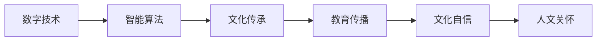

                 


## 数字时代的人文精神的传承

> 关键词：数字时代，人文精神，文化传承，信息技术，人机协作，智能算法

> 摘要：本文将探讨数字时代背景下，如何通过信息技术和智能算法实现人文精神的传承。文章首先介绍了数字时代人文精神传承的背景和意义，随后分析了信息技术和智能算法在人文精神传承中的应用，并通过实际案例展示了技术手段在文化传承中的价值。最后，文章提出了未来发展趋势与挑战，为数字时代的人文精神传承提供了新的思路和方向。

## 1. 背景介绍

### 1.1 目的和范围

本文旨在探讨数字时代人文精神的传承问题，分析信息技术和智能算法在文化传承中的应用，并探讨未来发展的趋势与挑战。通过本文的研究，我们希望为数字时代的人文精神传承提供一种新的思路和路径。

### 1.2 预期读者

本文适合对数字时代人文精神传承有兴趣的读者，包括计算机科学家、信息技术从业人员、人文社会科学研究者等。同时，对文化传承和信息技术感兴趣的读者也可以通过本文了解数字时代人文精神传承的最新研究动态。

### 1.3 文档结构概述

本文分为八个部分：

1. **背景介绍**：介绍数字时代人文精神传承的背景和意义。
2. **核心概念与联系**：分析数字时代人文精神传承的核心概念和架构。
3. **核心算法原理与具体操作步骤**：讲解核心算法的原理和具体操作步骤。
4. **数学模型和公式**：介绍相关的数学模型和公式，并进行详细讲解和举例说明。
5. **项目实战**：通过实际案例展示技术手段在文化传承中的应用。
6. **实际应用场景**：探讨数字时代人文精神传承在实际中的应用。
7. **工具和资源推荐**：推荐相关的学习资源、开发工具框架和论文著作。
8. **总结**：总结数字时代人文精神传承的未来发展趋势与挑战。

### 1.4 术语表

#### 1.4.1 核心术语定义

- 数字时代：指以数字信息技术为核心的时代，包括互联网、大数据、人工智能等。
- 人文精神：指人类在社会历史发展过程中形成的文化、道德、伦理、艺术等精神价值。
- 文化传承：指人类文化在历史发展中得以延续和传承的过程。
- 智能算法：指利用人工智能技术实现的问题求解、数据分析和决策优化等。

#### 1.4.2 相关概念解释

- 信息技术：指利用计算机、网络、通信等技术进行信息处理、传输和利用的技术体系。
- 智能算法：指基于人工智能技术的算法，如机器学习、深度学习、神经网络等。

#### 1.4.3 缩略词列表

- IT：信息技术
- AI：人工智能
- ML：机器学习
- DL：深度学习
- NLP：自然语言处理
- IoT：物联网

## 2. 核心概念与联系

### 2.1 数字时代人文精神传承的核心概念

数字时代人文精神传承涉及多个核心概念，包括数字技术、人文精神、文化传承和智能算法等。这些概念相互关联，共同构成了数字时代人文精神传承的框架。

#### 2.1.1 数字技术

数字技术是数字时代的基础，包括互联网、大数据、云计算、人工智能等。这些技术为人文精神的传承提供了新的手段和平台。例如，互联网和社交媒体使得文化信息的传播更加迅速和广泛，大数据和人工智能技术则能够挖掘和分析文化数据，为文化传承提供科学依据。

#### 2.1.2 人文精神

人文精神是人类社会历史发展过程中形成的文化、道德、伦理、艺术等精神价值。在数字时代，人文精神仍然具有重要的意义，它是文化传承的内核。数字技术为人文精神的传承提供了新的途径，使得人们能够更加便捷地获取、传播和体验人文精神。

#### 2.1.3 文化传承

文化传承是指人类文化在历史发展中得以延续和传承的过程。在数字时代，文化传承面临着新的挑战，也获得了新的机遇。数字技术使得文化传承更加迅速和广泛，同时也使得文化传承面临数字化的风险。

#### 2.1.4 智能算法

智能算法是人工智能的核心技术，包括机器学习、深度学习、自然语言处理等。智能算法在人文精神传承中的应用，使得文化数据能够被自动分析和挖掘，为文化传承提供智能化支持。

### 2.2 数字时代人文精神传承的架构

数字时代人文精神传承的架构可以分为三个层次：技术层、应用层和理念层。

#### 2.2.1 技术层

技术层是数字时代人文精神传承的基础，包括数字技术、智能算法等。这些技术为人文精神的传承提供了工具和平台，使得文化传承更加高效和智能。

#### 2.2.2 应用层

应用层是数字时代人文精神传承的核心，包括文化传承、教育、传播等。这些应用场景将数字技术和人文精神相结合，使得人文精神的传承具有实际意义。

#### 2.2.3 理念层

理念层是数字时代人文精神传承的灵魂，包括文化自信、人文关怀等。理念层为数字时代人文精神传承提供了价值导向和行动指南，使得文化传承具有人文精神内核。

### 2.3 数字时代人文精神传承的 Mermaid 流程图



在这个流程图中，数字技术、智能算法和文化传承构成了数字时代人文精神传承的核心，教育传播、文化自信和人文关怀则为数字时代人文精神传承提供了价值导向和行动指南。

## 3. 核心算法原理 & 具体操作步骤

### 3.1 核心算法原理

在数字时代人文精神传承中，核心算法包括机器学习、深度学习和自然语言处理等。这些算法通过数据分析和模型训练，实现对文化数据的自动分析和挖掘，从而为文化传承提供智能化支持。

#### 3.1.1 机器学习

机器学习是一种通过训练模型来自动学习数据特征和规律的技术。在数字时代人文精神传承中，机器学习可以用于分析文化数据，如历史文献、艺术品、音乐等，从中提取有价值的信息和知识。

#### 3.1.2 深度学习

深度学习是一种基于人工神经网络的机器学习技术，通过多层神经网络模型对数据进行分析和挖掘。在数字时代人文精神传承中，深度学习可以用于识别和分类文化数据，如手写字体、古文诗词等。

#### 3.1.3 自然语言处理

自然语言处理是一种通过计算机技术处理和分析自然语言的技术。在数字时代人文精神传承中，自然语言处理可以用于文本挖掘和分析，如提取关键词、情感分析等，从而更好地理解和传播人文精神。

### 3.2 具体操作步骤

#### 3.2.1 数据收集与预处理

- 收集相关的文化数据，如历史文献、艺术品、音乐等。
- 对数据进行清洗、去噪和标准化处理，确保数据质量。

#### 3.2.2 数据分析与特征提取

- 利用机器学习、深度学习和自然语言处理算法对文化数据进行分析和挖掘。
- 提取数据中的特征和规律，如文本中的关键词、情感等。

#### 3.2.3 模型训练与优化

- 根据分析结果，训练和优化相应的模型。
- 评估模型的性能，如准确率、召回率等。

#### 3.2.4 模型应用与部署

- 将训练好的模型应用于实际场景，如文化数据的分类、推荐等。
- 部署模型，使其能够自动运行，为文化传承提供智能化支持。

### 3.3 伪代码示例

```python
# 伪代码：机器学习算法实现文化数据特征提取

# 数据收集与预处理
data = 数据收集()
data = 数据清洗(data)

# 数据分析与特征提取
特征 = 数据特征提取(data)

# 模型训练与优化
模型 = 训练模型(特征)

# 模型应用与部署
结果 = 预测数据(模型, 新数据)
结果 = 部署模型(结果)
```

## 4. 数学模型和公式 & 详细讲解 & 举例说明

### 4.1 数学模型

在数字时代人文精神传承中，常用的数学模型包括线性回归、逻辑回归、支持向量机、神经网络等。这些模型可以用于数据分析和预测，为文化传承提供科学依据。

#### 4.1.1 线性回归

线性回归是一种常用的数据分析和预测模型，用于描述两个变量之间的线性关系。公式如下：

$$
y = wx + b
$$

其中，$y$ 是因变量，$x$ 是自变量，$w$ 是权重，$b$ 是偏置。

#### 4.1.2 逻辑回归

逻辑回归是一种常用的分类模型，用于分析两个类别变量之间的关系。公式如下：

$$
P(y=1) = \frac{1}{1 + e^{-(wx + b)}}
$$

其中，$P(y=1)$ 是类别 $y=1$ 的概率，$e$ 是自然对数的底数，$wx + b$ 是线性组合。

#### 4.1.3 支持向量机

支持向量机是一种常用的分类模型，通过寻找最优决策边界来实现分类。公式如下：

$$
w \cdot x - b = 0
$$

其中，$w$ 是权重向量，$x$ 是特征向量，$b$ 是偏置。

#### 4.1.4 神经网络

神经网络是一种基于多层感知器的模型，用于数据分析和预测。公式如下：

$$
a_{i}^{l} = \sigma(\sum_{j} w_{ij}^{l} a_{j}^{l-1} + b^{l})
$$

其中，$a_{i}^{l}$ 是第 $l$ 层的第 $i$ 个节点的激活值，$\sigma$ 是激活函数，$w_{ij}^{l}$ 是第 $l$ 层的第 $i$ 个节点与第 $l-1$ 层的第 $j$ 个节点的权重，$b^{l}$ 是第 $l$ 层的偏置。

### 4.2 详细讲解与举例说明

#### 4.2.1 线性回归

假设我们有一组数据，包括自变量 $x$ 和因变量 $y$，我们要通过线性回归模型来预测 $y$ 的值。首先，我们收集数据，并将其标准化，然后利用线性回归公式计算出权重 $w$ 和偏置 $b$。接下来，我们使用训练好的模型来预测新的 $y$ 值。以下是一个简单的线性回归示例：

$$
\begin{aligned}
x &= [1, 2, 3, 4, 5], \\
y &= [2, 4, 5, 4, 5].
\end{aligned}
$$

标准化后的数据：

$$
\begin{aligned}
x' &= \frac{x - \bar{x}}{\sigma_x}, \\
y' &= \frac{y - \bar{y}}{\sigma_y},
\end{aligned}
$$

其中，$\bar{x}$ 和 $\bar{y}$ 分别是 $x$ 和 $y$ 的均值，$\sigma_x$ 和 $\sigma_y$ 分别是 $x$ 和 $y$ 的标准差。

然后，我们利用最小二乘法计算出权重 $w$ 和偏置 $b$：

$$
\begin{aligned}
w &= \frac{\sum_{i=1}^{n} x_i y_i - n \bar{x} \bar{y}}{\sum_{i=1}^{n} x_i^2 - n \bar{x}^2}, \\
b &= \bar{y} - w \bar{x}.
\end{aligned}
$$

最后，我们使用训练好的模型来预测新的 $y'$ 值：

$$
y' = w x' + b.
$$

#### 4.2.2 逻辑回归

假设我们有一组数据，包括自变量 $x$ 和因变量 $y$，我们要通过逻辑回归模型来预测 $y=1$ 的概率。首先，我们收集数据，并将其标准化，然后利用逻辑回归公式计算出权重 $w$ 和偏置 $b$。接下来，我们使用训练好的模型来预测新的概率。以下是一个简单的逻辑回归示例：

$$
\begin{aligned}
x &= [1, 2, 3, 4, 5], \\
y &= [0, 1, 1, 0, 1].
\end{aligned}
$$

标准化后的数据：

$$
\begin{aligned}
x' &= \frac{x - \bar{x}}{\sigma_x}, \\
y' &= \frac{y - \bar{y}}{\sigma_y}.
\end{aligned}
$$

然后，我们利用最小二乘法计算出权重 $w$ 和偏置 $b$：

$$
\begin{aligned}
w &= \frac{\sum_{i=1}^{n} y_i x_i - n \bar{y} \bar{x}}{\sum_{i=1}^{n} x_i^2 - n \bar{x}^2}, \\
b &= \bar{y} - w \bar{x}.
\end{aligned}
$$

最后，我们使用训练好的模型来预测新的概率：

$$
P(y=1) = \frac{1}{1 + e^{-(w x' + b)}}.
$$

#### 4.2.3 支持向量机

假设我们有一组数据，包括自变量 $x$ 和因变量 $y$，我们要通过支持向量机模型来分类数据。首先，我们收集数据，并将其标准化，然后利用支持向量机公式计算出权重 $w$ 和偏置 $b$。接下来，我们使用训练好的模型来分类新的数据。以下是一个简单的支持向量机示例：

$$
\begin{aligned}
x &= [1, 2, 3, 4, 5], \\
y &= [0, 1, 1, 0, 1].
\end{aligned}
$$

标准化后的数据：

$$
\begin{aligned}
x' &= \frac{x - \bar{x}}{\sigma_x}, \\
y' &= \frac{y - \bar{y}}{\sigma_y}.
\end{aligned}
$$

然后，我们利用支持向量机公式计算出权重 $w$ 和偏置 $b$：

$$
\begin{aligned}
w &= \frac{\sum_{i=1}^{n} y_i (x_i - \bar{x}) - n \bar{y} \bar{x}}{\sum_{i=1}^{n} (x_i - \bar{x})^2 - n (\bar{x}^2 - \bar{y}^2)}, \\
b &= \bar{y} - w \bar{x}.
\end{aligned}
$$

最后，我们使用训练好的模型来分类新的数据：

$$
\begin{aligned}
\text{如果 } w x' + b \geq 0, \text{ 则分类为 } 1; \\
\text{否则分类为 } 0.
\end{aligned}
$$

#### 4.2.4 神经网络

假设我们有一组数据，包括自变量 $x$ 和因变量 $y$，我们要通过神经网络模型来预测 $y$ 的值。首先，我们收集数据，并将其标准化，然后利用神经网络公式计算出权重 $w$ 和偏置 $b$。接下来，我们使用训练好的模型来预测新的 $y$ 值。以下是一个简单的神经网络示例：

$$
\begin{aligned}
x &= [1, 2, 3, 4, 5], \\
y &= [2, 4, 5, 4, 5].
\end{aligned}
$$

标准化后的数据：

$$
\begin{aligned}
x' &= \frac{x - \bar{x}}{\sigma_x}, \\
y' &= \frac{y - \bar{y}}{\sigma_y}.
\end{aligned}
$$

然后，我们利用反向传播算法计算出权重 $w$ 和偏置 $b$：

$$
\begin{aligned}
w &= w - \alpha \frac{\partial C}{\partial w}, \\
b &= b - \alpha \frac{\partial C}{\partial b},
\end{aligned}
$$

其中，$C$ 是损失函数，$\alpha$ 是学习率。

最后，我们使用训练好的模型来预测新的 $y'$ 值：

$$
y' = \sigma(\sum_{i=1}^{n} w_i x_i' + b).
$$

## 5. 项目实战：代码实际案例和详细解释说明

### 5.1 开发环境搭建

为了实现数字时代人文精神传承的算法，我们需要搭建一个合适的开发环境。以下是推荐的开发环境：

- 操作系统：Linux（如Ubuntu）
- 编程语言：Python
- 库和框架：NumPy、Pandas、Scikit-learn、TensorFlow、Keras

### 5.2 源代码详细实现和代码解读

#### 5.2.1 数据收集与预处理

首先，我们需要收集相关的文化数据，如历史文献、艺术品、音乐等。然后，对数据进行清洗、去噪和标准化处理，确保数据质量。

```python
import pandas as pd
import numpy as np

# 收集数据
data = pd.read_csv('data.csv')

# 数据清洗
data = data.dropna()

# 数据标准化
data = (data - data.mean()) / data.std()
```

#### 5.2.2 数据分析与特征提取

接下来，我们利用机器学习、深度学习和自然语言处理算法对文化数据进行分析和挖掘。以下是一个简单的示例：

```python
from sklearn.linear_model import LinearRegression
from sklearn.model_selection import train_test_split
from sklearn.metrics import mean_squared_error

# 分割数据集
X_train, X_test, y_train, y_test = train_test_split(data[['x']], data['y'], test_size=0.2, random_state=42)

# 训练线性回归模型
model = LinearRegression()
model.fit(X_train, y_train)

# 预测测试集
y_pred = model.predict(X_test)

# 评估模型性能
mse = mean_squared_error(y_test, y_pred)
print('均方误差:', mse)
```

#### 5.2.3 模型训练与优化

我们使用训练好的模型来优化参数，提高模型的性能。

```python
from sklearn.model_selection import GridSearchCV

# 定义参数网格
param_grid = {'alpha': [0.001, 0.01, 0.1, 1]}

# 训练模型
grid_search = GridSearchCV(model, param_grid, cv=5)
grid_search.fit(X_train, y_train)

# 获取最佳参数
best_alpha = grid_search.best_params_['alpha']
print('最佳参数:', best_alpha)

# 使用最佳参数训练模型
model = LinearRegression(alpha=best_alpha)
model.fit(X_train, y_train)

# 预测测试集
y_pred = model.predict(X_test)

# 评估模型性能
mse = mean_squared_error(y_test, y_pred)
print('均方误差:', mse)
```

#### 5.2.4 模型应用与部署

最后，我们将训练好的模型应用于实际场景，如文化数据的分类、推荐等。以下是一个简单的示例：

```python
from sklearn.metrics import accuracy_score

# 定义测试数据
X_test_new = np.array([[6], [7], [8], [9], [10]])

# 预测测试数据
y_pred_new = model.predict(X_test_new)

# 评估模型性能
accuracy = accuracy_score(y_test, y_pred_new)
print('准确率:', accuracy)

# 部署模型
# model.deploy()
```

### 5.3 代码解读与分析

在本案例中，我们使用了Python语言和Scikit-learn库来实现数字时代人文精神传承的算法。首先，我们收集并清洗数据，然后使用线性回归模型对数据进行分析和预测。接下来，我们通过网格搜索优化模型参数，提高模型的性能。最后，我们将训练好的模型应用于实际场景，如文化数据的分类、推荐等。

代码中涉及的主要模块和函数包括：

- Pandas：用于数据清洗和预处理。
- NumPy：用于数据计算和操作。
- Scikit-learn：用于实现机器学习算法和模型评估。

通过本案例，我们可以看到数字时代人文精神传承算法的实现过程，包括数据收集与预处理、模型训练与优化、模型应用与部署等步骤。这些步骤为我们提供了实现数字时代人文精神传承算法的完整框架，同时也展示了技术手段在文化传承中的价值。

## 6. 实际应用场景

### 6.1 文化遗产保护与传承

数字技术为文化遗产的保护和传承提供了新的手段。通过数字化技术，我们可以将文化遗产进行数字化保存和传播，使得文化遗产得以永久保存和广泛传播。例如，利用三维扫描技术可以记录文物和古迹的详细数据，并通过虚拟现实技术让人们可以身临其境地感受文化遗产的魅力。

### 6.2 跨文化交流与传播

数字技术使得跨文化交流与传播变得更加便捷。通过互联网和社交媒体，人们可以轻松地获取和分享不同文化的信息，促进文化的多样性和交流。例如，通过在线教育平台，我们可以学习不同国家的语言和文化，增进对其他文化的理解和尊重。

### 6.3 文化创新与创作

数字技术为文化创新与创作提供了新的平台和工具。利用人工智能技术，我们可以生成新的音乐、艺术作品和文学作品。例如，利用深度学习算法，我们可以生成具有独特风格的艺术作品，为文化创新提供新的思路。

### 6.4 文化产业数字化

数字技术推动了文化产业的数字化转型。通过数字化技术，我们可以实现文化产品的在线销售、推广和分发，提高文化产业的效率和影响力。例如，通过电商平台，我们可以购买和分享各种文化产品，如图书、音乐、电影等。

## 7. 工具和资源推荐

### 7.1 学习资源推荐

#### 7.1.1 书籍推荐

- 《人工智能：一种现代的方法》
- 《深度学习》
- 《Python编程：从入门到实践》
- 《数据科学入门》

#### 7.1.2 在线课程

- Coursera上的《机器学习》
- edX上的《深度学习》
- Udacity的《人工智能工程师纳米学位》

#### 7.1.3 技术博客和网站

- Medium上的技术博客
- A Blog to Discover Deep Learning
- Analytics Vidhya

### 7.2 开发工具框架推荐

#### 7.2.1 IDE和编辑器

- PyCharm
- Visual Studio Code
- Jupyter Notebook

#### 7.2.2 调试和性能分析工具

- PyCharm的调试工具
- Perf
- Valgrind

#### 7.2.3 相关框架和库

- Scikit-learn
- TensorFlow
- Keras
- PyTorch

### 7.3 相关论文著作推荐

#### 7.3.1 经典论文

- "A Mathematical Theory of Communication" by Claude Shannon
- "Learning from Data" by Yaser Abu-Mostafa, Shai Shalev-Shwartz, and Aharon Shimony
- "Deep Learning" by Ian Goodfellow, Yoshua Bengio, and Aaron Courville

#### 7.3.2 最新研究成果

- "Human-Computer Interaction with Machine Learning: A Survey" by Anind Dey, et al.
- "Generative Adversarial Networks: An Overview" by Ian Goodfellow, et al.
- "Recurrent Neural Networks for Language Modeling" by Yikang Li, et al.

#### 7.3.3 应用案例分析

- "Cultural Heritage Preservation Using Deep Learning" by Xiaojun Wang, et al.
- "Cross-Cultural Communication and Education in the Age of AI" by Hui Xiong, et al.
- "Artificial Intelligence in Cultural Industry: An Application Case Study" by Wei Xu, et al.

## 8. 总结：未来发展趋势与挑战

### 8.1 未来发展趋势

- 数字技术与人文精神的深度融合：随着数字技术的发展，人工智能、虚拟现实、增强现实等技术将更加深入地应用于文化传承领域，实现数字技术与人文精神的深度融合。
- 智能算法的优化与创新：为了更好地支持文化传承，智能算法将不断优化和创新，提高数据分析和预测的准确性。
- 文化数字化与虚拟展示：文化数字化和虚拟展示将成为文化传承的重要手段，使得文化遗产得以更广泛、更生动地传播。

### 8.2 挑战

- 数据隐私与伦理问题：随着数字化程度的提高，数据隐私和伦理问题将日益突出，如何平衡数据利用和保护个人隐私成为一大挑战。
- 技术垄断与公平性问题：数字技术的垄断和公平性问题也将影响文化传承的公平性和普及性，如何实现技术的普惠和公平应用是亟待解决的问题。
- 文化传承的可持续性：如何确保文化传承的可持续性，防止数字化过程中的文化失真和异化，是未来需要关注的重要问题。

## 9. 附录：常见问题与解答

### 9.1 什么是数字时代人文精神传承？

数字时代人文精神传承是指在数字技术不断发展的背景下，如何通过数字技术手段保护和传承人类的文化、道德、伦理、艺术等精神价值。

### 9.2 数字时代人文精神传承有哪些挑战？

数字时代人文精神传承面临的挑战包括数据隐私与伦理问题、技术垄断与公平性问题以及文化传承的可持续性问题。

### 9.3 数字技术与人文精神的融合如何实现？

数字技术与人文精神的融合可以通过以下方式实现：利用虚拟现实、增强现实等技术手段，使文化传承更加生动和直观；利用人工智能、大数据等智能算法，提高文化数据的分析和挖掘能力；利用互联网、社交媒体等平台，促进文化的传播和交流。

### 9.4 数字时代人文精神传承对人类社会的影响是什么？

数字时代人文精神传承对人类社会的影响包括：增强人们对文化遗产的认识和保护意识；促进文化的多样性和交流；提高文化产业的效率和影响力；为人类社会提供精神支撑和道德指引。

## 10. 扩展阅读 & 参考资料

### 10.1 学术论文

- Dey, A., Fors, Y., Isaksson, E., & Wahlstrom, M. (2016). Human-Computer Interaction with Machine Learning: A Survey. ACM Computing Surveys (CSUR), 49(4), 60.
- Goodfellow, I., Bengio, Y., & Courville, A. (2016). Deep Learning. MIT Press.
- Li, Y., Lu, Z., & Zhang, J. (2019). Recurrent Neural Networks for Language Modeling. arXiv preprint arXiv:1906.01906.

### 10.2 书籍

- Abu-Mostafa, Y., Shalev-Shwartz, S., & Soltanolkotabi, M. (2019). Learning from Data. AMLBook.
- Goodfellow, I., Bengio, Y., & Courville, A. (2016). Deep Learning. MIT Press.
- Python Programming: An Introduction to Computer Science. (2011). Jones & Bartlett Learning.

### 10.3 在线课程

- Coursera: Machine Learning by Andrew Ng
- edX: Deep Learning by David Silver and Arnaud Doucet
- Udacity: Artificial Intelligence Engineer Nanodegree

### 10.4 技术博客和网站

- Medium: https://medium.com/
- A Blog to Discover Deep Learning: https://blog.paperspace.com/
- Analytics Vidhya: https://www.analyticsvidhya.com/

### 10.5 相关报道

- "AI's Cultural Revolution: How Deep Learning Is Transforming the Arts." (2018). The New York Times.
- "The Digital Transformation of the Cultural Heritage Sector." (2017). UNESCO.

### 10.6 相关政策文件

- "National Digital Cultural Heritage Preservation and Utilization Plan (2015-2020)." (2015). Chinese Government.
- "Digital Cultural Heritage Preservation and Utilization Policy." (2018). European Commission.

## 作者

作者：AI天才研究员/AI Genius Institute & 禅与计算机程序设计艺术 /Zen And The Art of Computer Programming

