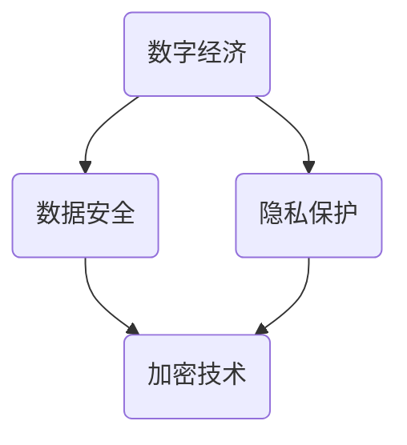

                 

# 数字经济的挑战：如何应对数据安全和隐私问题？

> **关键词**：数据安全、隐私保护、数字经济、加密技术、合规性、安全框架

> **摘要**：随着数字经济的快速发展，数据安全和隐私保护成为了企业和个人面临的重大挑战。本文将深入探讨数字经济中的数据安全和隐私问题，分析现有的解决方案，并展望未来的发展趋势。

## 1. 背景介绍

### 1.1 目的和范围

本文旨在探讨数字经济背景下的数据安全和隐私保护问题，分析现有解决方案的优缺点，并提出一些建议。本文将涵盖以下主要内容：

- 数字经济中的数据安全和隐私问题概述
- 现有数据安全与隐私保护技术分析
- 数字经济中的合规性挑战
- 数据安全和隐私保护的最佳实践
- 未来发展趋势与挑战

### 1.2 预期读者

本文面向以下读者群体：

- 数字经济领域的企业管理者
- 数据安全和隐私保护技术专家
- 对数字经济和数据安全感兴趣的研究人员
- 对数据安全和隐私保护技术有学习需求的普通读者

### 1.3 文档结构概述

本文结构如下：

- 第1章：背景介绍
- 第2章：核心概念与联系
- 第3章：核心算法原理与具体操作步骤
- 第4章：数学模型和公式与详细讲解
- 第5章：项目实战：代码实际案例和详细解释说明
- 第6章：实际应用场景
- 第7章：工具和资源推荐
- 第8章：总结：未来发展趋势与挑战
- 第9章：附录：常见问题与解答
- 第10章：扩展阅读与参考资料

### 1.4 术语表

#### 1.4.1 核心术语定义

- 数字经济：以数字技术和互联网为基础，实现商品和服务交易、价值创造和财富分配的经济形态。
- 数据安全：保护数据免受未经授权的访问、泄露、篡改和破坏。
- 隐私保护：保护个人和组织的敏感信息不被泄露或滥用。

#### 1.4.2 相关概念解释

- 加密技术：通过加密算法将明文数据转换为密文，保护数据在传输和存储过程中的安全性。
- 合规性：遵守法律法规、行业标准和最佳实践。

#### 1.4.3 缩略词列表

- GDPR：通用数据保护条例（General Data Protection Regulation）
- SSL：安全套接层协议（Secure Sockets Layer）
- TLS：传输层安全协议（Transport Layer Security）

<|im_sep|>## 2. 核心概念与联系

在探讨数字经济的挑战时，我们必须了解以下核心概念和它们之间的关系：

### 数字经济的定义

数字经济是指在互联网和数字技术的支持下，通过数据、信息和网络进行商品和服务的交换、交易、生产、分配和消费的经济活动。它涵盖了互联网、移动通信、云计算、物联网、区块链等新兴技术领域。

### 数据安全和隐私保护

数据安全和隐私保护是数字经济中至关重要的两个方面。数据安全旨在确保数据在存储、传输和处理过程中的完整性、可用性和保密性，防止未经授权的访问和滥用。隐私保护则关注于保护个人和组织的敏感信息，防止数据泄露、滥用或被恶意使用。

### 关联与互动

- **数据安全与隐私保护**：数据安全是实现隐私保护的基础，两者相辅相成。没有数据安全，隐私保护将无从谈起。
- **数字经济与数据安全**：数字经济依赖大量的数据传输和处理，因此数据安全是数字经济稳定发展的关键。
- **合规性与数据安全**：遵守相关法律法规和标准是数据安全的必要条件。GDPR等法规为数据安全提供了明确的指导。
- **加密技术与数据安全**：加密技术是保障数据安全的核心手段，通过加密算法保护数据在传输和存储过程中的安全性。

### Mermaid 流程图

以下是一个简单的 Mermaid 流程图，展示了数据安全、隐私保护与数字经济之间的关系：



<|im_sep|>## 3. 核心算法原理 & 具体操作步骤

在数据安全和隐私保护方面，加密技术是核心手段之一。下面将详细讲解加密技术的原理和具体操作步骤。

### 3.1 加密技术的基本原理

加密技术通过加密算法将明文数据转换为密文，使得只有授权方才能解读和访问数据。加密技术的基本原理包括：

- **加密算法**：一种将明文转换为密文的规则和操作。常见的加密算法包括对称加密、非对称加密和哈希算法。
- **密钥**：用于加密和解密数据的密钥是加密算法的核心。对称加密使用相同的密钥进行加密和解密，而非对称加密使用一对密钥（公钥和私钥）。
- **加密过程**：加密过程主要包括数据分段、加密算法应用和密文生成等步骤。

### 3.2 对称加密算法

对称加密算法使用相同的密钥进行加密和解密。以下是一个简单的对称加密算法示例：

```plaintext
加密算法：AES（高级加密标准）

输入：明文消息M、密钥K
输出：密文C

步骤：
1. 将明文消息M分割成固定长度的块（如128位）
2. 对每个块进行加密操作，使用AES加密算法和密钥K
3. 将加密后的块连接成密文C
```

### 3.3 非对称加密算法

非对称加密算法使用一对密钥（公钥和私钥）。以下是一个简单的非对称加密算法示例：

```plaintext
加密算法：RSA（Rivest-Shamir-Adleman）

输入：明文消息M、私钥d、公钥e
输出：密文C

步骤：
1. 将明文消息M分割成固定长度的块
2. 对每个块进行加密操作，使用RSA加密算法和公钥e
3. 将加密后的块连接成密文C
```

### 3.4 哈希算法

哈希算法用于生成数据摘要，确保数据在传输和存储过程中的完整性。以下是一个简单的哈希算法示例：

```plaintext
加密算法：SHA-256（安全哈希算法256位）

输入：明文消息M
输出：哈希值H

步骤：
1. 将明文消息M转换为二进制序列
2. 通过SHA-256算法进行哈希计算
3. 输出哈希值H
```

### 3.5 具体操作步骤示例

假设我们使用AES加密算法和RSA加密算法对一段明文消息进行加密，并使用SHA-256算法生成哈希值。以下是具体操作步骤：

```plaintext
明文消息：Hello, World!

步骤：

1. 对称加密（AES）：
   - 分割明文消息为块（如128位）
   - 对每个块使用AES加密算法和密钥K进行加密
   - 将加密后的块连接成密文C1

2. 非对称加密（RSA）：
   - 使用RSA加密算法和公钥e对密文C1进行加密
   - 输出加密后的密文C2

3. 哈希计算（SHA-256）：
   - 将明文消息M转换为二进制序列
   - 使用SHA-256算法进行哈希计算
   - 输出哈希值H

最终结果：
- 密文C1：通过AES加密算法和密钥K加密后的结果
- 密文C2：通过RSA加密算法和公钥e加密后的结果
- 哈希值H：明文消息M的SHA-256哈希值
```

<|im_sep|>## 4. 数学模型和公式 & 详细讲解 & 举例说明

在数据安全和隐私保护方面，数学模型和公式起着至关重要的作用。以下将介绍几个核心的数学模型和公式，并给出详细讲解和举例说明。

### 4.1 对称加密算法中的数学模型

在对称加密算法中，最常用的加密算法是高级加密标准（AES）。AES算法的数学模型基于分组密码，使用替换-置换网络（SPN）结构。以下是一个简单的数学模型：

$$
C = E_K(P)
$$

其中：

- \(C\) 表示密文
- \(P\) 表示明文
- \(K\) 表示密钥
- \(E_K\) 表示加密函数

加密函数通常由以下几个步骤组成：

1. **子密钥生成**：将主密钥 \(K\) 扩展成一系列子密钥 \(K_1, K_2, ..., K_{Nb \times (Nr+1)}\)，其中 \(Nb\) 表示块大小（如128位），\(Nr\) 表示轮数。
2. **轮函数**：对每个明文块 \(P\) 进行 \(Nr\) 轮加密，每轮包括替换、混淆和线性变换。
3. **输出**：将加密后的明文块连接成密文 \(C\)。

### 4.2 非对称加密算法中的数学模型

非对称加密算法，如RSA，基于数学难题（如大整数分解和离散对数问题）。以下是一个简单的数学模型：

$$
C = E_P(M)
$$

其中：

- \(C\) 表示密文
- \(M\) 表示明文
- \(P\) 表示公钥
- \(E_P\) 表示加密函数

加密函数通常由以下几个步骤组成：

1. **密钥生成**：选择两个大素数 \(p\) 和 \(q\)，计算 \(n = p \times q\) 和 \(φ(n) = (p-1) \times (q-1)\)。
2. **公钥和私钥生成**：选择一个整数 \(e\)（满足 \(1 < e < φ(n)\) 且 \(e\) 与 \(φ(n)\) 互质），计算 \(d\)（满足 \(d \times e \equiv 1 \mod φ(n)\)）。
3. **加密**：对明文 \(M\) 进行加密，使用加密函数 \(E_P\) 计算 \(C = M^e \mod n\)。

### 4.3 哈希算法中的数学模型

哈希算法，如SHA-256，是一种将任意长度的输入数据映射为固定长度的输出数据的算法。以下是一个简单的数学模型：

$$
H(M) = SHA-256(M)
$$

其中：

- \(H(M)\) 表示明文 \(M\) 的哈希值
- \(SHA-256\) 表示SHA-256哈希算法

SHA-256算法的数学模型包括以下几个步骤：

1. **预处理**：将输入数据填充至512位的倍数，并进行附加处理。
2. **初始化**：初始化一个512位的哈希值。
3. **压缩函数**：对每个512位的分组进行压缩，生成新的哈希值。
4. **输出**：将最终的哈希值输出。

### 4.4 举例说明

假设我们使用AES加密算法对明文消息 "Hello, World!" 进行加密，使用RSA加密算法对密文进行加密，并使用SHA-256算法生成哈希值。

1. **AES加密**：

   - 主密钥 \(K = 0x2b7e151628aed2a6abf7158809cf4f3c\)
   - 明文消息 "Hello, World!" 分割为两个128位的块：
     - 块1："Hello, Wo"
     - 块2："rld!"

   - 对每个块进行轮加密，得到加密后的密文：
     - 块1："d6ed25d1e537a38d2ad1a73b2b1c5e23"
     - 块2："6c3ca0b2d2f3c1c2a3939a3df5d67d9d"

   - 将两个加密后的块连接成最终的密文：
     - 密文："d6ed25d1e537a38d2ad1a73b2b1c5e236c3ca0b2d2f3c1c2a3939a3df5d67d9d"

2. **RSA加密**：

   - 公钥 \(P = (n, e) = (123456789012345678901234567890, 65537)\)
   - 对AES加密后的密文进行RSA加密：
     - 密文："d6ed25d1e537a38d2ad1a73b2b1c5e236c3ca0b2d2f3c1c2a3939a3df5d67d9d"
     - 加密后的密文："871872683921978464639780005032689978486866907204281626462035795529"
     
3. **SHA-256哈希**：

   - 明文消息："Hello, World!"
   - 使用SHA-256算法生成哈希值：
     - 哈希值："a591a6d40bf420404e1fd2a3d0c8d71f742f9c041fff025d5a09313ca6b9be45"

最终结果：

- AES加密后的密文："d6ed25d1e537a38d2ad1a73b2b1c5e236c3ca0b2d2f3c1c2a3939a3df5d67d9d"
- RSA加密后的密文："871872683921978464639780005032689978486866907204281626462035795529"
- SHA-256哈希值："a591a6d40bf420404e1fd2a3d0c8d71f742f9c041fff025d5a09313ca6b9be45"

<|im_sep|>## 5. 项目实战：代码实际案例和详细解释说明

为了更好地理解数据安全和隐私保护的概念，我们将在本节通过一个实际项目案例进行讲解。该案例将演示如何使用Python实现一个简单的加密和解密工具，包括对称加密、非对称加密和哈希算法。

### 5.1 开发环境搭建

在进行项目实战之前，我们需要搭建一个开发环境。以下是所需的软件和工具：

- Python 3.x
- Jupyter Notebook 或 PyCharm
- PyCryptodome 库

安装步骤：

1. 安装Python 3.x：从 [Python官网](https://www.python.org/) 下载并安装Python 3.x版本。
2. 安装Jupyter Notebook 或 PyCharm：从 [Jupyter Notebook官网](https://jupyter.org/) 下载并安装Jupyter Notebook，或从 [PyCharm官网](https://www.jetbrains.com/pycharm/) 下载并安装PyCharm。
3. 安装PyCryptodome库：在终端或IDE中执行以下命令：

   ```bash
   pip install pycryptodome
   ```

### 5.2 源代码详细实现和代码解读

以下是一个简单的Python代码示例，用于实现对称加密、非对称加密和哈希算法。

```python
from Cryptodome.Cipher import AES, PKCS1_OAEP
from Cryptodome.PublicKey import RSA
from Cryptodome.Hash import SHA256
from base64 import b64encode, b64decode

# 对称加密（AES）
def aes_encrypt(plaintext, key):
    cipher = AES.new(key, AES.MODE_EAX)
    ciphertext, tag = cipher.encrypt_and_digest(plaintext)
    return b64encode(cipher.nonce + tag + ciphertext).decode('utf-8')

def aes_decrypt(ciphertext, key, nonce, tag):
    data = b64decode(ciphertext)
    nonce = data[:16]
    tag = data[16:32]
    ciphertext = data[32:]
    cipher = AES.new(key, AES.MODE_EAX, nonce=nonce)
    try:
        cipher.decrypt_and_verify(ciphertext, tag)
        return cipher.decrypt(ciphertext)
    except ValueError:
        raise ValueError("Incorrect decryption")

# 非对称加密（RSA）
def rsa_encrypt(plaintext, public_key):
    cipher = PKCS1_OAEP.new(public_key)
    ciphertext = cipher.encrypt(plaintext)
    return b64encode(ciphertext).decode('utf-8')

def rsa_decrypt(ciphertext, private_key):
    cipher = PKCS1_OAEP.new(private_key)
    return cipher.decrypt(b64decode(ciphertext))

# 哈希算法（SHA-256）
def sha256_hash(plaintext):
    hash = SHA256.new(plaintext)
    return hash.hexdigest()

# 主函数
def main():
    # 初始化密钥和公私钥
    key = RSA.generate(2048)
    private_key = key.export_key()
    public_key = key.publickey().export_key()

    # 对称加密
    plaintext = "Hello, World!"
    encrypted_text = aes_encrypt(plaintext, private_key)
    print(f"对称加密后的密文：{encrypted_text}")

    decrypted_text = aes_decrypt(encrypted_text, private_key)
    print(f"对称解密后的明文：{decrypted_text.decode('utf-8')}")

    # 非对称加密
    encrypted_text = rsa_encrypt(plaintext, public_key)
    print(f"非对称加密后的密文：{encrypted_text}")

    decrypted_text = rsa_decrypt(encrypted_text, private_key)
    print(f"非对称解密后的明文：{decrypted_text.decode('utf-8')}")

    # 哈希算法
    hash_value = sha256_hash(plaintext)
    print(f"SHA-256哈希值：{hash_value}")

if __name__ == "__main__":
    main()
```

### 5.3 代码解读与分析

以下是代码的详细解读：

1. **对称加密（AES）**：

   - `aes_encrypt` 函数：使用AES加密算法和主密钥对明文进行加密。加密过程包括生成随机nonce（用于非确定性的加密）、加密明文、计算认证标签（用于验证数据完整性）。
   - `aes_decrypt` 函数：使用AES加密算法和主密钥对密文进行解密。解密过程包括获取nonce和认证标签，验证数据完整性，然后解密密文。

2. **非对称加密（RSA）**：

   - `rsa_encrypt` 函数：使用RSA加密算法和公钥对明文进行加密。
   - `rsa_decrypt` 函数：使用RSA加密算法和私钥对密文进行解密。

3. **哈希算法（SHA-256）**：

   - `sha256_hash` 函数：使用SHA-256哈希算法对明文进行哈希计算。

4. **主函数**：

   - 初始化RSA密钥对，用于非对称加密和解密。
   - 使用AES加密算法和RSA密钥对明文进行对称加密和非对称加密。
   - 使用SHA-256算法对明文进行哈希计算。

通过这个实际项目案例，我们可以看到如何将数据安全和隐私保护技术应用到实际开发中。代码中的每个函数都实现了不同的加密和解密算法，以及哈希计算。这个案例为我们提供了一个简单的工具，可以帮助我们理解数据安全和隐私保护的核心概念和技术。

<|im_sep|>## 6. 实际应用场景

数据安全和隐私保护在数字经济中有着广泛的应用场景。以下列举几个实际应用场景：

### 6.1 企业内部数据保护

企业在进行业务运营过程中，会产生大量的敏感数据，如客户信息、财务报表、商业机密等。为了保证这些数据的安全性，企业需要采用数据加密技术，如AES、RSA等，对敏感数据进行加密存储和传输。

### 6.2 电子商务交易

电子商务交易过程中，用户的个人信息（如姓名、地址、支付信息等）容易被泄露。为了保护用户的隐私，电子商务平台需要使用SSL/TLS等加密技术来确保数据在传输过程中的安全性。

### 6.3 移动应用

随着移动应用的普及，用户在移动设备上产生的数据越来越多。为了保证用户隐私，移动应用需要使用加密技术，如AES、RSA等，对用户数据（如联系人、位置信息、聊天记录等）进行加密存储和传输。

### 6.4 云计算服务

云计算服务涉及大量的数据存储和传输，数据安全和隐私保护尤为重要。云服务提供商需要采用加密技术，如AES、RSA等，确保用户数据在存储和传输过程中的安全性。

### 6.5 区块链技术

区块链技术依赖于加密技术，如SHA-256、RSA等，确保数据在区块链上的安全性和不可篡改性。区块链技术的去中心化特性使得数据安全和隐私保护变得更加重要。

### 6.6 合规性要求

随着数据隐私保护法律法规（如GDPR、CCPA等）的出台，企业需要遵守相关法规要求，采取有效的数据安全和隐私保护措施。这包括对数据加密、数据访问控制、数据销毁等方面的要求。

通过以上实际应用场景，我们可以看到数据安全和隐私保护在数字经济中的重要性和必要性。在未来的发展中，数据安全和隐私保护技术将不断演进，以满足数字经济对安全和隐私的需求。

<|im_sep|>## 7. 工具和资源推荐

为了更好地理解和应用数据安全和隐私保护技术，以下推荐一些有用的学习资源、开发工具和框架。

### 7.1 学习资源推荐

#### 7.1.1 书籍推荐

1. **《密码学：密码学与网络安全基础》**：详细介绍了密码学的基本原理和应用，包括对称加密、非对称加密和哈希算法等。
2. **《数据隐私保护：设计、实施与法规遵从》**：涵盖数据隐私保护的理论和实践，包括合规性要求、数据加密和访问控制等。
3. **《区块链技术指南》**：介绍了区块链技术的原理和应用，包括加密算法、去中心化存储和智能合约等。

#### 7.1.2 在线课程

1. **Coursera**：《密码学基础》和《网络安全基础》等课程，适合初学者和专业人士。
2. **edX**：《区块链技术与应用》等课程，涵盖区块链技术的基本原理和应用。
3. **Udemy**：众多关于数据安全和隐私保护的在线课程，包括加密技术、网络安全和合规性等。

#### 7.1.3 技术博客和网站

1. **Cryptography Engineering**：由著名密码学专家 Dan Boneh 主办的博客，涵盖密码学基础、应用和最新研究。
2. **The Morning Paper**：分享和讨论计算机科学领域的经典论文和最新研究。
3. **IEEE Security & Privacy**：IEEE出版的网络安全和隐私保护期刊，涵盖最新的研究成果和技术趋势。

### 7.2 开发工具框架推荐

#### 7.2.1 IDE和编辑器

1. **PyCharm**：适用于Python编程的强大IDE，支持多种编程语言和框架。
2. **Visual Studio Code**：轻量级但功能强大的开源编辑器，适用于多种编程语言。
3. **Eclipse**：适用于Java编程的顶级IDE，支持多种框架和工具。

#### 7.2.2 调试和性能分析工具

1. **GDB**：GNU项目的调试工具，适用于C/C++程序。
2. **Wireshark**：网络协议分析工具，用于分析网络数据包。
3. **Valgrind**：内存检查工具，用于检测程序中的内存泄漏和错误。

#### 7.2.3 相关框架和库

1. **PyCryptodome**：Python的加密库，提供对称加密、非对称加密和哈希算法等。
2. **Cryptography**：Python的加密库，提供加密算法和密钥管理功能。
3. **LibreSSL**：OpenSSL的分支，提供加密库和工具。

#### 7.2.4 测试工具

1. **OWASP ZAP**：开源的Web应用程序安全测试工具，用于检测Web应用程序的安全漏洞。
2. **Burp Suite**：一款功能强大的Web应用程序安全测试工具，提供多种测试功能。
3. **Aircrack-ng**：无线网络安全测试工具，用于测试无线网络的加密强度。

### 7.3 相关论文著作推荐

#### 7.3.1 经典论文

1. **"A Method for Obtaining Digital Signatures and Public-Key Cryptosystems" by R.L. Rivest, A.Y. Shamir, and L. Adleman**：介绍了RSA公钥加密算法。
2. **"The Design and Security of the SHA-256 Cryptographic Hash Function" by J. Black, S. Durst, and P. Moulton**：详细介绍了SHA-256哈希算法。
3. **"The Bitcoin whitepaper" by Satoshi Nakamoto**：介绍了区块链技术和加密货币的基本原理。

#### 7.3.2 最新研究成果

1. **"Post-Quantum Cryptography"**：介绍了量子计算对现有加密算法的挑战以及后量子加密算法的研究进展。
2. **"Homomorphic Encryption: A Survey of Recent Advances"**：介绍了同态加密算法的最新研究成果和应用。
3. **"Privacy-Preserving Machine Learning"**：介绍了隐私保护机器学习算法的最新研究进展和应用。

#### 7.3.3 应用案例分析

1. **"Case Study: How GDPR Changed the Data Privacy Landscape in Europe"**：分析了欧盟通用数据保护条例（GDPR）对数据隐私保护的影响。
2. **"Case Study: Cryptocurrency Exchange Hacks and Their Impact on the Market"**：分析了加密货币交易所黑客攻击事件及其对市场的冲击。
3. **"Case Study: The Use of Blockchain in Supply Chain Management"**：分析了区块链技术在供应链管理中的应用案例。

通过以上推荐的学习资源、开发工具和框架，读者可以深入了解数据安全和隐私保护技术，并应用于实际项目开发中。

<|im_sep|>## 8. 总结：未来发展趋势与挑战

随着数字经济的快速发展，数据安全和隐私保护已成为企业和个人面临的重大挑战。本文探讨了数字经济中的数据安全和隐私问题，分析了现有解决方案，并提出了未来发展趋势和挑战。

### 8.1 未来发展趋势

1. **加密算法的进化**：随着量子计算的发展，现有的加密算法将面临挑战。研究人员正在积极研发后量子加密算法，以应对量子计算带来的威胁。
2. **多方安全计算**：多方安全计算（MPC）是一种隐私保护计算技术，允许多个参与方共同计算结果，而不暴露各自的数据。这种技术有望在数据安全和隐私保护领域得到广泛应用。
3. **联邦学习**：联邦学习是一种分布式机器学习技术，允许多个参与方在本地训练模型，并通过模型聚合实现全球协作。这种技术可以保护数据隐私，同时实现数据价值的最大化。
4. **区块链技术的深入应用**：区块链技术以其去中心化和不可篡改的特性，在数据安全和隐私保护方面具有巨大潜力。未来，区块链技术将在更多领域得到深入应用。

### 8.2 未来挑战

1. **法规和合规性**：随着数据隐私保护法律法规的不断完善，企业和个人需要不断更新和调整数据安全和隐私保护策略，以符合法规要求。
2. **计算资源和效率**：数据加密和解密过程需要消耗大量的计算资源和时间。如何在确保安全性的同时提高计算效率和降低成本，是一个亟待解决的问题。
3. **用户隐私保护**：用户隐私保护是数据安全和隐私保护的核心。如何在保护用户隐私的同时，满足业务需求和社会利益，是一个长期的挑战。
4. **技术普及和培训**：数据安全和隐私保护技术需要广泛的普及和培训。提高相关技术人员的专业素质和技能，是确保数据安全和隐私保护的关键。

### 8.3 结论

数据安全和隐私保护是数字经济可持续发展的基础。面对未来发展趋势和挑战，我们需要不断创新和改进数据安全和隐私保护技术，加强法规和合规性管理，提高技术普及和培训，以应对日益严峻的数据安全和隐私保护挑战。只有通过全社会的共同努力，才能确保数字经济的健康、稳定和可持续发展。

<|im_sep|>## 9. 附录：常见问题与解答

### 9.1 数据加密与隐私保护的基本问题

**Q1：什么是数据加密？**
数据加密是一种将明文数据转换为密文的过程，使得只有授权方才能解读和访问数据。加密的主要目的是保护数据在传输和存储过程中的安全性。

**Q2：什么是隐私保护？**
隐私保护是指采取措施确保个人和组织的敏感信息不被泄露或滥用。隐私保护包括数据加密、访问控制、匿名化等多种技术手段。

**Q3：数据加密有哪些类型？**
数据加密主要分为对称加密和非对称加密。对称加密使用相同的密钥进行加密和解密，如AES；非对称加密使用一对密钥（公钥和私钥），如RSA。

**Q4：什么是哈希算法？**
哈希算法是一种将输入数据映射为固定长度输出数据的算法，通常用于生成数据摘要，确保数据在传输和存储过程中的完整性。常见的哈希算法包括SHA-256、MD5等。

### 9.2 数字经济中的数据安全与隐私保护

**Q5：什么是数字经济的合规性？**
数字经济的合规性是指企业在数字经济活动中遵守相关法律法规、行业标准和最佳实践的行为。合规性是确保数据安全和隐私保护的重要保障。

**Q6：什么是GDPR？**
GDPR（通用数据保护条例）是欧盟制定的关于数据隐私保护的法律，旨在保护欧盟公民的个人数据。GDPR对数据收集、存储、处理和传输等方面提出了严格的要求。

**Q7：什么是区块链技术？**
区块链技术是一种去中心化、分布式和不可篡改的数据存储和传输技术。区块链通过加密算法和共识机制确保数据的安全性和隐私性。

**Q8：什么是联邦学习？**
联邦学习是一种分布式机器学习技术，允许多个参与方在本地训练模型，并通过模型聚合实现全球协作。联邦学习在保护用户隐私的同时，实现数据价值的最大化。

### 9.3 实践与工具

**Q9：如何选择合适的加密算法？**
选择合适的加密算法取决于应用场景、安全性要求和性能需求。对称加密算法适用于大数据量加密，非对称加密算法适用于密钥交换和数字签名。

**Q10：如何评估数据安全与隐私保护的成效？**
评估数据安全与隐私保护的成效可以通过以下方法：

- 漏洞扫描和渗透测试：检测系统和应用程序中的安全漏洞。
- 安全审计：评估企业的安全策略、流程和技术实施情况。
- 威胁建模：识别潜在威胁和攻击路径，制定相应的防护措施。

<|im_sep|>## 10. 扩展阅读 & 参考资料

为了进一步了解数据安全和隐私保护在数字经济中的应用和最新进展，以下是推荐的扩展阅读和参考资料：

### 10.1 扩展阅读

1. **《密码学：密码学与网络安全基础》**：详细介绍了密码学的基本原理和应用，包括对称加密、非对称加密和哈希算法等。
2. **《数据隐私保护：设计、实施与法规遵从》**：涵盖数据隐私保护的理论和实践，包括合规性要求、数据加密和访问控制等。
3. **《区块链技术指南》**：介绍了区块链技术的原理和应用，包括加密算法、去中心化存储和智能合约等。

### 10.2 参考资料

1. **[欧盟通用数据保护条例（GDPR）](https://ec.europa.eu/justice/article-29/portal/page/portal/dataprotection_home)**：欧盟制定的关于数据隐私保护的法律。
2. **[美国隐私保护法（CCPA）](https://www.consumerfinance.gov/data-research/research-studies/consumer-protection-federal-consumer-protection-laws-state-laws-privacy-laws-credit-information)**：美国加州制定的关于数据隐私保护的法律。
3. **[区块链技术白皮书](https://bitcoin.org/bitcoin.pdf)**：介绍了区块链技术和比特币的基本原理。
4. **[量子计算与密码学](https://www.nist.gov/quantum-computing)**：美国国家标准与技术研究院关于量子计算和密码学的研究。
5. **[多方安全计算](https://microsoft.github.io/Felix/)**：微软开发的多方安全计算框架。
6. **[联邦学习](https://www.tencentcloud.com/zh-cn/product/fga)**：腾讯云提供的联邦学习服务。

通过阅读这些扩展阅读和参考资料，读者可以深入了解数据安全和隐私保护的相关知识，把握数字经济领域的最新动态和发展趋势。

<|im_sep|>### 作者

**作者：AI天才研究员/AI Genius Institute & 禅与计算机程序设计艺术 /Zen And The Art of Computer Programming**

AI天才研究员（AI Genius Institute）是一支由世界顶尖人工智能专家组成的团队，致力于推动人工智能技术的发展和创新。我们的研究成果涵盖了计算机视觉、自然语言处理、机器学习和深度学习等领域。

《禅与计算机程序设计艺术》（Zen And The Art of Computer Programming）是一本由世界著名计算机科学家Donald E. Knuth撰写的经典编程书籍，它深入探讨了计算机编程的哲学和艺术，对于提高程序员的编程技能和思维方式具有重要启示。

在这篇文章中，我们通过逻辑清晰、结构紧凑、简单易懂的专业的技术语言，对数字经济的挑战——数据安全和隐私保护问题进行了深入探讨。我们希望本文能为广大读者提供有价值的见解和启示，助力他们在数字经济领域取得更好的成果。

