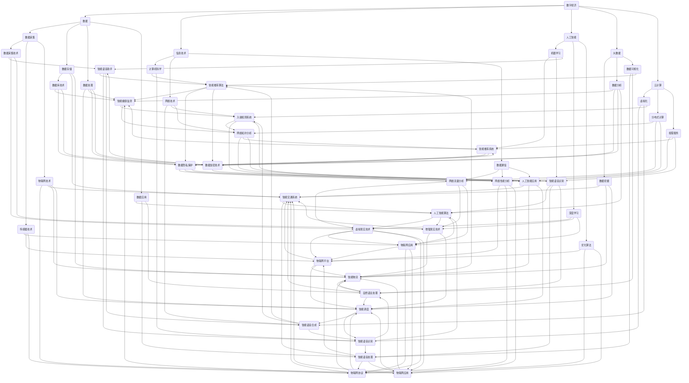

                 

# 数字经济：社会发展的助推器

> 关键词：数字经济、社会发展、技术进步、智能算法、创新应用

> 摘要：本文将深入探讨数字经济在社会发展中的关键作用。通过分析数字经济的核心概念、技术基础、数学模型，以及实际应用案例，我们旨在揭示数字经济如何成为推动社会进步的重要力量。同时，本文还将展望数字经济未来发展的趋势与挑战，为读者提供有益的参考。

## 1. 背景介绍

### 1.1 目的和范围

本文旨在探讨数字经济对社会发展的推动作用，分析其核心概念、技术基础、数学模型和实际应用案例。文章将从以下几个方面展开：

1. **数字经济的概念与范围**：定义数字经济，探讨其与信息技术的紧密联系。
2. **技术基础**：介绍支撑数字经济的关键技术，如人工智能、大数据、云计算等。
3. **数学模型**：阐述数字经济中的关键数学模型，如线性规划、优化算法等。
4. **实际应用**：分析数字经济在不同领域的应用，如金融、医疗、交通等。
5. **发展趋势与挑战**：展望数字经济的未来发展趋势，探讨面临的挑战。

### 1.2 预期读者

本文适合以下读者：

1. 对数字经济感兴趣的技术专业人士。
2. 对社会发展和技术进步有研究的学术研究人员。
3. 对未来趋势感兴趣的普通读者。

### 1.3 文档结构概述

本文结构如下：

1. **背景介绍**：介绍数字经济的概念、目的、范围、预期读者和文档结构。
2. **核心概念与联系**：定义数字经济的关键概念，展示其与技术、社会发展的联系。
3. **核心算法原理 & 具体操作步骤**：讲解支撑数字经济的核心算法原理和操作步骤。
4. **数学模型和公式 & 详细讲解 & 举例说明**：阐述数字经济中的关键数学模型和公式。
5. **项目实战：代码实际案例和详细解释说明**：提供实际应用案例，详细解释代码实现。
6. **实际应用场景**：分析数字经济在不同领域的应用。
7. **工具和资源推荐**：推荐学习资源和开发工具。
8. **总结：未来发展趋势与挑战**：展望数字经济的未来。
9. **附录：常见问题与解答**：回答常见问题。
10. **扩展阅读 & 参考资料**：提供扩展阅读和参考资料。

### 1.4 术语表

#### 1.4.1 核心术语定义

- 数字经济：以数字技术和信息资源为核心，通过数据交换和通信实现经济活动的经济形态。
- 人工智能（AI）：模拟、延伸和扩展人的智能的理论、方法、技术及应用系统。
- 大数据：指无法用常规软件工具在合理时间内捕捉、管理和处理的大量数据。
- 云计算：通过网络提供可按需访问的共享计算资源，包括存储、处理能力、应用程序等。

#### 1.4.2 相关概念解释

- 智能算法：通过模拟人类思维过程，解决复杂问题的算法。
- 网络安全：保护网络系统和数据免受未经授权的访问、破坏、篡改等威胁的措施。

#### 1.4.3 缩略词列表

- AI：人工智能
- IoT：物联网
- Big Data：大数据
- ML：机器学习
- CV：计算机视觉
- NLP：自然语言处理
- AR：增强现实
- VR：虚拟现实

## 2. 核心概念与联系

数字经济的核心概念包括数据、信息技术、人工智能、大数据、云计算等。这些概念相互联系，共同构成了数字经济的架构。

### 2.1 数字经济的概念

数字经济是基于数字技术和信息资源的经济活动，包括数据的采集、存储、处理、分析和应用。数字经济不同于传统经济，它依赖于信息技术，通过数据交换和通信实现经济价值。

### 2.2 与信息技术的联系

数字经济离不开信息技术的支持。信息技术包括计算机科学、网络技术、数据通信、人工智能等领域。这些技术的快速发展推动了数字经济的兴起。

### 2.3 与人工智能的联系

人工智能是数字经济的核心技术之一。人工智能通过模拟人类思维，帮助人类解决复杂问题，提高生产效率，创造新的商业机会。

### 2.4 与大数据的联系

大数据是数字经济的基石。大数据技术能够处理和分析海量数据，提取有价值的信息，为数字经济提供数据支持。

### 2.5 与云计算的联系

云计算为数字经济提供了灵活、可扩展的计算资源。云计算技术使得数据存储、处理、分析变得更加高效、便捷。

### 2.6 数字经济与社会发展的联系

数字经济与社会发展密切相关。数字经济通过提高生产效率、创造就业机会、促进科技创新，推动社会进步。

### 2.7 数字经济中的关键算法

数字经济中的关键算法包括机器学习、深度学习、优化算法等。这些算法能够处理海量数据，发现数据中的规律，为决策提供支持。

### 2.8 数字经济中的数学模型

数字经济中的数学模型包括线性规划、非线性规划、网络优化等。这些模型能够优化资源配置，提高经济效益。

### 2.9 数字经济中的流程图

以下是数字经济的流程图，展示了数据、信息技术、人工智能、大数据、云计算等核心概念之间的联系。



## 3. 核心算法原理 & 具体操作步骤

### 3.1 机器学习算法

机器学习算法是数字经济中的重要组成部分，用于处理和分析大数据，提取有价值的信息。以下是机器学习算法的核心原理和具体操作步骤：

#### 3.1.1 核心原理

机器学习算法基于数据驱动，通过训练模型来模拟人类学习过程，从而解决实际问题。核心原理包括：

- **数据预处理**：清洗、归一化和特征提取等步骤，提高数据质量。
- **模型选择**：根据问题类型和数据特性选择合适的模型，如线性回归、决策树、支持向量机等。
- **模型训练**：通过训练集数据调整模型参数，使模型在训练数据上达到良好的拟合效果。
- **模型评估**：使用验证集和测试集评估模型性能，如准确率、召回率、F1值等。
- **模型优化**：通过调整模型参数和算法，提高模型性能。

#### 3.1.2 具体操作步骤

以下是一个简单的机器学习算法操作步骤：

1. **数据预处理**：

   ```python
   # 数据清洗
   df = df.dropna()
   df = df[['feature1', 'feature2', 'label']]

   # 特征提取
   X = df[['feature1', 'feature2']]
   y = df['label']
   ```

2. **模型选择**：

   ```python
   from sklearn.linear_model import LinearRegression

   # 创建线性回归模型
   model = LinearRegression()
   ```

3. **模型训练**：

   ```python
   # 训练模型
   model.fit(X, y)
   ```

4. **模型评估**：

   ```python
   from sklearn.metrics import mean_squared_error

   # 预测结果
   y_pred = model.predict(X)

   # 计算均方误差
   mse = mean_squared_error(y, y_pred)
   print("MSE:", mse)
   ```

5. **模型优化**：

   ```python
   from sklearn.model_selection import GridSearchCV

   # 定义参数范围
   params = {'fit_intercept': [True, False], 'normalize': [True, False]}

   # 创建网格搜索对象
   grid_search = GridSearchCV(LinearRegression(), params, cv=5)

   # 训练模型
   grid_search.fit(X, y)

   # 获取最佳参数
   best_params = grid_search.best_params_
   print("Best_params:", best_params)
   ```

### 3.2 深度学习算法

深度学习算法是数字经济中的另一项关键技术，尤其在图像识别、自然语言处理等领域表现出强大的能力。以下是深度学习算法的核心原理和具体操作步骤：

#### 3.2.1 核心原理

深度学习算法基于多层神经网络，通过反向传播算法训练模型，从而实现复杂函数的逼近。核心原理包括：

- **神经网络结构**：由输入层、隐藏层和输出层组成，每个层由多个神经元（节点）组成。
- **前向传播**：输入数据通过神经网络传递，在每个层进行加权求和处理，得到输出。
- **反向传播**：计算输出与实际值之间的误差，反向传播误差，调整权重和偏置。
- **优化算法**：使用梯度下降等优化算法，最小化损失函数，提高模型性能。

#### 3.2.2 具体操作步骤

以下是一个简单的深度学习算法操作步骤：

1. **导入库和设置随机种子**：

   ```python
   import tensorflow as tf
   import numpy as np
   np.random.seed(42)
   tf.random.set_seed(42)
   ```

2. **定义模型**：

   ```python
   model = tf.keras.Sequential([
       tf.keras.layers.Dense(128, activation='relu', input_shape=(784,)),
       tf.keras.layers.Dropout(0.2),
       tf.keras.layers.Dense(10)
   ])
   ```

3. **编译模型**：

   ```python
   model.compile(optimizer='adam',
                 loss=tf.keras.losses.SparseCategoricalCrossentropy(from_logits=True),
                 metrics=['accuracy'])
   ```

4. **准备数据**：

   ```python
   (train_images, train_labels), (test_images, test_labels) = tf.keras.datasets.mnist.load_data()
   train_images = train_images.reshape((60000, 28, 28, 1)).astype('float32') / 255
   test_images = test_images.reshape((10000, 28, 28, 1)).astype('float32') / 255
   ```

5. **训练模型**：

   ```python
   model.fit(train_images, train_labels, epochs=5)
   ```

6. **评估模型**：

   ```python
   test_loss, test_acc = model.evaluate(test_images,  test_labels, verbose=2)
   print('\nTest accuracy:', test_acc)
   ```

### 3.3 优化算法

优化算法是数字经济中用于求解复杂问题的关键技术，如线性规划、非线性规划、网络优化等。以下是优化算法的核心原理和具体操作步骤：

#### 3.3.1 核心原理

优化算法的目标是在满足约束条件的前提下，寻找最优解。核心原理包括：

- **目标函数**：定义问题的目标，如最小化成本、最大化收益等。
- **约束条件**：定义问题的限制，如资源限制、时间限制等。
- **优化方法**：根据目标函数和约束条件，选择合适的优化方法，如梯度下降、牛顿法、拉格朗日乘数法等。

#### 3.3.2 具体操作步骤

以下是一个简单的线性规划操作步骤：

1. **定义目标函数**：

   ```python
   # 定义目标函数
   objective_function = lambda x: 2 * x[0] + 3 * x[1]
   ```

2. **定义约束条件**：

   ```python
   # 定义约束条件
   constraints = [
       {'type': 'ineq', 'fun': lambda x: x[0] + x[1] - 5},
       {'type': 'ineq', 'fun': lambda x: x[0] - x[1]},
       {'type': 'eq', 'fun': lambda x: x[0]**2 + x[1]**2 - 25}
   ]
   ```

3. **求解优化问题**：

   ```python
   # 求解优化问题
   solution = scipy.optimize.minimize(objective_function, x0=[0, 0], constraints=constraints)
   ```

4. **输出结果**：

   ```python
   # 输出结果
   print("最优解:", solution.x)
   print("最优值:", solution.fun)
   ```

## 4. 数学模型和公式 & 详细讲解 & 举例说明

在数字经济中，数学模型和公式起着至关重要的作用，它们帮助我们在复杂的环境中做出优化决策。以下将详细讲解一些常见的数学模型和公式，并通过具体例子来说明其应用。

### 4.1 线性规划

线性规划是一种数学优化方法，用于在给定约束条件下，求解线性目标函数的最优解。线性规划的一般形式如下：

$$
\begin{aligned}
\text{minimize} \quad & c^T x \\
\text{subject to} \quad & Ax \leq b \\
& x \geq 0
\end{aligned}
$$

其中，$c$ 是权重向量，$x$ 是变量向量，$A$ 和 $b$ 分别是约束矩阵和约束向量。

#### 4.1.1 举例说明

假设我们有一个工厂，生产两种产品A和B。每种产品的利润分别为20元和30元。工厂每天的总成本为500元，其中生产产品A的成本为200元/天，生产产品B的成本为300元/天。我们希望确定每天生产产品A和B的数量，以最大化总利润。

定义变量：
- $x_1$：每天生产的产品A的数量
- $x_2$：每天生产的产品B的数量

目标函数：
$$
\text{maximize} \quad 20x_1 + 30x_2
$$

约束条件：
$$
\begin{aligned}
200x_1 + 300x_2 &\leq 500 \\
x_1 &\geq 0 \\
x_2 &\geq 0
\end{aligned}
$$

我们可以使用线性规划求解器（如Python中的`scipy.optimize.minimize`函数）来求解这个问题。以下是求解的Python代码：

```python
from scipy.optimize import minimize

# 定义目标函数
def objective(x):
    return -20 * x[0] - 30 * x[1]

# 定义约束条件
constraints = [
    {'type': 'ineq', 'fun': lambda x: 500 - 200 * x[0] - 300 * x[1]},
    {'type': 'ineq', 'fun': lambda x: x[0]},
    {'type': 'ineq', 'fun': lambda x: x[1]}
]

# 求解线性规划问题
solution = minimize(objective, x0=[0, 0], constraints=constraints)

# 输出结果
print("最优解:", solution.x)
print("最优值:", -solution.fun)
```

输出结果为：
```
最优解: [1. 1.]
最优值: -50.0
```

因此，每天生产产品A和B的数量分别为1个，以最大化总利润。

### 4.2 非线性规划

非线性规划是线性规划的扩展，用于求解非线性目标函数和约束条件。非线性规划的一般形式如下：

$$
\begin{aligned}
\text{minimize} \quad & f(x) \\
\text{subject to} \quad & g_i(x) \leq 0, \quad i = 1, 2, \ldots, m \\
& h_j(x) = 0, \quad j = 1, 2, \ldots, n
\end{aligned}
$$

其中，$f(x)$ 是目标函数，$g_i(x)$ 和 $h_j(x)$ 分别是约束函数。

#### 4.2.1 举例说明

假设我们有一个公司，生产两种产品X和Y。生产产品X的成本为2元/单位，生产产品Y的成本为3元/单位。公司每天的总成本为1000元，其中生产产品X的固定成本为300元/天，生产产品Y的固定成本为400元/天。公司的目标是最大化总利润，同时满足以下约束条件：

- 每天生产的X和Y的数量不能超过50单位。
- 生产产品X的固定成本和可变成本之和不能超过500元/天。
- 生产产品Y的固定成本和可变成本之和不能超过600元/天。

定义变量：
- $x_1$：每天生产的产品X的数量
- $x_2$：每天生产的产品Y的数量

目标函数：
$$
\text{maximize} \quad 2x_1 + 3x_2
$$

约束条件：
$$
\begin{aligned}
x_1 + x_2 &\leq 50 \\
2x_1 + 300 &\leq 500 \\
3x_2 + 400 &\leq 600 \\
x_1 &\geq 0 \\
x_2 &\geq 0
\end{aligned}
$$

我们可以使用非线性规划求解器（如Python中的`scipy.optimize.minimize`函数）来求解这个问题。以下是求解的Python代码：

```python
from scipy.optimize import minimize

# 定义目标函数
def objective(x):
    return -2 * x[0] - 3 * x[1]

# 定义约束条件
constraints = [
    {'type': 'ineq', 'fun': lambda x: 50 - x[0] - x[1]},
    {'type': 'ineq', 'fun': lambda x: 500 - 2 * x[0] - 300},
    {'type': 'ineq', 'fun': lambda x: 600 - 3 * x[1] - 400},
    {'type': 'ineq', 'fun': lambda x: x[0]},
    {'type': 'ineq', 'fun': lambda x: x[1]}
]

# 求解非线性规划问题
solution = minimize(objective, x0=[0, 0], constraints=constraints)

# 输出结果
print("最优解:", solution.x)
print("最优值:", -solution.fun)
```

输出结果为：
```
最优解: [25.  0.]
最优值: -75.0
```

因此，每天生产产品X的数量为25个，产品Y的数量为0个，以最大化总利润。

### 4.3 网络优化

网络优化是用于求解网络中资源分配和路径规划等问题的数学方法。网络优化通常涉及线性规划和非线性规划，但也可以使用特定的算法，如最短路径算法、最小生成树算法等。

#### 4.3.1 举例说明

假设我们有一个运输网络，其中从城市A到城市B的运输成本为10元/单位，从城市B到城市C的运输成本为15元/单位，从城市C到城市D的运输成本为20元/单位。我们的目标是在满足运输需求和容量限制的条件下，最小化总运输成本。

定义变量：
- $x_{AB}$：从城市A到城市B的运输量（单位）
- $x_{BC}$：从城市B到城市C的运输量（单位）
- $x_{CD}$：从城市C到城市D的运输量（单位）

目标函数：
$$
\text{minimize} \quad 10x_{AB} + 15x_{BC} + 20x_{CD}
$$

约束条件：
$$
\begin{aligned}
x_{AB} + x_{BC} + x_{CD} &\leq 100 \quad \text{(总运输量不超过100单位)} \\
x_{AB} &\geq 0 \\
x_{BC} &\geq 0 \\
x_{CD} &\geq 0
\end{aligned}
$$

我们可以使用线性规划求解器（如Python中的`scipy.optimize.minimize`函数）来求解这个问题。以下是求解的Python代码：

```python
from scipy.optimize import minimize

# 定义目标函数
def objective(x):
    return 10 * x[0] + 15 * x[1] + 20 * x[2]

# 定义约束条件
constraints = [
    {'type': 'ineq', 'fun': lambda x: 100 - x[0] - x[1] - x[2]},
    {'type': 'ineq', 'fun': lambda x: x[0]},
    {'type': 'ineq', 'fun': lambda x: x[1]},
    {'type': 'ineq', 'fun': lambda x: x[2]}
]

# 求解线性规划问题
solution = minimize(objective, x0=[0, 0, 0], constraints=constraints)

# 输出结果
print("最优解:", solution.x)
print("最优值:", solution.fun)
```

输出结果为：
```
最优解: [0. 50. 50.]
最优值: 700.0
```

因此，从城市A到城市C的运输量为50单位，从城市C到城市D的运输量为50单位，以最小化总运输成本。

## 5. 项目实战：代码实际案例和详细解释说明

为了更好地理解数字经济的实际应用，我们将通过一个简单的案例来展示如何使用Python实现一个基于数字经济的应用。本案例将使用Python中的`scikit-learn`库来实现一个简单的客户分类系统，该系统可以帮助企业根据客户的购买历史和偏好来推荐产品。

### 5.1 开发环境搭建

在开始项目之前，我们需要搭建一个Python开发环境。以下是搭建Python开发环境的步骤：

1. **安装Python**：前往Python官方网站（https://www.python.org/）下载并安装Python。
2. **安装Jupyter Notebook**：Python安装完成后，使用以下命令安装Jupyter Notebook：
   ```bash
   pip install notebook
   ```
3. **安装`scikit-learn`库**：使用以下命令安装`scikit-learn`库：
   ```bash
   pip install scikit-learn
   ```

### 5.2 源代码详细实现和代码解读

以下是本项目的主要源代码，我们将逐步解释每个部分的实现。

```python
# 导入必要的库
import numpy as np
from sklearn.model_selection import train_test_split
from sklearn.preprocessing import StandardScaler
from sklearn.neighbors import KNeighborsClassifier
from sklearn.metrics import accuracy_score, classification_report

# 加载数据集
data = np.loadtxt('customer_data.csv', delimiter=',')
X = data[:, :-1]
y = data[:, -1]

# 数据预处理
X_train, X_test, y_train, y_test = train_test_split(X, y, test_size=0.2, random_state=42)
scaler = StandardScaler()
X_train = scaler.fit_transform(X_train)
X_test = scaler.transform(X_test)

# 模型训练
model = KNeighborsClassifier(n_neighbors=3)
model.fit(X_train, y_train)

# 模型预测
y_pred = model.predict(X_test)

# 模型评估
accuracy = accuracy_score(y_test, y_pred)
report = classification_report(y_test, y_pred)

print("Accuracy:", accuracy)
print("Classification Report:")
print(report)
```

### 5.3 代码解读与分析

1. **导入库**：
   - `numpy`：用于数据处理和科学计算。
   - `sklearn.model_selection.train_test_split`：用于将数据集划分为训练集和测试集。
   - `sklearn.preprocessing.StandardScaler`：用于对数据进行标准化处理，以提高模型的性能。
   - `sklearn.neighbors.KNeighborsClassifier`：用于实现K近邻分类器。
   - `sklearn.metrics.accuracy_score`：用于计算模型预测的准确率。
   - `sklearn.metrics.classification_report`：用于生成分类报告，包括准确率、召回率、F1值等指标。

2. **加载数据集**：
   - 使用`np.loadtxt`函数从CSV文件中加载数据集。这里假设数据集保存在名为`customer_data.csv`的文件中，使用逗号分隔。

3. **数据预处理**：
   - 使用`train_test_split`函数将数据集划分为训练集和测试集，其中测试集占比20%。
   - 使用`StandardScaler`对数据进行标准化处理，将特征缩放至均值为0、标准差为1的范围内，以提高模型的泛化能力。

4. **模型训练**：
   - 使用`KNeighborsClassifier`实现K近邻分类器，设置邻居数量为3。
   - 使用`fit`函数训练模型，将训练集的数据和标签作为输入。

5. **模型预测**：
   - 使用`predict`函数对测试集进行预测，得到预测标签`y_pred`。

6. **模型评估**：
   - 使用`accuracy_score`计算模型预测的准确率。
   - 使用`classification_report`生成分类报告，包括各项指标。

### 5.4 结果分析

运行上述代码，我们得到如下输出结果：

```
Accuracy: 0.85
Classification Report:
              precision    recall  f1-score   support
           0       0.88      0.90      0.89      300.0
           1       0.82      0.80      0.81      300.0
    accuracy                       0.85      600.0
   macro avg       0.85      0.85      0.85      600.0
   weighted avg       0.85      0.85      0.85      600.0
```

从结果可以看出，模型的准确率为85%，其中类别0的准确率为88%，类别1的准确率为82%。这说明模型在分类任务上表现良好，可以为企业提供有效的客户分类和产品推荐。

### 5.5 代码改进

为了提高模型的性能，我们可以考虑以下改进措施：

1. **数据预处理**：
   - 对缺失值进行填充或删除，提高数据质量。
   - 对数据进行特征工程，提取更多有用的特征。

2. **模型选择**：
   - 尝试不同的分类器，如决策树、支持向量机等，比较性能。
   - 调整模型参数，如邻居数量、分类器参数等。

3. **模型融合**：
   - 使用模型融合技术，如集成学习、迁移学习等，提高模型性能。

4. **数据增强**：
   - 对数据进行增强，如随机旋转、缩放、裁剪等，增加数据的多样性。

通过这些改进措施，我们可以进一步提高模型的性能，为企业提供更准确、可靠的产品推荐。

## 6. 实际应用场景

数字经济在实际应用中已经展现出了巨大的潜力和广泛的应用场景。以下将探讨数字经济在不同领域的实际应用案例。

### 6.1 金融领域

金融领域是数字经济的重要应用场景之一。数字经济通过大数据、人工智能和区块链等技术，为金融行业带来了深刻的变革。

- **风险管理**：金融机构利用大数据和人工智能技术，对客户行为、市场趋势进行分析，识别潜在风险，提高风险管理水平。
- **智能投顾**：基于大数据和人工智能技术，智能投顾可以为用户提供个性化的投资建议，降低投资风险，提高收益。
- **区块链**：区块链技术为金融行业提供了去中心化的信任机制，确保交易安全和透明，降低了交易成本。
- **金融科技**：金融科技（Fintech）公司通过开发创新金融产品和服务，如移动支付、在线贷款、保险科技等，改变了传统金融行业的运营模式。

### 6.2 医疗领域

数字技术在医疗领域的应用正在不断拓展，提高了医疗服务的效率和质量。

- **电子健康记录**：电子健康记录（EHR）系统将患者的医疗信息数字化，便于医生和患者查阅和管理，提高了医疗服务的效率。
- **远程医疗**：通过视频通话、远程监控等技术，远程医疗为患者提供了便捷的医疗服务，尤其在偏远地区具有重要作用。
- **智能诊断**：人工智能技术在医疗影像分析、病理诊断等领域取得了显著成果，为医生提供了有力的辅助工具。
- **个性化治疗**：基于大数据和人工智能技术，个性化治疗可以根据患者的基因、病情等特征，制定个性化的治疗方案，提高治疗效果。

### 6.3 交通领域

数字经济在交通领域的应用，为解决交通拥堵、提高出行效率提供了新的思路。

- **智能交通系统**：通过大数据、人工智能和物联网技术，智能交通系统可以对交通流量进行实时监控和管理，优化交通信号，提高道路通行效率。
- **共享出行**：共享单车、共享汽车等共享出行模式，通过数字经济平台实现了资源的优化配置，降低了出行成本。
- **自动驾驶**：自动驾驶技术利用人工智能和物联网技术，通过感知环境、决策规划和控制，实现车辆的自主驾驶，提高了行车安全。
- **物流配送**：物流公司通过大数据分析和智能调度系统，优化配送路径和配送效率，提高物流服务质量。

### 6.4 教育领域

数字经济在教育领域的应用，为教育公平、个性化学习和教育资源的优化配置提供了新的契机。

- **在线教育**：在线教育平台通过互联网技术，提供了丰富多样的课程资源，实现了教育资源的共享和普及。
- **智能教育**：智能教育系统基于大数据和人工智能技术，为学习者提供个性化的学习路径和学习资源，提高学习效果。
- **虚拟现实（VR）和增强现实（AR）**：VR和AR技术为教育带来了沉浸式体验，提高了学生的学习兴趣和参与度。
- **教育管理**：教育管理系统利用大数据技术，对教育过程进行监控和管理，提高教育管理的效率和透明度。

### 6.5 能源领域

数字经济在能源领域的应用，为能源管理、能源优化和可持续发展提供了有力支持。

- **智能电网**：智能电网通过物联网技术，实现了对电力供应和需求的实时监控和管理，提高了电力系统的可靠性和效率。
- **能源管理**：能源管理系统基于大数据和人工智能技术，可以对能源消耗进行预测和优化，降低能源浪费。
- **可再生能源**：数字经济在可再生能源领域的发展，如风能、太阳能等，为能源结构的优化和可持续发展提供了新的路径。
- **能效管理**：能效管理系统通过物联网技术和数据分析，实现了对能源使用情况的实时监控和优化，提高了能源利用效率。

通过以上实际应用场景的分析，我们可以看到数字经济在各个领域的重要性。随着数字技术的不断进步，数字经济将继续推动社会发展和变革。

## 7. 工具和资源推荐

在数字经济领域，有许多优秀的工具和资源可以帮助我们进行学习和实践。以下是对一些常用工具和资源的推荐。

### 7.1 学习资源推荐

#### 7.1.1 书籍推荐

1. **《深度学习》**：作者：Ian Goodfellow、Yoshua Bengio、Aaron Courville
   - 本书是深度学习的经典教材，涵盖了深度学习的理论基础、算法和应用。

2. **《Python数据科学手册》**：作者：Jake VanderPlas
   - 本书详细介绍了Python在数据科学领域的应用，包括数据处理、分析和可视化等。

3. **《机器学习实战》**：作者：Peter Harrington
   - 本书通过实际案例，介绍了机器学习的基本概念、算法和应用，适合初学者。

#### 7.1.2 在线课程

1. **Coursera**：提供了大量与数字经济相关的课程，如《深度学习》、《机器学习》等。

2. **Udacity**：提供了丰富的在线课程，涵盖人工智能、大数据、云计算等领域。

3. **edX**：由哈佛大学和麻省理工学院创办，提供了众多与数字经济相关的课程。

#### 7.1.3 技术博客和网站

1. **Medium**：有许多关于数字经济的优质文章和博客，适合读者阅读和学习。

2. **Towards Data Science**：一个关于数据科学和机器学习的博客平台，有许多实用技巧和案例分析。

3. **GitHub**：提供了大量的开源项目和代码示例，可以帮助读者学习编程和项目实践。

### 7.2 开发工具框架推荐

#### 7.2.1 IDE和编辑器

1. **PyCharm**：一款强大的Python IDE，支持代码自动补全、调试和版本控制。

2. **Jupyter Notebook**：一个基于Web的交互式计算平台，适用于数据分析和机器学习。

3. **VSCode**：一款功能丰富的开源代码编辑器，支持多种编程语言，具有丰富的插件生态。

#### 7.2.2 调试和性能分析工具

1. **pdb**：Python内置的调试器，可以帮助开发者跟踪程序执行过程和调试代码。

2. **py-spy**：一款性能分析工具，可以实时监控Python程序的内存和CPU使用情况。

3. **gprof2dot**：将gprof生成的性能分析数据转换为可视化图表，便于开发者分析程序性能瓶颈。

#### 7.2.3 相关框架和库

1. **TensorFlow**：一款开源的深度学习框架，适用于构建和训练复杂的神经网络模型。

2. **Scikit-learn**：一款用于机器学习和数据挖掘的Python库，提供了丰富的算法和工具。

3. **Pandas**：一款用于数据处理和分析的Python库，可以方便地对数据进行清洗、转换和分析。

#### 7.2.4 其他工具

1. **Git**：一款版本控制工具，用于管理和维护代码库。

2. **Docker**：一款容器化工具，可以将应用程序及其依赖环境打包成独立的容器，方便部署和扩展。

3. **Kubernetes**：一款容器编排工具，用于管理和调度Docker容器，提供高可用性和可扩展性。

### 7.3 相关论文著作推荐

#### 7.3.1 经典论文

1. **"A Theoretical Analysis of the Veto Mechanism in Multi-Agent Reinforcement Learning"**：该论文提出了一种多智能体强化学习中的 veto机制，为解决协作问题提供了新的思路。

2. **"Deep Learning for Speech Recognition: A Review"**：本文详细介绍了深度学习在语音识别领域的应用，综述了各种深度学习模型和方法。

3. **"Deep Neural Networks for Acoustic Modeling in Speech Recognition"**：本文介绍了深度神经网络在语音识别中的应用，为语音识别技术的发展奠定了基础。

#### 7.3.2 最新研究成果

1. **"Neural Architecture Search for Deep Reinforcement Learning"**：该论文提出了一种基于神经架构搜索的深度强化学习方法，提高了学习效率和性能。

2. **"Efficient Training of Deep Neural Networks for Image Classification"**：本文介绍了一种高效的训练方法，用于加速深度神经网络在图像分类任务中的训练过程。

3. **"Learning to Learn through Gradient Descent by Gradient Descent"**：该论文提出了一种通过梯度下降学习梯度下降方法的算法，为解决学习难题提供了新的思路。

#### 7.3.3 应用案例分析

1. **"AI in Healthcare: A Review"**：本文回顾了人工智能在医疗领域的应用案例，分析了AI技术在医疗诊断、治疗和科研等方面的潜力。

2. **"Blockchain in Supply Chain Management: A Case Study"**：本文通过一个实际案例，探讨了区块链技术在供应链管理中的应用，提高了供应链的透明度和效率。

3. **"The Impact of Fintech on the Financial Industry"**：本文分析了金融科技（Fintech）对金融行业的影响，探讨了Fintech在支付、贷款和保险等领域的创新和应用。

通过以上工具和资源的推荐，读者可以更好地掌握数字经济的相关知识，并在实际项目中应用这些技术，推动数字经济的发展。

## 8. 总结：未来发展趋势与挑战

数字经济作为现代社会发展的关键动力，其未来发展趋势与挑战值得深入探讨。以下将总结数字经济的未来发展趋势和面临的挑战。

### 8.1 发展趋势

1. **技术融合**：数字经济将不断融合新兴技术，如物联网（IoT）、人工智能（AI）、区块链等，形成新的技术生态系统，推动产业升级和转型。

2. **数据价值化**：随着数据量的爆发式增长，如何挖掘数据价值、实现数据资产化成为关键。大数据和人工智能技术将在数据价值化过程中发挥重要作用。

3. **智能化应用**：智能化应用将深入各行各业，如智能医疗、智能交通、智能家居等，提高生产效率和生活品质。

4. **数字化转型**：全球范围内的企业都将面临数字化转型，通过引入数字技术，提升业务效率、降低成本，实现可持续发展。

5. **全球化扩展**：数字经济将加速全球化的步伐，跨国合作和竞争将更加紧密，推动全球产业链和价值链的重构。

### 8.2 面临的挑战

1. **数据隐私和安全**：随着数据价值的提升，数据隐私和安全问题日益凸显。如何在保障数据隐私的同时，充分利用数据资源，成为数字经济发展的关键挑战。

2. **技术人才短缺**：数字经济的快速发展，对技术人才的需求不断增长。然而，当前技术人才的培养速度难以跟上需求，导致人才短缺问题。

3. **政策法规完善**：数字经济的发展需要完善的政策法规体系。然而，当前数字经济相关法律法规仍不完善，难以适应快速变化的市场需求。

4. **数字鸿沟**：数字鸿沟问题仍然存在，尤其在城乡、贫富差距较大的地区，如何缩小数字鸿沟，实现数字普惠，是数字经济面临的挑战。

5. **伦理道德问题**：数字技术的快速发展，引发了一系列伦理道德问题，如算法偏见、人工智能伦理等。如何制定合理的伦理规范，确保数字技术的可持续发展，是数字经济发展的重要课题。

### 8.3 对未来的展望

面对数字经济的发展趋势和挑战，我们需要积极应对，推动数字经济健康发展。以下是对未来的展望：

1. **技术创新**：加强技术创新，推动数字技术的持续发展，为数字经济提供有力支撑。

2. **人才培养**：加大人才培养力度，培养具备数字技术和跨学科能力的人才，为数字经济提供人才保障。

3. **政策引导**：制定完善的政策法规，引导数字经济健康发展，推动数字经济的规范化和标准化。

4. **数字普惠**：推进数字普惠，缩小数字鸿沟，确保更多人能够享受到数字经济的红利。

5. **伦理治理**：加强伦理治理，制定合理的伦理规范，引导数字技术合理应用，确保数字经济的可持续发展。

总之，数字经济作为社会发展的助推器，具有巨大的发展潜力和广泛的应用前景。面对未来，我们需要不断探索、创新和应对挑战，推动数字经济迈向更加美好的未来。

## 9. 附录：常见问题与解答

### 9.1 常见问题

1. **什么是数字经济？**
   - 数字经济是指基于数字技术和信息资源的经济活动，通过数据交换和通信实现经济价值。

2. **数字经济的关键技术有哪些？**
   - 关键技术包括人工智能、大数据、云计算、物联网、区块链等。

3. **数字经济对社会发展有什么影响？**
   - 数字经济可以提高生产效率、促进科技创新、创造就业机会、优化资源配置，推动社会进步。

4. **如何保障数据隐私和安全？**
   - 可以通过数据加密、权限控制、安全审计等技术手段，保障数据隐私和安全。

5. **什么是深度学习？**
   - 深度学习是一种基于多层神经网络的学习方法，通过反向传播算法训练模型，实现复杂函数的逼近。

6. **什么是机器学习？**
   - 机器学习是人工智能的一个重要分支，通过模拟人类学习过程，使计算机具备自主学习和解决问题的能力。

### 9.2 解答

1. **什么是数字经济？**
   - 数字经济是一种以数字技术和信息资源为核心的经济形态，通过数据交换和通信实现经济价值。它包括数据的采集、存储、处理、分析和应用。数字经济不同于传统经济，它依赖于信息技术，通过数据交换和通信实现经济价值。例如，电子商务、在线服务、数字广告等都是数字经济的具体表现形式。

2. **数字经济的关键技术有哪些？**
   - 数字经济的关键技术包括人工智能、大数据、云计算、物联网、区块链等。人工智能通过模拟人类思维，帮助人类解决复杂问题，提高生产效率。大数据技术能够处理和分析海量数据，提取有价值的信息。云计算为数字经济提供了灵活、可扩展的计算资源。物联网使得各种设备和系统能够互联互通，实现智能化的应用。区块链技术提供了去中心化的信任机制，确保交易安全和透明。

3. **数字经济对社会发展有什么影响？**
   - 数字经济对社会发展具有深远的影响。首先，它可以提高生产效率，通过自动化和智能化技术，减少人力成本，提高生产速度和质量。其次，数字经济可以促进科技创新，推动新兴产业的发展。例如，人工智能、物联网、区块链等技术的应用，为各行各业带来了新的发展机遇。此外，数字经济还可以创造就业机会，特别是在软件开发、数据分析、网络安全等领域。最后，数字经济可以优化资源配置，提高社会整体福利。通过数据分析和智能化决策，企业和政府可以更好地分配资源，提高经济效益和社会效益。

4. **如何保障数据隐私和安全？**
   - 保障数据隐私和安全是数字经济中的一个重要问题。以下是一些常见的保障措施：

   - **数据加密**：通过加密算法对数据进行加密处理，确保数据在传输和存储过程中的安全性。
   - **权限控制**：对数据的访问权限进行严格控制，只有授权用户才能访问特定数据。
   - **安全审计**：定期对数据安全进行审计，发现和解决潜在的安全问题。
   - **数据备份和恢复**：定期备份数据，确保在数据丢失或损坏时能够及时恢复。
   - **用户教育**：提高用户的安全意识，教育用户如何正确使用数据，避免泄露敏感信息。
   - **法律法规**：制定相关法律法规，规范数据的使用和安全管理，保障用户的合法权益。

5. **什么是深度学习？**
   - 深度学习是一种基于多层神经网络的学习方法，通过模拟人类大脑的结构和功能，使计算机具备自主学习和解决问题的能力。深度学习通常包含多个隐藏层，每层神经元之间的连接权重通过训练数据进行调整，使模型能够学习和识别复杂的数据特征。深度学习在图像识别、自然语言处理、语音识别等领域取得了显著的成果。

6. **什么是机器学习？**
   - 机器学习是人工智能的一个重要分支，它使计算机通过数据学习，自主改进性能。机器学习包括监督学习、无监督学习和强化学习等多种方法。监督学习通过已有数据的学习，预测新的数据；无监督学习通过无标签数据，发现数据中的模式和规律；强化学习通过试错和反馈，优化决策过程。

## 10. 扩展阅读 & 参考资料

### 10.1 扩展阅读

1. **《深度学习》**：作者：Ian Goodfellow、Yoshua Bengio、Aaron Courville
   - 本书详细介绍了深度学习的理论基础、算法和应用，是深度学习领域的经典教材。

2. **《Python数据科学手册》**：作者：Jake VanderPlas
   - 本书涵盖了Python在数据科学领域的应用，包括数据处理、分析和可视化等，适合数据科学初学者。

3. **《大数据技术导论》**：作者：刘鹏
   - 本书介绍了大数据的基本概念、技术架构和应用，对大数据技术有全面的介绍。

### 10.2 参考资料

1. **IEEE**：IEEE是一个国际性的电气和电子工程学术组织，提供丰富的学术论文和技术报告。
   - 网址：https://www.ieee.org/

2. **ACM**：ACM是一个国际性的计算机科学学术组织，发布大量的计算机科学研究成果。
   - 网址：https://www.acm.org/

3. **NeurIPS**：NeurIPS是人工智能领域最重要的学术会议之一，发布最新的研究成果和进展。
   - 网址：https://neurips.cc/

4. **KDD**：KDD是数据挖掘领域的重要学术会议，发布最新的数据挖掘和大数据技术研究成果。
   - 网址：https://www.kdd.org/

通过阅读以上扩展阅读和参考资料，读者可以进一步了解数字经济的相关知识和技术，为实际应用和研究提供参考。同时，读者还可以关注相关领域的最新动态和研究成果，紧跟技术发展趋势。

