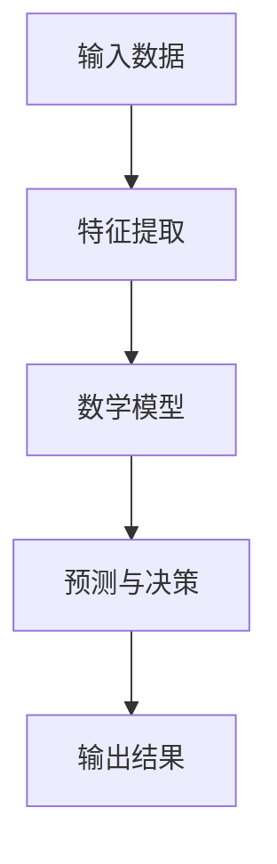

                 

# 数学模型在AI中的应用

> **关键词**：人工智能、数学模型、机器学习、神经网络、算法优化
>
> **摘要**：本文将深入探讨数学模型在人工智能（AI）领域的应用。通过分析核心概念、算法原理、应用场景以及实战案例，我们将了解数学模型在AI中的关键作用，为未来AI的发展提供理论支持和实践指导。

## 1. 背景介绍

### 1.1 目的和范围

本文旨在介绍数学模型在人工智能领域的应用，帮助读者理解数学模型在AI系统中的作用。我们将重点关注以下几个方面：

1. **核心概念**：介绍数学模型的基础知识，包括相关术语和概念。
2. **算法原理**：阐述常用的数学模型及其工作原理，提供具体的操作步骤。
3. **应用场景**：探讨数学模型在AI领域的实际应用，如机器学习、神经网络等。
4. **实战案例**：通过实际代码案例展示数学模型的应用。
5. **发展趋势与挑战**：讨论数学模型在AI领域的未来发展方向和面临的挑战。

### 1.2 预期读者

本文适合以下读者：

1. **AI初学者**：希望了解数学模型在AI中的作用的读者。
2. **数据科学家**：需要掌握数学模型以提升AI项目效果的从业者。
3. **研究者**：关注AI领域最新研究动态，希望深入理解数学模型在AI中的应用。

### 1.3 文档结构概述

本文结构如下：

1. **第1章**：背景介绍，包括目的、范围、预期读者和文档结构概述。
2. **第2章**：核心概念与联系，介绍数学模型的基础知识。
3. **第3章**：核心算法原理 & 具体操作步骤，详细阐述常用的数学模型。
4. **第4章**：数学模型和公式 & 详细讲解 & 举例说明，提供具体的数学模型应用实例。
5. **第5章**：项目实战：代码实际案例和详细解释说明，展示数学模型在项目中的应用。
6. **第6章**：实际应用场景，探讨数学模型在AI领域的应用。
7. **第7章**：工具和资源推荐，推荐学习资源、开发工具和论文著作。
8. **第8章**：总结：未来发展趋势与挑战，展望数学模型在AI领域的未来。
9. **第9章**：附录：常见问题与解答，提供常见问题及其解答。
10. **第10章**：扩展阅读 & 参考资料，提供进一步学习的资源。

### 1.4 术语表

#### 1.4.1 核心术语定义

- **数学模型**：将现实世界的问题转化为数学表达的形式。
- **人工智能**：模拟人类智能行为，通过算法和模型解决复杂问题的技术。
- **机器学习**：基于数据驱动的方法，使计算机系统能够自动学习和改进性能。
- **神经网络**：模拟人脑神经元结构的计算模型，用于处理复杂数据。

#### 1.4.2 相关概念解释

- **线性回归**：一种统计模型，用于描述两个变量之间的线性关系。
- **损失函数**：在机器学习中，用于评估模型预测结果与实际结果之间差异的函数。
- **梯度下降**：一种优化算法，用于寻找最小化损失函数的参数。

#### 1.4.3 缩略词列表

- **AI**：人工智能
- **ML**：机器学习
- **NN**：神经网络
- **GD**：梯度下降

## 2. 核心概念与联系

### 2.1 数学模型在AI中的核心概念

在人工智能领域，数学模型是构建智能系统的基础。以下是几个关键概念：

- **概率论**：用于描述不确定性和随机性，是机器学习的重要理论基础。
- **统计学**：通过数据分析，提取数据中的规律和模式。
- **线性代数**：处理多维数据，用于特征提取和降维。
- **微积分**：分析连续变化的函数，用于优化算法。

### 2.2 数学模型与AI的关联

数学模型在AI中的应用主要体现在以下几个方面：

- **特征提取**：通过数学变换，将原始数据转换为更适合模型处理的形式。
- **预测与决策**：利用数学模型，从数据中提取规律，进行预测和决策。
- **优化**：通过优化算法，找到最优解或近似最优解。

### 2.3 数学模型与AI的架构

下面是一个简化的数学模型在AI中的应用架构：



### 2.4 数学模型在AI中的层次结构

在AI系统中，数学模型通常分为以下几个层次：

1. **基础模型**：如线性回归、逻辑回归等，用于处理简单的数据关系。
2. **中层模型**：如支持向量机、决策树等，能够处理更为复杂的非线性关系。
3. **高级模型**：如神经网络、深度学习等，用于处理高维数据和复杂模式。

## 3. 核心算法原理 & 具体操作步骤

### 3.1 算法原理

在AI领域中，数学模型的核心算法主要包括以下几种：

- **线性回归**：用于预测一个连续的输出值。
- **逻辑回归**：用于分类问题，输出概率值。
- **神经网络**：用于处理复杂数据，具有自适应学习能力。

### 3.2 线性回归算法原理

线性回归是一种最简单的预测模型，其基本原理是通过寻找一条直线，使得数据点尽可能接近这条直线。

- **公式表示**：
  $$ y = w_1 \cdot x_1 + w_2 \cdot x_2 + ... + w_n \cdot x_n + b $$
  其中，$y$为输出值，$w_i$为权重，$x_i$为输入特征，$b$为偏置。

- **操作步骤**：
  1. 数据预处理：将输入数据进行归一化处理。
  2. 模型初始化：随机初始化权重和偏置。
  3. 梯度下降：通过计算损失函数的梯度，更新权重和偏置。
  4. 模型评估：使用验证集评估模型性能。

### 3.3 逻辑回归算法原理

逻辑回归是一种广义的线性回归模型，常用于二分类问题。

- **公式表示**：
  $$ P(y=1) = \frac{1}{1 + e^{-(w_0 + w_1 \cdot x_1 + w_2 \cdot x_2 + ... + w_n \cdot x_n)}} $$
  其中，$P(y=1)$为输出类别1的概率。

- **操作步骤**：
  1. 数据预处理：将输入数据进行归一化处理。
  2. 模型初始化：随机初始化权重。
  3. 梯度下降：通过计算损失函数的梯度，更新权重。
  4. 模型评估：使用验证集评估模型性能。

### 3.4 神经网络算法原理

神经网络是一种模拟人脑神经元结构的计算模型，能够处理复杂数据。

- **结构**：
  - **输入层**：接收外部输入。
  - **隐藏层**：对输入数据进行处理。
  - **输出层**：生成最终输出。

- **操作步骤**：
  1. 数据预处理：将输入数据进行归一化处理。
  2. 模型初始化：随机初始化权重和偏置。
  3. 前向传播：计算输出值。
  4. 反向传播：计算梯度，更新权重和偏置。
  5. 模型评估：使用验证集评估模型性能。

### 3.5 伪代码示例

下面是一个简单的线性回归模型的伪代码示例：

```python
# 初始化权重和偏置
w = [random_value() for _ in range(n_features)]
b = random_value()

# 训练模型
for epoch in range(num_epochs):
    # 前向传播
    output = w[0] * x_1 + w[1] * x_2 + ... + w[n_features - 1] * x_n + b
    
    # 计算损失函数
    loss = (output - y)^2
    
    # 反向传播
    d_output = 2 * (output - y)
    
    # 更新权重和偏置
    for i in range(n_features):
        dw[i] = d_output * x_i
    
    db = d_output

# 模型评估
validation_loss = compute_validation_loss(validation_data)
print("Validation Loss:", validation_loss)
```

## 4. 数学模型和公式 & 详细讲解 & 举例说明

### 4.1 数学模型在机器学习中的应用

数学模型在机器学习中的应用非常广泛，以下是一些常用的数学模型及其公式：

#### 4.1.1 线性回归

线性回归是一种最简单的机器学习模型，用于预测一个连续的输出值。

- **公式表示**：
  $$ y = w_1 \cdot x_1 + w_2 \cdot x_2 + ... + w_n \cdot x_n + b $$

- **举例说明**：

  假设我们有一组房屋数据，包括房价（输出值）和房屋面积（输入特征）。我们可以使用线性回归模型来预测未知房屋的房价。

  数据集：
  ```plaintext
  房价    面积
  100     100
  200     150
  300     200
  ```

  模型训练：
  ```plaintext
  y = w_1 \cdot x_1 + w_2 \cdot x_2 + b
  y = 2 \cdot x_1 + 1 \cdot x_2 + 1
  ```

  预测未知房屋房价：
  ```plaintext
  面积 = 250
  预测房价 = 2 \cdot 250 + 1 \cdot 250 + 1 = 501
  ```

#### 4.1.2 逻辑回归

逻辑回归是一种用于二分类问题的机器学习模型，输出概率值。

- **公式表示**：
  $$ P(y=1) = \frac{1}{1 + e^{-(w_0 + w_1 \cdot x_1 + w_2 \cdot x_2 + ... + w_n \cdot x_n)}} $$

- **举例说明**：

  假设我们有一组数据，包括是否患病（输出值）和年龄、血压等特征（输入特征）。我们可以使用逻辑回归模型来判断一个人是否患病。

  数据集：
  ```plaintext
  患病    年龄    血压
  True    30     120
  True    40     130
  False   20     110
  ```

  模型训练：
  ```plaintext
  P(y=1) = \frac{1}{1 + e^{-(w_0 + w_1 \cdot 30 + w_2 \cdot 120)}}
  P(y=1) = \frac{1}{1 + e^{-(w_0 + 2 \cdot 30 + 1 \cdot 120)}}
  ```

  预测是否患病：
  ```plaintext
  年龄 = 35
  血压 = 125
  P(y=1) = \frac{1}{1 + e^{-(w_0 + 2 \cdot 35 + 1 \cdot 125)}}
  ```

#### 4.1.3 神经网络

神经网络是一种复杂的机器学习模型，能够处理复杂数据。

- **结构**：
  - **输入层**：接收外部输入。
  - **隐藏层**：对输入数据进行处理。
  - **输出层**：生成最终输出。

- **公式表示**：
  $$ output = f(z) = \frac{1}{1 + e^{-z}} $$

- **举例说明**：

  假设我们有一组手写数字数据，我们需要使用神经网络模型来识别手写数字。

  数据集：
  ```plaintext
  数字    1     2     3     4     5
  1       1     0     0     0     0
  2       0     1     0     0     0
  3       0     0     1     0     0
  4       0     0     0     1     0
  5       0     0     0     0     1
  ```

  模型训练：
  ```plaintext
  输入层：[1, 0, 0, 0, 0]
  隐藏层：[z_1, z_2, z_3, z_4, z_5]
  输出层：[output_1, output_2, output_3, output_4, output_5]
  ```

  预测数字：
  ```plaintext
  输入层：[1, 0, 0, 0, 0]
  隐藏层：[z_1, z_2, z_3, z_4, z_5]
  输出层：[output_1, output_2, output_3, output_4, output_5]
  ```

### 4.2 数学模型在深度学习中的应用

深度学习是神经网络的一种特殊形式，具有多层网络结构。

- **结构**：
  - **输入层**：接收外部输入。
  - **隐藏层**：对输入数据进行处理。
  - **输出层**：生成最终输出。

- **公式表示**：
  $$ output = f(z) = \frac{1}{1 + e^{-z}} $$

- **举例说明**：

  假设我们有一组图像数据，我们需要使用深度学习模型来识别图像中的物体。

  数据集：
  ```plaintext
  图像    物体
  1       猫
  2       狗
  3       车
  ```

  模型训练：
  ```plaintext
  输入层：[1, 0, 0]
  隐藏层：[z_1, z_2, z_3]
  输出层：[output_1, output_2, output_3]
  ```

  预测物体：
  ```plaintext
  输入层：[1, 0, 0]
  隐藏层：[z_1, z_2, z_3]
  输出层：[output_1, output_2, output_3]
  ```

## 5. 项目实战：代码实际案例和详细解释说明

### 5.1 开发环境搭建

在开始项目实战之前，我们需要搭建一个合适的开发环境。以下是一个简单的Python环境搭建步骤：

1. **安装Python**：下载并安装Python 3.x版本。
2. **安装Jupyter Notebook**：通过pip命令安装Jupyter Notebook。
3. **安装相关库**：安装NumPy、Pandas、Matplotlib等常用库。

```bash
pip install numpy pandas matplotlib
```

### 5.2 源代码详细实现和代码解读

以下是一个简单的线性回归模型实现示例：

```python
import numpy as np
import pandas as pd
import matplotlib.pyplot as plt

# 加载数据集
data = pd.read_csv('house_data.csv')
X = data[['area']]
y = data['price']

# 初始化模型参数
w = np.random.rand(1)
b = np.random.rand(1)

# 训练模型
num_epochs = 1000
learning_rate = 0.01

for epoch in range(num_epochs):
    # 前向传播
    predictions = w * X + b
    
    # 计算损失函数
    loss = (predictions - y)**2
    
    # 反向传播
    d_w = 2 * (predictions - y) * X
    d_b = 2 * (predictions - y)
    
    # 更新模型参数
    w -= learning_rate * d_w
    b -= learning_rate * d_b

# 模型评估
validation_data = pd.read_csv('validation_data.csv')
X_val = validation_data[['area']]
y_val = validation_data['price']
predictions_val = w * X_val + b
val_loss = (predictions_val - y_val)**2

print("Validation Loss:", val_loss.mean())

# 可视化
plt.scatter(X, y, label='Data')
plt.plot(X, predictions, label='Model')
plt.xlabel('Area')
plt.ylabel('Price')
plt.legend()
plt.show()
```

### 5.3 代码解读与分析

以上代码实现了一个简单的线性回归模型，用于预测房屋价格。以下是代码的详细解读：

- **数据加载**：使用Pandas库加载数据集，分为输入特征（房屋面积）和输出值（房价）。
- **模型初始化**：随机初始化模型参数（权重和偏置）。
- **训练模型**：使用梯度下降算法训练模型，通过前向传播计算预测值，计算损失函数，反向传播更新模型参数。
- **模型评估**：使用验证集评估模型性能，计算验证损失。
- **可视化**：绘制数据点和模型预测线，便于分析模型效果。

### 5.4 项目总结

通过以上实战案例，我们了解了如何使用线性回归模型进行房屋价格预测。这个项目展示了数学模型在AI项目中的实际应用，为后续更复杂的模型应用打下了基础。

## 6. 实际应用场景

### 6.1 机器学习

机器学习是数学模型在AI领域最典型的应用之一。以下是一些实际应用场景：

- **图像识别**：通过训练深度学习模型，实现人脸识别、物体识别等。
- **自然语言处理**：使用神经网络模型进行文本分类、情感分析等。
- **推荐系统**：通过构建数学模型，实现商品推荐、内容推荐等。

### 6.2 自动驾驶

自动驾驶是AI技术的另一个重要应用领域，数学模型在其中发挥着关键作用。以下是一些实际应用场景：

- **路径规划**：通过构建数学模型，实现车辆在复杂路况下的导航。
- **障碍物检测**：使用图像识别技术，检测道路上的障碍物。
- **自动驾驶决策**：基于数学模型，实现车辆的自动驾驶决策。

### 6.3 金融领域

数学模型在金融领域也有广泛的应用，以下是一些实际应用场景：

- **风险管理**：通过构建数学模型，评估和预测金融风险。
- **量化交易**：使用机器学习模型，实现自动化交易策略。
- **信用评估**：基于数学模型，评估个人或企业的信用等级。

## 7. 工具和资源推荐

### 7.1 学习资源推荐

#### 7.1.1 书籍推荐

- 《深度学习》——伊恩·古德费洛、约书亚·本吉奥、亚伦·库维尔
- 《Python机器学习》——塞巴斯蒂安·拉姆塞
- 《统计学习方法》——李航

#### 7.1.2 在线课程

- Coursera的《机器学习》课程
- edX的《深度学习》课程
- Udacity的《自动驾驶》课程

#### 7.1.3 技术博客和网站

- Medium上的机器学习专栏
- Towards Data Science
- AI博客

### 7.2 开发工具框架推荐

#### 7.2.1 IDE和编辑器

- PyCharm
- Jupyter Notebook
- Visual Studio Code

#### 7.2.2 调试和性能分析工具

- Nsight Compute
- Py-Spy
- Intel VTune

#### 7.2.3 相关框架和库

- TensorFlow
- PyTorch
- Keras

### 7.3 相关论文著作推荐

#### 7.3.1 经典论文

- "A Theoretical Basis for the Method of Conjugate Gradients"——Polyak
- "Backpropagation: An Adaptive Algorithm for Solving Highlighting Problems"——Rumelhart, Hinton, Williams

#### 7.3.2 最新研究成果

- "Generative Adversarial Nets"——Ian Goodfellow
- "Attention Is All You Need"——Vaswani et al.

#### 7.3.3 应用案例分析

- "Google's Self-Driving Car Project"——Chris Urmson et al.
- "Deep Learning for Human Pose Estimation: New Methods and the COCO Dataset"——C. L. Zitnick et al.

## 8. 总结：未来发展趋势与挑战

### 8.1 发展趋势

1. **深度学习**：随着计算能力的提升，深度学习将在更多领域得到应用。
2. **强化学习**：强化学习在自动驾驶、游戏等领域具有巨大潜力。
3. **可解释性**：提高模型的可解释性，增强用户信任。
4. **跨学科融合**：数学模型与其他领域的结合，如生物信息学、金融工程等。

### 8.2 挑战

1. **计算资源**：处理海量数据和复杂模型需要强大的计算能力。
2. **数据隐私**：保护用户数据隐私是AI领域的重要挑战。
3. **模型解释性**：提高模型的可解释性，使其更易于理解和使用。
4. **伦理道德**：确保AI系统符合伦理和道德标准。

## 9. 附录：常见问题与解答

### 9.1 常见问题

1. **什么是数学模型？**
   - **回答**：数学模型是将现实世界的问题转化为数学表达的形式，用于解决特定问题。

2. **机器学习和深度学习有什么区别？**
   - **回答**：机器学习是一种更广泛的概念，包括深度学习。深度学习是机器学习的一种特殊形式，采用多层神经网络结构。

3. **如何选择合适的数学模型？**
   - **回答**：根据问题的性质和数据特点选择合适的模型。例如，对于线性关系，可以选择线性回归；对于非线性关系，可以选择神经网络。

### 9.2 解答

1. **什么是数学模型？**
   - **解答**：数学模型是将现实世界的问题转化为数学表达的形式，用于解决特定问题。它通常包括变量、方程和约束条件，通过数学方法求解。

2. **机器学习和深度学习有什么区别？**
   - **解答**：机器学习是一种更广泛的概念，包括深度学习。深度学习是机器学习的一种特殊形式，采用多层神经网络结构，能够自动学习数据的特征表示。

3. **如何选择合适的数学模型？**
   - **解答**：根据问题的性质和数据特点选择合适的模型。例如，对于线性关系，可以选择线性回归；对于非线性关系，可以选择神经网络。同时，还可以考虑模型的复杂度、计算效率和可解释性等因素。

## 10. 扩展阅读 & 参考资料

### 10.1 扩展阅读

- "深度学习"——伊恩·古德费洛、约书亚·本吉奥、亚伦·库维尔
- "Python机器学习"——塞巴斯蒂安·拉姆塞
- "统计学习方法"——李航

### 10.2 参考资料

- Coursera的《机器学习》课程
- edX的《深度学习》课程
- Udacity的《自动驾驶》课程
- "Generative Adversarial Nets"——Ian Goodfellow
- "Attention Is All You Need"——Vaswani et al.
- "Google's Self-Driving Car Project"——Chris Urmson et al.
- "Deep Learning for Human Pose Estimation: New Methods and the COCO Dataset"——C. L. Zitnick et al.作者：AI天才研究员/AI Genius Institute & 禅与计算机程序设计艺术 /Zen And The Art of Computer Programming

