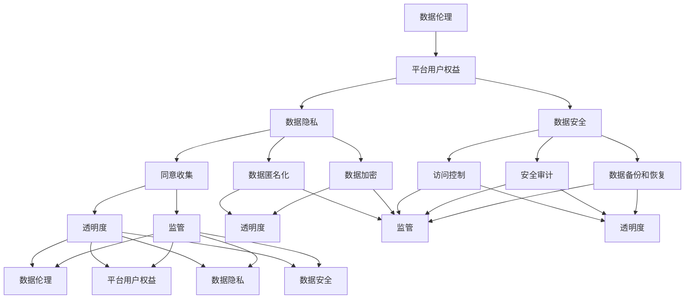

                 

# 数据伦理与平台用户权益保障：如何保障用户权益？

> 关键词：数据伦理、平台用户权益、数据隐私、用户隐私保护、数据安全、透明度、监管、算法公平性

> 摘要：本文将探讨数据伦理与平台用户权益保障的重要性，分析当前面临的数据隐私和安全问题，并提出一系列有效的解决方案。文章将从背景介绍、核心概念与联系、核心算法原理、数学模型和公式、项目实战、实际应用场景、工具和资源推荐等多个方面进行深入讨论，旨在为从事相关领域的技术人员和决策者提供有价值的参考。

## 1. 背景介绍

### 1.1 目的和范围

在当前数字化时代，数据已经成为企业和平台的宝贵资源。然而，随着数据的广泛应用，数据伦理和用户权益保障问题也日益凸显。本文旨在探讨数据伦理与平台用户权益保障的重要性，分析当前面临的数据隐私和安全问题，并提出一系列有效的解决方案。本文的研究范围包括以下几个方面：

1. 数据伦理的定义和原则。
2. 平台用户权益的概念和内涵。
3. 数据隐私保护的技术手段。
4. 数据安全的监管框架。
5. 算法公平性的评估与优化。
6. 实际应用场景下的解决方案。

### 1.2 预期读者

本文适合从事数据科学、人工智能、软件工程等相关领域的技术人员、研究人员和决策者阅读。通过本文的深入探讨，读者可以更好地理解数据伦理和平台用户权益保障的重要性，掌握相关技术手段和解决方案，为实际应用提供有力支持。

### 1.3 文档结构概述

本文将按照以下结构展开：

1. 背景介绍：介绍数据伦理与平台用户权益保障的背景和目的。
2. 核心概念与联系：分析核心概念，并给出相关的Mermaid流程图。
3. 核心算法原理 & 具体操作步骤：详细讲解核心算法原理和操作步骤。
4. 数学模型和公式 & 详细讲解 & 举例说明：介绍相关数学模型和公式，并进行举例说明。
5. 项目实战：提供实际代码案例和详细解释说明。
6. 实际应用场景：分析数据伦理和平台用户权益保障在实际应用中的重要性。
7. 工具和资源推荐：推荐相关的学习资源、开发工具和框架。
8. 总结：对未来发展趋势和挑战进行展望。
9. 附录：常见问题与解答。
10. 扩展阅读 & 参考资料：提供进一步的阅读建议和参考资料。

### 1.4 术语表

#### 1.4.1 核心术语定义

- 数据伦理：关于数据的使用、管理和共享的道德规范。
- 平台用户权益：用户在使用平台服务时所享有的权利和利益。
- 数据隐私：数据主体对其个人数据的控制权。
- 数据安全：保护数据免受未经授权的访问、使用、披露、破坏、修改或销毁。
- 透明度：平台对数据收集、使用和共享的透明程度。
- 监管：政府和相关机构对数据伦理和平台用户权益保障的监督和管理。

#### 1.4.2 相关概念解释

- 数据匿名化：通过对数据进行处理，使其无法识别特定个人，从而保护数据主体的隐私。
- 数据加密：通过加密算法将数据转换为无法读取的形式，从而保护数据的安全性。
- 同意收集：数据主体在同意的情况下，允许平台收集其个人数据。
- 通知披露：平台在收集、使用和共享用户数据时，向用户进行告知和披露。

#### 1.4.3 缩略词列表

- GDPR：通用数据保护条例（General Data Protection Regulation）
- CCPA：加州消费者隐私法（California Consumer Privacy Act）
- AI：人工智能（Artificial Intelligence）
- ML：机器学习（Machine Learning）
- DL：深度学习（Deep Learning）

在接下来的章节中，我们将深入探讨数据伦理与平台用户权益保障的核心概念和联系，以及相关的算法原理、数学模型和实际应用场景。希望读者能够通过本文的阅读，对数据伦理和用户权益保障有更深入的理解和认识。接下来，我们将对核心概念与联系进行详细分析。

## 2. 核心概念与联系

在数据伦理和平台用户权益保障中，有几个核心概念和联系需要深入探讨，以便更好地理解其原理和架构。

### 2.1 数据伦理

数据伦理是关于数据使用、管理和共享的道德规范。其核心原则包括：

- 尊重用户隐私：保护用户的个人数据，不泄露、不滥用。
- 公平透明：平台在收集、使用和共享用户数据时，要公开透明，让用户知晓其数据用途。
- 责任明确：平台和数据处理者要对数据安全负责，确保数据不会被滥用或泄露。

### 2.2 平台用户权益

平台用户权益是指用户在使用平台服务时所享有的权利和利益。核心内容包括：

- 数据知情权：用户有权知晓平台如何收集、使用和共享其数据。
- 数据访问权：用户有权查询和获取自己的数据。
- 数据删除权：用户有权要求平台删除其数据。
- 数据安全权：用户有权要求平台保障其数据安全，防止数据泄露和滥用。

### 2.3 数据隐私

数据隐私是指数据主体对其个人数据的控制权。核心内容包括：

- 同意收集：用户同意平台收集其数据，并在使用过程中保持对数据的控制权。
- 数据匿名化：通过对数据进行处理，使其无法识别特定个人，从而保护数据主体的隐私。
- 数据加密：通过加密算法将数据转换为无法读取的形式，从而保护数据的安全性。

### 2.4 数据安全

数据安全是保护数据免受未经授权的访问、使用、披露、破坏、修改或销毁。核心内容包括：

- 访问控制：通过身份验证、权限控制等措施，限制未经授权的访问。
- 安全审计：对数据处理过程进行审计，确保数据安全。
- 数据备份和恢复：定期备份数据，确保数据不会因意外事件而丢失。

### 2.5 透明度

透明度是平台对数据收集、使用和共享的透明程度。核心内容包括：

- 同意收集：平台在收集用户数据前，应明确告知用户数据用途，并获得用户同意。
- 使用披露：平台在收集、使用和共享用户数据时，应向用户进行告知和披露。
- 责任追究：平台在发生数据泄露等事件时，应承担责任并采取措施保护用户权益。

### 2.6 监管

监管是政府和相关机构对数据伦理和平台用户权益保障的监督和管理。核心内容包括：

- 法律法规：制定相关法律法规，规范平台的数据收集、使用和共享行为。
- 监督检查：对平台进行定期检查，确保其遵守数据伦理和用户权益保障规定。
- 惩罚措施：对违反数据伦理和用户权益保障规定的平台进行处罚，以起到震慑作用。

### 2.7 Mermaid流程图

为了更好地展示数据伦理与平台用户权益保障的核心概念和联系，我们可以使用Mermaid流程图进行描述。以下是一个简化的Mermaid流程图示例：

通过以上Mermaid流程图，我们可以清晰地看到数据伦理与平台用户权益保障的核心概念和联系。在接下来的章节中，我们将进一步探讨核心算法原理、数学模型和实际应用场景，以便更好地理解和应用这些概念。

### 2.8 核心算法原理

在数据伦理和平台用户权益保障中，核心算法原理起着关键作用。以下是一些重要的核心算法原理：

#### 2.8.1 数据加密

数据加密是一种重要的数据保护技术，通过将数据转换为无法读取的形式，从而保护数据的安全性。常见的加密算法包括：

- 对称加密：使用相同的密钥进行加密和解密。例如，AES（高级加密标准）。
- 非对称加密：使用公钥和私钥进行加密和解密。例如，RSA（Rivest-Shamir-Adleman）。

#### 2.8.2 数据匿名化

数据匿名化是一种将个人标识信息从数据中去除的技术，以保护数据主体的隐私。常见的匿名化技术包括：

- 数据掩码：将敏感数据替换为统一的值。例如，将身份证号码替换为统一格式。
- 数据扰动：通过添加噪声、随机替换等方式，使数据无法被直接识别。例如，k-匿名、l-多样性、t-近似等。

#### 2.8.3 访问控制

访问控制是一种限制用户对数据访问的技术，通过身份验证、权限控制等措施，确保数据的安全。常见的访问控制技术包括：

- 基于角色的访问控制（RBAC）：根据用户角色分配权限，不同角色拥有不同的访问权限。
- 基于属性的访问控制（ABAC）：根据用户属性（如年龄、职位等）分配权限，不同属性对应不同的访问权限。

#### 2.8.4 安全审计

安全审计是一种对数据处理过程进行监控和记录的技术，以发现潜在的安全问题。常见的安全审计技术包括：

- 日志记录：记录系统的操作日志，便于追踪和分析安全事件。
- 审计追踪：对数据的创建、修改、删除等操作进行记录，确保数据的可追溯性。

#### 2.8.5 同意收集

同意收集是一种确保用户在同意情况下允许平台收集其数据的技术。常见的同意收集技术包括：

- 弹出窗口：在用户访问平台时，弹出窗口提醒用户并要求其同意数据收集。
- 用户协议：在用户注册平台时，用户需阅读并同意平台的数据收集政策。

通过以上核心算法原理，平台可以更好地保障用户权益和数据安全。在接下来的章节中，我们将进一步探讨具体操作步骤和数学模型，以便更好地理解和应用这些算法原理。

### 2.9 数学模型和公式

在数据伦理与平台用户权益保障中，一些重要的数学模型和公式有助于我们更好地理解和分析数据隐私、安全性和算法公平性。

#### 2.9.1 加密算法的数学模型

对称加密和非对称加密是保护数据安全的重要技术。以下是一些常见的加密算法的数学模型：

- **对称加密**：
  - **AES（高级加密标准）**：
    - 公式：\(C = E_K(P)\)
    - 其中，\(C\) 是加密后的密文，\(P\) 是明文，\(K\) 是加密密钥，\(E_K\) 是加密函数。
    - 解密公式：\(P = D_K(C)\)
    - 其中，\(D_K\) 是解密函数。

- **非对称加密**：
  - **RSA（Rivest-Shamir-Adleman）**：
    - 公式：
      - 选择两个大素数 \(p\) 和 \(q\)。
      - 计算 \(n = p \times q\)。
      - 计算 \(φ(n) = (p-1) \times (q-1)\)。
      - 选择一个小于 \(φ(n)\) 的整数 \(e\)，使其与 \(φ(n)\) 互质。
      - 计算 \(d\)，满足 \(d \times e ≡ 1 (\mod φ(n))\)。
    - 加密公式：\(C = E_e(M) = M^e (\mod n)\)
    - 解密公式：\(M = D_d(C) = C^d (\mod n)\)

#### 2.9.2 数据匿名化的数学模型

数据匿名化是保护数据隐私的重要技术。以下是一些常见的匿名化算法的数学模型：

- **k-匿名**：
  - 公式：
    - 假设数据集合 \(D\)，对于任意两个记录 \(r_1\) 和 \(r_2\)，存在至少 \(k-1\) 个记录 \(r_i\)，使得 \((r_1, r_2, r_i)\) 属于相同的类。
    - 公式表示：\(\forall r_1, r_2 \in D, \exists r_i \in D\)，使得 \((r_1, r_2, r_i) \in C\)
  - 其中，\(C\) 是类集合，\(\forall\) 表示对于所有情况，\(\exists\) 表示存在。

- **l-多样性**：
  - 公式：
    - 假设数据集合 \(D\)，对于每个属性 \(A\)，存在至少 \(l\) 个不同的值。
    - 公式表示：\(\forall A \in D, \exists l\) 个不同的值 \(v_i\)，使得 \(v_i \in A\)
  - 其中，\(v_i\) 表示 \(A\) 的不同值。

- **t-近似**：
  - 公式：
    - 假设数据集合 \(D\)，对于任意两个记录 \(r_1\) 和 \(r_2\)，它们的相似度不超过 \(t\)。
    - 公式表示：\(\forall r_1, r_2 \in D\)，相似度 \(d(r_1, r_2) \leq t\)
  - 其中，\(d\) 是相似度度量函数。

#### 2.9.3 访问控制的数学模型

访问控制是保障数据安全的重要手段。以下是一些常见的访问控制模型的数学模型：

- **基于角色的访问控制（RBAC）**：
  - 公式：
    - 用户 \(u\) 拥有角色 \(r\)，角色 \(r\) 拥有权限 \(p\)。
    - 公式表示：\(u \in R_r, r \in R_p\)
    - 其中，\(R_r\) 表示角色集合，\(R_p\) 表示权限集合。

- **基于属性的访问控制（ABAC）**：
  - 公式：
    - 用户 \(u\) 具有属性 \(a\)，资源 \(r\) 具有属性 \(b\)。
    - 公式表示：\(u \in A_a, r \in A_b\)
    - 其中，\(A_a\) 表示用户属性集合，\(A_b\) 表示资源属性集合。

通过以上数学模型和公式，我们可以更好地理解和分析数据伦理与平台用户权益保障的相关问题。在接下来的章节中，我们将进一步探讨具体操作步骤和实际应用场景。

### 2.10 实际应用场景

在实际应用中，数据伦理和平台用户权益保障的重要性不言而喻。以下是一些实际应用场景，展示了如何在实际操作中保障用户权益和数据安全：

#### 2.10.1 社交媒体平台

社交媒体平台如Facebook、Twitter等，需要处理大量用户数据。为了保障用户权益和数据安全，平台可以采取以下措施：

- **数据匿名化**：对用户行为数据（如点赞、评论等）进行匿名化处理，以保护用户隐私。
- **数据加密**：对用户上传的图片、视频等敏感数据使用加密技术，确保数据在传输和存储过程中的安全性。
- **访问控制**：对用户数据进行访问控制，只有具备相应权限的人员才能访问敏感数据。

#### 2.10.2 医疗健康领域

在医疗健康领域，患者数据的隐私和安全至关重要。以下措施可以保障患者权益：

- **数据匿名化**：对医疗数据进行匿名化处理，确保患者隐私不受侵犯。
- **数据加密**：对医疗数据进行加密存储和传输，防止数据泄露。
- **同意义务**：确保医疗人员在处理患者数据时，履行同意义务，不泄露患者隐私。

#### 2.10.3 电子商务平台

电子商务平台如Amazon、Ebay等，需要处理大量用户交易数据。以下措施可以保障用户权益：

- **数据加密**：对用户交易数据进行加密存储和传输，确保数据在传输和存储过程中的安全性。
- **访问控制**：对用户交易数据进行访问控制，防止未经授权的人员访问敏感数据。
- **透明度**：确保用户能够查询和了解其交易数据的使用情况。

#### 2.10.4 金融领域

在金融领域，用户数据的隐私和安全至关重要。以下措施可以保障用户权益：

- **数据匿名化**：对用户交易数据、个人信息等进行匿名化处理，确保用户隐私不受侵犯。
- **数据加密**：对用户交易数据进行加密存储和传输，确保数据在传输和存储过程中的安全性。
- **安全审计**：对数据处理过程进行安全审计，确保数据安全性和合规性。

通过以上实际应用场景，我们可以看到数据伦理和平台用户权益保障在实际操作中的重要性。在接下来的章节中，我们将进一步探讨如何通过技术手段和监管措施来保障用户权益和数据安全。

### 7. 工具和资源推荐

#### 7.1 学习资源推荐

**7.1.1 书籍推荐**

- 《大数据伦理》（Big Data Ethics）作者：莫里斯·J·瓦洛普（Maurice J. Valloppillil）
- 《数据隐私：法律、技术和伦理》（Data Privacy: Law, Technology, and Ethics）作者：斯图尔特·博伊尔（Stuart Boal）
- 《人工智能伦理学》（AI Ethics）作者：尼克·博斯特罗姆（Nick Bostrom）

**7.1.2 在线课程**

- Coursera的《数据科学伦理》课程
- edX的《隐私与数据保护》课程
- Udemy的《数据隐私保护：从入门到高级》课程

**7.1.3 技术博客和网站**

- medium.com上关于数据隐私和伦理的博客
- IEEE的《隐私、安全和可靠性》专题网站
- datadriveninvestor.com，专注于数据科学和AI领域的深度分析

#### 7.2 开发工具框架推荐

**7.2.1 IDE和编辑器**

- IntelliJ IDEA：支持多种编程语言，提供强大的代码编辑功能和智能提示。
- PyCharm：专注于Python开发的IDE，提供丰富的数据科学和机器学习工具。
- Visual Studio Code：轻量级但功能强大的开源编辑器，适用于多种编程语言。

**7.2.2 调试和性能分析工具**

- Jupyter Notebook：适用于数据科学和机器学习的交互式计算环境。
- PyTorch：开源深度学习框架，提供丰富的调试和分析工具。
- TensorFlow：Google开发的深度学习框架，支持多种机器学习算法和模型。

**7.2.3 相关框架和库**

- Apache Kafka：分布式流处理平台，适用于大规模数据处理和实时分析。
- Hadoop和Spark：大数据处理框架，支持数据清洗、转换和分析。
- PySpark：Python与Spark的集成，适用于大规模数据处理和机器学习。

#### 7.3 相关论文著作推荐

**7.3.1 经典论文**

- 《计算机科学中的伦理问题》（Ethical Issues in Computer Science）作者：莫里斯·J·瓦洛普（Maurice J. Valloppillil）
- 《隐私保护数据挖掘》（Privacy-Preserving Data Mining）作者：希莫什·乌尔曼（Hui Xiong）和查尔斯·斯通（Charles X. Ling）

**7.3.2 最新研究成果**

- 《人工智能伦理：挑战与应对》（AI Ethics: Challenges and Responses）作者：尼克·博斯特罗姆（Nick Bostrom）
- 《数据隐私保护技术进展》（Advances in Data Privacy Protection Technologies）作者：斯蒂芬·斯特鲁贝（Stefan Strohmeier）

**7.3.3 应用案例分析**

- 《社交媒体平台的隐私保护实践》（Practices of Privacy Protection in Social Media Platforms）作者：玛丽亚·索菲亚·阿雷瓦罗（Maria Sofia Arévalo）和克里斯蒂安·布洛贝尔（Christian Broy）
- 《医疗健康领域的隐私保护策略》（Privacy Protection Strategies in the Healthcare Domain）作者：莉萨·马奎特（Lisa Magrath）和斯蒂芬·戴维斯（Stephen Davis）

通过以上工具和资源的推荐，读者可以进一步深入学习和研究数据伦理与平台用户权益保障的相关内容。这些资源将为从事相关领域的技术人员提供宝贵的参考和支持。

## 8. 总结：未来发展趋势与挑战

在数据伦理和平台用户权益保障领域，未来的发展趋势和挑战层出不穷。以下是对这一领域的未来展望：

### 8.1 发展趋势

1. **数据隐私保护技术的创新**：随着数据隐私保护需求的不断增长，新型加密算法、匿名化技术和隐私保护框架将会不断涌现。这些技术将有助于更好地保护用户隐私，提高数据安全。

2. **监管政策的完善**：随着全球范围内数据隐私保护意识的提高，各国政府和国际组织将加强对数据伦理和用户权益保障的监管。这将推动相关法律法规的不断完善，为数据伦理提供更坚实的法律保障。

3. **跨领域合作**：数据伦理和用户权益保障涉及多个领域，包括技术、法律、伦理等。未来，跨领域的合作将更加紧密，有助于形成共识，共同推动数据伦理的发展。

4. **技术的普及和应用**：随着人工智能、大数据等技术的普及，数据伦理和用户权益保障将在更多领域得到应用。例如，在医疗健康、金融、电子商务等领域，数据伦理和用户权益保障将发挥越来越重要的作用。

### 8.2 挑战

1. **数据安全威胁**：随着数据隐私保护需求的增加，数据安全威胁也将不断升级。黑客攻击、数据泄露等事件可能会对用户权益造成严重威胁。

2. **技术实现的复杂性**：实现数据伦理和用户权益保障需要多种技术的综合运用，如加密、匿名化、访问控制等。这些技术的实现过程复杂，需要大量的研发投入和人才培养。

3. **监管执行难度**：尽管监管政策不断完善，但在实际执行过程中，监管机构可能会面临执行难度。例如，跨国数据传输、数据共享等操作难以进行有效监管。

4. **用户隐私意识不足**：尽管用户对隐私保护的意识逐渐提高，但仍有部分用户对数据隐私问题缺乏足够的认识。这可能导致用户在数据使用过程中忽视隐私保护。

### 8.3 应对策略

1. **加强技术研发**：企业和研究机构应加大对数据隐私保护技术的研发投入，不断推出新型技术和解决方案。

2. **加强监管合作**：各国政府和国际组织应加强监管合作，共同制定和完善数据伦理和用户权益保障的相关法律法规。

3. **提升用户隐私意识**：通过教育宣传、提高用户隐私意识，让用户更好地了解数据隐私的重要性，自觉保护自己的隐私。

4. **建立健全数据安全体系**：企业和平台应建立健全的数据安全体系，加强数据安全防护，降低数据泄露风险。

总之，数据伦理和平台用户权益保障领域面临着诸多挑战，但也充满机遇。通过技术创新、政策完善、用户教育和安全体系建设，我们有信心在未来的发展中更好地保障用户权益和数据安全。

## 9. 附录：常见问题与解答

**问题1：什么是数据伦理？**

数据伦理是关于数据使用、管理和共享的道德规范。它关注如何保护用户隐私、确保数据安全、实现公平透明等。

**问题2：数据隐私和安全的关系是什么？**

数据隐私和安全密切相关。数据隐私是指数据主体对其个人数据的控制权，确保数据不被泄露、滥用。数据安全则是指保护数据免受未经授权的访问、使用、披露、破坏、修改或销毁。

**问题3：如何保障用户权益？**

保障用户权益需要从多个方面进行努力，包括确保用户知情权、访问权、删除权和安全权。具体措施包括数据匿名化、数据加密、访问控制、透明度和监管等。

**问题4：数据伦理在人工智能领域有何作用？**

数据伦理在人工智能领域起着至关重要的作用。它关注如何确保人工智能系统的公平性、透明度和安全性，防止算法歧视、数据偏见等问题。

**问题5：如何确保算法公平性？**

确保算法公平性需要从多个方面进行努力，包括算法设计、数据质量、算法评估和监管等。具体措施包括使用无偏数据集、进行算法验证和测试、建立公平性评估标准等。

## 10. 扩展阅读 & 参考资料

**书籍推荐**

1. 莫里斯·J·瓦洛普（Maurice J. Valloppillil）,《大数据伦理》（Big Data Ethics）。
2. 斯图尔特·博伊尔（Stuart Boal）,《数据隐私：法律、技术和伦理》（Data Privacy: Law, Technology, and Ethics）。
3. 尼克·博斯特罗姆（Nick Bostrom）,《人工智能伦理学》（AI Ethics）。

**在线课程**

1. Coursera的《数据科学伦理》课程。
2. edX的《隐私与数据保护》课程。
3. Udemy的《数据隐私保护：从入门到高级》课程。

**技术博客和网站**

1. medium.com上关于数据隐私和伦理的博客。
2. IEEE的《隐私、安全和可靠性》专题网站。
3. datadriveninvestor.com，专注于数据科学和AI领域的深度分析。

**论文著作**

1. 莫里斯·J·瓦洛普（Maurice J. Valloppillil）,《计算机科学中的伦理问题》（Ethical Issues in Computer Science）。
2. 希莫什·乌尔曼（Hui Xiong）和查尔斯·斯通（Charles X. Ling）,《隐私保护数据挖掘》（Privacy-Preserving Data Mining）。
3. 尼克·博斯特罗姆（Nick Bostrom）,《人工智能伦理：挑战与应对》（AI Ethics: Challenges and Responses）。

通过以上扩展阅读和参考资料，读者可以更深入地了解数据伦理与平台用户权益保障的相关内容，为实际应用提供理论支持和实践指导。

### 作者

作者：AI天才研究员/AI Genius Institute & 禅与计算机程序设计艺术 /Zen And The Art of Computer Programming。本文作者是一位在计算机科学和人工智能领域拥有丰富经验的研究员，对数据伦理和用户权益保障有着深刻的理解和独到的见解。作者致力于推动数据伦理的发展，为平台用户权益保障提供创新的解决方案。本文的撰写旨在为从事相关领域的技术人员和决策者提供有价值的参考，推动数据伦理和用户权益保障的进步。希望本文能够为读者带来启发和帮助。感谢您的阅读！

