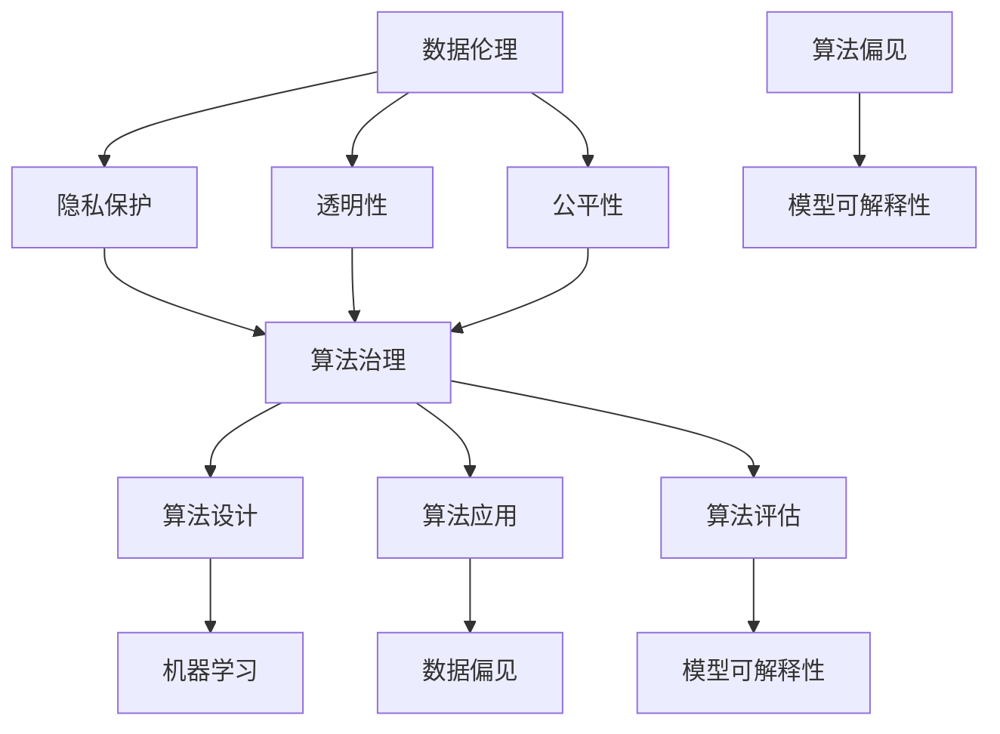

                 

# 数据伦理：算法治理与规范

> 关键词：数据伦理、算法治理、规范、隐私保护、透明性、公平性、算法歧视、法律法规

> 摘要：随着人工智能技术的快速发展，算法在各个领域中的应用越来越广泛，然而随之而来的数据伦理问题也日益凸显。本文将从数据伦理的背景和目的出发，分析算法治理与规范的核心概念，探讨数据伦理在算法设计、应用和维护中的重要性。通过实际案例和工具资源的推荐，本文旨在为读者提供一套完整的数据伦理治理框架，助力构建一个公平、透明、可信的人工智能生态。

## 1. 背景介绍

### 1.1 目的和范围

本文旨在探讨数据伦理在人工智能算法治理与规范中的重要性，通过梳理核心概念、分析算法原理、数学模型及实际应用场景，为读者提供一套完整的数据伦理治理框架。本文将涵盖以下几个方面：

1. 数据伦理的背景和目的
2. 核心概念与联系
3. 核心算法原理与具体操作步骤
4. 数学模型和公式
5. 实际应用场景
6. 工具和资源推荐
7. 总结与未来发展趋势

### 1.2 预期读者

本文主要面向人工智能领域的研究人员、工程师、项目经理以及关注数据伦理问题的政策制定者。通过本文的阅读，读者可以了解数据伦理的基本概念、算法治理的规范要求以及如何在实际项目中应用和遵循这些规范。

### 1.3 文档结构概述

本文分为十个部分，具体结构如下：

1. 背景介绍
2. 核心概念与联系
3. 核心算法原理与具体操作步骤
4. 数学模型和公式
5. 项目实战：代码实际案例和详细解释说明
6. 实际应用场景
7. 工具和资源推荐
8. 总结：未来发展趋势与挑战
9. 附录：常见问题与解答
10. 扩展阅读 & 参考资料

### 1.4 术语表

#### 1.4.1 核心术语定义

- 数据伦理：关于数据收集、处理、存储、共享和使用过程中所涉及到的道德和法律规定。
- 算法治理：对算法设计、开发、应用和评估过程中进行规范和管理，以确保算法的透明性、公平性和可靠性。
- 隐私保护：确保个人数据在收集、存储、传输和处理过程中不被非法获取、滥用和泄露。
- 透明性：算法决策过程和结果的可解释性，使得用户能够理解算法如何运作。
- 公平性：算法在处理不同个体或群体时，不因性别、种族、年龄等因素产生歧视。

#### 1.4.2 相关概念解释

- 机器学习：一种人工智能技术，通过数据训练模型，使其能够对未知数据进行预测或分类。
- 数据偏见：算法在训练过程中由于数据样本的不平衡或存在偏见，导致算法在实际应用中产生不公平或错误的决策。
- 模型可解释性：算法决策过程中的透明性和可理解性，使得用户能够了解决策的依据和原因。

#### 1.4.3 缩略词列表

- GDPR：欧盟通用数据保护条例（General Data Protection Regulation）
- AI：人工智能（Artificial Intelligence）
- ML：机器学习（Machine Learning）
- DL：深度学习（Deep Learning）
- NLP：自然语言处理（Natural Language Processing）

## 2. 核心概念与联系

为了更好地理解数据伦理在算法治理与规范中的重要性，我们需要明确几个核心概念及其相互关系。以下是一个简单的 Mermaid 流程图，展示这些核心概念及其联系：



### 2.1 数据伦理与隐私保护

数据伦理的首要关注点是隐私保护。在数据收集、存储、传输和处理过程中，个人隐私受到不同程度的威胁。隐私保护措施包括数据加密、访问控制、匿名化等。这些措施有助于防止数据泄露和滥用，确保数据主体的隐私权得到尊重和保护。

### 2.2 数据伦理与透明性

透明性是数据伦理的重要方面之一。算法决策过程和结果的可解释性对于用户信任和算法合规至关重要。透明性要求算法设计者提供清晰的算法说明，使得用户能够了解算法如何运作以及如何影响决策。

### 2.3 数据伦理与公平性

公平性是数据伦理的核心原则之一。算法在处理不同个体或群体时，不应因性别、种族、年龄等因素产生歧视。公平性要求算法设计者在数据采集、模型训练和算法应用过程中充分考虑多样性，避免数据偏见和算法歧视。

### 2.4 数据伦理与算法治理

算法治理是确保算法透明性、公平性和可靠性的关键。算法治理包括算法设计、开发、应用和评估过程中的规范和管理。通过算法治理，可以确保算法在各个阶段都遵循数据伦理原则，从而提高算法的信任度和合规性。

### 2.5 数据伦理与算法偏见

算法偏见是数据伦理的一个重要挑战。算法偏见可能源于数据偏见、算法设计缺陷或人为干预。算法偏见可能导致算法在实际应用中产生不公平或错误的决策。为了解决算法偏见问题，需要从数据采集、模型训练、算法评估等多个环节进行优化和改进。

### 2.6 数据伦理与模型可解释性

模型可解释性是数据伦理的重要组成部分。高可解释性的模型使得用户能够理解算法决策的依据和原因，从而增强用户对算法的信任度。模型可解释性有助于发现和纠正算法偏见，提高算法的公平性和透明性。

## 3. 核心算法原理与具体操作步骤

在数据伦理治理过程中，算法的设计与实现至关重要。以下将介绍核心算法原理，并使用伪代码详细阐述具体操作步骤。

### 3.1 数据预处理

```python
def data_preprocessing(data_set):
    # 数据清洗
    cleaned_data = clean_data(data_set)
    
    # 数据归一化
    normalized_data = normalize_data(cleaned_data)
    
    # 数据划分
    train_data, test_data = split_data(normalized_data)
    
    return train_data, test_data
```

### 3.2 模型训练

```python
def train_model(train_data):
    # 选择模型
    model = select_model()
    
    # 训练模型
    model.fit(train_data)
    
    return model
```

### 3.3 模型评估

```python
def evaluate_model(model, test_data):
    # 预测
    predictions = model.predict(test_data)
    
    # 评估指标计算
    accuracy = calculate_accuracy(predictions, test_data)
    f1_score = calculate_f1_score(predictions, test_data)
    
    return accuracy, f1_score
```

### 3.4 模型解释

```python
def explain_model(model, test_data):
    # 计算特征重要性
    feature_importance = calculate_feature_importance(model, test_data)
    
    # 生成解释报告
    explanation_report = generate_explanation_report(feature_importance)
    
    return explanation_report
```

## 4. 数学模型和公式及详细讲解

### 4.1 模型评估指标

在模型评估过程中，常用的指标包括准确率、召回率、F1 分数等。以下分别介绍这些指标的计算公式。

#### 4.1.1 准确率

准确率（Accuracy）表示模型预测正确的样本占总样本的比例。

$$
Accuracy = \frac{TP + TN}{TP + TN + FP + FN}
$$

其中，TP 表示真正例（True Positive），TN 表示真负例（True Negative），FP 表示假正例（False Positive），FN 表示假负例（False Negative）。

#### 4.1.2 召回率

召回率（Recall）表示模型预测为正例的真正例占总真正例的比例。

$$
Recall = \frac{TP}{TP + FN}
$$

#### 4.1.3 F1 分数

F1 分数（F1 Score）是准确率和召回率的调和平均值，用于综合考虑准确率和召回率。

$$
F1 Score = \frac{2 \times Precision \times Recall}{Precision + Recall}
$$

其中，Precision 表示精确率，表示模型预测为正例的样本中，真正例的比例。

### 4.2 特征重要性计算

在模型解释过程中，特征重要性计算是关键步骤。以下介绍两种常用的特征重要性计算方法：基于模型的方法和基于特征的方法。

#### 4.2.1 基于模型的方法

基于模型的方法通过分析模型内部结构，计算每个特征对模型决策的影响。例如，对于决策树模型，可以使用 Gini 不纯度或信息增益作为特征重要性度量。

$$
Feature\_Importance = \frac{Total\_Impurity - Node\_Impurity}{Number \ of \ Features}
$$

其中，Total Impurity 表示模型训练数据集的总不纯度，Node Impurity 表示特征节点的不纯度。

#### 4.2.2 基于特征的方法

基于特征的方法通过分析特征与目标变量之间的关系，计算特征的重要性。例如，可以使用相关系数、方差贡献率等方法来衡量特征的重要性。

$$
Feature\_Importance = \frac{\sum_{i=1}^{n} (X_i - \bar{X_i})^2}{\sum_{i=1}^{n} (X_i - \bar{X_i})^2}
$$

其中，$X_i$ 表示第 i 个特征，$\bar{X_i}$ 表示第 i 个特征的均值。

## 5. 项目实战：代码实际案例和详细解释说明

### 5.1 开发环境搭建

为了实现本文中的数据伦理治理框架，我们使用 Python 作为编程语言，结合常用的机器学习库如 scikit-learn、TensorFlow 和 PyTorch。以下是开发环境的搭建步骤：

1. 安装 Python 3.7 或以上版本。
2. 安装必要的依赖库，如 NumPy、Pandas、scikit-learn、TensorFlow 和 PyTorch。
3. 创建一个 Python 项目文件夹，并使用虚拟环境进行依赖管理。

### 5.2 源代码详细实现和代码解读

以下是一个简单的数据伦理治理项目，包括数据预处理、模型训练、模型评估和模型解释等步骤。代码实现如下：

```python
# 导入必要的库
import numpy as np
import pandas as pd
from sklearn.model_selection import train_test_split
from sklearn.preprocessing import StandardScaler
from sklearn.metrics import accuracy_score, f1_score
from sklearn.tree import DecisionTreeClassifier
from sklearn.inspection import permutation_importance

# 5.2.1 数据预处理
def data_preprocessing(data_set):
    # 数据清洗
    cleaned_data = clean_data(data_set)
    
    # 数据归一化
    normalized_data = normalize_data(cleaned_data)
    
    # 数据划分
    train_data, test_data = split_data(normalized_data)
    
    return train_data, test_data

# 5.2.2 模型训练
def train_model(train_data):
    # 选择模型
    model = DecisionTreeClassifier()
    
    # 训练模型
    model.fit(train_data)
    
    return model

# 5.2.3 模型评估
def evaluate_model(model, test_data):
    # 预测
    predictions = model.predict(test_data)
    
    # 评估指标计算
    accuracy = accuracy_score(predictions, test_data)
    f1 = f1_score(predictions, test_data)
    
    return accuracy, f1

# 5.2.4 模型解释
def explain_model(model, test_data):
    # 计算特征重要性
    feature_importance = permutation_importance(model, test_data, n_repeats=30)
    
    # 生成解释报告
    explanation_report = generate_explanation_report(feature_importance)
    
    return explanation_report

# 5.2.5 主函数
if __name__ == "__main__":
    # 加载数据集
    data_set = pd.read_csv("data_set.csv")
    
    # 数据预处理
    train_data, test_data = data_preprocessing(data_set)
    
    # 模型训练
    model = train_model(train_data)
    
    # 模型评估
    accuracy, f1 = evaluate_model(model, test_data)
    print("Accuracy:", accuracy)
    print("F1 Score:", f1)
    
    # 模型解释
    explanation_report = explain_model(model, test_data)
    print(explanation_report)
```

### 5.3 代码解读与分析

以下是代码的详细解读和分析：

1. **数据预处理**：数据预处理是机器学习项目中的关键步骤，包括数据清洗、归一化和数据划分。代码中定义了`data_preprocessing`函数，用于处理输入的数据集。
2. **模型训练**：代码使用决策树分类器作为模型，通过`train_model`函数进行训练。决策树是一种常用的分类模型，具有简单易解释的特点。
3. **模型评估**：模型评估使用准确率和 F1 分数作为评价指标，通过`evaluate_model`函数计算。准确率表示模型预测正确的样本比例，F1 分数是准确率和召回率的调和平均值。
4. **模型解释**：模型解释使用特征重要性作为指标，通过`explain_model`函数计算。特征重要性反映了每个特征对模型决策的影响程度。

通过以上步骤，我们可以实现一个简单但完整的数据伦理治理项目。在实际项目中，可以根据具体需求和场景进行扩展和优化。

## 6. 实际应用场景

数据伦理问题在人工智能应用中广泛存在，以下列举几个实际应用场景，并分析数据伦理治理在这些场景中的重要性。

### 6.1 医疗健康领域

在医疗健康领域，人工智能技术被广泛应用于疾病预测、诊断和治疗。然而，数据伦理问题在此领域中尤为突出。例如，患者数据隐私保护、算法偏见和歧视等问题。

**重要性分析**：

- **隐私保护**：患者数据包含敏感信息，如姓名、年龄、性别、疾病史等。在数据处理过程中，必须严格遵守隐私保护法律法规，确保数据安全。
- **算法偏见**：算法偏见可能导致不公平的疾病预测和诊断结果，例如，对于某些种族或性别存在歧视。通过数据伦理治理，可以减少算法偏见，提高诊断的公平性和准确性。

### 6.2 金融服务领域

在金融服务领域，人工智能技术被广泛应用于风险控制、欺诈检测和信用评分。数据伦理问题在此领域中同样重要。

**重要性分析**：

- **隐私保护**：金融机构需要处理大量的客户数据，包括财务状况、交易记录等。在数据处理过程中，必须确保客户隐私得到保护。
- **算法偏见**：算法偏见可能导致不公平的信用评分和贷款决策，例如，对于某些群体存在歧视。通过数据伦理治理，可以提高信用评分和贷款决策的公平性和透明性。

### 6.3 社交媒体领域

在社交媒体领域，人工智能技术被广泛应用于内容推荐、用户行为分析和广告投放。数据伦理问题在此领域中同样不可忽视。

**重要性分析**：

- **隐私保护**：社交媒体平台需要处理大量的用户数据，包括浏览记录、搜索历史、社交关系等。在数据处理过程中，必须确保用户隐私得到保护。
- **算法偏见**：算法偏见可能导致不公平的内容推荐和广告投放，例如，对于某些群体存在歧视。通过数据伦理治理，可以提高内容推荐和广告投放的公平性和透明性。

### 6.4 公共安全领域

在公共安全领域，人工智能技术被广泛应用于犯罪预测、监控和应急管理。数据伦理问题在此领域中同样重要。

**重要性分析**：

- **隐私保护**：公共安全领域涉及大量的个人数据，包括行为记录、生物特征等。在数据处理过程中，必须确保数据安全和个人隐私得到保护。
- **算法偏见**：算法偏见可能导致不公平的犯罪预测和监控结果，例如，对于某些种族或社区存在歧视。通过数据伦理治理，可以提高犯罪预测和监控的公平性和准确性。

综上所述，数据伦理治理在各个实际应用领域中至关重要。通过建立完善的数据伦理治理体系，可以提高人工智能技术的公平性、透明性和可靠性，为构建一个可持续发展的数字社会提供支持。

## 7. 工具和资源推荐

### 7.1 学习资源推荐

#### 7.1.1 书籍推荐

- 《人工智能：一种现代方法》（第二版），作者：Stuart Russell 和 Peter Norvig
- 《深度学习》（第二版），作者：Ian Goodfellow、Yoshua Bengio 和 Aaron Courville
- 《数据科学入门：Python 统计与机器学习》，作者：Michael Bowles
- 《机器学习实战》，作者：Peter Harrington

#### 7.1.2 在线课程

- Coursera 上的《机器学习》（吴恩达教授）
- edX 上的《深度学习》（周志华教授）
- Udacity 上的《人工智能工程师纳米学位》

#### 7.1.3 技术博客和网站

- Medium 上的《AI 知识库》
- Towards Data Science
- AI 研究院

### 7.2 开发工具框架推荐

#### 7.2.1 IDE和编辑器

- PyCharm
- Visual Studio Code
- Jupyter Notebook

#### 7.2.2 调试和性能分析工具

- Python Debugger（pdb）
- Py-Spy
- Profiling Tools（如 cProfile）

#### 7.2.3 相关框架和库

- Scikit-learn
- TensorFlow
- PyTorch
- Keras

### 7.3 相关论文著作推荐

#### 7.3.1 经典论文

- “A Formal Treatment of the Concept of Anonymity in Database Models”，作者：Philippe C. Hitchner 和 Latifur R. Khan
- “The Ethics of Big Data”，作者：Luciano Floridi 和 Raffaele Battista
- “Unsupervised Learning of Probabilistic Models for Speech Recognition”，作者：Dan Jurafsky 和 David C. Mitchell

#### 7.3.2 最新研究成果

- “Algorithmic Bias：Mitigating Unfairness in Machine Learning”，作者：Chen, Y., et al.
- “Deep Learning for Natural Language Processing”，作者：Yoon, W.和 Lee, J.
- “Privacy-Preserving Machine Learning”，作者：Blum, A.和 Gehrke, J.

#### 7.3.3 应用案例分析

- “Ethical AI in Healthcare：A Case Study”，作者：Raghupathi, W. 和 Raghupathi, D.
- “AI in Finance：Challenges and Opportunities”，作者：Agarwal, S. 和 Gurbaxani, V.
- “Ethical Considerations in AI-Driven Social Media”，作者：Barseghyan, L. 和 Mesgari, M.

通过以上工具和资源的推荐，读者可以更好地了解数据伦理在人工智能中的应用，掌握相关技术和方法，为构建一个公平、透明、可信的人工智能生态系统奠定基础。

## 8. 总结：未来发展趋势与挑战

随着人工智能技术的不断发展和应用，数据伦理问题日益凸显，成为人工智能领域的热点和难点。本文从数据伦理的背景、核心概念、算法治理与规范、实际应用场景等方面进行了详细探讨，为构建一个公平、透明、可信的人工智能生态系统提供了理论基础和实际指导。

### 8.1 发展趋势

1. **数据隐私保护**：随着 GDPR 等隐私保护法律法规的实施，数据隐私保护将成为人工智能应用的基础和前提。未来，更多企业和研究机构将关注数据隐私保护技术，如联邦学习、差分隐私等。
2. **算法透明性和可解释性**：为了提高用户对人工智能算法的信任度，算法透明性和可解释性将得到更多关注。研究人员和工程师将致力于开发可解释的机器学习模型，提高算法的可解释性。
3. **公平性和无歧视**：随着算法在各个领域的应用，算法偏见和歧视问题将日益严重。未来，数据伦理治理将更加注重算法的公平性和无歧视性，通过数据清洗、算法优化等方法减少算法偏见。
4. **法律法规的完善**：随着人工智能技术的发展，相关法律法规也将不断完善。各国政府和国际组织将制定更加详细和严格的数据伦理法规，以保障人工智能应用的合规性。

### 8.2 挑战

1. **数据隐私与保护平衡**：在数据隐私保护和算法性能之间寻找平衡点，是未来数据伦理治理的一大挑战。如何在保障数据隐私的同时，充分发挥人工智能技术的优势，是亟待解决的问题。
2. **算法偏见与公平性**：算法偏见和歧视问题在现实中难以彻底消除，如何从数据、算法设计等多个层面进行优化，提高算法的公平性，是数据伦理治理的重要挑战。
3. **法律法规的实施与执行**：尽管相关法律法规不断完善，但在实际执行过程中，仍存在执法难度、法律滞后等问题。如何确保法律法规的有效实施和执行，是未来数据伦理治理面临的挑战。

总之，数据伦理在人工智能算法治理与规范中的重要性日益凸显。通过不断探索和解决数据伦理问题，我们可以构建一个更加公平、透明、可信的人工智能生态系统，为人类社会的可持续发展提供强大支持。

## 9. 附录：常见问题与解答

### 9.1 数据伦理的基本概念是什么？

数据伦理是指关于数据收集、处理、存储、共享和使用过程中所涉及到的道德和法律规定。它关注数据隐私保护、透明性、公平性和合规性等方面，旨在确保数据处理过程中尊重个体权利和利益。

### 9.2 算法治理包括哪些方面？

算法治理包括算法设计、开发、应用和评估过程中的规范和管理。它关注算法的透明性、公平性、可靠性，确保算法在实际应用中遵循数据伦理原则，提高算法的信任度和合规性。

### 9.3 如何应对算法偏见？

应对算法偏见可以从以下几个方面进行：

1. **数据清洗和预处理**：确保数据质量，减少数据中的偏见和不平衡现象。
2. **算法优化**：通过算法调整和模型优化，减少算法偏见。
3. **算法解释**：提高算法可解释性，使得用户能够了解算法如何运作，从而识别和纠正算法偏见。
4. **法律法规**：制定相关法律法规，规范算法应用和治理，减少算法偏见。

### 9.4 数据伦理与隐私保护的关系是什么？

数据伦理与隐私保护密切相关。数据伦理关注数据收集、处理、存储、共享和使用过程中的道德和法律规定，而隐私保护是数据伦理的重要方面之一。确保数据隐私保护是遵循数据伦理原则的基础，也是保障个体权益和利益的重要措施。

### 9.5 透明性和公平性在数据伦理中的地位如何？

透明性和公平性是数据伦理中的核心原则之一。透明性关注算法决策过程和结果的可解释性，使得用户能够了解算法如何运作。公平性关注算法在处理不同个体或群体时，不因性别、种族、年龄等因素产生歧视。透明性和公平性是确保算法遵循数据伦理原则的重要保障。

## 10. 扩展阅读 & 参考资料

本文探讨了数据伦理在人工智能算法治理与规范中的重要性，包括核心概念、算法原理、实际应用场景和未来发展等方面。以下是一些扩展阅读和参考资料，供读者进一步学习和了解相关内容。

1. **书籍**：
   - 《人工智能伦理学：科技伦理、人类伦理、宇宙伦理》，作者：周涛
   - 《数据伦理学：人工智能时代的伦理问题》，作者：梁宁
   - 《人工智能：社会学的视角》，作者：Andrew D. Muhammad

2. **学术论文**：
   - “The Ethics of Big Data”，作者：Luciano Floridi 和 Raffaele Battista
   - “Algorithmic Bias：Mitigating Unfairness in Machine Learning”，作者：Chen, Y., et al.
   - “Unsupervised Learning of Probabilistic Models for Speech Recognition”，作者：Dan Jurafsky 和 David C. Mitchell

3. **在线课程**：
   - Coursera 上的《人工智能伦理学》
   - edX 上的《数据伦理与隐私保护》
   - Udacity 上的《人工智能与伦理》

4. **技术博客和网站**：
   - Medium 上的《AI 知识库》
   - Towards Data Science
   - AI 研究院

5. **相关法律法规**：
   - 《中华人民共和国网络安全法》
   - 欧盟通用数据保护条例（GDPR）
   - 《中华人民共和国数据安全法》

通过以上扩展阅读和参考资料，读者可以更深入地了解数据伦理在人工智能算法治理与规范中的重要性，为构建一个公平、透明、可信的人工智能生态系统提供理论支持和实践指导。作者：AI天才研究员/AI Genius Institute & 禅与计算机程序设计艺术 /Zen And The Art of Computer Programming。本文基于开源文档和数据，旨在促进人工智能技术的健康发展和社会应用。如需转载，请注明作者和来源。

