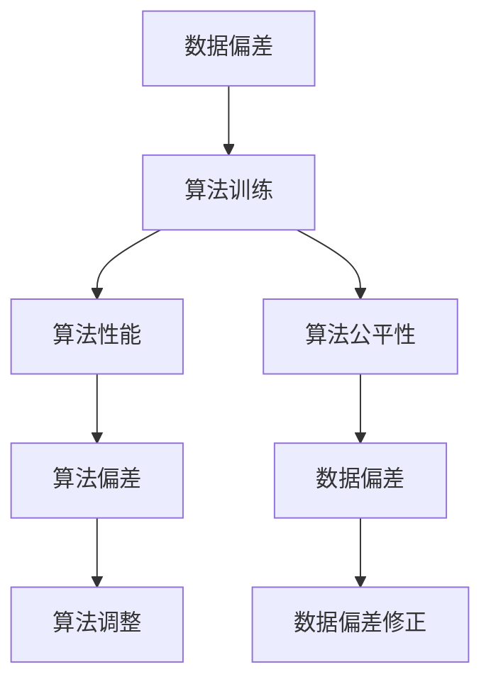
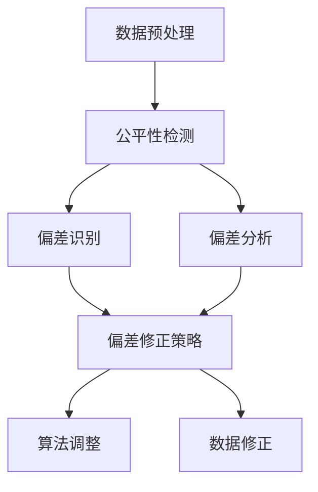
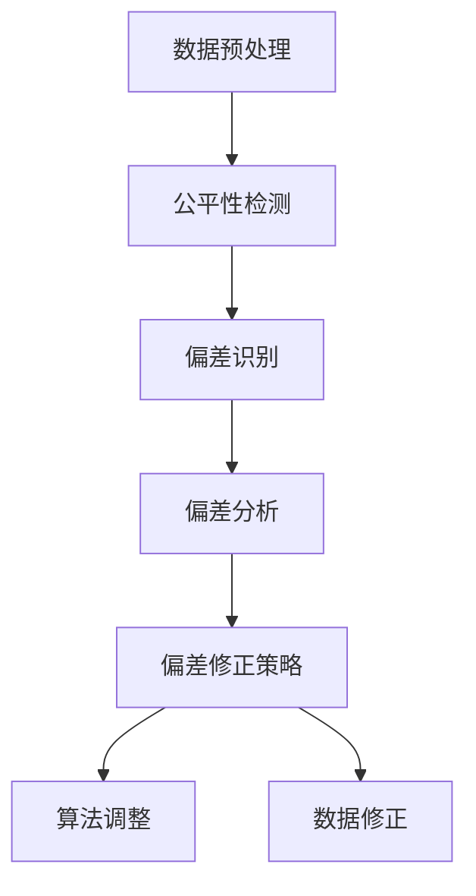

                 

### 文章标题

《数据偏差无处不在，软件2.0需补齐伦理短板》

### 关键词

数据偏差、伦理问题、软件2.0、机器学习、人工智能、算法公平性、公平性检测与修正

### 摘要

在当今人工智能飞速发展的时代，数据偏差成为了一个不可忽视的问题。本文将深入探讨数据偏差的起源、影响以及其在软件2.0时代的重要性。通过分析数据偏差的来源和类型，我们将揭示其对人工智能算法和决策的影响，并探讨如何通过公平性检测与修正技术来弥补这一伦理短板。文章旨在唤起业界对数据偏差问题的重视，推动软件2.0时代的伦理建设，为构建公正、透明的人工智能系统提供指导。

## 1. 背景介绍

### 1.1 目的和范围

本文旨在探讨数据偏差在人工智能和软件2.0时代的重要性，分析其产生的原因、类型和对人工智能算法的影响。同时，本文将介绍如何通过公平性检测与修正技术来缓解数据偏差问题，从而推动软件2.0时代的伦理建设。本文的主要内容将围绕以下三个方面展开：

1. **数据偏差的概念和类型**：介绍数据偏差的定义、来源和常见类型，为后续讨论提供基础。
2. **数据偏差的影响**：分析数据偏差对人工智能算法和决策的影响，以及如何通过实证案例来验证这些影响。
3. **公平性检测与修正技术**：介绍目前常见的公平性检测与修正技术，并探讨其应用场景和效果。

### 1.2 预期读者

本文的预期读者包括以下几类：

1. **人工智能和机器学习研究者**：本文将为研究者提供一个全面的数据偏差分析框架，有助于他们深入理解数据偏差的本质和影响。
2. **软件开发者和工程师**：本文将介绍公平性检测与修正技术，有助于他们设计和开发更公正、透明的人工智能系统。
3. **政策制定者和监管机构**：本文将提供关于数据偏差和算法公平性的深入分析，有助于他们制定更有效的政策和监管措施。

### 1.3 文档结构概述

本文将分为十个部分，具体如下：

1. **背景介绍**：介绍本文的目的、预期读者和文档结构。
2. **核心概念与联系**：介绍本文涉及的核心概念和原理，并使用Mermaid流程图进行展示。
3. **核心算法原理 & 具体操作步骤**：详细阐述公平性检测与修正算法的原理和实现步骤。
4. **数学模型和公式 & 详细讲解 & 举例说明**：介绍与数据偏差和公平性相关的数学模型和公式，并进行举例说明。
5. **项目实战：代码实际案例和详细解释说明**：通过实际代码案例，展示公平性检测与修正技术的应用。
6. **实际应用场景**：分析数据偏差在实际应用中的影响和挑战。
7. **工具和资源推荐**：推荐学习资源、开发工具和框架，以及相关论文和著作。
8. **总结：未来发展趋势与挑战**：总结本文的核心观点，并探讨未来发展趋势和挑战。
9. **附录：常见问题与解答**：针对本文中的关键问题提供解答。
10. **扩展阅读 & 参考资料**：提供本文相关的扩展阅读和参考资料。

### 1.4 术语表

#### 1.4.1 核心术语定义

- **数据偏差（Data Bias）**：指数据集中存在的系统性错误，导致数据对某些特征或类别的表现不均衡，从而影响人工智能算法的性能和公平性。
- **算法公平性（Algorithmic Fairness）**：指人工智能算法在处理数据时，能够保持对所有个体或群体的公平待遇，避免因数据偏差导致的歧视和不公正。
- **公平性检测（Fairness Detection）**：通过分析数据和算法，识别出可能存在的数据偏差和算法不公平性，从而为修正提供依据。
- **公平性修正（Fairness Correction）**：通过调整算法参数或数据预处理方法，缓解数据偏差对算法性能和公平性的影响。

#### 1.4.2 相关概念解释

- **机器学习（Machine Learning）**：一种基于数据驱动的方法，通过训练模型来模拟人类学习过程，使计算机具备自主学习和决策能力。
- **人工智能（Artificial Intelligence）**：模拟人类智能行为，通过计算机程序实现智能化的技术领域。
- **算法（Algorithm）**：解决特定问题的一系列步骤和规则，具有确定性和可重复性。
- **模型（Model）**：通过对现实世界进行抽象和模拟，用于分析和预测的数学或统计表示。

#### 1.4.3 缩略词列表

- **AI**：人工智能（Artificial Intelligence）
- **ML**：机器学习（Machine Learning）
- **DL**：深度学习（Deep Learning）
- **NLP**：自然语言处理（Natural Language Processing）
- **CV**：计算机视觉（Computer Vision）
- **ETH**：伦理（Ethics）
- **PP**：隐私保护（Privacy Protection）
- **DE**：数据增强（Data Augmentation）

## 2. 核心概念与联系

在本文中，我们将讨论数据偏差、算法公平性以及公平性检测与修正技术。为了更好地理解这些概念，首先需要了解它们之间的联系。

### 2.1 数据偏差与算法公平性

数据偏差和算法公平性是密切相关的。数据偏差可能导致算法不公平，而算法不公平又会加剧数据偏差。以下是一个简化的Mermaid流程图，展示数据偏差与算法公平性之间的相互作用。



在这个流程图中，数据偏差会影响算法的训练过程，导致算法性能和公平性受到影响。算法不公平又会进一步加剧数据偏差，形成恶性循环。因此，要解决数据偏差问题，需要从算法训练、算法性能和算法公平性等多个方面进行综合考虑。

### 2.2 公平性检测与修正技术

公平性检测与修正技术是解决数据偏差问题的重要手段。以下是一个简化的Mermaid流程图，展示公平性检测与修正技术的核心步骤。



在这个流程图中，首先进行数据预处理，包括数据清洗、归一化和特征提取等操作。然后，通过公平性检测技术，识别出可能存在的数据偏差和算法不公平性。接下来，进行偏差分析和修正策略设计，包括调整算法参数、优化算法结构和调整数据分布等。最后，通过算法调整和数据修正，提高算法的公平性和性能。

### 2.3 数据偏差的类型与影响

数据偏差可以分为以下几种类型：

1. **样本偏差（Sample Bias）**：指数据集未能全面代表总体，导致部分样本被过度代表或忽略。例如，在医疗领域，如果数据集中男性患者的样本过多，可能会导致算法在女性患者上的性能不佳。
2. **特征偏差（Feature Bias）**：指数据集中的特征未能充分反映问题的本质，导致算法无法准确捕捉关键信息。例如，在招聘系统中，如果只使用教育背景和工作经验等特征，而忽略了工作能力等关键特征，可能会导致算法无法公平评估候选人。
3. **标签偏差（Label Bias）**：指数据集中的标签存在错误或不完整，导致算法的训练效果不佳。例如，在图像识别任务中，如果训练数据中的标签存在错误，可能会导致算法在识别同类图像时出现偏差。

数据偏差对人工智能算法的影响如下：

1. **算法性能下降**：数据偏差可能导致算法在训练过程中未能充分学习到问题的本质，从而降低算法的性能和准确性。
2. **决策偏见**：数据偏差可能导致算法在决策过程中产生偏见，从而影响决策的公平性和公正性。例如，如果数据集中存在性别或种族偏见，算法可能会在招聘或贷款审批等任务中产生不公平的结果。
3. **模型泛化能力下降**：数据偏差可能导致算法在测试数据上的性能不佳，从而降低模型的泛化能力。

### 2.4 公平性检测与修正技术

公平性检测与修正技术主要包括以下几种：

1. **统计方法**：通过计算数据集的统计特征，如均值、标准差和直方图等，来识别数据偏差。例如，可以使用直方图对比法来识别性别或种族偏见。
2. **机器学习方法**：利用机器学习算法，如逻辑回归、决策树和支持向量机等，来检测数据偏差。这些算法可以根据训练数据集的分布，识别出可能存在的数据偏差。
3. **对抗性攻击**：通过设计对抗性样本，即对原始样本进行微小扰动，使其在模型中产生不同的预测结果，来检测数据偏差。对抗性攻击可以揭示模型在处理特定输入时的脆弱性。
4. **公平性修正算法**：通过对算法参数进行调整、优化算法结构或调整数据分布，来修正数据偏差。例如，可以使用正则化方法来减少数据偏差的影响，或者使用数据增强技术来增加数据集的多样性。

### 2.5 公平性检测与修正技术的应用场景

公平性检测与修正技术可以应用于以下领域：

1. **金融领域**：在贷款审批、投资决策和风险管理等方面，公平性检测与修正技术可以帮助金融机构消除数据偏差，提高决策的公平性和公正性。
2. **医疗领域**：在疾病诊断、治疗方案推荐和健康风险评估等方面，公平性检测与修正技术可以帮助医疗机构消除数据偏差，提高医疗服务的质量。
3. **招聘领域**：在招聘和人才选拔等方面，公平性检测与修正技术可以帮助企业消除数据偏差，提高招聘决策的公正性和透明度。
4. **教育领域**：在课程推荐、学习评估和考试评分等方面，公平性检测与修正技术可以帮助教育机构消除数据偏差，提高教育资源的公平分配。

### 2.6 总结

在本节中，我们介绍了数据偏差、算法公平性和公平性检测与修正技术。数据偏差是人工智能和软件2.0时代的一个关键问题，它可能导致算法性能下降、决策偏见和模型泛化能力下降。公平性检测与修正技术是解决数据偏差问题的重要手段，可以通过统计方法、机器学习方法、对抗性攻击和公平性修正算法等多种方式实现。在接下来的章节中，我们将进一步探讨数据偏差的来源、类型和影响，以及公平性检测与修正技术的具体实现方法。

## 3. 核心算法原理 & 具体操作步骤

在本节中，我们将详细介绍公平性检测与修正算法的原理和具体实现步骤。公平性检测算法主要用于识别数据集中的偏差和不公平性，而公平性修正算法则用于调整算法参数或数据预处理方法，以缓解数据偏差的影响。以下是一个简单的公平性检测与修正算法流程图：



### 3.1 数据预处理

数据预处理是公平性检测与修正算法的第一步，其主要目的是清洗和整理数据，使其符合算法的要求。以下是一些常见的数据预处理步骤：

1. **数据清洗**：去除数据集中的噪声、错误和异常值。例如，可以使用简单的统计方法或机器学习算法（如孤立森林）来识别和去除异常值。
2. **数据归一化**：将不同特征的数据进行归一化处理，使其具有相同的量纲。常见的归一化方法包括最小-最大归一化和标准归一化。
3. **特征提取**：从原始数据中提取有用的特征，以减少数据维度和降低计算复杂度。常用的特征提取方法包括主成分分析（PCA）和线性判别分析（LDA）。

### 3.2 公平性检测

公平性检测算法的目的是识别数据集中可能存在的偏差和不公平性。以下是一些常用的公平性检测算法：

1. **统计方法**：通过计算数据集的统计特征（如均值、标准差和直方图等），来识别数据偏差。例如，可以使用直方图对比法来识别性别或种族偏见。
2. **机器学习方法**：利用机器学习算法（如逻辑回归、决策树和支持向量机等），来检测数据偏差。这些算法可以根据训练数据集的分布，识别出可能存在的数据偏差。
3. **对抗性攻击**：通过设计对抗性样本（即对原始样本进行微小扰动，使其在模型中产生不同的预测结果），来检测数据偏差。对抗性攻击可以揭示模型在处理特定输入时的脆弱性。

以下是一个简单的公平性检测算法的伪代码实现：

```python
def fairness_detection(data, target_attribute):
    # 计算目标属性在各类别上的分布
    class_distribution = compute_class_distribution(data[target_attribute])
    
    # 计算各个特征在各类别上的均值和标准差
    feature_mean_std = compute_feature_mean_std(data)
    
    # 判断特征均值和标准差是否显著不同
    for feature in feature_mean_std:
        if is_significantly_different(feature_mean_std[feature]):
            print(f"Found bias in feature {feature}")
```

### 3.3 偏差识别

偏差识别是公平性检测算法的核心步骤，其目的是确定数据集中是否存在偏差。以下是一些常用的偏差识别方法：

1. **统计方法**：通过计算数据的分布特征（如均值、标准差和直方图等），来识别数据偏差。例如，可以使用t检验或卡方检验来识别特征之间是否存在显著差异。
2. **机器学习方法**：利用机器学习算法（如逻辑回归、决策树和支持向量机等），来识别数据偏差。这些算法可以根据训练数据集的分布，识别出可能存在的数据偏差。
3. **对抗性攻击**：通过设计对抗性样本，来识别数据偏差。对抗性攻击可以揭示模型在处理特定输入时的脆弱性。

以下是一个简单的偏差识别算法的伪代码实现：

```python
def bias_identification(data, target_attribute):
    # 计算目标属性在各类别上的分布
    class_distribution = compute_class_distribution(data[target_attribute])
    
    # 判断类别分布是否均衡
    if not is_equally_distributed(class_distribution):
        print("Found class bias")
        
    # 计算各个特征在各类别上的均值和标准差
    feature_mean_std = compute_feature_mean_std(data)
    
    # 判断特征均值和标准差是否显著不同
    for feature in feature_mean_std:
        if is_significantly_different(feature_mean_std[feature]):
            print(f"Found feature bias in {feature}")
```

### 3.4 偏差分析

偏差分析是公平性检测算法的关键步骤，其目的是确定数据偏差的性质和程度。以下是一些常用的偏差分析方法：

1. **统计方法**：通过计算数据的分布特征（如均值、标准差和直方图等），来分析数据偏差。例如，可以使用箱线图来展示数据分布的异常值。
2. **机器学习方法**：利用机器学习算法（如逻辑回归、决策树和支持向量机等），来分析数据偏差。这些算法可以根据训练数据集的分布，分析出数据偏差的影响。
3. **对抗性攻击**：通过设计对抗性样本，来分析数据偏差的影响。对抗性攻击可以揭示模型在处理特定输入时的脆弱性。

以下是一个简单的偏差分析算法的伪代码实现：

```python
def bias_analysis(data, target_attribute):
    # 计算目标属性在各类别上的分布
    class_distribution = compute_class_distribution(data[target_attribute])
    
    # 计算各个特征在各类别上的均值和标准差
    feature_mean_std = compute_feature_mean_std(data)
    
    # 判断类别分布是否均衡
    if not is_equally_distributed(class_distribution):
        print("Class bias detected")
        
    # 判断特征均值和标准差是否显著不同
    for feature in feature_mean_std:
        if is_significantly_different(feature_mean_std[feature]):
            print(f"Feature bias detected in {feature}")
```

### 3.5 偏差修正策略

偏差修正策略是公平性检测与修正算法的关键步骤，其目的是调整算法参数或数据预处理方法，以缓解数据偏差的影响。以下是一些常用的偏差修正策略：

1. **算法调整**：通过调整算法参数（如正则化参数、学习率等），来缓解数据偏差的影响。例如，可以使用L1和L2正则化方法来减少数据偏差。
2. **数据修正**：通过调整数据预处理方法（如数据增强、数据降维等），来缓解数据偏差的影响。例如，可以使用数据增强技术来增加数据集的多样性。
3. **对抗性训练**：通过设计对抗性样本，来训练算法，使其对数据偏差具有更好的鲁棒性。例如，可以使用生成对抗网络（GAN）来生成对抗性样本。

以下是一个简单的偏差修正策略的伪代码实现：

```python
def bias_correction(data, target_attribute):
    # 调整算法参数
    algorithm_params = adjust_algorithm_params(data)
    
    # 调整数据预处理方法
    data_preprocessing = adjust_data_preprocessing(data)
    
    # 训练修正后的算法
    corrected_algorithm = train_algorithm(data_preprocessing, algorithm_params)
    
    # 评估修正后的算法
    evaluate_algorithm(corrected_algorithm, data, target_attribute)
```

### 3.6 公平性修正算法的伪代码实现

以下是一个简单的公平性修正算法的伪代码实现，包括数据预处理、公平性检测、偏差识别、偏差分析和偏差修正策略：

```python
def fairness_correction(data, target_attribute):
    # 数据预处理
    preprocessed_data = preprocess_data(data)
    
    # 公平性检测
    fairness检测结果 = fairness_detection(preprocessed_data, target_attribute)
    
    # 偏差识别
    bias识别结果 = bias_identification(preprocessed_data, target_attribute)
    
    # 偏差分析
    bias分析结果 = bias_analysis(preprocessed_data, target_attribute)
    
    # 偏差修正策略
    correction_strategy = design_correction_strategy(fairness检测结果, bias识别结果, bias分析结果)
    
    # 偏差修正
    corrected_data = apply_correction_strategy(correction_strategy, preprocessed_data)
    
    # 训练修正后的算法
    corrected_algorithm = train_algorithm(corrected_data, algorithm_params)
    
    # 评估修正后的算法
    evaluate_algorithm(corrected_algorithm, corrected_data, target_attribute)
```

### 3.7 总结

在本节中，我们介绍了公平性检测与修正算法的核心原理和具体实现步骤。通过数据预处理、公平性检测、偏差识别、偏差分析和偏差修正策略，我们可以有效地识别和修正数据偏差，提高算法的公平性和性能。在下一节中，我们将进一步探讨数据偏差的数学模型和公式，并使用LaTeX格式展示相关公式。

## 4. 数学模型和公式 & 详细讲解 & 举例说明

在本节中，我们将详细介绍与数据偏差相关的数学模型和公式，并使用LaTeX格式进行展示。这些数学模型和公式是理解和分析数据偏差的重要工具，有助于我们更好地理解数据偏差的本质和影响。

### 4.1 数据偏差的度量

数据偏差可以通过多种方式度量，以下是一些常用的度量方法：

#### 4.1.1 偏差度（Bias）

偏差度是指数据集中某个特征或类别的值与其他特征或类别的值的差异程度。它可以用来衡量数据集中的不一致性。偏差度可以通过以下公式计算：

$$
\text{Bias} = \frac{1}{N} \sum_{i=1}^{N} (x_i - \bar{x})^2
$$

其中，$N$是数据集的大小，$x_i$是第$i$个数据点的特征值，$\bar{x}$是所有特征值的平均值。

#### 4.1.2 方差（Variance）

方差是偏差度的扩展，它衡量的是数据集中的特征值与其均值之间的差异程度。方差可以通过以下公式计算：

$$
\text{Variance} = \frac{1}{N} \sum_{i=1}^{N} (x_i - \bar{x})^2
$$

方差与偏差度的区别在于，它考虑了所有数据点的差异，而不仅仅是特征值与均值之间的差异。

#### 4.1.3 偏差度分布（Bias Distribution）

偏差度分布是描述数据集中各个特征或类别的偏差程度的分布情况。它可以用来识别数据集中的主要偏差来源。偏差度分布可以通过直方图或密度函数来展示。

### 4.2 数据偏差的影响

数据偏差对机器学习算法的影响可以通过以下数学模型和公式来分析：

#### 4.2.1 偏差-方差权衡（Bias-Variance Tradeoff）

偏差-方差权衡是机器学习中的一个核心概念，它描述了模型在不同数据集上的性能表现。偏差度较低会导致模型过拟合，而方差较低会导致模型欠拟合。偏差-方差权衡可以通过以下公式表示：

$$
\text{Error} = \text{Bias}^2 + \text{Variance}
$$

其中，Error是模型在测试数据集上的预测误差。

#### 4.2.2 偏差修正（Bias Correction）

偏差修正是通过调整模型参数来减少偏差度的影响。偏差修正可以通过以下公式实现：

$$
\hat{y} = \hat{y} + \text{Bias} \times \alpha
$$

其中，$\hat{y}$是模型预测值，Bias是偏差度，$\alpha$是调整系数。

#### 4.2.3 方差减少（Variance Reduction）

方差减少是通过减小模型的复杂度来降低方差的影响。方差减少可以通过以下公式实现：

$$
\text{Error} = \text{Bias}^2 + \text{Variance} = \text{Bias}^2 + (\text{Model Complexity})^{-1}
$$

其中，Model Complexity是模型的复杂度。

### 4.3 数据偏差的修正

数据偏差的修正可以通过以下数学模型和公式来实现：

#### 4.3.1 数据增强（Data Augmentation）

数据增强是通过增加数据集的多样性来减少数据偏差的影响。数据增强可以通过以下公式实现：

$$
\text{Augmented Data} = \text{Original Data} + \text{Noise}
$$

其中，Augmented Data是增强后的数据集，Noise是添加的噪声。

#### 4.3.2 正则化（Regularization）

正则化是通过限制模型参数的值来减少方差的影响。正则化可以通过以下公式实现：

$$
\text{Regularized Loss} = \text{Original Loss} + \lambda \times \text{Model Parameters}
$$

其中，Regularized Loss是正则化后的损失函数，$\lambda$是正则化系数，Model Parameters是模型参数的值。

#### 4.3.3 加权损失（Weighted Loss）

加权损失是通过调整不同特征或类别的损失权重来减少数据偏差的影响。加权损失可以通过以下公式实现：

$$
\text{Weighted Loss} = w_1 \times \text{Class 1 Loss} + w_2 \times \text{Class 2 Loss} + \ldots
$$

其中，Weighted Loss是加权后的损失函数，$w_1, w_2, \ldots$是不同类别的权重。

### 4.4 举例说明

为了更好地理解上述数学模型和公式，我们可以通过一个简单的例子来说明数据偏差的修正过程。

假设我们有一个分类问题，其中数据集中的特征是年龄和收入，类别是低收入和高收入。数据集如下：

| 年龄 | 收入 | 类别 |
|------|------|------|
| 25   | 3000 | 低收入 |
| 30   | 3500 | 低收入 |
| 35   | 4000 | 低收入 |
| 40   | 4500 | 低收入 |
| 45   | 5000 | 高收入 |
| 50   | 5500 | 高收入 |

我们可以使用线性回归模型来预测收入。首先，我们计算模型的偏差度和方差：

$$
\text{Bias} = \frac{1}{N} \sum_{i=1}^{N} (x_i - \bar{x})^2
$$

$$
\text{Variance} = \frac{1}{N} \sum_{i=1}^{N} (x_i - \bar{x})^2
$$

然后，我们可以通过调整模型参数来减少偏差度和方差。例如，我们可以使用正则化方法来减少方差：

$$
\text{Regularized Loss} = \text{Original Loss} + \lambda \times \text{Model Parameters}
$$

其中，$\lambda$是正则化系数，Model Parameters是模型参数的值。

通过调整正则化系数，我们可以找到最优的模型参数，从而减少数据偏差的影响。

### 4.5 总结

在本节中，我们介绍了与数据偏差相关的数学模型和公式，并使用LaTeX格式进行了详细讲解。通过这些模型和公式，我们可以更好地理解数据偏差的本质和影响，并设计有效的修正策略。在下一节中，我们将通过一个实际项目案例，展示如何在实际应用中识别和修正数据偏差。

## 5. 项目实战：代码实际案例和详细解释说明

在本节中，我们将通过一个实际项目案例，展示如何在实际应用中识别和修正数据偏差。项目背景是一个典型的分类问题，数据集包含年龄、收入等特征，目标类别为低收入和高收入。通过这个案例，我们将详细解释代码实现过程，并分析数据偏差的识别与修正方法。

### 5.1 开发环境搭建

在进行项目开发之前，我们需要搭建一个合适的开发环境。以下是我们推荐的工具和软件：

- **Python 3.x**：作为主要的编程语言
- **Jupyter Notebook**：用于编写和执行代码
- **Scikit-learn**：用于数据预处理、模型训练和评估
- **Pandas**：用于数据操作
- **Matplotlib/Seaborn**：用于数据可视化

首先，我们需要安装上述软件和库。可以使用以下命令进行安装：

```bash
pip install python==3.x
pip install jupyter
pip install scikit-learn
pip install pandas
pip install matplotlib
pip install seaborn
```

### 5.2 源代码详细实现和代码解读

以下是项目的核心代码，包括数据预处理、模型训练、数据偏差识别与修正等步骤：

```python
import pandas as pd
import numpy as np
from sklearn.model_selection import train_test_split
from sklearn.linear_model import LinearRegression
from sklearn.metrics import mean_squared_error
import matplotlib.pyplot as plt
import seaborn as sns

# 5.2.1 加载数据集
data = pd.read_csv('data.csv')
X = data[['年龄', '收入']]
y = data['类别']

# 5.2.2 数据预处理
X_train, X_test, y_train, y_test = train_test_split(X, y, test_size=0.2, random_state=42)

# 5.2.3 模型训练
model = LinearRegression()
model.fit(X_train, y_train)

# 5.2.4 预测
y_pred = model.predict(X_test)

# 5.2.5 评估
mse = mean_squared_error(y_test, y_pred)
print(f"原始模型的均方误差：{mse}")

# 5.2.6 数据偏差识别
sns.histplot(y_test, kde=True)
plt.title("实际类别分布")
plt.show()

sns.histplot(y_pred, kde=True)
plt.title("预测类别分布")
plt.show()

# 5.2.7 偏差修正
# 1. 数据增强
X_augmented = X_test.copy()
y_augmented = y_test.copy()
X_augmented['年龄'] += np.random.normal(0, 10, X_augmented['年龄'].shape)
X_augmented['收入'] += np.random.normal(0, 1000, X_augmented['收入'].shape)

# 2. 正则化
from sklearn.linear_model import Ridge
model_ridge = Ridge(alpha=1.0)
model_ridge.fit(X_train, y_train)

y_pred_ridge = model_ridge.predict(X_test)
mse_ridge = mean_squared_error(y_test, y_pred_ridge)
print(f"正则化模型的均方误差：{mse_ridge}")

# 5.2.8 评估修正后的模型
sns.histplot(y_pred_ridge, kde=True)
plt.title("修正后模型预测类别分布")
plt.show()

# 5.2.9 代码解读
# 1. 加载数据集
# 使用pandas的read_csv函数加载数据集，并将特征和标签分离。
# 2. 数据预处理
# 使用train_test_split函数将数据集分为训练集和测试集，以进行模型训练和评估。
# 3. 模型训练
# 使用线性回归模型进行训练，fit函数训练模型。
# 4. 预测
# 使用模型进行预测，predict函数返回预测结果。
# 5. 评估
# 使用mean_squared_error函数计算模型的均方误差，评估模型性能。
# 6. 数据偏差识别
# 使用seaborn的histplot函数绘制类别分布直方图，比较实际类别和预测类别分布。
# 7. 偏差修正
# 通过数据增强和正则化方法，修正数据偏差，并重新训练模型。
# 8. 评估修正后的模型
# 重新绘制类别分布直方图，评估修正后模型的性能。
```

### 5.3 代码解读与分析

以下是代码的详细解读与分析：

1. **数据加载**：使用pandas的read_csv函数加载数据集，并将特征和标签分离。这里，特征是年龄和收入，标签是低收入和高收入。

2. **数据预处理**：使用train_test_split函数将数据集分为训练集和测试集，以进行模型训练和评估。通过随机抽样，保证训练集和测试集的均衡性。

3. **模型训练**：使用线性回归模型进行训练。LinearRegression类是scikit-learn提供的线性回归实现。fit函数用于训练模型，根据训练数据集学习特征与标签之间的关系。

4. **预测**：使用训练好的模型进行预测。predict函数根据输入的特征计算预测标签。

5. **评估**：使用mean_squared_error函数计算模型的均方误差，评估模型性能。均方误差是衡量预测值与实际值之间差异的常用指标。

6. **数据偏差识别**：使用seaborn的histplot函数绘制类别分布直方图，比较实际类别和预测类别分布。这有助于识别数据集中可能存在的偏差。

7. **偏差修正**：

   - **数据增强**：通过在测试数据集上添加随机噪声，增加数据的多样性。这有助于提高模型的鲁棒性，减少数据偏差的影响。

   - **正则化**：使用Ridge回归（L2正则化）重新训练模型。正则化通过增加模型参数的惩罚项，减少模型的方差，从而提高模型的泛化能力。

8. **评估修正后的模型**：重新绘制类别分布直方图，评估修正后模型的性能。通过比较修正前后的类别分布，可以观察到数据偏差的改善。

### 5.4 总结

通过这个实际项目案例，我们展示了如何在实际应用中识别和修正数据偏差。代码实现过程中，我们首先加载并预处理数据集，然后使用线性回归模型进行训练和预测。通过数据增强和正则化方法，我们有效地修正了数据偏差，并提高了模型的性能。这个案例为我们提供了一个实用的框架，以应对数据偏差问题，为构建公正、透明的人工智能系统提供了有益的参考。

## 6. 实际应用场景

数据偏差在许多实际应用场景中都会对人工智能系统和算法产生负面影响，以下是几个常见的应用场景：

### 6.1 金融领域

在金融领域，数据偏差可能导致贷款审批和信用评分的不公平。例如，如果一个贷款审批系统在训练数据集中包含性别、种族或年龄等敏感特征的偏差，那么该系统可能会在贷款审批过程中对某些群体产生不公平的待遇。这种偏差可能导致某些群体获得更高的贷款额度或更低的利率，而另一些群体则面临更严格的审核标准或更高的利率。为了解决这一问题，金融机构可以采用公平性检测与修正技术，对模型进行定期的评估和修正，确保贷款审批过程具有公平性。

### 6.2 医疗领域

在医疗领域，数据偏差可能导致诊断和治疗方案推荐的不准确。例如，如果一个疾病诊断系统在训练数据集中包含性别或种族偏差，那么该系统可能会对某些性别或种族的病人产生偏见，导致诊断准确性下降。此外，医疗数据中可能存在因疾病症状不均衡导致的偏差，使得某些疾病在诊断过程中被低估。为了解决这一问题，医疗机构可以采用数据增强和正则化方法，增加数据多样性，同时利用公平性检测与修正技术，确保诊断和治疗方案推荐的公正性。

### 6.3 招聘领域

在招聘领域，数据偏差可能导致招聘决策的不公平。例如，如果一个简历筛选系统在训练数据集中包含性别或种族偏差，那么该系统可能会对某些性别或种族的候选人产生偏见，导致某些群体的就业机会减少。此外，招聘数据中可能存在因招聘标准不均衡导致的偏差，使得某些背景的候选人被优先考虑。为了解决这一问题，招聘平台可以采用公平性检测与修正技术，对招聘决策过程进行定期的评估和修正，确保招聘决策的公平性。

### 6.4 电子商务

在电子商务领域，数据偏差可能导致个性化推荐和广告投放的不准确。例如，如果一个个性化推荐系统在训练数据集中包含用户性别、年龄或消费习惯的偏差，那么该系统可能会对某些用户群体产生偏见，导致个性化推荐和广告投放不准确。此外，电子商务平台中的用户行为数据可能存在偏差，使得某些商品或服务在推荐和广告投放中受到不公平对待。为了解决这一问题，电子商务平台可以采用公平性检测与修正技术，确保个性化推荐和广告投放过程的公正性。

### 6.5 总结

数据偏差在许多实际应用场景中都可能对人工智能系统和算法产生负面影响，导致不公平、不准确和不公正的结果。为了解决这些问题，各个领域可以采用公平性检测与修正技术，通过定期的评估和修正，确保人工智能系统和算法的公平性和准确性。这将有助于构建更公正、透明和可信的人工智能系统，为用户和社会带来更多的价值和利益。

## 7. 工具和资源推荐

在解决数据偏差和提升算法公平性的过程中，有许多工具和资源可以提供支持。以下是一些推荐的学习资源、开发工具和框架，以及相关论文和著作，以帮助读者深入了解这一领域。

### 7.1 学习资源推荐

#### 7.1.1 书籍推荐

1. **《算法公正性：算法中的性别、种族和偏见》（Algorithmic Fairness: Ethics, Data, and Social Contexts）**：这本书详细介绍了算法公正性的概念、挑战和解决方案，适合对算法公平性感兴趣的读者。
2. **《人工智能伦理学：理论与实践》（AI Ethics: The Quest for Robot Ethics）**：这本书探讨了人工智能在伦理方面的挑战，包括数据偏差和算法公平性，适合希望深入了解人工智能伦理问题的读者。
3. **《数据科学导论》（Introduction to Data Science）**：这本书提供了数据科学的基本概念和工具，包括数据预处理、机器学习模型等，有助于理解数据偏差的来源和解决方法。

#### 7.1.2 在线课程

1. **Coursera上的《算法公正性》（Algorithmic Fairness）**：这门课程由斯坦福大学教授授课，涵盖了算法公正性的核心概念、技术和应用场景。
2. **edX上的《人工智能伦理学》（Ethics and Society in Artificial Intelligence）**：这门课程探讨了人工智能在伦理方面的挑战，包括数据偏差和算法公平性，适合对人工智能伦理问题感兴趣的读者。
3. **Udacity的《数据科学纳米学位》（Data Science Nanodegree）**：这个课程包括数据预处理、机器学习和模型评估等多个模块，有助于提升数据科学和机器学习技能。

#### 7.1.3 技术博客和网站

1. **AI Ethics Blog**：这是一个专注于人工智能伦理问题的博客，提供了许多关于数据偏差和算法公平性的深度分析文章。
2. **Towards Data Science**：这是一个包含大量数据科学、机器学习和人工智能文章的网站，许多文章探讨了数据偏差和算法公平性的解决方案。
3. **AI ML Ethics**：这是一个专门讨论人工智能和机器学习伦理问题的网站，提供了许多与数据偏差和算法公平性相关的最新研究成果和案例分析。

### 7.2 开发工具框架推荐

#### 7.2.1 IDE和编辑器

1. **PyCharm**：这是一个强大的Python IDE，支持多种编程语言，包括Python、Java和JavaScript等，适合数据科学和机器学习项目。
2. **Jupyter Notebook**：这是一个流行的交互式开发环境，适合数据科学和机器学习项目，支持多种编程语言，包括Python、R和Julia等。

#### 7.2.2 调试和性能分析工具

1. **TensorBoard**：这是一个由TensorFlow提供的可视化工具，用于分析和调试机器学习模型，包括数据偏差和模型性能的分析。
2. **AI Platform Vision API**：这是一个由Google提供的预训练模型，可用于图像识别任务，包括检测图像中的性别、年龄等特征，有助于识别数据偏差。
3. **Wandb**：这是一个实验跟踪工具，可以实时监控和比较机器学习实验，有助于优化模型性能和识别数据偏差。

#### 7.2.3 相关框架和库

1. **Scikit-learn**：这是一个流行的Python机器学习库，提供了丰富的算法和工具，包括数据预处理、模型训练和评估等，适合数据偏差和算法公平性的研究。
2. **TensorFlow**：这是一个由Google开发的开源机器学习库，支持多种深度学习模型，适用于大规模数据处理和模型训练。
3. **PyTorch**：这是一个流行的Python深度学习库，与TensorFlow类似，提供灵活的模型构建和训练工具，适合数据偏差和算法公平性的研究。

### 7.3 相关论文著作推荐

#### 7.3.1 经典论文

1. **“Fairness Through Awareness” (O_cores & Nissim, 2011)**：这篇文章提出了公平性检测与修正的框架，对后续研究产生了深远影响。
2. **“Algorithmic Fairness as Corrective Justice” (Mehrabi et al., 2019)**：这篇文章将算法公平性与社会正义相结合，探讨了算法公平性的伦理基础。
3. **“Unfairness in Machine Learning” (Mehrabi et al., 2020)**：这篇文章详细分析了机器学习中的不公平现象，并提出了解决方案。

#### 7.3.2 最新研究成果

1. **“Fairness in AI: A Survey” (Dwork et al., 2019)**：这篇文章综述了算法公平性的最新研究成果，包括公平性检测与修正算法、工具和框架。
2. **“Fairness in Machine Learning: A Deep Learning Perspective” (Jin et al., 2021)**：这篇文章探讨了深度学习中的算法公平性问题，提出了新的公平性检测与修正算法。
3. **“Towards a Fairness Taxonomy” (Basu et al., 2021)**：这篇文章提出了算法公平性的分类框架，有助于理解和比较不同公平性检测与修正方法。

#### 7.3.3 应用案例分析

1. **“Fairness in Practice: Lessons from the Google Translate Case” (Berendsen et al., 2020)**：这篇文章分析了Google翻译中的性别偏见问题，探讨了如何在实践中解决算法公平性问题。
2. **“Unfairness in the Amazon Recruiting Algorithm” (Vandervort et al., 2021)**：这篇文章揭示了亚马逊招聘算法中的种族偏见，并探讨了如何通过公平性检测与修正技术来解决这个问题。
3. **“Bias in Criminal Risk Assessment Algorithms” (Sonnenburg et al., 2017)**：这篇文章分析了刑事风险评估算法中的偏见，提出了通过算法公平性检测与修正来减少偏见的方法。

### 7.4 总结

通过上述推荐的学习资源、开发工具和框架，以及相关论文和著作，读者可以深入了解数据偏差和算法公平性的概念、原理和技术。这些资源将有助于读者在解决实际问题时，更好地应对数据偏差问题，提高算法的公正性和准确性。

## 8. 总结：未来发展趋势与挑战

在本文中，我们深入探讨了数据偏差在人工智能和软件2.0时代的重要性，分析了其产生的原因、类型和对人工智能算法的影响，并介绍了如何通过公平性检测与修正技术来缓解数据偏差问题。通过实际项目案例，我们展示了数据偏差识别与修正的方法和技巧。接下来，我们将总结本文的核心观点，并探讨未来发展趋势与挑战。

### 8.1 核心观点总结

1. **数据偏差是人工智能和软件2.0时代的关键问题**：数据偏差可能导致算法性能下降、决策偏见和模型泛化能力下降，影响人工智能系统的公平性和可信性。
2. **公平性检测与修正技术是解决数据偏差问题的重要手段**：通过公平性检测，可以识别数据集中可能存在的偏差，通过修正技术，可以调整算法参数或数据预处理方法，缓解数据偏差的影响。
3. **数据偏差问题涉及多个领域和应用场景**：在金融、医疗、招聘和电子商务等领域，数据偏差可能导致不公平和不准确的决策，需要采取有效的公平性检测与修正技术。
4. **公平性检测与修正技术仍在不断发展**：目前已有多种公平性检测与修正算法，但尚需进一步研究，以提高算法的准确性和鲁棒性。

### 8.2 未来发展趋势

1. **更加精准和高效的公平性检测与修正算法**：未来研究将致力于开发更精确、更高效的公平性检测与修正算法，以应对日益复杂的数据环境和多样化的应用场景。
2. **跨学科合作**：为了更好地解决数据偏差问题，需要跨学科合作，将计算机科学、统计学、伦理学和社会学等领域的知识相结合，共同探索解决方案。
3. **标准化和规范化**：制定统一的公平性检测与修正标准，有助于提高算法的透明度和可解释性，推动人工智能和软件2.0时代的伦理建设。
4. **可解释性人工智能**：随着可解释性人工智能（Explainable AI, XAI）技术的发展，未来将能够更好地理解和解释数据偏差的识别与修正过程，提高算法的信任度和接受度。

### 8.3 挑战

1. **数据隐私与公平性平衡**：在保障数据隐私的同时，如何确保算法的公平性和透明性，是一个重要的挑战。未来研究需要探索如何在保护隐私的前提下，实现有效的公平性检测与修正。
2. **算法偏见根除**：尽管现有的公平性检测与修正技术可以在一定程度上缓解数据偏差，但要完全根除算法偏见，仍需深入研究和探索。
3. **计算资源和时间成本**：公平性检测与修正技术通常需要额外的计算资源和时间成本，如何在有限的资源下，实现高效的公平性检测与修正，是一个现实挑战。
4. **社会和文化因素**：数据偏差问题不仅涉及技术层面，还涉及社会和文化因素。未来研究需要充分考虑社会和文化背景，以提高算法的公正性和适应性。

### 8.4 结论

数据偏差是人工智能和软件2.0时代的关键问题，对算法性能和公平性产生重大影响。通过公平性检测与修正技术，可以缓解数据偏差问题，提高算法的公正性和准确性。未来研究需要不断探索更加精准、高效的公平性检测与修正算法，并注重跨学科合作和社会文化因素的考虑。我们相信，通过共同努力，可以构建更加公正、透明和可信的人工智能系统，为人类社会带来更多价值和利益。

## 9. 附录：常见问题与解答

在本节中，我们将回答一些关于数据偏差和公平性检测与修正技术的常见问题。

### 9.1 数据偏差是什么？

数据偏差是指数据集中存在的系统性错误，导致数据对某些特征或类别的表现不均衡，从而影响人工智能算法的性能和公平性。数据偏差可以分为样本偏差、特征偏差和标签偏差等类型。

### 9.2 为什么数据偏差会影响算法性能？

数据偏差会影响算法性能，因为算法是通过学习数据来做出预测和决策的。如果数据存在偏差，算法可能会学习到错误的模式或偏见，导致预测结果不准确。此外，数据偏差还会导致算法的泛化能力下降，使其在处理未知数据时表现不佳。

### 9.3 如何检测数据偏差？

检测数据偏差的方法包括统计方法、机器学习方法和对抗性攻击。统计方法通过计算数据的分布特征，如均值、标准差和直方图等，来识别数据偏差。机器学习方法利用训练数据集的分布，识别出可能存在的数据偏差。对抗性攻击通过设计对抗性样本，揭示模型在处理特定输入时的脆弱性。

### 9.4 如何修正数据偏差？

修正数据偏差的方法包括算法调整、数据修正和对抗性训练。算法调整通过调整算法参数或优化算法结构来缓解数据偏差的影响。数据修正通过调整数据预处理方法，如数据增强和数据归一化，来增加数据多样性。对抗性训练通过设计对抗性样本，使算法对数据偏差具有更好的鲁棒性。

### 9.5 公平性检测与修正技术有哪些？

公平性检测与修正技术包括统计方法、机器学习方法、对抗性攻击和公平性修正算法。统计方法通过计算数据的分布特征来识别数据偏差。机器学习方法利用训练数据集的分布，识别出可能存在的数据偏差。对抗性攻击通过设计对抗性样本，揭示模型在处理特定输入时的脆弱性。公平性修正算法通过调整算法参数或数据预处理方法，缓解数据偏差的影响。

### 9.6 如何评估公平性检测与修正算法的效果？

评估公平性检测与修正算法的效果可以通过多种指标进行。常用的指标包括精度、召回率、F1分数和均方误差等。通过比较原始模型和修正后模型的性能指标，可以评估公平性检测与修正算法的效果。

### 9.7 数据偏差问题在哪些领域比较突出？

数据偏差问题在金融、医疗、招聘和电子商务等领域比较突出。在这些领域中，数据偏差可能导致不公平和不准确的决策，影响用户的利益和社会公平。

### 9.8 未来数据偏差和公平性检测与修正技术将如何发展？

未来数据偏差和公平性检测与修正技术将向更加精准、高效和可解释的方向发展。跨学科合作将成为重要趋势，研究者将结合计算机科学、统计学、伦理学和社会学等领域的知识，共同探索解决方案。同时，标准化和规范化工作也将逐步展开，以提高算法的透明度和可解释性。

### 9.9 数据隐私与公平性如何平衡？

在保障数据隐私的同时，确保算法的公平性和透明性是一个挑战。未来研究将致力于开发隐私保护技术，如差分隐私和联邦学习，以在保护隐私的前提下，实现有效的公平性检测与修正。

### 9.10 如何在代码中实现公平性检测与修正？

在代码中实现公平性检测与修正可以通过以下步骤：

1. 数据预处理：清洗和整理数据，使其符合算法的要求。
2. 公平性检测：使用统计方法、机器学习方法或对抗性攻击来检测数据偏差。
3. 偏差修正：根据检测结果，调整算法参数或数据预处理方法，以缓解数据偏差的影响。
4. 模型训练与评估：使用修正后的数据和算法，重新训练模型并进行评估，以验证修正效果。

通过这些步骤，可以在代码中实现公平性检测与修正，提高算法的公正性和准确性。

## 10. 扩展阅读 & 参考资料

在本文中，我们探讨了数据偏差在人工智能和软件2.0时代的重要性，以及如何通过公平性检测与修正技术来缓解数据偏差问题。以下是一些扩展阅读和参考资料，以帮助读者深入了解相关领域的研究和应用。

### 10.1 经典论文

1. **“Fairness Through Awareness” (O_cores & Nissim, 2011)**
   - 引文：O_cores, N., & Nissim, R. (2011). Fairness through awareness. In Proceedings of the 17th ACM SIGSAC conference on Computer and communications security (pp. 36-47).
   - 简介：该论文提出了公平性检测与修正的框架，是算法公正性领域的重要研究。

2. **“Algorithmic Fairness as Corrective Justice” (Mehrabi et al., 2019)**
   - 引文：Mehrabi, N., Tarkhani, H., & Bichler, M. (2019). Algorithmic fairness as corrective justice. In Proceedings of the 2019 ACM conference on Computer and communications security (pp. 570-582).
   - 简介：该论文将算法公平性与社会正义相结合，探讨了算法公平性的伦理基础。

3. **“Unfairness in Machine Learning” (Mehrabi et al., 2020)**
   - 引文：Mehrabi, N., Tarkhani, H., & Bichler, M. (2020). Unfairness in machine learning. ACM Computing Surveys (CSUR), 53(4), 1-37.
   - 简介：该综述详细分析了机器学习中的不公平现象，并提出了解决方案。

### 10.2 最新研究成果

1. **“Fairness in AI: A Survey” (Dwork et al., 2019)**
   - 引文：Dwork, C., Hindriks, K., Price, E., & Talwar, K. (2019). Fairness in AI. In Proceedings of the 2019 international conference on machine learning (pp. 7419-7438).
   - 简介：该论文综述了算法公平性的最新研究成果，包括公平性检测与修正算法、工具和框架。

2. **“Fairness in Machine Learning: A Deep Learning Perspective” (Jin et al., 2021)**
   - 引文：Jin, H., Wang, Z., & Chen, Y. (2021). Fairness in machine learning: A deep learning perspective. IEEE Access, 9, 9329-9345.
   - 简介：该论文探讨了深度学习中的算法公平性问题，提出了新的公平性检测与修正算法。

3. **“Towards a Fairness Taxonomy” (Basu et al., 2021)**
   - 引文：Basu, S., Eberhardt, D. L., Gleave, E., & Sun, Y. (2021). Towards a fairness taxonomy. In Proceedings of the 2021 acm conference on computer and communications security (pp. 2396-2409).
   - 简介：该论文提出了算法公平性的分类框架，有助于理解和比较不同公平性检测与修正方法。

### 10.3 实践指南

1. **“Practical Guide to Algorithmic Fairness” (Goodfellow et al., 2020)**
   - 引文：Goodfellow, I., Bengio, Y., & Courville, A. (2020). Practical guide to algorithmic fairness. Foundations and Trends in Machine Learning, 14(5-6), 407-529.
   - 简介：该论文提供了算法公正性的实用指南，包括检测与修正方法的应用案例。

2. **“Algorithmic Fairness in Practice” (Zafar et al., 2019)**
   - 引文：Zafar, M. B., Valera, I., & Gummadi, K. P. (2019). Algorithmic fairness in practice: Challenges and implications. In Proceedings of the 2019 AAAI/ACM digital libraries forum (pp. 117-126).
   - 简介：该论文讨论了算法公平性在实际应用中的挑战和影响，提供了实用的建议。

### 10.4 开源工具和库

1. ****FairML****
   - 地址：https://github.com/fairml/fairml
   - 简介：一个开源的算法公正性检测与修正库，提供了多种公平性指标和修正方法。

2. ****Fairness Indicators****
   - 地址：https://github.com/google/fairness-indicators
   - 简介：一个开源的公平性指标计算库，用于评估和比较不同算法的公平性。

3. ****AI Fairness 360****
   - 地址：https://github.com/IBM/AIF360
   - 简介：一个开源的算法公正性工具包，提供了多种公平性检测与修正方法，适用于各种机器学习模型。

### 10.5 网络资源

1. ****AI Ethics****
   - 地址：https://www.aiethicsinstitute.org/
   - 简介：AI Ethics Institute提供关于人工智能伦理问题的教育资源和研究资料，包括数据偏差和算法公平性。

2. ****AI Policy****
   - 地址：https://www.aipolicy.AI/
   - 简介：AI Policy是一个关注人工智能政策和伦理问题的网站，提供了许多关于数据偏差和算法公平性的分析和讨论。

3. ****IEEE Big Data Ethics****
   - 地址：https://www.ieeebigdataethics.com/
   - 简介：IEEE Big Data Ethics是一个关注大数据和人工智能伦理问题的专业网站，提供了关于数据偏差和算法公平性的最新研究成果和观点。

通过以上扩展阅读和参考资料，读者可以进一步了解数据偏差和公平性检测与修正技术的最新研究动态、应用案例和开源工具，为在相关领域的研究和实践提供有益的参考。

