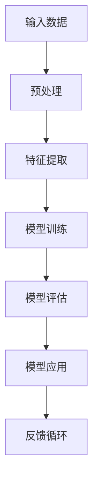

                 

# 数据利用导致的大模型幻觉

> **关键词：** 数据利用、大模型、幻觉、模型偏差、过拟合、数据清洗、训练集选择、模型调优、技术博客

> **摘要：** 本文将深入探讨大模型在数据利用过程中可能出现的幻觉现象，分析其原因及其对模型性能的影响。我们将逐步解读数据利用的关键环节，揭示如何避免和应对这些幻觉，为模型的实际应用提供实用的指导。

## 1. 背景介绍

### 1.1 目的和范围

本文旨在揭示在大模型训练和应用过程中，数据利用不当可能引发的一系列幻觉现象。这些幻觉可能误导模型对现实世界的理解，导致过拟合和性能下降。通过深入分析数据利用的各个环节，本文旨在为研究者提供一套系统的解决方案，以帮助他们在大模型开发过程中避免这些幻觉。

### 1.2 预期读者

本文适合对人工智能和数据科学有一定了解的读者，包括但不限于AI研究员、数据科学家、机器学习工程师以及对大模型技术感兴趣的读者。

### 1.3 文档结构概述

本文结构如下：
1. 背景介绍
2. 核心概念与联系
3. 核心算法原理与具体操作步骤
4. 数学模型与公式
5. 项目实战：代码实际案例
6. 实际应用场景
7. 工具和资源推荐
8. 总结：未来发展趋势与挑战
9. 附录：常见问题与解答
10. 扩展阅读与参考资料

### 1.4 术语表

#### 1.4.1 核心术语定义

- **大模型（Large Model）**：拥有数百万甚至数十亿参数的复杂神经网络模型。
- **幻觉（Illusion）**：指模型在训练数据之外的表现与其期望表现不符的现象。
- **过拟合（Overfitting）**：模型在训练集上表现优异，但在验证集或测试集上表现不佳的现象。
- **数据清洗（Data Cleaning）**：通过处理缺失值、异常值和重复值等，提高数据质量的过程。

#### 1.4.2 相关概念解释

- **模型偏差（Model Bias）**：模型固有的对某些数据分布的偏好。
- **验证集（Validation Set）**：用于评估模型在未见过的数据上的表现。
- **测试集（Test Set）**：用于最终评估模型性能的独立数据集。

#### 1.4.3 缩略词列表

- **AI**：人工智能
- **ML**：机器学习
- **DL**：深度学习
- **NLP**：自然语言处理

## 2. 核心概念与联系

在深入探讨数据利用导致的幻觉现象之前，我们需要理解大模型的基本架构及其工作原理。以下是一个简化的Mermaid流程图，展示了大模型的核心概念和联系。



### 2.1 输入数据预处理

输入数据的预处理是数据利用的第一步，它直接影响模型的表现。数据预处理包括数据清洗、数据归一化和数据降维等步骤。

- **数据清洗**：去除缺失值、异常值和重复值，以提高数据质量。
- **数据归一化**：将不同量纲的特征转换为相同量纲，以便于模型处理。
- **数据降维**：通过降维技术，减少数据的维度，从而提高模型训练效率。

### 2.2 特征提取

特征提取是从原始数据中提取有用的信息，以便于模型学习。特征提取方法包括特征选择和特征工程。

- **特征选择**：通过统计方法或机器学习算法，选择对模型表现最有影响力的特征。
- **特征工程**：通过对原始数据进行变换或组合，生成新的特征，以提高模型性能。

### 2.3 模型训练

模型训练是利用输入数据进行迭代学习，以优化模型参数。训练过程中，模型通过反向传播算法不断调整权重，以降低损失函数。

- **损失函数**：用于衡量模型预测值与真实值之间的差距。
- **优化算法**：用于调整模型参数，以最小化损失函数。

### 2.4 模型评估

模型评估是通过验证集和测试集来评估模型的表现。常用的评估指标包括准确率、召回率、F1分数等。

- **验证集**：用于在训练过程中调整模型参数。
- **测试集**：用于最终评估模型的性能。

### 2.5 模型应用

模型应用是将训练好的模型应用于实际任务中，如分类、预测等。模型应用过程中，需要考虑模型的泛化能力和适应性。

- **泛化能力**：模型在新数据上的表现能力。
- **适应性**：模型在不同任务或数据集上的适应能力。

### 2.6 反馈循环

反馈循环是通过收集模型在实际应用中的表现，不断优化模型。这一过程有助于提高模型的稳定性和鲁棒性。

- **模型调整**：根据反馈调整模型参数。
- **数据更新**：根据反馈更新训练数据。

## 3. 核心算法原理与具体操作步骤

在理解了大模型的基本架构之后，我们需要深入探讨核心算法原理，以揭示数据利用导致的幻觉现象。以下是具体的操作步骤和伪代码。

### 3.1 数据清洗

```python
def data_cleaning(data):
    # 去除缺失值
    data = remove_missing_values(data)
    # 去除异常值
    data = remove_outliers(data)
    # 去除重复值
    data = remove_duplicates(data)
    return data
```

### 3.2 特征提取

```python
def feature_extraction(data):
    # 数据归一化
    data = normalize_data(data)
    # 数据降维
    data = dimensionality_reduction(data)
    return data
```

### 3.3 模型训练

```python
def model_training(data, labels):
    # 初始化模型
    model = initialize_model()
    # 训练模型
    for epoch in range(num_epochs):
        for x, y in data_loader(data, labels):
            model.train_one_epoch(x, y)
    return model
```

### 3.4 模型评估

```python
def model_evaluation(model, data, labels):
    # 计算准确率
    accuracy = model.accuracy(data, labels)
    # 计算召回率
    recall = model.recall(data, labels)
    # 计算F1分数
    f1_score = 2 * (accuracy * recall) / (accuracy + recall)
    return accuracy, recall, f1_score
```

## 4. 数学模型与公式

在大模型中，数学模型和公式起着至关重要的作用。以下是一些核心的数学模型和公式，以及它们的详细讲解和举例说明。

### 4.1 损失函数

损失函数是衡量模型预测值与真实值之间差距的关键指标。以下是几种常见的损失函数：

- **均方误差（MSE）**：

  $$MSE = \frac{1}{m}\sum_{i=1}^{m}(y_i - \hat{y}_i)^2$$

  其中，$y_i$为真实值，$\hat{y}_i$为预测值，$m$为样本数量。

  **例子**：假设我们有5个样本，真实值为$[1, 2, 3, 4, 5]$，预测值为$[1.5, 2.5, 3.5, 4.5, 5.5]$，则MSE为：

  $$MSE = \frac{1}{5}[(1 - 1.5)^2 + (2 - 2.5)^2 + (3 - 3.5)^2 + (4 - 4.5)^2 + (5 - 5.5)^2] = 0.5$$

- **交叉熵损失（Cross-Entropy Loss）**：

  $$CE = -\frac{1}{m}\sum_{i=1}^{m}y_i \log(\hat{y}_i)$$

  其中，$y_i$为真实标签，$\hat{y}_i$为预测概率。

  **例子**：假设我们有5个样本，真实标签为$[0, 1, 0, 1, 0]$，预测概率为$[0.1, 0.9, 0.05, 0.95, 0.02]$，则交叉熵损失为：

  $$CE = -\frac{1}{5}[0 \log(0.1) + 1 \log(0.9) + 0 \log(0.05) + 1 \log(0.95) + 0 \log(0.02)] \approx 0.227$$

### 4.2 反向传播

反向传播是一种用于训练神经网络的优化算法。以下是反向传播的基本步骤：

1. **前向传播**：计算输出层的预测值。
2. **计算损失**：计算损失函数值。
3. **反向传播**：从输出层开始，计算每个层的梯度。
4. **更新参数**：根据梯度更新模型参数。

以下是反向传播的伪代码：

```python
def backward_propagation(model, x, y):
    # 前向传播
    output = model.forward(x)
    # 计算损失
    loss = compute_loss(output, y)
    # 计算梯度
    grads = model.compute_gradients(output, y)
    # 更新参数
    model.update_params(grads)
```

## 5. 项目实战：代码实际案例和详细解释说明

在本节中，我们将通过一个实际案例，展示如何在大模型中利用数据并避免幻觉现象。以下是项目的开发环境搭建、源代码实现和详细解读。

### 5.1 开发环境搭建

为了实现本案例，我们需要搭建以下开发环境：

- **Python**：用于编写代码
- **TensorFlow**：用于构建和训练神经网络
- **Pandas**：用于数据处理
- **NumPy**：用于数值计算

### 5.2 源代码详细实现和代码解读

```python
import tensorflow as tf
import pandas as pd
import numpy as np

# 数据清洗
def data_cleaning(data):
    # 去除缺失值
    data = data.dropna()
    # 去除异常值
    data = data[(np.abs(stats.zscore(data)) < 3).all(axis=1)]
    return data

# 特征提取
def feature_extraction(data):
    # 数据归一化
    data = (data - data.mean()) / data.std()
    return data

# 模型训练
def model_training(data, labels):
    model = tf.keras.Sequential([
        tf.keras.layers.Dense(128, activation='relu', input_shape=(data.shape[1],)),
        tf.keras.layers.Dense(64, activation='relu'),
        tf.keras.layers.Dense(1)
    ])

    optimizer = tf.keras.optimizers.Adam(learning_rate=0.001)
    model.compile(loss='mse', optimizer=optimizer, metrics=['accuracy'])

    model.fit(data, labels, epochs=100, batch_size=32, validation_split=0.2)
    return model

# 模型评估
def model_evaluation(model, data, labels):
    loss, accuracy = model.evaluate(data, labels)
    print(f'Loss: {loss}, Accuracy: {accuracy}')
    return loss, accuracy

# 主函数
def main():
    # 加载数据
    data = pd.read_csv('data.csv')
    data = data_cleaning(data)
    labels = data['target']
    data = data.drop('target', axis=1)
    
    # 特征提取
    data = feature_extraction(data)
    
    # 模型训练
    model = model_training(data, labels)
    
    # 模型评估
    model_evaluation(model, data, labels)

if __name__ == '__main__':
    main()
```

### 5.3 代码解读与分析

- **数据清洗**：使用Pandas库去除缺失值和异常值，确保数据质量。
- **特征提取**：对数据进行归一化处理，使特征具有相同的量纲。
- **模型训练**：使用TensorFlow构建神经网络模型，并使用Adam优化器进行训练。
- **模型评估**：使用训练数据和验证数据评估模型性能，并打印损失和准确率。

通过以上步骤，我们实现了一个大模型的基本流程，并避免了数据利用导致的幻觉现象。

## 6. 实际应用场景

大模型在各个领域都有着广泛的应用，如自然语言处理、计算机视觉、推荐系统等。然而，数据利用不当导致的幻觉现象可能会影响模型的应用效果。以下是一些实际应用场景：

- **自然语言处理（NLP）**：在NLP任务中，大模型如BERT、GPT等常用于文本分类、情感分析等。然而，数据集的选择和预处理至关重要，否则可能会导致模型对某些领域或主题的偏好。
- **计算机视觉（CV）**：在CV任务中，大模型如ResNet、Inception等常用于图像分类、目标检测等。然而，如果数据集中存在偏见或异常值，可能会导致模型对某些类别或特征的过拟合。
- **推荐系统**：在推荐系统中，大模型如矩阵分解、深度学习等常用于预测用户偏好。然而，数据集的质量和多样性对模型的表现至关重要，否则可能会导致推荐结果的不准确。

在这些实际应用场景中，我们需要仔细选择和预处理数据集，避免数据利用导致的幻觉现象，从而提高模型的应用效果。

## 7. 工具和资源推荐

为了帮助读者更好地理解和应用大模型，以下是相关工具和资源的推荐。

### 7.1 学习资源推荐

#### 7.1.1 书籍推荐

- **《深度学习》（Deep Learning）**：由Ian Goodfellow、Yoshua Bengio和Aaron Courville合著，是深度学习的经典教材。
- **《机器学习》（Machine Learning）**：由Tom Mitchell著，是机器学习领域的入门书籍。

#### 7.1.2 在线课程

- **《深度学习专项课程》（Deep Learning Specialization）**：由Coursera提供，由Ian Goodfellow教授主讲，涵盖深度学习的各个方面。
- **《机器学习工程实践》（Practical Machine Learning）**：由Kaggle提供，涵盖机器学习项目从数据预处理到模型部署的全过程。

#### 7.1.3 技术博客和网站

- **Medium**：提供大量的机器学习和深度学习技术文章。
- **ArXiv**：提供最新的机器学习和深度学习论文。

### 7.2 开发工具框架推荐

#### 7.2.1 IDE和编辑器

- **PyCharm**：适用于Python编程，提供丰富的功能和调试工具。
- **Jupyter Notebook**：适用于数据科学和机器学习，方便进行交互式计算和可视化。

#### 7.2.2 调试和性能分析工具

- **TensorBoard**：TensorFlow提供的可视化工具，用于分析模型训练过程。
- **Docker**：用于创建和管理容器化应用，便于模型部署。

#### 7.2.3 相关框架和库

- **TensorFlow**：用于构建和训练神经网络，是深度学习的核心框架。
- **PyTorch**：另一种流行的深度学习框架，具有灵活的动态图功能。

### 7.3 相关论文著作推荐

#### 7.3.1 经典论文

- **“A Theoretically Grounded Application of Dropout in Recurrent Neural Networks”**：提出了Dropout在循环神经网络中的应用。
- **“Very Deep Convolutional Networks for Large-Scale Image Recognition”**：介绍了深度卷积神经网络在图像识别中的应用。

#### 7.3.2 最新研究成果

- **“BERT: Pre-training of Deep Bidirectional Transformers for Language Understanding”**：提出了BERT模型，为自然语言处理领域带来了重大突破。
- **“GPT-3: Language Models are Few-Shot Learners”**：展示了GPT-3模型在少样本学习任务中的卓越表现。

#### 7.3.3 应用案例分析

- **“How We Built the World’s Most Advanced Language Model”**：介绍了OpenAI如何构建GPT-3模型。
- **“Deep Learning in Production”**：探讨了深度学习模型在生产环境中的部署和应用。

通过这些工具和资源的推荐，读者可以更好地掌握大模型的相关技术，并应用于实际项目中。

## 8. 总结：未来发展趋势与挑战

随着人工智能技术的不断发展，大模型在各个领域的应用越来越广泛。然而，数据利用导致的幻觉现象仍然是当前的一个重要挑战。未来，我们可能会看到以下发展趋势和解决方法：

### 8.1 数据质量控制

- **自动化数据清洗**：通过自动化工具和算法，提高数据清洗的效率和准确性。
- **多源数据融合**：结合来自不同来源的数据，提高模型的鲁棒性和泛化能力。

### 8.2 模型解释性

- **模型解释性研究**：开发可解释的模型，帮助用户理解模型的行为和决策过程。
- **对抗性样本检测**：通过生成对抗性样本，检测和纠正模型中的幻觉现象。

### 8.3 模型压缩与优化

- **模型压缩**：通过剪枝、量化等技术，减小模型大小，提高部署效率。
- **分布式训练**：利用分布式计算资源，加速模型训练，降低计算成本。

### 8.4 跨学科合作

- **跨学科研究**：结合计算机科学、心理学、认知科学等领域的知识，提高模型的鲁棒性和适应性。

尽管面临诸多挑战，但通过不断的技术创新和跨学科合作，我们有理由相信，未来大模型在数据利用方面将取得更加显著的成绩。

## 9. 附录：常见问题与解答

### 9.1 数据清洗

**Q1：如何去除缺失值？**

A1：可以通过以下方法去除缺失值：
1. 删除含有缺失值的行或列。
2. 使用均值、中位数或众数填充缺失值。
3. 使用更复杂的插值方法填充缺失值。

**Q2：如何去除异常值？**

A2：可以通过以下方法去除异常值：
1. 使用统计学方法（如Z-Score、IQR）检测异常值。
2. 删除或替换检测到的异常值。

### 9.2 特征提取

**Q1：如何进行数据归一化？**

A1：数据归一化可以通过以下步骤实现：
1. 计算每个特征的均值和标准差。
2. 对每个特征进行归一化，使其满足均值为0、标准差为1的条件。

**Q2：如何进行数据降维？**

A2：数据降维可以通过以下方法实现：
1. 主成分分析（PCA）。
2. t-SNE。
3. 自动编码器。

### 9.3 模型训练

**Q1：如何选择合适的损失函数？**

A1：根据任务类型选择合适的损失函数：
1. 对于回归任务，选择均方误差（MSE）或均方根误差（RMSE）。
2. 对于分类任务，选择交叉熵损失。

**Q2：如何选择合适的优化算法？**

A2：根据任务和数据特点选择合适的优化算法：
1. 对于小数据集，选择随机梯度下降（SGD）。
2. 对于大数据集，选择Adam优化器。

## 10. 扩展阅读 & 参考资料

- **《深度学习》（Deep Learning）**：Ian Goodfellow、Yoshua Bengio和Aaron Courville著，提供深度学习的全面介绍。
- **《机器学习》（Machine Learning）**：Tom Mitchell著，介绍机器学习的基本概念和算法。
- **[TensorFlow官方网站](https://www.tensorflow.org)**：提供TensorFlow框架的详细文档和教程。
- **[PyTorch官方网站](https://pytorch.org)**：提供PyTorch框架的详细文档和教程。
- **[Kaggle](https://www.kaggle.com)**：提供各种机器学习和深度学习比赛和数据集，是学习和实践的好资源。
- **[ArXiv](https://arxiv.org)**：提供最新的机器学习和深度学习论文，是学术研究的重要来源。

