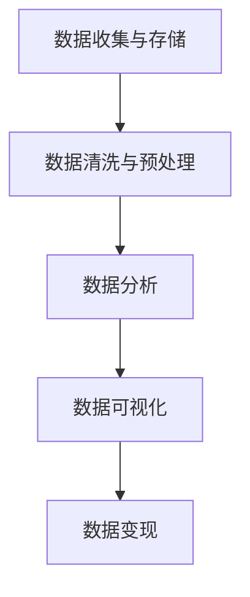

                 

# 数据即价值：个人开发者的数据变现之路

> 关键词：数据变现、个人开发者、数据价值、商业模型、技术实践

> 摘要：在数字化时代，数据已经成为新的生产要素，个人开发者如何有效地挖掘和变现自身数据价值，构建可持续的商业模型，成为当前亟待解决的重要课题。本文将深入探讨数据变现的原理、路径和实践，旨在为个人开发者提供一套系统的解决方案，助力其在数据经济的浪潮中脱颖而出。

## 1. 背景介绍

### 1.1 目的和范围

本文旨在为个人开发者提供关于数据变现的全面指南。我们将从核心概念出发，分析数据变现的原理和路径，并通过实际案例和数学模型，展示如何将数据转化为商业价值。本文适合对数据变现感兴趣的初学者、经验丰富的开发者以及想要在数字化时代实现自我价值的个人开发者。

### 1.2 预期读者

- 对数据变现感兴趣的初学者和从业者
- 想要在数字化时代实现商业价值的个人开发者
- 对数据分析、机器学习和商业策略有兴趣的技术人员

### 1.3 文档结构概述

本文分为八个部分，分别如下：

1. 背景介绍：介绍本文的目的、范围和预期读者。
2. 核心概念与联系：讲解数据变现的相关概念和联系。
3. 核心算法原理 & 具体操作步骤：分析数据变现的核心算法原理和操作步骤。
4. 数学模型和公式 & 详细讲解 & 举例说明：介绍数据变现的数学模型和公式。
5. 项目实战：提供代码实际案例和详细解释说明。
6. 实际应用场景：探讨数据变现的实际应用场景。
7. 工具和资源推荐：推荐学习资源、开发工具和框架。
8. 总结：展望数据变现的未来发展趋势与挑战。
9. 附录：常见问题与解答。
10. 扩展阅读 & 参考资料：提供进一步学习的资源。

### 1.4 术语表

#### 1.4.1 核心术语定义

- 数据变现：将数据转化为商业价值的过程。
- 个人开发者：独立或小团队开发软件或提供技术服务的开发者。
- 数据价值：数据在商业应用中所产生的效益。
- 商业模型：企业或个人在商业活动中所采用的具体运营方式。

#### 1.4.2 相关概念解释

- 数据挖掘：从大量数据中提取有价值信息的过程。
- 数据分析：通过对数据的分析，揭示数据背后的规律和趋势。
- 机器学习：利用数据训练模型，实现自动化决策和预测的技术。

#### 1.4.3 缩略词列表

- API：应用程序编程接口（Application Programming Interface）
- BI：商业智能（Business Intelligence）
- ML：机器学习（Machine Learning）
- AI：人工智能（Artificial Intelligence）

## 2. 核心概念与联系

为了深入理解数据变现，我们首先需要了解以下几个核心概念：

### 2.1 数据收集与存储

数据收集是指从各种来源获取数据的过程。这些来源包括用户行为数据、社交媒体数据、交易数据等。数据存储是将收集到的数据存储到数据库或其他数据存储系统中，以便进行后续处理和分析。

### 2.2 数据清洗与预处理

数据清洗是指去除数据中的噪声和错误，保证数据的质量。数据预处理包括数据格式转换、数据归一化、缺失值填补等步骤，以确保数据适用于后续的分析和建模。

### 2.3 数据分析

数据分析是指通过对数据进行分析，揭示数据背后的规律和趋势。数据分析包括描述性分析、预测性分析和诊断性分析等类型，旨在帮助企业或个人做出更明智的决策。

### 2.4 数据可视化

数据可视化是将数据以图形、图表等形式展示，使得数据更容易理解和解释。数据可视化有助于发现数据中的隐藏模式、趋势和异常。

### 2.5 数据变现

数据变现是指将数据转化为商业价值的过程。数据变现可以通过多种方式实现，例如广告收入、产品销售、定制化服务等。

下面是一个 Mermaid 流程图，展示了数据变现的核心概念和联系：



## 3. 核心算法原理 & 具体操作步骤

### 3.1 数据收集与存储

数据收集的方法和工具取决于数据的来源。例如，对于用户行为数据，可以使用 Web 分析工具（如 Google Analytics）收集。对于社交媒体数据，可以使用 API 调用获取。数据存储通常使用数据库（如 MySQL、PostgreSQL）或数据仓库（如 Amazon Redshift、Google BigQuery）。

伪代码：

```python
# 数据收集
def collect_data(source):
    if source == "web":
        data = get_web_data()
    elif source == "social_media":
        data = get_social_media_data()
    return data

# 数据存储
def store_data(data, database):
    database.insert(data)
```

### 3.2 数据清洗与预处理

数据清洗和预处理的步骤包括去除噪声、错误、缺失值和重复值等。可以使用 Python 的 Pandas 库进行数据清洗和预处理。

伪代码：

```python
import pandas as pd

# 数据清洗与预处理
def clean_and_preprocess_data(data):
    data = data.drop_duplicates()  # 去除重复值
    data = data.dropna()  # 去除缺失值
    # 其他清洗和预处理步骤...
    return data
```

### 3.3 数据分析

数据分析的方法和工具取决于分析的目标。描述性分析可以使用 SQL 或 Python 的 Pandas 库。预测性分析可以使用 Python 的 Scikit-learn 或 TensorFlow 库。

伪代码：

```python
# 描述性分析
def descriptive_analysis(data):
    summary = data.describe()
    return summary

# 预测性分析
from sklearn.ensemble import RandomForestClassifier

def predictive_analysis(data, target):
    model = RandomForestClassifier()
    model.fit(data, target)
    predictions = model.predict(data)
    return predictions
```

### 3.4 数据可视化

数据可视化可以使用 Python 的 Matplotlib 或 Seaborn 库。

伪代码：

```python
import matplotlib.pyplot as plt
import seaborn as sns

# 数据可视化
def visualize_data(data):
    sns.scatterplot(x="feature1", y="feature2", data=data)
    plt.show()
```

### 3.5 数据变现

数据变现的方法包括广告收入、产品销售和定制化服务等。以下是一个简单的广告收入变现示例：

伪代码：

```python
# 数据变现：广告收入
def generate_revenue(data, ad_revenue_per_user):
    user_count = data.count()
    revenue = user_count * ad_revenue_per_user
    return revenue
```

## 4. 数学模型和公式 & 详细讲解 & 举例说明

### 4.1 广告收入模型

假设有 n 个用户，每个用户每天访问网站 m 次，每次访问带来 p 元的收入。那么，总广告收入可以表示为：

\[ \text{总广告收入} = n \times m \times p \]

举例说明：

假设有 100 个用户，每个用户每天访问网站 5 次，每次访问带来 0.1 元的收入。那么，总广告收入为：

\[ 100 \times 5 \times 0.1 = 50 \text{元} \]

### 4.2 预测性分析模型

假设我们使用线性回归模型预测用户行为。线性回归模型的一般形式为：

\[ y = \beta_0 + \beta_1 x \]

其中，\( y \) 为因变量，\( x \) 为自变量，\( \beta_0 \) 和 \( \beta_1 \) 为模型参数。

举例说明：

假设我们使用用户年龄（x）预测用户购买意愿（y）。通过收集数据并训练线性回归模型，我们可以得到模型参数 \( \beta_0 \) 和 \( \beta_1 \)。例如，如果 \( \beta_0 = 10 \)，\( \beta_1 = 0.5 \)，那么预测公式为：

\[ y = 10 + 0.5x \]

当 x = 30 时，预测的用户购买意愿为：

\[ y = 10 + 0.5 \times 30 = 25 \]

## 5. 项目实战：代码实际案例和详细解释说明

### 5.1 开发环境搭建

为了实现数据变现，我们需要搭建一个开发环境。以下是一个基本的开发环境搭建步骤：

1. 安装 Python 3.x 版本。
2. 安装 Python 的相关库，如 Pandas、NumPy、Matplotlib、Scikit-learn 等。
3. 安装数据库，如 MySQL 或 PostgreSQL。
4. 安装数据可视化工具，如 Matplotlib 或 Seaborn。

### 5.2 源代码详细实现和代码解读

以下是一个简单的数据变现项目示例，包括数据收集、数据清洗、数据分析、数据可视化和数据变现等步骤。

```python
# 导入相关库
import pandas as pd
import numpy as np
import matplotlib.pyplot as plt
import seaborn as sns
from sklearn.linear_model import LinearRegression

# 数据收集
def collect_data(source):
    if source == "web":
        data = pd.read_csv("web_data.csv")
    elif source == "social_media":
        data = pd.read_csv("social_media_data.csv")
    return data

# 数据清洗与预处理
def clean_and_preprocess_data(data):
    data = data.drop_duplicates()
    data = data.dropna()
    return data

# 数据分析
def descriptive_analysis(data):
    summary = data.describe()
    return summary

def predictive_analysis(data, target):
    model = LinearRegression()
    model.fit(data, target)
    predictions = model.predict(data)
    return predictions

# 数据可视化
def visualize_data(data):
    sns.scatterplot(x="feature1", y="feature2", data=data)
    plt.show()

# 数据变现
def generate_revenue(data, ad_revenue_per_user):
    user_count = data.count()
    revenue = user_count * ad_revenue_per_user
    return revenue

# 主函数
def main():
    data = collect_data("web")
    data = clean_and_preprocess_data(data)
    summary = descriptive_analysis(data)
    predictions = predictive_analysis(data, target)
    visualize_data(data)
    revenue = generate_revenue(data, ad_revenue_per_user=0.1)
    print("总广告收入：", revenue)

if __name__ == "__main__":
    main()
```

### 5.3 代码解读与分析

1. **数据收集**：从 Web 数据文件中读取数据。
2. **数据清洗与预处理**：去除重复值和缺失值。
3. **数据分析**：计算数据的基本统计信息。
4. **预测性分析**：使用线性回归模型预测用户行为。
5. **数据可视化**：绘制用户行为的散点图。
6. **数据变现**：计算广告收入。

通过上述代码示例，我们可以看到数据变现的完整流程。在实际项目中，可以根据具体需求对代码进行调整和扩展。

## 6. 实际应用场景

数据变现的实际应用场景非常广泛，以下是一些典型的应用场景：

1. **广告收入**：通过分析用户行为数据，为广告主提供精准投放，实现广告收入。
2. **定制化服务**：根据用户数据，为用户提供个性化的产品或服务，提高用户满意度。
3. **推荐系统**：通过分析用户历史行为数据，为用户推荐相关的产品或内容。
4. **风险控制**：通过分析用户数据，识别潜在的风险，采取相应的措施进行风险控制。
5. **市场研究**：通过分析用户数据，了解市场需求和趋势，为企业提供市场决策支持。

以下是一个数据变现的实际案例：

假设一个在线购物平台通过分析用户购买行为数据，实现广告收入变现。平台收集了用户的基本信息（如年龄、性别、收入等）、购物车数据（如商品类型、价格等）和购买历史数据。通过分析这些数据，平台可以识别出潜在的广告主，并为广告主提供精准投放服务。

具体操作步骤如下：

1. **数据收集**：收集用户的基本信息、购物车数据和购买历史数据。
2. **数据清洗与预处理**：去除重复值和缺失值，进行数据格式转换。
3. **数据分析**：分析用户购买行为，识别潜在的广告主。
4. **预测性分析**：使用机器学习模型预测用户的购买意愿。
5. **数据可视化**：绘制用户购买行为的图表，为广告主提供可视化报告。
6. **广告投放**：根据预测结果，为广告主提供精准投放服务。
7. **数据变现**：根据广告主投放的广告，计算广告收入。

通过上述步骤，平台可以实现数据变现，提高广告收入。

## 7. 工具和资源推荐

### 7.1 学习资源推荐

#### 7.1.1 书籍推荐

- 《数据挖掘：概念与技术》
- 《机器学习实战》
- 《Python数据科学手册》
- 《商业智能》

#### 7.1.2 在线课程

- Coursera 上的《机器学习》
- Udacity 上的《数据科学纳米学位》
- edX 上的《数据科学基础》

#### 7.1.3 技术博客和网站

- Medium 上的《数据科学》
-Towards Data Science
- KDNuggets

### 7.2 开发工具框架推荐

#### 7.2.1 IDE和编辑器

- PyCharm
- Visual Studio Code
- Jupyter Notebook

#### 7.2.2 调试和性能分析工具

- Python Debugger
- profilers
- memory_profiler

#### 7.2.3 相关框架和库

- Pandas
- NumPy
- Matplotlib
- Scikit-learn
- TensorFlow

### 7.3 相关论文著作推荐

#### 7.3.1 经典论文

- 《K-Means算法：一种基于聚类的方法》
- 《随机森林：一种高效的分类与回归方法》
- 《基于协同过滤的推荐系统》

#### 7.3.2 最新研究成果

- 《大数据与人工智能：未来趋势与挑战》
- 《深度学习在自然语言处理中的应用》
- 《联邦学习：隐私保护的数据共享方法》

#### 7.3.3 应用案例分析

- 《数据变现：阿里巴巴的商业智慧》
- 《数据驱动的市场营销：谷歌的成功经验》
- 《基于大数据的金融风控：蚂蚁金服的实践》

## 8. 总结：未来发展趋势与挑战

随着数字化时代的到来，数据已经成为新的生产要素。数据变现作为将数据转化为商业价值的重要途径，在未来将呈现出以下发展趋势：

1. **数据价值的提升**：随着数据收集和存储技术的进步，数据的价值将得到进一步提升。
2. **个性化服务的普及**：基于用户数据，提供个性化服务将成为企业竞争的关键。
3. **跨行业应用**：数据变现将在更多行业中得到应用，推动各行业的数字化转型。
4. **隐私保护与法规合规**：数据隐私保护和法规合规将成为数据变现的重要挑战。

面对这些发展趋势，个人开发者需要关注以下挑战：

1. **数据安全和隐私**：在数据变现过程中，如何保护用户隐私和数据安全成为关键问题。
2. **数据质量**：数据质量直接影响数据变现的效果，开发者需要注重数据质量的管理。
3. **技术储备**：开发者需要不断学习和掌握最新的数据分析和机器学习技术，以应对不断变化的市场需求。

总之，数据变现将为个人开发者提供巨大的机遇，同时也伴随着诸多挑战。开发者需要不断学习和创新，以在数据经济的浪潮中脱颖而出。

## 9. 附录：常见问题与解答

1. **Q：数据变现的主要途径有哪些？**
   **A：数据变现的主要途径包括广告收入、产品销售、定制化服务、推荐系统和风险控制等。**

2. **Q：如何保证数据变现的合法性？**
   **A：在数据变现过程中，应确保数据收集和使用符合相关法律法规，尊重用户隐私，采取数据加密和匿名化等保护措施。**

3. **Q：如何评估数据变现的效果？**
   **A：可以通过分析广告点击率、转化率、用户满意度等指标来评估数据变现的效果。**

4. **Q：数据变现与商业智能有何关联？**
   **A：数据变现是商业智能的一个应用领域，通过分析用户数据，实现数据转化为商业价值。**

## 10. 扩展阅读 & 参考资料

1. **《数据科学入门》**
2. **《机器学习实战》**
3. **《大数据技术导论》**
4. **《商业智能：战略、方法与实践》**
5. **《数据挖掘：实用工具与技术》**

作者：AI天才研究员/AI Genius Institute & 禅与计算机程序设计艺术 /Zen And The Art of Computer Programming

本文旨在为个人开发者提供关于数据变现的全面指南，从核心概念到实际操作，帮助读者理解数据变现的原理和路径。在数字化时代，数据变现已成为一项重要技能，开发者应积极学习和实践，以在数据经济的浪潮中脱颖而出。

