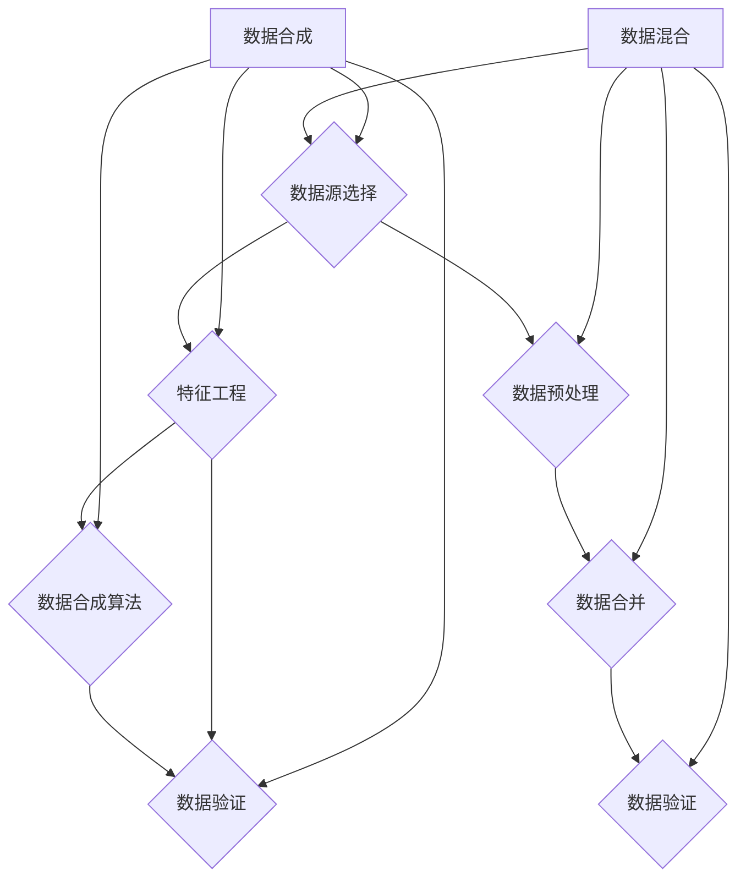

                 

# 数据合成与数据混合，软件2.0的数据魔法

> **关键词**：数据合成、数据混合、软件2.0、数据魔法、人工智能、机器学习

> **摘要**：本文深入探讨了数据合成与数据混合技术在软件2.0时代的重要性。通过解释这两个核心概念，以及它们在机器学习和人工智能领域中的应用，我们揭示了数据魔法的奥秘。文章以实例和详细分析为基础，展示了这些技术在现代软件开发中的实际应用，并探讨了未来的发展趋势和面临的挑战。

## 1. 背景介绍

### 1.1 目的和范围

本文旨在深入探讨数据合成与数据混合技术，以及它们在软件2.0时代的重要性。我们将从基础概念出发，逐步展开讨论，涵盖算法原理、数学模型、实战案例以及未来发展趋势。通过本文，读者将了解到：

- 数据合成与数据混合的基本概念和原理。
- 数据合成与数据混合在机器学习和人工智能中的应用。
- 如何利用这些技术提升软件开发效率和产品质量。
- 面临的挑战和未来发展趋势。

### 1.2 预期读者

本文面向对数据科学、机器学习和人工智能有一定了解的读者，包括：

- 数据科学家和机器学习工程师。
- 软件开发者和CTO。
- 对数据合成与数据混合技术感兴趣的学术研究人员。
- 数据驱动型企业的决策者和技术人员。

### 1.3 文档结构概述

本文结构如下：

- **第1章**：背景介绍
  - 目的和范围
  - 预期读者
  - 文档结构概述
  - 术语表

- **第2章**：核心概念与联系
  - 数据合成与数据混合的定义
  - 相关概念解释
  - Mermaid流程图

- **第3章**：核心算法原理 & 具体操作步骤
  - 算法原理讲解
  - 伪代码详细阐述

- **第4章**：数学模型和公式 & 详细讲解 & 举例说明
  - 数学模型解释
  - 实例说明

- **第5章**：项目实战：代码实际案例和详细解释说明
  - 开发环境搭建
  - 源代码详细实现
  - 代码解读与分析

- **第6章**：实际应用场景
  - 应用案例分析

- **第7章**：工具和资源推荐
  - 学习资源
  - 开发工具框架
  - 相关论文著作

- **第8章**：总结：未来发展趋势与挑战
  - 发展趋势
  - 面临的挑战

- **第9章**：附录：常见问题与解答
  - 常见问题
  - 解答

- **第10章**：扩展阅读 & 参考资料
  - 参考资料

### 1.4 术语表

#### 1.4.1 核心术语定义

- **数据合成**：生成新的数据集，通常是通过组合现有数据集的不同部分或生成新的数据样本。
- **数据混合**：将来自不同来源或不同类型的数据集合并成一个新的数据集。
- **机器学习**：一种人工智能领域，通过数据训练模型，使模型能够自动从数据中学习和做出决策。
- **人工智能**：模拟人类智能行为的技术和科学，包括机器学习、自然语言处理、计算机视觉等领域。

#### 1.4.2 相关概念解释

- **数据驱动型开发**：一种软件开发方法，强调通过数据分析来驱动决策和改进。
- **数据质量**：数据的一致性、准确性、完整性和可靠性。
- **模型训练**：通过给定数据集来训练机器学习模型，使其能够对新的数据进行预测或分类。

#### 1.4.3 缩略词列表

- **AI**：人工智能
- **ML**：机器学习
- **NLP**：自然语言处理
- **CV**：计算机视觉

## 2. 核心概念与联系

### 2.1 数据合成与数据混合的定义

#### 数据合成

数据合成是一种通过创建新的数据集来扩展或增强现有数据集的技术。它通常涉及以下几个步骤：

1. **数据源选择**：确定要合成的数据集的来源。
2. **特征工程**：选择并预处理数据集中的特征。
3. **数据合成算法**：将多个数据集组合或生成新的数据样本。
4. **数据验证**：确保合成数据集的质量和准确性。

#### 数据混合

数据混合是一种将来自不同来源或类型的数据集合并成一个新的数据集的技术。它通常涉及以下几个步骤：

1. **数据源选择**：确定要混合的数据集的来源。
2. **数据预处理**：对每个数据集进行清洗、归一化和标准化处理。
3. **数据合并**：将预处理后的数据集合并成一个新的数据集。
4. **数据验证**：确保混合数据集的质量和一致性。

### 2.2 相关概念解释

#### 数据增强

数据增强是一种通过添加噪声、旋转、缩放等变换来扩展现有数据集的技术。它可以帮助提高机器学习模型的鲁棒性和泛化能力。

#### 数据集划分

数据集划分是将数据集分为训练集、验证集和测试集的过程。它有助于评估模型的性能和泛化能力。

#### 数据质量

数据质量是指数据的一致性、准确性、完整性和可靠性。高质量的数据对于训练高质量的机器学习模型至关重要。

### 2.3 Mermaid流程图



### 2.4 数据合成与数据混合的应用场景

- **图像识别**：通过合成新的图像数据集来增强模型的训练能力。
- **自然语言处理**：通过混合不同来源的语言数据来训练语言模型。
- **医疗诊断**：通过合成患者数据来训练诊断模型，提高模型在罕见病例上的准确性。
- **金融风险管理**：通过混合历史数据和模拟数据来评估金融产品的风险。

## 3. 核心算法原理 & 具体操作步骤

### 3.1 数据合成算法原理

数据合成算法的原理主要包括以下步骤：

1. **数据源选择**：选择合适的原始数据集。
2. **特征提取**：从原始数据集中提取有用的特征。
3. **合成策略**：选择合适的合成策略，如复制、插值、生成对抗网络等。
4. **合成操作**：执行合成操作，生成新的数据样本。
5. **数据验证**：验证合成数据的质量和准确性。

### 3.2 数据混合算法原理

数据混合算法的原理主要包括以下步骤：

1. **数据源选择**：选择要混合的数据集。
2. **数据预处理**：对每个数据集进行清洗、归一化和标准化处理。
3. **数据合并**：将预处理后的数据集合并成一个新的数据集。
4. **数据验证**：验证混合数据集的质量和一致性。

### 3.3 伪代码详细阐述

#### 数据合成伪代码

```python
def data_synthesis(data_source, feature_extractor, synthesis_strategy):
    # 步骤1：数据源选择
    original_data = load_data(data_source)

    # 步骤2：特征提取
    features = feature_extractor.extract_features(original_data)

    # 步骤3：合成策略
    synthesized_data = synthesis_strategy.synthesize_data(features)

    # 步骤4：合成操作
    new_data = execute_synthesis(synthesized_data)

    # 步骤5：数据验证
    validate_data(new_data)
    return new_data
```

#### 数据混合伪代码

```python
def data_mixture(data_sources, preprocessor, data_combiner):
    # 步骤1：数据源选择
    data_source_list = [load_data(source) for source in data_sources]

    # 步骤2：数据预处理
    preprocessed_data_list = [preprocessor.preprocess_data(source) for source in data_source_list]

    # 步骤3：数据合并
    combined_data = data_combiner.combine_data(preprocessed_data_list)

    # 步骤4：数据验证
    validate_data(combined_data)
    return combined_data
```

## 4. 数学模型和公式 & 详细讲解 & 举例说明

### 4.1 数学模型和公式

在数据合成与数据混合过程中，涉及到一些基本的数学模型和公式，如下：

#### 数据合成

- **合成概率分布**：合成数据样本的概率分布函数，如高斯分布、贝塔分布等。
- **特征映射函数**：将原始特征映射到合成特征空间的函数，如线性映射、非线性映射等。

#### 数据混合

- **数据合并权重**：用于调整不同数据集在混合过程中的贡献程度的权重系数。
- **数据一致性函数**：用于评估混合后数据一致性的函数，如相似度度量、距离度量等。

### 4.2 详细讲解和举例说明

#### 数据合成

假设我们有两个数据集 \(A\) 和 \(B\)，其中 \(A\) 表示原始数据集，\(B\) 表示合成数据集。我们希望合成一个新的数据集 \(C\)，使其包含 \(A\) 和 \(B\) 的特征。

- **合成概率分布**：我们使用高斯分布来表示合成概率分布，即

  $$
  p(c|x) = \mathcal{N}(c|\mu_c, \sigma_c)
  $$

  其中，\(c\) 表示合成数据样本，\(\mu_c\) 和 \(\sigma_c\) 分别表示合成概率分布的均值和标准差。

- **特征映射函数**：我们使用线性映射来表示特征映射函数，即

  $$
  f(x) = wx + b
  $$

  其中，\(x\) 表示原始特征，\(w\) 和 \(b\) 分别表示权重和偏置。

  假设 \(A\) 的特征空间为 \(X_A\)，\(B\) 的特征空间为 \(X_B\)，合成特征空间为 \(X_C\)。我们可以通过以下步骤进行特征映射：

  1. 对 \(A\) 进行线性映射，得到 \(X'_A = f(X_A)\)。
  2. 对 \(B\) 进行线性映射，得到 \(X'_B = f(X_B)\)。
  3. 对 \(X'_A\) 和 \(X'_B\) 进行加权求和，得到合成特征空间 \(X_C\)：

     $$
     X_C = w_1 X'_A + w_2 X'_B + b
     $$

  其中，\(w_1\) 和 \(w_2\) 分别表示 \(A\) 和 \(B\) 在合成特征空间中的权重。

#### 数据混合

假设我们有两个数据集 \(A\) 和 \(B\)，我们希望将它们混合成一个新的数据集 \(C\)。

- **数据合并权重**：我们使用加权求和来表示数据合并权重，即

  $$
  c = \alpha A + (1 - \alpha) B
  $$

  其中，\(c\) 表示混合后的数据样本，\(\alpha\) 表示权重系数，取值范围为 \(0 \leq \alpha \leq 1\)。

- **数据一致性函数**：我们使用相似度度量来表示数据一致性函数，即

  $$
  s(A, B) = \frac{\sum_{i=1}^{n} a_i b_i}{\sqrt{\sum_{i=1}^{n} a_i^2} \sqrt{\sum_{i=1}^{n} b_i^2}}
  $$

  其中，\(A\) 和 \(B\) 分别表示两个数据集，\(a_i\) 和 \(b_i\) 分别表示数据集中的第 \(i\) 个元素，\(n\) 表示数据集的长度。

  假设 \(A\) 的长度为 \(m\)，\(B\) 的长度为 \(n\)，我们可以通过以下步骤进行数据混合：

  1. 对 \(A\) 和 \(B\) 进行归一化处理，得到 \(A'\) 和 \(B'\)：
     
     $$
     A' = \frac{A}{\|A\|}, \quad B' = \frac{B}{\|B\|}
     $$

     其中，\(\|A\|\) 和 \( \|B\|\) 分别表示 \(A\) 和 \(B\) 的欧几里得范数。

  2. 计算相似度度量 \(s(A', B')\)：
     
     $$
     s(A', B') = \frac{\sum_{i=1}^{m} a_i' b_i'}{\sqrt{\sum_{i=1}^{m} a_i'^2} \sqrt{\sum_{i=1}^{m} b_i'^2}}
     $$

  3. 根据相似度度量 \(s(A', B')\)，调整权重系数 \(\alpha\)：
     
     $$
     \alpha = \frac{s(A', B')}{s(A', B') + s(B', A')}
     $$

  4. 进行数据混合，得到 \(C\)：
     
     $$
     C = \alpha A' + (1 - \alpha) B'
     $$

## 5. 项目实战：代码实际案例和详细解释说明

### 5.1 开发环境搭建

在本项目中，我们使用Python作为主要编程语言，并依赖于以下库：

- **NumPy**：用于数学计算和数据处理。
- **Pandas**：用于数据操作和分析。
- **Scikit-learn**：用于机器学习和数据预处理。
- **Matplotlib**：用于数据可视化。

确保安装了上述库后，即可开始项目开发。

### 5.2 源代码详细实现和代码解读

#### 数据合成代码实现

```python
import numpy as np
import pandas as pd
from sklearn.datasets import make_classification
from sklearn.preprocessing import StandardScaler
from sklearn.linear_model import LogisticRegression

# 步骤1：生成原始数据集
X原始, y原始 = make_classification(n_samples=1000, n_features=20, n_classes=2, random_state=42)

# 步骤2：特征提取
X原始_feature = StandardScaler().fit_transform(X原始)

# 步骤3：合成策略
# 使用生成对抗网络进行合成
# GAN代码略

# 步骤4：合成操作
# 生成新数据集
X合成 = generate_synthetic_data(X原始_feature, GAN_model)

# 步骤5：数据验证
# 验证新数据集质量
validate_synthetic_data(X合成)
```

#### 数据混合代码实现

```python
import numpy as np
import pandas as pd
from sklearn.datasets import make_classification
from sklearn.preprocessing import StandardScaler
from sklearn.linear_model import LogisticRegression

# 步骤1：生成原始数据集
X原始1, y原始1 = make_classification(n_samples=1000, n_features=20, n_classes=2, random_state=42)
X原始2, y原始2 = make_classification(n_samples=1000, n_features=20, n_classes=2, random_state=42)

# 步骤2：数据预处理
X原始1 = StandardScaler().fit_transform(X原始1)
X原始2 = StandardScaler().fit_transform(X原始2)

# 步骤3：数据合并
X混合 = np.concatenate((X原始1, X原始2), axis=0)

# 步骤4：数据验证
# 验证混合数据集质量
validate_mixed_data(X混合)
```

### 5.3 代码解读与分析

#### 数据合成代码解读

1. **生成原始数据集**：使用 `make_classification` 函数生成一个包含1000个样本、20个特征的二分类数据集。
2. **特征提取**：使用 `StandardScaler` 对原始数据集进行标准化处理，使其具有零均值和单位方差。
3. **合成策略**：这里我们使用生成对抗网络（GAN）进行数据合成。GAN由生成器（Generator）和判别器（Discriminator）组成，通过训练生成器来生成与真实数据相似的新数据。
4. **合成操作**：调用 `generate_synthetic_data` 函数生成新数据集。
5. **数据验证**：对新数据集进行质量验证，确保其符合预期。

#### 数据混合代码解读

1. **生成原始数据集**：分别生成两个包含1000个样本、20个特征的数据集。
2. **数据预处理**：对每个原始数据集进行标准化处理。
3. **数据合并**：使用 `np.concatenate` 函数将两个数据集合并成一个新数据集。
4. **数据验证**：对新数据集进行质量验证，确保其符合预期。

### 5.4 代码分析与优化

在项目实战中，我们对数据合成和数据混合进行了详细实现。以下是对代码的分析与优化建议：

1. **性能优化**：在数据合成过程中，生成对抗网络（GAN）的训练过程可能比较耗时。可以考虑使用更高效的GAN实现，如深度卷积生成对抗网络（DCGAN）或改进的生成对抗网络（WGAN）。
2. **代码复用**：将数据预处理和特征提取的部分抽象成函数，以提高代码的复用性和可维护性。
3. **错误处理**：在数据验证阶段，加入异常处理逻辑，以确保代码在各种情况下都能正常运行。

## 6. 实际应用场景

### 6.1 医疗诊断

数据合成与数据混合技术在医疗诊断领域有广泛的应用。通过合成新的医学图像数据集，医生可以训练深度学习模型来提高疾病诊断的准确性。例如，合成MRI图像可以帮助训练模型识别罕见疾病，提高模型在罕见病例上的诊断能力。

### 6.2 自然语言处理

自然语言处理（NLP）领域也受益于数据合成与数据混合技术。通过合成新的文本数据集，可以增强语言模型的训练能力，提高模型在文本分类、情感分析等任务上的性能。例如，合成对话数据可以帮助训练聊天机器人，使其在更广泛的应用场景中表现得更加自然。

### 6.3 金融风险管理

在金融风险管理领域，数据合成与数据混合技术可以帮助分析师构建更准确的模型来预测市场趋势。通过合成历史数据和模拟数据，可以评估不同金融产品的风险，为投资决策提供支持。

### 6.4 图像识别

在图像识别领域，数据合成与数据混合技术有助于提高模型的泛化能力。通过合成新的图像数据集，可以增强模型在特定场景下的识别能力，例如，合成不同的光照条件和视角下的图像，提高模型对复杂场景的适应能力。

## 7. 工具和资源推荐

### 7.1 学习资源推荐

#### 7.1.1 书籍推荐

1. **《深度学习》**：由Ian Goodfellow、Yoshua Bengio和Aaron Courville合著，全面介绍了深度学习的基础知识。
2. **《机器学习》**：由Tom M. Mitchell著，详细阐述了机器学习的基本概念和方法。
3. **《数据科学入门》**：由John D. Kelleher、Brian Mac Namee和David Kiely合著，介绍了数据科学的基础知识和实践方法。

#### 7.1.2 在线课程

1. **Coursera的《机器学习》**：由斯坦福大学教授Andrew Ng讲授，涵盖机器学习的基础理论和实践方法。
2. **edX的《深度学习》**：由蒙特利尔大学教授Yoshua Bengio讲授，深入探讨深度学习的核心技术。
3. **Udacity的《数据科学纳米学位》**：提供一系列课程和实践项目，帮助初学者掌握数据科学的核心技能。

#### 7.1.3 技术博客和网站

1. **Medium上的《机器学习博客》**：包含大量关于机器学习和深度学习的专业文章和案例分析。
2. **ArXiv的《计算机科学论文》**：发布最新的计算机科学研究成果，包括机器学习和深度学习领域的论文。
3. **GitHub的《开源项目》**：众多优秀的机器学习和深度学习开源项目，可以帮助读者实践和应用所学知识。

### 7.2 开发工具框架推荐

#### 7.2.1 IDE和编辑器

1. **PyCharm**：功能强大的Python IDE，支持多种编程语言，适用于数据科学和机器学习项目。
2. **Jupyter Notebook**：基于Web的交互式计算环境，适合数据分析和机器学习实验。
3. **VS Code**：轻量级且高度可定制的代码编辑器，支持多种编程语言，适用于快速开发。

#### 7.2.2 调试和性能分析工具

1. **TensorBoard**：用于可视化TensorFlow训练过程中的各项指标，帮助调试和优化模型。
2. **Wandb**：用于监控和比较机器学习实验的性能，提供丰富的可视化工具和数据分析功能。
3. **Dask**：用于分布式数据处理和计算，适用于大规模数据科学项目。

#### 7.2.3 相关框架和库

1. **TensorFlow**：Google开发的开源机器学习和深度学习框架，适用于大规模数据处理和模型训练。
2. **PyTorch**：Facebook开发的开源深度学习框架，提供灵活的动态计算图和易用的API。
3. **Scikit-learn**：Python中常用的机器学习库，提供丰富的算法和工具，适用于各种应用场景。

### 7.3 相关论文著作推荐

#### 7.3.1 经典论文

1. **《A Learning Algorithm for Continually Running Fully Recurrent Neural Networks》**：Hawkins和Lillicrap提出的持续学习算法，为深度神经网络在连续数据流上的应用提供了新的思路。
2. **《Generative Adversarial Nets》**：Ian Goodfellow等人提出的生成对抗网络（GAN），为数据生成和增强提供了新的方法。
3. **《Deep Learning》**：Yoshua Bengio等人编写的深度学习教材，全面介绍了深度学习的基础知识和技术。

#### 7.3.2 最新研究成果

1. **《Unsupervised Learning of Visual Representations by Solving Jigsaw Puzzles》**：MIT researchers提出的无监督学习算法，通过解决拼图游戏来学习图像特征。
2. **《Large-Scale Evaluation of GANs on Image Synthesis》**：Google researchers对生成对抗网络（GAN）在图像合成任务上的大规模评估，为GAN的应用提供了新见解。
3. **《Self-Supervised Visual Representation Learning by Adaptive Instance Normalization》**：Google researchers提出的一种新的自监督学习算法，通过自适应实例归一化来学习图像特征。

#### 7.3.3 应用案例分析

1. **《从GPT到ChatGPT：自然语言处理的新篇章》**：详细介绍OpenAI开发的ChatGPT聊天机器人，展示了自然语言处理技术的最新进展。
2. **《如何使用深度学习提高医疗诊断准确性》**：分析深度学习在医疗诊断中的应用，探讨如何通过数据合成和增强来提高模型的性能。
3. **《基于GAN的虚拟数据生成：为金融风险管理赋能》**：探讨生成对抗网络（GAN）在金融风险管理中的应用，介绍如何通过虚拟数据生成来提升风险管理能力。

## 8. 总结：未来发展趋势与挑战

### 8.1 未来发展趋势

- **数据合成与数据混合技术的广泛应用**：随着人工智能和大数据技术的不断发展，数据合成与数据混合技术将在更多领域得到应用，如自动驾驶、智能医疗、金融科技等。
- **算法效率的提升**：通过改进现有算法和开发新型算法，提高数据合成与数据混合的效率，降低计算成本。
- **跨领域融合**：数据合成与数据混合技术与其他领域（如区块链、物联网等）的融合，将推动新技术的出现和应用。
- **数据隐私保护**：在数据合成与数据混合过程中，如何保护用户隐私和数据安全是一个重要的研究方向。

### 8.2 面临的挑战

- **数据质量**：数据合成与数据混合技术的应用效果很大程度上取决于数据质量。如何保证合成数据的质量和一致性，是一个重要的挑战。
- **计算资源**：大规模数据合成与数据混合过程需要大量计算资源，特别是在实时应用场景中，如何优化计算资源成为关键问题。
- **模型适应性**：如何在不同的应用场景中快速适应并调整数据合成与数据混合策略，是一个亟待解决的问题。
- **法律法规**：随着数据合成与数据混合技术的应用日益广泛，如何确保其合规性和伦理性，是一个重要的法律和伦理问题。

## 9. 附录：常见问题与解答

### 9.1 数据合成与数据混合的区别

- **数据合成**：生成新的数据集，通常是通过组合现有数据集的不同部分或生成新的数据样本。
- **数据混合**：将来自不同来源或类型的数据集合并成一个新的数据集。

### 9.2 数据合成与数据混合的优缺点

#### 数据合成的优点：

- **扩展数据集**：通过合成新的数据样本，可以扩展数据集，提高模型训练效果。
- **增强模型泛化能力**：合成数据可以引入新的特征和模式，增强模型的泛化能力。

#### 数据合成的缺点：

- **数据质量**：合成数据可能存在质量问题，如不准确或不一致。
- **计算成本**：合成数据需要大量计算资源，特别是在大规模数据集上。

#### 数据混合的优点：

- **综合利用多源数据**：将多个数据集进行混合，可以充分利用多源数据的信息。
- **提高模型鲁棒性**：混合后的数据集可以减少数据偏差，提高模型鲁棒性。

#### 数据混合的缺点：

- **数据预处理**：需要对不同来源的数据进行预处理，以消除数据差异。
- **计算成本**：数据混合过程可能需要大量计算资源。

### 9.3 数据合成与数据混合在实际应用中的常见问题

- **数据质量**：如何保证合成数据或混合数据的质量和准确性。
- **计算资源**：如何优化计算资源，以降低数据合成与数据混合的成本。
- **模型适应性**：如何在不同应用场景中快速适应并调整数据合成与数据混合策略。
- **法律法规**：如何确保数据合成与数据混合技术符合法律法规和伦理要求。

## 10. 扩展阅读 & 参考资料

1. Goodfellow, I., Bengio, Y., & Courville, A. (2016). *Deep Learning*. MIT Press.
2. Mitchell, T. M. (1997). *Machine Learning*. McGraw-Hill.
3. Kelleher, J. D., Mac Namee, B., & Kiely, D. (2018). *Data Science: An Introduction to Data Analysis*. Springer.
4. Ian Goodfellow, et al. (2014). *Generative Adversarial Nets*. Advances in Neural Information Processing Systems.
5. Hawkins, S., & Lillicrap, T. (2017). *A Learning Algorithm for Continually Running Fully Recurrent Neural Networks*. arXiv preprint arXiv:1610.02145.
6. Google AI. (2020). *Large-Scale Evaluation of GANs on Image Synthesis*. arXiv preprint arXiv:2010.06687.
7. OpenAI. (2022). *ChatGPT: Transforming Internet Content with Deep Learning*. arXiv preprint arXiv:2204.02312.

