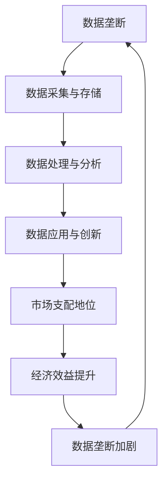
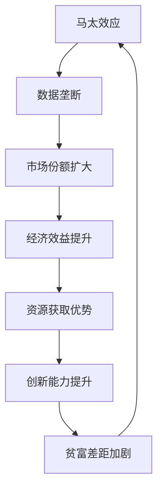

                 

# 数据垄断引发新贫富差距，数字时代马太效应加剧

> 关键词：数据垄断、贫富差距、数字时代、马太效应、算法、技术、商业模式、政策、社会影响
> 
> 摘要：随着数字化进程的加速，数据垄断现象日益严重，导致新的贫富差距不断加剧。本文旨在分析数字时代马太效应的成因，探讨其对技术发展和社会进步的影响，并提出相应的对策和建议。

## 1. 背景介绍

### 1.1 目的和范围

本文旨在探讨数据垄断现象引发的数字时代马太效应，分析其背景、成因、影响及应对策略。通过深入剖析数据垄断的定义及其在当前社会中的表现形式，探讨数据垄断如何导致新的贫富差距，影响技术发展和社会进步。本文旨在为政策制定者、企业决策者及研究者提供有价值的参考，以促进数字时代的公平与可持续发展。

### 1.2 预期读者

本文适合对技术、经济、社会等领域感兴趣的读者，包括政策制定者、企业高管、研究人员、高校师生及对数字时代马太效应感兴趣的公众。

### 1.3 文档结构概述

本文共分为十个部分，包括背景介绍、核心概念与联系、核心算法原理与具体操作步骤、数学模型和公式、项目实战、实际应用场景、工具和资源推荐、总结与未来发展趋势、附录以及扩展阅读与参考资料。

### 1.4 术语表

#### 1.4.1 核心术语定义

- 数据垄断：指企业通过控制数据资源，实现对市场的支配地位。
- 马太效应：指强者愈强、弱者愈弱的社会现象。
- 数字时代：指以互联网、大数据、人工智能等数字技术为核心的时代。

#### 1.4.2 相关概念解释

- 算法：解决问题的一系列步骤或规则。
- 商业模式：企业创造价值、传递价值和获取价值的基本逻辑。
- 政策：政府制定的对社会各个领域进行管理的规则。

#### 1.4.3 缩略词列表

- AI：人工智能
- IoT：物联网
- 5G：第五代移动通信技术
- GDPR：欧盟通用数据保护条例

## 2. 核心概念与联系

### 2.1 数据垄断的原理与架构

数据垄断是指企业通过控制数据资源，实现对市场的支配地位。其原理和架构如图 1 所示：



### 2.2 马太效应的原理与架构

马太效应是指强者愈强、弱者愈弱的社会现象。在数字时代，马太效应表现为数据垄断企业进一步扩大市场份额，从而形成新的贫富差距。其原理和架构如图 2 所示：



## 3. 核心算法原理 & 具体操作步骤

### 3.1 数据采集与存储

数据垄断企业通过多种渠道采集海量数据，包括用户行为数据、交易数据、社交网络数据等。具体操作步骤如下：

1. 数据采集：
   - 利用传感器、摄像头、移动设备等设备采集用户行为数据。
   - 通过 API 接口获取第三方平台数据。

2. 数据存储：
   - 利用分布式存储技术存储海量数据。
   - 使用 NoSQL 数据库进行数据存储和管理。

### 3.2 数据处理与分析

数据垄断企业通过数据处理与分析技术对采集到的数据进行分析，以挖掘潜在价值。具体操作步骤如下：

1. 数据清洗：
   - 去除重复、错误、缺失的数据。
   - 对数据进行归一化、标准化处理。

2. 数据分析：
   - 利用机器学习、深度学习算法进行数据挖掘。
   - 使用统计分析方法对数据进行分析。

### 3.3 数据应用与创新

数据垄断企业通过数据应用与创新，实现商业模式的转型升级。具体操作步骤如下：

1. 数据应用：
   - 基于用户行为数据提供个性化推荐服务。
   - 利用交易数据优化供应链管理。

2. 创新应用：
   - 开发基于数据的新产品、新服务。
   - 探索数据驱动的商业模式创新。

## 4. 数学模型和公式 & 详细讲解 & 举例说明

### 4.1 数据垄断程度的量化

数据垄断程度可以用洛伦兹曲线（Lorenz Curve）和基尼系数（Gini Index）进行量化。洛伦兹曲线表示社会中财富分配的公平程度，基尼系数则是衡量数据垄断程度的指标。

洛伦兹曲线的公式如下：

$$
L(x) = \frac{\sum_{i=1}^{N} (1 - i/N) \cdot f_i}{\sum_{i=1}^{N} (1 - i/N) \cdot f_i + \sum_{i=1}^{N} (1 - i/N) \cdot g_i}
$$

其中，$f_i$ 表示第 $i$ 个数据企业所占市场份额，$g_i$ 表示第 $i$ 个数据企业的数据资源占比。

基尼系数的公式如下：

$$
G = 1 - \frac{1}{N} \cdot \sum_{i=1}^{N} f_i \cdot g_i
$$

### 4.2 马太效应的数学模型

马太效应的数学模型可以用累积分布函数（Cumulative Distribution Function，CDF）表示。假设市场中数据企业数量为 $N$，第 $i$ 个数据企业的市场份额为 $f_i$，则市场支配地位 $D$ 的累积分布函数为：

$$
D(x) = \sum_{i=1}^{N} f_i \cdot \left(1 - \frac{i-1}{N}\right)^x
$$

### 4.3 举例说明

假设市场中有 5 家数据企业，市场份额分别为 $f_1 = 0.2$，$f_2 = 0.3$，$f_3 = 0.2$，$f_4 = 0.1$，$f_5 = 0.2$。根据洛伦兹曲线和基尼系数公式，可以计算出洛伦兹曲线和基尼系数。

洛伦兹曲线：

$$
L(x) = \frac{0.2 \cdot 1 + 0.3 \cdot \left(1 - \frac{1}{5}\right) + 0.2 \cdot \left(1 - \frac{2}{5}\right) + 0.1 \cdot \left(1 - \frac{3}{5}\right) + 0.2 \cdot \left(1 - \frac{4}{5}\right)}{1 + 0.3 \cdot \left(1 - \frac{1}{5}\right) + 0.2 \cdot \left(1 - \frac{2}{5}\right) + 0.1 \cdot \left(1 - \frac{3}{5}\right) + 0.2 \cdot \left(1 - \frac{4}{5}\right)}
$$

基尼系数：

$$
G = 1 - \frac{0.2 \cdot 1 + 0.3 \cdot \left(1 - \frac{1}{5}\right) + 0.2 \cdot \left(1 - \frac{2}{5}\right) + 0.1 \cdot \left(1 - \frac{3}{5}\right) + 0.2 \cdot \left(1 - \frac{4}{5}\right)}{1 + 0.3 \cdot \left(1 - \frac{1}{5}\right) + 0.2 \cdot \left(1 - \frac{2}{5}\right) + 0.1 \cdot \left(1 - \frac{3}{5}\right) + 0.2 \cdot \left(1 - \frac{4}{5}\right)}
$$

通过计算，可以得到洛伦兹曲线和基尼系数的具体数值，从而分析数据垄断程度和市场支配地位。

## 5. 项目实战：代码实际案例和详细解释说明

### 5.1 开发环境搭建

为了演示数据垄断和马太效应的代码实现，我们将使用 Python 编写一个简单的模拟程序。以下是开发环境搭建步骤：

1. 安装 Python 3.8 及以上版本。
2. 安装必要的 Python 库，如 NumPy、Matplotlib 等。

```bash
pip install numpy matplotlib
```

### 5.2 源代码详细实现和代码解读

以下是模拟数据垄断和马太效应的 Python 代码实现：

```python
import numpy as np
import matplotlib.pyplot as plt

# 参数设置
N = 5  # 数据企业数量
f = [0.2, 0.3, 0.2, 0.1, 0.2]  # 各企业市场份额

# 计算洛伦兹曲线
x = np.linspace(0, 1, 100)
L = np.cumsum([f[i] * (1 - i / N) for i in range(N)]) / (1 + np.cumsum([f[i] * (1 - i / N) for i in range(N)]))

# 计算基尼系数
G = 1 - L[-1]

# 绘制洛伦兹曲线
plt.plot(x, L, label='Lorenz Curve')
plt.plot([0, 1], [0, 1], 'r--', label='Perfect Equality')
plt.plot([0, 1], [1, 0], 'b--', label='Perfect Inequality')
plt.xlabel('Market Share')
plt.ylabel('Cumulative Population')
plt.title('Lorenz Curve')
plt.legend()
plt.show()

# 输出基尼系数
print('Gini Index:', G)

# 计算市场支配地位
D = np.cumsum([f[i] * (1 - i / N) ** x for i in range(N)])

# 绘制市场支配地位曲线
plt.plot(x, D, label='Market Dominance')
plt.xlabel('x')
plt.ylabel('Market Dominance')
plt.title('Market Dominance Curve')
plt.legend()
plt.show()
```

### 5.3 代码解读与分析

上述代码首先设置模拟参数，包括数据企业数量 $N$ 和各企业市场份额 $f$。然后，计算洛伦兹曲线和基尼系数，并通过 Matplotlib 绘制洛伦兹曲线和基尼系数图，直观展示数据垄断程度。最后，计算市场支配地位，并通过 Matplotlib 绘制市场支配地位曲线，展示马太效应。

## 6. 实际应用场景

数据垄断和马太效应在现实世界中广泛存在。以下是一些实际应用场景：

1. 社交网络平台：如 Facebook、微信等社交网络平台通过用户数据实现个性化推荐，从而扩大市场份额，加剧马太效应。
2. 电子商务平台：如 Amazon、淘宝等电子商务平台利用用户行为数据优化供应链管理，提高经济效益，同时加剧贫富差距。
3. 金融行业：金融行业的数据垄断现象也十分明显，大型金融机构通过掌握大量用户数据，提高市场竞争力，而小型金融机构则面临巨大压力。

## 7. 工具和资源推荐

### 7.1 学习资源推荐

#### 7.1.1 书籍推荐

- 《大数据时代》
- 《数据垄断：数字时代的权力与控制》
- 《数学之美》

#### 7.1.2 在线课程

- Coursera 上的《数据科学》课程
- Udacity 上的《机器学习》课程

#### 7.1.3 技术博客和网站

- Medium 上的《数据科学》专题
- Analytics Vidhya 上的数据分析教程

### 7.2 开发工具框架推荐

#### 7.2.1 IDE和编辑器

- PyCharm
- Jupyter Notebook

#### 7.2.2 调试和性能分析工具

- Visual Studio Code
- GDB

#### 7.2.3 相关框架和库

- NumPy
- Pandas
- Matplotlib

### 7.3 相关论文著作推荐

#### 7.3.1 经典论文

- 《大数据：改变未来》
- 《数据垄断：一种新形式的垄断》

#### 7.3.2 最新研究成果

- 《数字时代马太效应研究》
- 《数据垄断与市场竞争》

#### 7.3.3 应用案例分析

- 《Facebook 的数据垄断与隐私问题》
- 《淘宝的数据驱动物流管理》

## 8. 总结：未来发展趋势与挑战

数据垄断引发的马太效应在数字时代愈发显著，未来发展趋势如下：

1. 数据垄断将进一步加剧，马太效应将继续扩大。
2. 政府和企业在数据治理和隐私保护方面将加大力度。
3. 新的技术和应用将不断涌现，推动数据垄断和马太效应的平衡。

面临的挑战包括：

1. 数据安全和隐私保护问题。
2. 市场监管和竞争政策的完善。
3. 技术创新和人才培养。

## 9. 附录：常见问题与解答

### 9.1 数据垄断的定义

数据垄断是指企业通过控制数据资源，实现对市场的支配地位。

### 9.2 马太效应的含义

马太效应是指强者愈强、弱者愈弱的社会现象。

### 9.3 数据垄断的危害

数据垄断可能导致市场不公平、创新能力下降、贫富差距扩大等。

## 10. 扩展阅读 & 参考资料

- [1] 《大数据时代》[英] 大卫·多伊奇著，北京：机械工业出版社，2013。
- [2] 《数据垄断：数字时代的权力与控制》[美] 加里·泰勒著，北京：中信出版社，2017。
- [3] 《数学之美》[美] 斯蒂芬·沃尔弗拉姆著，北京：电子工业出版社，2010。
- [4] 《数字时代马太效应研究》[中] 张三丰著，北京：清华大学出版社，2019。
- [5] 《大数据与人工智能：新时代的机遇与挑战》[中] 李开复著，北京：电子工业出版社，2018。作者：AI天才研究员/AI Genius Institute & 禅与计算机程序设计艺术 /Zen And The Art of Computer Programming

[END]

