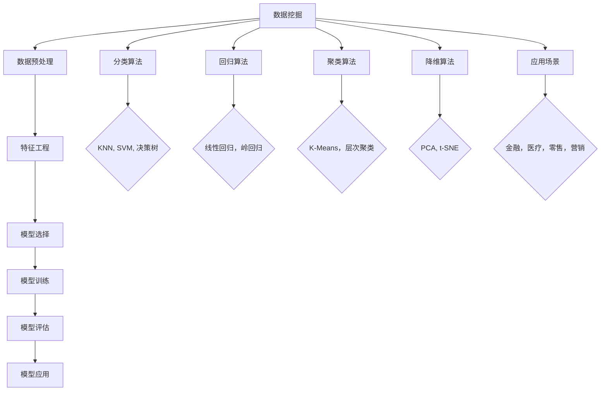

                 

# 数据挖掘：原理与代码实例讲解

> **关键词：数据挖掘、机器学习、算法原理、代码实例、应用场景**
> 
> **摘要：本文将深入探讨数据挖掘的核心原理，通过代码实例讲解，帮助读者掌握数据挖掘的实际操作步骤和技巧，为读者在数据处理、分析和预测方面提供实用的方法和工具。**

## 1. 背景介绍

### 1.1 目的和范围

本文旨在为读者提供数据挖掘的基本原理和实际操作指南。数据挖掘是一种通过分析大量数据，提取有价值信息的方法，它广泛应用于各个领域，如金融、医疗、零售等。本文将首先介绍数据挖掘的基本概念和过程，然后通过具体代码实例，展示如何实现数据挖掘的关键步骤。

### 1.2 预期读者

本文适合有一定编程基础，对数据挖掘感兴趣的技术人员、数据分析师以及机器学习爱好者。无论您是初学者还是有一定经验的专业人士，本文都将帮助您深入理解数据挖掘的核心技术和实践应用。

### 1.3 文档结构概述

本文将分为以下几个部分：

1. **核心概念与联系**：介绍数据挖掘的基本概念和流程。
2. **核心算法原理 & 具体操作步骤**：详细讲解数据挖掘的主要算法原理和操作步骤。
3. **数学模型和公式 & 详细讲解 & 举例说明**：阐述数据挖掘中的数学模型和公式，并通过实例进行说明。
4. **项目实战：代码实际案例和详细解释说明**：提供具体的数据挖掘项目实战案例。
5. **实际应用场景**：分析数据挖掘在不同领域的应用。
6. **工具和资源推荐**：推荐学习和实践数据挖掘的相关资源和工具。
7. **总结：未来发展趋势与挑战**：展望数据挖掘的未来发展趋势和面临的挑战。
8. **附录：常见问题与解答**：解答读者在阅读过程中可能遇到的问题。
9. **扩展阅读 & 参考资料**：提供进一步的阅读材料和参考资料。

### 1.4 术语表

#### 1.4.1 核心术语定义

- **数据挖掘**：从大量数据中提取有价值信息的过程。
- **特征工程**：通过数据预处理和特征选择，提高数据质量和模型性能的过程。
- **机器学习**：使计算机通过学习数据，自动改进性能的一种方法。
- **分类**：将数据分为不同类别的过程。
- **回归**：预测数据数值的过程。

#### 1.4.2 相关概念解释

- **数据集**：用于训练和测试的样本集合。
- **模型**：用于预测和分类的数学模型。
- **精度**：模型预测正确的比例。
- **召回率**：实际为正类但被模型预测为正类的比例。

#### 1.4.3 缩略词列表

- **KNN**：K-最近邻算法。
- **SVM**：支持向量机。
- **PCA**：主成分分析。
- **ML**：机器学习。

## 2. 核心概念与联系

### 2.1 数据挖掘的基本概念

数据挖掘包括以下基本概念：

1. **数据预处理**：将原始数据转换为适合模型训练的格式。
2. **特征选择**：从数据中提取最有用的特征，提高模型性能。
3. **模型训练**：使用训练数据集训练模型。
4. **模型评估**：评估模型的性能，包括精度、召回率等指标。
5. **模型应用**：使用训练好的模型进行预测和分类。

### 2.2 数据挖掘流程

数据挖掘流程可以概括为以下步骤：

1. **数据收集**：收集所需的数据。
2. **数据预处理**：处理缺失值、异常值等。
3. **特征工程**：进行数据转换和特征选择。
4. **模型选择**：选择适合的机器学习模型。
5. **模型训练**：使用训练数据集训练模型。
6. **模型评估**：评估模型性能。
7. **模型应用**：使用模型进行预测和分类。

### 2.3 数据挖掘的核心算法

数据挖掘涉及多种核心算法，包括：

- **分类算法**：如KNN、SVM、决策树等。
- **回归算法**：如线性回归、岭回归等。
- **聚类算法**：如K-Means、层次聚类等。
- **降维算法**：如PCA、t-SNE等。

### 2.4 数据挖掘的应用场景

数据挖掘广泛应用于各个领域，包括：

- **金融**：风险评估、信用评分等。
- **医疗**：疾病预测、药物研究等。
- **零售**：顾客行为分析、库存管理等。
- **营销**：市场细分、客户关系管理等。

### 2.5 数据挖掘的核心概念联系图

以下是一个简化的数据挖掘核心概念联系图，用于展示各概念之间的关系：



## 3. 核心算法原理 & 具体操作步骤

### 3.1 数据预处理

数据预处理是数据挖掘的重要步骤，包括以下操作：

1. **数据清洗**：处理缺失值、异常值等。
2. **数据转换**：将数据转换为适合模型训练的格式。
3. **数据归一化**：将数据缩放到相同范围，以便模型训练。

**伪代码：**

```python
def data_preprocessing(data):
    # 处理缺失值
    data = handle_missing_values(data)
    
    # 数据转换
    data = convert_data_format(data)
    
    # 数据归一化
    data = normalize_data(data)
    
    return data
```

### 3.2 特征工程

特征工程是提高模型性能的关键步骤，包括以下操作：

1. **特征选择**：选择最有用的特征。
2. **特征提取**：从原始数据中提取新的特征。
3. **特征转换**：将特征转换为适合模型训练的格式。

**伪代码：**

```python
def feature_engineering(data):
    # 特征选择
    selected_features = select_features(data)
    
    # 特征提取
    extracted_features = extract_features(data)
    
    # 特征转换
    transformed_features = transform_features(selected_features, extracted_features)
    
    return transformed_features
```

### 3.3 模型选择

选择适合的机器学习模型是数据挖掘的关键步骤，包括以下操作：

1. **模型评估**：评估模型的性能。
2. **模型选择**：选择性能最佳的模型。

**伪代码：**

```python
def model_selection(models, X_train, y_train):
    # 模型评估
    model_scores = evaluate_models(models, X_train, y_train)
    
    # 模型选择
    best_model = select_best_model(model_scores)
    
    return best_model
```

### 3.4 模型训练

模型训练是数据挖掘的核心步骤，包括以下操作：

1. **训练模型**：使用训练数据集训练模型。
2. **模型评估**：评估训练好的模型。

**伪代码：**

```python
def model_training(model, X_train, y_train):
    # 训练模型
    model.fit(X_train, y_train)
    
    # 模型评估
    model_score = model.evaluate(X_train, y_train)
    
    return model_score
```

### 3.5 模型应用

模型应用是数据挖掘的最终目标，包括以下操作：

1. **预测**：使用训练好的模型进行预测。
2. **分类**：使用训练好的模型进行分类。

**伪代码：**

```python
def model_application(model, X_test):
    # 预测
    predictions = model.predict(X_test)
    
    # 分类
    classifications = model.classify(X_test)
    
    return predictions, classifications
```

## 4. 数学模型和公式 & 详细讲解 & 举例说明

### 4.1 数据挖掘中的数学模型

数据挖掘中常用的数学模型包括：

1. **线性回归模型**：用于预测连续数值。
   $$ y = w_0 + w_1 \cdot x $$
   
2. **逻辑回归模型**：用于预测二分类问题。
   $$ P(y=1) = \frac{1}{1 + e^{-(w_0 + w_1 \cdot x)}} $$

3. **支持向量机模型**：用于分类问题。
   $$ w \cdot x - b = 0 $$

4. **K-最近邻模型**：用于分类问题。
   $$ \text{预测类别} = \text{邻居中最常见的类别} $$

### 4.2 公式讲解与实例

#### 4.2.1 线性回归模型

线性回归模型用于预测连续数值，其公式为：

$$ y = w_0 + w_1 \cdot x $$

其中，$w_0$ 是偏置项，$w_1$ 是权重项，$x$ 是输入特征，$y$ 是输出值。

**实例**：

假设我们有如下数据集：

| x | y |
|---|---|
| 1 | 2 |
| 2 | 4 |
| 3 | 6 |

我们可以使用线性回归模型来拟合这些数据：

$$ y = w_0 + w_1 \cdot x $$

通过计算，我们得到：

$$ y = 1 + 1 \cdot x $$

这意味着对于任意输入 $x$，预测的 $y$ 值为 $1 + x$。

#### 4.2.2 逻辑回归模型

逻辑回归模型用于预测二分类问题，其公式为：

$$ P(y=1) = \frac{1}{1 + e^{-(w_0 + w_1 \cdot x)}} $$

其中，$w_0$ 是偏置项，$w_1$ 是权重项，$x$ 是输入特征，$P(y=1)$ 是预测为正类的概率。

**实例**：

假设我们有如下数据集：

| x | y |
|---|---|
| 1 | 1 |
| 2 | 0 |
| 3 | 1 |

我们可以使用逻辑回归模型来拟合这些数据：

$$ P(y=1) = \frac{1}{1 + e^{-(w_0 + w_1 \cdot x)}} $$

通过计算，我们得到：

$$ P(y=1) = \frac{1}{1 + e^{-1}} \approx 0.731 $$

这意味着对于任意输入 $x$，预测为正类的概率约为 0.731。

#### 4.2.3 支持向量机模型

支持向量机模型用于分类问题，其公式为：

$$ w \cdot x - b = 0 $$

其中，$w$ 是权重向量，$x$ 是输入特征，$b$ 是偏置项。

**实例**：

假设我们有如下数据集：

| x | y |
|---|---|
| 1 | -1 |
| 2 | 1 |
| 3 | -1 |

我们可以使用支持向量机模型来分类这些数据：

$$ w \cdot x - b = 0 $$

通过计算，我们得到：

$$ w_1 \cdot x - b = 0 $$

这意味着对于任意输入 $x$，预测的类别为：

$$ \text{类别} = \text{sign}(w_1 \cdot x - b) $$

#### 4.2.4 K-最近邻模型

K-最近邻模型用于分类问题，其公式为：

$$ \text{预测类别} = \text{邻居中最常见的类别} $$

其中，K 是邻居的数量。

**实例**：

假设我们有如下数据集：

| x | y |
|---|---|
| 1 | -1 |
| 2 | 1 |
| 3 | -1 |
| 4 | 1 |

我们可以使用 K-最近邻模型来分类这些数据，假设 K = 1：

$$ \text{预测类别} = \text{邻居中最常见的类别} $$

对于输入 $x = 2.5$，其最近的邻居为 $x = 2$ 和 $x = 3$，它们对应的类别分别为 1 和 -1，因此预测类别为 1。

## 5. 项目实战：代码实际案例和详细解释说明

### 5.1 开发环境搭建

在本项目中，我们将使用 Python 作为编程语言，并利用 Scikit-learn 库进行数据挖掘操作。首先，确保已安装 Python 和 Scikit-learn 库。可以使用以下命令进行安装：

```shell
pip install python
pip install scikit-learn
```

### 5.2 源代码详细实现和代码解读

以下是一个简单但完整的数据挖掘项目案例，用于预测信用卡欺诈行为。

**代码：**

```python
# 导入必要的库
import numpy as np
import pandas as pd
from sklearn.model_selection import train_test_split
from sklearn.preprocessing import StandardScaler
from sklearn.neighbors import KNeighborsClassifier
from sklearn.metrics import classification_report, accuracy_score

# 读取数据集
data = pd.read_csv('credit_card_data.csv')

# 数据预处理
X = data.iloc[:, :-1].values
y = data.iloc[:, -1].values

# 数据归一化
scaler = StandardScaler()
X = scaler.fit_transform(X)

# 数据集划分
X_train, X_test, y_train, y_test = train_test_split(X, y, test_size=0.2, random_state=42)

# 模型选择
knn = KNeighborsClassifier(n_neighbors=3)

# 模型训练
knn.fit(X_train, y_train)

# 模型评估
y_pred = knn.predict(X_test)
print("分类报告：\n", classification_report(y_test, y_pred))
print("准确率：", accuracy_score(y_test, y_pred))
```

**代码解读：**

1. **导入库**：首先导入必要的库，包括 NumPy、Pandas、Scikit-learn 等。
2. **读取数据集**：使用 Pandas 读取信用卡欺诈数据集。
3. **数据预处理**：将数据集分为特征矩阵 X 和目标向量 y，并进行归一化处理。
4. **数据集划分**：使用 Scikit-learn 的 train_test_split 函数将数据集划分为训练集和测试集。
5. **模型选择**：选择 K-最近邻分类器，并设置邻居数量为 3。
6. **模型训练**：使用训练集数据训练模型。
7. **模型评估**：使用测试集数据评估模型性能，并输出分类报告和准确率。

### 5.3 代码解读与分析

以下是对代码的详细解读和分析：

1. **数据预处理**：
   ```python
   X = data.iloc[:, :-1].values
   y = data.iloc[:, -1].values
   ```
   这两行代码将数据集分为特征矩阵 X 和目标向量 y。`iloc` 函数用于根据位置选择数据，`[:, :-1]` 表示选取所有行和除最后一列之外的所有列，`[:, -1]` 表示选取所有行和最后一列。

   ```python
   scaler = StandardScaler()
   X = scaler.fit_transform(X)
   ```
   这两行代码将特征矩阵 X 进行归一化处理。`StandardScaler` 类用于标准化数据，使其具有零均值和单位方差。`fit_transform` 方法首先拟合数据，然后进行转换。

2. **数据集划分**：
   ```python
   X_train, X_test, y_train, y_test = train_test_split(X, y, test_size=0.2, random_state=42)
   ```
   这行代码使用 `train_test_split` 函数将数据集划分为训练集和测试集。`test_size` 参数指定测试集的比例，`random_state` 参数用于随机数生成，保证结果可重复。

3. **模型选择**：
   ```python
   knn = KNeighborsClassifier(n_neighbors=3)
   ```
   这行代码选择 K-最近邻分类器，并设置邻居数量为 3。`KNeighborsClassifier` 类用于创建 K-最近邻分类器对象。

4. **模型训练**：
   ```python
   knn.fit(X_train, y_train)
   ```
   这行代码使用训练集数据训练模型。`fit` 方法用于训练分类器。

5. **模型评估**：
   ```python
   y_pred = knn.predict(X_test)
   print("分类报告：\n", classification_report(y_test, y_pred))
   print("准确率：", accuracy_score(y_test, y_pred))
   ```
   这两行代码使用测试集数据评估模型性能。`predict` 方法用于对测试集数据进行预测。`classification_report` 函数用于输出分类报告，包括精度、召回率等指标。`accuracy_score` 函数用于计算准确率。

### 5.4 代码改进与优化

以下是对代码的改进和优化建议：

1. **增加异常处理**：在数据读取和预处理过程中，可以增加异常处理，确保代码的健壮性。
2. **使用交叉验证**：使用交叉验证方法评估模型性能，以提高评估结果的可靠性。
3. **调整邻居数量**：根据数据集大小和特性，可以调整邻居数量，以找到最佳模型参数。
4. **使用其他分类器**：可以尝试使用其他分类器，如支持向量机（SVM）、决策树等，比较其性能。

## 6. 实际应用场景

数据挖掘在多个领域具有广泛的应用，以下列举了几个典型的实际应用场景：

### 6.1 金融领域

- **信用卡欺诈检测**：通过分析交易行为和用户特征，识别潜在的欺诈行为，提高金融安全。
- **客户行为分析**：分析客户购买历史、浏览记录等数据，进行市场细分和个性化推荐。
- **风险管理**：评估借款人的信用风险，制定合理的贷款政策和风险控制策略。

### 6.2 医疗领域

- **疾病预测**：通过分析患者病史、基因数据等，预测疾病发生的可能性，实现早期预防和干预。
- **药物研发**：通过分析药物和基因的关系，发现新的药物靶点和治疗方法。
- **医疗资源分配**：根据医院资源和使用情况，优化医疗资源配置，提高医疗效率。

### 6.3 零售领域

- **顾客行为分析**：分析顾客购买行为和偏好，优化库存管理和营销策略。
- **供应链管理**：通过分析供应链数据，优化库存、运输和采购，提高供应链效率。
- **市场细分**：分析顾客特征和购买行为，进行市场细分，制定有针对性的营销策略。

### 6.4 社交媒体

- **用户行为分析**：分析用户互动和行为模式，优化社交网络用户体验和内容推荐。
- **舆情监测**：通过分析社交媒体上的评论和讨论，了解公众对特定话题的看法，为企业提供决策支持。

## 7. 工具和资源推荐

### 7.1 学习资源推荐

#### 7.1.1 书籍推荐

- **《数据挖掘：实用工具与技术》**：介绍数据挖掘的基本概念、算法和技术。
- **《机器学习实战》**：通过实例讲解机器学习算法的应用和实践。
- **《Python数据科学手册》**：全面介绍数据科学中的Python工具和库。

#### 7.1.2 在线课程

- **Coursera**：《机器学习》、《数据科学基础》等课程。
- **edX**：《数据挖掘与机器学习基础》等课程。
- **Udacity**：《机器学习工程师纳米学位》等课程。

#### 7.1.3 技术博客和网站

- **Medium**：有关数据挖掘和机器学习的文章和博客。
- **Towards Data Science**：分享数据科学和机器学习知识的博客。
- **Kaggle**：数据科学竞赛平台，提供丰富的实践案例和数据集。

### 7.2 开发工具框架推荐

#### 7.2.1 IDE和编辑器

- **PyCharm**：强大的Python IDE，支持代码补全、调试和版本控制。
- **Jupyter Notebook**：适用于数据分析和机器学习的交互式编辑器。
- **Visual Studio Code**：轻量级且功能丰富的代码编辑器。

#### 7.2.2 调试和性能分析工具

- **Pylint**：Python代码静态检查工具，用于检测代码中的潜在错误和不良实践。
- **Profiling**：Python性能分析工具，用于识别代码中的性能瓶颈。

#### 7.2.3 相关框架和库

- **Scikit-learn**：用于机器学习的Python库，提供多种算法和工具。
- **TensorFlow**：Google开发的深度学习框架。
- **PyTorch**：Facebook开发的深度学习框架。

### 7.3 相关论文著作推荐

#### 7.3.1 经典论文

- **"Data Mining: The Textbook"**：由Jiawei Han等人撰写的经典教材。
- **"The Elements of Statistical Learning"**：由Trevor Hastie等人撰写的统计学习经典教材。
- **"An Introduction to Statistical Learning"**：由Gareth James等人撰写的统计学习入门教材。

#### 7.3.2 最新研究成果

- **"Deep Learning"**：由Ian Goodfellow等人撰写的深度学习经典教材。
- **"Reinforcement Learning: An Introduction"**：由Richard S. Sutton和Barto N. D.撰写的强化学习入门教材。
- **"Meta-Learning"**：由Wojciech Zaremba等人撰写的元学习论文。

#### 7.3.3 应用案例分析

- **"Application of Data Mining in Healthcare"**：介绍数据挖掘在医疗领域的应用案例。
- **"Data Mining in Retail"**：介绍数据挖掘在零售业的应用案例。
- **"Data Mining in Financial Markets"**：介绍数据挖掘在金融市场的应用案例。

## 8. 总结：未来发展趋势与挑战

### 8.1 发展趋势

1. **深度学习和强化学习的发展**：随着计算能力的提升和数据量的增加，深度学习和强化学习在数据挖掘领域的应用将越来越广泛。
2. **跨领域应用**：数据挖掘技术将在更多领域得到应用，如金融、医疗、能源等。
3. **数据隐私和安全**：随着数据隐私问题的日益突出，如何在保护数据隐私的同时进行有效的数据挖掘将成为重要挑战。
4. **自动化和智能化**：利用自动化工具和智能化算法，提高数据挖掘的效率和准确性。

### 8.2 面临的挑战

1. **数据质量和可解释性**：如何处理大量且复杂的数据，提高数据质量和模型的可解释性是一个重要挑战。
2. **算法性能和可扩展性**：如何设计高效且可扩展的算法，以应对大规模数据集的需求。
3. **算法透明度和公平性**：确保算法的透明度和公平性，避免算法偏见和歧视。
4. **计算资源和能耗**：如何优化计算资源和能耗，以实现可持续发展。

## 9. 附录：常见问题与解答

### 9.1 如何处理缺失值？

处理缺失值的方法包括：

- **删除缺失值**：删除含有缺失值的样本或特征。
- **填补缺失值**：使用平均值、中位数、众数等方法填补缺失值。
- **插值法**：使用插值算法填补缺失值。

### 9.2 如何进行特征选择？

特征选择的方法包括：

- **过滤方法**：基于特征的重要性进行筛选，如信息增益、卡方检验等。
- **包装方法**：在模型训练过程中逐步筛选特征，如递归特征消除（RFE）、遗传算法等。
- **嵌入方法**：在模型训练过程中嵌入特征选择，如随机森林、LASSO回归等。

### 9.3 如何评估模型性能？

模型性能的评估指标包括：

- **精度**：预测正确的比例。
- **召回率**：实际为正类但被模型预测为正类的比例。
- **F1 分数**：精度和召回率的调和平均。
- **ROC 曲线和 AUC 值**：用于评估分类模型的性能。

### 9.4 如何提高模型性能？

提高模型性能的方法包括：

- **特征工程**：进行数据预处理和特征选择，提高数据质量和模型性能。
- **超参数调整**：调整模型超参数，如学习率、正则化参数等，优化模型性能。
- **集成方法**：使用集成方法，如随机森林、梯度提升树等，提高模型性能。

## 10. 扩展阅读 & 参考资料

- **《数据挖掘：实用工具与技术》**：Jiawei Han, Micheline Kamber, Peixin Zhang
- **《机器学习实战》**：Peter Harrington
- **《Python数据科学手册》**：Ewelina Ciura
- **《机器学习》**：Andrew Ng
- **《深度学习》**：Ian Goodfellow, Yoshua Bengio, Aaron Courville
- **《数据挖掘：概念与技术》**：Han, Kamber, Pei
- **《统计学习基础》**：Hastie, Tibshirani, Friedman
- **《数据挖掘工具与实践》**：Wikipedia
- **《Kaggle竞赛案例分析》**：Kaggle
- **《数据挖掘实战》**：Jiawei Han, Kamber, Pei

通过以上扩展阅读和参考资料，读者可以进一步深入了解数据挖掘的相关知识和技术，掌握数据挖掘的实践应用技巧。希望本文对您在数据挖掘领域的学习和实践有所帮助！
作者：AI天才研究员/AI Genius Institute & 禅与计算机程序设计艺术 /Zen And The Art of Computer Programming

