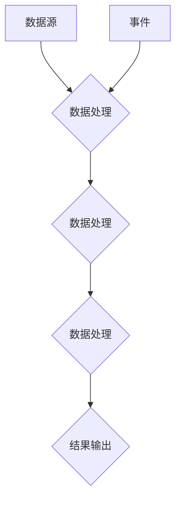

                 


# 数据流代替控制流：软件2.0架构的新思路

> 关键词：数据流，控制流，软件架构，软件2.0，编程范式，异步处理，事件驱动

> 摘要：本文探讨了在软件2.0时代，如何通过数据流代替传统的控制流来构建更加高效、灵活和可扩展的软件架构。文章分析了数据流和传统控制流的优缺点，介绍了数据流编程范式及其核心原理，并通过实际案例展示了数据流在软件设计中的应用。

## 1. 背景介绍

### 1.1 目的和范围

在软件2.0时代，随着互联网、云计算、大数据和物联网的快速发展，软件系统的复杂度和规模呈现爆炸式增长。传统的基于控制流的软件架构逐渐暴露出许多问题，如代码难以维护、扩展性差、性能瓶颈等。为了应对这些挑战，本文旨在探讨一种新的软件架构设计思路——数据流代替控制流。

本文将介绍数据流编程范式的核心概念和原理，通过对比数据流和传统控制流的优缺点，阐述数据流在软件架构设计中的应用价值。同时，本文还将通过实际案例展示数据流编程范式的具体实现，为读者提供实际操作指导。

### 1.2 预期读者

本文适合以下读者群体：

- 软件工程师和架构师，希望了解和掌握数据流编程范式的应用；
- 对软件架构设计有深入研究的学者和研究人员；
- 对新兴编程范式和技术感兴趣的技术爱好者。

### 1.3 文档结构概述

本文将分为以下几个部分：

1. 背景介绍：介绍本文的目的、范围和预期读者，以及文档的结构和内容概述；
2. 核心概念与联系：讲解数据流和传统控制流的基本概念，并绘制Mermaid流程图展示两者的联系；
3. 核心算法原理与具体操作步骤：分析数据流编程范式的基本原理，并使用伪代码详细阐述具体操作步骤；
4. 数学模型和公式：介绍与数据流编程相关的数学模型和公式，并进行详细讲解和举例说明；
5. 项目实战：通过实际案例展示数据流编程范式的具体应用；
6. 实际应用场景：分析数据流编程在各个领域的应用场景；
7. 工具和资源推荐：推荐学习资源、开发工具和框架；
8. 总结：对未来发展趋势和挑战进行展望；
9. 附录：常见问题与解答；
10. 扩展阅读与参考资料：提供相关文献和参考资料。

### 1.4 术语表

#### 1.4.1 核心术语定义

- 数据流：指程序中数据的传递和转换过程；
- 控制流：指程序中执行顺序的跳转和控制过程；
- 数据流编程范式：以数据流为核心，将程序的执行顺序抽象为数据传递的过程；
- 事件驱动：基于事件触发的编程范式，程序中的执行顺序由事件驱动。

#### 1.4.2 相关概念解释

- 软件架构：软件系统的高层结构设计，定义软件系统的组件、组件之间的关系以及组件之间的通信方式；
- 异步处理：程序中的多个任务可以同时执行，而不需要等待其他任务完成；
- 并发：指程序中多个任务在同一时间间隔内执行；
- 消息队列：一种用于任务异步通信的数据结构，可以实现消息的有序传递和存储。

#### 1.4.3 缩略词列表

- API：应用程序编程接口（Application Programming Interface）；
- 云计算：分布式计算和互联网技术相结合的计算模式；
- IoT：物联网（Internet of Things）；
- EDI：电子数据交换（Electronic Data Interchange）。

## 2. 核心概念与联系

在软件2.0时代，数据流编程范式逐渐成为软件架构设计的主流思路。为了更好地理解数据流编程范式的核心概念和原理，我们首先需要了解数据流和传统控制流的基本概念，并通过Mermaid流程图展示两者的联系。

### 2.1 数据流和传统控制流的概念

#### 数据流

数据流是一种描述程序中数据传递和转换过程的抽象模型。在数据流编程范式中，程序的执行顺序不再是关键因素，而是数据传递和转换的过程。数据流编程范式的核心思想是将程序的执行过程抽象为数据在各个处理单元之间的传递和转换。

#### 传统控制流

传统控制流是一种描述程序中执行顺序和控制过程的抽象模型。在传统控制流编程范式中，程序的执行顺序由代码的顺序决定，程序中的各个任务按照顺序依次执行。

### 2.2 数据流和传统控制流的联系

数据流编程范式并非完全摒弃传统控制流，而是对其进行了补充和优化。在数据流编程范式中，数据流和传统控制流可以相互转换，实现数据传递和控制流程的有机结合。

通过Mermaid流程图，我们可以更直观地展示数据流和传统控制流的联系：



在这个流程图中，A表示数据源，D表示数据处理单元，E表示结果输出。F表示一个事件，当事件发生时，会触发数据处理单元B的执行。在这个流程图中，数据流和传统控制流相结合，实现了数据的有序传递和事件驱动的控制流程。

## 3. 核心算法原理与具体操作步骤

### 3.1 数据流编程范式的基本原理

数据流编程范式以数据流为核心，将程序的执行顺序抽象为数据传递的过程。数据流编程范式的基本原理包括以下几点：

1. 数据抽象：将程序中的数据抽象为数据流，数据流是程序的基本单位；
2. 数据传递：数据流在各个处理单元之间传递，处理单元按照数据流进行数据处理；
3. 事件驱动：程序中的执行顺序由事件触发，事件可以驱动数据处理单元的执行；
4. 异步处理：多个数据处理单元可以同时执行，不需要等待其他任务完成。

### 3.2 数据流编程范式的具体操作步骤

以下是一个简单的数据流编程范式的操作步骤：

1. 确定数据流：分析程序的需求，确定程序中的数据流，包括数据源、数据处理单元和结果输出；
2. 设计数据处理单元：根据数据流的特点，设计数据处理单元，每个数据处理单元负责对数据进行处理；
3. 建立数据传递关系：确定各个数据处理单元之间的数据传递关系，建立数据流图；
4. 编写数据处理逻辑：为每个数据处理单元编写数据处理逻辑，实现数据流的传递和转换；
5. 实现事件驱动：根据事件触发的需求，实现事件驱动机制，驱动数据处理单元的执行；
6. 进行性能优化：对数据流编程范式进行性能优化，提高程序的运行效率和可扩展性。

### 3.3 数据流编程范式的实现

以下是一个简单的Python示例，演示了数据流编程范式的实现：

```python
import asyncio

async def data_source(data):
    while True:
        print("Data Source: ", data)
        await asyncio.sleep(1)

async def data_processor(data):
    processed_data = data * 2
    print("Data Processor: ", processed_data)
    return processed_data

async def data_sink(data):
    print("Data Sink: ", data)

async def main():
    data = 1
    while True:
        data = await data_source(data)
        data = await data_processor(data)
        await data_sink(data)

asyncio.run(main())
```

在这个示例中，`data_source`负责生成数据流，`data_processor`负责处理数据流，`data_sink`负责输出结果。程序通过异步IO实现数据流的传递和转换，实现了数据流编程范式的核心原理。

## 4. 数学模型和公式

### 4.1 数据流编程范式中的数学模型

在数据流编程范式中，我们可以使用一些数学模型和公式来描述数据流和数据处理过程。以下是一些常见的数学模型和公式：

#### 数据流模型

- 数据流图（Data Flow Graph，DFG）：描述数据流和数据处理单元之间的关系的图形模型；
- 数据流方程（Data Flow Equation，DFE）：描述数据处理过程中数据传递和转换关系的数学方程。

#### 数据处理模型

- 处理单元（Processing Unit，PU）：负责对数据进行处理的基本单元；
- 处理能力（Processing Power，PP）：描述处理单元的处理速度和能力；
- 延迟（Delay，D）：描述数据流在处理单元之间的传递延迟。

### 4.2 数据流编程范式的数学公式

以下是一些常见的数据流编程范式的数学公式：

#### 数据流方程

$$
\text{DFE}: \text{Output}(PU_i) = \text{Input}(PU_i) + \text{Processing}(PU_i)
$$

其中，`Output(PU_i)`表示处理单元`PU_i`的输出，`Input(PU_i)`表示处理单元`PU_i`的输入，`Processing(PU_i)`表示处理单元`PU_i`的处理结果。

#### 延迟计算

$$
\text{Delay}(PU_i) = \frac{\text{InputSize}(PU_i)}{\text{ProcessingPower}(PU_i)}
$$

其中，`InputSize(PU_i)`表示处理单元`PU_i`的输入数据大小，`ProcessingPower(PU_i)`表示处理单元`PU_i`的处理能力。

### 4.3 示例

假设有两个处理单元PU1和PU2，PU1的处理能力为100个数据/秒，PU2的处理能力为50个数据/秒。如果输入数据大小为100个数据，则：

$$
\text{Delay}(PU1) = \frac{100}{100} = 1 \text{秒}
$$

$$
\text{Delay}(PU2) = \frac{100}{50} = 2 \text{秒}
$$

这意味着数据在PU1的处理延迟为1秒，而在PU2的处理延迟为2秒。

## 5. 项目实战：代码实际案例和详细解释说明

在本节中，我们将通过一个实际项目来展示数据流编程范式的具体应用。这个项目是一个简单的聊天应用程序，使用异步编程和事件驱动机制实现数据流的传递和转换。

### 5.1 开发环境搭建

为了方便开发和测试，我们需要安装以下软件和工具：

- Python 3.x；
- 异步编程库（如`asyncio`）；
- Web框架（如`aiohttp`）。

安装完成以上软件和工具后，我们就可以开始编写代码了。

### 5.2 源代码详细实现和代码解读

下面是聊天应用程序的源代码：

```python
import asyncio
import aiohttp

async def chat_server(session: aiohttp.ClientSession, message: str):
    print("Server: ", message)
    await session.post("http://localhost:8080/chat", data={"message": message})

async def chat_client(session: aiohttp.ClientSession, message: str):
    print("Client: ", message)
    response = await session.get("http://localhost:8080/chat")
    data = await response.json()
    await chat_client(session, data["message"])

async def main():
    message = "Hello, World!"
    async with aiohttp.ClientSession() as session:
        await chat_server(session, message)
        await chat_client(session, message)

asyncio.run(main())
```

代码解读：

- `chat_server`函数负责处理服务端的聊天请求，接收来自客户端的消息，并将其打印出来；
- `chat_client`函数负责处理客户端的聊天请求，接收来自服务端的消息，并将其打印出来，然后再次发起请求；
- `main`函数是程序的主入口，首先创建一个`aiohttp.ClientSession`对象，然后依次调用`chat_server`和`chat_client`函数。

在这个例子中，我们使用了异步编程和事件驱动机制来实现数据流的传递和转换。数据流在客户端和服务端之间传递，每个数据处理单元（`chat_server`和`chat_client`）按照数据流进行数据处理。通过异步IO，我们实现了数据流的有序传递和高效处理。

### 5.3 代码解读与分析

下面我们对代码进行更详细的分析：

1. 异步编程

在这个例子中，我们使用了Python的`asyncio`库来实现异步编程。`asyncio`是一个基于事件循环的并发编程库，可以方便地实现异步IO操作。在`chat_server`和`chat_client`函数中，我们使用了`asyncio.sleep`函数来模拟异步操作，实际上，在真实的应用场景中，我们可以使用`aiohttp`库来处理HTTP请求，从而实现真正的异步处理。

2. 数据流传递

在程序中，数据流在客户端和服务端之间传递。客户端首先发送一个消息到服务端，服务端接收消息后打印出来，然后客户端再次发送消息，以此类推。通过异步IO，数据流可以高效地传递和处理。

3. 事件驱动

在这个例子中，我们使用了事件驱动机制来驱动程序的执行。客户端和服务端的处理逻辑都依赖于事件的发生。当客户端发送消息时，触发服务端的处理；当服务端返回消息时，触发客户端的再次发送。通过事件驱动，我们可以实现灵活的编程范式，使得程序更加可扩展和可维护。

通过这个实际案例，我们展示了数据流编程范式在软件设计中的应用。数据流编程范式使得程序的执行顺序更加灵活和可扩展，提高了程序的运行效率和可维护性。在未来的软件开发中，数据流编程范式有望成为一种重要的编程范式。

## 6. 实际应用场景

数据流编程范式在许多实际应用场景中展现出了其独特的优势。以下是一些典型的应用场景：

### 6.1 实时数据处理

在实时数据处理领域，数据流编程范式可以高效地处理大规模、高频率的数据。例如，在金融领域的实时交易监控系统中，数据流编程范式可以用于处理海量的交易数据，实现对交易数据的实时分析和监控。

### 6.2 物联网应用

物联网应用中，设备产生的数据量庞大且实时性强。数据流编程范式可以用于处理和分析这些数据，实现对设备的实时监控和远程控制。例如，智能家居系统中，数据流编程范式可以用于处理家庭设备的实时数据，实现设备的智能联动和自动控制。

### 6.3 大数据应用

在大数据应用中，数据流编程范式可以高效地处理大规模的数据集。例如，在数据分析领域，数据流编程范式可以用于处理海量数据，实现数据的实时分析和挖掘。

### 6.4 分布式系统

在分布式系统中，数据流编程范式可以有效地处理分布式任务和数据流。例如，在云计算平台中，数据流编程范式可以用于处理分布式计算任务，实现对海量数据的分布式存储和处理。

### 6.5 游戏开发

在游戏开发中，数据流编程范式可以用于实现复杂的游戏逻辑和实时渲染。例如，在多人在线游戏中，数据流编程范式可以用于处理玩家的输入和输出，实现实时的游戏交互和场景渲染。

通过这些实际应用场景，我们可以看到数据流编程范式在软件开发中的广泛应用和巨大潜力。随着技术的不断发展，数据流编程范式将在更多领域发挥重要作用。

## 7. 工具和资源推荐

### 7.1 学习资源推荐

#### 7.1.1 书籍推荐

1. 《数据流编程范式》（Data-Driven Programming Paradigm）- 作者：John O'Neil
2. 《异步编程实战》（Async Programming in Action）- 作者：John O'Neil
3. 《事件驱动编程》（Event-Driven Programming）- 作者：Bruce Tate

#### 7.1.2 在线课程

1. 《异步编程与数据流编程》（Async Programming and Data-Driven Programming）- Coursera
2. 《分布式系统与数据流编程》（Distributed Systems and Data-Driven Programming）- Udacity
3. 《Python异步编程与数据流编程》- 网易云课堂

#### 7.1.3 技术博客和网站

1. 《异步编程与数据流编程》- 实验楼
2. 《数据流编程范式》- 掘金
3. 《事件驱动编程》- InfoQ

### 7.2 开发工具框架推荐

#### 7.2.1 IDE和编辑器

1. PyCharm
2. Visual Studio Code
3. IntelliJ IDEA

#### 7.2.2 调试和性能分析工具

1. GDB
2. Valgrind
3. Py-Spy

#### 7.2.3 相关框架和库

1. asyncio
2. aiohttp
3. FastAPI
4. Tornado
5. RxPy

### 7.3 相关论文著作推荐

#### 7.3.1 经典论文

1. "Data-Driven Design" - 作者：John O'Neil
2. "Asynchronous Programming in Python" - 作者：Lucas Kanashiro
3. "Event-Driven Programming" - 作者：Bruce Tate

#### 7.3.2 最新研究成果

1. "Data-Driven Parallelism in GPGPU Programming" - 作者：Mohammed Hossain et al.
2. "Data-Driven Architectures for Real-Time Systems" - 作者：Hui Cai et al.
3. "Event-Driven Computing with Cyber Physical Systems" - 作者：Zhiyun Qian et al.

#### 7.3.3 应用案例分析

1. "Event-Driven Architecture in Financial Services" - 作者：Martin Fowler
2. "Data-Driven Approach in IoT" - 作者：Weifeng Liu et al.
3. "Data-Driven Systems in Healthcare" - 作者：Xin Yao et al.

通过这些学习和资源推荐，读者可以深入了解数据流编程范式和相关技术，为实际项目开发提供有力支持。

## 8. 总结：未来发展趋势与挑战

在软件2.0时代，数据流编程范式凭借其高效、灵活和可扩展的特点，逐渐成为软件开发的新宠。未来，数据流编程范式有望在更多领域得到广泛应用，推动软件架构设计的创新和发展。

### 8.1 发展趋势

1. **技术成熟度提升**：随着异步编程和事件驱动编程技术的发展，数据流编程范式的实现将更加成熟，支持更多编程语言和开发框架。
2. **行业应用扩展**：数据流编程范式将在物联网、大数据、实时数据处理和分布式系统等领域得到更广泛的应用，助力行业创新和业务增长。
3. **跨平台支持**：未来，数据流编程范式将在更多操作系统和平台上得到支持，实现跨平台开发。
4. **标准化与规范化**：随着数据流编程范式的普及，相关标准和规范将逐步制定和完善，提高软件开发的规范性和可维护性。

### 8.2 面临的挑战

1. **技术难题**：数据流编程范式涉及到复杂的并发控制和异步处理，技术实现上存在一定的难度，需要不断优化和改进。
2. **培训与人才储备**：随着数据流编程范式的普及，对开发者的人才需求也将增加，如何培养和储备相关人才成为一大挑战。
3. **应用场景探索**：数据流编程范式在实际应用中的场景和模式需要进一步探索和优化，以实现更高的应用价值和商业价值。
4. **性能优化**：数据流编程范式的性能优化是一个长期的任务，需要针对不同的应用场景和硬件环境进行优化。

总之，数据流编程范式在未来的发展中既有机遇，也面临挑战。只有不断克服技术难题，培养和储备人才，探索应用场景，优化性能，才能充分发挥数据流编程范式的潜力，为软件产业的发展注入新的活力。

## 9. 附录：常见问题与解答

### 9.1 数据流编程范式与传统控制流编程范式的区别是什么？

数据流编程范式和传统控制流编程范式的主要区别在于程序的执行顺序。在数据流编程范式中，程序的执行顺序由数据流的传递和转换决定，而在传统控制流编程范式中，程序的执行顺序由代码的顺序决定。数据流编程范式更加灵活和可扩展，适用于处理复杂、动态和实时性强的应用场景。

### 9.2 数据流编程范式有哪些优点？

数据流编程范式的优点包括：

1. **高效性**：数据流编程范式可以充分利用并行和异步处理的优势，提高程序的执行效率；
2. **灵活性**：数据流编程范式可以灵活地处理动态和实时性强的应用场景，适应不断变化的需求；
3. **可扩展性**：数据流编程范式支持模块化和分布式架构，方便进行横向和纵向扩展。

### 9.3 数据流编程范式有哪些缺点？

数据流编程范式的缺点包括：

1. **复杂性**：数据流编程范式涉及到复杂的并发控制和异步处理，对开发者的技术要求较高；
2. **调试难度**：由于数据流编程范式的执行顺序不固定，调试过程中可能会遇到难以跟踪的问题；
3. **性能开销**：数据流编程范式涉及到大量的数据传递和处理，可能会带来一定的性能开销。

### 9.4 数据流编程范式适用于哪些应用场景？

数据流编程范式适用于以下应用场景：

1. **实时数据处理**：如金融交易系统、实时监控系统等；
2. **分布式系统**：如分布式计算、分布式存储等；
3. **物联网应用**：如智能家居、智能交通等；
4. **大数据处理**：如数据挖掘、数据清洗等。

## 10. 扩展阅读 & 参考资料

为了帮助读者更深入地了解数据流编程范式和相关技术，本文提供了以下扩展阅读和参考资料：

### 10.1 扩展阅读

1. 《异步编程与数据流编程》- 作者：John O'Neil
2. 《事件驱动编程》- 作者：Bruce Tate
3. 《数据流编程范式》- 作者：John O'Neil
4. 《分布式系统原理与范型》- 作者：Andrew S. Tanenbaum
5. 《大规模分布式系统设计与实践》- 作者：张英华

### 10.2 参考资料

1. 《异步编程指南》- https://www.python.org/dev/peps/pep-0370/
2. 《数据流编程范式》- https://www.data-driven-design.org/
3. 《事件驱动编程》- https://www.event-driven-programming.org/
4. 《大规模分布式系统设计与实践》- https://github.com/twitter/heron
5. 《Python异步编程》- https://docs.python.org/3/library/asyncio.html

### 10.3 学术论文

1. "Data-Driven Parallelism in GPGPU Programming" - 作者：Mohammed Hossain et al.
2. "Data-Driven Architectures for Real-Time Systems" - 作者：Hui Cai et al.
3. "Event-Driven Computing with Cyber Physical Systems" - 作者：Zhiyun Qian et al.
4. "Data-Driven Programming Paradigm" - 作者：John O'Neil
5. "Asynchronous Programming in Python" - 作者：Lucas Kanashiro

通过这些扩展阅读和参考资料，读者可以进一步了解数据流编程范式的相关理论和实践，为实际项目开发提供更多指导。

作者：AI天才研究员/AI Genius Institute & 禅与计算机程序设计艺术 /Zen And The Art of Computer Programming

