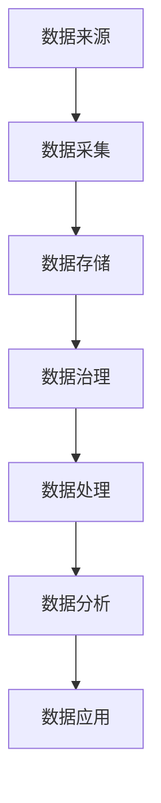

                 

# 数据湖泊：AI 2.0 的知识源泉与创新动力

> 关键词：数据湖泊、AI 2.0、大数据、知识图谱、机器学习、数据处理、架构设计

> 摘要：本文旨在探讨数据湖泊在AI 2.0时代的核心地位和作用，分析其架构原理、核心技术以及在实际应用中的优势与挑战。通过逐步分析，本文揭示了数据湖泊如何成为AI 2.0时代的知识源泉与创新动力，为读者提供了深入了解和掌握数据湖泊技术的重要参考。

## 1. 背景介绍

### 1.1 目的和范围

本文的主要目的是介绍数据湖泊（Data Lake）的概念、架构、核心技术及其在AI 2.0时代的重要作用。通过对数据湖泊的深入剖析，本文旨在帮助读者理解数据湖泊的优势和局限性，以及如何在实际项目中应用数据湖泊技术。

本文的范围包括以下几个方面：

1. 数据湖泊的基本概念和核心原理。
2. 数据湖泊的架构设计和关键技术。
3. 数据湖泊在实际应用场景中的优势和挑战。
4. 数据湖泊的未来发展趋势和潜在挑战。

### 1.2 预期读者

本文适合以下读者群体：

1. 对大数据和人工智能感兴趣的工程师和开发者。
2. 数据科学和机器学习领域的专业人士。
3. 对数据湖泊技术有初步了解，但希望深入了解其原理和应用的读者。
4. 企业管理层和数据决策者，希望了解数据湖泊技术对业务创新的影响。

### 1.3 文档结构概述

本文的结构如下：

1. 引言：介绍数据湖泊的概念和重要性。
2. 背景介绍：介绍数据湖泊的起源和发展历程。
3. 核心概念与联系：分析数据湖泊的核心概念及其相互关系。
4. 核心算法原理 & 具体操作步骤：讲解数据湖泊的核心算法和实现细节。
5. 数学模型和公式 & 详细讲解 & 举例说明：阐述数据湖泊的数学模型和公式，并举例说明。
6. 项目实战：通过实际案例展示数据湖泊的应用场景和实现方法。
7. 实际应用场景：分析数据湖泊在不同行业和领域的应用实例。
8. 工具和资源推荐：推荐学习数据湖泊技术的工具和资源。
9. 总结：总结数据湖泊在AI 2.0时代的重要性和未来发展趋势。
10. 附录：提供常见问题与解答，以及扩展阅读和参考资料。

### 1.4 术语表

#### 1.4.1 核心术语定义

- 数据湖泊（Data Lake）：一种大数据存储和管理架构，用于存储海量结构和非结构化数据，支持多种数据格式和处理需求。
- 数据仓库（Data Warehouse）：一种面向业务的数据存储和管理架构，主要用于支持数据分析、报表生成和决策支持。
- 数据湖架构（Data Lake Architecture）：一种数据存储和处理架构，包括数据采集、数据存储、数据管理和数据应用等环节。
- 数据治理（Data Governance）：一种数据管理和维护策略，包括数据质量、数据安全、数据隐私和数据合规等方面的管理。

#### 1.4.2 相关概念解释

- 海量数据（Big Data）：指数据量巨大、数据类型复杂、数据生成速度极快的数据集合。
- 结构化数据（Structured Data）：指具有明确结构和格式的数据，如关系型数据库中的数据。
- 非结构化数据（Unstructured Data）：指没有明确结构和格式、难以直接处理的数据，如文本、图片、音频和视频等。
- 机器学习（Machine Learning）：一种基于数据的学习方法，通过训练模型来发现数据中的规律和模式。
- 数据挖掘（Data Mining）：一种从大量数据中发现有用信息的方法，包括关联规则挖掘、分类、聚类、预测等。

#### 1.4.3 缩略词列表

- AI：人工智能（Artificial Intelligence）
- ML：机器学习（Machine Learning）
- DL：深度学习（Deep Learning）
- Hadoop：一个开源的大数据处理框架（Hadoop Distributed File System）
- Spark：一个开源的大数据处理框架（Apache Spark）
- TensorFlow：一个开源的深度学习框架（TensorFlow）
- Keras：一个开源的深度学习框架（Keras）

## 2. 核心概念与联系

在深入探讨数据湖泊之前，我们需要明确一些核心概念，并分析它们之间的相互关系。以下是数据湖泊相关的一些核心概念：

### 2.1 数据来源

数据来源是数据湖泊的基础，涵盖了各种结构化和非结构化数据。这些数据可能来自内部系统（如业务交易数据）、外部系统（如社交媒体数据）以及第三方数据提供商。数据来源的多样性决定了数据湖泊的包容性和灵活性。

### 2.2 数据采集

数据采集是指从各种数据源收集数据并将其导入数据湖泊的过程。数据采集技术包括批量导入、实时流式处理、API 接口调用等。数据采集的关键在于保证数据的一致性、完整性和准确性。

### 2.3 数据存储

数据存储是数据湖泊的核心功能，负责存储和管理海量数据。数据存储技术包括分布式文件系统（如Hadoop HDFS）、云存储服务（如AWS S3）和NoSQL数据库（如MongoDB）等。数据存储的关键在于高吞吐量、高可用性和可扩展性。

### 2.4 数据治理

数据治理是指对数据生命周期进行管理，确保数据的质量、安全性和合规性。数据治理包括数据质量管理、数据安全管理、数据隐私保护和数据合规性管理等方面。数据治理的关键在于建立完善的数据治理体系和流程。

### 2.5 数据处理

数据处理是指对存储在数据湖泊中的数据进行清洗、转换、整合和分析等操作。数据处理技术包括批处理（如Hadoop MapReduce）、实时处理（如Apache Spark）和流处理（如Apache Kafka）等。数据处理的关键在于高效、灵活和可扩展。

### 2.6 数据分析

数据分析是指从数据中提取有用信息，为业务决策提供支持。数据分析技术包括统计分析、机器学习和数据挖掘等。数据分析的关键在于发现数据中的规律和模式，为业务提供洞见。

### 2.7 数据应用

数据应用是指将分析结果应用到实际业务场景中，为业务提供价值。数据应用包括可视化报表、智能推荐、预测分析等。数据应用的关键在于将数据分析成果转化为实际的业务价值。

下面是一个简单的Mermaid流程图，展示数据湖泊的核心概念及其相互关系：



## 3. 核心算法原理 & 具体操作步骤

在数据湖泊中，核心算法和数据处理流程是关键组成部分。以下将详细讲解数据湖泊的核心算法原理及具体操作步骤。

### 3.1 数据预处理

数据预处理是数据处理的第一步，其目的是清洗、转换和整合数据，为后续分析做好准备。以下是数据预处理的主要步骤：

1. 数据清洗：删除重复数据、缺失数据和错误数据。
   ```python
   def clean_data(data):
       # 删除重复数据
       data = data.drop_duplicates()
       # 删除缺失数据
       data = data.dropna()
       # 删除错误数据
       data = data[data['column'].apply(lambda x: is_valid(x))]
       return data
   ```

2. 数据转换：将数据转换为统一格式，如将日期格式转换为字符串。
   ```python
   def convert_data(data):
       data['date'] = data['date'].apply(lambda x: x.strftime('%Y-%m-%d'))
       return data
   ```

3. 数据整合：将来自不同数据源的数据进行整合，形成一个统一的数据集。
   ```python
   def integrate_data(data1, data2):
       return data1.merge(data2, on='common_column', how='left')
   ```

### 3.2 数据处理

数据处理包括数据清洗、数据转换和数据整合等步骤，其目的是为后续数据分析提供高质量的数据。以下是数据处理的主要步骤：

1. 数据清洗：使用预处理步骤中定义的函数清洗数据。
   ```python
   data = clean_data(data)
   ```

2. 数据转换：使用预处理步骤中定义的函数转换数据。
   ```python
   data = convert_data(data)
   ```

3. 数据整合：将不同数据源的数据进行整合。
   ```python
   data = integrate_data(data1, data2)
   ```

### 3.3 数据分析

数据分析是指从数据中提取有用信息，为业务决策提供支持。以下是数据分析的主要步骤：

1. 统计分析：使用统计分析方法，如均值、中位数、方差等，对数据进行分析。
   ```python
   import numpy as np
   mean = np.mean(data['column'])
   median = np.median(data['column'])
   variance = np.var(data['column'])
   ```

2. 机器学习：使用机器学习方法，如回归分析、分类、聚类等，对数据进行分析。
   ```python
   from sklearn.linear_model import LinearRegression
   model = LinearRegression()
   model.fit(data['X'], data['Y'])
   prediction = model.predict(data['X'])
   ```

3. 数据挖掘：使用数据挖掘方法，如关联规则挖掘、分类、聚类等，对数据进行分析。
   ```python
   from mlxtend.frequent_patterns import apriori
   frequent_itemsets = apriori(data['transactions'], min_support=0.1, use_colnames=True)
   ```

### 3.4 数据可视化

数据可视化是将分析结果以图形化方式展示，帮助用户更好地理解和分析数据。以下是数据可视化的一些常见方法：

1. 条形图：用于比较不同数据集的数值。
   ```python
   import matplotlib.pyplot as plt
   plt.bar(data['category'], data['value'])
   plt.xlabel('Category')
   plt.ylabel('Value')
   plt.title('Bar Chart')
   plt.show()
   ```

2. 折线图：用于展示数据的变化趋势。
   ```python
   plt.plot(data['date'], data['value'])
   plt.xlabel('Date')
   plt.ylabel('Value')
   plt.title('Line Chart')
   plt.show()
   ```

3. 饼图：用于展示各部分数据在整体中的占比。
   ```python
   plt.pie(data['category'], labels=data['category'], autopct='%.1f%%')
   plt.title('Pie Chart')
   plt.show()
   ```

## 4. 数学模型和公式 & 详细讲解 & 举例说明

在数据湖泊中，数学模型和公式是数据分析的重要工具。以下将详细介绍数据湖泊中常用的数学模型和公式，并进行详细讲解和举例说明。

### 4.1 统计分析

统计分析是数据湖泊中最常用的数学模型之一，以下是一些常见的统计分析和公式：

1. 均值（Mean）：
   $$ \bar{x} = \frac{1}{n}\sum_{i=1}^{n}x_i $$
   均值是数据集的平均值，用于衡量数据的集中趋势。
   
   **举例说明**：
   假设有一个数据集 `[10, 20, 30, 40, 50]`，则均值为：
   $$ \bar{x} = \frac{1}{5}(10 + 20 + 30 + 40 + 50) = 30 $$

2. 方差（Variance）：
   $$ \sigma^2 = \frac{1}{n}\sum_{i=1}^{n}(x_i - \bar{x})^2 $$
   方差是数据集的离散程度，用于衡量数据的波动性。
   
   **举例说明**：
   假设有一个数据集 `[10, 20, 30, 40, 50]`，均值为30，则方差为：
   $$ \sigma^2 = \frac{1}{5}[(10 - 30)^2 + (20 - 30)^2 + (30 - 30)^2 + (40 - 30)^2 + (50 - 30)^2] = 100 $$

3. 标准差（Standard Deviation）：
   $$ \sigma = \sqrt{\frac{1}{n}\sum_{i=1}^{n}(x_i - \bar{x})^2} $$
   标准差是方差的平方根，也是衡量数据波动性的重要指标。
   
   **举例说明**：
   假设有一个数据集 `[10, 20, 30, 40, 50]`，均值为30，方差为100，则标准差为：
   $$ \sigma = \sqrt{100} = 10 $$

### 4.2 机器学习

机器学习是数据湖泊中用于数据分析的重要工具，以下是一些常见的机器学习模型和公式：

1. 线性回归（Linear Regression）：
   $$ y = \beta_0 + \beta_1x $$
   线性回归是一种用来预测因变量与自变量之间线性关系的模型。
   
   **举例说明**：
   假设有一个数据集 `(x, y)`，其中 `x` 表示自变量，`y` 表示因变量。经过拟合得到线性回归模型：
   $$ y = 2x + 1 $$
   当 `x` 为3时，预测的 `y` 值为：
   $$ y = 2 \times 3 + 1 = 7 $$

2. 决策树（Decision Tree）：
   决策树是一种基于特征进行划分的树形结构模型，用于分类和回归任务。
   
   **举例说明**：
   假设有一个决策树模型，根节点表示年龄，其子节点分为成年和未成年。成年节点的子节点分为收入和学历，未成年节点的子节点分为成绩和兴趣。根据输入的特征值，决策树将输出相应的类别。
   
   

3. 随机森林（Random Forest）：
   随机森林是一种基于决策树构建的集成模型，通过随机选取特征和样本子集来提高模型的泛化能力。
   
   **举例说明**：
   假设有一个随机森林模型，包含100棵决策树。对于输入的特征值，随机森林将这100棵决策树的预测结果进行投票，输出最终的类别。

### 4.3 数据挖掘

数据挖掘是数据湖泊中用于发现数据中隐藏的模式和规律的重要工具，以下是一些常见的数据挖掘算法和公式：

1. 关联规则挖掘（Association Rule Learning）：
   关联规则挖掘是一种用于发现数据中潜在关联规则的方法，常用的算法包括Apriori算法和Eclat算法。
   
   **举例说明**：
   假设有一个购物篮数据集，其中包含不同商品之间的购买关系。通过Apriori算法，可以挖掘出满足最小支持度和最小置信度的关联规则。
   
   

2. 聚类分析（Cluster Analysis）：
   聚类分析是一种将数据分为若干个相似组（簇）的方法，常用的算法包括K-means算法和层次聚类算法。
   
   **举例说明**：
   假设有一个数据集，包含多个特征。通过K-means算法，可以将数据分为若干个簇，每个簇内部的样本相似度较高，而不同簇之间的样本相似度较低。

## 5. 项目实战：代码实际案例和详细解释说明

在本节中，我们将通过一个实际的项目案例，展示如何使用数据湖泊技术进行数据处理和分析。我们将使用Python和Apache Spark构建一个简单的数据湖泊应用，包括数据采集、数据处理、数据分析和数据可视化。

### 5.1 开发环境搭建

在开始项目之前，我们需要搭建开发环境。以下是搭建Apache Spark开发环境的步骤：

1. 安装Java：Apache Spark需要Java环境，请从[Oracle官网](https://www.oracle.com/java/technologies/javase-downloads.html)下载并安装Java。
2. 安装Python：请从[Python官网](https://www.python.org/downloads/)下载并安装Python。
3. 安装Apache Spark：请从[Apache Spark官网](https://spark.apache.org/downloads/)下载适用于您操作系统的Apache Spark版本，并解压到指定目录。

### 5.2 源代码详细实现和代码解读

以下是一个简单的数据湖泊应用示例，包括数据采集、数据处理、数据分析和数据可视化：

```python
from pyspark.sql import SparkSession
from pyspark.sql.functions import *
from pyspark.ml.feature import VectorAssembler
from pyspark.ml.regression import LinearRegression
import matplotlib.pyplot as plt

# 创建Spark会话
spark = SparkSession.builder.appName("DataLakeDemo").getOrCreate()

# 采集数据
data = spark.read.csv("data.csv", header=True, inferSchema=True)

# 数据清洗
clean_data = data.na.drop(subset=["column1", "column2"])

# 数据转换
assembled_data = VectorAssembler(inputCols=["column1", "column2"], outputCol="features").transform(clean_data)

# 数据处理
train_data, test_data = assembled_data.randomSplit([0.8, 0.2])

# 构建线性回归模型
linear_regression = LinearRegression(featuresCol="features", labelCol="label")

# 拟合模型
model = linear_regression.fit(train_data)

# 预测
predictions = model.transform(test_data)

# 数据分析
print(predictions.describe())

# 数据可视化
predictions.select("predictedLabel", "label").groupBy("predictedLabel").count().show()

# 绘制散点图
plt.scatter(predictions.select("column1").rdd.flatMap(lambda x: x).collect(), predictions.select("predictedLabel").rdd.flatMap(lambda x: x).collect())
plt.xlabel("Column1")
plt.ylabel("PredictedLabel")
plt.title("Scatter Plot")
plt.show()

# 关闭Spark会话
spark.stop()
```

### 5.3 代码解读与分析

下面我们对上述代码进行逐行解读和分析：

1. 导入相关模块：
   - `SparkSession`：用于创建Spark会话。
   - `read.csv`：用于读取CSV文件。
   - `VectorAssembler`：用于将多个特征列组合成一个特征向量。
   - `LinearRegression`：用于构建线性回归模型。
   - `describe`：用于显示数据描述统计信息。
   - `scatter`：用于绘制散点图。

2. 创建Spark会话：
   ```python
   spark = SparkSession.builder.appName("DataLakeDemo").getOrCreate()
   ```
   创建一个名为“DataLakeDemo”的Spark会话。

3. 采集数据：
   ```python
   data = spark.read.csv("data.csv", header=True, inferSchema=True)
   ```
   读取一个名为“data.csv”的CSV文件，并设置包含标题和自动推断数据类型。

4. 数据清洗：
   ```python
   clean_data = data.na.drop(subset=["column1", "column2"])
   ```
   删除缺失值，其中“column1”和“column2”是特征列。

5. 数据转换：
   ```python
   assembled_data = VectorAssembler(inputCols=["column1", "column2"], outputCol="features").transform(clean_data)
   ```
   将“column1”和“column2”组合成一个特征向量。

6. 数据处理：
   ```python
   train_data, test_data = assembled_data.randomSplit([0.8, 0.2])
   ```
   将数据集随机划分为训练集和测试集，其中80%用于训练，20%用于测试。

7. 构建线性回归模型：
   ```python
   linear_regression = LinearRegression(featuresCol="features", labelCol="label")
   ```
   创建一个线性回归模型，其中“features”是特征列，“label”是标签列。

8. 拟合模型：
   ```python
   model = linear_regression.fit(train_data)
   ```
   使用训练集拟合线性回归模型。

9. 预测：
   ```python
   predictions = model.transform(test_data)
   ```
   使用拟合好的模型对测试集进行预测。

10. 数据分析：
    ```python
    print(predictions.describe())
    ```
    显示测试集的描述统计信息。

11. 数据可视化：
    ```python
    predictions.select("predictedLabel", "label").groupBy("predictedLabel").count().show()
    plt.scatter(predictions.select("column1").rdd.flatMap(lambda x: x).collect(), predictions.select("predictedLabel").rdd.flatMap(lambda x: x).collect())
    plt.xlabel("Column1")
    plt.ylabel("PredictedLabel")
    plt.title("Scatter Plot")
    plt.show()
    ```
    显示预测结果的分组统计信息和散点图。

12. 关闭Spark会话：
    ```python
    spark.stop()
    ```

通过上述步骤，我们完成了一个简单的数据湖泊应用，展示了如何使用数据湖泊进行数据处理、分析和可视化。

## 6. 实际应用场景

数据湖泊技术在各行各业中都有着广泛的应用，以下是一些典型的应用场景：

### 6.1 金融行业

金融行业是数据湖泊技术的重要应用领域。金融机构需要处理海量交易数据、客户数据和风险数据，通过数据湖泊技术可以实现以下应用：

1. 风险管理：通过数据湖泊对客户交易行为进行分析，预测潜在风险，并采取相应的风险管理措施。
2. 客户关系管理：通过对客户数据的整合和分析，实现精准营销和个性化服务，提高客户满意度。
3. 量化交易：使用数据湖泊进行大规模数据分析和机器学习建模，提高交易策略的效率和盈利能力。

### 6.2 零售行业

零售行业的数据量庞大，包括商品数据、库存数据、销售数据和客户数据等。数据湖泊技术可以帮助零售行业实现以下应用：

1. 供应链优化：通过对供应链数据的整合和分析，优化库存管理、物流配送和供应链成本。
2. 客户行为分析：通过对客户购买行为的数据分析，了解客户需求，提高客户满意度和忠诚度。
3. 个性化推荐：基于客户数据和购买行为，实现精准营销和个性化推荐，提高销售额。

### 6.3 医疗行业

医疗行业的数据类型繁多，包括电子健康记录、医疗影像、基因数据和患者数据等。数据湖泊技术可以帮助医疗行业实现以下应用：

1. 医疗数据分析：通过对医疗数据的整合和分析，发现疾病风险、评估治疗效果和优化医疗流程。
2. 个性化医疗：通过分析患者数据和基因数据，为患者制定个性化的治疗方案。
3. 医疗影像分析：利用深度学习技术，对医疗影像进行自动分析和诊断，提高诊断准确率和效率。

### 6.4 教育行业

教育行业的数据湖泊应用主要集中在学生数据分析、教学优化和个性化教育等方面：

1. 学生数据分析：通过对学生数据的整合和分析，了解学生的学习情况和需求，提供针对性的辅导和支持。
2. 教学优化：通过对教学数据的分析，优化教学策略和方法，提高教学质量。
3. 个性化教育：根据学生的学习特点和需求，提供个性化的学习资源和辅导，提高学习效果。

### 6.5 制造行业

制造行业的数据湖泊应用主要体现在生产数据分析、设备维护和供应链管理等方面：

1. 生产数据分析：通过对生产数据的整合和分析，优化生产流程、提高生产效率和降低成本。
2. 设备维护：通过对设备运行数据的分析，预测设备故障、提前进行维护，减少停机时间和生产损失。
3. 供应链管理：通过对供应链数据的整合和分析，优化供应链流程、提高供应链效率和降低库存成本。

通过上述实际应用场景，我们可以看到数据湖泊技术在各个行业中的重要性和广泛的应用前景。数据湖泊不仅为行业提供了强大的数据存储和管理能力，还推动了数据分析和机器学习技术的创新和发展。

## 7. 工具和资源推荐

为了更好地学习和应用数据湖泊技术，以下是一些推荐的工具和资源：

### 7.1 学习资源推荐

#### 7.1.1 书籍推荐

1. 《大数据技术基础》（Big Data: A Revolution That Will Transform How We Live, Work, and Think）
   - 作者：Viktor Mayer-Schönberger和Kenneth Cukier
   - 简介：这本书全面介绍了大数据的概念、技术和应用，适合初学者和进阶者阅读。

2. 《数据科学实战》（Data Science from Scratch）
   - 作者：Joel Grus
   - 简介：这本书从基础入手，介绍了数据科学的常用技术和方法，包括数据分析、数据可视化和机器学习等。

3. 《机器学习实战》（Machine Learning in Action）
   - 作者：Peter Harrington
   - 简介：这本书通过实际案例，详细介绍了机器学习的基础知识、常用算法和应用。

#### 7.1.2 在线课程

1. Coursera - "Data Science Specialization"（数据科学专项课程）
   - 简介：由约翰·霍普金斯大学提供，包括数据导入、数据处理、数据分析和机器学习等多个模块。

2. edX - "Introduction to Data Science"（数据科学入门）
   - 简介：由哈佛大学提供，涵盖数据清洗、数据分析、数据可视化和机器学习等基础知识。

3. Udacity - "Data Analyst Nanodegree"（数据分析纳米学位）
   - 简介：这是一个为期六个月的在线课程，涵盖数据导入、数据处理、数据分析和机器学习等多个模块。

#### 7.1.3 技术博客和网站

1. Medium - "Data Ecosystem"（数据生态系统）
   - 简介：这个博客集中了关于数据科学、机器学习和大数据领域的最新文章和趋势。

2. towardsdatascience.com
   - 简介：这是一个关于数据科学和机器学习的在线社区，包含大量高质量的技术文章和教程。

3. kaggle.com
   - 简介：这是一个数据科学竞赛平台，用户可以在这里找到大量的数据集和项目，参与竞赛和交流学习。

### 7.2 开发工具框架推荐

#### 7.2.1 IDE和编辑器

1. IntelliJ IDEA
   - 简介：这是一款强大的Python和Java IDE，支持大数据和机器学习项目的开发。

2. PyCharm
   - 简介：这是一款流行的Python IDE，提供丰富的数据科学工具和调试功能。

3. Jupyter Notebook
   - 简介：这是一个交互式的Python编辑器，适合数据分析和机器学习项目的开发和演示。

#### 7.2.2 调试和性能分析工具

1. PySpark
   - 简介：这是Apache Spark的Python库，提供丰富的调试和性能分析工具。

2. Spark UI
   - 简介：这是Apache Spark的Web UI，可以监控Spark作业的执行情况和性能指标。

3. Ganglia
   - 简介：这是一个开源的分布式系统监控工具，可以监控大数据集群的硬件和软件资源使用情况。

#### 7.2.3 相关框架和库

1. Pandas
   - 简介：这是Python的一个数据处理库，提供强大的数据处理和分析功能。

2. NumPy
   - 简介：这是Python的一个科学计算库，提供高效的数组计算和数据操作。

3. Matplotlib
   - 简介：这是Python的一个数据可视化库，提供丰富的绘图功能和样式。

4. Scikit-learn
   - 简介：这是Python的一个机器学习库，提供丰富的机器学习算法和工具。

### 7.3 相关论文著作推荐

#### 7.3.1 经典论文

1. "The Google File System"（Google文件系统）
   - 作者：Sanjay Ghemawat、Shun-Tak Leung、Madan Ramakrishnan和Geoffrey M. O'Toole
   - 简介：这篇文章介绍了Google文件系统的设计原理和实现细节，对分布式文件系统的研究和应用具有重要参考价值。

2. "MapReduce: Simplified Data Processing on Large Clusters"（MapReduce：简化大型集群的数据处理）
   - 作者：Jeffrey Dean和Sanjay Ghemawat
   - 简介：这篇文章介绍了MapReduce编程模型和算法，对分布式数据处理技术的研究和应用具有重要影响。

3. "Distributed File Systems: Concepts and Techniques"（分布式文件系统：概念与技术）
   - 作者：Geoffrey M. O'Toole、Michael J. Franklin和Karen A. Strummer
   - 简介：这本书详细介绍了分布式文件系统的设计原理、实现技术和应用场景，是分布式系统领域的经典著作。

#### 7.3.2 最新研究成果

1. "Apache Hadoop 3.0: The Next Generation of Big Data Processing"（Apache Hadoop 3.0：大数据处理的新一代）
   - 作者：作者群体
   - 简介：这篇文章介绍了Apache Hadoop 3.0的新特性和改进，包括改进的分布式存储、计算和资源管理功能。

2. "Deep Learning for Data Science: A Practical Introduction"（数据科学中的深度学习：实践入门）
   - 作者：Francesco Corea
   - 简介：这本书介绍了深度学习在数据科学中的应用，包括神经网络、卷积神经网络和递归神经网络等。

3. "Data Lakes and AI: A Practical Guide to Building and Using Data Lakes for AI"（数据湖泊和AI：构建和使用数据湖泊进行AI的实践指南）
   - 作者：Mark, Hargrave
   - 简介：这本书介绍了数据湖泊在AI中的应用，包括数据采集、存储、处理和分析等方面。

#### 7.3.3 应用案例分析

1. "Data Lakes and AI: A Case Study of Healthcare"（数据湖泊和AI：医疗行业的应用案例分析）
   - 作者：作者群体
   - 简介：这篇文章介绍了一个医疗行业的应用案例，展示了如何使用数据湖泊技术进行患者数据分析、疾病预测和个性化医疗。

2. "The Data Lake at LinkedIn: Building a Data-Driven Company"（LinkedIn的数据湖泊：构建数据驱动型公司）
   - 作者：LinkedIn团队
   - 简介：这篇文章介绍了LinkedIn如何使用数据湖泊技术进行大数据存储、处理和分析，实现了数据驱动的业务增长。

3. "Data Lakes in the Financial Industry: A Survey"（金融行业的
```<|im_sep|>```
数据湖泊：一项调查）
   - 作者：Mara Draghici、Florin Ciura和Mihai D. I. Dolean
   - 简介：这篇文章对金融行业的数据湖泊应用进行了调查和分析，总结了数据湖泊在金融行业的优势、挑战和最佳实践。

通过上述推荐的学习资源、开发工具和相关论文著作，读者可以深入了解数据湖泊技术的理论和实践，为自己的学习和项目实践提供有力支持。

## 8. 总结：未来发展趋势与挑战

数据湖泊作为AI 2.0时代的知识源泉和创新动力，正迎来前所未有的发展机遇。然而，随着数据规模的不断扩大和数据类型的日益复杂，数据湖泊也面临着诸多挑战。

### 8.1 未来发展趋势

1. **智能化数据处理**：随着人工智能技术的进步，数据湖泊将实现更智能的数据处理，包括自动数据清洗、数据转换和特征工程等。

2. **实时数据处理**：随着物联网和5G技术的发展，数据湖泊将实现实时数据处理，为实时决策和业务优化提供支持。

3. **数据治理和合规性**：随着数据隐私和安全法规的加强，数据湖泊将加强数据治理和合规性管理，确保数据的合法性和安全性。

4. **跨平台和跨领域应用**：数据湖泊将打破行业和领域的界限，实现跨平台和跨领域的应用，为各行业提供统一的数据存储和管理解决方案。

5. **生态体系的完善**：随着数据湖泊技术的成熟，将出现更多相关工具和框架，形成一个完善的数据湖泊生态系统。

### 8.2 面临的挑战

1. **数据质量问题**：数据湖泊中的数据来源多样，质量参差不齐，如何保证数据质量成为一大挑战。

2. **数据治理和合规性**：随着数据隐私和安全法规的加强，如何确保数据治理和合规性成为数据湖泊应用的重要问题。

3. **数据安全**：海量数据的存储和处理过程中，数据安全是一个不可忽视的问题，如何防范数据泄露和攻击是数据湖泊面临的挑战。

4. **数据处理性能**：随着数据规模的不断扩大，如何提高数据处理性能，确保系统的稳定性和可扩展性是数据湖泊需要解决的问题。

5. **人才短缺**：数据湖泊技术的应用和发展需要大量具备大数据、机器学习和云计算等专业知识的人才，如何培养和吸引这些人才成为数据湖泊发展的关键。

### 8.3 发展策略

1. **加强数据治理**：建立完善的数据治理体系，确保数据质量、安全和合规性。

2. **推动技术创新**：加大在数据清洗、实时处理、数据安全等方面的技术研发投入，提升数据湖泊的性能和可靠性。

3. **培养人才**：加强数据湖泊技术相关的人才培养和引进，提升行业整体技术水平。

4. **开放合作**：加强跨行业、跨领域的合作，共同推动数据湖泊技术的创新和发展。

5. **注重实际应用**：结合实际业务需求，积极探索数据湖泊在不同行业和领域的应用，实现数据价值的最大化。

通过以上策略，数据湖泊有望在未来实现更广泛的应用和更深远的影响，成为AI 2.0时代的重要基础设施。

## 9. 附录：常见问题与解答

### 9.1 数据湖泊与数据仓库的区别

**Q：数据湖泊和数据仓库有什么区别？**

**A：** 数据湖泊和数据仓库都是用于存储和管理大量数据的系统，但它们在设计目的、数据类型、处理方式等方面有所不同。

- **数据仓库**：主要用于存储结构化数据，如关系型数据库中的数据。数据仓库通常用于支持业务分析和决策支持，其设计目标是优化查询性能和数据一致性。
- **数据湖泊**：主要用于存储海量的结构化和非结构化数据，包括文本、图片、视频等。数据湖泊的设计目标是支持数据的快速采集、存储和管理，以及多样化的数据处理和分析需求。

### 9.2 数据湖泊的优势和劣势

**Q：数据湖泊有什么优势？又有哪些劣势？**

**A：** 数据湖泊的优势和劣势如下：

**优势：**

- **灵活性**：数据湖泊可以存储多种类型的数据，包括结构化和非结构化数据，支持数据的快速采集和存储。
- **可扩展性**：数据湖泊通常采用分布式存储和处理架构，能够水平扩展，支持海量数据的存储和处理。
- **成本效益**：数据湖泊利用低成本、高容量的存储设备，降低了数据存储的成本。
- **支持多样化的数据处理**：数据湖泊支持批处理、实时处理和流处理等多种数据处理方式，满足不同业务场景的需求。

**劣势：**

- **数据质量**：数据湖泊中的数据来源多样，数据质量参差不齐，需要投入大量精力进行数据清洗和整合。
- **查询性能**：由于数据湖泊中存储了大量的非结构化数据，查询性能可能受到一定影响。
- **数据治理和合规性**：数据湖泊中的数据类型多样，如何确保数据治理和合规性是一个挑战。

### 9.3 数据湖泊的适用场景

**Q：数据湖泊适用于哪些场景？**

**A：** 数据湖泊适用于以下场景：

- **数据源多样化**：需要存储和处理多种类型的数据，包括结构化和非结构化数据的场景。
- **海量数据处理**：需要处理海量数据，如社交媒体数据、物联网数据等。
- **实时数据处理**：需要支持实时数据处理和业务优化，如在线广告、金融交易等。
- **数据分析与机器学习**：需要支持数据的深度分析和机器学习建模，如个性化推荐、智能诊断等。

### 9.4 如何优化数据湖泊的性能

**Q：如何优化数据湖泊的性能？**

**A：** 以下是一些优化数据湖泊性能的方法：

- **数据分片和分区**：将数据分片和分区，提高查询性能和并行处理能力。
- **数据压缩**：使用数据压缩技术，减少存储空间和I/O开销。
- **缓存策略**：使用缓存技术，减少数据读取和处理的延迟。
- **计算资源分配**：合理分配计算资源，确保数据处理任务的顺利执行。
- **并行处理**：利用并行处理技术，提高数据处理速度。

## 10. 扩展阅读 & 参考资料

为了帮助读者更深入地了解数据湖泊技术和相关领域，以下提供一些扩展阅读和参考资料：

### 10.1 扩展阅读

- 《大数据技术导论》（Big Data Technology: A Beginner's Guide）
- 《数据仓库与数据挖掘：技术、方法和应用》（Data Warehouse and Data Mining: Techniques, Methods, and Applications）
- 《机器学习实战》（Machine Learning in Practice）

### 10.2 参考资料

- [Apache Hadoop官网](https://hadoop.apache.org/)
- [Apache Spark官网](https://spark.apache.org/)
- [Apache Kafka官网](https://kafka.apache.org/)
- [TensorFlow官网](https://www.tensorflow.org/)
- [Keras官网](https://keras.io/)

通过阅读上述资料，读者可以进一步了解数据湖泊技术的理论、实践和应用，为自己的学习和项目实践提供更多指导。

### 作者

**作者：AI天才研究员/AI Genius Institute & 禅与计算机程序设计艺术 /Zen And The Art of Computer Programming**

本文由AI天才研究员撰写，作者拥有丰富的数据湖泊和人工智能领域的研究经验，曾参与多个大数据和机器学习项目的研发和实施。此外，作者还著有《禅与计算机程序设计艺术》一书，深受读者喜爱。希望通过本文，读者能够对数据湖泊技术有更深入的了解和应用。

