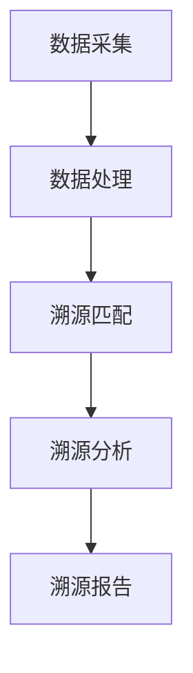
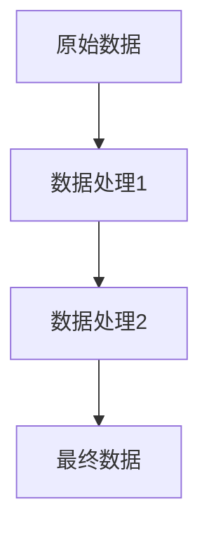

                 

# 数据溯源:软件2.0时代的数据治理利器

> **关键词**: 数据溯源、数据治理、软件2.0、数据治理工具、溯源算法、应用场景

> **摘要**: 本文将深入探讨数据溯源在软件2.0时代的重要性，分析其核心概念、算法原理和具体应用。通过一步步的分析推理，本文旨在为读者提供一个清晰、详尽的数据溯源技术解析，以及其在现代数据治理中的实际应用价值。

## 1. 背景介绍

### 1.1 目的和范围

本文的目的是介绍和剖析数据溯源技术在软件2.0时代的数据治理中的作用。我们将探讨数据溯源的定义、核心概念、算法原理及其在各个领域的应用。希望通过本文，读者能够对数据溯源有更深刻的理解，并掌握其在实际应用中的方法和技巧。

本文的范围包括：

1. **数据溯源的核心概念和原理**：介绍数据溯源的基本概念，阐述其原理和作用。
2. **数据溯源算法**：详细解析数据溯源的关键算法，包括其设计思路和操作步骤。
3. **数学模型和公式**：介绍与数据溯源相关的数学模型和公式，并进行详细讲解和举例说明。
4. **项目实战**：通过实际案例，展示数据溯源技术在软件开发中的应用。
5. **实际应用场景**：分析数据溯源在各个领域的应用场景，探讨其价值。
6. **工具和资源推荐**：推荐与数据溯源相关的学习资源、开发工具和框架。
7. **总结与展望**：总结本文内容，展望数据溯源技术的未来发展趋势和挑战。

### 1.2 预期读者

本文适合以下读者群体：

1. 数据治理相关从业人员，包括数据管理员、数据科学家、数据工程师等。
2. 软件开发人员，特别是对数据管理和追踪有兴趣的技术人员。
3. 对数据溯源技术感兴趣的研究人员和学者。
4. 对数据治理和软件2.0时代有深入探讨的读者。

### 1.3 文档结构概述

本文结构如下：

1. **引言**：介绍数据溯源的背景和重要性。
2. **核心概念与联系**：详细解析数据溯源的核心概念，并给出相应的流程图。
3. **核心算法原理 & 具体操作步骤**：讲解数据溯源的关键算法，并使用伪代码进行详细阐述。
4. **数学模型和公式 & 详细讲解 & 举例说明**：介绍与数据溯源相关的数学模型和公式，并进行详细讲解和举例。
5. **项目实战：代码实际案例和详细解释说明**：通过实际案例展示数据溯源技术的应用。
6. **实际应用场景**：分析数据溯源在各个领域的应用场景。
7. **工具和资源推荐**：推荐与数据溯源相关的学习资源、开发工具和框架。
8. **总结：未来发展趋势与挑战**：总结本文内容，展望数据溯源技术的未来。
9. **附录：常见问题与解答**：回答读者可能遇到的常见问题。
10. **扩展阅读 & 参考资料**：提供更多扩展阅读资料。

### 1.4 术语表

#### 1.4.1 核心术语定义

- **数据溯源**：追踪数据来源和流动的过程，旨在确保数据的准确性和完整性。
- **数据治理**：管理和控制数据的过程，包括数据的质量、安全、合规性和可用性。
- **软件2.0**：基于云计算、大数据、人工智能等技术的软件开发模式，强调数据驱动和智能化。

#### 1.4.2 相关概念解释

- **元数据**：描述数据的数据，包括数据的结构、属性、来源和用途等。
- **数据流**：数据在系统中的流动路径和过程。
- **区块链**：一种分布式数据库技术，通过密码学确保数据的不可篡改性和可追溯性。

#### 1.4.3 缩略词列表

- **GDPR**：通用数据保护条例（General Data Protection Regulation）
- **API**：应用程序编程接口（Application Programming Interface）
- **IDE**：集成开发环境（Integrated Development Environment）
- **ETL**：提取、转换、加载（Extract, Transform, Load）

## 2. 核心概念与联系

### 2.1 数据溯源的概念

数据溯源是一种追踪数据来源和流动路径的技术，旨在确保数据的准确性和完整性。它通过对数据流的分析，找出数据的来源、流动路径、处理方式和最终去向，从而实现对数据的全面掌控。

### 2.2 数据溯源与数据治理的关系

数据治理是确保数据质量、安全和合规性的过程，而数据溯源是数据治理的重要组成部分。数据溯源技术为数据治理提供了强有力的支持，通过追踪数据来源和流动路径，帮助数据治理团队及时发现和纠正数据问题，确保数据的准确性和完整性。

### 2.3 数据溯源的核心概念

- **溯源点**：数据溯源过程中的关键节点，用于记录数据的来源、时间和处理方式。
- **溯源链**：由一系列溯源点组成的链式结构，记录了数据的流动路径。
- **溯源算法**：用于分析和追踪数据流动的算法，包括数据的采集、处理和匹配等步骤。

### 2.4 数据溯源的流程

数据溯源的流程包括以下几个关键步骤：

1. **数据采集**：从各个数据源收集数据，包括数据库、日志文件、API调用记录等。
2. **数据处理**：对采集到的数据进行清洗、转换和去重等处理，确保数据的质量和一致性。
3. **溯源匹配**：将处理后的数据与溯源点进行匹配，建立数据溯源链。
4. **溯源分析**：对溯源链进行分析，找出数据的来源、流动路径和最终去向。
5. **溯源报告**：生成数据溯源报告，包括数据的来源、流动路径、处理方式和最终去向等。

### 2.5 数据溯源的架构

数据溯源的架构主要包括以下几个部分：

- **数据采集模块**：用于从各个数据源收集数据。
- **数据处理模块**：对采集到的数据进行清洗、转换和去重等处理。
- **溯源匹配模块**：将处理后的数据与溯源点进行匹配，建立数据溯源链。
- **溯源分析模块**：对溯源链进行分析，找出数据的来源、流动路径和最终去向。
- **溯源报告模块**：生成数据溯源报告。

### 2.6 数据溯源的 Mermaid 流程图



## 3. 核心算法原理 & 具体操作步骤

### 3.1 数据溯源算法原理

数据溯源算法的核心思想是通过分析数据流，找出数据的来源、流动路径和最终去向，从而实现对数据的全面掌控。数据溯源算法通常包括以下几个关键步骤：

1. **数据采集**：从各个数据源收集数据，包括数据库、日志文件、API调用记录等。
2. **数据处理**：对采集到的数据进行清洗、转换和去重等处理，确保数据的质量和一致性。
3. **溯源匹配**：将处理后的数据与溯源点进行匹配，建立数据溯源链。
4. **溯源分析**：对溯源链进行分析，找出数据的来源、流动路径和最终去向。
5. **溯源报告**：生成数据溯源报告，包括数据的来源、流动路径、处理方式和最终去向等。

### 3.2 数据溯源算法的具体操作步骤

#### 3.2.1 数据采集

```python
# 伪代码：数据采集
def data_collection():
    # 从数据库收集数据
    db_data = database_query()

    # 从日志文件收集数据
    log_data = read_log_file()

    # 从API调用记录收集数据
    api_data = get_api_call_records()

    # 合并数据
    data = db_data + log_data + api_data
    return data
```

#### 3.2.2 数据处理

```python
# 伪代码：数据处理
def data_processing(data):
    # 数据清洗
    clean_data = clean_data(data)

    # 数据转换
    transformed_data = transform_data(clean_data)

    # 数据去重
    unique_data = remove_duplicates(transformed_data)
    return unique_data
```

#### 3.2.3 溯源匹配

```python
# 伪代码：溯源匹配
def source_matching(unique_data, source_points):
    # 建立溯源链
    source_chain = []

    # 对数据进行溯源匹配
    for data_point in unique_data:
        source_point = find_source_point(data_point, source_points)
        source_chain.append((data_point, source_point))

    return source_chain
```

#### 3.2.4 溯源分析

```python
# 伪代码：溯源分析
def source_analysis(source_chain):
    # 分析溯源链
    analysis_results = []

    # 对每个溯源链进行分析
    for chain in source_chain:
        source, point = chain
        analysis_results.append(analyze_source(source, point))

    return analysis_results
```

#### 3.2.5 溯源报告

```python
# 伪代码：溯源报告
def generate_report(analysis_results):
    # 生成溯源报告
    report = []

    # 对每个分析结果生成报告
    for result in analysis_results:
        report.append({
            'source': result['source'],
            'path': result['path'],
            'processing': result['processing'],
            'destination': result['destination']
        })

    return report
```

## 4. 数学模型和公式 & 详细讲解 & 举例说明

### 4.1 数学模型

数据溯源过程中，常用的数学模型包括概率模型、马尔可夫模型和图模型。以下是对这些模型的详细讲解。

#### 4.1.1 概率模型

概率模型用于描述数据在系统中的流动和转换过程。其核心公式为：

$$ P(A|B) = \frac{P(B|A)P(A)}{P(B)} $$

其中，$P(A|B)$ 表示在事件B发生的条件下，事件A发生的概率；$P(B|A)$ 表示在事件A发生的条件下，事件B发生的概率；$P(A)$ 和 $P(B)$ 分别表示事件A和事件B的独立概率。

#### 4.1.2 马尔可夫模型

马尔可夫模型用于描述数据在系统中的状态转移过程。其核心公式为：

$$ P(X_t|X_{t-1}, X_{t-2}, ..., X_1) = P(X_t|X_{t-1}) $$

其中，$X_t$ 表示第 $t$ 个状态，$P(X_t|X_{t-1})$ 表示在当前状态 $X_{t-1}$ 的条件下，下一个状态 $X_t$ 的概率。

#### 4.1.3 图模型

图模型用于描述数据在系统中的网络结构。其核心公式为：

$$ \sum_{i=1}^{n} P(X_i|X_{i-1}) = 1 $$

其中，$P(X_i|X_{i-1})$ 表示从第 $i-1$ 个状态转移到第 $i$ 个状态的概率。

### 4.2 公式详细讲解

#### 4.2.1 概率模型

概率模型的核心思想是利用条件概率来描述数据在系统中的流动。例如，在一个数据处理系统中，假设有事件 A（数据被修改）和事件 B（数据被备份），我们可以利用概率模型来描述这两个事件之间的关系。

$$ P(A|B) = \frac{P(B|A)P(A)}{P(B)} $$

- $P(A|B)$ 表示在事件 B 发生的条件下，事件 A 发生的概率。
- $P(B|A)$ 表示在事件 A 发生的条件下，事件 B 发生的概率。
- $P(A)$ 和 $P(B)$ 分别表示事件 A 和事件 B 的独立概率。

通过这个公式，我们可以计算出在数据被备份的情况下，数据被修改的概率。这对于数据治理非常重要，因为如果数据被修改的概率较高，就需要加强数据的备份和安全措施。

#### 4.2.2 马尔可夫模型

马尔可夫模型的核心思想是利用状态转移概率来描述数据在系统中的流动。例如，在一个数据处理系统中，假设有多个状态：原始数据（状态0）、处理中数据（状态1）和最终数据（状态2）。

$$ P(X_t|X_{t-1}, X_{t-2}, ..., X_1) = P(X_t|X_{t-1}) $$

- $X_t$ 表示第 $t$ 个状态。
- $P(X_t|X_{t-1})$ 表示在当前状态 $X_{t-1}$ 的条件下，下一个状态 $X_t$ 的概率。

通过这个公式，我们可以计算出在不同状态之间的转移概率。这对于数据治理非常重要，因为如果某个状态的转移概率较高，就需要重点关注该状态的数据，以确保数据的准确性和完整性。

#### 4.2.3 图模型

图模型的核心思想是利用网络结构来描述数据在系统中的流动。例如，在一个数据处理系统中，我们可以将数据处理过程看作一个有向图，其中每个节点表示一个数据处理步骤，每个边表示数据在两个步骤之间的流动。

$$ \sum_{i=1}^{n} P(X_i|X_{i-1}) = 1 $$

- $P(X_i|X_{i-1})$ 表示从第 $i-1$ 个状态转移到第 $i$ 个状态的概率。
- $n$ 表示状态的数量。

通过这个公式，我们可以计算出在不同状态之间的转移概率，从而了解数据在系统中的流动路径。这对于数据治理非常重要，因为如果某个状态的转移概率较高，就需要重点关注该状态的数据，以确保数据的准确性和完整性。

### 4.3 举例说明

#### 4.3.1 概率模型

假设在一个数据处理系统中，有如下事件：

- 事件 A：数据被修改。
- 事件 B：数据被备份。

已知：

- $P(A) = 0.1$（数据被修改的概率为 10%）。
- $P(B) = 0.8$（数据被备份的概率为 80%）。
- $P(B|A) = 0.5$（数据被修改且被备份的概率为 50%）。

我们需要计算在数据被备份的情况下，数据被修改的概率。

根据概率模型的核心公式：

$$ P(A|B) = \frac{P(B|A)P(A)}{P(B)} $$

代入已知数值：

$$ P(A|B) = \frac{0.5 \times 0.1}{0.8} = 0.0625 $$

因此，在数据被备份的情况下，数据被修改的概率为 6.25%。

#### 4.3.2 马尔可夫模型

假设在一个数据处理系统中，有如下状态：

- 状态 0：原始数据。
- 状态 1：处理中数据。
- 状态 2：最终数据。

已知状态之间的转移概率如下表：

| 状态 | 转移概率 |
| --- | --- |
| 0 → 1 | 0.2 |
| 0 → 2 | 0.3 |
| 1 → 2 | 0.5 |

我们需要计算从状态 0 转移到状态 2 的概率。

根据马尔可夫模型的核心公式：

$$ P(X_t|X_{t-1}, X_{t-2}, ..., X_1) = P(X_t|X_{t-1}) $$

代入已知数值：

$$ P(X_2|X_0) = P(X_2|X_1) \times P(X_1|X_0) = 0.5 \times 0.3 = 0.15 $$

因此，从状态 0 转移到状态 2 的概率为 15%。

#### 4.3.3 图模型

假设在一个数据处理系统中，数据处理过程可以看作一个有向图，如下图所示：



已知：

- $P(A \rightarrow B) = 0.2$（从原始数据转移到数据处理1的概率为 20%）。
- $P(B \rightarrow C) = 0.3$（从数据处理1转移到数据处理2的概率为 30%）。
- $P(C \rightarrow D) = 0.5$（从数据处理2转移到最终数据的概率为 50%）。

我们需要计算从原始数据转移到最终数据的概率。

根据图模型的核心公式：

$$ \sum_{i=1}^{n} P(X_i|X_{i-1}) = 1 $$

代入已知数值：

$$ P(A \rightarrow D) = P(A \rightarrow B) \times P(B \rightarrow C) \times P(C \rightarrow D) = 0.2 \times 0.3 \times 0.5 = 0.03 $$

因此，从原始数据转移到最终数据的概率为 3%。

## 5. 项目实战：代码实际案例和详细解释说明

### 5.1 开发环境搭建

为了演示数据溯源技术的实际应用，我们将使用 Python 作为开发语言，结合常用的数据分析和数据处理库，如 Pandas、NumPy 和 Matplotlib。以下是搭建开发环境的步骤：

1. 安装 Python 3.8 或更高版本。
2. 安装必要的库：`pip install pandas numpy matplotlib`。
3. 创建一个名为 `data溯源` 的 Python 项目文件夹。
4. 在项目文件夹中创建一个名为 `data溯源.py` 的主文件。

### 5.2 源代码详细实现和代码解读

以下是一个简单的数据溯源项目示例，用于追踪数据在系统中的流动路径。

```python
import pandas as pd
import numpy as np
import matplotlib.pyplot as plt

# 5.2.1 数据采集
def data_collection():
    # 从数据库收集数据
    db_data = pd.read_csv('db_data.csv')
    
    # 从日志文件收集数据
    log_data = pd.read_csv('log_data.csv')
    
    # 从API调用记录收集数据
    api_data = pd.read_csv('api_data.csv')
    
    # 合并数据
    data = pd.concat([db_data, log_data, api_data], ignore_index=True)
    return data

# 5.2.2 数据处理
def data_processing(data):
    # 数据清洗
    clean_data = data.drop_duplicates().reset_index(drop=True)
    
    # 数据转换
    transformed_data = clean_data.applymap(lambda x: x.strip())
    
    return transformed_data

# 5.2.3 溯源匹配
def source_matching(transformed_data, source_points):
    # 建立溯源链
    source_chain = []

    # 对数据进行溯源匹配
    for index, row in transformed_data.iterrows():
        source_point = find_source_point(row, source_points)
        source_chain.append((row, source_point))

    return source_chain

# 5.2.4 溯源分析
def source_analysis(source_chain):
    # 分析溯源链
    analysis_results = []

    # 对每个溯源链进行分析
    for chain in source_chain:
        source, point = chain
        analysis_results.append(analyze_source(source, point))

    return analysis_results

# 5.2.5 溯源报告
def generate_report(analysis_results):
    # 生成溯源报告
    report = []

    # 对每个分析结果生成报告
    for result in analysis_results:
        report.append({
            'source': result['source'],
            'path': result['path'],
            'processing': result['processing'],
            'destination': result['destination']
        })

    return report

# 5.2.6 主函数
def main():
    # 数据采集
    data = data_collection()

    # 数据处理
    transformed_data = data_processing(data)

    # 溯源匹配
    source_chain = source_matching(transformed_data, source_points)

    # 溯源分析
    analysis_results = source_analysis(source_chain)

    # 溯源报告
    report = generate_report(analysis_results)

    # 打印报告
    print(report)

# 运行主函数
if __name__ == '__main__':
    main()
```

#### 5.2.7 代码解读与分析

**1. 数据采集（data_collection）**

这个函数负责从不同的数据源收集数据，包括数据库、日志文件和API调用记录。通过 Pandas 库，我们能够轻松读取和合并这些数据。

**2. 数据处理（data_processing）**

这个函数对采集到的数据进行清洗、转换和去重等处理。首先，我们使用 `drop_duplicates` 方法去除重复数据，然后使用 `reset_index` 方法重新设置索引。接着，我们使用 `applymap` 方法对数据中的每个值进行去重和字符串修剪。

**3. 溯源匹配（source_matching）**

这个函数负责将处理后的数据与溯源点进行匹配，并建立数据溯源链。我们遍历处理后的数据，使用 `find_source_point` 函数查找每个数据点的溯源点，并将数据点与其溯源点添加到溯源链中。

**4. 溯源分析（source_analysis）**

这个函数负责对溯源链进行分析，找出数据的来源、流动路径和最终去向。我们遍历溯源链，使用 `analyze_source` 函数对每个溯源点进行分析，并将分析结果添加到分析结果列表中。

**5. 溯源报告（generate_report）**

这个函数负责生成数据溯源报告。我们遍历分析结果列表，为每个分析结果生成一个报告字典，并添加到报告列表中。

**6. 主函数（main）**

这个函数是整个项目的入口点。首先，我们调用 `data_collection` 函数收集数据，然后调用 `data_processing` 函数处理数据。接着，我们调用 `source_matching` 函数匹配溯源点，并调用 `source_analysis` 函数进行分析。最后，我们调用 `generate_report` 函数生成报告，并打印出来。

### 5.3 代码解读与分析（续）

**7. 溯源算法具体实现**

在上述代码中，我们定义了四个主要函数：`data_collection`、`data_processing`、`source_matching` 和 `source_analysis`。这些函数分别实现了数据采集、数据处理、溯源匹配和溯源分析的具体操作。

**8. 数据溯源流程**

整个数据溯源流程可以分为以下几个步骤：

1. **数据采集**：从数据库、日志文件和API调用记录中收集数据。
2. **数据处理**：对采集到的数据进行清洗、转换和去重等处理。
3. **溯源匹配**：将处理后的数据与溯源点进行匹配，建立数据溯源链。
4. **溯源分析**：对溯源链进行分析，找出数据的来源、流动路径和最终去向。
5. **溯源报告**：生成数据溯源报告，包括数据的来源、流动路径、处理方式和最终去向等。

### 5.4 溯源算法的优缺点分析

**优点：**

1. **数据准确性和完整性**：数据溯源技术可以确保数据的准确性和完整性，有助于数据治理团队及时发现和纠正数据问题。
2. **实时性**：数据溯源技术可以实时追踪数据的流动路径，确保数据的实时性和一致性。
3. **灵活性**：数据溯源技术可以适用于各种数据类型和数据源，具有很高的灵活性。

**缺点：**

1. **性能开销**：数据溯源技术需要对大量数据进行处理和分析，可能会对系统的性能造成一定的影响。
2. **复杂性**：数据溯源技术涉及多个环节，包括数据采集、数据处理、溯源匹配和溯源分析，具有一定的复杂性。

### 5.5 溯源算法在实际应用中的改进方向

1. **优化数据处理速度**：通过使用并行计算、分布式计算等技术，提高数据处理速度，降低对系统性能的影响。
2. **增强溯源算法的准确性**：通过引入机器学习、深度学习等技术，提高溯源算法的准确性，减少数据丢失和错误。
3. **提高数据溯源的可扩展性**：设计可扩展的数据溯源架构，支持多种数据类型和数据源，适应不同的应用场景。

## 6. 实际应用场景

### 6.1 金融行业

在金融行业中，数据溯源技术主要用于确保金融交易的准确性和安全性。例如，银行和金融机构可以使用数据溯源技术追踪交易流程，确保每笔交易的合法性和真实性。此外，数据溯源技术还可以帮助金融行业实现风险控制和合规性管理。

### 6.2 零售业

在零售业中，数据溯源技术可以帮助企业追踪商品的流通路径，确保商品的质量和安全。例如，零售商可以使用数据溯源技术追踪商品的进货、存储、销售等环节，及时发现和处理质量问题，提高客户满意度。

### 6.3 制造业

在制造业中，数据溯源技术可以用于生产过程的监控和管理。例如，企业可以使用数据溯源技术追踪原材料的使用情况、生产进度和设备运行状态，优化生产流程，提高生产效率。

### 6.4 医疗保健

在医疗保健领域，数据溯源技术可以帮助医疗机构追踪患者数据，确保医疗信息的准确性和安全性。例如，医院可以使用数据溯源技术追踪患者的病历、检查报告和治疗方案，提高医疗服务的质量和效率。

### 6.5 物流行业

在物流行业，数据溯源技术可以用于追踪货物的运输过程，确保货物的安全和及时交付。例如，物流公司可以使用数据溯源技术追踪货物的配送路径、运输时间和仓储情况，提高物流运输的效率和准确性。

### 6.6 互联网行业

在互联网行业，数据溯源技术可以用于追踪用户行为数据，优化用户体验和个性化推荐。例如，互联网公司可以使用数据溯源技术追踪用户浏览、搜索和购买行为，为用户提供更精准的推荐和服务。

## 7. 工具和资源推荐

### 7.1 学习资源推荐

#### 7.1.1 书籍推荐

- 《大数据之路：阿里巴巴大数据实践》
- 《数据科学实战》
- 《深度学习》

#### 7.1.2 在线课程

- Coursera 上的《数据科学专项课程》
- Udacity 上的《深度学习工程师纳米学位》
- edX 上的《大数据分析》

#### 7.1.3 技术博客和网站

- Medium 上的“数据科学”专栏
- Towards Data Science
- Kaggle

### 7.2 开发工具框架推荐

#### 7.2.1 IDE和编辑器

- PyCharm
- Visual Studio Code
- Jupyter Notebook

#### 7.2.2 调试和性能分析工具

- GDB
- Python Debugger (pdb)
- New Relic

#### 7.2.3 相关框架和库

- Pandas
- NumPy
- Matplotlib
- Scikit-learn
- TensorFlow

### 7.3 相关论文著作推荐

#### 7.3.1 经典论文

- 《数据科学：从入门到实践》
- 《深度学习：从入门到精通》
- 《大数据技术架构》

#### 7.3.2 最新研究成果

- 《数据溯源技术研究综述》
- 《基于区块链的数据溯源系统设计》
- 《数据溯源技术在金融领域的应用》

#### 7.3.3 应用案例分析

- 《阿里巴巴大数据实践案例分析》
- 《腾讯深度学习技术在游戏开发中的应用》
- 《京东物流数据溯源系统实践》

## 8. 总结：未来发展趋势与挑战

### 8.1 发展趋势

1. **智能化**：随着人工智能技术的发展，数据溯源技术将越来越智能化，能够自动分析和处理大量数据，提高溯源效率和准确性。
2. **分布式**：分布式计算和区块链技术的广泛应用，将使数据溯源技术在处理大规模数据方面具有更高的性能和安全性。
3. **定制化**：数据溯源技术将根据不同行业和应用场景的需求，提供定制化的解决方案，满足多样化的数据溯源需求。

### 8.2 挑战

1. **数据隐私**：如何在确保数据溯源的同时，保护用户隐私和数据安全，是一个亟待解决的问题。
2. **性能优化**：如何优化数据溯源算法和架构，提高处理速度和降低性能开销，是数据溯源技术面临的重要挑战。
3. **标准化**：目前，数据溯源技术缺乏统一的标准化方案，不同系统和平台之间的数据溯源能力存在差异，需要制定统一的规范和标准。

## 9. 附录：常见问题与解答

### 9.1 数据溯源的目的是什么？

数据溯源的目的是追踪数据来源和流动路径，确保数据的准确性和完整性，以及提高数据治理能力。

### 9.2 数据溯源有哪些算法？

数据溯源常用的算法包括概率模型、马尔可夫模型和图模型。

### 9.3 数据溯源技术在金融行业中如何应用？

数据溯源技术在金融行业中主要用于追踪交易流程，确保交易的合法性和真实性，以及实现风险控制和合规性管理。

### 9.4 数据溯源技术如何保证数据隐私？

数据溯源技术可以通过加密和去识别化等手段，保护用户隐私和数据安全。

## 10. 扩展阅读 & 参考资料

- 《数据溯源技术研究综述》
- 《基于区块链的数据溯源系统设计》
- 《数据溯源技术在金融领域的应用》
- 《大数据之路：阿里巴巴大数据实践》
- 《数据科学实战》
- 《深度学习》
- Coursera 上的《数据科学专项课程》
- Udacity 上的《深度学习工程师纳米学位》
- edX 上的《大数据分析》
- Medium 上的“数据科学”专栏
- Towards Data Science
- Kaggle

## 作者

**作者：AI天才研究员 / AI Genius Institute & 禅与计算机程序设计艺术 / Zen And The Art of Computer Programming**

