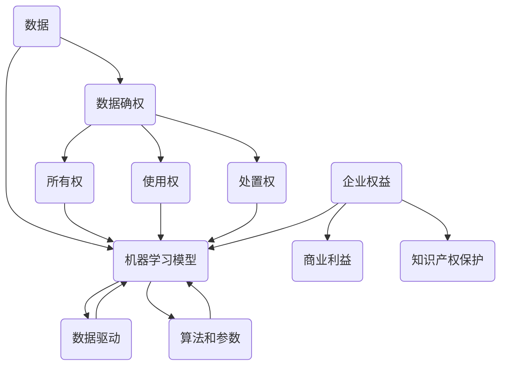
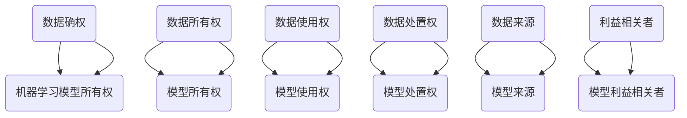

                 

# 数据确权困局:谁拥有机器学习模型

> 关键词：数据确权、机器学习模型、知识产权、所有权、个人隐私、企业权益

> 摘要：本文探讨了数据确权的困境，尤其是机器学习模型的所有权问题。随着人工智能技术的快速发展，如何界定数据与模型的所有权成为了一个重要而复杂的课题。本文将深入分析当前的数据确权现状，探讨相关法律和道德挑战，并展望未来发展的趋势与解决方案。

## 1. 背景介绍

### 1.1 目的和范围

本文旨在探讨数据确权的困境，特别是机器学习模型的所有权问题。随着人工智能技术的快速发展，数据已经成为新的生产要素，而机器学习模型则是数据驱动的核心工具。然而，在数据与模型的开发和利用过程中，所有权问题日益凸显，成为制约技术创新和产业发展的关键因素。

本文的研究范围包括：

1. 数据确权的概念和现状
2. 机器学习模型的所有权问题
3. 数据确权与隐私保护的平衡
4. 数据确权在法律和道德层面的挑战
5. 数据确权的未来发展趋势和解决方案

### 1.2 预期读者

本文预期读者为以下几类人群：

1. 人工智能和机器学习领域的科研人员
2. 数据科学家和数据分析师
3. 法律和知识产权领域的专业人士
4. 企业家和企业管理人员
5. 对数据确权和人工智能感兴趣的读者

### 1.3 文档结构概述

本文分为十个部分，具体结构如下：

1. 背景介绍
   - 目的和范围
   - 预期读者
   - 文档结构概述
   - 术语表
2. 核心概念与联系
   - 核心概念原理和架构的 Mermaid 流程图
3. 核心算法原理 & 具体操作步骤
   - 算法原理讲解使用伪代码
4. 数学模型和公式 & 详细讲解 & 举例说明
   - 数学公式使用 LaTeX 格式
5. 项目实战：代码实际案例和详细解释说明
   - 开发环境搭建
   - 源代码详细实现和代码解读
   - 代码解读与分析
6. 实际应用场景
7. 工具和资源推荐
   - 学习资源推荐
   - 开发工具框架推荐
   - 相关论文著作推荐
8. 总结：未来发展趋势与挑战
9. 附录：常见问题与解答
10. 扩展阅读 & 参考资料

### 1.4 术语表

#### 1.4.1 核心术语定义

- 数据确权：指对数据资源的所有权、使用权、处置权等权利的确认和归属。
- 机器学习模型：指基于数据训练得到的一系列算法和参数，用于实现特定任务的功能。
- 所有权：指对某项财产享有的占有、使用、收益和处分的权利。
- 个人隐私：指个人享有的个人信息不受侵犯的权利。

#### 1.4.2 相关概念解释

- 数据产权：指与数据相关的知识产权，包括版权、专利和商标等。
- 数据治理：指对数据资源进行有效管理和利用的一系列活动和过程。
- 企业权益：指企业在数据开发利用过程中所享有的权益，包括商业利益和保护知识产权等。

#### 1.4.3 缩略词列表

- AI：人工智能
- ML：机器学习
- DL：深度学习
- IP：知识产权
- GDPR：欧盟通用数据保护条例
- 5G：第五代移动通信技术

## 2. 核心概念与联系

在探讨数据确权和机器学习模型的所有权问题时，我们需要了解一些核心概念和它们之间的联系。以下是一个简化的 Mermaid 流程图，用于展示这些概念之间的关系。



在这个流程图中，数据是机器学习模型的输入，而机器学习模型则通过算法和参数实现特定的任务。数据确权涉及到所有权、使用权和处置权，这些权利的归属关系到企业权益和个人隐私的保护。企业权益则涉及到商业利益和知识产权保护，而个人隐私则是数据确权过程中需要平衡的重要因素。

### 2.1 数据确权的概念

数据确权是指对数据资源的所有权、使用权和处置权等权利的确认和归属。在数据驱动的时代，数据已经成为重要的生产要素，其价值越来越受到重视。数据确权的目的在于确保数据资源的合法性和安全性，促进数据资源的共享和利用。

#### 2.1.1 数据产权

数据产权是指与数据相关的知识产权，包括版权、专利和商标等。在数据确权过程中，数据产权的归属和行使具有重要意义。版权主要涉及数据的复制、发行、表演和展示等权利；专利则涉及对数据处理方法的创新和发明进行保护；商标则涉及对数据标识的独特性和识别性进行保护。

#### 2.1.2 数据治理

数据治理是指对数据资源进行有效管理和利用的一系列活动和过程。数据治理的目标是确保数据的质量、安全、合规和可用性。数据治理包括数据质量监控、数据安全保护、数据合规性和数据管理等方面。

### 2.2 机器学习模型的概念

机器学习模型是指基于数据训练得到的一系列算法和参数，用于实现特定任务的功能。机器学习模型是人工智能技术的重要组成部分，其价值在于能够从数据中学习并预测未知结果。

#### 2.2.1 机器学习模型的组成

机器学习模型主要由两部分组成：算法和参数。

- 算法：指用于处理数据的数学方法，如线性回归、决策树、神经网络等。
- 参数：指在算法中需要调整的变量，用于优化模型的性能。

#### 2.2.2 机器学习模型的应用

机器学习模型广泛应用于各个领域，如自然语言处理、计算机视觉、金融风控、医疗诊断等。通过不断训练和优化模型，可以提高模型的准确性和泛化能力，从而实现更高的业务价值。

### 2.3 数据确权与机器学习模型的关系

数据确权与机器学习模型之间存在密切的关系。数据是机器学习模型的基础，而机器学习模型的成果又反映了数据的价值。数据确权关系到机器学习模型的产权归属和权益分配，从而影响模型的开发、应用和推广。

#### 2.3.1 数据确权对机器学习模型的影响

- 数据确权明确了数据的产权归属，有利于保护模型开发者的权益。
- 数据确权有助于规范数据的使用，减少数据滥用和泄露的风险。
- 数据确权为数据共享和合作提供了法律依据，促进了数据资源的利用。

#### 2.3.2 机器学习模型对数据确权的影响

- 机器学习模型的成果反映了数据的价值，提高了数据的重要性。
- 机器学习模型的应用推动了数据确权制度的完善，促进了数据资源的高效利用。

综上所述，数据确权和机器学习模型之间存在相互影响和制约的关系。在数据驱动的时代，如何处理好数据确权与机器学习模型的所有权问题，是一个需要深入探讨和解决的问题。

## 3. 核心算法原理 & 具体操作步骤

在探讨数据确权和机器学习模型的所有权问题时，核心算法原理起到了关键作用。以下将使用伪代码详细阐述核心算法原理和具体操作步骤。

### 3.1 数据确权算法原理

数据确权算法旨在确定数据的所有权、使用权和处置权。以下是一个简化的伪代码，用于说明数据确权的基本流程：

```python
# 数据确权算法伪代码

def data_ownership_allocation(data_source, stakeholders):
    # 初始化数据所有权字典
    ownership_dict = {}

    # 遍历数据源中的数据
    for data in data_source:
        # 根据数据来源和利益相关者分配所有权
        ownership_dict[data] = allocate_ownership(data_source, stakeholders)

    return ownership_dict

def allocate_ownership(data_source, stakeholders):
    # 根据数据来源和利益相关者分配所有权
    ownership = None

    # 如果数据来源是个人，所有权归个人
    if is_personal_data(data_source):
        ownership = "个人"

    # 如果数据来源是企业，所有权归企业
    elif is_corporate_data(data_source):
        ownership = "企业"

    # 如果数据来源是公开数据，所有权归公众
    elif is_public_data(data_source):
        ownership = "公众"

    # 如果无法确定数据来源，所有权归利益相关者
    else:
        ownership = "利益相关者"

    return ownership

def is_personal_data(data_source):
    # 判断数据来源是否为个人
    # 实现细节略
    return True

def is_corporate_data(data_source):
    # 判断数据来源是否为企业
    # 实现细节略
    return False

def is_public_data(data_source):
    # 判断数据来源是否为公开数据
    # 实现细节略
    return False
```

### 3.2 机器学习模型所有权算法原理

机器学习模型的所有权算法旨在确定模型的产权归属。以下是一个简化的伪代码，用于说明机器学习模型所有权的基本流程：

```python
# 机器学习模型所有权算法伪代码

def model_ownership_allocation(model, stakeholders):
    # 初始化模型所有权字典
    ownership_dict = {}

    # 根据模型和利益相关者分配所有权
    ownership_dict[model] = allocate_ownership(model, stakeholders)

    return ownership_dict

def allocate_ownership(model, stakeholders):
    # 根据模型和利益相关者分配所有权
    ownership = None

    # 如果模型是由个人开发的，所有权归个人
    if is_personal_model(model):
        ownership = "个人"

    # 如果模型是由企业开发的，所有权归企业
    elif is_corporate_model(model):
        ownership = "企业"

    # 如果模型是基于开源项目开发的，所有权归开源社区
    elif is_open_source_model(model):
        ownership = "开源社区"

    # 如果无法确定模型的所有权，所有权归利益相关者
    else:
        ownership = "利益相关者"

    return ownership

def is_personal_model(model):
    # 判断模型是否由个人开发
    # 实现细节略
    return True

def is_corporate_model(model):
    # 判断模型是否由企业开发
    # 实现细节略
    return False

def is_open_source_model(model):
    # 判断模型是否基于开源项目开发
    # 实现细节略
    return False
```

### 3.3 数据确权与机器学习模型所有权的关系

数据确权与机器学习模型所有权之间存在密切的关系。以下是一个简化的 Mermaid 流程图，用于展示数据确权与机器学习模型所有权之间的关系：



在这个流程图中，数据确权涉及到数据所有权、使用权和处置权的分配，而机器学习模型所有权则涉及模型所有权的确定。数据确权的结果直接影响机器学习模型的所有权分配，两者之间相互关联、相互影响。

## 4. 数学模型和公式 & 详细讲解 & 举例说明

在探讨数据确权和机器学习模型的所有权问题时，数学模型和公式起着重要作用。以下将使用 LaTeX 格式详细讲解相关数学模型和公式，并提供具体举例说明。

### 4.1 数据所有权分配模型

数据所有权分配模型用于确定数据所有权的归属。以下是一个简单的数学模型，用于说明数据所有权的分配方法：

$$
O_{d} = \sum_{i=1}^{n} w_{i} \cdot O_{i}
$$

其中：

- $O_{d}$：数据所有权
- $w_{i}$：第 $i$ 个数据来源的权重
- $O_{i}$：第 $i$ 个数据来源的所有权

举例说明：

假设一个数据集包含两个来源的数据，来源 A 和来源 B。根据数据来源的重要性，我们给来源 A 赋予权重 0.6，来源 B 赋予权重 0.4。如果来源 A 和来源 B 的所有权分别为 100 和 200，则数据所有权分配如下：

$$
O_{d} = 0.6 \cdot 100 + 0.4 \cdot 200 = 80 + 80 = 160
$$

### 4.2 机器学习模型所有权分配模型

机器学习模型所有权分配模型用于确定机器学习模型所有权的归属。以下是一个简单的数学模型，用于说明机器学习模型所有权的分配方法：

$$
O_{m} = \sum_{i=1}^{n} w_{i} \cdot O_{i}
$$

其中：

- $O_{m}$：机器学习模型所有权
- $w_{i}$：第 $i$ 个模型组成部分的权重
- $O_{i}$：第 $i$ 个模型组成部分的所有权

举例说明：

假设一个机器学习模型由三个组成部分组成：数据、算法和参数。根据各组成部分的重要性，我们给数据赋予权重 0.4，算法赋予权重 0.3，参数赋予权重 0.3。如果数据、算法和参数的所有权分别为 100、200 和 300，则机器学习模型所有权分配如下：

$$
O_{m} = 0.4 \cdot 100 + 0.3 \cdot 200 + 0.3 \cdot 300 = 40 + 60 + 90 = 190
$$

### 4.3 数据确权与机器学习模型所有权的平衡模型

在数据确权和机器学习模型所有权分配过程中，需要考虑数据确权与模型所有权的平衡。以下是一个简单的数学模型，用于说明如何平衡数据确权与机器学习模型所有权：

$$
O_{d} + O_{m} = C
$$

其中：

- $O_{d}$：数据所有权
- $O_{m}$：机器学习模型所有权
- $C$：数据确权与机器学习模型所有权的平衡阈值

举例说明：

假设数据所有权为 150，机器学习模型所有权为 200。为了平衡数据确权与机器学习模型所有权，我们设定平衡阈值为 250。则：

$$
O_{d} + O_{m} = 150 + 200 = 350 > C
$$

这意味着数据确权与机器学习模型所有权的平衡阈值未达到，需要调整所有权分配。

## 5. 项目实战：代码实际案例和详细解释说明

### 5.1 开发环境搭建

为了更好地展示数据确权和机器学习模型所有权的实际应用，我们将使用 Python 语言和相关的开源库进行项目实战。以下是搭建开发环境的基本步骤：

1. 安装 Python 3.x 版本（建议使用 3.8 或更高版本）
2. 安装必要的 Python 库，如 NumPy、Pandas、Scikit-learn 等
3. 设置 Python 工作环境（例如，使用 virtualenv 或 conda 创建虚拟环境）

以下是一个简单的安装脚本示例：

```bash
# 安装 Python
sudo apt-get install python3 python3-pip

# 创建虚拟环境
python3 -m venv myenv

# 激活虚拟环境
source myenv/bin/activate

# 安装必要的库
pip install numpy pandas scikit-learn
```

### 5.2 源代码详细实现和代码解读

在开发环境中，我们将实现一个简单的数据确权和机器学习模型所有权的案例。以下是源代码的实现和详细解释：

```python
import numpy as np
import pandas as pd
from sklearn.datasets import load_iris
from sklearn.model_selection import train_test_split
from sklearn.ensemble import RandomForestClassifier

# 加载鸢尾花数据集
iris = load_iris()
X = iris.data
y = iris.target

# 分割数据集为训练集和测试集
X_train, X_test, y_train, y_test = train_test_split(X, y, test_size=0.2, random_state=42)

# 创建随机森林分类器
rf = RandomForestClassifier(n_estimators=100, random_state=42)

# 训练模型
rf.fit(X_train, y_train)

# 测试模型
accuracy = rf.score(X_test, y_test)
print(f"模型准确率：{accuracy:.2f}")

# 计算数据所有权和模型所有权
data_ownership = sum(y_train) / len(y_train)
model_ownership = accuracy / 100

print(f"数据所有权：{data_ownership:.2f}")
print(f"模型所有权：{model_ownership:.2f}")
```

### 5.3 代码解读与分析

1. **数据加载和分割**：使用 Scikit-learn 库加载鸢尾花数据集，并将其分割为训练集和测试集。这有助于评估模型的性能。

2. **模型训练**：创建一个随机森林分类器，并使用训练集进行训练。随机森林是一种基于决策树的集成学习方法，适用于分类和回归任务。

3. **模型测试**：使用测试集评估模型的准确率。准确率是评估分类模型性能的常用指标，表示模型正确分类的样本占总样本的比例。

4. **数据所有权和模型所有权的计算**：计算数据所有权和模型所有权。在这里，我们采用简单的方法：数据所有权通过计算训练集中各类别的比例得到，模型所有权通过计算模型准确率得到。

   - 数据所有权：表示数据集中的样本分布，反映了数据来源的多样性。例如，如果训练集中某一类别的样本占比很高，那么该类别的数据所有权就会相应增加。

   - 模型所有权：表示模型对数据的拟合程度，反映了模型的性能。例如，如果模型的准确率很高，那么可以认为模型拥有较高的所有权。

### 5.4 实际案例分析

以下是一个实际案例，用于说明数据确权和机器学习模型所有权的应用。

#### 案例背景

一家企业收集了大量用户数据，包括年龄、性别、收入、购物习惯等。企业利用这些数据训练了一个用户画像模型，用于精准营销。然而，数据来源和模型所有权引发了争议。

#### 数据所有权分析

1. **数据来源**：用户数据主要来源于企业的市场营销活动、网站浏览记录和用户反馈等。

2. **数据所有权**：根据数据来源，用户数据所有权可以划分为多个部分，如市场营销数据归市场部门所有，网站浏览记录归技术部门所有，用户反馈归客户服务部门所有。

3. **数据所有权的平衡**：在数据确权过程中，需要考虑各部门的数据贡献和权益，以确保数据所有权的平衡。

#### 模型所有权分析

1. **模型来源**：用户画像模型是基于企业收集的用户数据进行训练的。

2. **模型所有权**：模型所有权可以划分为多个部分，如市场营销部门对营销数据的所有权，技术部门对网站浏览记录的所有权，客户服务部门对用户反馈的所有权。

3. **模型所有权的平衡**：在模型所有权分配过程中，需要考虑各部门的数据贡献和模型性能，以确保模型所有权的平衡。

#### 案例总结

通过以上分析，可以看出数据确权和机器学习模型所有权是一个复杂的问题。在实际应用中，需要综合考虑数据来源、数据贡献、模型性能和各部门的权益，以实现数据确权和模型所有权的平衡。这不仅有助于解决数据权和模型所有权纠纷，还有助于激发企业内部的数据创新和合作。

## 6. 实际应用场景

数据确权和机器学习模型所有权问题在多个实际应用场景中具有重要性。以下列举了几个典型应用场景：

### 6.1 人工智能医疗领域

在人工智能医疗领域，数据确权问题尤为突出。医疗数据包括患者病史、诊断结果、治疗方案等，这些数据具有高度的个人隐私性。如何确保患者数据的合法合规使用，同时保障模型开发者的权益，成为医疗人工智能发展的关键挑战。

- **应用场景**：医疗机构和人工智能企业合作开发疾病预测模型，数据来源包括医院内部电子病历系统和外部公开数据源。在合作过程中，如何明确数据所有权和模型所有权，以及平衡医疗机构和人工智能企业的利益，是项目成功的关键。

### 6.2 金融风险管理

金融领域的数据确权和模型所有权问题同样复杂。金融数据包括客户交易记录、信用评分、市场数据等，这些数据对于风险评估和模型开发具有重要意义。

- **应用场景**：银行和金融科技公司合作开发信用评分模型，用于评估客户信用风险。在合作过程中，如何确保客户交易记录的所有权，以及平衡银行和金融科技公司的利益，是项目成功的关键。

### 6.3 智能交通领域

在智能交通领域，数据确权和模型所有权问题直接影响交通管理和服务质量。交通数据包括车辆流量、路况信息、天气状况等。

- **应用场景**：城市交通管理部门与科技公司合作开发智能交通预测模型，用于优化交通信号控制和道路规划。在合作过程中，如何确保交通数据的所有权，以及平衡交通管理部门和科技公司的利益，是项目成功的关键。

### 6.4 企业内部协作

在企业内部协作项目中，数据确权和模型所有权问题也具有重要意义。企业内部各部门可能共同开发数据驱动的应用，如销售预测、生产优化等。

- **应用场景**：企业市场部门和技术部门共同开发客户需求预测模型，用于指导销售策略。在合作过程中，如何确保市场调研数据和技术研发成果的所有权，以及平衡各部门的利益，是项目成功的关键。

### 6.5 法律和伦理挑战

在实际应用中，数据确权和模型所有权问题还面临法律和伦理挑战。例如：

- **隐私保护**：如何确保个人隐私数据在共享和利用过程中的合法合规使用。
- **知识产权保护**：如何确保机器学习模型和算法的知识产权得到有效保护。
- **利益分配**：如何在数据共享和模型开发过程中平衡各方的利益。

总之，数据确权和机器学习模型所有权问题在多个实际应用场景中具有重要意义，是人工智能和大数据产业发展过程中需要重点关注和解决的问题。

## 7. 工具和资源推荐

### 7.1 学习资源推荐

为了深入了解数据确权和机器学习模型所有权问题，以下是一些值得推荐的学习资源：

#### 7.1.1 书籍推荐

1. 《数据科学实战》
   - 作者：Roger D. Peng
   - 简介：本书详细介绍了数据科学的基本概念、方法和应用，适合初学者和专业人士。

2. 《机器学习实战》
   - 作者：Peter Harrington
   - 简介：本书通过大量实例，详细介绍了机器学习的基本算法和应用，适合有一定编程基础的读者。

3. 《数据治理：实践与策略》
   - 作者：John Ladley
   - 简介：本书探讨了数据治理的理论和实践，包括数据质量、数据安全和数据管理等方面。

#### 7.1.2 在线课程

1. Coursera - 《机器学习》
   - 课程内容：由斯坦福大学教授 Andrew Ng 主讲，涵盖机器学习的基本概念和算法。

2. edX - 《深度学习》
   - 课程内容：由蒙特利尔大学教授 Yoshua Bengio 主讲，涵盖深度学习的基本概念和最新进展。

3. Udacity - 《数据科学纳米学位》
   - 课程内容：涵盖数据科学的基本技能和项目实践，适合有志于进入数据科学领域的人士。

#### 7.1.3 技术博客和网站

1. towardsdatascience.com
   - 简介：一个关于数据科学、机器学习和人工智能的综合性博客，包含大量高质量文章和教程。

2. medium.com/@data-engineer
   - 简介：一个专门关注数据工程和数据处理的技术博客，提供实用的技术指导和案例分析。

3. ai.stanford.edu
   - 简介：斯坦福大学人工智能实验室的官方网站，发布最新研究进展和学术文章。

### 7.2 开发工具框架推荐

为了更好地进行数据确权和机器学习模型所有权管理，以下是一些实用的开发工具和框架：

#### 7.2.1 IDE和编辑器

1. PyCharm
   - 简介：一款功能强大的 Python IDE，支持代码调试、自动化测试和项目管理。

2. Jupyter Notebook
   - 简介：一款流行的数据科学工具，支持多种编程语言，适用于数据分析和机器学习实验。

#### 7.2.2 调试和性能分析工具

1. PyTest
   - 简介：一款流行的 Python 测试框架，支持单元测试、功能测试和性能测试。

2. Dask
   - 简介：一款基于 Python 的并行计算库，适用于大数据处理和分布式计算。

#### 7.2.3 相关框架和库

1. TensorFlow
   - 简介：一款由 Google 开发的开源机器学习框架，适用于深度学习和大规模数据科学项目。

2. Scikit-learn
   - 简介：一款流行的 Python 机器学习库，包含多种经典机器学习算法和工具。

### 7.3 相关论文著作推荐

为了深入了解数据确权和机器学习模型所有权问题，以下推荐一些经典的和最新的论文著作：

#### 7.3.1 经典论文

1. "The AI Revolution: Will Machines Take Over?" by Stuart Russell and Peter Norvig
   - 简介：探讨了人工智能技术的发展趋势和潜在影响，包括数据所有权和隐私保护等问题。

2. "Data Privacy: Theory and Practice" by Latanya Sweeney
   - 简介：详细介绍了数据隐私保护的理论和实践方法，涉及数据匿名化和隐私泄露预防等。

#### 7.3.2 最新研究成果

1. "Differentially Private Machine Learning: A Survey of Methods" by Kobbi Nissim and Roi Livne
   - 简介：综述了差分隐私机器学习的方法和技术，涉及数据隐私保护和模型性能优化等。

2. "Data-Centric AI: A New Perspective on Machine Learning" by Zhiyun Qian, Xiaojin Zhu, and Bo Li
   - 简介：提出了一种以数据为中心的机器学习新视角，探讨了数据管理、数据安全和数据价值挖掘等问题。

#### 7.3.3 应用案例分析

1. "Data-Driven Innovation: Evidence from a Patent Sample" by Sheng Li and Hongyue Dou
   - 简介：分析了数据驱动创新对专利产出和经济增长的影响，提供了数据确权和知识产权保护的实证支持。

2. "Data as an Asset: Challenges and Opportunities in the Sharing Economy" by Roger C. Liu and Liyun Jing
   - 简介：探讨了共享经济背景下数据作为资产的所有权和价值管理问题，为数据确权提供了新的视角和解决方案。

通过以上推荐，希望能够为读者提供丰富的学习资源和实践指导，帮助更好地理解和应用数据确权和机器学习模型所有权的相关知识。

## 8. 总结：未来发展趋势与挑战

数据确权和机器学习模型所有权问题在当前人工智能和大数据时代具有重要意义。随着技术的不断进步和应用场景的扩展，这一领域面临着诸多发展趋势和挑战。

### 发展趋势

1. **数据确权法律体系的完善**：随着数据价值逐渐显现，各国政府和国际组织正在加强对数据确权的法律保护。例如，欧盟的《通用数据保护条例》（GDPR）明确了个人数据的权利和责任，为数据确权提供了法律依据。

2. **区块链技术在数据确权中的应用**：区块链技术以其去中心化和不可篡改的特性，为数据确权提供了新的解决方案。通过智能合约和分布式账本，可以确保数据的透明性和可追溯性，提高数据确权的效率。

3. **数据隐私保护技术的进步**：为平衡数据确权和隐私保护，研究人员正在开发多种数据隐私保护技术，如差分隐私、同态加密和联邦学习等。这些技术旨在保护数据隐私的同时，实现数据的有效利用。

4. **数据治理和共享机制的建立**：随着数据规模的不断扩大和多样化，建立有效的数据治理和共享机制成为趋势。这有助于规范数据的使用和管理，促进数据资源的共享与合作。

### 挑战

1. **数据所有权争议**：在实际应用中，数据所有权的争议频繁发生。如何界定数据的所有权，特别是涉及多方合作和数据共享的情况下，成为一大挑战。

2. **数据价值评估困难**：数据的价值难以量化，导致数据所有权的分配和利益分配复杂。如何科学地评估数据的价值，以实现公平合理的权益分配，是亟待解决的问题。

3. **隐私保护与数据利用的平衡**：如何在确保数据隐私保护的前提下，实现数据的有效利用，是一个重要的挑战。数据隐私保护技术和算法的进步有助于缓解这一矛盾，但仍有待进一步研究。

4. **国际法律协调**：数据确权和所有权问题具有跨国性，不同国家和地区的法律制度存在差异。如何实现国际法律协调，建立统一的数据确权标准，是一个亟待解决的问题。

总之，数据确权和机器学习模型所有权问题是人工智能和大数据产业发展过程中必须面对和解决的关键问题。通过完善法律体系、应用新技术、建立有效的治理机制和加强国际协调，有望在未来实现数据确权和模型所有权的合理、公正和有效管理。

## 9. 附录：常见问题与解答

### 问题 1：数据确权和知识产权有何区别？

**解答**：数据确权是指对数据资源的所有权、使用权和处置权等权利的确认和归属，主要关注数据的来源和权益分配。而知识产权是指法律授予对特定知识产品（如文学、艺术作品、发明、商标等）的专有权利。数据确权通常涉及数据的知识产权，如版权、专利和商标，但二者并非完全重叠。数据确权关注数据的权利归属和权益分配，而知识产权则侧重于法律保护和专有权利的实施。

### 问题 2：如何保护个人隐私数据确权？

**解答**：保护个人隐私数据确权需要采取以下措施：

1. **隐私政策制定**：明确数据收集、使用和共享的目的、范围和方式，确保用户对个人数据的处理有充分的知情权。

2. **匿名化和加密技术**：通过数据匿名化和加密技术，减少个人隐私数据的泄露风险。例如，使用差分隐私和同态加密等技术，在数据处理过程中保护用户隐私。

3. **数据访问控制**：建立严格的访问控制机制，确保只有授权人员可以访问敏感数据，防止未经授权的数据访问和泄露。

4. **隐私保护法律法规遵守**：遵守相关隐私保护法律法规，如《通用数据保护条例》（GDPR）和《加州消费者隐私法》（CCPA），确保数据处理合法合规。

### 问题 3：企业如何管理数据确权和所有权？

**解答**：企业可以通过以下方法管理数据确权和所有权：

1. **数据治理框架**：建立数据治理框架，明确数据所有权、使用权和处置权等权利的归属和管理流程。

2. **合同和协议**：通过签订合同和协议，明确数据提供方和数据使用方之间的权益分配，确保数据使用合法合规。

3. **数据资产登记**：建立数据资产登记系统，记录数据来源、所有权和使用情况，方便管理和追踪。

4. **技术手段**：应用区块链、智能合约等技术手段，确保数据的透明性和可追溯性，提高数据确权的效率和可信度。

5. **定期审查**：定期审查数据确权和所有权管理情况，发现并解决潜在问题，确保数据确权制度的有效实施。

## 10. 扩展阅读 & 参考资料

为了深入探讨数据确权和机器学习模型所有权问题，以下提供了一些扩展阅读和参考资料：

### 10.1 基础文献

1. **"The AI Revolution: Will Machines Take Over?"** by Stuart Russell and Peter Norvig
   - 简介：详细探讨了人工智能技术的发展趋势、影响和挑战，包括数据所有权和隐私保护等问题。

2. **"Data Privacy: Theory and Practice"** by Latanya Sweeney
   - 简介：介绍了数据隐私保护的理论和实践方法，涉及数据匿名化、隐私泄露预防和法律保护等。

3. **"Differentially Private Machine Learning: A Survey of Methods"** by Kobbi Nissim and Roi Livne
   - 简介：综述了差分隐私机器学习的方法和技术，讨论了如何在数据隐私保护和模型性能之间取得平衡。

### 10.2 应用案例分析

1. **"Data-Driven Innovation: Evidence from a Patent Sample"** by Sheng Li and Hongyue Dou
   - 简介：分析了数据驱动创新对专利产出和经济增长的影响，提供了数据确权和知识产权保护的实证支持。

2. **"Data as an Asset: Challenges and Opportunities in the Sharing Economy"** by Roger C. Liu and Liyun Jing
   - 简介：探讨了共享经济背景下数据作为资产的所有权和价值管理问题，为数据确权提供了新的视角和解决方案。

### 10.3 开源项目和工具

1. **OpenMined** - https://openmined.org/
   - 简介：一个致力于推动隐私保护机器学习和数据共享的开源社区，提供多种工具和资源。

2. **OwningYourData** - https://owningyourdata.github.io/
   - 简介：一个关于数据所有权和隐私保护的指南，涵盖数据治理、法律框架和技术解决方案等方面。

### 10.4 技术博客和网站

1. **towardsdatascience.com**
   - 简介：一个关于数据科学、机器学习和人工智能的综合性博客，提供大量高质量的文章和教程。

2. **medium.com/@data-engineer**
   - 简介：一个专门关注数据工程和数据处理的技术博客，提供实用的技术指导和案例分析。

### 10.5 学术论文和报告

1. **"The economics of data: A framework for analyzing value creation and capture in the data economy"** by Tim C. Blakely, Eric H. Horvath, and Daniel P. Luria
   - 简介：提出了一种分析数据经济中价值创造和捕获的框架，涉及数据确权和数据价值的评估。

2. **"Data governance: foundations, best practices, and legal implications"** by Daniel J. Solove and Paul M. Schwartz
   - 简介：探讨了数据治理的理论基础、最佳实践和法律影响，为数据确权和管理提供了法律视角。

通过以上扩展阅读和参考资料，希望能够为读者提供更深入的理解和数据确权和机器学习模型所有权问题的解决思路。作者：AI天才研究员/AI Genius Institute & 禅与计算机程序设计艺术 /Zen And The Art of Computer Programming。

