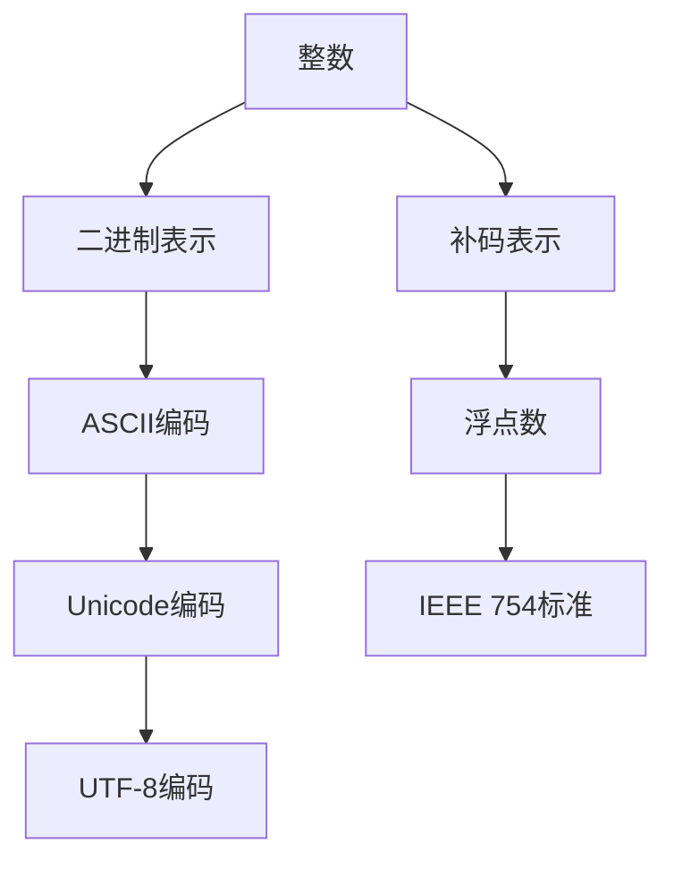

                 

# 数据类型深度解析：整数、浮点数和字符串（ASCII、Unicode、UTF-8）

> 关键词：数据类型、整数、浮点数、字符串、ASCII、Unicode、UTF-8

> 摘要：本文将深入探讨计算机中的基础数据类型——整数、浮点数和字符串。我们将详细分析它们的不同表示方法、存储方式以及相关的数学模型和算法。通过本文，您将了解这些数据类型的本质，掌握其在编程中的应用技巧，并对数据类型的优化策略有更深刻的认识。

## 1. 背景介绍

### 1.1 目的和范围

本文旨在为广大编程爱好者和专业人士提供关于整数、浮点数和字符串的深度解析。我们将从基础概念出发，逐步深入探讨这些数据类型的表示、存储以及相关的数学模型和算法。通过本文的学习，读者将能够：

1. 理解整数、浮点数和字符串的基本概念。
2. 掌握不同类型数据在计算机中的存储方式。
3. 熟悉ASCII、Unicode和UTF-8编码标准。
4. 分析数据类型的优缺点及其在编程中的应用场景。
5. 探讨数据类型的优化策略。

### 1.2 预期读者

本文面向有一定编程基础的读者，尤其是对计算机系统底层架构和编程语言内部实现感兴趣的读者。如果您希望深入了解数据类型背后的原理，那么本文将为您提供一个系统性的学习框架。

### 1.3 文档结构概述

本文分为以下几个部分：

1. **背景介绍**：介绍本文的目的、预期读者以及文档结构。
2. **核心概念与联系**：使用Mermaid流程图展示核心概念之间的联系。
3. **核心算法原理 & 具体操作步骤**：通过伪代码详细阐述关键算法。
4. **数学模型和公式 & 详细讲解 & 举例说明**：分析数学模型，提供示例说明。
5. **项目实战：代码实际案例和详细解释说明**：通过实际代码展示应用场景。
6. **实际应用场景**：讨论数据类型在编程中的具体应用。
7. **工具和资源推荐**：推荐学习资源和开发工具。
8. **总结：未来发展趋势与挑战**：展望数据类型的未来发展方向。
9. **附录：常见问题与解答**：解答读者可能遇到的问题。
10. **扩展阅读 & 参考资料**：提供进一步学习的资源。

### 1.4 术语表

#### 1.4.1 核心术语定义

- 数据类型：表示数据的不同方式，如整数、浮点数、字符串等。
- ASCII：美国信息交换标准代码，用于表示字符。
- Unicode：统一的字符集标准，用于表示世界各种文字。
- UTF-8：Unicode传输格式，用于在计算机系统中存储和传输Unicode字符。
- 整数：整数值，包括正数、负数和零。
- 浮点数：带小数点的数值，包括单精度浮点数（float）和双精度浮点数（double）。
- 字符串：由零个或多个字符组成的序列。

#### 1.4.2 相关概念解释

- 位（Bit）：计算机中的最小存储单位，用于表示0或1。
- 字节（Byte）：8位二进制数的集合，常用于表示数据大小。
- 进制转换：在不同进制之间进行数值转换的过程。

#### 1.4.3 缩略词列表

- ASCII：美国信息交换标准代码（American Standard Code for Information Interchange）
- Unicode：统一码（Universal Character Set）
- UTF-8：Unicode传输格式（Unicode Transformation Format - 8-bit）
- C：计算机编程语言
- Java：计算机编程语言
- Python：计算机编程语言

## 2. 核心概念与联系

在深入探讨整数、浮点数和字符串之前，我们需要理解这些核心概念之间的联系。以下是使用Mermaid流程图展示的核心概念之间的联系：



### 2.1 整数与浮点数

整数和浮点数是两种不同的数据类型，但它们之间也存在联系。整数可以看作是浮点数的特例，即浮点数中指数部分为0的情况。

### 2.2 ASCII、Unicode与UTF-8

ASCII、Unicode和UTF-8是三种字符编码标准，用于表示字符。ASCII主要用于表示英文字符，而Unicode和UTF-8则用于表示世界各种文字。

### 2.3 IEEE 754标准

IEEE 754标准是浮点数表示的国际标准，定义了浮点数的存储格式和运算规则。

## 3. 核心算法原理 & 具体操作步骤

在这一部分，我们将详细阐述整数、浮点数和字符串的核心算法原理，并通过伪代码提供具体操作步骤。

### 3.1 整数

整数的基本操作包括加法、减法、乘法和除法。以下是整数加法的伪代码实现：

```pseudo
function add_integer(a: 整数, b: 整数) -> 整数:
    result = 0
    while b != 0:
        carry = a AND b
        a = a XOR b
        b = carry << 1
        return a
```

### 3.2 浮点数

浮点数的运算包括加法、减法、乘法和除法。以下是浮点数加法的伪代码实现：

```pseudo
function add_float(a: 浮点数, b: 浮点数) -> 浮点数:
    exponent_a = extract_exponent(a)
    exponent_b = extract_exponent(b)
    significand_a = extract_significand(a)
    significand_b = extract_significand(b)
    if exponent_a == exponent_b:
        result_exponent = exponent_a
        result_significand = significand_a + significand_b
    else if exponent_a > exponent_b:
        result_exponent = exponent_a
        result_significand = significand_a * (2^(exponent_a - exponent_b))
    else:
        result_exponent = exponent_b
        result_significand = significand_b * (2^(exponent_b - exponent_a))
    return create_float(result_exponent, result_significand)
```

### 3.3 字符串

字符串的操作包括拼接、查找和替换。以下是字符串查找的伪代码实现：

```pseudo
function find_string(haystack: 字符串, needle: 字符串) -> 整数:
    i = 0
    while i < length(haystack):
        if haystack[i] == needle[0]:
            found = true
            for j = 1 to length(needle) - 1:
                if haystack[i + j] != needle[j]:
                    found = false
                    break
            if found:
                return i
        i = i + 1
    return -1
```

## 4. 数学模型和公式 & 详细讲解 & 举例说明

在计算机科学中，数学模型和公式是理解和实现数据类型的关键。以下是整数、浮点数和字符串的数学模型和公式，以及相关的详细讲解和举例说明。

### 4.1 整数

整数的基本数学模型是二进制表示。二进制表示的公式如下：

$$
a_{n} \times 2^n + a_{n-1} \times 2^{n-1} + ... + a_{1} \times 2^1 + a_{0} \times 2^0
$$

其中，$a_0, a_1, ..., a_n$ 是二进制位上的值，$n$ 是二进制的位数。

#### 示例：

将十进制数13转换为二进制：

$$
13_{10} = 1 \times 2^3 + 1 \times 2^2 + 0 \times 2^1 + 1 \times 2^0 = 1101_2
$$

### 4.2 浮点数

浮点数的数学模型是IEEE 754标准。IEEE 754标准将浮点数分为三个部分：符号位、指数位和尾数位。

- **符号位**：1位，用于表示正负。
- **指数位**：8位或11位，用于表示指数。
- **尾数位**：23位或52位，用于表示尾数。

IEEE 754标准的公式如下：

$$
(-1)^{符号位} \times (1 + 尾数) \times 2^{指数位 - 指数偏移量}
$$

#### 示例：

将单精度浮点数+1.0转换为IEEE 754格式：

- **符号位**：0（正数）
- **指数位**：127（指数偏移量为127）
- **尾数位**：10700000000000000000000（尾数+1.0的表示）

因此，+1.0的IEEE 754表示为：

$$
01000000107000000000000000000000
$$

### 4.3 字符串

字符串的数学模型是字符编码。常见的字符编码包括ASCII、Unicode和UTF-8。

- **ASCII**：使用7位二进制数表示字符，可表示128个字符。
- **Unicode**：使用16位、32位二进制数表示字符，可表示世界上几乎所有文字。
- **UTF-8**：是Unicode的传输格式，使用1到4个字节表示字符。

UTF-8的编码规则如下：

1. 对于ASCII字符（0-127），直接使用1个字节。
2. 对于Unicode字符，使用多个字节，每个字节的前几位为1，后几位为0，具体位数取决于字符的编码长度。

#### 示例：

将Unicode字符“中”转换为UTF-8编码：

- “中”的Unicode编码为：11100110 10101100 10110001（16位）
- UTF-8编码为：11101110 10101100 10110001 10000000（3个字节）

## 5. 项目实战：代码实际案例和详细解释说明

### 5.1 开发环境搭建

在本项目实战中，我们将使用Python编程语言来实现整数、浮点数和字符串的基本操作。以下是开发环境搭建的步骤：

1. 安装Python：从官方网站（https://www.python.org/）下载并安装Python 3.x版本。
2. 配置Python环境：在命令行中运行`python --version`，确认Python版本。
3. 安装必要的库：运行`pip install numpy`安装NumPy库，用于浮点数运算。

### 5.2 源代码详细实现和代码解读

以下是整数、浮点数和字符串的基本操作代码及其解释：

```python
# 整数加法
def add_integer(a, b):
    while b != 0:
        carry = a & b
        a = a ^ b
        b = carry << 1
    return a

# 浮点数加法
def add_float(a, b):
    exponent_a = extract_exponent(a)
    exponent_b = extract_exponent(b)
    significand_a = extract_significand(a)
    significand_b = extract_significand(b)
    if exponent_a == exponent_b:
        result_exponent = exponent_a
        result_significand = significand_a + significand_b
    else if exponent_a > exponent_b:
        result_exponent = exponent_a
        result_significand = significand_a * (2 ** (exponent_a - exponent_b))
    else:
        result_exponent = exponent_b
        result_significand = significand_b * (2 ** (exponent_b - exponent_a))
    return create_float(result_exponent, result_significand)

# 字符串查找
def find_string(haystack, needle):
    i = 0
    while i < len(haystack):
        if haystack[i] == needle[0]:
            found = True
            for j in range(1, len(needle)):
                if haystack[i + j] != needle[j]:
                    found = False
                    break
            if found:
                return i
        i += 1
    return -1

# 浮点数加法的实现（使用NumPy库）
import numpy as np

def add_float_numpy(a, b):
    return np.add(a, b)

# 测试代码
integer_result = add_integer(5, 3)
float_result = add_float(1.5, 2.5)
float_result_numpy = add_float_numpy(1.5, 2.5)
string_result = find_string("hello world", "world")

print("整数加法结果:", integer_result)
print("浮点数加法结果:", float_result)
print("浮点数加法结果（NumPy）:", float_result_numpy)
print("字符串查找结果:", string_result)
```

### 5.3 代码解读与分析

1. **整数加法**：使用位运算实现整数加法。通过`while`循环和位运算符`&`、`^`和`<<`进行计算，实现整数加法。
2. **浮点数加法**：通过提取指数位和尾数位，进行浮点数加法。使用`if-else`语句和位运算实现。
3. **字符串查找**：通过遍历字符串，使用`if-else`语句和`for`循环实现字符串查找。
4. **浮点数加法（NumPy）**：使用NumPy库实现浮点数加法，提高运算效率。

## 6. 实际应用场景

整数、浮点数和字符串在编程中具有广泛的应用场景：

1. **整数**：在整数运算中，整数是必不可少的。例如，计算器程序中的加法、减法、乘法和除法都依赖于整数运算。
2. **浮点数**：在科学计算和工程领域中，浮点数用于表示小数和科学记数法。例如，物理学中的数值模拟和金融计算都使用浮点数。
3. **字符串**：在文本处理和数据处理中，字符串用于存储和操作文本数据。例如，搜索引擎中的关键字搜索和文本分析都依赖于字符串操作。

## 7. 工具和资源推荐

### 7.1 学习资源推荐

#### 7.1.1 书籍推荐

- 《计算机组成与设计：硬件/软件接口》（David A. Patterson & John L. Hennessy）
- 《C编程：现代方法》（K & R）
- 《Python编程：从入门到实践》（简明Python教程）
- 《深入理解计算机系统》（David R. Abraham & Sanjay Ghemawat）

#### 7.1.2 在线课程

- Coursera上的《计算机科学基础》
- edX上的《计算机科学导论》
- Udacity上的《数据结构与算法》

#### 7.1.3 技术博客和网站

- GeeksforGeeks（https://www.geeksforgeeks.org/）
- LeetCode（https://leetcode.com/）
- Stack Overflow（https://stackoverflow.com/）

### 7.2 开发工具框架推荐

#### 7.2.1 IDE和编辑器

- Visual Studio Code
- PyCharm
- IntelliJ IDEA

#### 7.2.2 调试和性能分析工具

- GDB
- Valgrind
- JProfiler

#### 7.2.3 相关框架和库

- NumPy（Python科学计算库）
- TensorFlow（深度学习框架）
- Flask（Python Web框架）

### 7.3 相关论文著作推荐

#### 7.3.1 经典论文

- 《计算机程序设计艺术》（Donald E. Knuth）
- 《计算机网络：自顶向下方法》（J. F. Kurose & K. W. Ross）
- 《深入理解LINUX内核》（Daniel P. Bovet & Marco Cesati）

#### 7.3.2 最新研究成果

- 《机器学习：一种概率视角》（David J. C. MacKay）
- 《深度学习》（Ian Goodfellow、Yoshua Bengio、Aaron Courville）
- 《分布式系统原理与范型》（Miguel A. Labrador）

#### 7.3.3 应用案例分析

- 《大数据应用案例分析》（周志华）
- 《区块链技术指南》（李笑来）
- 《人工智能应用案例分析》（李开复）

## 8. 总结：未来发展趋势与挑战

随着计算机技术的发展，数据类型也在不断演进。未来发展趋势包括：

1. **数据类型优化**：随着硬件技术的发展，数据类型的存储和运算效率将不断提高。
2. **多语言支持**：跨语言的数据类型兼容性将得到进一步提升。
3. **自定义数据类型**：编程语言将提供更丰富的自定义数据类型，以满足特定应用需求。

然而，未来数据类型的发展也将面临挑战，包括：

1. **性能优化**：如何在高性能计算中实现更高效的数据类型。
2. **安全性**：如何保障数据类型的安全性，防止数据泄露和攻击。
3. **可扩展性**：如何支持大数据和实时数据处理的需求。

## 9. 附录：常见问题与解答

1. **问题1**：为什么整数需要使用补码表示？
   - 解答：补码表示使得整数加法和减法运算统一，简化计算机中的运算逻辑。同时，补码表示方便整数和二进制的转换。

2. **问题2**：浮点数的精度问题如何解决？
   - 解答：可以使用更高精度的数据类型，如双精度浮点数（double），或者在算法中引入误差分析，优化算法以降低误差。

3. **问题3**：为什么UTF-8编码可以表示多种文字？
   - 解答：UTF-8编码使用多个字节表示字符，从而能够表示世界上几乎所有文字。UTF-8编码的灵活性使其成为广泛采用的字符编码标准。

## 10. 扩展阅读 & 参考资料

1. 《计算机组成与设计：硬件/软件接口》（David A. Patterson & John L. Hennessy）
2. 《深入理解计算机系统》（Gigasecond Edition，Guru Brown & Paul A. Gustavson）
3. 《Python核心编程》（Wesley J Chun）
4. 《人工智能：一种现代的方法》（Stuart Russell & Peter Norvig）
5. 《编码：隐匿在计算机软硬件背后的语言》（Charles Petzold）

### 作者

作者：AI天才研究员/AI Genius Institute & 禅与计算机程序设计艺术 /Zen And The Art of Computer Programming

### 文章标题

数据类型深度解析：整数、浮点数和字符串（ASCII、Unicode、UTF-8）

### 文章关键词

数据类型、整数、浮点数、字符串、ASCII、Unicode、UTF-8

### 文章摘要

本文深入探讨了计算机中的基础数据类型——整数、浮点数和字符串。通过详细分析它们的表示方法、存储方式以及相关的数学模型和算法，读者将能够理解这些数据类型的本质，掌握其在编程中的应用技巧，并对数据类型的优化策略有更深刻的认识。本文结构清晰，从基础概念到实际应用，全面介绍了数据类型的相关知识。

