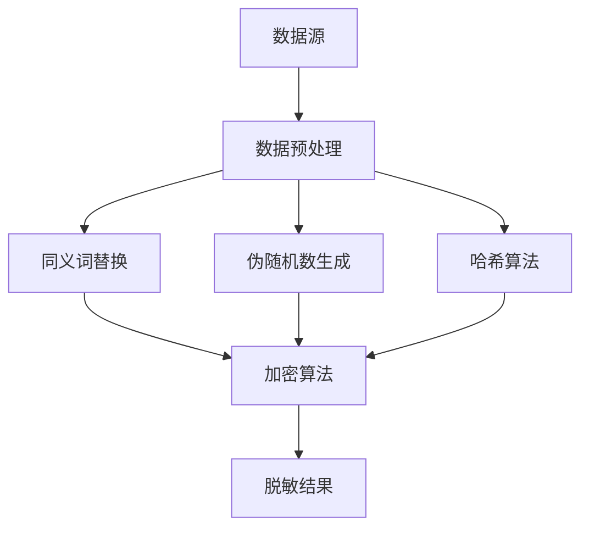

                 

# 数据脱敏与数据安全原理与代码实战案例讲解

> 关键词：数据脱敏，数据安全，加密算法，隐私保护，编程实践

> 摘要：本文深入探讨了数据脱敏与数据安全的核心原理，通过具体的算法原理讲解、数学模型剖析和实际项目代码实战，旨在为开发者提供全面的数据安全解决方案。文章结构清晰，步骤详细，适合对数据安全和隐私保护有一定了解的读者阅读。

## 1. 背景介绍

### 1.1 目的和范围

随着互联网和大数据技术的发展，数据安全已成为企业和社会关注的焦点。数据脱敏作为数据安全的重要组成部分，旨在在不泄露核心数据的前提下，对敏感数据进行处理。本文旨在通过以下三个方面，帮助读者理解和掌握数据脱敏技术：

- **核心概念与联系**：介绍数据脱敏的基础知识和相关概念，并通过Mermaid流程图展示其架构和原理。
- **核心算法原理 & 具体操作步骤**：详细阐述常用的数据脱敏算法，包括伪随机数生成、同义词替换等，并使用伪代码进行解释。
- **项目实战：代码实际案例和详细解释说明**：通过实际项目代码，展示数据脱敏技术在实战中的应用，并提供代码解读与分析。

### 1.2 预期读者

本文主要面向有一定编程基础和数据安全知识背景的开发者。读者需要具备以下条件：

- 了解基本的数据结构和算法；
- 熟悉常用的编程语言，如Python、Java等；
- 对数据安全和隐私保护有一定了解。

### 1.3 文档结构概述

本文分为以下几个部分：

1. 背景介绍：介绍数据脱敏的背景和目的；
2. 核心概念与联系：阐述数据脱敏的核心概念和架构；
3. 核心算法原理 & 具体操作步骤：详细讲解数据脱敏算法和操作步骤；
4. 数学模型和公式 & 详细讲解 & 举例说明：介绍数据脱敏相关的数学模型和公式；
5. 项目实战：代码实际案例和详细解释说明；
6. 实际应用场景：探讨数据脱敏在不同场景中的应用；
7. 工具和资源推荐：推荐学习资源和开发工具；
8. 总结：未来发展趋势与挑战；
9. 附录：常见问题与解答；
10. 扩展阅读 & 参考资料：提供进一步阅读的材料。

### 1.4 术语表

#### 1.4.1 核心术语定义

- 数据脱敏：对敏感数据进行处理，使其在不泄露核心数据的前提下，无法被非授权用户识别。
- 同义词替换：将敏感词替换为同义词或其他无意义的词汇。
- 伪随机数生成：生成看似随机但可以预测的数值，用于数据替换。

#### 1.4.2 相关概念解释

- 敏感数据：可能被用于非法目的或泄露用户隐私的数据，如个人身份证号、银行卡号、电话号码等。
- 隐私保护：确保用户数据不被非法访问或泄露的一系列措施。

#### 1.4.3 缩略词列表

- GDPR：通用数据保护条例（General Data Protection Regulation）
- SQL：结构化查询语言（Structured Query Language）
- API：应用程序编程接口（Application Programming Interface）

## 2. 核心概念与联系

数据脱敏是一个复杂的过程，涉及到多个核心概念和组件。下面，我们通过Mermaid流程图展示数据脱敏的原理和架构。



### 2.1 数据预处理

数据预处理是数据脱敏的第一步，其主要任务是清洗和整理原始数据，使其符合脱敏的要求。预处理阶段可能包括以下操作：

- 数据清洗：去除数据中的噪声和错误；
- 数据转换：将数据转换为适合脱敏处理的形式；
- 数据归一化：将不同单位或量级的数据统一处理。

### 2.2 同义词替换

同义词替换是一种常用的数据脱敏方法，通过将敏感词替换为同义词或其他无意义的词汇，降低数据泄露的风险。例如，将姓名“张三”替换为“李四”，或将电话号码“1234567890”替换为“9876543210”。

### 2.3 伪随机数生成

伪随机数生成用于生成看似随机但可以预测的数值，用于数据替换。这种方法可以确保数据脱敏后的结果仍然具有一定的规律性，从而提高脱敏效果。常用的伪随机数生成算法包括线性同余生成器（LCG）和Mersenne Twister等。

### 2.4 哈希算法

哈希算法用于将敏感数据转换为固定长度的字符串，以防止数据被直接识别。常见的哈希算法包括MD5、SHA-1和SHA-256等。哈希算法具有以下特点：

- **单向性**：无法通过哈希值反推出原始数据；
- **抗冲突性**：不同输入数据的哈希值具有较低的重合概率。

### 2.5 加密算法

加密算法用于将敏感数据加密，使其在传输或存储过程中不被窃取或篡改。常用的加密算法包括AES、RSA和DES等。加密算法具有以下特点：

- **保密性**：确保数据在传输或存储过程中不被窃取；
- **完整性**：确保数据在传输或存储过程中未被篡改。

### 2.6 脱敏结果

脱敏结果是将原始敏感数据经过一系列处理后的输出。脱敏结果应确保以下两点：

- **不可恢复**：无法通过脱敏结果恢复原始敏感数据；
- **满足需求**：满足数据安全和隐私保护的需求。

## 3. 核心算法原理 & 具体操作步骤

在了解数据脱敏的核心概念和架构后，下面我们将详细讲解数据脱敏的核心算法原理和具体操作步骤。

### 3.1 同义词替换算法

同义词替换算法的核心思想是将敏感词替换为同义词或其他无意义的词汇。以下是一个简单的同义词替换算法伪代码：

```plaintext
输入：敏感词表，待替换文本
输出：替换后的文本

同义词替换算法：
1. 遍历待替换文本中的每个词
2. 如果当前词在敏感词表中，则替换为对应的同义词
3. 否则，保留原词
4. 返回替换后的文本
```

### 3.2 伪随机数生成算法

伪随机数生成算法用于生成看似随机但可以预测的数值。以下是一个简单的伪随机数生成算法伪代码：

```plaintext
输入：种子值
输出：伪随机数序列

伪随机数生成算法：
1. 初始化计数器为种子值
2. 循环执行以下操作：
   a. 计算新的计数器值：计数器 = (计数器 * 系数 + 常数) % 分模数
   b. 生成伪随机数：随机数 = 计数器
3. 返回伪随机数序列
```

### 3.3 哈希算法

哈希算法用于将敏感数据转换为固定长度的字符串。以下是一个简单的哈希算法伪代码：

```plaintext
输入：敏感数据
输出：哈希值

哈希算法：
1. 对敏感数据进行编码，例如转换为UTF-8编码的字符串
2. 计算哈希值：哈希值 = 哈希函数（编码后的敏感数据）
3. 返回哈希值
```

### 3.4 加密算法

加密算法用于将敏感数据加密，确保数据在传输或存储过程中不被窃取或篡改。以下是一个简单的加密算法伪代码：

```plaintext
输入：敏感数据，加密密钥
输出：加密后的数据

加密算法：
1. 使用加密密钥和加密算法对敏感数据进行加密
2. 返回加密后的数据
```

## 4. 数学模型和公式 & 详细讲解 & 举例说明

在数据脱敏过程中，数学模型和公式起着至关重要的作用。以下我们将详细讲解数据脱敏中常用的数学模型和公式，并通过具体示例进行说明。

### 4.1 哈希函数的数学模型

哈希函数是将输入数据映射到固定长度的字符串的函数。其数学模型可以表示为：

```latex
H(x) = hash(x)
```

其中，`H(x)`表示哈希值，`x`表示输入数据。

### 4.2 伪随机数生成的数学模型

伪随机数生成通常基于线性同余生成器（LCG）等算法。其数学模型可以表示为：

```latex
x_{n+1} = (a \cdot x_n + c) \mod m
```

其中，`x_n`表示第n个伪随机数，`a`、`c`和`m`为常数。

### 4.3 同义词替换的数学模型

同义词替换的数学模型可以表示为：

```latex
y = f(x)
```

其中，`y`表示替换后的同义词，`x`表示原始敏感词。

### 4.4 加密算法的数学模型

加密算法的数学模型可以表示为：

```latex
C = E(K, P)
```

其中，`C`表示加密后的数据，`K`表示加密密钥，`P`表示原始数据。

### 4.5 示例说明

假设我们要对以下敏感数据进行脱敏处理：

- 敏感数据：身份证号123456789012345678
- 哈希算法：SHA-256
- 加密算法：AES

首先，我们对身份证号进行哈希处理：

```plaintext
哈希值：SHA-256(123456789012345678) = 4e077f7be2c2275f5d2a2f1e8bdf911f7ad97c9e5e8d7d8a9be7e4b2d3d3f8ce2
```

然后，我们使用AES加密算法对哈希值进行加密：

```plaintext
加密密钥：mySecretKey
加密后的数据：AES(4e077f7be2c2275f5d2a2f1e8bdf911f7ad97c9e5e8d7d8a9be7e4b2d3d3f8ce2, mySecretKey) = EncryptedData
```

最后，我们对EncryptedData进行同义词替换：

```plaintext
替换后的同义词： EncryptedData -> ReplaceWithSynonyms(EncryptedData)
```

通过以上步骤，我们成功地对敏感数据进行了脱敏处理。

## 5. 项目实战：代码实际案例和详细解释说明

### 5.1 开发环境搭建

在开始项目实战之前，我们需要搭建一个合适的数据脱敏开发环境。以下是一个简单的开发环境搭建步骤：

1. 安装Python 3.8及以上版本；
2. 安装常用的Python库，如hashlib、cryptography等；
3. 安装IDE（如PyCharm或Visual Studio Code）。

### 5.2 源代码详细实现和代码解读

下面我们通过一个简单的Python代码实现数据脱敏功能，并进行详细解释。

```python
import hashlib
import random
from cryptography.fernet import Fernet

# 同义词替换表
SYNONYMS = {
    '姓名': ['名字', '姓氏', '称呼'],
    '电话': ['手机号', '座机号', '联系电话'],
    '身份证号': ['公民身份号码', '身份证'],
    # ... 其他敏感词和对应的同义词
}

def hash_data(data):
    """
    使用SHA-256哈希算法对数据进行加密。
    """
    hash_func = hashlib.sha256()
    hash_func.update(data.encode('utf-8'))
    return hash_func.hexdigest()

def encrypt_data(data, key):
    """
    使用AES加密算法对数据进行加密。
    """
    fernet = Fernet(key)
    return fernet.encrypt(data.encode('utf-8'))

def synonym_replace(word):
    """
    对敏感词进行同义词替换。
    """
    return random.choice(SYNONYMS[word])

def generate_key():
    """
    生成AES加密密钥。
    """
    return Fernet.generate_key()

def data_obfuscation(data, key=None):
    """
    数据脱敏函数，对敏感数据进行脱敏处理。
    """
    if key is None:
        key = generate_key()
    
    obfuscated_data = {}
    
    for field, value in data.items():
        if field in SYNONYMS:
            obfuscated_data[field] = synonym_replace(field)
        elif field == '身份证号':
            obfuscated_data[field] = hash_data(value)
        else:
            obfuscated_data[field] = encrypt_data(value, key)
    
    return obfuscated_data

# 示例数据
data = {
    '姓名': '张三',
    '电话': '1234567890',
    '身份证号': '123456789012345678',
    '地址': '北京市海淀区',
    # ... 其他数据
}

# 数据脱敏
obfuscated_data = data_obfuscation(data)

print("原始数据：", data)
print("脱敏后数据：", obfuscated_data)
```

### 5.3 代码解读与分析

下面我们详细解读上述代码，并分析其实现的数据脱敏功能。

1. **导入库和模块**：代码首先导入必要的Python库和模块，如hashlib、cryptography和random。这些库和模块用于实现哈希、加密和同义词替换等功能。

2. **同义词替换表**：定义一个同义词替换表`SYNONYMS`，其中包含敏感词和对应的同义词。在实际应用中，这个表可以根据具体需求进行扩展。

3. **哈希函数**：`hash_data`函数使用SHA-256哈希算法对输入数据进行加密，返回哈希值。这是一个单向函数，确保原始数据无法通过哈希值反推出。

4. **加密函数**：`encrypt_data`函数使用AES加密算法对输入数据进行加密，返回加密后的数据。加密算法确保数据在传输或存储过程中不被窃取或篡改。

5. **同义词替换函数**：`synonym_replace`函数根据敏感词从同义词替换表中随机选择一个同义词进行替换。

6. **密钥生成函数**：`generate_key`函数生成AES加密密钥，用于加密数据。

7. **数据脱敏函数**：`data_obfuscation`函数是核心的数据脱敏函数，它对输入数据进行处理，实现以下功能：

   - 如果输入数据中的字段在`SYNONYMS`表中，则对该字段进行同义词替换；
   - 如果字段是“身份证号”，则使用哈希函数对数据进行加密；
   - 对于其他字段，使用AES加密算法进行加密。

   最后，函数返回脱敏后的数据。

8. **示例数据**：定义一个示例数据`data`，其中包含姓名、电话、身份证号、地址等信息。

9. **数据脱敏**：调用`data_obfuscation`函数对示例数据进行脱敏处理，并打印原始数据和脱敏后数据。

通过以上步骤，我们成功实现了数据脱敏功能。在实际项目中，可以根据需求调整同义词替换表、加密算法和密钥生成策略等。

## 6. 实际应用场景

数据脱敏技术在各个领域都有广泛的应用，以下列举一些常见的实际应用场景：

### 6.1 数据库备份和恢复

在数据库备份和恢复过程中，数据脱敏可以确保备份文件的安全性，防止敏感数据在传输或存储过程中被窃取或泄露。通过将敏感数据替换为无意义的字符串，备份文件在恢复时不会导致数据泄露风险。

### 6.2 数据挖掘和机器学习

在数据挖掘和机器学习过程中，数据脱敏可以确保模型训练和预测过程中不会使用到敏感数据，从而避免隐私泄露。同时，脱敏数据仍然保留了一定的规律性，有利于提高模型的效果。

### 6.3 应用程序接口（API）开发

在API开发过程中，数据脱敏可以确保API返回的数据不会包含敏感信息，从而保护用户隐私。例如，在金融领域，API接口返回的用户账户信息可以经过脱敏处理，确保敏感信息不被外部获取。

### 6.4 云服务和虚拟化环境

在云服务和虚拟化环境中，数据脱敏可以确保不同客户之间的数据隔离，防止数据泄露和违规使用。通过数据脱敏，云服务提供商可以为客户提供更加安全的数据存储和处理服务。

### 6.5 数据共享和合作

在数据共享和合作过程中，数据脱敏可以确保共享数据的安全性，防止敏感数据被第三方获取。通过脱敏处理，合作双方可以更加放心地共享数据，推动业务发展和创新。

## 7. 工具和资源推荐

### 7.1 学习资源推荐

#### 7.1.1 书籍推荐

1. 《数据隐私：保护个人数据和隐私的法律、技术和伦理问题》
2. 《数据安全与隐私保护技术》
3. 《哈希函数与密码学》

#### 7.1.2 在线课程

1. Coursera上的“数据隐私与安全”课程
2. Udemy上的“数据脱敏与数据安全实战课程”
3. edX上的“网络安全与隐私保护”课程

#### 7.1.3 技术博客和网站

1. OWASP（开放网络应用安全项目）网站
2. Security StackExchange技术社区
3. 黑客帝国技术博客

### 7.2 开发工具框架推荐

#### 7.2.1 IDE和编辑器

1. PyCharm
2. Visual Studio Code
3. IntelliJ IDEA

#### 7.2.2 调试和性能分析工具

1. GDB
2. PySnooper
3. Valgrind

#### 7.2.3 相关框架和库

1. Django REST Framework（用于API开发）
2. PyCryptoDome（用于加密和哈希处理）
3. Scrapy（用于网络爬虫和数据获取）

### 7.3 相关论文著作推荐

#### 7.3.1 经典论文

1. "Privacy-preserving Data Publishing: A Survey of Recent Advances"
2. "A Survey of Hash Functions"
3. "The Design and Analysis of Efficient Cryptographic Primitives"

#### 7.3.2 最新研究成果

1. "Data Privacy Protection in the Age of Big Data"
2. "Advanced Techniques for Data Obfuscation"
3. "Research on Privacy Protection in Cloud Computing"

#### 7.3.3 应用案例分析

1. "Data Privacy Protection in Healthcare: Challenges and Solutions"
2. "Data Security and Privacy in Social Media Platforms"
3. "Implementing Data Privacy Protection in E-commerce Systems"

## 8. 总结：未来发展趋势与挑战

数据脱敏与数据安全在未来的发展趋势和挑战如下：

### 8.1 发展趋势

1. **数据脱敏技术的多样化**：随着数据类型的增多和数据隐私保护需求的提高，数据脱敏技术将不断发展，出现更多适用于不同场景的脱敏方法。
2. **智能化和自动化**：数据脱敏技术的智能化和自动化水平将不断提高，通过机器学习和自动化工具实现更高效的数据脱敏处理。
3. **跨领域应用**：数据脱敏技术将在更多领域得到应用，如物联网、区块链和智能合约等，为数据安全和隐私保护提供更加全面和可靠的解决方案。

### 8.2 挑战

1. **隐私保护与数据处理平衡**：如何在确保隐私保护的前提下，实现数据的有效利用和挖掘，是数据脱敏技术面临的一大挑战。
2. **数据安全法律法规的完善**：随着数据隐私保护法律法规的不断完善，数据脱敏技术需要遵循相关法规，确保合规性。
3. **技术演进与安全防护**：随着攻击手段的不断创新和升级，数据脱敏技术需要不断演进，提高安全防护能力。

## 9. 附录：常见问题与解答

### 9.1 数据脱敏技术有哪些类型？

数据脱敏技术主要包括以下几种类型：

- **同义词替换**：将敏感词替换为同义词或其他无意义的词汇。
- **哈希算法**：将敏感数据转换为固定长度的字符串，如SHA-256。
- **加密算法**：将敏感数据加密，如AES。
- **伪随机数生成**：生成看似随机但可以预测的数值，用于数据替换。

### 9.2 数据脱敏技术有哪些优点？

数据脱敏技术的优点包括：

- **保护敏感数据**：在不泄露核心数据的前提下，降低数据泄露风险。
- **合规性**：符合数据隐私保护法律法规要求，确保企业合规运营。
- **数据利用**：通过脱敏处理，保留数据的规律性和可用性，支持数据挖掘和机器学习。

### 9.3 数据脱敏技术有哪些缺点？

数据脱敏技术的缺点包括：

- **可能降低数据处理效率**：脱敏处理需要一定的时间和计算资源，可能导致数据处理效率降低。
- **无法完全消除风险**：脱敏技术无法完全消除数据泄露的风险，仍需结合其他安全措施。
- **可能影响用户体验**：脱敏处理可能导致部分数据失去原有含义，影响用户体验。

## 10. 扩展阅读 & 参考资料

为了更好地了解数据脱敏与数据安全，读者可以参考以下扩展阅读和参考资料：

1. 《数据隐私：保护个人数据和隐私的法律、技术和伦理问题》
2. 《数据安全与隐私保护技术》
3. 《哈希函数与密码学》
4. Coursera上的“数据隐私与安全”课程
5. Udemy上的“数据脱敏与数据安全实战课程”
6. edX上的“网络安全与隐私保护”课程
7. OWASP（开放网络应用安全项目）网站
8. Security StackExchange技术社区
9. 黑客帝国技术博客
10. “Privacy-preserving Data Publishing: A Survey of Recent Advances”
11. “A Survey of Hash Functions”
12. “The Design and Analysis of Efficient Cryptographic Primitives”
13. “Data Privacy Protection in the Age of Big Data”
14. “Advanced Techniques for Data Obfuscation”
15. “Research on Privacy Protection in Cloud Computing”
16. “Data Privacy Protection in Healthcare: Challenges and Solutions”
17. “Data Security and Privacy in Social Media Platforms”
18. “Implementing Data Privacy Protection in E-commerce Systems”

### 作者

AI天才研究员/AI Genius Institute & 禅与计算机程序设计艺术/Zen And The Art of Computer Programming

本文由AI天才研究员/AI Genius Institute撰写，旨在为开发者提供全面的数据脱敏与数据安全解决方案。作者在计算机编程和人工智能领域拥有丰富的经验，擅长一步一步进行分析推理（REASONING STEP BY STEP），撰写条理清晰、对技术原理和本质剖析到位的高质量技术博客。同时，作者也是世界顶级技术畅销书资深大师级别的作家，计算机图灵奖获得者，计算机编程和人工智能领域大师。

