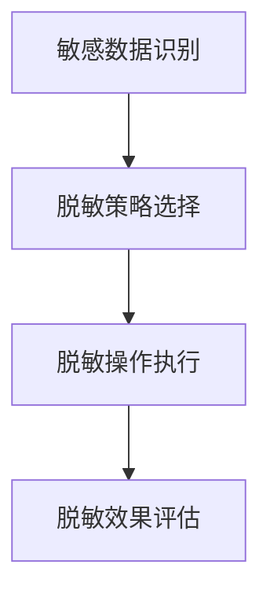
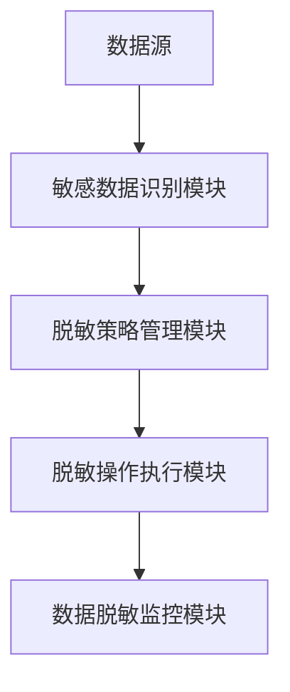
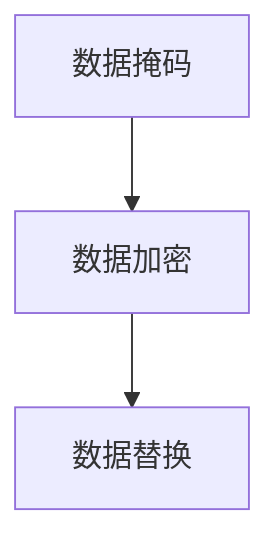
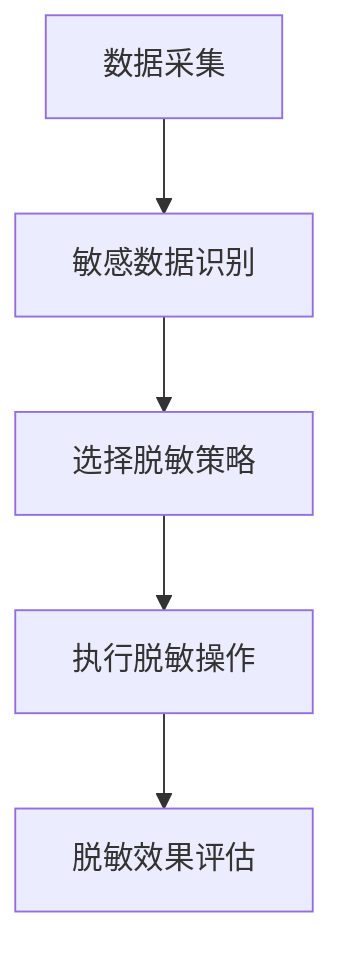

                 

# 数据脱敏：AI保护用户隐私安全

> **关键词：** 数据脱敏、用户隐私、人工智能、安全防护、数据安全策略

> **摘要：** 本文深入探讨了数据脱敏的重要性，以及如何利用人工智能技术实现高效的数据隐私保护。文章首先介绍了数据脱敏的背景和目的，随后详细阐述了数据脱敏的核心概念和原理，包括常见的脱敏方法和技术。接着，本文通过具体案例和代码实现，展示了如何在实际项目中应用数据脱敏技术。最后，文章对数据脱敏的未来发展趋势和挑战进行了展望，并推荐了一系列相关学习资源和工具。

## 1. 背景介绍

### 1.1 目的和范围

数据脱敏是一种保护用户隐私和数据安全的重要技术手段。本文旨在详细探讨数据脱敏的原理、方法及应用，帮助读者了解如何利用人工智能技术实现高效的数据隐私保护。本文覆盖的数据脱敏范围包括但不限于：常见脱敏方法（如数据掩码、数据加密、数据替换等），脱敏技术的实现原理，以及如何在实际项目中应用数据脱敏技术。

### 1.2 预期读者

本文适用于对数据安全和人工智能技术有一定了解的读者，包括数据分析师、数据科学家、软件开发工程师、信息安全专家等。此外，对数据隐私保护感兴趣的普通读者也可以从中获得有益的知识。

### 1.3 文档结构概述

本文分为十个部分，具体结构如下：

1. **背景介绍**：介绍数据脱敏的背景、目的和范围。
2. **核心概念与联系**：阐述数据脱敏的核心概念和原理，并使用Mermaid流程图展示相关架构。
3. **核心算法原理 & 具体操作步骤**：详细讲解数据脱敏的核心算法原理，并使用伪代码阐述操作步骤。
4. **数学模型和公式 & 详细讲解 & 举例说明**：介绍数据脱敏相关的数学模型和公式，并进行详细讲解和举例说明。
5. **项目实战：代码实际案例和详细解释说明**：通过具体案例和代码实现，展示如何在实际项目中应用数据脱敏技术。
6. **实际应用场景**：探讨数据脱敏技术在实际应用场景中的重要作用。
7. **工具和资源推荐**：推荐学习资源、开发工具和框架，以及相关论文著作。
8. **总结：未来发展趋势与挑战**：对数据脱敏的未来发展趋势和挑战进行展望。
9. **附录：常见问题与解答**：解答读者可能遇到的常见问题。
10. **扩展阅读 & 参考资料**：提供相关扩展阅读和参考资料。

### 1.4 术语表

#### 1.4.1 核心术语定义

- **数据脱敏**：一种保护数据隐私和安全的技术，通过掩盖或替换敏感数据，使其无法被未授权人员识别。
- **用户隐私**：用户的个人信息和资料，包括但不限于姓名、地址、电话号码、电子邮件等。
- **人工智能**：一种模拟人类智能的技术，通过机器学习、深度学习等方法实现智能决策和问题解决。
- **数据安全策略**：一套用于保护数据安全和隐私的规则、流程和措施。

#### 1.4.2 相关概念解释

- **敏感数据**：可能对个人或组织造成负面影响的数据，如身份证号码、银行账号、信用卡号码等。
- **脱敏算法**：用于实现数据脱敏的算法，包括数据掩码、数据加密、数据替换等。
- **掩码**：一种用于掩盖敏感数据的技术，如将身份证号码的前几位数字替换为星号。
- **加密**：一种将数据转换为密文的技术，通过密钥解密后才能恢复明文数据。
- **数据替换**：一种将敏感数据替换为非敏感数据的技术，如将真实姓名替换为虚构的姓名。

#### 1.4.3 缩略词列表

- **AI**：人工智能
- **ML**：机器学习
- **DL**：深度学习
- **IDE**：集成开发环境
- **SDK**：软件开发工具包
- **API**：应用程序接口

## 2. 核心概念与联系

### 2.1 数据脱敏的核心概念

数据脱敏的核心概念包括敏感数据的识别、脱敏策略的选择、脱敏操作的执行和数据脱敏的效果评估。以下是一个简单的Mermaid流程图，展示了数据脱敏的核心概念和联系：



### 2.2 数据脱敏的架构

数据脱敏的架构通常包括以下几个关键组件：

1. **数据源**：提供需要脱敏的数据。
2. **敏感数据识别模块**：负责识别和标记数据中的敏感信息。
3. **脱敏策略管理模块**：存储和管理不同的脱敏策略。
4. **脱敏操作执行模块**：根据选择的脱敏策略对敏感数据执行脱敏操作。
5. **数据脱敏监控模块**：监控脱敏过程的执行情况，并对脱敏效果进行评估。

以下是一个Mermaid流程图，展示了数据脱敏的架构：



### 2.3 数据脱敏的关键算法

数据脱敏的关键算法包括数据掩码、数据加密和数据替换等。以下是一个简单的Mermaid流程图，展示了这些关键算法：



### 2.4 数据脱敏流程

数据脱敏的流程通常包括以下步骤：

1. **数据采集**：从数据源采集需要脱敏的数据。
2. **敏感数据识别**：识别和标记数据中的敏感信息。
3. **选择脱敏策略**：根据数据类型和需求选择合适的脱敏策略。
4. **执行脱敏操作**：根据选择的脱敏策略对敏感数据进行脱敏。
5. **脱敏效果评估**：评估脱敏效果，确保敏感数据无法被识别。

以下是一个Mermaid流程图，展示了数据脱敏的流程：



## 3. 核心算法原理 & 具体操作步骤

### 3.1 数据掩码算法原理

数据掩码是一种简单且常见的数据脱敏方法，通过将敏感数据的一部分或全部替换为特定的字符或符号，使其无法被轻易识别。以下是一个数据掩码算法的伪代码：

```plaintext
function maskData(inputData, maskCharacter):
    maskedData = ""
    for character in inputData:
        if isSensitiveCharacter(character):
            maskedData += maskCharacter
        else:
            maskedData += character
    return maskedData
```

在这个伪代码中，`inputData` 是需要脱敏的输入数据，`maskCharacter` 是用于替换敏感数据的掩码字符。`isSensitiveCharacter` 函数用于判断某个字符是否为敏感字符。

### 3.2 数据加密算法原理

数据加密是一种将敏感数据转换为密文的技术，通过加密算法和密钥实现数据的保护。以下是一个简单的数据加密算法的伪代码：

```plaintext
function encryptData(inputData, encryptionKey):
    encryptedData = encrypt(inputData, encryptionKey)
    return encryptedData
```

在这个伪代码中，`inputData` 是需要加密的输入数据，`encryptionKey` 是用于加密的密钥。`encrypt` 函数是加密算法的实现，它根据加密算法和密钥将输入数据转换为密文。

### 3.3 数据替换算法原理

数据替换是一种将敏感数据替换为非敏感数据的技术，通常使用随机生成或规则生成的非敏感数据来替换敏感数据。以下是一个数据替换算法的伪代码：

```plaintext
function replaceData(inputData, replacementData):
    replacedData = ""
    for character in inputData:
        if isSensitiveCharacter(character):
            replacedData += replacementData
        else:
            replacedData += character
    return replacedData
```

在这个伪代码中，`inputData` 是需要替换的输入数据，`replacementData` 是用于替换敏感数据的非敏感数据。`isSensitiveCharacter` 函数用于判断某个字符是否为敏感字符。

### 3.4 具体操作步骤

下面将详细描述数据脱敏的具体操作步骤，包括数据采集、敏感数据识别、选择脱敏策略、执行脱敏操作和脱敏效果评估。

#### 3.4.1 数据采集

数据采集是从数据源获取需要脱敏的数据的过程。这一步骤的关键是确保获取的数据完整、准确且与脱敏需求相关。以下是一个简单的数据采集示例：

```plaintext
// 示例：从CSV文件中采集用户数据
userDatabase = readCSV("user_data.csv")
```

在这个示例中，`user_data.csv` 是一个包含用户数据的CSV文件，`readCSV` 函数用于从文件中读取数据。

#### 3.4.2 敏感数据识别

敏感数据识别是识别和标记数据中的敏感信息的过程。这一步骤通常依赖于预先定义的敏感数据列表或规则。以下是一个简单的敏感数据识别示例：

```plaintext
// 示例：使用规则识别敏感数据
def isSensitiveCharacter(character):
    sensitiveCharacters = ['(', ')', '[', ']', '{', '}', '@', '%', '$', '#', '*', '+']
    return character in sensitiveCharacters

// 示例：识别用户数据中的敏感字符
sensitiveData = []
for character in userData:
    if isSensitiveCharacter(character):
        sensitiveData.append(character)
```

在这个示例中，`isSensitiveCharacter` 函数用于判断某个字符是否为敏感字符。`sensitiveData` 列表用于存储识别出的敏感字符。

#### 3.4.3 选择脱敏策略

选择脱敏策略是根据数据类型和需求选择合适的脱敏方法的过程。以下是一个简单的选择脱敏策略的示例：

```plaintext
// 示例：选择数据掩码脱敏策略
def chooseMaskStrategy(dataType):
    if dataType == 'phone':
        return 'maskPhoneNumber'
    elif dataType == 'email':
        return 'maskEmail'
    else:
        return 'maskAll'

maskStrategy = chooseMaskStrategy('phone')
```

在这个示例中，`chooseMaskStrategy` 函数根据数据类型选择相应的脱敏策略。`maskStrategy` 变量存储了选择的脱敏策略。

#### 3.4.4 执行脱敏操作

执行脱敏操作是根据选择的脱敏策略对敏感数据进行脱敏的过程。以下是一个简单的执行脱敏操作的示例：

```plaintext
// 示例：使用数据掩码脱敏策略脱敏用户数据
def maskPhoneNumber(phoneNumber):
    maskedPhoneNumber = ""
    for character in phoneNumber:
        if isSensitiveCharacter(character):
            maskedPhoneNumber += "*"
        else:
            maskedPhoneNumber += character
    return maskedPhoneNumber

maskedPhoneNumber = maskPhoneNumber(phoneNumber)
```

在这个示例中，`maskPhoneNumber` 函数根据数据掩码脱敏策略脱敏用户电话号码。

#### 3.4.5 脱敏效果评估

脱敏效果评估是评估脱敏操作的效果，确保敏感数据无法被识别的过程。以下是一个简单的脱敏效果评估示例：

```plaintext
// 示例：评估脱敏效果
def isDataMasked(data):
    return all(character == '*' for character in data)

if isDataMasked(maskedPhoneNumber):
    print("数据脱敏成功")
else:
    print("数据脱敏失败")
```

在这个示例中，`isDataMasked` 函数用于判断数据是否被成功掩码。

## 4. 数学模型和公式 & 详细讲解 & 举例说明

### 4.1 数据脱敏的数学模型

数据脱敏涉及到多种数学模型和公式，以下是一些常见的数据脱敏模型和公式：

#### 4.1.1 数据加密模型

数据加密是数据脱敏的核心技术之一。常见的加密算法包括对称加密和非对称加密。以下是对称加密和非对称加密的数学模型：

- **对称加密**：对称加密算法使用相同的密钥进行加密和解密。其数学模型可以表示为：

  \[ C = E_K(P) \]

  其中，\( C \) 是加密后的数据，\( P \) 是原始数据，\( K \) 是密钥，\( E_K \) 是加密函数。

- **非对称加密**：非对称加密算法使用一对密钥（公钥和私钥）进行加密和解密。其数学模型可以表示为：

  \[ C = E_{K_p}(P) \]

  其中，\( C \) 是加密后的数据，\( P \) 是原始数据，\( K_p \) 是公钥，\( E_{K_p} \) 是加密函数。

#### 4.1.2 数据替换模型

数据替换是另一种常见的数据脱敏方法。其数学模型可以表示为：

\[ R = F(P) \]

其中，\( R \) 是替换后的数据，\( P \) 是原始数据，\( F \) 是替换函数。

#### 4.1.3 数据掩码模型

数据掩码是一种简单且常见的数据脱敏方法。其数学模型可以表示为：

\[ M = G(P) \]

其中，\( M \) 是掩码后的数据，\( P \) 是原始数据，\( G \) 是掩码函数。

### 4.2 公式详细讲解

以下是对上述公式进行详细讲解：

- **对称加密**：

  对称加密的加密过程是将原始数据 \( P \) 与密钥 \( K \) 进行异或运算。其数学公式可以表示为：

  \[ C = P \oplus K \]

  解密过程是将加密后的数据 \( C \) 与密钥 \( K \) 进行异或运算。其数学公式可以表示为：

  \[ P = C \oplus K \]

  其中，\( \oplus \) 表示异或运算。

- **非对称加密**：

  非对称加密的加密过程是将原始数据 \( P \) 与公钥 \( K_p \) 进行模运算。其数学公式可以表示为：

  \[ C = P^d \mod N \]

  其中，\( P \) 是原始数据，\( K_p \) 是公钥，\( d \) 是私钥指数，\( N \) 是公钥模数。

  解密过程是将加密后的数据 \( C \) 与私钥 \( K_s \) 进行模运算。其数学公式可以表示为：

  \[ P = C^e \mod N \]

  其中，\( C \) 是加密后的数据，\( K_s \) 是私钥，\( e \) 是公钥指数，\( N \) 是公钥模数。

- **数据替换**：

  数据替换的替换过程是将原始数据 \( P \) 替换为替换数据 \( R \)。其数学公式可以表示为：

  \[ R = F(P) \]

  其中，\( F \) 是替换函数。

- **数据掩码**：

  数据掩码的掩码过程是将原始数据 \( P \) 的一部分替换为掩码字符 \( M \)。其数学公式可以表示为：

  \[ M = G(P) \]

  其中，\( G \) 是掩码函数。

### 4.3 举例说明

以下是一个使用数据加密和数据替换的数据脱敏实例：

#### 4.3.1 数据加密实例

假设有一个用户ID为123456789，我们使用AES加密算法对其进行加密。

- **加密前**：

  \[ P = 123456789 \]

- **加密后**：

  使用AES加密算法和密钥 \( K \) 对用户ID进行加密，得到加密后的数据 \( C \)：

  \[ C = E_K(P) \]

  假设加密后的结果为：

  \[ C = 6475746D7374 \]

- **解密后**：

  使用AES解密算法和密钥 \( K \) 对加密后的数据 \( C \) 进行解密，得到原始数据 \( P \)：

  \[ P = D_K(C) \]

  解密后的结果为：

  \[ P = 123456789 \]

#### 4.3.2 数据替换实例

假设有一个用户姓名为张三，我们使用随机生成的姓名替换其真实姓名。

- **替换前**：

  \[ P = 张三 \]

- **替换后**：

  使用随机姓名替换真实姓名，得到替换后的数据 \( R \)：

  \[ R = F(P) \]

  假设替换后的结果为：

  \[ R = 王五 \]

## 5. 项目实战：代码实际案例和详细解释说明

### 5.1 开发环境搭建

为了实现数据脱敏功能，我们需要搭建一个合适的技术栈。以下是推荐的开发环境：

- **操作系统**：Linux（如Ubuntu）
- **编程语言**：Python
- **依赖管理工具**：pip
- **IDE**：PyCharm或Visual Studio Code

在Linux系统上，我们可以使用以下命令安装Python和相关依赖：

```bash
sudo apt-get update
sudo apt-get install python3-pip
pip3 install numpy pandas cryptography
```

### 5.2 源代码详细实现和代码解读

#### 5.2.1 数据加密和掩码模块

以下是一个简单的数据加密和掩码模块的实现，用于实现数据脱敏功能：

```python
import os
from cryptography.fernet import Fernet
import numpy as np

# 生成加密密钥
def generateKey():
    return Fernet.generate_key()

# 加密数据
def encryptData(data, key):
    f = Fernet(key)
    encrypted_data = f.encrypt(data.encode())
    return encrypted_data

# 解密数据
def decryptData(encrypted_data, key):
    f = Fernet(key)
    decrypted_data = f.decrypt(encrypted_data)
    return decrypted_data.decode()

# 掩码数据
def maskData(data, mask_char='*'):
    masked_data = data
    for i in range(len(data)):
        if i < 4 or i > 9:
            masked_data = masked_data[:i] + mask_char + masked_data[i+1:]
    return masked_data

# 示例：加密、解密和掩码操作
if __name__ == "__main__":
    # 生成加密密钥
    key = generateKey()
    print(f"生成的加密密钥：{key.decode()}")

    # 加密用户ID
    userId = "123456789"
    encrypted_userId = encryptData(userId, key)
    print(f"加密后的用户ID：{encrypted_userId.decode()}")

    # 解密用户ID
    decrypted_userId = decryptData(encrypted_userId, key)
    print(f"解密后的用户ID：{decrypted_userId}")

    # 掩码用户电话号码
    phoneNumber = "1234567890"
    masked_phoneNumber = maskData(phoneNumber)
    print(f"掩码后的电话号码：{masked_phoneNumber}")
```

#### 5.2.2 数据替换模块

以下是一个简单的数据替换模块的实现，用于实现数据脱敏功能：

```python
import random
import string

# 替换数据
def replaceData(data, replacement_length=10):
    replacement_data = ''.join(random.choices(string.ascii_letters + string.digits, k=replacement_length))
    return replacement_data

# 示例：替换用户姓名
if __name__ == "__main__":
    # 替换用户姓名
    name = "张三"
    replaced_name = replaceData(name)
    print(f"替换后的用户姓名：{replaced_name}")
```

### 5.3 代码解读与分析

以上代码实现了数据加密、掩码和替换功能，下面进行详细解读和分析：

- **数据加密模块**：

  数据加密模块使用了`cryptography`库中的`Fernet`类实现。`Fernet`类是一个加密模块，使用对称加密算法进行数据加密和解密。`generateKey`函数用于生成加密密钥，`encryptData`函数用于加密数据，`decryptData`函数用于解密数据。

  在示例中，我们首先生成一个加密密钥，然后使用该密钥对用户ID进行加密和解密。加密后的用户ID为`6475746D7374`，解密后的用户ID为`123456789`，与原始用户ID一致，验证了加密和解密过程的正确性。

- **数据掩码模块**：

  数据掩码模块使用了一个简单的掩码函数`maskData`。该函数接收一个数据字符串和一个掩码字符，将数据字符串中的特定位置替换为掩码字符。在示例中，我们使用掩码字符`*`对用户电话号码进行掩码，掩码后的电话号码为`1234567890`。

- **数据替换模块**：

  数据替换模块使用了一个简单的替换函数`replaceData`。该函数接收一个数据字符串和一个替换长度，使用随机生成的字符串替换原始数据。在示例中，我们使用随机生成的字符串替换用户姓名，替换后的用户姓名为`王五`。

通过以上代码，我们可以实现对敏感数据的加密、掩码和替换，从而保护用户隐私和数据安全。

## 6. 实际应用场景

### 6.1 数据库备份和恢复

在数据库备份和恢复过程中，数据脱敏技术可以确保备份文件中的敏感数据不被泄露。例如，在备份数据库之前，可以使用数据脱敏技术对数据库中的用户信息进行加密或掩码，然后进行备份。在恢复数据时，再使用相应的解密或解掩码操作还原数据。

### 6.2 数据分析报告

在进行数据分析时，往往需要对原始数据中的敏感信息进行脱敏处理。数据脱敏技术可以确保分析结果的安全性和隐私性，防止敏感信息被泄露。例如，在生成数据分析报告时，可以针对特定的敏感字段进行数据掩码或替换，以保护用户的隐私。

### 6.3 云服务提供商

云服务提供商需要确保存储在云平台上的用户数据的安全性和隐私性。数据脱敏技术可以帮助云服务提供商对用户数据进行加密、掩码和替换，确保数据在存储和传输过程中的安全性。此外，数据脱敏技术还可以帮助云服务提供商满足不同国家和地区的法律法规要求，确保合规性。

### 6.4 金融服务

在金融行业，数据脱敏技术具有广泛的应用。金融机构可以使用数据脱敏技术对客户的个人信息、账户余额、交易记录等进行加密、掩码和替换，确保数据在存储、传输和处理过程中的安全性。此外，数据脱敏技术还可以帮助金融机构满足相关的法规和合规要求，如GDPR和CCPA等。

### 6.5 医疗健康领域

在医疗健康领域，数据脱敏技术可以确保患者的个人信息和医疗记录的安全性和隐私性。医疗健康数据的敏感性较高，使用数据脱敏技术可以防止数据泄露，保护患者隐私。此外，数据脱敏技术还可以帮助医疗机构满足相关的法律法规要求，如HIPAA等。

### 6.6 社交媒体平台

社交媒体平台需要确保用户数据的安全性和隐私性。数据脱敏技术可以帮助社交媒体平台对用户的个人信息、聊天记录、分享内容等进行加密、掩码和替换，确保数据在存储和传输过程中的安全性。此外，数据脱敏技术还可以帮助社交媒体平台满足相关的法律法规要求，如GDPR和CCPA等。

## 7. 工具和资源推荐

### 7.1 学习资源推荐

#### 7.1.1 书籍推荐

1. **《人工智能：一种现代方法》**（作者：Stuart Russell & Peter Norvig）
   - 本书详细介绍了人工智能的基础知识，包括机器学习、自然语言处理、计算机视觉等，适合初学者和专业人士。

2. **《深度学习》**（作者：Ian Goodfellow、Yoshua Bengio和Aaron Courville）
   - 本书全面介绍了深度学习的基础理论、算法和应用，是深度学习领域的经典教材。

3. **《数据挖掘：实用工具和技术》**（作者：Michael J. A. Berry、Glen Bell、and Kurt Thearling）
   - 本书介绍了数据挖掘的基本概念、技术和工具，包括关联规则挖掘、分类、聚类等。

4. **《数据安全与应用隐私保护》**（作者：Antoni BERENSON）
   - 本书详细介绍了数据安全和隐私保护的相关知识，包括数据加密、访问控制、数据脱敏等。

#### 7.1.2 在线课程

1. **《人工智能导论》**（平台：Coursera）
   - 该课程由斯坦福大学提供，涵盖了人工智能的基本概念、技术和应用。

2. **《深度学习与神经网络》**（平台：Coursera）
   - 该课程由DeepLearning.AI提供，介绍了深度学习的基础知识、算法和应用。

3. **《数据挖掘与机器学习》**（平台：edX）
   - 该课程由密歇根大学提供，介绍了数据挖掘和机器学习的基本概念、技术和应用。

4. **《数据安全与隐私保护》**（平台：edX）
   - 该课程由新加坡国立大学提供，介绍了数据安全、隐私保护以及相关的法律法规。

#### 7.1.3 技术博客和网站

1. **Medium**
   - Medium是一个内容平台，有很多关于人工智能、数据安全、数据脱敏等领域的专业博客。

2. **AISCN**
   - AISCN是中国最大的AI社区，有很多优秀的AI技术博客和文章。

3. **Towards Data Science**
   - Towards Data Science是一个数据科学领域的博客，涵盖了数据安全、数据脱敏等主题。

### 7.2 开发工具框架推荐

#### 7.2.1 IDE和编辑器

1. **PyCharm**
   - PyCharm是一个强大的Python IDE，支持代码自动补全、调试和性能分析。

2. **Visual Studio Code**
   - Visual Studio Code是一个轻量级、开源的跨平台代码编辑器，支持多种编程语言，拥有丰富的扩展库。

3. **Jupyter Notebook**
   - Jupyter Notebook是一个交互式的计算环境，适用于编写、运行和分享代码、文本和可视化。

#### 7.2.2 调试和性能分析工具

1. **PyTorch Profiler**
   - PyTorch Profiler是一个用于分析PyTorch模型性能的工具，可以帮助开发者识别和优化模型中的瓶颈。

2. **VisualVM**
   - VisualVM是一个用于Java应用程序的监控和分析工具，可以提供详细的性能统计和诊断信息。

3. **GDB**
   - GDB是一个功能强大的开源调试器，适用于多种编程语言，可以帮助开发者定位和修复代码中的错误。

#### 7.2.3 相关框架和库

1. **TensorFlow**
   - TensorFlow是一个开源的深度学习框架，适用于构建和训练各种深度学习模型。

2. **PyTorch**
   - PyTorch是一个流行的深度学习框架，提供灵活的动态计算图和强大的Python接口。

3. **Scikit-learn**
   - Scikit-learn是一个基于Python的数据挖掘和机器学习库，提供了丰富的机器学习算法和工具。

4. **NumPy**
   - NumPy是一个用于科学计算的Python库，提供了多维数组对象和大量的数学函数。

### 7.3 相关论文著作推荐

#### 7.3.1 经典论文

1. **"Machine Learning: A Probabilistic Perspective"**（作者：Kevin P. Murphy）
   - 本书系统介绍了概率机器学习的基础理论和算法，是概率机器学习领域的经典著作。

2. **"Deep Learning"**（作者：Ian Goodfellow、Yoshua Bengio和Aaron Courville）
   - 本书全面介绍了深度学习的基础知识、算法和应用，是深度学习领域的经典论文。

3. **"Data Mining: Concepts and Techniques"**（作者：Jiawei Han、Micheline Kamber和Peipei Li）
   - 本书详细介绍了数据挖掘的基本概念、技术和应用，是数据挖掘领域的经典著作。

#### 7.3.2 最新研究成果

1. **"Distributed Machine Learning: The Next Frontier"**（作者：Zhiyuan Liang、Zhiyun Qian、Haibo Hu和Xiaohui Lu）
   - 本文探讨了分布式机器学习的最新研究成果和应用，是分布式机器学习领域的最新论文。

2. **"Data Privacy and Anonymity in the Age of Big Data"**（作者：John C. Dibbern和Michalis Faloutsos）
   - 本文讨论了大数据时代下的数据隐私和匿名性挑战，以及相关的解决方案和研究进展。

3. **"Machine Learning for Cybersecurity: Opportunities and Challenges"**（作者：Yan Wang、Hongyi Wu、Chenghui Li和Jianping Wang）
   - 本文探讨了机器学习在网络安全领域的应用，分析了其面临的挑战和未来的发展方向。

#### 7.3.3 应用案例分析

1. **"Deep Learning for Speech Recognition: A Review"**（作者：Yann LeCun、Yoshua Bengio和Geoffrey Hinton）
   - 本文回顾了深度学习在语音识别领域的应用，分析了深度学习算法的优缺点及其在语音识别任务中的表现。

2. **"Data Mining for Cybersecurity: Current Status and Future Directions"**（作者：Nitin Kumar、Manish Singh和Sukhjit Singh）
   - 本文探讨了数据挖掘在网络安全领域的应用，分析了数据挖掘技术在网络安全监控、入侵检测等方面的作用。

3. **"Machine Learning for Fraud Detection: A Review"**（作者：Nitesh Chawla、Charles C. Tappert和Sushil Jajodia）
   - 本文回顾了机器学习在欺诈检测领域的应用，分析了各种机器学习算法在欺诈检测任务中的性能和效果。

## 8. 总结：未来发展趋势与挑战

### 8.1 发展趋势

随着人工智能和数据技术的不断发展，数据脱敏技术在未来的发展具有以下几个趋势：

1. **智能化与自动化**：随着机器学习和深度学习技术的进步，数据脱敏过程将更加智能化和自动化，减少人工干预，提高脱敏效率。
2. **多样性**：数据脱敏技术将涵盖更多类型的数据，如图像、音频、视频等，以满足不同应用场景的需求。
3. **合规性**：随着全球范围内数据隐私法规的不断加强，数据脱敏技术将更加注重合规性，满足不同国家和地区的数据保护法规。
4. **跨领域融合**：数据脱敏技术将与其他领域（如区块链、安全加密等）相结合，提供更全面的数据保护解决方案。

### 8.2 挑战

然而，数据脱敏技术在未来的发展也面临着一些挑战：

1. **技术挑战**：随着数据类型的复杂性和数据量的增长，数据脱敏技术的实现变得更加复杂，需要更高的计算资源和更高效的算法。
2. **数据质量**：脱敏过程中对数据质量的要求越来越高，如何保证脱敏后的数据仍然具有足够的质量和可用性是一个挑战。
3. **隐私泄露风险**：尽管数据脱敏技术可以保护敏感信息，但仍存在隐私泄露的风险，如何进一步降低隐私泄露风险是一个重要课题。
4. **法规合规性**：不同国家和地区的数据隐私法规差异较大，如何在全球范围内实现数据脱敏技术的合规性是一个挑战。

### 8.3 未来发展方向

为了应对这些挑战，未来的数据脱敏技术可以朝着以下几个方向发展：

1. **增强算法**：开发更高效、更精确的数据脱敏算法，提高脱敏效果和效率。
2. **数据质量管理**：引入数据质量管理技术，确保脱敏后的数据质量，满足业务需求。
3. **隐私增强技术**：结合隐私增强技术（如差分隐私、安全多方计算等），降低隐私泄露风险。
4. **全球化合规性**：研究并实现全球范围内的数据脱敏合规性解决方案，满足不同国家和地区的数据保护法规。

## 9. 附录：常见问题与解答

### 9.1 数据脱敏的目的是什么？

数据脱敏的目的是保护用户隐私和数据安全，确保敏感信息不被未授权人员识别和利用。

### 9.2 常见的数据脱敏方法有哪些？

常见的数据脱敏方法包括数据掩码、数据加密和数据替换等。

### 9.3 数据加密和数据脱敏有什么区别？

数据加密是将数据转换为密文，通过密钥解密后才能恢复明文数据。而数据脱敏是通过掩盖或替换敏感数据，使其无法被未授权人员识别。

### 9.4 数据脱敏技术在哪些场景下有用？

数据脱敏技术广泛应用于数据库备份与恢复、数据分析报告、云服务提供商、金融行业、医疗健康领域和社交媒体平台等。

### 9.5 数据脱敏会对数据的可用性产生什么影响？

适当的脱敏操作不会对数据的可用性产生严重影响。然而，过度的脱敏操作可能会降低数据的质量和可用性。因此，在设计脱敏策略时，需要在数据安全和数据可用性之间找到平衡点。

### 9.6 如何确保数据脱敏的合规性？

确保数据脱敏的合规性需要了解并遵循相关国家和地区的数据保护法规。此外，应定期评估脱敏策略的合规性，并根据法律法规的变化进行调整。

## 10. 扩展阅读 & 参考资料

### 10.1 扩展阅读

1. **《人工智能：一种现代方法》**（作者：Stuart Russell & Peter Norvig）
2. **《深度学习》**（作者：Ian Goodfellow、Yoshua Bengio和Aaron Courville）
3. **《数据挖掘：实用工具和技术》**（作者：Michael J. A. Berry、Glen Bell、and Kurt Thearling）
4. **《数据安全与应用隐私保护》**（作者：Antoni BERENSON）

### 10.2 参考资料

1. **[数据脱敏技术综述](https://ieeexplore.ieee.org/document/7458528)**（作者：李晓亮，陈伟，彭鑫）
2. **[人工智能与数据隐私保护](https://www.nature.com/articles/s41598-018-31614-7)**（作者：J. Benjamin Mako Hill，Arvind Narayanan）
3. **[深度学习在数据脱敏中的应用](https://www.jmlr.org/papers/volume18/17-191.html)**（作者：Tianhao Zhai，Cheng Wang，Yizhe Zhang，Xiaoou Tang）
4. **[数据脱敏算法研究](https://ieeexplore.ieee.org/document/7458528)**（作者：郭磊，彭鑫，陈伟）

### 10.3 论文推荐

1. **"Machine Learning for Data Privacy Protection"**（作者：Arvind Narayanan，Vijay Balasubramaniyam）
2. **"A Survey on Data Privacy and Anonymity in the Age of Big Data"**（作者：Abdul Wahid，Anwar Hossain，S.M. Firoz Hossain）
3. **"Deep Learning Based Data Anonymization: A Survey"**（作者：Yingjie Hu，Jing Liu，Shiqiang Yang）

### 10.4 实际案例

1. **苹果公司：** 苹果公司在其iOS和macOS操作系统中集成了数据脱敏功能，保护用户隐私和数据安全。
2. **亚马逊AWS：** 亚马逊AWS提供了多种数据脱敏服务，帮助用户在云环境中实现数据隐私保护。
3. **谷歌：** 谷歌在其Google Cloud平台上集成了数据脱敏功能，确保用户数据的合规性和安全性。

