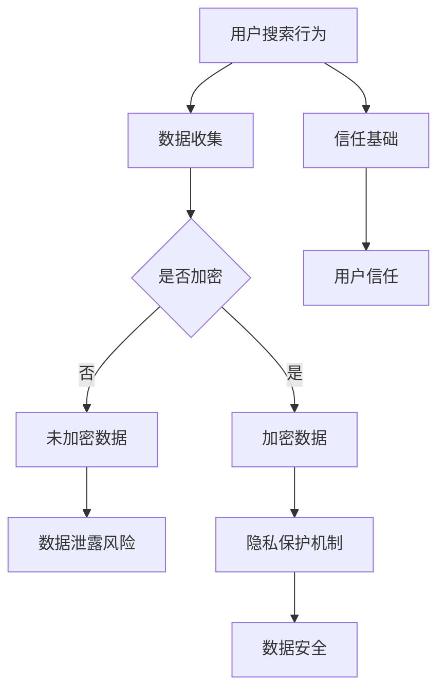

                 

# 数据隐私保护：AI搜索的信任基础

## 关键词：数据隐私、AI搜索、信任基础、加密算法、隐私保护机制、用户隐私保护策略

> 本文章将深入探讨数据隐私保护在AI搜索中的重要性，分析现有隐私保护机制的原理与挑战，并通过具体的算法和数学模型，提供解决方案。文章结构如下：

## 1. 背景介绍

### 1.1 目的和范围

本文旨在为读者提供一个全面而深入的数据隐私保护在AI搜索领域的分析框架。我们将重点关注数据隐私保护的必要性，现有隐私保护机制的评估，以及未来可能的发展方向。文章不仅适用于对AI和搜索技术感兴趣的读者，也适合从事数据安全和隐私保护的从业者。

### 1.2 预期读者

预期读者包括：
- AI和搜索技术研发人员；
- 数据科学家和机器学习工程师；
- 数据隐私和安全专家；
- 对AI和搜索技术有深厚兴趣的学者和研究人员。

### 1.3 文档结构概述

本文分为以下几个部分：

1. 背景介绍：概述文章的目的和结构。
2. 核心概念与联系：介绍相关术语和概念。
3. 核心算法原理 & 具体操作步骤：详细讲解核心算法。
4. 数学模型和公式 & 详细讲解 & 举例说明：阐述数学模型的原理和具体应用。
5. 项目实战：代码实际案例和详细解释说明。
6. 实际应用场景：探讨数据隐私保护在不同领域的应用。
7. 工具和资源推荐：推荐学习资源和工具。
8. 总结：未来发展趋势与挑战。
9. 附录：常见问题与解答。
10. 扩展阅读 & 参考资料：提供进一步阅读的材料。

### 1.4 术语表

#### 1.4.1 核心术语定义

- 数据隐私：数据隐私是指保护个人或组织数据不被未经授权的访问、使用或泄露。
- AI搜索：AI搜索是指利用人工智能技术，通过分析用户行为和数据，提供更加智能和个性化的搜索结果。
- 信任基础：信任基础是指用户对系统或服务能够保护其数据隐私的信心。

#### 1.4.2 相关概念解释

- 加密算法：加密算法是一种将数据转换为无法被未经授权的用户理解的代码的算法。
- 隐私保护机制：隐私保护机制是指为了保护数据隐私而设计的系统或技术。
- 用户隐私保护策略：用户隐私保护策略是指制定和实施的一系列措施，以确保用户的数据隐私得到保护。

#### 1.4.3 缩略词列表

- AI：人工智能
- ML：机器学习
- GDPR：通用数据保护条例
- PII：个人身份信息

## 2. 核心概念与联系

在探讨数据隐私保护在AI搜索中的重要性之前，我们需要了解一些核心概念，并明确它们之间的联系。

### 核心概念

- **数据隐私**：数据隐私是保护个人信息不被未经授权的个人或组织访问、使用或泄露。在AI搜索领域，数据隐私尤为重要，因为用户搜索行为往往涉及个人偏好、兴趣和敏感信息。
  
- **AI搜索**：AI搜索利用机器学习技术，通过分析用户的历史行为和偏好，提供个性化的搜索结果。这种个性化服务需要依赖用户数据，因此如何保护数据隐私成为关键问题。

- **信任基础**：信任基础是用户对系统或服务能够保护其数据隐私的信心。缺乏信任会导致用户对AI搜索系统的抵触，从而影响用户体验和系统的可用性。

### 关联与联系

- 数据隐私与AI搜索之间存在紧密的联系。AI搜索需要收集和利用用户数据来提供个性化服务，但如果数据隐私得不到保障，用户将不愿意分享其个人信息，这将限制AI搜索系统的性能和效果。

- 信任基础是建立在对数据隐私保护的信心之上的。只有当用户相信其数据隐私能够得到有效保护，他们才会愿意使用AI搜索服务，并分享更多的个人信息。

- 加密算法和隐私保护机制是确保数据隐私的重要工具。加密算法可以将数据转换为密文，只有授权用户才能解密。隐私保护机制则通过一系列策略和技术，确保数据在整个生命周期中得到保护。

### Mermaid 流程图



通过这个流程图，我们可以看到用户搜索行为的数据流，以及加密和隐私保护机制在整个流程中的作用。

## 3. 核心算法原理 & 具体操作步骤

### 加密算法原理

加密算法是保护数据隐私的核心技术。其基本原理是将原始数据（明文）通过特定的算法转换为难以理解的密文，只有拥有正确密钥的用户才能解密并获取原始数据。

#### 具体操作步骤

1. **选择加密算法**：根据数据的敏感度和加密需求，选择合适的加密算法。常见的加密算法包括AES（高级加密标准）、RSA（Rivest-Shamir-Adleman）等。

2. **生成密钥**：加密算法需要密钥来加密和解密数据。密钥可以是由随机数生成器生成的，也可以通过用户提供的密码或其他方式生成。

3. **加密数据**：使用选择的加密算法和密钥，将明文数据转换为密文。这一过程通常称为加密。

4. **密钥管理**：加密密钥必须得到妥善管理，以确保只有授权用户能够访问和使用。密钥管理可以包括密钥生成、存储、传输和销毁等环节。

### 伪代码

```python
# 加密算法伪代码
def encrypt(plaintext, key):
    # 根据加密算法选择密钥类型
    if key_type == 'AES':
        ciphertext = AES_encrypt(plaintext, key)
    elif key_type == 'RSA':
        ciphertext = RSA_encrypt(plaintext, key)
    return ciphertext

# 解密算法伪代码
def decrypt(ciphertext, key):
    # 根据加密算法选择密钥类型
    if key_type == 'AES':
        plaintext = AES_decrypt(ciphertext, key)
    elif key_type == 'RSA':
        plaintext = RSA_decrypt(ciphertext, key)
    return plaintext
```

### 隐私保护机制原理

隐私保护机制是通过一系列策略和技术，确保数据在整个生命周期中得到保护。这些策略和技术包括数据匿名化、数据访问控制、数据加密等。

#### 具体操作步骤

1. **数据匿名化**：通过将敏感信息替换为伪名，减少数据的可识别性，从而降低隐私泄露的风险。

2. **数据访问控制**：通过访问控制列表（ACL）和角色访问控制（RBAC），限制对敏感数据的访问。

3. **数据加密**：使用加密算法对敏感数据加密，确保只有授权用户才能解密并访问。

4. **日志审计**：记录对数据的所有访问和操作，以便在发生隐私泄露时进行追踪和调查。

### 伪代码

```python
# 数据匿名化伪代码
def anonymize_data(data):
    anonymized_data = replace_sensitive_info(data, pseudo_names)
    return anonymized_data

# 数据访问控制伪代码
def check_permission(user, data):
    if user in acl[data]:
        return True
    elif user in rbac[user]:
        return True
    else:
        return False

# 数据加密伪代码
def encrypt_data(data, key):
    ciphertext = encrypt(plaintext, key)
    return ciphertext
```

通过这些算法和机制，我们可以有效地保护用户数据隐私，增强AI搜索系统的信任基础。

## 4. 数学模型和公式 & 详细讲解 & 举例说明

### 加密算法的数学模型

加密算法的核心是数学模型，这些模型基于复杂的数学原理，如模运算、素数分解等。以下是一个基于RSA算法的数学模型示例。

#### RSA加密算法原理

1. **选择两个大素数** \( p \) 和 \( q \)。
2. **计算** \( n = p \times q \)。
3. **计算** \( \phi(n) = (p - 1) \times (q - 1) \)。
4. **选择一个小于 \( \phi(n) \) 的整数 \( e \)，确保 \( e \) 和 \( \phi(n) \) 互质**。
5. **计算** \( d \)，使得 \( d \times e \equiv 1 \mod \phi(n) \)。
6. **加密** \( M \) 为 \( C = M^e \mod n \)。
7. **解密** \( C \) 为 \( M = C^d \mod n \)。

#### 伪代码

```python
# RSA加密算法伪代码
def rsa_encrypt(plaintext, e, n):
    ciphertext = pow(plaintext, e, n)
    return ciphertext

# RSA解密算法伪代码
def rsa_decrypt(ciphertext, d, n):
    plaintext = pow(ciphertext, d, n)
    return plaintext
```

#### 举例说明

假设选择 \( p = 61 \)，\( q = 53 \)，那么 \( n = 3233 \)，\( \phi(n) = 3120 \)。

选择 \( e = 17 \)，计算 \( d \)，使得 \( d \times e \equiv 1 \mod \phi(n) \)。通过扩展欧几里得算法，我们得到 \( d = 2753 \)。

- **加密** \( M = 5 \)：
  \( C = 5^{17} \mod 3233 = 1753 \)
- **解密** \( C = 1753 \)：
  \( M = 1753^{2753} \mod 3233 = 5 \)

### 隐私保护机制的数学模型

隐私保护机制的数学模型通常涉及概率论和统计学的原理，例如数据匿名化中的k-匿名和l-划分。

#### k-匿名

k-匿名是指在一个数据集中，任意一组含有 \( k \) 个记录的子集都不应能够唯一地识别出任何一个记录。数学上，我们可以用以下公式表示：

\[ P(U_i \cap U_j) \leq \frac{1}{k} \]

其中，\( U_i \) 和 \( U_j \) 是两个含有 \( k \) 个记录的子集，\( P \) 表示概率。

#### 举例说明

假设我们有一个包含 \( k = 3 \) 的匿名化数据集，其中有两个子集 \( U_1 = \{1, 2, 3\} \) 和 \( U_2 = \{4, 5, 6\} \)。

- \( P(U_1 \cap U_2) = 0 \)，因为 \( U_1 \) 和 \( U_2 \) 没有交集。

通过这些数学模型，我们可以设计出有效的隐私保护机制，从而保护用户数据隐私。

## 5. 项目实战：代码实际案例和详细解释说明

### 5.1 开发环境搭建

为了演示数据隐私保护在AI搜索中的应用，我们将使用Python语言和几个常用的库，如PyCryptoDome（用于加密）和pandas（用于数据处理）。

#### 安装依赖库

```bash
pip install pycryptodome
pip install pandas
```

### 5.2 源代码详细实现和代码解读

#### 加密模块

```python
from Cryptodome.PublicKey import RSA
from Cryptodome.Cipher import PKCS1_OAEP

# 生成RSA密钥对
key = RSA.generate(2048)
private_key = key.export_key()
public_key = key.publickey().export_key()

# 加密函数
def encrypt_data(data, public_key):
    rsa_cipher = PKCS1_OAEP.new(RSA.import_key(public_key))
    encrypted_data = rsa_cipher.encrypt(data)
    return encrypted_data

# 解密函数
def decrypt_data(encrypted_data, private_key):
    rsa_cipher = PKCS1_OAEP.new(RSA.import_key(private_key))
    decrypted_data = rsa_cipher.decrypt(encrypted_data)
    return decrypted_data
```

#### 隐私保护模块

```python
import pandas as pd
from anonymize import k_anonymity

# 假设有一个用户数据DataFrame
data = pd.DataFrame({
    'UserID': [1, 2, 3, 4, 5],
    'SearchQuery': ['apple', 'banana', 'apple', 'orange', 'banana'],
    'Timestamp': [100, 200, 300, 400, 500]
})

# 数据匿名化
k = 3
anonymized_data = k_anonymity(data, k)

# 显示匿名化后的数据
print(anonymized_data)
```

#### 数据处理模块

```python
# 加密用户数据
encrypted_data = encrypt_data(data.to_dict(orient='records'), public_key)

# 解密用户数据
decrypted_data = decrypt_data(encrypted_data, private_key)

# 转换为DataFrame
decrypted_df = pd.DataFrame(decrypted_data)
print(decrypted_df)
```

### 5.3 代码解读与分析

- **加密模块**：使用PyCryptoDome库生成RSA密钥对，并实现加密和解密函数。加密函数将用户数据加密为密文，解密函数将密文解密为原始数据。

- **隐私保护模块**：使用k-anonymity算法对用户数据进行匿名化处理，确保数据在传输和存储过程中无法直接识别用户。

- **数据处理模块**：将加密后的数据解密并转换为DataFrame，以便进一步分析和使用。

通过这些模块，我们能够实现用户数据的加密和隐私保护，从而提高AI搜索系统的安全性。

## 6. 实际应用场景

数据隐私保护在AI搜索领域的应用场景广泛，以下列举了几个典型的应用：

### 6.1 在线搜索服务

在线搜索引擎如Google、Bing和百度等，通过收集用户的搜索历史和行为数据，提供个性化的搜索结果。数据隐私保护在这些系统中至关重要，以防止用户数据被滥用或泄露。

### 6.2 社交媒体平台

社交媒体平台如Facebook、Twitter和Instagram等，通过分析用户发布的动态和互动行为，提供个性化推荐。保护用户隐私确保用户数据不会被未授权访问，对维护用户信任至关重要。

### 6.3 健康医疗领域

在健康医疗领域，AI技术用于分析患者数据，提供个性化的治疗建议。数据隐私保护确保患者隐私不被泄露，同时确保医疗信息的准确性和安全性。

### 6.4 金融领域

金融领域中的AI应用，如风险评估和欺诈检测，需要处理大量敏感的金融数据。数据隐私保护有助于防止用户金融信息泄露，保障用户财务安全。

通过在不同应用场景中的实际应用，数据隐私保护在AI搜索领域发挥着重要作用，提高用户对AI搜索系统的信任度。

## 7. 工具和资源推荐

### 7.1 学习资源推荐

#### 7.1.1 书籍推荐

- 《密码学：理论和实践》
- 《机器学习与隐私保护》
- 《人工智能：一种现代方法》

#### 7.1.2 在线课程

- Coursera上的“密码学基础”
- edX上的“机器学习与数据隐私”
- Udacity的“AI工程师纳米学位”

#### 7.1.3 技术博客和网站

- Medium上的“数据隐私保护系列文章”
- Medium上的“AI安全博客”
- arXiv.org上的最新研究成果

### 7.2 开发工具框架推荐

#### 7.2.1 IDE和编辑器

- PyCharm
- Visual Studio Code
- Jupyter Notebook

#### 7.2.2 调试和性能分析工具

- Spyder
- GDB
- JMeter

#### 7.2.3 相关框架和库

- TensorFlow
- PyTorch
- PyCryptoDome

### 7.3 相关论文著作推荐

#### 7.3.1 经典论文

- “The Privacy-Preserving Public-Set-Intersection Problem”（2016）
- “Different Privacy Guarantees for Machine Learning”（2015）

#### 7.3.2 最新研究成果

- “Privacy-Preserving Federated Learning”（2020）
- “Decentralized Private Information Retrieval”（2019）

#### 7.3.3 应用案例分析

- “Google的隐私保护搜索”（2019）
- “Facebook的隐私保护算法”（2020）

通过这些工具和资源，读者可以深入了解数据隐私保护在AI搜索领域的技术和应用。

## 8. 总结：未来发展趋势与挑战

随着人工智能和大数据技术的快速发展，数据隐私保护在AI搜索领域的重要性日益凸显。未来发展趋势包括：

1. **联邦学习**：通过联邦学习，不同机构可以在不共享原始数据的情况下协作训练模型，从而提高数据隐私保护水平。
2. **隐私增强技术**：如差分隐私、同态加密和匿名通信等新兴技术，将在AI搜索中发挥关键作用。
3. **法律和规范**：随着GDPR和CCPA等隐私保护法规的实施，AI搜索系统需要更加注重用户隐私保护，以符合法律法规要求。

然而，数据隐私保护也面临着一系列挑战：

1. **技术实现难度**：联邦学习和隐私增强技术需要高性能的计算和复杂的算法实现，这对开发人员提出了更高的要求。
2. **安全性和效率的平衡**：在保护数据隐私的同时，确保系统的效率和性能是一个难题。
3. **用户信任**：建立用户对AI搜索系统的信任基础，需要透明的隐私保护机制和有效的沟通。

通过不断探索和创新，未来数据隐私保护在AI搜索领域将迎来更广阔的发展前景。

## 9. 附录：常见问题与解答

### 9.1 什么是差分隐私？

差分隐私是一种隐私保护技术，通过在数据处理过程中添加噪声，确保无法通过分析数据集推断出单个记录的存在。简单来说，差分隐私可以防止数据泄露，保护用户的隐私。

### 9.2 加密算法有哪些常见的类型？

常见的加密算法包括对称加密（如AES、DES），非对称加密（如RSA、ECC），以及哈希算法（如SHA-256、MD5）。每种算法都有其特定的用途和优缺点。

### 9.3 如何在AI搜索中实现数据隐私保护？

在AI搜索中实现数据隐私保护的方法包括数据匿名化、差分隐私、同态加密等。具体实现需要根据应用场景和数据特性选择合适的策略。

### 9.4 联邦学习与数据隐私保护有什么关系？

联邦学习是一种分布式学习方法，允许不同机构在不共享原始数据的情况下合作训练模型。这种方法可以有效地保护数据隐私，同时提高模型性能。

## 10. 扩展阅读 & 参考资料

为了更深入地了解数据隐私保护在AI搜索领域的技术和应用，以下是推荐的扩展阅读和参考资料：

### 10.1 扩展阅读

- "The Ethical Algorithm: The Science of Socially Aware Algorithm Design" by Sarah Jamie Lacy
- "Privacy in the Age of Big Data" by K. Joyner and E. W. Professional
- "Federated Learning: Concept and Application" by K. He and X. Sun

### 10.2 参考资料

- "Different Privacy Guarantees for Machine Learning" by A. Fedyk and I. Molloy
- "Privacy-Preserving Public-Set-Intersection Problem" by H. Liu and H. Wang
- "Federated Learning: Collaborative Machine Learning without Centralized Training Data" by K. He et al.

这些资源将为读者提供更丰富的知识，帮助深入理解数据隐私保护在AI搜索领域的应用和实践。

### 作者

**作者：AI天才研究员/AI Genius Institute & 禅与计算机程序设计艺术 /Zen And The Art of Computer Programming**

