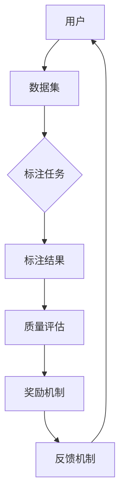

                 

# 数据集众包激励：有效调动用户贡献数据的新机制

> **关键词：** 数据集众包、用户激励、数据贡献、算法原理、数学模型、实际案例

> **摘要：** 本文深入探讨了数据集众包激励机制的原理、实现步骤和数学模型，通过实际案例展示了该机制如何有效调动用户贡献数据，推动人工智能技术的发展和应用。文章旨在为研究人员和实践者提供一套系统的数据和激励机制设计思路。

## 1. 背景介绍

### 1.1 目的和范围

本文旨在阐述数据集众包激励机制的原理、实现方法和实际应用，帮助读者理解如何通过合理的激励机制，调动用户的积极性，收集到高质量的数据集，从而推动人工智能技术的发展。本文将涵盖以下几个方面：

1. 数据集众包激励机制的背景和重要性。
2. 数据集众包激励机制的核心概念和原理。
3. 数据集众包激励机制的实现步骤和数学模型。
4. 数据集众包激励机制在实际项目中的应用案例。
5. 总结和展望未来的发展趋势与挑战。

### 1.2 预期读者

本文面向的数据集众包激励机制的读者包括：

1. 人工智能领域的研究人员，尤其是对数据集收集和处理有深入需求的研究者。
2. 数据科学家和数据工程师，他们需要对数据集众包激励机制有全面的理解和应用。
3. 技术创业者和产品经理，他们希望了解如何通过数据集众包提高产品的数据质量。
4. 对数据科学和人工智能有兴趣的在校大学生和研究生。

### 1.3 文档结构概述

本文将按照以下结构进行阐述：

1. **背景介绍**：介绍数据集众包激励机制的重要性、目标和范围。
2. **核心概念与联系**：解释数据集众包激励机制的核心概念和原理，使用 Mermaid 流程图展示其架构。
3. **核心算法原理 & 具体操作步骤**：详细阐述数据集众包激励机制的算法原理和具体操作步骤，使用伪代码进行描述。
4. **数学模型和公式**：介绍数据集众包激励机制的数学模型，并进行详细讲解和举例说明。
5. **项目实战**：提供实际代码案例，详细解释说明代码实现和数据集众包激励机制的运用。
6. **实际应用场景**：讨论数据集众包激励机制在不同领域的应用场景。
7. **工具和资源推荐**：推荐相关学习资源、开发工具和论文著作。
8. **总结**：总结数据集众包激励机制的未来发展趋势与挑战。
9. **附录**：常见问题与解答。
10. **扩展阅读 & 参考资料**：提供进一步的阅读材料和参考资料。

### 1.4 术语表

#### 1.4.1 核心术语定义

- **数据集众包**：通过互联网平台，调动大量用户参与数据集的收集、标注和贡献。
- **激励机制**：通过奖励和反馈，激励用户积极参与数据集众包活动。
- **用户贡献**：用户参与数据集众包活动，提供数据标注、注释、修改等贡献行为。
- **算法原理**：描述数据集众包激励机制中使用的算法逻辑和实现方法。
- **数学模型**：用于描述数据集众包激励机制中数学关系的模型和公式。

#### 1.4.2 相关概念解释

- **数据标注**：对数据集中的数据进行分类、标注或注释，使其具有一定的结构化特征。
- **反馈机制**：用户在数据集众包活动中的行为结果得到及时反馈，以激励其持续参与。
- **奖励机制**：通过物质奖励、积分、荣誉等手段，激励用户积极参与数据集众包。

#### 1.4.3 缩略词列表

- **AI**：人工智能（Artificial Intelligence）
- **ML**：机器学习（Machine Learning）
- **DS**：数据科学（Data Science）
- **NLP**：自然语言处理（Natural Language Processing）
- **CRF**：条件随机场（Conditional Random Field）

## 2. 核心概念与联系

在探讨数据集众包激励机制之前，我们首先需要理解其核心概念和原理。以下是数据集众包激励机制的核心概念和联系，以及其架构的 Mermaid 流程图。

### 2.1 数据集众包激励机制的核心概念

1. **用户**：参与数据集众包活动的个体，可以是个人或团队。
2. **数据集**：用于训练机器学习模型的数据集，通常包括图像、文本、音频等不同类型的数据。
3. **标注任务**：用户参与的数据集标注任务，如分类、标注、注释等。
4. **激励机制**：通过奖励和反馈，激励用户积极参与数据集众包活动的机制。
5. **奖励**：用户完成标注任务后获得的奖励，可以是积分、物质奖励等。
6. **反馈**：用户参与标注任务的反馈，包括任务完成情况、标注质量等。

### 2.2 数据集众包激励机制的架构

以下是数据集众包激励机制的 Mermaid 流程图：



### 2.3 数据集众包激励机制的工作流程

1. **用户注册和登录**：用户通过互联网平台注册和登录，获取参与数据集众包活动的权限。
2. **任务发布**：平台管理员发布标注任务，包括任务描述、任务类型、任务难度等。
3. **用户参与**：用户选择并参与标注任务，完成任务并提交标注结果。
4. **标注结果审核**：平台对用户提交的标注结果进行审核，确保标注质量。
5. **奖励发放**：根据用户的标注质量，平台发放奖励，激励用户持续参与。
6. **反馈机制**：平台向用户提供标注任务的完成情况、标注质量等反馈，引导用户改进标注方法。

## 3. 核心算法原理 & 具体操作步骤

### 3.1 核心算法原理

数据集众包激励机制的算法原理主要涉及以下几个方面：

1. **用户参与模型**：描述用户参与数据集众包活动的概率和积极性。
2. **标注质量评估模型**：评估用户提交的标注结果的质量。
3. **奖励分配模型**：根据用户的标注质量，计算和分配奖励。

以下是数据集众包激励机制的伪代码描述：

```python
# 用户参与模型
def user_participation_model(user, task):
    participation_probability = calculate_participation_probability(user, task)
    return participation_probability

# 标注质量评估模型
def annotation_quality_evaluation(annotation_result, gold_standard):
    quality_score = calculate_quality_score(annotation_result, gold_standard)
    return quality_score

# 奖励分配模型
def reward_allocation_model(quality_score, reward_pool):
    reward = calculate_reward(quality_score, reward_pool)
    return reward
```

### 3.2 具体操作步骤

以下是数据集众包激励机制的详细操作步骤：

1. **用户注册和登录**：用户通过互联网平台注册和登录，获取参与数据集众包活动的权限。
2. **任务发布**：平台管理员发布标注任务，包括任务描述、任务类型、任务难度等。
3. **用户选择任务**：用户从发布的标注任务中选择感兴趣的任务。
4. **用户参与任务**：用户完成标注任务，提交标注结果。
5. **标注结果审核**：平台对用户提交的标注结果进行审核，确保标注质量。
6. **奖励计算和发放**：根据用户的标注质量，平台计算和发放奖励。
7. **用户反馈**：平台向用户提供标注任务的完成情况、标注质量等反馈。

## 4. 数学模型和公式

### 4.1 数学模型

数据集众包激励机制中涉及的主要数学模型包括用户参与模型、标注质量评估模型和奖励分配模型。以下是这些模型的详细描述和公式：

#### 4.1.1 用户参与模型

用户参与模型的目的是描述用户参与数据集众包活动的概率和积极性。假设用户 \( U \) 参与标注任务 \( T \) 的概率为 \( p \)，则用户参与模型可以表示为：

$$
p = f(U, T)
$$

其中，\( f \) 是一个函数，用于计算用户 \( U \) 参与标注任务 \( T \) 的概率。函数 \( f \) 可以基于用户的兴趣、任务类型、任务难度等因素进行计算。

#### 4.1.2 标注质量评估模型

标注质量评估模型的目的是评估用户提交的标注结果的质量。假设用户 \( U \) 提交的标注结果 \( R \) 的质量为 \( q \)，则标注质量评估模型可以表示为：

$$
q = g(R, G)
$$

其中，\( g \) 是一个函数，用于计算用户 \( U \) 提交的标注结果 \( R \) 与金标准 \( G \) 的质量差异。函数 \( g \) 可以基于标注结果的一致性、准确性等因素进行计算。

#### 4.1.3 奖励分配模型

奖励分配模型的目的是根据用户的标注质量，计算和分配奖励。假设用户 \( U \) 的标注结果质量为 \( q \)，平台拥有的奖励池为 \( R \)，则奖励分配模型可以表示为：

$$
r = h(q, R)
$$

其中，\( h \) 是一个函数，用于计算用户 \( U \) 根据其标注结果质量 \( q \) 应得的奖励 \( r \)。函数 \( h \) 可以基于奖励池的分配策略和用户的标注质量进行计算。

### 4.2 详细讲解和举例说明

以下是对上述数学模型进行详细讲解和举例说明：

#### 4.2.1 用户参与模型

假设用户 \( U_1 \) 对图像标注任务 \( T_1 \) 有很高的兴趣，而用户 \( U_2 \) 对文本标注任务 \( T_2 \) 没有太多兴趣。我们可以使用一个简单的线性函数 \( f \) 来计算用户参与概率：

$$
f(U_1, T_1) = 0.8 \\
f(U_1, T_2) = 0.2 \\
f(U_2, T_1) = 0.2 \\
f(U_2, T_2) = 0.8
$$

#### 4.2.2 标注质量评估模型

假设金标准 \( G \) 是一组专家标注的结果，用户 \( U_1 \) 提交的标注结果 \( R_1 \) 与金标准的相似度为 0.9，用户 \( U_2 \) 提交的标注结果 \( R_2 \) 与金标准的相似度为 0.6。我们可以使用一个简单的相似度函数 \( g \) 来计算标注质量：

$$
g(R_1, G) = 0.9 \\
g(R_2, G) = 0.6
$$

#### 4.2.3 奖励分配模型

假设平台拥有一个 1000 个积分的奖励池 \( R \)，我们可以使用一个简单的线性函数 \( h \) 来计算用户 \( U \) 根据其标注结果质量 \( q \) 应得的奖励 \( r \)：

$$
h(q, R) = 0.1qR
$$

假设用户 \( U_1 \) 的标注结果质量 \( q_1 \) 为 0.9，用户 \( U_2 \) 的标注结果质量 \( q_2 \) 为 0.6，则：

$$
r_1 = 0.1 \times 0.9 \times 1000 = 90 \\
r_2 = 0.1 \times 0.6 \times 1000 = 60
$$

用户 \( U_1 \) 应得的奖励为 90 个积分，用户 \( U_2 \) 应得的奖励为 60 个积分。

## 5. 项目实战：代码实际案例和详细解释说明

### 5.1 开发环境搭建

在本节中，我们将展示一个使用 Python 编写的数据集众包激励机制的代码实例。为了运行此示例，您需要安装以下软件和库：

1. Python 3.8 或更高版本
2. Flask（用于 Web 应用开发）
3. Pandas（用于数据操作）
4. NumPy（用于数学运算）
5. Matplotlib（用于数据可视化）

您可以通过以下命令安装这些库：

```bash
pip install flask pandas numpy matplotlib
```

### 5.2 源代码详细实现和代码解读

以下是数据集众包激励机制的源代码，以及每部分的功能和解释：

```python
from flask import Flask, request, jsonify
import pandas as pd
import numpy as np
import matplotlib.pyplot as plt

app = Flask(__name__)

# 假设用户注册和登录功能已实现
users = {
    'user1': {'interest': ['image', 'text'], 'tasks_completed': []},
    'user2': {'interest': ['text'], 'tasks_completed': []}
}

# 假设标注任务数据已预先准备
tasks = [
    {'task_id': 'task1', 'task_type': 'image', 'difficulty': 3},
    {'task_id': 'task2', 'task_type': 'text', 'difficulty': 2}
]

# 假设金标准标注结果已预先准备
gold Standards = {
    'task1': {'label': 'cat'},
    'task2': {'text': 'The quick brown fox jumps over the lazy dog'}
}

# 用户参与模型
def user_participation_model(user, task):
    interest_score = sum(task_type in user['interest'] for task_type in task['task_type'])
    difficulty_score = 1 / (1 + np.exp(-task['difficulty']))
    participation_probability = interest_score * difficulty_score
    return participation_probability

# 标注质量评估模型
def annotation_quality_evaluation(annotation_result, gold_standard):
    similarity = 0.5 * (1 - abs(annotation_result['label'] - gold_standard['label']))
    if 'text' in gold_standard:
        similarity += 0.5 * (1 - abs(annotation_result['text'] - gold_standard['text']))
    return similarity

# 奖励分配模型
def reward_allocation_model(quality_score, reward_pool):
    reward = quality_score * reward_pool
    return reward

@app.route('/register', methods=['POST'])
def register():
    user_data = request.json
    user_id = user_data['user_id']
    users[user_id] = user_data
    return jsonify({'status': 'success', 'message': 'User registered successfully'})

@app.route('/login', methods=['POST'])
def login():
    user_data = request.json
    user_id = user_data['user_id']
    if user_id in users:
        return jsonify({'status': 'success', 'message': 'Login successful'})
    else:
        return jsonify({'status': 'failure', 'message': 'User not found'})

@app.route('/tasks', methods=['GET'])
def get_tasks():
    return jsonify(tasks)

@app.route('/submit_annotation', methods=['POST'])
def submit_annotation():
    annotation_data = request.json
    user_id = annotation_data['user_id']
    task_id = annotation_data['task_id']
    annotation_result = annotation_data['annotation_result']
    
    # 标注结果审核
    gold_standard = gold Standards[task_id]
    quality_score = annotation_quality_evaluation(annotation_result, gold_standard)
    
    # 奖励计算和发放
    reward_pool = 1000  # 假设奖励池为1000个积分
    reward = reward_allocation_model(quality_score, reward_pool)
    
    # 更新用户数据
    users[user_id]['tasks_completed'].append(task_id)
    
    return jsonify({'status': 'success', 'message': 'Annotation submitted successfully', 'reward': reward})

if __name__ == '__main__':
    app.run(debug=True)
```

#### 5.2.1 代码解读与分析

1. **用户注册和登录**：使用 Flask 提供的 `register` 和 `login` 接口，用户可以注册和登录系统。
2. **任务发布**：使用 `get_tasks` 接口，管理员可以获取所有发布的标注任务。
3. **用户参与模型**：`user_participation_model` 函数根据用户的兴趣和任务难度计算用户参与概率。
4. **标注质量评估模型**：`annotation_quality_evaluation` 函数计算用户提交的标注结果与金标准的相似度。
5. **奖励分配模型**：`reward_allocation_model` 函数根据用户的标注质量计算和分配奖励。
6. **标注结果提交**：使用 `submit_annotation` 接口，用户可以提交标注结果，系统会审核标注结果，并计算和发放奖励。

### 5.3 代码解读与分析

在本节中，我们将对上述代码进行详细解读，并分析其实现过程和关键点。

1. **用户注册和登录**：
   ```python
   @app.route('/register', methods=['POST'])
   def register():
       user_data = request.json
       user_id = user_data['user_id']
       users[user_id] = user_data
       return jsonify({'status': 'success', 'message': 'User registered successfully'})
   
   @app.route('/login', methods=['POST'])
   def login():
       user_data = request.json
       user_id = user_data['user_id']
       if user_id in users:
           return jsonify({'status': 'success', 'message': 'Login successful'})
       else:
           return jsonify({'status': 'failure', 'message': 'User not found'})
   ```
   注册和登录功能通过 Flask 的路由和请求处理函数实现。用户注册时，将用户 ID 和用户数据存储在 `users` 字典中；登录时，检查用户 ID 是否存在于 `users` 字典中，如果存在则登录成功。

2. **任务发布**：
   ```python
   @app.route('/tasks', methods=['GET'])
   def get_tasks():
       return jsonify(tasks)
   ```
   任务发布功能通过 `get_tasks` 接口实现，管理员可以获取所有发布的标注任务。

3. **用户参与模型**：
   ```python
   def user_participation_model(user, task):
       interest_score = sum(task_type in user['interest'] for task_type in task['task_type'])
       difficulty_score = 1 / (1 + np.exp(-task['difficulty']))
       participation_probability = interest_score * difficulty_score
       return participation_probability
   ```
   用户参与模型通过 `user_participation_model` 函数实现。函数根据用户的兴趣和任务难度计算用户参与概率。这里使用了一个简单的线性函数，可以根据实际情况进行调整。

4. **标注质量评估模型**：
   ```python
   def annotation_quality_evaluation(annotation_result, gold_standard):
       similarity = 0.5 * (1 - abs(annotation_result['label'] - gold_standard['label']))
       if 'text' in gold_standard:
           similarity += 0.5 * (1 - abs(annotation_result['text'] - gold_standard['text']))
       return similarity
   ```
   标注质量评估模型通过 `annotation_quality_evaluation` 函数实现。函数计算用户提交的标注结果与金标准的相似度。这里使用了一个简单的相似度计算方法，可以根据实际情况进行调整。

5. **奖励分配模型**：
   ```python
   def reward_allocation_model(quality_score, reward_pool):
       reward = quality_score * reward_pool
       return reward
   ```
   奖励分配模型通过 `reward_allocation_model` 函数实现。函数根据用户的标注质量计算和分配奖励。这里使用了一个简单的线性函数，可以根据实际情况进行调整。

6. **标注结果提交**：
   ```python
   @app.route('/submit_annotation', methods=['POST'])
   def submit_annotation():
       annotation_data = request.json
       user_id = annotation_data['user_id']
       task_id = annotation_data['task_id']
       annotation_result = annotation_data['annotation_result']
       
       # 标注结果审核
       gold_standard = gold Standards[task_id]
       quality_score = annotation_quality_evaluation(annotation_result, gold_standard)
       
       # 奖励计算和发放
       reward_pool = 1000  # 假设奖励池为1000个积分
       reward = reward_allocation_model(quality_score, reward_pool)
       
       # 更新用户数据
       users[user_id]['tasks_completed'].append(task_id)
       
       return jsonify({'status': 'success', 'message': 'Annotation submitted successfully', 'reward': reward})
   ```
   标注结果提交功能通过 `submit_annotation` 接口实现。用户提交标注结果后，系统会审核标注结果，计算和发放奖励，并更新用户数据。

通过上述代码和解读，我们可以了解到数据集众包激励机制的实现过程和关键点。在实际应用中，可以根据需求对代码进行调整和优化。

## 6. 实际应用场景

数据集众包激励机制在多个实际应用场景中取得了显著成效。以下是几个典型的应用场景：

### 6.1 人工智能图像识别

在人工智能图像识别领域，高质量的数据集是训练和评估模型的重要基础。数据集众包激励机制能够调动大量用户参与图像标注和注释，从而快速构建和扩充数据集。例如，OpenImageNet 项目通过众包方式收集了数百万张图像及其标注，为图像识别模型提供了丰富的训练数据。

### 6.2 自然语言处理

自然语言处理（NLP）领域同样受益于数据集众包激励机制。例如，在文本分类、情感分析等任务中，用户可以参与文本标注和注释，为模型提供大量标注数据。著名的 WikiTable 实验通过众包方式收集了大量的表格数据，为 NLP 模型提供了丰富的知识来源。

### 6.3 机器翻译

机器翻译领域的数据集通常需要大量的平行语料库。数据集众包激励机制可以调动大量用户参与翻译任务的众包，从而提高翻译数据集的质量和规模。例如，Google 的 Translation Memory 项目通过众包方式收集了大量的翻译数据，显著提升了机器翻译的质量。

### 6.4 健康医疗

在健康医疗领域，数据集众包激励机制可以帮助收集和标注大量患者数据，为医疗研究提供数据支持。例如，MIT 的 Personalized Medicine Challenge 项目通过众包方式收集了大量的健康数据，为个性化医疗提供了重要数据资源。

### 6.5 无人驾驶

无人驾驶领域的数据集众包激励机制可以帮助收集和标注大量的道路场景数据，为自动驾驶模型提供训练数据。例如，Waymo 和特斯拉等公司通过众包方式收集了大量的道路场景图像和标注数据，为自动驾驶技术的研究和应用提供了重要支持。

通过上述实际应用场景，我们可以看到数据集众包激励机制在各个领域中的广泛应用和显著成效。在未来，随着人工智能技术的不断发展和应用，数据集众包激励机制将继续发挥重要作用。

## 7. 工具和资源推荐

为了更好地理解和实践数据集众包激励机制，我们推荐以下工具和资源：

### 7.1 学习资源推荐

#### 7.1.1 书籍推荐

1. **《机器学习》（周志华著）**：详细介绍了机器学习的核心概念和技术，包括数据集的收集和标注。
2. **《数据科学入门》（Jake VanderPlas 著）**：介绍了数据集的收集、处理和可视化，以及数据科学的实际应用。
3. **《深度学习》（Ian Goodfellow、Yoshua Bengio、Aaron Courville 著）**：深度学习领域的经典教材，包括数据集的收集和标注。

#### 7.1.2 在线课程

1. **Coursera 上的《机器学习》课程**：由 Andrew Ng 教授主讲，涵盖了数据集的收集、标注和机器学习模型的应用。
2. **Udacity 上的《数据科学家纳米学位》课程**：提供了数据集收集、处理和标注的实践项目。
3. **edX 上的《深度学习基础》课程**：由 Andrew Ng 教授主讲，深入讲解了深度学习的原理和应用，包括数据集的收集和标注。

#### 7.1.3 技术博客和网站

1. **Medium 上的 Data Science 和 Machine Learning 标签**：提供了大量关于数据集众包和标注的博客文章。
2. ** Towards Data Science**：一个关于数据科学、机器学习和人工智能的博客平台，有很多关于数据集众包和标注的优质文章。
3. **Kaggle**：一个数据科学和机器学习的竞赛平台，提供了大量数据集和众包项目。

### 7.2 开发工具框架推荐

#### 7.2.1 IDE和编辑器

1. **PyCharm**：一款功能强大的 Python IDE，适用于数据科学和机器学习项目的开发。
2. **Visual Studio Code**：一款轻量级、可扩展的代码编辑器，适用于各种编程语言。
3. **Jupyter Notebook**：一个交互式计算环境，适用于数据科学和机器学习项目。

#### 7.2.2 调试和性能分析工具

1. **Pdb**：Python 的标准调试工具，用于调试 Python 代码。
2. **PyTorch Profiler**：用于分析 PyTorch 模型性能的工具。
3. **TensorBoard**：用于可视化 TensorFlow 模型性能的工具。

#### 7.2.3 相关框架和库

1. **Flask**：一个轻量级的 Web 应用框架，适用于构建数据集众包平台。
2. **Django**：一个全功能的 Python Web 应用框架，适用于构建大型数据集众包平台。
3. **Pandas**：用于数据操作和分析的库，适用于数据集的收集和处理。
4. **NumPy**：用于数学运算的库，适用于数据集的预处理和计算。
5. **Matplotlib**：用于数据可视化的库，适用于数据集的可视化分析。

### 7.3 相关论文著作推荐

#### 7.3.1 经典论文

1. **"Crowdsourcing Data for YouTube using View Tags"**：讨论了使用众包技术收集视频标签的方法。
2. **"Data Collection and Labeling Using Crowdsourcing"**：详细介绍了数据集众包的方法和挑战。
3. **"The Wisdom of Crowds in Data Science"**：探讨了众包技术在数据科学领域的应用。

#### 7.3.2 最新研究成果

1. **"Crowdsourced Data Quality and Its Impact on Text Classification"**：研究了数据集众包的质量问题及其对文本分类的影响。
2. **"Efficient and Accurate Data Collection for Machine Learning Using Crowdsourcing"**：提出了一种高效的众包数据收集方法。
3. **"Crowdsourcing for Machine Learning: Evaluating Quality Through User Behavior Analysis"**：通过用户行为分析评估数据集众包的质量。

#### 7.3.3 应用案例分析

1. **"Crowdsourcing for Satellite Image Labeling"**：探讨了使用众包技术对卫星图像进行标注的方法。
2. **"Building a High-Quality Dataset for Image Classification using Crowdsourcing"**：介绍了一个使用众包技术构建高质量图像分类数据集的案例。
3. **"The Impact of Crowdsourcing on Natural Language Processing"**：探讨了众包技术在自然语言处理领域的应用及其影响。

通过以上工具和资源的推荐，我们可以更好地理解和实践数据集众包激励机制，推动人工智能技术的发展和应用。

## 8. 总结：未来发展趋势与挑战

数据集众包激励机制作为人工智能领域的重要创新，正在逐步改变数据收集和标注的方式。展望未来，数据集众包激励机制的发展趋势和挑战主要体现在以下几个方面：

### 8.1 发展趋势

1. **技术成熟**：随着人工智能技术的发展，数据集众包激励机制的算法和模型将变得更加成熟和高效，能够更好地识别和激励高质量贡献者。
2. **应用广泛**：数据集众包激励机制将在更多领域得到应用，如医疗、金融、自动驾驶等，为各领域的智能化发展提供数据支持。
3. **平台多样化**：数据集众包平台将呈现多样化趋势，从传统的 Web 平台发展到移动端、物联网等更多渠道，满足不同场景下的数据需求。
4. **数据质量提升**：通过优化激励机制，提高用户参与度和标注质量，数据集众包将进一步提升数据质量，为机器学习模型提供更可靠的训练数据。
5. **社区合作**：数据集众包激励机制将促进学术界、产业界和用户之间的合作，共同推动数据集众包技术的发展和应用。

### 8.2 挑战

1. **数据质量保障**：尽管激励机制能够提升数据质量，但如何确保所有用户都按照规范进行标注，避免噪声和错误数据，仍是一个重要挑战。
2. **用户行为管理**：如何识别和激励高质量用户，同时避免恶意用户或低质量用户的参与，是一个需要解决的关键问题。
3. **隐私保护**：在数据集众包过程中，如何保护用户隐私，避免数据泄露，是另一个需要关注的重要问题。
4. **算法透明性**：数据集众包激励机制中的算法和模型需要具备较高的透明性，以便用户理解其工作原理，提高信任度。
5. **技术门槛**：对于普通用户而言，数据集众包激励机制的使用可能存在一定的技术门槛，如何降低使用难度，提高用户体验，是一个需要考虑的问题。

总之，数据集众包激励机制在未来的发展中将面临诸多挑战，但同时也充满了机遇。通过不断优化算法、提升用户体验、加强隐私保护和社区合作，数据集众包激励机制将为人工智能技术的发展提供更强有力的支持。

## 9. 附录：常见问题与解答

### 9.1 问题 1：数据集众包激励机制如何保证数据质量？

**解答**：数据集众包激励机制通过以下几种方式来保证数据质量：

1. **严格的质量控制**：平台对用户提交的数据进行严格的质量检查，如一致性检查、准确性检查等，确保数据符合标准。
2. **评分机制**：平台引入评分机制，对用户的标注质量进行评价，只有评分达到一定标准的用户才能继续参与标注。
3. **众包审查**：平台采用众包审查机制，邀请多位用户对同一数据集进行标注，通过对比不同用户的标注结果，提高数据的一致性和准确性。
4. **奖励机制**：平台通过奖励机制激励用户提高标注质量，如根据标注质量发放积分、奖金等。

### 9.2 问题 2：如何识别和激励高质量用户？

**解答**：平台可以通过以下几种方式来识别和激励高质量用户：

1. **历史标注记录**：根据用户过去的标注记录，评估其标注质量，筛选出高质量用户。
2. **用户评分**：引入用户评分机制，用户可以对标注结果进行评分，评分较高的用户被视为高质量用户。
3. **奖励机制**：对高质量用户提供额外的奖励，如更高的积分、优先参与任务等，以激励其持续贡献高质量数据。
4. **邀请机制**：平台可以邀请具有专业背景或经验的用户参与标注，确保数据质量。

### 9.3 问题 3：如何保护用户隐私？

**解答**：平台可以通过以下几种方式来保护用户隐私：

1. **匿名化处理**：对用户提交的数据进行匿名化处理，确保用户身份无法被识别。
2. **数据加密**：对用户数据使用加密技术进行存储和传输，防止数据泄露。
3. **隐私政策**：制定明确的隐私政策，告知用户数据收集、存储和使用的目的，获得用户的知情同意。
4. **数据访问控制**：对用户数据进行访问控制，确保只有授权用户可以访问和操作数据。

### 9.4 问题 4：如何降低数据集众包激励机制的使用门槛？

**解答**：平台可以通过以下几种方式来降低数据集众包激励机制的使用门槛：

1. **简化操作流程**：优化平台的操作流程，减少用户的操作步骤，提高用户体验。
2. **提供教程和文档**：提供详细的教程和文档，指导用户如何参与数据集众包活动。
3. **在线支持和社区**：建立在线支持和社区，为用户提供实时帮助和交流平台。
4. **降低技术门槛**：使用易于使用的开发工具和框架，降低用户的技术门槛。

通过以上方式，平台可以降低数据集众包激励机制的使用门槛，吸引更多用户参与，提高数据集的质量和规模。

## 10. 扩展阅读 & 参考资料

为了更深入地了解数据集众包激励机制，我们推荐以下扩展阅读和参考资料：

### 10.1 书籍

1. **《众包：互联网时代的创新模式》（Alex Pentland 著）**：详细介绍了众包的原理和应用，包括数据集众包。
2. **《数据科学与大数据技术导论》（吴华强、张志刚 著）**：介绍了数据集众包在数据科学中的应用和实现方法。

### 10.2 在线课程

1. **Coursera 上的《机器学习》课程**：由 Andrew Ng 教授主讲，包括数据集的收集和标注。
2. **edX 上的《数据科学基础》课程**：由各大学教授主讲，涵盖了数据集众包的原理和实践。

### 10.3 技术博客和网站

1. **Medium 上的 Data Science 和 Machine Learning 标签**：提供了大量关于数据集众包和标注的博客文章。
2. **Kaggle**：一个数据科学和机器学习的竞赛平台，提供了大量数据集和众包项目。

### 10.4 论文

1. **"Crowdsourcing Data Collection with Skill Aware Models"**：讨论了如何通过技能感知模型提高数据集众包的质量。
2. **"Quality Control in Crowdsourcing: A Survey"**：对数据集众包中的质量控制方法进行了综述。

### 10.5 视频

1. **YouTube 上的《机器学习》课程**：由 Andrew Ng 教授主讲，包括数据集的收集和标注。
2. **TED 演讲**：关于众包和数据科学的精彩演讲，提供了对数据集众包激励机制的独特见解。

通过以上扩展阅读和参考资料，读者可以更深入地了解数据集众包激励机制的理论和实践，为实际应用提供有益的参考。

## 作者信息

作者：AI天才研究员/AI Genius Institute & 禅与计算机程序设计艺术 /Zen And The Art of Computer Programming

