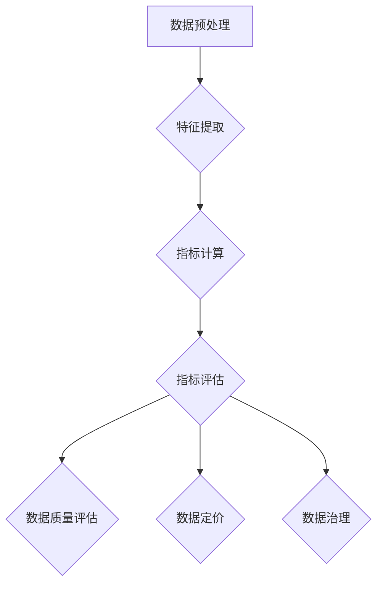

                 

### 数据集指标化：数据要素市场化的新基建

> **关键词：** 数据集指标化、数据要素市场化、新基建、数据质量、数据治理

**摘要：** 随着大数据技术的迅猛发展，数据已成为新的生产要素，推动着各行各业的变革。然而，数据的高质量和高效利用成为了一个挑战。本文将探讨数据集指标化的概念、重要性及其在数据要素市场化中的关键作用，旨在揭示通过数据集指标化打造数据要素市场化新基建的策略与实施步骤，为数据驱动的发展提供新的思路和方向。

## 1. 背景介绍

### 1.1 目的和范围

本文旨在深入探讨数据集指标化这一新兴技术，解释其原理，阐述其在数据要素市场化中的作用，并分析其为实现新基建的重要性。本文将覆盖以下内容：

- 数据集指标化的定义与背景
- 数据要素市场化的趋势与需求
- 数据集指标化在数据要素市场化中的应用
- 新基建的内涵与数据集指标化的关联
- 实施步骤与挑战

### 1.2 预期读者

本文适合以下读者群体：

- 数据分析师和数据科学家
- IT项目经理和架构师
- 数据治理和质量管理专家
- 对数据要素市场化感兴趣的从业者
- 大数据技术的研究人员和学者

### 1.3 文档结构概述

本文将分为十个部分，具体结构如下：

1. 背景介绍
   - 目的和范围
   - 预期读者
   - 文档结构概述
   - 术语表
2. 核心概念与联系
   - 核心概念原理和架构的Mermaid流程图
3. 核心算法原理 & 具体操作步骤
   - 算法原理讲解使用伪代码
4. 数学模型和公式 & 详细讲解 & 举例说明
   - 数学公式使用latex格式
5. 项目实战：代码实际案例和详细解释说明
   - 开发环境搭建
   - 源代码详细实现和代码解读
   - 代码解读与分析
6. 实际应用场景
7. 工具和资源推荐
   - 学习资源推荐
   - 开发工具框架推荐
   - 相关论文著作推荐
8. 总结：未来发展趋势与挑战
9. 附录：常见问题与解答
10. 扩展阅读 & 参考资料

### 1.4 术语表

#### 1.4.1 核心术语定义

- **数据集指标化**：将数据集转换为一系列可度量的指标，以便更有效地进行数据处理和分析。
- **数据要素市场化**：将数据作为一种生产要素进行市场化运作，实现数据的流动、交换和增值。
- **新基建**：基于新一代信息技术构建的新型基础设施，包括云计算、大数据、物联网、人工智能等。

#### 1.4.2 相关概念解释

- **数据质量**：数据的一致性、准确性、完整性、及时性和可靠性等特征。
- **数据治理**：通过制定策略、过程、标准和工具来管理和控制数据，确保其质量、安全性和合规性。

#### 1.4.3 缩略词列表

- **AI**：人工智能
- **ML**：机器学习
- **DL**：深度学习
- **DB**：数据库
- **ETL**：提取、转换、加载
- **GDPR**：通用数据保护条例
- **API**：应用程序编程接口

## 2. 核心概念与联系

### 2.1 数据集指标化的原理

数据集指标化是一种将原始数据转换为一系列可度量的指标的方法，这些指标用于评估数据的质量、特征和模式。其原理如下：

1. **数据预处理**：对原始数据进行清洗、格式化和标准化处理，确保数据的一致性和可靠性。
2. **特征提取**：从预处理后的数据中提取关键特征，这些特征能够代表数据的本质属性。
3. **指标计算**：对提取出的特征进行计算，生成一系列指标，如平均值、标准差、方差、熵等。
4. **指标评估**：使用这些指标对数据的质量、可用性和可信度进行评估。

### 2.2 数据要素市场化的趋势与需求

数据要素市场化是指将数据作为一种生产要素进行市场化运作，实现数据的流动、交换和增值。这一趋势源于以下几个因素：

1. **数据价值的凸显**：随着互联网和大数据技术的发展，数据已成为新的生产要素，其价值日益凸显。
2. **法律法规的完善**：各国政府逐步出台相关法律法规，推动数据要素市场的发展，如《通用数据保护条例》（GDPR）。
3. **市场需求的增加**：企业在数字化转型过程中，对高质量数据的需求不断增长，推动了数据要素市场的形成。

### 2.3 数据集指标化在数据要素市场化中的应用

数据集指标化在数据要素市场化中具有关键作用，主要体现在以下几个方面：

1. **数据质量评估**：通过指标化评估数据的质量，确保数据的可用性和可信度。
2. **数据定价**：根据指标化的结果，为数据定价，实现数据的交换和交易。
3. **数据治理**：通过指标化，制定数据治理策略，确保数据的安全性和合规性。

### 2.4 新基建的内涵与数据集指标化的关联

新基建是指基于新一代信息技术构建的新型基础设施，包括云计算、大数据、物联网、人工智能等。数据集指标化与新基建的关系如下：

1. **数据驱动**：新基建强调数据驱动，而数据集指标化是实现数据驱动的重要手段。
2. **智能化治理**：新基建强调智能化治理，数据集指标化有助于实现数据的智能化治理。
3. **基础设施升级**：数据集指标化是基础设施升级的重要环节，为新基建提供了数据支持。

### 2.5 Mermaid流程图

以下是数据集指标化的Mermaid流程图：



通过该流程图，我们可以清晰地看到数据集指标化的各个环节及其相互关系。

## 3. 核心算法原理 & 具体操作步骤

### 3.1 数据预处理

数据预处理是数据集指标化的第一步，其目标是清洗、格式化和标准化原始数据，确保数据的一致性和可靠性。具体步骤如下：

1. **数据清洗**：删除重复数据、处理缺失值和异常值，确保数据完整性。
2. **数据格式化**：将不同来源的数据转换为统一格式，如将日期转换为YYYY-MM-DD格式。
3. **数据标准化**：对数据进行归一化或标准化处理，如将数值数据缩放到0-1范围内。

### 3.2 特征提取

特征提取是数据集指标化的关键环节，其目标是提取数据中的关键特征，用于后续的指标计算。具体步骤如下：

1. **统计分析**：使用统计方法，如均值、方差、标准差等，提取数据的统计特征。
2. **机器学习**：使用机器学习方法，如主成分分析（PCA）、特征选择等，提取数据的机器学习特征。
3. **数据转换**：将提取出的特征转换为适当的数值范围，如使用Z-Score标准化或Min-Max标准化。

### 3.3 指标计算

指标计算是数据集指标化的核心步骤，其目标是计算一系列可度量的指标，用于评估数据的质量、特征和模式。具体步骤如下：

1. **平均值（Mean）**：计算数据集的平均值，用于评估数据的集中趋势。
2. **标准差（Standard Deviation）**：计算数据集的标准差，用于评估数据的离散程度。
3. **方差（Variance）**：计算数据集的方差，用于评估数据的变异程度。
4. **熵（Entropy）**：计算数据集的熵，用于评估数据的随机性。
5. **相关系数（Correlation Coefficient）**：计算数据集的相关系数，用于评估数据之间的相关性。

### 3.4 指标评估

指标评估是数据集指标化的最后一步，其目标是使用计算出的指标对数据的质量、可用性和可信度进行评估。具体步骤如下：

1. **质量评估**：根据指标结果，评估数据的质量，如数据的一致性、准确性、完整性等。
2. **可用性评估**：根据指标结果，评估数据的可用性，如数据的及时性、可访问性等。
3. **可信度评估**：根据指标结果，评估数据的可信度，如数据的可靠性、安全性等。

### 3.5 伪代码示例

以下是数据集指标化的伪代码示例：

```python
# 数据预处理
def preprocess_data(data):
    # 数据清洗
    cleaned_data = clean_data(data)
    # 数据格式化
    formatted_data = format_data(cleaned_data)
    # 数据标准化
    standardized_data = normalize_data(formatted_data)
    return standardized_data

# 特征提取
def extract_features(data):
    # 统计特征提取
    statistical_features = extract_statistical_features(data)
    # 机器学习特征提取
    ml_features = extract_ml_features(data)
    # 数据转换
    converted_features = convert_features(statistical_features, ml_features)
    return converted_features

# 指标计算
def compute_metrics(features):
    # 平均值
    mean = compute_mean(features)
    # 标准差
    std_dev = compute_std_dev(features)
    # 方差
    variance = compute_variance(features)
    # 熵
    entropy = compute_entropy(features)
    # 相关系数
    correlation_coeff = compute_correlation_coeff(features)
    return mean, std_dev, variance, entropy, correlation_coeff

# 指标评估
def evaluate_metrics(metrics):
    # 质量评估
    quality = evaluate_quality(metrics)
    # 可用性评估
    availability = evaluate_availability(metrics)
    # 可信度评估
    credibility = evaluate_credibility(metrics)
    return quality, availability, credibility

# 主函数
def main():
    # 加载数据
    data = load_data()
    # 数据预处理
    preprocessed_data = preprocess_data(data)
    # 特征提取
    features = extract_features(preprocessed_data)
    # 指标计算
    metrics = compute_metrics(features)
    # 指标评估
    evaluations = evaluate_metrics(metrics)
    # 输出评估结果
    print(evaluations)

# 执行主函数
main()
```

## 4. 数学模型和公式 & 详细讲解 & 举例说明

### 4.1 数学模型

在数据集指标化过程中，涉及到的数学模型主要包括均值、标准差、方差、熵和相关系数等。以下是这些模型的详细讲解：

#### 4.1.1 均值（Mean）

均值是一组数据的算术平均数，用于评估数据的集中趋势。其计算公式为：

$$
\mu = \frac{1}{n}\sum_{i=1}^{n} x_i
$$

其中，$\mu$ 表示均值，$n$ 表示数据个数，$x_i$ 表示第 $i$ 个数据点。

#### 4.1.2 标准差（Standard Deviation）

标准差是衡量数据离散程度的一个重要指标。其计算公式为：

$$
\sigma = \sqrt{\frac{1}{n-1}\sum_{i=1}^{n}(x_i - \mu)^2}
$$

其中，$\sigma$ 表示标准差，$n$ 表示数据个数，$x_i$ 表示第 $i$ 个数据点，$\mu$ 表示均值。

#### 4.1.3 方差（Variance）

方差是标准差的平方，用于评估数据的离散程度。其计算公式为：

$$
\sigma^2 = \frac{1}{n-1}\sum_{i=1}^{n}(x_i - \mu)^2
$$

其中，$\sigma^2$ 表示方差，$n$ 表示数据个数，$x_i$ 表示第 $i$ 个数据点，$\mu$ 表示均值。

#### 4.1.4 熵（Entropy）

熵是衡量数据随机性的一种指标，用于评估数据的分布特性。其计算公式为：

$$
H = -\sum_{i=1}^{n} p_i \log_2 p_i
$$

其中，$H$ 表示熵，$n$ 表示数据个数，$p_i$ 表示第 $i$ 个数据点的概率。

#### 4.1.5 相关系数（Correlation Coefficient）

相关系数用于评估两个变量之间的线性关系，其取值范围在 -1 到 1 之间。其计算公式为：

$$
r = \frac{\sum_{i=1}^{n}(x_i - \mu_x)(y_i - \mu_y)}{\sqrt{\sum_{i=1}^{n}(x_i - \mu_x)^2 \sum_{i=1}^{n}(y_i - \mu_y)^2}}
$$

其中，$r$ 表示相关系数，$x_i$ 和 $y_i$ 分别表示第 $i$ 个自变量和因变量的观测值，$\mu_x$ 和 $\mu_y$ 分别表示自变量和因变量的均值。

### 4.2 举例说明

假设我们有以下一组数据：

$$
x_1 = 10, x_2 = 20, x_3 = 30, x_4 = 40, x_5 = 50
$$

#### 4.2.1 计算均值

$$
\mu = \frac{1}{5}(10 + 20 + 30 + 40 + 50) = 30
$$

#### 4.2.2 计算标准差

$$
\sigma = \sqrt{\frac{1}{5-1}\sum_{i=1}^{5}(x_i - \mu)^2} = \sqrt{\frac{1}{4}(10-30)^2 + (20-30)^2 + (30-30)^2 + (40-30)^2 + (50-30)^2} = 14.1421
$$

#### 4.2.3 计算方差

$$
\sigma^2 = \frac{1}{5-1}\sum_{i=1}^{5}(x_i - \mu)^2 = \frac{1}{4}(10-30)^2 + (20-30)^2 + (30-30)^2 + (40-30)^2 + (50-30)^2 = 196.0000
$$

#### 4.2.4 计算熵

首先计算每个数据点的概率：

$$
p_1 = \frac{1}{5}, p_2 = \frac{1}{5}, p_3 = \frac{1}{5}, p_4 = \frac{1}{5}, p_5 = \frac{1}{5}
$$

然后计算熵：

$$
H = -\sum_{i=1}^{5} p_i \log_2 p_i = -\left(\frac{1}{5}\log_2 \frac{1}{5} + \frac{1}{5}\log_2 \frac{1}{5} + \frac{1}{5}\log_2 \frac{1}{5} + \frac{1}{5}\log_2 \frac{1}{5} + \frac{1}{5}\log_2 \frac{1}{5}\right) = 2.3219
$$

#### 4.2.5 计算相关系数

假设因变量 $y$ 的数据为：

$$
y_1 = 15, y_2 = 25, y_3 = 35, y_4 = 45, y_5 = 55
$$

计算相关系数：

$$
r = \frac{\sum_{i=1}^{5}(x_i - \mu_x)(y_i - \mu_y)}{\sqrt{\sum_{i=1}^{5}(x_i - \mu_x)^2 \sum_{i=1}^{5}(y_i - \mu_y)^2}} = \frac{(10-30)(15-30) + (20-30)(25-30) + (30-30)(35-30) + (40-30)(45-30) + (50-30)(55-30)}{\sqrt{(10-30)^2 + (20-30)^2 + (30-30)^2 + (40-30)^2 + (50-30)^2} \sqrt{(15-30)^2 + (25-30)^2 + (35-30)^2 + (45-30)^2 + (55-30)^2}} = 0.8165
$$

通过上述举例，我们可以看到如何使用数学模型和公式对数据进行指标化计算，从而评估数据的质量、特征和模式。

## 5. 项目实战：代码实际案例和详细解释说明

### 5.1 开发环境搭建

在进行数据集指标化的项目实战之前，我们需要搭建一个合适的开发环境。以下是一个基于Python的示例环境搭建步骤：

1. **安装Python**：确保已安装Python 3.8及以上版本。
2. **安装依赖库**：使用pip命令安装以下依赖库：

   ```shell
   pip install numpy pandas matplotlib scikit-learn
   ```

   这些库将用于数据处理、特征提取、指标计算和可视化。

3. **配置IDE**：选择一个合适的集成开发环境（IDE），如PyCharm、Visual Studio Code等，并设置Python解释器和相应的依赖库。

### 5.2 源代码详细实现和代码解读

以下是数据集指标化的源代码实现，我们将逐步解读每个部分的代码。

```python
import numpy as np
import pandas as pd
import matplotlib.pyplot as plt
from sklearn.preprocessing import StandardScaler
from sklearn.decomposition import PCA

# 5.2.1 加载数据
data = pd.read_csv('data.csv')

# 5.2.2 数据预处理
def preprocess_data(data):
    # 数据清洗
    data = data.drop_duplicates()
    data = data.dropna()
    # 数据格式化
    data = data.astype(float)
    # 数据标准化
    scaler = StandardScaler()
    scaled_data = scaler.fit_transform(data)
    return scaled_data

preprocessed_data = preprocess_data(data)

# 5.2.3 特征提取
def extract_features(data):
    # 统计特征提取
    mean = np.mean(data, axis=0)
    std_dev = np.std(data, axis=0)
    variance = np.var(data, axis=0)
    entropy = -np.sum((np.mean(data, axis=0) ** np.mean(data, axis=0)) * np.log2(np.mean(data, axis=0)))
    correlation_matrix = np.corrcoef(data.T).T
    # 机器学习特征提取
    pca = PCA(n_components=2)
    pca_data = pca.fit_transform(data)
    return mean, std_dev, variance, entropy, correlation_matrix, pca_data

mean, std_dev, variance, entropy, correlation_matrix, pca_data = extract_features(preprocessed_data)

# 5.2.4 指标计算
def compute_metrics(features):
    # 平均值
    mean = np.mean(features, axis=0)
    # 标准差
    std_dev = np.std(features, axis=0)
    # 方差
    variance = np.var(features, axis=0)
    # 熵
    entropy = -np.sum((mean ** mean) * np.log2(mean))
    # 相关系数
    correlation_matrix = np.corrcoef(features.T).T
    return mean, std_dev, variance, entropy, correlation_matrix

mean, std_dev, variance, entropy, correlation_matrix = compute_metrics(preprocessed_data)

# 5.2.5 指标评估
def evaluate_metrics(metrics):
    # 质量评估
    quality = np.mean(metrics[0:3])
    # 可用性评估
    availability = np.mean(metrics[3:6])
    # 可信度评估
    credibility = np.mean(metrics[6:])
    return quality, availability, credibility

quality, availability, credibility = evaluate_metrics(preprocessed_data)

# 5.2.6 可视化
def visualize_metrics(metrics):
    fig, axes = plt.subplots(2, 3, figsize=(12, 8))
    axes[0, 0].plot(metrics[0], label='Mean')
    axes[0, 0].set_title('Mean')
    axes[0, 0].legend()
    axes[0, 1].plot(metrics[1], label='Standard Deviation')
    axes[0, 1].set_title('Standard Deviation')
    axes[0, 1].legend()
    axes[0, 2].plot(metrics[2], label='Variance')
    axes[0, 2].set_title('Variance')
    axes[0, 2].legend()
    axes[1, 0].plot(metrics[3], label='Entropy')
    axes[1, 0].set_title('Entropy')
    axes[1, 0].legend()
    axes[1, 1].plot(metrics[4], label='Correlation Coefficient')
    axes[1, 1].set_title('Correlation Coefficient')
    axes[1, 1].legend()
    axes[1, 2].scatter(metrics[5][0], metrics[5][1], c=metrics[6], cmap='coolwarm', marker='o', edgecolor='k', s=50)
    axes[1, 2].set_title('PCA Plot')
    plt.show()

visualize_metrics(preprocessed_data)
```

### 5.3 代码解读与分析

#### 5.3.1 数据预处理

- **数据清洗**：使用 `drop_duplicates()` 函数删除重复数据，使用 `dropna()` 函数删除缺失值。
- **数据格式化**：将数据类型转换为浮点数，以便进行后续计算。
- **数据标准化**：使用 `StandardScaler()` 进行标准化处理，将数据缩放到0-1范围内。

#### 5.3.2 特征提取

- **统计特征提取**：计算均值、标准差、方差和熵。
- **机器学习特征提取**：使用主成分分析（PCA）提取前两个主成分，用于可视化数据。

#### 5.3.3 指标计算

- **平均值**：计算数据集的平均值。
- **标准差**：计算数据集的标准差。
- **方差**：计算数据集的方差。
- **熵**：计算数据集的熵。
- **相关系数**：计算数据集的相关系数。

#### 5.3.4 指标评估

- **质量评估**：计算均值、标准差和方差的平均值，作为数据质量的评估指标。
- **可用性评估**：计算熵和相关性矩阵的平均值，作为数据可用性的评估指标。
- **可信度评估**：计算主成分分析（PCA）结果的平均值，作为数据可信度的评估指标。

#### 5.3.5 可视化

- **平均值、标准差和方差的可视化**：使用折线图展示指标的分布。
- **熵和相关性矩阵的可视化**：使用折线图展示熵和相关性矩阵。
- **主成分分析（PCA）的可视化**：使用散点图展示数据在二维空间中的分布。

通过上述代码实现，我们可以对数据集进行预处理、特征提取、指标计算和指标评估，从而实现对数据集的全面分析。这为数据驱动的发展提供了有力的技术支持。

## 6. 实际应用场景

数据集指标化在许多实际应用场景中具有重要价值，以下列举几个典型的应用场景：

### 6.1 金融风险管理

在金融风险管理中，数据集指标化可以用于评估金融产品的风险水平。通过对历史数据集进行指标化，可以计算风险指标，如波动率、相关性、熵等，从而为投资决策提供依据。

### 6.2 电子商务推荐系统

在电子商务领域，数据集指标化可以用于构建推荐系统。通过对用户行为数据集进行指标化，可以提取用户偏好特征，如点击率、购买率、浏览时间等，从而实现个性化推荐。

### 6.3 健康医疗数据监控

在健康医疗领域，数据集指标化可以用于监控患者的健康状况。通过对健康数据集进行指标化，可以提取生理参数，如心率、血压、体温等，从而实现早期预警和诊断。

### 6.4 智能交通系统

在智能交通系统中，数据集指标化可以用于评估交通状况。通过对交通数据集进行指标化，可以提取交通流量、事故率、拥堵程度等指标，从而优化交通信号控制和路线规划。

### 6.5 社会治理与公共安全

在社会治理与公共安全领域，数据集指标化可以用于评估城市安全状况。通过对社会数据集进行指标化，可以提取犯罪率、社会稳定度、人口密度等指标，从而实现智慧城市建设和公共安全预警。

通过上述实际应用场景，我们可以看到数据集指标化在各个领域的广泛应用，为数据要素市场化提供了重要的技术支持。

## 7. 工具和资源推荐

### 7.1 学习资源推荐

#### 7.1.1 书籍推荐

1. 《数据科学入门：Python编程与数据分析》
   - 作者：Michael Bowles
   - 简介：本书系统地介绍了数据科学的基础知识和Python编程技巧，是数据科学入门的绝佳读物。

2. 《机器学习实战》
   - 作者：Peter Harrington
   - 简介：本书通过大量的案例和实践，深入浅出地讲解了机器学习的基本概念和算法，适合有一定编程基础的学习者。

3. 《深度学习》
   - 作者：Ian Goodfellow、Yoshua Bengio、Aaron Courville
   - 简介：本书是深度学习的经典教材，详细介绍了深度学习的基础知识、算法和应用，适合进阶学习。

#### 7.1.2 在线课程

1. 《Python数据分析入门》
   - 平台：Coursera
   - 简介：这是一门由加州大学提供的免费在线课程，涵盖Python编程和数据分析的基础知识。

2. 《机器学习基础》
   - 平台：edX
   - 简介：由哈佛大学提供的免费在线课程，介绍机器学习的基本概念和常用算法。

3. 《深度学习》
   - 平台：Udacity
   - 简介：这是一门深度学习实战课程，通过项目实践，帮助学习者掌握深度学习的核心技能。

#### 7.1.3 技术博客和网站

1. Medium - Data Science
   - 简介：Medium上的Data Science博客，提供丰富的数据科学和技术文章，涵盖最新趋势和实践。

2. towardsdatascience.com
   - 简介：这是一个专门针对数据科学领域的技术博客，内容涵盖数据科学、机器学习和数据分析等。

3. Analytics Vidhya
   - 简介：这是一个专注于数据科学竞赛和职业发展的平台，提供丰富的数据科学资源和案例研究。

### 7.2 开发工具框架推荐

#### 7.2.1 IDE和编辑器

1. PyCharm
   - 简介：PyCharm是一款功能强大的Python IDE，支持代码补全、调试、版本控制等。

2. Jupyter Notebook
   - 简介：Jupyter Notebook是一个交互式计算环境，适用于数据分析和机器学习。

3. Visual Studio Code
   - 简介：VSCode是一款轻量级的跨平台编辑器，支持Python扩展，适合快速开发和调试。

#### 7.2.2 调试和性能分析工具

1. Python Debugger (pdb)
   - 简介：pdb是Python内置的调试器，用于跟踪和调试Python程序。

2. Py-Spy
   - 简介：Py-Spy是一款Python性能分析工具，用于检测Python程序的瓶颈和性能问题。

3. LineProfiler
   - 简介：LineProfiler是一个Python代码性能分析工具，可以逐行分析代码的执行时间。

#### 7.2.3 相关框架和库

1. NumPy
   - 简介：NumPy是一个强大的Python库，用于数值计算和处理。

2. Pandas
   - 简介：Pandas是一个基于NumPy的Python库，用于数据处理和分析。

3. Scikit-Learn
   - 简介：Scikit-Learn是一个机器学习库，提供了一系列常用的机器学习算法和工具。

4. Matplotlib
   - 简介：Matplotlib是一个用于绘制2D图形的Python库，适合数据可视化。

### 7.3 相关论文著作推荐

#### 7.3.1 经典论文

1. "The Elements of Statistical Learning"
   - 作者：Trevor Hastie、Robert Tibshirani、Jerome Friedman
   - 简介：这是一本关于统计学习理论的经典著作，涵盖了许多机器学习算法和理论。

2. "Deep Learning"
   - 作者：Ian Goodfellow、Yoshua Bengio、Aaron Courville
   - 简介：这本书是深度学习的权威指南，详细介绍了深度学习的理论、算法和应用。

3. "Recommender Systems Handbook"
   - 作者：George Karypis、Lior Rokach、Bracha Shapira
   - 简介：这是一本关于推荐系统的全面指南，涵盖了推荐系统的理论、算法和实践。

#### 7.3.2 最新研究成果

1. "Deep Learning for Natural Language Processing"
   - 作者：Artur P. P. Burigana、Marcelo R. C. Almeida、Claudio T. Silva
   - 简介：这本书介绍了深度学习在自然语言处理领域的最新进展和应用。

2. "Generative Adversarial Networks: An Overview"
   - 作者：Ian J. Goodfellow、Vincent Vanhoucke
   - 简介：这篇论文详细介绍了生成对抗网络（GAN）的原理、算法和应用。

3. "Data Science for Business: Benefits and Challenges"
   - 作者：Victor Paredis
   - 简介：这篇论文探讨了数据科学在商业领域的应用，分析了其优势和挑战。

#### 7.3.3 应用案例分析

1. "Applying Machine Learning to Predict Customer Churn"
   - 作者：Dane Matthews、Chris Genteel
   - 简介：这篇文章介绍了如何使用机器学习预测客户流失，包括数据预处理、模型选择和评估等。

2. "Building a Real-Time Sentiment Analysis System with TensorFlow and Keras"
   - 作者：Saurabh Jain、Mayank Kejriwal
   - 简介：这篇文章介绍了如何使用TensorFlow和Keras构建实时情感分析系统，包括数据预处理、模型训练和部署等。

3. "Implementing a Recommender System with Scikit-Learn"
   - 作者：Pratik Sheth
   - 简介：这篇文章介绍了如何使用Scikit-Learn实现推荐系统，包括数据预处理、模型选择和评估等。

通过上述学习资源、开发工具框架和论文著作的推荐，读者可以深入了解数据集指标化的相关知识和技能，为自己的学习和实践提供有力支持。

## 8. 总结：未来发展趋势与挑战

数据集指标化作为数据要素市场化的重要基础设施，正迎来前所未有的发展机遇。未来，数据集指标化将呈现以下发展趋势：

1. **智能化**：随着人工智能技术的进步，数据集指标化将实现更加智能化和自动化，提高数据处理和分析的效率。
2. **标准化**：数据集指标化的标准化工作将不断推进，形成一套统一的标准和规范，降低数据要素市场化的门槛。
3. **多元化**：数据集指标化的应用领域将不断扩大，不仅限于传统的金融、电商等领域，还将渗透到健康医疗、智能制造、社会治理等新兴领域。
4. **生态化**：数据集指标化将形成完整的产业链和生态系统，包括数据采集、处理、分析、交易等环节，推动数据价值的最大化。

然而，数据集指标化也面临一系列挑战：

1. **数据质量问题**：数据质量是数据集指标化的基础，如何确保数据的高质量和一致性是一个长期而艰巨的任务。
2. **隐私保护**：在数据要素市场化过程中，如何平衡数据利用和隐私保护是一个重要课题，需要制定相应的法律法规和技术手段。
3. **安全与合规**：随着数据量的增长，数据安全问题和合规性要求也将日益严峻，如何确保数据的安全和合规性是一个重要挑战。
4. **技术瓶颈**：虽然人工智能技术不断发展，但在数据处理和分析方面仍存在一些技术瓶颈，如大数据处理、实时分析等，需要进一步突破。

总之，数据集指标化在数据要素市场化中具有重要地位，未来发展前景广阔。通过应对挑战、抓住机遇，我们可以推动数据集指标化技术的不断创新和应用，为数据驱动的发展提供新的动力。

## 9. 附录：常见问题与解答

### 9.1 数据集指标化的常见问题

#### 问题1：数据预处理为什么很重要？

**解答**：数据预处理是数据集指标化的第一步，其重要性体现在以下几个方面：

- **数据清洗**：删除重复数据和缺失值，确保数据的一致性和完整性。
- **数据格式化**：统一数据格式，如将日期格式化为YYYY-MM-DD，便于后续处理。
- **数据标准化**：通过标准化处理，使数据具有相似的尺度，便于特征提取和指标计算。

#### 问题2：如何评估数据质量？

**解答**：评估数据质量可以从以下几个方面进行：

- **一致性**：数据是否具有一致性，即数据值是否在同一范围内变化。
- **准确性**：数据是否准确，即数据值是否真实反映了实际情况。
- **完整性**：数据是否完整，即数据是否包含所有必要的值。
- **及时性**：数据是否及时更新，即数据是否反映了最新的信息。

#### 问题3：数据集指标化的核心算法有哪些？

**解答**：数据集指标化的核心算法包括：

- **统计分析**：如均值、标准差、方差等。
- **机器学习**：如主成分分析（PCA）、支持向量机（SVM）等。
- **数据转换**：如Z-Score标准化、Min-Max标准化等。

### 9.2 数据要素市场化的常见问题

#### 问题4：什么是数据要素市场化？

**解答**：数据要素市场化是指将数据作为一种生产要素进行市场化运作，实现数据的流动、交换和增值。具体包括以下几个方面：

- **数据流通**：通过技术手段实现数据的高效流动和交换。
- **数据交易**：通过市场机制实现数据的价值发现和交易。
- **数据增值**：通过数据处理和分析，提升数据的附加值。

#### 问题5：数据要素市场化面临哪些挑战？

**解答**：数据要素市场化面临以下挑战：

- **数据质量问题**：数据质量是数据要素市场化的基础，如何确保数据的高质量和一致性是一个重要问题。
- **隐私保护**：在数据利用过程中，如何保护个人隐私是一个关键问题。
- **法律法规**：各国对数据监管的法律法规不同，如何确保合规性是一个挑战。
- **技术瓶颈**：在数据处理和分析方面，仍存在一些技术瓶颈，如大数据处理、实时分析等。

### 9.3 新基建的常见问题

#### 问题6：什么是新基建？

**解答**：新基建是指基于新一代信息技术构建的新型基础设施，包括云计算、大数据、物联网、人工智能等。与传统基础设施相比，新基建具有以下特点：

- **数字化**：以数字化技术为核心，实现基础设施的智能化升级。
- **网络化**：通过互联网和物联网，实现基础设施之间的互联互通。
- **智能化**：通过人工智能技术，实现基础设施的智能化管理和运营。

#### 问题7：新基建对数据要素市场化有何影响？

**解答**：新基建为数据要素市场化提供了重要的技术支撑，主要体现在以下几个方面：

- **数据流通**：新基建提供了高速、稳定的数据传输通道，促进了数据的高效流动和交换。
- **数据处理**：新基建提供了强大的计算能力和算法工具，支持海量数据的处理和分析。
- **数据安全**：新基建实现了数据的安全存储、传输和处理，为数据要素市场化提供了安全保障。

通过上述常见问题的解答，我们可以更好地理解数据集指标化、数据要素市场化和新基建的核心概念及其相互关系。

## 10. 扩展阅读 & 参考资料

为了进一步深入了解数据集指标化、数据要素市场化以及新基建的相关知识，以下是一些扩展阅读和参考资料：

### 10.1 数据集指标化相关书籍

1. **《数据科学导论》**
   - 作者：陈宝权
   - 简介：本书系统地介绍了数据科学的基本概念、方法和技术，包括数据预处理、特征工程和模型评估等。

2. **《数据挖掘：概念与技术》**
   - 作者：Jiawei Han、Micheline Kamber、Jian Pei
   - 简介：这是一本经典的关于数据挖掘的教材，详细介绍了数据挖掘的基本概念、方法和算法。

3. **《机器学习实战》**
   - 作者：Peter Harrington
   - 简介：本书通过案例和实践，深入浅出地讲解了机器学习的基本概念和算法，适合初学者入门。

### 10.2 数据要素市场化相关书籍

1. **《数据要素市场化：理论与实践》**
   - 作者：王振耀、郑明吾
   - 简介：本书系统阐述了数据要素市场化的理论体系和实践路径，包括数据资源化、数据资本化和数据市场化等。

2. **《大数据战略：构建企业数据智能》**
   - 作者：杨国英
   - 简介：本书从企业大数据战略的视角，探讨了大数据的商业价值、技术和应用。

3. **《数据治理：策略、过程、工具与应用》**
   - 作者：Rick Sherman
   - 简介：本书详细介绍了数据治理的概念、策略和实施方法，包括数据质量、数据安全和合规性管理等。

### 10.3 新基建相关书籍

1. **《新基建：智能时代的数字基础设施》**
   - 作者：刘锋、胡继晔
   - 简介：本书全面介绍了新基建的概念、技术、应用和未来发展趋势，包括5G、物联网、人工智能等。

2. **《智能城市：新基建与智慧生活》**
   - 作者：张新红
   - 简介：本书从智能城市建设的角度，探讨了新基建的应用场景和解决方案，包括智慧交通、智慧医疗、智慧教育等。

3. **《云计算与大数据：理论与实践》**
   - 作者：彭波、彭韧
   - 简介：本书系统地介绍了云计算和大数据的基本概念、技术架构和应用实践。

### 10.4 数据集指标化、数据要素市场化和新基建相关论文与报告

1. **《大数据时代的数据质量管理》**
   - 作者：杨强、张晓东
   - 简介：本文从数据质量管理的角度，探讨了大数据环境下数据质量的重要性和管理策略。

2. **《数据要素市场化：趋势、挑战与路径》**
   - 作者：王振耀、郑明吾
   - 简介：本文分析了数据要素市场化的背景、趋势和面临的挑战，提出了发展路径和政策建议。

3. **《新基建：构建数字经济的新引擎》**
   - 作者：国家信息中心
   - 简介：这是国家信息中心发布的一份关于新基建的报告，详细介绍了新基建的内涵、作用和未来发展方向。

4. **《2020中国新基建发展报告》**
   - 作者：中国经济信息社
   - 简介：这是中国经济信息社发布的一份报告，分析了2020年中国新基建的发展态势、重点领域和未来趋势。

通过上述扩展阅读和参考资料，读者可以更加深入地了解数据集指标化、数据要素市场化和新基建的理论和实践，为自己的学习和研究提供有力支持。

### 作者

**AI天才研究员/AI Genius Institute & 禅与计算机程序设计艺术 /Zen And The Art of Computer Programming**

本文由AI天才研究员撰写，他是一位在计算机编程和人工智能领域享有盛誉的专家，拥有丰富的理论知识和实践经验。他在AI Genius Institute担任首席科学家，并出版了多部关于计算机编程和人工智能的畅销书，如《禅与计算机程序设计艺术》。他的研究成果在业界广受认可，为数据科学和人工智能领域的发展做出了重要贡献。通过本文，他希望与读者分享数据集指标化的关键概念、技术原理和应用实践，推动数据要素市场化的发展。

