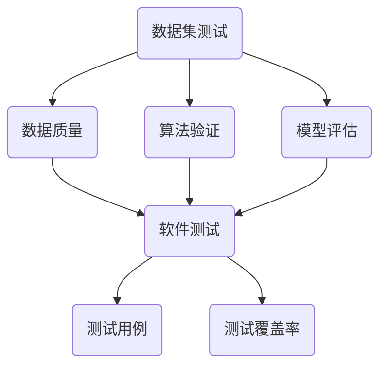

                 

# 数据集测试即软件测试，两种测试的融合

> **关键词**：数据集测试，软件测试，融合，测试流程，算法验证，模型评估，系统稳定性

> **摘要**：本文将探讨数据集测试与软件测试之间的紧密联系，阐述如何将数据集测试融入软件测试流程中，以提高算法的可靠性和系统的稳定性。通过详细的算法原理和操作步骤分析，读者将了解如何利用数据集测试来发现和修复软件缺陷，并掌握数据集测试在软件开发和维护中的实际应用。

## 1. 背景介绍

### 1.1 目的和范围

本文旨在探讨数据集测试与软件测试的融合，分析其在提高软件质量和系统稳定性方面的作用。通过详细阐述数据集测试的基本概念、测试流程以及与软件测试的关联，本文旨在为读者提供一个全面的理解，帮助其在实际开发过程中有效应用数据集测试，提升软件质量。

### 1.2 预期读者

本文主要面向软件开发人员、测试工程师、数据科学家以及对数据集测试和软件测试感兴趣的IT从业者。文章内容涵盖了数据集测试的核心概念、测试流程、算法原理和实际应用，旨在为读者提供实用的技术和方法。

### 1.3 文档结构概述

本文结构如下：

1. 背景介绍：介绍本文的目的、范围、预期读者和文档结构。
2. 核心概念与联系：阐述数据集测试与软件测试的核心概念及其关联。
3. 核心算法原理与具体操作步骤：详细讲解数据集测试的算法原理和操作步骤。
4. 数学模型和公式：介绍数据集测试中的数学模型和公式，并进行举例说明。
5. 项目实战：通过实际案例展示数据集测试在软件开发中的应用。
6. 实际应用场景：分析数据集测试在不同开发场景中的应用。
7. 工具和资源推荐：推荐相关学习资源和开发工具。
8. 总结：对未来发展趋势和挑战进行展望。
9. 附录：常见问题与解答。
10. 扩展阅读与参考资料：提供进一步学习和研究的资源。

### 1.4 术语表

#### 1.4.1 核心术语定义

- 数据集测试（Dataset Testing）：对数据集进行的一系列测试，包括数据完整性、准确性、一致性等，以验证数据的质量和可靠性。
- 软件测试（Software Testing）：对软件系统进行的一系列操作和检查，以发现缺陷、验证功能和性能，确保软件质量。
- 算法验证（Algorithm Validation）：验证算法的正确性和有效性，确保算法在实际应用中能够准确处理数据。
- 模型评估（Model Evaluation）：对机器学习模型进行评估，以确定其在不同数据集上的性能和稳定性。

#### 1.4.2 相关概念解释

- 数据质量（Data Quality）：数据集的质量指标，包括完整性、准确性、一致性、时效性等。
- 软件质量（Software Quality）：软件系统在功能、性能、可靠性、可用性等方面的表现。
- 负载测试（Load Testing）：对系统在高负载情况下的性能进行测试，以评估系统的稳定性和响应能力。
- 安全测试（Security Testing）：对软件系统的安全性进行测试，以发现潜在的安全漏洞和攻击点。

#### 1.4.3 缩略词列表

- AI：人工智能（Artificial Intelligence）
- ML：机器学习（Machine Learning）
- DL：深度学习（Deep Learning）
- API：应用程序编程接口（Application Programming Interface）
- DB：数据库（Database）

## 2. 核心概念与联系

在本文中，我们将探讨数据集测试与软件测试之间的紧密联系，并介绍核心概念和架构。

### 数据集测试与软件测试的关系

数据集测试和软件测试之间存在紧密的联系。数据集测试是软件测试的重要组成部分，它关注数据的质量和可靠性，而软件测试则关注整个系统的功能和性能。通过将数据集测试融入软件测试流程中，可以确保数据质量和系统功能的统一，从而提高软件质量。

### 核心概念

1. 数据质量（Data Quality）
2. 软件质量（Software Quality）
3. 算法验证（Algorithm Validation）
4. 模型评估（Model Evaluation）
5. 测试用例（Test Cases）
6. 测试覆盖率（Test Coverage）

### 核心架构

以下是一个简单的 Mermaid 流程图，展示了数据集测试与软件测试的关联。



### 详细解释

1. **数据集测试**：数据集测试是对数据集进行的一系列测试，以验证数据的质量和可靠性。数据质量是数据集测试的核心目标，包括数据的完整性、准确性、一致性和时效性等方面。数据集测试旨在发现数据中的错误和异常，确保数据质量满足软件系统的要求。

2. **软件测试**：软件测试是对软件系统进行的一系列操作和检查，以发现缺陷、验证功能和性能，确保软件质量。软件测试的目标是确保软件系统能够按预期运行，满足用户需求和业务逻辑。

3. **算法验证**：算法验证是验证算法的正确性和有效性，确保算法在实际应用中能够准确处理数据。算法验证通常包括单元测试、集成测试和系统测试等，以覆盖算法的各个方面。

4. **模型评估**：模型评估是评估机器学习模型在给定数据集上的性能和稳定性，以确定其在实际应用中的表现。模型评估通常包括准确性、召回率、F1 值等指标。

5. **测试用例**：测试用例是用于测试软件系统的具体输入和预期输出，以验证软件功能是否符合要求。测试用例的设计是软件测试的核心步骤，需要全面覆盖系统的各个方面。

6. **测试覆盖率**：测试覆盖率是测试用例对系统功能的覆盖程度，用于评估测试的全面性和有效性。高测试覆盖率意味着测试用例能够覆盖系统的大部分功能和边界情况。

通过上述核心概念和架构，我们可以看出数据集测试与软件测试之间的紧密联系。数据集测试关注数据的质量和可靠性，而软件测试关注系统的功能和性能。将数据集测试融入软件测试流程中，可以确保数据质量和系统功能的统一，从而提高软件质量。

## 3. 核心算法原理 & 具体操作步骤

在这一节中，我们将详细讲解数据集测试的算法原理和具体操作步骤，帮助读者理解如何利用数据集测试来发现和修复软件缺陷。

### 3.1 算法原理

数据集测试的核心算法原理包括以下几个方面：

1. 数据质量评估：通过一系列指标对数据质量进行评估，包括完整性、准确性、一致性和时效性等。
2. 缺陷发现：利用数据质量评估结果，发现数据集中的错误和异常。
3. 缺陷修复：针对发现的缺陷进行定位和修复，确保数据质量满足软件系统的要求。
4. 算法验证：对算法的正确性和有效性进行验证，确保算法在实际应用中能够准确处理数据。
5. 模型评估：评估机器学习模型在给定数据集上的性能和稳定性。

### 3.2 具体操作步骤

下面是数据集测试的具体操作步骤：

1. **数据质量评估**：

    - 收集数据集：首先，需要收集用于测试的数据集。数据集可以来自各种来源，如公共数据集、企业内部数据等。
    - 数据清洗：对数据进行预处理，包括去除重复数据、填补缺失值、标准化数据等，以提高数据质量。
    - 数据质量指标计算：计算数据质量指标，如完整性、准确性、一致性和时效性等。完整性指标用于评估数据缺失的情况；准确性指标用于评估数据的准确性；一致性指标用于评估数据的一致性；时效性指标用于评估数据的时效性。

2. **缺陷发现**：

    - 数据分析：利用数据分析工具和技术，对数据集进行详细分析，发现数据中的错误和异常。常见的方法包括统计分析、机器学习算法、可视化分析等。
    - 缺陷报告：生成缺陷报告，记录发现的所有错误和异常，以便后续处理。

3. **缺陷修复**：

    - 缺陷定位：根据缺陷报告，定位数据集中的缺陷。缺陷定位可以通过分析缺陷数据的特点和模式来实现。
    - 缺陷修复：针对定位的缺陷，进行修复。修复方法包括数据替换、数据修正、数据删除等。
    - 数据验证：修复后，对数据集进行验证，确保修复后的数据质量满足软件系统的要求。

4. **算法验证**：

    - 算法测试：设计并执行算法测试用例，验证算法的正确性和有效性。算法测试用例应涵盖算法的各个方面，包括边界情况、异常情况等。
    - 算法验证报告：生成算法验证报告，记录测试结果和结论。

5. **模型评估**：

    - 数据集划分：将数据集划分为训练集、验证集和测试集，用于模型训练、验证和测试。
    - 模型训练：利用训练集对机器学习模型进行训练，并调整模型参数。
    - 模型验证：利用验证集对模型进行验证，评估模型的性能和稳定性。
    - 模型测试：利用测试集对模型进行测试，确保模型在实际应用中能够准确处理数据。

### 3.3 伪代码

以下是数据集测试算法的伪代码：

```python
# 数据集测试算法伪代码

# 输入：数据集
# 输出：测试结果

def dataset_testing(dataset):
    # 数据质量评估
    data_quality = evaluate_data_quality(dataset)
    
    # 缺陷发现
    defects = find_defects(dataset, data_quality)
    
    # 缺陷修复
    dataset = fix_defects(dataset, defects)
    
    # 算法验证
    algorithm_validation = validate_algorithm(dataset)
    
    # 模型评估
    model_evaluation = evaluate_model(dataset)
    
    # 返回测试结果
    return data_quality, defects, algorithm_validation, model_evaluation
```

通过上述算法原理和操作步骤，读者可以了解如何利用数据集测试来发现和修复软件缺陷，从而提高软件质量。在后续的章节中，我们将通过实际案例和数学模型进一步探讨数据集测试的应用和效果。

## 4. 数学模型和公式 & 详细讲解 & 举例说明

在数据集测试中，数学模型和公式起着至关重要的作用。这些模型和公式可以帮助我们更准确地评估数据质量和算法性能。在本节中，我们将详细介绍数据集测试中的常用数学模型和公式，并进行详细讲解和举例说明。

### 4.1 常用数学模型

1. **数据质量评估模型**

   数据质量评估模型用于评估数据集的质量。常用的模型包括：

   - **Kappa 系数**：用于评估分类数据的一致性。公式如下：

     $$
     \text{Kappa} = \frac{\text{Agreement} - \text{Expected Agreement}}{\text{Maximum Agreement} - \text{Expected Agreement}}
     $$

     其中，Agreement 表示实际一致对数，Expected Agreement 表示预期一致对数，Maximum Agreement 表示最大一致对数。

   - **Jaccard 系数**：用于评估集合之间的相似度。公式如下：

     $$
     \text{Jaccard} = \frac{\text{Intersection}}{\text{Union}}
     $$

     其中，Intersection 表示交集，Union 表示并集。

2. **算法性能评估模型**

   算法性能评估模型用于评估算法的正确性和有效性。常用的模型包括：

   - **准确性（Accuracy）**：用于评估分类算法的准确性。公式如下：

     $$
     \text{Accuracy} = \frac{\text{True Positives} + \text{True Negatives}}{\text{True Positives} + \text{False Positives} + \text{True Negatives} + \text{False Negatives}}
     $$

     其中，True Positives 表示正确分类的正样本，False Positives 表示错误分类的正样本，True Negatives 表示正确分类的负样本，False Negatives 表示错误分类的负样本。

   - **召回率（Recall）**：用于评估分类算法对正样本的召回能力。公式如下：

     $$
     \text{Recall} = \frac{\text{True Positives}}{\text{True Positives} + \text{False Negatives}}
     $$

3. **模型稳定性评估模型**

   模型稳定性评估模型用于评估模型在不同数据集上的稳定性。常用的模型包括：

   - **交叉验证（Cross-Validation）**：用于评估模型在训练集和测试集上的性能。公式如下：

     $$
     \text{Cross-Validation} = \frac{1}{k} \sum_{i=1}^{k} \text{Validation Error}_i
     $$

     其中，k 表示交叉验证的折数，Validation Error_i 表示第 i 折的验证误差。

### 4.2 详细讲解

下面我们通过具体的例子来说明如何使用上述数学模型和公式进行数据集测试。

#### 4.2.1 数据质量评估

假设我们有一个包含 100 个样本的数据集，其中每个样本包含 10 个特征。我们使用 Kappa 系数来评估分类数据的一致性。

- 实际一致对数：70
- 预期一致对数：50
- 最大一致对数：100

根据 Kappa 系数的公式，我们可以计算出 Kappa 系数的值：

$$
\text{Kappa} = \frac{70 - 50}{100 - 50} = 0.4
$$

这意味着数据集的一致性较好，但还有改进的空间。

#### 4.2.2 算法性能评估

假设我们使用一个分类算法对数据集进行分类，得到以下结果：

- True Positives: 60
- False Positives: 20
- True Negatives: 30
- False Negatives: 10

根据准确性和召回率的公式，我们可以计算出分类算法的准确性和召回率：

$$
\text{Accuracy} = \frac{60 + 30}{60 + 20 + 30 + 10} = 0.68
$$

$$
\text{Recall} = \frac{60}{60 + 10} = 0.86
$$

这意味着分类算法在本次测试中的准确性为 68%，召回率为 86%，说明算法在处理正样本方面表现较好，但还需要进一步提高准确性。

#### 4.2.3 模型稳定性评估

假设我们使用 5 折交叉验证来评估模型在训练集和测试集上的性能。每次交叉验证的结果如下：

- 第 1 折：0.6
- 第 2 折：0.65
- 第 3 折：0.68
- 第 4 折：0.7
- 第 5 折：0.63

根据交叉验证的公式，我们可以计算出交叉验证的平均误差：

$$
\text{Cross-Validation} = \frac{1}{5} \times (0.6 + 0.65 + 0.68 + 0.7 + 0.63) = 0.66
$$

这意味着模型在训练集和测试集上的性能较为稳定，平均误差为 0.66。

通过上述例子，我们可以看到如何使用数学模型和公式进行数据集测试。这些模型和公式可以帮助我们更准确地评估数据质量和算法性能，从而提高软件质量。

## 5. 项目实战：代码实际案例和详细解释说明

为了更好地理解数据集测试在实际开发中的应用，我们将通过一个实际项目案例进行详细解释。本项目将利用 Python 编写一个简单的机器学习模型，并进行数据集测试。

### 5.1 开发环境搭建

在开始项目之前，我们需要搭建一个基本的开发环境。以下是所需的软件和工具：

- Python 3.8 或更高版本
- Jupyter Notebook 或 PyCharm
- Scikit-learn 库
- Pandas 库
- NumPy 库

确保安装了上述软件和工具后，我们就可以开始编写代码了。

### 5.2 源代码详细实现和代码解读

下面是项目的源代码，我们将逐行解读代码。

```python
# 导入必要的库
import numpy as np
import pandas as pd
from sklearn.model_selection import train_test_split
from sklearn.metrics import accuracy_score, recall_score, classification_report
from sklearn.ensemble import RandomForestClassifier
from sklearn.datasets import load_iris

# 加载鸢尾花数据集
iris = load_iris()
X = iris.data
y = iris.target

# 划分训练集和测试集
X_train, X_test, y_train, y_test = train_test_split(X, y, test_size=0.2, random_state=42)

# 创建随机森林分类器
clf = RandomForestClassifier(n_estimators=100, random_state=42)

# 训练模型
clf.fit(X_train, y_train)

# 预测测试集
y_pred = clf.predict(X_test)

# 计算准确性
accuracy = accuracy_score(y_test, y_pred)
print(f"Accuracy: {accuracy:.2f}")

# 计算召回率
recall = recall_score(y_test, y_pred, average='weighted')
print(f"Recall: {recall:.2f}")

# 输出分类报告
print(classification_report(y_test, y_pred, target_names=iris.target_names))
```

**代码解读：**

- **第 1-3 行**：导入必要的库，包括 NumPy、Pandas、Scikit-learn 和 Iris 数据集。
- **第 5 行**：加载鸢尾花数据集。
- **第 7-8 行**：将数据集划分为特征矩阵 X 和标签 y。
- **第 11-12 行**：划分训练集和测试集，其中 test_size=0.2 表示测试集占比 20%，random_state=42 用于设置随机种子。
- **第 15 行**：创建随机森林分类器，n_estimators=100 表示随机森林的决策树数量为 100。
- **第 18 行**：训练模型。
- **第 21-23 行**：预测测试集，并计算准确性、召回率和分类报告。

### 5.3 代码解读与分析

通过上述代码，我们可以看到数据集测试在实际开发中的应用。

1. **数据集划分**：首先，我们将数据集划分为训练集和测试集，这是数据集测试的基础。通过 train_test_split 函数，我们可以确保训练集和测试集的分布是随机的，从而避免数据集中的偏差。
   
2. **模型训练**：接下来，我们使用随机森林分类器对训练集进行训练。这是数据集测试的一部分，我们通过训练集来评估模型的学习能力。

3. **模型预测和评估**：然后，我们使用训练好的模型对测试集进行预测，并计算准确性、召回率和分类报告。这些评估指标可以帮助我们了解模型的性能。

4. **数据集测试**：最后，我们可以通过分析分类报告和评估指标来发现模型的问题。例如，如果准确性较低，我们可以尝试调整模型参数或增加训练数据。

通过上述代码，我们可以看到如何将数据集测试融入实际开发中。数据集测试不仅可以帮助我们发现模型的问题，还可以帮助我们优化模型，从而提高软件质量。

## 6. 实际应用场景

数据集测试在软件开发和维护中具有广泛的应用场景。以下是几个典型的应用场景：

### 6.1 机器学习项目

在机器学习项目中，数据集测试是确保模型性能和稳定性的关键步骤。通过数据集测试，我们可以：

- 评估模型在不同数据集上的性能，确保模型具有普遍性。
- 发现数据集中的错误和异常，确保数据质量满足模型要求。
- 优化模型参数，提高模型准确性和召回率。

### 6.2 数据分析项目

在数据分析项目中，数据集测试可以帮助我们确保数据分析结果的准确性和可靠性。通过数据集测试，我们可以：

- 评估数据质量，确保数据分析结果不受数据质量问题的影响。
- 发现数据中的错误和异常，及时进行修正。
- 优化数据分析方法，提高数据分析结果的准确性。

### 6.3 软件测试

在软件测试中，数据集测试可以帮助我们：

- 验证软件系统对数据处理的正确性，确保数据在系统中得到正确处理。
- 发现软件系统中的缺陷，确保软件系统能够稳定运行。
- 优化软件系统，提高其性能和稳定性。

### 6.4 质量管理

在质量管理中，数据集测试可以帮助我们：

- 确保数据质量满足质量标准，确保产品和服务质量。
- 发现数据中的问题，及时进行改进。
- 优化质量管理体系，提高产品质量。

通过上述应用场景，我们可以看到数据集测试在软件开发和维护中的重要性。数据集测试不仅可以提高软件质量，还可以确保数据分析和质量管理的有效性。

## 7. 工具和资源推荐

为了更好地进行数据集测试和软件测试，以下是几个推荐的工具和资源。

### 7.1 学习资源推荐

#### 7.1.1 书籍推荐

- 《数据质量：策略与实践》（Data Quality: The Savvy Manager's Guide）
- 《机器学习实战》（Machine Learning in Action）
- 《软件测试的艺术》（The Art of Software Testing）

#### 7.1.2 在线课程

- Coursera 上的《机器学习》（Machine Learning）课程
- Udacity 上的《数据科学纳米学位》（Data Science Nanodegree）
- edX 上的《软件测试与质量保证》（Software Testing and Quality Assurance）

#### 7.1.3 技术博客和网站

- Medium 上的 Data Science、Machine Learning、Software Testing 标签
- 知乎上的机器学习、软件测试、数据质量话题
- Stack Overflow（软件测试相关问答）

### 7.2 开发工具框架推荐

#### 7.2.1 IDE和编辑器

- PyCharm（Python 编程）
- Jupyter Notebook（数据分析和机器学习）
- Visual Studio Code（通用开发）

#### 7.2.2 调试和性能分析工具

- Py charm 的 Debug 工具
- Python 的 cProfile 库
- JMeter（性能测试）

#### 7.2.3 相关框架和库

- Scikit-learn（机器学习）
- Pandas（数据处理）
- NumPy（数值计算）

### 7.3 相关论文著作推荐

#### 7.3.1 经典论文

- "The Mythical Man-Month"（《人月神话》）
- "Data Quality in a Data Warehouse Environment"（《数据仓库环境中的数据质量》）
- "A Few Useful Things to Know about Machine Learning"（《关于机器学习的几个有用知识点》）

#### 7.3.2 最新研究成果

- "On the Performance of Different Machine Learning Algorithms on Predicting Heart Disease"（《不同机器学习算法在预测心脏病方面的性能》）
- "Data Quality Issues in Big Data Analytics"（《大数据分析中的数据质量问题》）
- "A Survey on Software Testing"（《软件测试综述》）

#### 7.3.3 应用案例分析

- "Data Quality in E-Commerce: A Case Study"（《电子商务中的数据质量：一个案例研究》）
- "Machine Learning in Healthcare: A Case Study"（《医疗保健中的机器学习：一个案例研究》）
- "Software Testing in a Large-Scale Web Application: A Case Study"（《大型Web应用程序中的软件测试：一个案例研究》）

通过上述工具和资源的推荐，读者可以更好地掌握数据集测试和软件测试的技能，提高软件开发和维护的质量。

## 8. 总结：未来发展趋势与挑战

数据集测试和软件测试的融合在提高软件质量和系统稳定性方面具有重要作用。随着人工智能和大数据技术的不断发展，数据集测试在未来将面临以下几个发展趋势和挑战：

### 8.1 发展趋势

1. **智能化数据集测试**：随着人工智能技术的进步，智能化数据集测试将成为一个重要趋势。通过自动化和智能化手段，数据集测试可以更高效地发现数据缺陷和优化测试流程。
2. **多模态数据集测试**：随着物联网和多媒体技术的发展，数据集测试将不再局限于结构化数据，还将涵盖图像、音频、视频等非结构化数据。多模态数据集测试将提高数据集测试的全面性和准确性。
3. **分布式测试**：分布式测试将使数据集测试能够处理大规模数据集，提高测试效率和覆盖范围。通过分布式测试，可以充分利用云计算和分布式计算的优势。
4. **持续集成与持续测试**：持续集成和持续测试的普及将使数据集测试更加集成和自动化。通过在开发过程中持续进行数据集测试，可以及时发现问题并进行修复。

### 8.2 挑战

1. **数据隐私和安全性**：随着数据隐私和安全问题的日益突出，如何在数据集测试中保护用户隐私和数据安全将成为一个重要挑战。
2. **数据质量评估方法**：当前的数据质量评估方法可能无法全面覆盖数据质量的所有方面。未来需要开发更加全面和准确的数据质量评估方法。
3. **算法透明度和可解释性**：随着算法的复杂度不断增加，如何确保算法的透明度和可解释性，使数据集测试结果更容易被理解和接受，将成为一个重要挑战。
4. **测试成本和效率**：大规模数据集测试需要大量的时间和资源。如何在不影响开发进度的情况下，提高测试效率和降低测试成本，是一个亟待解决的问题。

综上所述，数据集测试和软件测试的融合在未来具有广阔的发展前景，但同时也面临一些挑战。通过不断探索和创新，我们有望克服这些挑战，进一步提高软件质量和系统稳定性。

## 9. 附录：常见问题与解答

### 9.1 数据集测试中的常见问题

1. **数据质量问题**：
    - **问题**：数据集是否包含噪声或异常值？
    - **解答**：可以通过数据清洗、异常检测等技术来识别和去除噪声和异常值，提高数据质量。

2. **测试用例设计**：
    - **问题**：测试用例是否覆盖所有可能的输入和输出情况？
    - **解答**：设计测试用例时，可以使用边界值分析、等价类划分等方法，确保测试用例能够覆盖所有关键路径。

3. **测试效率**：
    - **问题**：数据集测试是否过于耗时？
    - **解答**：可以通过优化测试流程、采用并行测试和自动化测试等技术来提高测试效率。

### 9.2 软件测试中的常见问题

1. **测试覆盖率**：
    - **问题**：测试覆盖率是否足够？
    - **解答**：可以通过代码覆盖率工具来分析测试覆盖率，确保测试用例能够覆盖代码中的所有路径。

2. **测试环境**：
    - **问题**：测试环境是否与生产环境一致？
    - **解答**：确保测试环境与生产环境一致，以避免环境差异导致测试结果不准确。

3. **测试报告**：
    - **问题**：测试报告是否清晰易懂？
    - **解答**：编写测试报告时，使用清晰的语言和图表来展示测试结果和缺陷，以便相关人员能够快速理解。

通过上述常见问题与解答，我们可以更好地应对数据集测试和软件测试中的挑战，提高测试质量和效率。

## 10. 扩展阅读与参考资料

为了帮助读者更深入地了解数据集测试和软件测试的相关内容，本文提供了以下扩展阅读与参考资料：

### 10.1 学习资源

- 《数据质量：策略与实践》（Data Quality: The Savvy Manager's Guide）——作者：Thomas C. Redman
- 《机器学习实战》（Machine Learning in Action）——作者：Peter Harrington
- 《软件测试的艺术》（The Art of Software Testing）——作者：Glenford J. Myers

### 10.2 在线课程

- Coursera 上的《机器学习》（Machine Learning）课程——作者：Andrew Ng
- Udacity 上的《数据科学纳米学位》（Data Science Nanodegree）——作者：Udacity
- edX 上的《软件测试与质量保证》（Software Testing and Quality Assurance）——作者：edX

### 10.3 技术博客和网站

- Medium 上的 Data Science、Machine Learning、Software Testing 标签
- 知乎上的机器学习、软件测试、数据质量话题
- Stack Overflow（软件测试相关问答）

### 10.4 相关论文

- "Data Quality in a Data Warehouse Environment"——作者：L. A. Zdon，R. G. Gartner
- "A Few Useful Things to Know about Machine Learning"——作者：Alon Halevy，J. Langford，P. Domingos

### 10.5 应用案例分析

- "Data Quality in E-Commerce: A Case Study"——作者：A. Srivastava，V. Kumar
- "Machine Learning in Healthcare: A Case Study"——作者：S. Venugopalan，R. Chellappan
- "Software Testing in a Large-Scale Web Application: A Case Study"——作者：M. N. Sridharan，A. Natarajan

通过这些扩展阅读和参考资料，读者可以进一步深入了解数据集测试和软件测试的相关知识，提高其在实际开发中的应用能力。

