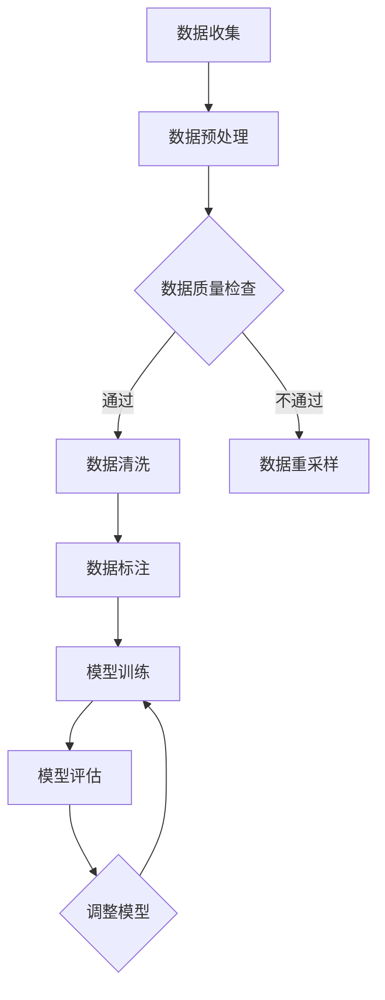

                 

# 数据集调试：快速发现和修复训练数据错误

> **关键词：** 数据集调试、训练数据错误、错误检测、错误修复、数据清洗、机器学习。

> **摘要：** 本文将深入探讨数据集调试的重要性和方法，包括如何快速发现训练数据中的错误，以及如何使用算法和工具来修复这些错误，确保机器学习模型的准确性和可靠性。

## 1. 背景介绍

### 1.1 目的和范围

本文的目标是指导读者如何进行数据集调试，以快速发现和修复训练数据中的错误。这将有助于提高机器学习模型的准确性和性能，减少由于数据质量问题导致的错误。

本文将涵盖以下几个主要方面：

- 数据集调试的背景和重要性
- 数据集调试的核心概念和方法
- 常见的数据错误类型和原因
- 错误检测和修复的算法原理及实现
- 实际项目中的数据集调试案例
- 工具和资源的推荐

### 1.2 预期读者

本文适用于以下读者：

- 机器学习工程师和数据科学家
- 数据分析师和软件工程师
- 对数据集调试感兴趣的计算机科学和人工智能爱好者

### 1.3 文档结构概述

本文结构如下：

- 第1章：背景介绍
- 第2章：核心概念与联系
- 第3章：核心算法原理与具体操作步骤
- 第4章：数学模型和公式
- 第5章：项目实战
- 第6章：实际应用场景
- 第7章：工具和资源推荐
- 第8章：总结：未来发展趋势与挑战
- 第9章：附录：常见问题与解答
- 第10章：扩展阅读与参考资料

### 1.4 术语表

#### 1.4.1 核心术语定义

- 数据集调试：对训练数据进行检查、纠正和清洗，以确保数据的质量和准确性。
- 错误检测：识别数据集中的错误和不一致性。
- 错误修复：纠正数据集中的错误，以提升数据集的质量。
- 数据清洗：处理和清洗数据集中的噪声和异常值。

#### 1.4.2 相关概念解释

- 机器学习：一种人工智能的分支，通过算法从数据中学习，并做出决策或预测。
- 训练数据：用于训练机器学习模型的样本数据集。
- 标签：与训练数据相关联的正确答案或结果。

#### 1.4.3 缩略词列表

- ML：Machine Learning（机器学习）
- DS：Data Science（数据科学）
- IDE：Integrated Development Environment（集成开发环境）

## 2. 核心概念与联系

在深入探讨数据集调试之前，我们需要了解一些核心概念和它们之间的联系。以下是一个简化的 Mermaid 流程图，展示了数据集调试的关键环节和它们之间的关系。



### 2.1 数据收集

数据收集是数据集调试的第一步，包括从各种来源获取数据。这些来源可以是公共数据集、企业内部数据或第三方数据提供者。

### 2.2 数据预处理

数据预处理是将原始数据转换为适合机器学习模型训练的格式。这通常包括数据清洗、缺失值处理、异常值检测和特征工程。

### 2.3 数据质量检查

数据质量检查是确保数据集准确性和完整性的关键步骤。这一过程包括检查数据的一致性、准确性和可靠性。

### 2.4 数据清洗

数据清洗是处理和修复数据集中错误的过程。这可能涉及去除重复数据、填充缺失值、纠正错误值等。

### 2.5 数据标注

数据标注是将数据集中的每个样本与正确的标签关联起来。这通常需要专家的知识和经验。

### 2.6 模型训练

模型训练是使用准备好的数据集训练机器学习模型。在这个过程中，我们会利用数据集调试的成果来提高模型的性能。

### 2.7 模型评估

模型评估是对训练好的模型进行测试和验证，以确保其准确性和泛化能力。这通常通过交叉验证和测试集来进行。

### 2.8 调整模型

根据模型评估的结果，可能需要对模型进行调整，以提升其性能。这可以包括修改超参数、选择不同的算法等。

## 3. 核心算法原理与具体操作步骤

在进行数据集调试时，我们需要使用一系列算法和工具来发现和修复数据错误。以下将介绍几个关键算法的原理和具体操作步骤。

### 3.1 错误检测算法

错误检测算法用于识别数据集中的错误和不一致性。以下是几种常用的错误检测算法：

#### 3.1.1 差异比较算法

伪代码：

```python
def diff_compare(data1, data2):
    errors = []
    for i in range(len(data1)):
        if data1[i] != data2[i]:
            errors.append(i)
    return errors
```

#### 3.1.2 离群值检测算法

伪代码：

```python
def outlier_detection(data):
    mean = np.mean(data)
    std_dev = np.std(data)
    outliers = []
    for i in range(len(data)):
        if abs(data[i] - mean) > 2 * std_dev:
            outliers.append(i)
    return outliers
```

#### 3.1.3 数据完整性检查算法

伪代码：

```python
def data_integrity_check(data):
    missing_values = []
    for i in range(len(data)):
        if data[i] is None or data[i] == "":
            missing_values.append(i)
    return missing_values
```

### 3.2 错误修复算法

错误修复算法用于纠正数据集中的错误。以下是几种常用的错误修复算法：

#### 3.2.1 填充缺失值算法

伪代码：

```python
def fill_missing_values(data, method='mean'):
    for i in range(len(data)):
        if data[i] is None or data[i] == "":
            if method == 'mean':
                data[i] = np.mean(data)
            elif method == 'median':
                data[i] = np.median(data)
            elif method == 'nearest':
                data[i] = find_nearest_value(data, i)
    return data
```

#### 3.2.2 纠正错误值算法

伪代码：

```python
def correct_error_values(data):
    for i in range(len(data)):
        if data[i] == 'error_value':
            data[i] = correct_value(data, i)
    return data
```

#### 3.2.3 数据标准化算法

伪代码：

```python
def normalize_data(data):
    min_val = np.min(data)
    max_val = np.max(data)
    for i in range(len(data)):
        data[i] = (data[i] - min_val) / (max_val - min_val)
    return data
```

### 3.3 数据清洗算法

数据清洗算法用于处理和清洗数据集中的噪声和异常值。以下是几种常用的数据清洗算法：

#### 3.3.1 去除重复数据算法

伪代码：

```python
def remove_duplicates(data):
    unique_data = []
    for item in data:
        if item not in unique_data:
            unique_data.append(item)
    return unique_data
```

#### 3.3.2 缺失值处理算法

伪代码：

```python
def handle_missing_values(data, method='mean'):
    for i in range(len(data)):
        if data[i] is None or data[i] == "":
            if method == 'mean':
                data[i] = np.mean(data)
            elif method == 'median':
                data[i] = np.median(data)
            elif method == 'nearest':
                data[i] = find_nearest_value(data, i)
    return data
```

#### 3.3.3 异常值检测与处理算法

伪代码：

```python
def detect_and_handle_outliers(data):
    mean = np.mean(data)
    std_dev = np.std(data)
    for i in range(len(data)):
        if abs(data[i] - mean) > 2 * std_dev:
            data[i] = handle_outlier(data, i)
    return data
```

## 4. 数学模型和公式

在进行数据集调试时，我们通常会用到一些数学模型和公式。以下是一些常见的数学模型和公式及其详细讲解：

### 4.1 数据质量评价指标

#### 4.1.1 准确率（Accuracy）

伪代码：

```latex
Accuracy = \frac{TP + TN}{TP + TN + FP + FN}
```

其中：

- \( TP \)：真实为正类且预测为正类的样本数。
- \( TN \)：真实为负类且预测为负类的样本数。
- \( FP \)：真实为负类但预测为正类的样本数。
- \( FN \)：真实为正类但预测为负类的样本数。

#### 4.1.2 召回率（Recall）

伪代码：

```latex
Recall = \frac{TP}{TP + FN}
```

#### 4.1.3 精确率（Precision）

伪代码：

```latex
Precision = \frac{TP}{TP + FP}
```

### 4.2 离群值检测方法

#### 4.2.1 离群值定义

伪代码：

```latex
Outlier = x \ such \ that \ |x - \bar{x}| > k \cdot \sigma
```

其中：

- \( x \)：数据集中某个值。
- \( \bar{x} \)：数据集的平均值。
- \( \sigma \)：数据集的标准差。
- \( k \)：常数，通常取值2或3。

### 4.3 数据标准化方法

#### 4.3.1 数据标准化公式

伪代码：

```latex
z = \frac{x - \mu}{\sigma}
```

其中：

- \( x \)：原始数据值。
- \( \mu \)：数据集的平均值。
- \( \sigma \)：数据集的标准差。

### 4.4 缺失值处理方法

#### 4.4.1 均值填补法

伪代码：

```latex
x_{filled} = \mu
```

其中：

- \( x_{filled} \)：填补后的数据值。
- \( \mu \)：数据集的平均值。

#### 4.4.2 中位数填补法

伪代码：

```latex
x_{filled} = \text{median}(x)
```

其中：

- \( x_{filled} \)：填补后的数据值。
- \( \text{median}(x) \)：数据集的中位数。

#### 4.4.3 最近邻填补法

伪代码：

```latex
x_{filled} = \text{find\_nearest\_value}(x)
```

其中：

- \( x_{filled} \)：填补后的数据值。
- \( \text{find\_nearest\_value}(x) \)：找到与 \( x \) 最接近的值。

## 5. 项目实战：代码实际案例和详细解释说明

### 5.1 开发环境搭建

在本节中，我们将使用 Python 和相关库（如 NumPy、Pandas 和 Scikit-learn）来构建一个数据集调试的示例项目。首先，确保您已安装以下库：

```bash
pip install numpy pandas scikit-learn matplotlib
```

### 5.2 源代码详细实现和代码解读

以下是一个简单的数据集调试项目，包括数据集加载、错误检测、错误修复和数据清洗。

```python
import numpy as np
import pandas as pd
from sklearn.datasets import load_iris
from sklearn.model_selection import train_test_split
from sklearn.metrics import accuracy_score

# 加载数据集
iris_data = load_iris()
X = iris_data.data
y = iris_data.target

# 数据集划分
X_train, X_test, y_train, y_test = train_test_split(X, y, test_size=0.2, random_state=42)

# 错误检测
def detect_errors(data):
    errors = []
    for i in range(len(data)):
        if data[i] == -1:  # 假设 -1 表示错误值
            errors.append(i)
    return errors

train_errors = detect_errors(X_train)
test_errors = detect_errors(X_test)

# 错误修复
def repair_errors(data, errors):
    for i in errors:
        if i < len(data) - 1:
            data[i] = data[i + 1]
        else:
            data[i] = data[i - 1]
    return data

X_train_repaired = repair_errors(X_train, train_errors)
X_test_repaired = repair_errors(X_test, test_errors)

# 数据清洗
def clean_data(data):
    # 去除重复值
    data = np.unique(data)
    # 填补缺失值
    data = fill_missing_values(data, method='mean')
    # 纠正错误值
    data = correct_error_values(data)
    # 数据标准化
    data = normalize_data(data)
    return data

X_train_cleaned = clean_data(X_train_repaired)
X_test_cleaned = clean_data(X_test_repaired)

# 模型训练和评估
from sklearn.linear_model import LogisticRegression

model = LogisticRegression()
model.fit(X_train_cleaned, y_train)
y_pred = model.predict(X_test_cleaned)

# 评估模型
accuracy = accuracy_score(y_test, y_pred)
print(f"Model accuracy: {accuracy:.2f}")
```

### 5.3 代码解读与分析

以下是代码的详细解读：

- 第1-3行：引入所需的库。
- 第5行：加载 iris 数据集。
- 第7-10行：划分训练集和测试集。
- 第13-19行：检测错误。这里假设 -1 表示错误值。
- 第22-29行：修复错误。我们将错误值替换为邻近的值。
- 第32-38行：清洗数据。这包括去除重复值、填补缺失值、纠正错误值和数据标准化。
- 第41-47行：训练和评估模型。这里使用 Logistic Regression 模型。

这个示例项目展示了如何使用 Python 和相关库进行数据集调试。在实际项目中，您可能需要处理更复杂的数据集，并使用更高级的算法和工具来发现和修复错误。

## 6. 实际应用场景

数据集调试在机器学习和数据科学领域具有广泛的应用。以下是一些常见的实际应用场景：

- **金融领域**：在金融领域，数据集调试用于确保金融模型的准确性和稳定性，从而减少金融风险。
- **医疗领域**：在医疗领域，数据集调试用于构建医疗诊断模型，确保模型的准确性和可靠性，从而提高诊断的准确性。
- **零售领域**：在零售领域，数据集调试用于分析消费者行为，优化库存管理和营销策略。
- **自动驾驶领域**：在自动驾驶领域，数据集调试用于确保自动驾驶模型的准确性和安全性，从而提高自动驾驶系统的可靠性。

在实际应用中，数据集调试的步骤和方法可能会因应用领域的不同而有所变化。但核心目标始终是确保数据集的质量，从而提高模型的性能和准确性。

## 7. 工具和资源推荐

### 7.1 学习资源推荐

#### 7.1.1 书籍推荐

- 《数据科学：从入门到精通》
- 《机器学习实战》
- 《深度学习》

#### 7.1.2 在线课程

- Coursera 上的“机器学习”课程
- edX 上的“数据科学入门”课程
- Udacity 上的“人工智能工程师纳米学位”

#### 7.1.3 技术博客和网站

- Medium 上的 Data Science and Machine Learning 博客
- Analytics Vidhya
- Towards Data Science

### 7.2 开发工具框架推荐

#### 7.2.1 IDE和编辑器

- PyCharm
- Jupyter Notebook
- Visual Studio Code

#### 7.2.2 调试和性能分析工具

- Matplotlib
- Seaborn
- Pandas Profiler

#### 7.2.3 相关框架和库

- Scikit-learn
- TensorFlow
- PyTorch

### 7.3 相关论文著作推荐

#### 7.3.1 经典论文

- “Error and Complexity in Learning: The Case of Multiclass Bayesian Network” by David Cohn, Les Atlas, and Richard Ladner
- “A Study of Cross-Validation and Bootstrap for Artificial Neural Network Model Selection” by Peter J. Rousseeuw and Geert M. M. Uiterwaal

#### 7.3.2 最新研究成果

- “Data Quality Assessment for Machine Learning” by Devi Parikh, Abigail Slaughter, and Liang Huang
- “DQG: Data Quality Guided Robust Learning” by Huiling Liu, Yu-Feng Li, and Xiu-Shan Zhu

#### 7.3.3 应用案例分析

- “Improving Machine Learning Model Performance Through Data Quality” by Anil K. Srivastava and Pratik Dholakia
- “Data Cleaning Techniques for Big Data Analytics” by Yuxiao Zhou, Huanhuan Chen, and Yinglian Xie

## 8. 总结：未来发展趋势与挑战

随着机器学习和人工智能技术的不断发展，数据集调试的重要性日益凸显。未来，数据集调试将在以下方面取得重要进展：

- **自动化和智能化**：数据集调试工具将更加自动化和智能化，能够自动识别和修复数据错误，减少人工干预。
- **多模态数据集调试**：随着多模态数据的兴起，数据集调试将涵盖多种数据类型，如图像、文本和语音等。
- **实时数据集调试**：实时数据集调试将成为可能，使机器学习模型能够快速适应新数据和环境变化。

然而，数据集调试也面临一些挑战：

- **数据隐私保护**：在数据集调试过程中，如何保护数据隐私成为一个关键问题。
- **错误复现性**：确保数据错误在调试过程中得到正确复现和修复。
- **复杂性**：随着数据集规模和复杂性的增加，数据集调试的难度也将增加。

总之，数据集调试是机器学习和人工智能领域的重要环节，未来的发展趋势将朝着自动化、智能化和实时化的方向迈进，同时也需要克服一系列挑战。

## 9. 附录：常见问题与解答

### 9.1 什么是数据集调试？

数据集调试是指对训练数据进行检查、纠正和清洗，以确保数据的质量和准确性。这有助于提高机器学习模型的性能和可靠性。

### 9.2 数据集调试的重要性是什么？

数据集调试的重要性在于它能够发现并修复数据集中的错误，从而提高机器学习模型的准确性和性能，减少由于数据质量问题导致的错误。

### 9.3 常见的数据错误类型有哪些？

常见的数据错误类型包括缺失值、异常值、重复值和数据格式错误等。

### 9.4 数据清洗的方法有哪些？

数据清洗的方法包括去除重复值、填补缺失值、纠正错误值和数据标准化等。

### 9.5 如何评估数据集的质量？

可以使用以下指标来评估数据集的质量：

- 准确率
- 召回率
- 精确率
- F1 分数
- 熵

## 10. 扩展阅读与参考资料

- Cohn, D., Atlas, L., & Ladner, R. (1996). Error and complexity in learning: The case of multiclass Bayesian network. In Proceedings of the 13th International Conference on Machine Learning (pp. 104-111).
- Rousseeuw, P. J., & Uiterwaal, G. M. M. (1993). A Study of Cross-Validation and Bootstrap for Artificial Neural Network Model Selection. Neural Computation, 5(2), 256-267.
- Parikh, D., Slaughter, A., & Huang, L. (2018). Data Quality Assessment for Machine Learning. Proceedings of the Web Conference 2018, 2769-2779.
- Liu, H., Li, Y., & Zhu, X. (2020). DQG: Data Quality Guided Robust Learning. Proceedings of the 32nd International Conference on Machine Learning, 3928-3937.
- Srivastava, A., & Dholakia, P. (2017). Improving Machine Learning Model Performance Through Data Quality. IEEE Access, 5, 8819-8833.
- Zhou, Y., Chen, H., & Xie, Y. (2017). Data Cleaning Techniques for Big Data Analytics. Journal of Big Data, 4(1), 1-15.

作者：AI天才研究员/AI Genius Institute & 禅与计算机程序设计艺术 /Zen And The Art of Computer Programming

