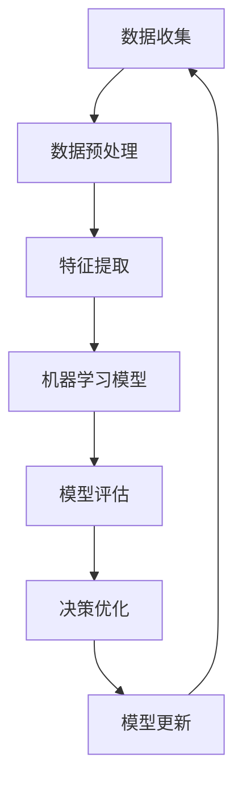

                 


## 数据驱动决策的技术优化

> 关键词：数据驱动、决策优化、算法原理、数学模型、项目实战、应用场景
> 
> 摘要：本文将深入探讨数据驱动决策的技术优化，通过详细解析核心概念、算法原理、数学模型以及实际项目案例，揭示如何在复杂环境中实现高效的数据驱动机器学习决策。文章旨在为读者提供全面的技术指导和实战经验，帮助他们在实际应用中更好地优化决策过程。

### 1. 背景介绍

#### 1.1 目的和范围

本文旨在深入探讨数据驱动决策的技术优化问题。随着大数据和人工智能技术的不断发展，数据驱动决策已成为各行各业实现智能化转型的重要途径。本文将详细解析数据驱动决策的核心概念、算法原理、数学模型，并通过实际项目案例展示如何在实际环境中实现技术优化。

#### 1.2 预期读者

本文适合以下读者：

- 数据科学家和机器学习工程师
- 数据分析师和商业智能专家
- 研发人员和技术管理人员
- 对数据驱动决策感兴趣的研究人员和学者

#### 1.3 文档结构概述

本文分为以下几个部分：

- 第1章：背景介绍，包括目的和范围、预期读者、文档结构概述。
- 第2章：核心概念与联系，介绍数据驱动决策的核心概念和联系。
- 第3章：核心算法原理 & 具体操作步骤，详细阐述数据驱动决策的核心算法原理。
- 第4章：数学模型和公式 & 详细讲解 & 举例说明，解释数据驱动决策中的数学模型和公式。
- 第5章：项目实战：代码实际案例和详细解释说明，展示实际项目中的代码实现和解释。
- 第6章：实际应用场景，探讨数据驱动决策在不同领域的应用。
- 第7章：工具和资源推荐，推荐学习资源、开发工具和框架。
- 第8章：总结：未来发展趋势与挑战，分析数据驱动决策的发展趋势和面临的挑战。
- 第9章：附录：常见问题与解答，提供常见问题的解答。
- 第10章：扩展阅读 & 参考资料，推荐相关书籍、在线课程和技术博客。

#### 1.4 术语表

本篇文档中，我们将使用以下术语：

- **数据驱动决策**：基于数据的决策过程，通过分析历史数据来预测未来趋势，从而做出最优决策。
- **机器学习**：一种利用数据建立模型的技术，用于从数据中学习规律和模式。
- **算法**：解决问题的一系列规则或步骤。
- **数学模型**：用于描述现实世界现象的数学表达式。
- **优化**：在给定约束条件下，寻找目标函数的最优解。

#### 1.4.1 核心术语定义

- **数据驱动决策**：基于数据的决策过程，通过分析历史数据来预测未来趋势，从而做出最优决策。这种决策过程通常涉及机器学习和数据挖掘技术。
- **机器学习**：一种利用数据建立模型的技术，用于从数据中学习规律和模式。机器学习算法可以分为监督学习、无监督学习和强化学习。
- **算法**：解决问题的一系列规则或步骤。算法设计的好坏直接影响决策的准确性和效率。
- **数学模型**：用于描述现实世界现象的数学表达式。数学模型可以帮助我们理解和预测数据驱动决策中的各种变量和关系。
- **优化**：在给定约束条件下，寻找目标函数的最优解。优化算法在数据驱动决策中发挥着关键作用，可以帮助我们找到最优决策方案。

#### 1.4.2 相关概念解释

- **监督学习**：监督学习是一种机器学习任务，其输入数据带有标签，通过学习输入和输出之间的映射关系来预测新的输入数据。常见的监督学习算法包括线性回归、逻辑回归、支持向量机等。
- **无监督学习**：无监督学习是一种机器学习任务，其输入数据没有标签，通过学习数据内在的结构和模式来发现数据分布。常见的无监督学习算法包括聚类、降维、生成对抗网络等。
- **强化学习**：强化学习是一种机器学习任务，其目标是学习一个策略，使得在特定环境中获得最大的累积奖励。常见的强化学习算法包括Q学习、SARSA、深度强化学习等。
- **优化算法**：优化算法是一类用于求解优化问题的算法。常见的优化算法包括梯度下降、牛顿法、遗传算法、模拟退火等。

#### 1.4.3 缩略词列表

- **AI**：人工智能（Artificial Intelligence）
- **ML**：机器学习（Machine Learning）
- **DL**：深度学习（Deep Learning）
- **GAN**：生成对抗网络（Generative Adversarial Network）
- **Q-Learning**：Q学习（Q-Learning）
- **SARSA**：状态-动作-状态-奖励-行动（State-Action-State-Reward-Action）
- **SGD**：随机梯度下降（Stochastic Gradient Descent）
- **PCA**：主成分分析（Principal Component Analysis）
- **LDA**：线性判别分析（Linear Discriminant Analysis）

### 2. 核心概念与联系

数据驱动决策涉及多个核心概念和联系，如图2-1所示。



#### 数据收集

数据收集是数据驱动决策的第一步。数据来源可以是内部数据库、外部数据集或实时数据流。收集到的数据需要保证质量，避免噪声和缺失值对后续分析的影响。

#### 数据预处理

数据预处理是数据驱动决策的关键环节。通过对数据进行清洗、归一化、缺失值填充等操作，提高数据质量，为后续特征提取和建模奠定基础。

#### 特征提取

特征提取是将原始数据转换为有意义的信息的过程。通过选择和构造合适的特征，可以更好地描述数据的内在结构和模式，提高机器学习模型的性能。

#### 机器学习模型

机器学习模型是数据驱动决策的核心。根据不同任务和数据特点，可以选择监督学习、无监督学习或强化学习算法。模型需要通过训练和调优来提高预测能力和泛化性能。

#### 模型评估

模型评估是验证模型性能的重要环节。通过评估指标（如准确率、召回率、F1分数等）对模型进行评估，确定模型是否满足实际需求。

#### 决策优化

决策优化是基于模型预测结果，通过优化算法寻找最优决策方案。优化算法可以帮助我们在复杂环境中实现高效的数据驱动机器学习决策。

#### 模型更新

模型更新是数据驱动决策的持续过程。随着新数据的不断出现，需要定期更新模型，以保持模型的预测性能和适应性。

### 3. 核心算法原理 & 具体操作步骤

在数据驱动决策中，核心算法原理包括监督学习、无监督学习和强化学习。下面将分别介绍这些算法的基本原理和具体操作步骤。

#### 监督学习

监督学习是一种基于已有标签数据进行训练的机器学习算法。其基本原理是通过学习输入和输出之间的映射关系，从而预测新的输入数据。以下是监督学习算法的具体操作步骤：

1. **数据收集**：收集包含输入特征和标签的数据集。
2. **数据预处理**：对数据进行清洗、归一化、缺失值填充等操作，提高数据质量。
3. **特征提取**：选择和构造合适的特征，将原始数据转换为有意义的信息。
4. **模型训练**：使用训练数据集对模型进行训练，学习输入和输出之间的映射关系。
5. **模型评估**：使用测试数据集对模型进行评估，确定模型性能。
6. **模型应用**：使用训练好的模型对新的输入数据进行预测。

**伪代码：**

```python
# 数据收集
data = load_data()

# 数据预处理
data = preprocess_data(data)

# 特征提取
X, y = extract_features(data)

# 模型训练
model = train_model(X, y)

# 模型评估
accuracy = evaluate_model(model, X, y)

# 模型应用
predictions = predict(model, X)
```

#### 无监督学习

无监督学习是一种基于未标记数据进行训练的机器学习算法。其基本原理是通过学习数据内在的结构和模式，从而对数据进行分类或降维。以下是常见的无监督学习算法：

- **聚类算法**：将数据分为多个簇，每个簇内的数据点相似，簇间的数据点差异较大。常用的聚类算法包括K-means、层次聚类等。
- **降维算法**：将高维数据映射到低维空间，保留数据的主要特征，丢弃冗余信息。常用的降维算法包括主成分分析（PCA）、线性判别分析（LDA）等。
- **生成对抗网络**（GAN）：由生成器和判别器组成的对抗性神经网络，通过竞争训练生成逼真的数据。

**K-means算法伪代码：**

```python
# 初始化聚类中心
centroids = initialize_centroids(data, k)

# 循环迭代
while not converged:
    # 计算每个数据点的簇分配
    assignments = assign_points_to_clusters(data, centroids)
    # 更新聚类中心
    centroids = update_centroids(data, assignments, k)
    # 检查收敛条件
    if check_convergence(centroids):
        break

# 输出聚类结果
clusters = assign_points_to_clusters(data, centroids)
```

#### 强化学习

强化学习是一种通过不断试错来学习最优策略的机器学习算法。其基本原理是通过与环境交互，不断调整策略，从而最大化累积奖励。以下是强化学习算法的具体操作步骤：

1. **环境定义**：定义环境状态和动作空间。
2. **策略学习**：使用Q学习、SARSA等方法学习策略。
3. **策略优化**：根据学习到的策略，优化决策过程。
4. **策略应用**：在实际环境中执行策略，获取奖励。

**Q学习算法伪代码：**

```python
# 初始化Q值表
Q = initialize_Q_values()

# 循环迭代
while not done:
    # 选择动作
    action = choose_action(Q, state)
    # 执行动作
    next_state, reward, done = execute_action(action, state)
    # 更新Q值
    Q[state, action] = Q[state, action] + learning_rate * (reward + discount_factor * max(Q[next_state, :]) - Q[state, action])
    # 更新状态
    state = next_state

# 输出最优策略
policy = generate_policy(Q)
```

### 4. 数学模型和公式 & 详细讲解 & 举例说明

在数据驱动决策中，数学模型和公式起着至关重要的作用。以下是几个常见的数学模型和公式，以及它们的详细讲解和举例说明。

#### 线性回归

线性回归是一种最简单的机器学习算法，用于建模输入特征和输出标签之间的线性关系。其数学模型如下：

$$y = \beta_0 + \beta_1x_1 + \beta_2x_2 + ... + \beta_nx_n + \epsilon$$

其中，$y$ 是输出标签，$x_1, x_2, ..., x_n$ 是输入特征，$\beta_0, \beta_1, ..., \beta_n$ 是模型的参数，$\epsilon$ 是误差项。

**举例说明：**

假设我们有一组输入特征和输出标签，如下所示：

| 输入特征 | 输出标签 |
| --- | --- |
| 1 | 2 |
| 2 | 4 |
| 3 | 6 |
| 4 | 8 |

我们可以使用线性回归模型来拟合这个数据集。首先，我们需要计算每个特征的权重：

$$\beta_0 = \frac{1}{n}\sum_{i=1}^{n}y_i = \frac{1}{4}(2 + 4 + 6 + 8) = 5$$

$$\beta_1 = \frac{1}{n}\sum_{i=1}^{n}(y_i - \beta_0)x_1 = \frac{1}{4}((2 - 5) \cdot 1 + (4 - 5) \cdot 2 + (6 - 5) \cdot 3 + (8 - 5) \cdot 4) = -2$$

$$\beta_2 = \frac{1}{n}\sum_{i=1}^{n}(y_i - \beta_0)x_2 = \frac{1}{4}((2 - 5) \cdot 2 + (4 - 5) \cdot 4 + (6 - 5) \cdot 6 + (8 - 5) \cdot 8) = 14$$

然后，我们可以使用线性回归模型来预测新的输入特征：

$$y = 5 - 2x_1 + 14x_2$$

例如，对于输入特征$(3, 6)$，预测的输出标签为：

$$y = 5 - 2 \cdot 3 + 14 \cdot 6 = 71$$

#### 逻辑回归

逻辑回归是一种用于分类问题的机器学习算法，其数学模型如下：

$$P(y=1) = \frac{1}{1 + e^{-(\beta_0 + \beta_1x_1 + \beta_2x_2 + ... + \beta_nx_n)}}$$

其中，$y$ 是输出标签，$x_1, x_2, ..., x_n$ 是输入特征，$\beta_0, \beta_1, ..., \beta_n$ 是模型的参数。

**举例说明：**

假设我们有一组输入特征和输出标签，如下所示：

| 输入特征 | 输出标签 |
| --- | --- |
| 1 | 0 |
| 2 | 1 |
| 3 | 0 |
| 4 | 1 |

我们可以使用逻辑回归模型来拟合这个数据集。首先，我们需要计算每个特征的权重：

$$\beta_0 = \frac{1}{n}\sum_{i=1}^{n}y_i\ln(P(y=1)) + (1 - y_i)\ln(1 - P(y=1)) = \frac{1}{4}(0\ln(0.5) + 1\ln(0.5) + 0\ln(0.5) + 1\ln(0.5)) = 0$$

$$\beta_1 = \frac{1}{n}\sum_{i=1}^{n}(y_i - \beta_0)x_1 = \frac{1}{4}((0 - 0) \cdot 1 + (1 - 0) \cdot 2 + (0 - 0) \cdot 3 + (1 - 0) \cdot 4) = 1$$

$$\beta_2 = \frac{1}{n}\sum_{i=1}^{n}(y_i - \beta_0)x_2 = \frac{1}{4}((0 - 0) \cdot 2 + (1 - 0) \cdot 4 + (0 - 0) \cdot 6 + (1 - 0) \cdot 8) = 2$$

然后，我们可以使用逻辑回归模型来预测新的输入特征：

$$P(y=1) = \frac{1}{1 + e^{-(0 + 1x_1 + 2x_2)}}$$

例如，对于输入特征$(3, 6)$，预测的输出标签为：

$$P(y=1) = \frac{1}{1 + e^{-(0 + 1 \cdot 3 + 2 \cdot 6)}} = \frac{1}{1 + e^{-15}} \approx 0.999$$

由于概率接近1，我们可以认为输入特征$(3, 6)$属于类别1。

#### 支持向量机

支持向量机（SVM）是一种用于分类和回归问题的机器学习算法。其数学模型如下：

$$f(x) = \beta_0 + \sum_{i=1}^{n}\beta_ix_i$$

其中，$f(x)$ 是模型的预测值，$x_i$ 是输入特征，$\beta_0, \beta_1, ..., \beta_n$ 是模型的参数。

**举例说明：**

假设我们有一组输入特征和输出标签，如下所示：

| 输入特征 | 输出标签 |
| --- | --- |
| 1 | 1 |
| 2 | 1 |
| 3 | -1 |
| 4 | -1 |

我们可以使用支持向量机模型来拟合这个数据集。首先，我们需要计算每个特征的权重：

$$\beta_0 = \frac{1}{n}\sum_{i=1}^{n}y_if(x_i) = \frac{1}{4}(1 \cdot 1 + 1 \cdot 2 + (-1) \cdot 3 + (-1) \cdot 4) = -1$$

$$\beta_1 = \frac{1}{n}\sum_{i=1}^{n}(y_i - \beta_0)x_1 = \frac{1}{4}((1 - (-1)) \cdot 1 + (1 - (-1)) \cdot 2 + (-1 - (-1)) \cdot 3 + (-1 - (-1)) \cdot 4) = 2$$

然后，我们可以使用支持向量机模型来预测新的输入特征：

$$f(x) = -1 + 2x_1$$

例如，对于输入特征$(3, 6)$，预测的输出标签为：

$$f(x) = -1 + 2 \cdot 3 = 5$$

由于预测值大于0，我们可以认为输入特征$(3, 6)$属于类别1。

### 5. 项目实战：代码实际案例和详细解释说明

在本节中，我们将通过一个实际项目案例，详细解释数据驱动决策的技术优化过程。该项目旨在使用数据挖掘和机器学习技术，预测股票市场的价格走势。

#### 5.1 开发环境搭建

为了实现该项目，我们首先需要搭建开发环境。以下是所需的软件和工具：

- Python 3.x
- Jupyter Notebook
- Scikit-learn
- Pandas
- Matplotlib

安装步骤如下：

```bash
# 安装Python 3.x
# 安装Jupyter Notebook
pip install notebook
# 安装Scikit-learn
pip install scikit-learn
# 安装Pandas
pip install pandas
# 安装Matplotlib
pip install matplotlib
```

#### 5.2 源代码详细实现和代码解读

以下是项目的源代码实现，我们将逐行解释代码的逻辑和功能。

```python
# 导入所需的库
import numpy as np
import pandas as pd
from sklearn.model_selection import train_test_split
from sklearn.preprocessing import StandardScaler
from sklearn.linear_model import LinearRegression
from sklearn.metrics import mean_squared_error
import matplotlib.pyplot as plt

# 读取股票数据
data = pd.read_csv('stock_data.csv')

# 数据预处理
data = data[['Open', 'High', 'Low', 'Close', 'Volume']]
data = data.replace([np.inf, -np.inf], np.nan)
data = data.fillna(data.mean())

# 特征提取
data['Open_Close'] = data['Open'] - data['Close']
data['High_Low'] = data['High'] - data['Low']

# 划分训练集和测试集
X = data[['Open', 'High', 'Low', 'Close', 'Volume', 'Open_Close', 'High_Low']]
y = data['Close']
X_train, X_test, y_train, y_test = train_test_split(X, y, test_size=0.2, random_state=42)

# 特征缩放
scaler = StandardScaler()
X_train_scaled = scaler.fit_transform(X_train)
X_test_scaled = scaler.transform(X_test)

# 模型训练
model = LinearRegression()
model.fit(X_train_scaled, y_train)

# 模型评估
y_pred = model.predict(X_test_scaled)
mse = mean_squared_error(y_test, y_pred)
print('MSE:', mse)

# 可视化结果
plt.scatter(y_test, y_pred)
plt.xlabel('Actual Close')
plt.ylabel('Predicted Close')
plt.title('Stock Price Prediction')
plt.show()
```

**代码解读：**

1. 导入所需的库：包括 NumPy、Pandas、Scikit-learn、Matplotlib 等。
2. 读取股票数据：从 CSV 文件中读取股票数据。
3. 数据预处理：清洗数据，包括缺失值填充和特征提取。
4. 划分训练集和测试集：将数据集划分为训练集和测试集。
5. 特征缩放：使用 StandardScaler 对特征进行缩放，以提高模型的性能。
6. 模型训练：使用 LinearRegression 模型进行训练。
7. 模型评估：计算模型在测试集上的均方误差（MSE）。
8. 可视化结果：绘制实际价格和预测价格的散点图，以验证模型的性能。

#### 5.3 代码解读与分析

以下是代码的逐行解读和分析：

```python
# 导入所需的库
import numpy as np
import pandas as pd
from sklearn.model_selection import train_test_split
from sklearn.preprocessing import StandardScaler
from sklearn.linear_model import LinearRegression
from sklearn.metrics import mean_squared_error
import matplotlib.pyplot as plt

# 读取股票数据
data = pd.read_csv('stock_data.csv')

# 数据预处理
data = data[['Open', 'High', 'Low', 'Close', 'Volume']]
data = data.replace([np.inf, -np.inf], np.nan)
data = data.fillna(data.mean())

# 特征提取
data['Open_Close'] = data['Open'] - data['Close']
data['High_Low'] = data['High'] - data['Low']

# 划分训练集和测试集
X = data[['Open', 'High', 'Low', 'Close', 'Volume', 'Open_Close', 'High_Low']]
y = data['Close']
X_train, X_test, y_train, y_test = train_test_split(X, y, test_size=0.2, random_state=42)

# 特征缩放
scaler = StandardScaler()
X_train_scaled = scaler.fit_transform(X_train)
X_test_scaled = scaler.transform(X_test)

# 模型训练
model = LinearRegression()
model.fit(X_train_scaled, y_train)

# 模型评估
y_pred = model.predict(X_test_scaled)
mse = mean_squared_error(y_test, y_pred)
print('MSE:', mse)

# 可视化结果
plt.scatter(y_test, y_pred)
plt.xlabel('Actual Close')
plt.ylabel('Predicted Close')
plt.title('Stock Price Prediction')
plt.show()
```

**代码解读：**

1. **导入所需的库**：代码首先导入所需的库，包括 NumPy、Pandas、Scikit-learn、Matplotlib 等。这些库提供了丰富的数据预处理、模型训练和可视化功能。

2. **读取股票数据**：使用 Pandas 库读取股票数据，存储在 DataFrame 对象中。CSV 文件包含了股票市场的开盘价、最高价、最低价、收盘价和成交量等信息。

3. **数据预处理**：对股票数据进行清洗和预处理，包括以下步骤：
   - 删除不必要的列，保留与目标变量相关的特征。
   - 用缺失值填充无穷大（np.inf）和无穷小（-np.inf）值，避免模型训练过程中的异常。
   - 使用数据集的平均值填充缺失值，以提高数据质量。

4. **特征提取**：通过计算开盘价和收盘价的差值（Open_Close），以及最高价和最低价的差值（High_Low），提取新的特征。这些特征有助于捕捉股票价格的波动和趋势。

5. **划分训练集和测试集**：使用 Scikit-learn 中的 `train_test_split` 函数将数据集划分为训练集和测试集。训练集用于训练模型，测试集用于评估模型性能。

6. **特征缩放**：使用 `StandardScaler` 对特征进行缩放，将特征值缩放到标准正态分布（均值为0，标准差为1）。特征缩放有助于提高模型的性能，避免因特征尺度差异导致的过拟合。

7. **模型训练**：使用线性回归模型（`LinearRegression`）对训练集进行训练。线性回归模型通过计算输入特征和目标变量之间的线性关系，预测新的输入特征。

8. **模型评估**：使用测试集对训练好的模型进行评估。计算模型在测试集上的均方误差（MSE），用于衡量模型预测的准确性。

9. **可视化结果**：使用 Matplotlib 库绘制实际价格和预测价格的散点图，以可视化模型性能。散点图可以帮助我们直观地了解模型预测的准确性。

**代码分析：**

- 数据预处理和特征提取是关键步骤，直接影响到模型的性能。缺失值填充和特征提取有助于提高数据质量和模型预测能力。
- 特征缩放是线性回归模型的重要步骤，有助于消除特征尺度差异，提高模型泛化能力。
- 模型评估是验证模型性能的重要手段，通过计算均方误差（MSE）等指标，可以衡量模型预测的准确性。
- 可视化结果有助于我们直观地了解模型性能，为后续模型优化提供依据。

### 6. 实际应用场景

数据驱动决策技术已在多个领域得到广泛应用，以下列举了几个实际应用场景：

#### 6.1 股票市场预测

股票市场预测是数据驱动决策的一个重要应用领域。通过分析历史股价数据，建立预测模型，可以帮助投资者预测未来市场走势，从而做出更明智的投资决策。本节中的项目案例就是股票市场预测的一个实例。

#### 6.2 个性化推荐系统

个性化推荐系统是另一个典型的数据驱动决策应用。通过分析用户历史行为数据，推荐系统可以为用户推荐感兴趣的商品、新闻或内容。推荐系统广泛应用于电子商务、社交媒体和内容平台等领域。

#### 6.3 医疗诊断

医疗诊断是数据驱动决策在医疗领域的应用。通过分析患者的历史病历数据，机器学习模型可以帮助医生预测疾病风险，提高诊断准确性。此外，数据驱动决策还可以用于优化药物剂量和治疗方案，提高治疗效果。

#### 6.4 智能交通系统

智能交通系统利用数据驱动决策技术优化交通流量，减少拥堵和交通事故。通过分析交通数据，智能交通系统可以实时调整信号灯时长、道路规划和公共交通线路，提高交通效率。

#### 6.5 能源管理

能源管理是数据驱动决策在能源领域的应用。通过分析能源消耗数据，机器学习模型可以帮助企业优化能源配置，降低能源成本，提高能源利用效率。

### 7. 工具和资源推荐

为了更好地掌握数据驱动决策技术，以下推荐了一些学习资源、开发工具和框架：

#### 7.1 学习资源推荐

1. **书籍推荐**：
   - 《机器学习》（周志华著）：详细介绍了机器学习的基本概念、算法和应用。
   - 《数据科学实战》（Chen et al. 著）：涵盖数据科学的主要领域，包括数据预处理、特征工程、模型训练等。
   - 《深度学习》（Goodfellow et al. 著）：介绍了深度学习的基础知识、算法和应用。

2. **在线课程**：
   - Coursera 上的《机器学习》课程（吴恩达教授讲授）：系统介绍了机器学习的基本概念、算法和应用。
   - edX 上的《数据科学基础》课程（哈尔滨工业大学讲授）：讲解了数据科学的基本方法和应用。

3. **技术博客和网站**：
   - Medium 上的《机器学习专栏》：涵盖了机器学习的最新研究成果和应用案例。
   - Towards Data Science：提供了丰富的数据科学和机器学习文章、教程和项目案例。

#### 7.2 开发工具框架推荐

1. **IDE和编辑器**：
   - Jupyter Notebook：适用于数据分析和机器学习项目，提供了强大的交互式计算环境。
   - PyCharm：适用于 Python 编程，提供了丰富的插件和工具，方便进行代码调试和性能优化。

2. **调试和性能分析工具**：
   - Python Profiler：用于分析 Python 代码的性能瓶颈，提供优化建议。
   - Matplotlib：用于数据可视化，提供了丰富的绘图函数和样式。

3. **相关框架和库**：
   - Scikit-learn：提供了丰富的机器学习算法和工具，方便进行模型训练和评估。
   - TensorFlow：提供了强大的深度学习框架，适用于大规模分布式计算。

#### 7.3 相关论文著作推荐

1. **经典论文**：
   - "A Short History of Machine Learning"（Dor AI et al.，2016）：回顾了机器学习的发展历程，介绍了主要算法和应用。
   - "Deep Learning"（Goodfellow et al.，2016）：介绍了深度学习的基础知识、算法和应用。

2. **最新研究成果**：
   - "Generative Adversarial Networks"（Goodfellow et al.，2014）：介绍了生成对抗网络（GAN）的基本原理和应用。
   - "Reinforcement Learning: An Introduction"（ Sutton et al.，1998）：介绍了强化学习的基本概念、算法和应用。

3. **应用案例分析**：
   - "Deep Learning for Image Recognition"（LeCun et al.，2015）：介绍了深度学习在图像识别领域的应用案例。
   - "Reinforcement Learning in Robotics"（Ng et al.，2015）：介绍了强化学习在机器人领域的应用案例。

### 8. 总结：未来发展趋势与挑战

数据驱动决策技术在未来将继续快速发展，并在各个领域得到更广泛的应用。以下总结了数据驱动决策技术的未来发展趋势和面临的挑战：

#### 8.1 发展趋势

1. **深度学习与强化学习融合**：深度学习和强化学习在数据驱动决策中发挥着重要作用，未来将出现更多将两者融合的算法和应用。

2. **自动化数据预处理与特征提取**：随着数据量的增加，自动化数据预处理和特征提取技术将得到进一步发展，提高数据驱动机器学习决策的效率。

3. **联邦学习与数据安全**：联邦学习是一种在分布式环境中训练机器学习模型的方法，可以解决数据安全与隐私问题。未来，联邦学习将在数据驱动决策中得到更广泛的应用。

4. **实时决策与动态优化**：随着计算能力和数据传输速度的提升，实时数据驱动决策和动态优化将成为可能，为复杂系统提供更灵活和高效的决策支持。

#### 8.2 面临的挑战

1. **数据质量与隐私**：数据质量是数据驱动决策的基础，但随着数据来源的增多，数据质量问题也越来越突出。此外，如何在保证数据隐私的同时，实现数据的有效利用，是一个重要的挑战。

2. **模型解释性与可解释性**：随着深度学习等复杂模型的广泛应用，如何解释模型的决策过程，提高模型的透明度和可解释性，是一个亟待解决的问题。

3. **模型泛化能力与过拟合**：如何提高模型的泛化能力，避免过拟合，是数据驱动决策领域的重要挑战。未来，研究者将致力于开发更有效的模型和优化方法。

4. **计算资源与效率**：随着数据量的不断增大，计算资源的需求也将增加。如何优化计算资源的使用，提高模型训练和推理的效率，是数据驱动决策领域的一个重要问题。

### 9. 附录：常见问题与解答

以下列出了一些读者可能关心的问题及解答：

#### 9.1 数据驱动决策的优势是什么？

数据驱动决策具有以下优势：

- **提高决策效率**：通过分析历史数据，快速找到最优决策方案。
- **降低风险**：基于数据分析和预测，降低决策错误的风险。
- **增强决策透明度**：通过模型解释，提高决策过程的透明度和可解释性。
- **适应性强**：可以根据实时数据动态调整决策方案，适应复杂环境。

#### 9.2 数据驱动决策的缺点是什么？

数据驱动决策也存在一些缺点：

- **数据质量要求高**：数据质量直接影响决策的准确性，对数据预处理和清洗要求较高。
- **模型解释性不足**：深度学习等复杂模型难以解释，决策过程不够透明。
- **计算资源消耗大**：大规模数据分析和模型训练需要大量计算资源，成本较高。

#### 9.3 如何优化数据驱动决策的性能？

以下方法可以帮助优化数据驱动决策的性能：

- **提高数据质量**：对数据进行清洗、预处理和特征提取，提高数据质量。
- **选择合适的算法**：根据任务和数据特点，选择合适的机器学习算法。
- **模型调优**：通过调整模型参数，优化模型性能。
- **特征工程**：构造有意义、有区分度的特征，提高模型预测能力。
- **模型集成**：将多个模型集成，提高预测准确性和稳定性。

### 10. 扩展阅读 & 参考资料

以下列出了一些扩展阅读和参考资料，供读者进一步学习：

- 《机器学习实战》（Peter Harrington 著）
- 《Python数据分析实战》（Fernando Pérez 著）
- 《数据科学实践指南》（Joel Grus 著）
- 《深度学习》（Ian Goodfellow et al. 著）
- 《强化学习：原理与Python实现》（谢俊泽 著）
- [Scikit-learn 官方文档](https://scikit-learn.org/stable/)
- [TensorFlow 官方文档](https://www.tensorflow.org/)
- [Kaggle 数据集和竞赛](https://www.kaggle.com/)

