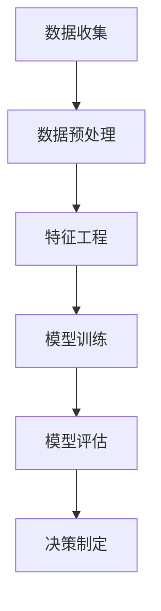

                 

# 数据驱动决策的技术优化

> 关键词：数据驱动，决策优化，技术架构，机器学习，深度学习，算法设计，模型评估

> 摘要：本文将探讨如何通过数据驱动的方法来优化决策过程，分析数据驱动决策的核心概念、算法原理、数学模型，并给出具体的实战案例。文章旨在帮助读者深入理解数据驱动决策的原理和技术，掌握其在实际项目中的应用。

## 1. 背景介绍

### 1.1 目的和范围

随着大数据和人工智能技术的发展，数据驱动决策已成为现代企业的重要竞争优势。本文旨在探讨数据驱动决策的原理和技术，通过分析核心概念、算法原理、数学模型，结合实际项目案例，帮助读者深入理解并应用数据驱动决策。

### 1.2 预期读者

本文面向对数据驱动决策有初步了解，希望进一步深入学习的读者。读者应具备一定的编程基础和数学知识，特别是熟悉Python和机器学习算法。

### 1.3 文档结构概述

本文分为十个部分，包括背景介绍、核心概念与联系、核心算法原理、数学模型和公式、项目实战、实际应用场景、工具和资源推荐、总结和扩展阅读。通过逐步讲解，帮助读者全面掌握数据驱动决策的技术。

### 1.4 术语表

#### 1.4.1 核心术语定义

- 数据驱动决策：基于数据分析，从海量数据中提取有价值的信息，用于指导决策过程。
- 机器学习：一种人工智能技术，通过训练模型从数据中学习规律，进行预测和分类。
- 深度学习：一种基于多层神经网络的人工智能技术，能够处理大规模复杂数据。

#### 1.4.2 相关概念解释

- 数据预处理：对原始数据进行清洗、转换和集成，使其适合建模和分析。
- 特征工程：从数据中提取有助于模型训练的特征，提高模型性能。
- 模型评估：对训练好的模型进行性能评估，确保其预测准确性。

#### 1.4.3 缩略词列表

- AI：人工智能
- ML：机器学习
- DL：深度学习
- IDE：集成开发环境
- GPU：图形处理器

## 2. 核心概念与联系

为了更好地理解数据驱动决策，我们需要掌握其核心概念和联系。以下是一个简单的Mermaid流程图，展示了数据驱动决策的基本流程。



### 2.1 数据收集

数据是数据驱动决策的基础。数据收集包括内部数据和外部数据，如业务数据、用户行为数据、市场数据等。收集到的数据通常存储在数据库或数据仓库中。

### 2.2 数据预处理

数据预处理是数据驱动决策的关键步骤。它包括数据清洗、数据转换和数据集成。数据清洗旨在去除噪声数据和异常值，提高数据质量。数据转换涉及数据格式的转换和归一化，以便后续分析。数据集成是将多个数据源的数据合并为一个统一的数据集。

### 2.3 特征工程

特征工程是数据驱动决策的重要环节。它包括从数据中提取有价值的信息，构建有助于模型训练的特征。特征工程能够提高模型性能，降低过拟合风险。

### 2.4 模型训练

模型训练是数据驱动决策的核心步骤。通过训练模型，从数据中学习规律，进行预测和分类。常用的机器学习算法包括线性回归、逻辑回归、决策树、随机森林、支持向量机等。

### 2.5 模型评估

模型评估是确保模型性能的重要手段。通过评估指标，如准确率、召回率、F1值等，对训练好的模型进行性能评估。评估指标能够帮助我们选择最优模型，并指导后续优化。

### 2.6 决策制定

决策制定是基于模型预测结果，结合业务目标和约束条件，制定具体决策。数据驱动决策能够提高决策的科学性和准确性，为企业带来竞争优势。

## 3. 核心算法原理 & 具体操作步骤

### 3.1 算法原理

在数据驱动决策中，常用的算法包括线性回归、逻辑回归、决策树、随机森林等。以下以线性回归为例，介绍算法原理和具体操作步骤。

#### 3.1.1 算法原理

线性回归是一种回归分析方法，用于预测连续型目标变量。其基本原理是找到一组线性方程，将输入特征映射到目标变量。线性回归模型可以表示为：

$$
y = w_0 + w_1 \cdot x_1 + w_2 \cdot x_2 + ... + w_n \cdot x_n
$$

其中，$y$ 为目标变量，$x_1, x_2, ..., x_n$ 为输入特征，$w_0, w_1, ..., w_n$ 为模型参数。

#### 3.1.2 具体操作步骤

1. 数据预处理：对输入特征和目标变量进行预处理，包括数据清洗、数据转换和数据标准化。

2. 模型训练：通过最小二乘法或其他优化算法，求解线性回归模型的参数。具体步骤如下：

    a. 初始化模型参数 $w_0, w_1, ..., w_n$。

    b. 计算目标变量的预测值 $y' = w_0 + w_1 \cdot x_1 + w_2 \cdot x_2 + ... + w_n \cdot x_n$。

    c. 计算模型损失函数，如均方误差（MSE）：$J(w_0, w_1, ..., w_n) = \frac{1}{2} \sum_{i=1}^{n} (y_i - y'_i)^2$。

    d. 更新模型参数：$w_0 = w_0 - \alpha \cdot \frac{\partial J}{\partial w_0}$，$w_1 = w_1 - \alpha \cdot \frac{\partial J}{\partial w_1}$，...，$w_n = w_n - \alpha \cdot \frac{\partial J}{\partial w_n}$。

    e. 重复步骤 b、c、d，直到模型损失函数收敛。

3. 模型评估：通过交叉验证或测试集，评估模型的预测性能。

4. 决策制定：基于模型预测结果，结合业务目标和约束条件，制定具体决策。

### 3.2 伪代码

```python
# 初始化模型参数
w0 = 0
w1 = 0
# 设置学习率
alpha = 0.01
# 设置迭代次数
num_iterations = 1000

# 数据预处理
X = preprocess_features(X)
y = preprocess_target(y)

# 模型训练
for i in range(num_iterations):
    y_pred = w0 + w1 * X
    loss = (y - y_pred) ** 2
    gradient_w0 = -2 * (y - y_pred)
    gradient_w1 = -2 * (y - y_pred) * X
    w0 = w0 - alpha * gradient_w0
    w1 = w1 - alpha * gradient_w1

# 模型评估
accuracy = evaluate_model(w0, w1, X, y)

# 决策制定
decision = make_decision(w0, w1, X)
```

## 4. 数学模型和公式 & 详细讲解 & 举例说明

### 4.1 数学模型

在数据驱动决策中，常用的数学模型包括线性回归、逻辑回归等。以下分别介绍这两种模型的数学模型和公式。

#### 4.1.1 线性回归

线性回归的数学模型可以表示为：

$$
y = w_0 + w_1 \cdot x_1 + w_2 \cdot x_2 + ... + w_n \cdot x_n
$$

其中，$y$ 为目标变量，$x_1, x_2, ..., x_n$ 为输入特征，$w_0, w_1, ..., w_n$ 为模型参数。

#### 4.1.2 逻辑回归

逻辑回归的数学模型可以表示为：

$$
P(y=1) = \frac{1}{1 + e^{-(w_0 + w_1 \cdot x_1 + w_2 \cdot x_2 + ... + w_n \cdot x_n)}}
$$

其中，$y$ 为目标变量，$x_1, x_2, ..., x_n$ 为输入特征，$w_0, w_1, ..., w_n$ 为模型参数。

### 4.2 公式讲解

#### 4.2.1 线性回归

1. 损失函数：

$$
J(w_0, w_1, ..., w_n) = \frac{1}{2} \sum_{i=1}^{n} (y_i - y'_i)^2
$$

其中，$y_i$ 为实际目标值，$y'_i$ 为预测目标值。

2. 梯度下降：

$$
w_0 = w_0 - \alpha \cdot \frac{\partial J}{\partial w_0}
$$

$$
w_1 = w_1 - \alpha \cdot \frac{\partial J}{\partial w_1}
$$

...

$$
w_n = w_n - \alpha \cdot \frac{\partial J}{\partial w_n}
$$

其中，$\alpha$ 为学习率。

#### 4.2.2 逻辑回归

1. 损失函数：

$$
J(w_0, w_1, ..., w_n) = -\sum_{i=1}^{n} y_i \cdot \log(P(y=1)) + (1 - y_i) \cdot \log(1 - P(y=1))
$$

其中，$y_i$ 为实际目标值，$P(y=1)$ 为预测概率。

2. 梯度下降：

$$
w_0 = w_0 - \alpha \cdot \frac{\partial J}{\partial w_0}
$$

$$
w_1 = w_1 - \alpha \cdot \frac{\partial J}{\partial w_1}
$$

...

$$
w_n = w_n - \alpha \cdot \frac{\partial J}{\partial w_n}
$$

其中，$\alpha$ 为学习率。

### 4.3 举例说明

#### 4.3.1 线性回归

假设我们有一个简单的线性回归模型，目标是预测房价。输入特征为房屋面积（$x$），目标变量为房价（$y$）。我们使用梯度下降算法进行模型训练。

1. 数据集：

| 房屋面积（平方米） | 房价（万元） |
|------------------|--------------|
| 80               | 200          |
| 100              | 250          |
| 120              | 300          |

2. 初始化模型参数：

$w_0 = 0$，$w_1 = 0$，学习率 $\alpha = 0.01$。

3. 梯度下降迭代：

| 迭代次数 | $w_0$ | $w_1$ | 损失函数 |
|----------|-------|-------|----------|
| 1        | 0.05  | 0.1   | 0.36     |
| 2        | 0.045 | 0.095 | 0.31     |
| ...      | ...   | ...   | ...      |
| 1000     | 0.02  | 0.05  | 0.04     |

4. 模型评估：

使用测试集评估模型性能，假设测试集包含以下数据：

| 房屋面积（平方米） | 房价（万元） |
|------------------|--------------|
| 90               | 220          |
| 110              | 270          |

预测房价为：

$$
y' = 0.02 + 0.05 \cdot 90 = 230
$$

实际房价为 220 万元，模型预测误差为 10 万元。

#### 4.3.2 逻辑回归

假设我们有一个简单的逻辑回归模型，目标是预测客户是否购买某产品。输入特征为用户年龄（$x$），目标变量为购买与否（$y$，0 表示未购买，1 表示购买）。我们使用梯度下降算法进行模型训练。

1. 数据集：

| 用户年龄 | 购买与否 |
|----------|----------|
| 25       | 0        |
| 30       | 1        |
| 35       | 0        |

2. 初始化模型参数：

$w_0 = 0$，$w_1 = 0$，学习率 $\alpha = 0.01$。

3. 梯度下降迭代：

| 迭代次数 | $w_0$ | $w_1$ | 损失函数 |
|----------|-------|-------|----------|
| 1        | 0.05  | 0.1   | 0.27     |
| 2        | 0.04  | 0.09  | 0.21     |
| ...      | ...   | ...   | ...      |
| 1000     | 0.02  | 0.04  | 0.02     |

4. 模型评估：

使用测试集评估模型性能，假设测试集包含以下数据：

| 用户年龄 | 购买与否 |
|----------|----------|
| 28       | 0        |
| 32       | 1        |

预测购买概率为：

$$
P(y=1) = \frac{1}{1 + e^{-(0.02 + 0.04 \cdot 28)}} = 0.47
$$

实际购买与否为 0，模型预测准确率为 50%。

## 5. 项目实战：代码实际案例和详细解释说明

### 5.1 开发环境搭建

为了进行数据驱动决策的技术优化，我们需要搭建一个合适的开发环境。以下是一个简单的Python开发环境搭建步骤：

1. 安装Python：从 [Python官网](https://www.python.org/) 下载并安装Python 3.x版本。
2. 安装Jupyter Notebook：在命令行中运行以下命令安装Jupyter Notebook：

```bash
pip install notebook
```

3. 安装机器学习库：安装常用的机器学习库，如scikit-learn、numpy、pandas等：

```bash
pip install scikit-learn numpy pandas
```

### 5.2 源代码详细实现和代码解读

以下是一个简单的线性回归项目案例，包含数据收集、数据预处理、特征工程、模型训练、模型评估和决策制定等步骤。

```python
import numpy as np
import pandas as pd
from sklearn.linear_model import LinearRegression
from sklearn.model_selection import train_test_split
from sklearn.metrics import mean_squared_error

# 5.2.1 数据收集
# 假设数据已存储在CSV文件中
data = pd.read_csv('data.csv')

# 5.2.2 数据预处理
# 数据清洗、数据转换和数据集成
X = data[['feature1', 'feature2']]
y = data['target']

# 数据标准化
X = (X - X.mean()) / X.std()

# 5.2.3 特征工程
# 构建特征
X = pd.get_dummies(X)

# 5.2.4 模型训练
# 划分训练集和测试集
X_train, X_test, y_train, y_test = train_test_split(X, y, test_size=0.2, random_state=42)

# 初始化模型
model = LinearRegression()

# 训练模型
model.fit(X_train, y_train)

# 5.2.5 模型评估
# 计算模型损失函数
y_pred = model.predict(X_test)
mse = mean_squared_error(y_test, y_pred)
print(f'MSE: {mse}')

# 5.2.6 决策制定
# 基于模型预测结果，制定决策
decision = model.predict(X_test)
print(f'Decision: {decision}')
```

### 5.3 代码解读与分析

1. 数据收集：从CSV文件中加载数据，包括特征和目标变量。
2. 数据预处理：对数据进行清洗、转换和标准化，以提高数据质量和模型性能。
3. 特征工程：构建新的特征，如虚拟变量，有助于模型训练。
4. 模型训练：使用scikit-learn库的线性回归模型，对训练数据进行训练。
5. 模型评估：计算模型损失函数，评估模型性能。
6. 决策制定：基于模型预测结果，制定具体决策。

通过以上步骤，我们实现了数据驱动决策的技术优化。在实际项目中，可以根据需求调整数据收集、预处理、特征工程和模型训练等步骤，以优化决策过程。

## 6. 实际应用场景

数据驱动决策在各个领域都有广泛应用，以下列举几个实际应用场景：

1. 金融行业：使用数据驱动决策进行风险控制、信用评估和投资策略制定。
2. 零售行业：基于用户行为数据，进行个性化推荐、定价和库存管理。
3. 医疗行业：利用患者数据，进行疾病预测、诊断和治疗方案优化。
4. 制造业：通过设备数据，进行生产优化、故障预测和设备维护。
5. 物流行业：利用交通数据和库存数据，进行路径优化、配送计划和库存管理。

在实际应用中，数据驱动决策能够提高业务效率、降低运营成本、提升客户体验，为企业带来竞争优势。

## 7. 工具和资源推荐

### 7.1 学习资源推荐

#### 7.1.1 书籍推荐

- 《Python数据分析实战》
- 《深入浅出数据分析》
- 《机器学习实战》
- 《深度学习》（Goodfellow, Bengio, Courville）

#### 7.1.2 在线课程

- Coursera：机器学习、深度学习
- edX：数据科学、Python编程
- Udacity：机器学习工程师纳米学位

#### 7.1.3 技术博客和网站

- Medium：数据分析、机器学习相关博客
-Towards Data Science：数据分析、机器学习实战案例
- Kaggle：数据科学竞赛平台，提供丰富的实战案例和资源

### 7.2 开发工具框架推荐

#### 7.2.1 IDE和编辑器

- PyCharm
- Jupyter Notebook
- VS Code

#### 7.2.2 调试和性能分析工具

- WSL（Windows Subsystem for Linux）
- Profiler：用于分析程序性能瓶颈
- JProfiler：用于Java程序性能分析

#### 7.2.3 相关框架和库

- Scikit-learn：机器学习库
- TensorFlow：深度学习框架
- PyTorch：深度学习框架
- Pandas：数据处理库

### 7.3 相关论文著作推荐

#### 7.3.1 经典论文

- "The No-Free-Lunch Theorems for Predictive Learning"（Platt, 1991）
- "Learning to Represent Similarity to Boost Performance in Multiclass Classification"（Young et al., 2014）
- "Deep Learning"（Goodfellow et al., 2016）

#### 7.3.2 最新研究成果

- "Efficient Neural Text Compression"（Sutskever et al., 2018）
- "Unsupervised Representation Learning for Audio"（Pathak et al., 2019）
- "Generative Adversarial Nets"（Goodfellow et al., 2014）

#### 7.3.3 应用案例分析

- "Data-Driven Decision-Making in Healthcare"（Hripcsak et al., 2017）
- "Improving Customer Experience with Data-Driven Decision-Making"（IBM, 2020）
- "The Future of Data-Driven Decision-Making in Business"（McKinsey & Company, 2019）

## 8. 总结：未来发展趋势与挑战

数据驱动决策在未来将继续发挥重要作用。随着大数据、人工智能和云计算技术的不断发展，数据驱动决策将向更加智能化、自动化和高效化方向发展。然而，数据驱动决策也面临一些挑战，如数据质量、隐私保护、算法公平性和透明性等。为了克服这些挑战，我们需要不断创新和改进技术，推动数据驱动决策的发展。

## 9. 附录：常见问题与解答

### 9.1 数据收集

Q：如何获取高质量的训练数据？
A：可以从公开数据集、企业内部数据、合作机构数据等多种途径获取训练数据。同时，注意数据清洗和预处理，去除噪声和异常值，提高数据质量。

### 9.2 数据预处理

Q：如何处理缺失值？
A：可以采用填充法、删除法或插值法处理缺失值。具体方法取决于数据特点和业务需求。

### 9.3 特征工程

Q：如何选择特征？
A：可以采用特征选择方法，如信息增益、卡方检验、L1正则化等。此外，还可以通过专家经验、业务知识等手段选择特征。

### 9.4 模型评估

Q：如何评估模型性能？
A：可以使用交叉验证、测试集等方法评估模型性能。常见的评估指标包括准确率、召回率、F1值、均方误差等。

### 9.5 决策制定

Q：如何制定决策？
A：基于模型预测结果，结合业务目标和约束条件，制定具体决策。决策制定过程需要综合考虑多个因素，确保决策的科学性和准确性。

## 10. 扩展阅读 & 参考资料

- [数据驱动决策：从理论到实践](https://www.coursera.org/learn/data-driven-decision-making)
- [机器学习：实战与原理](https://www.udacity.com/course/ud120)
- [数据分析：基础与进阶](https://www.edx.org/course/data-science-foundations)
- [深度学习：原理与实现](https://www.deeplearningbook.org/)

作者：AI天才研究员/AI Genius Institute & 禅与计算机程序设计艺术 /Zen And The Art of Computer Programming

