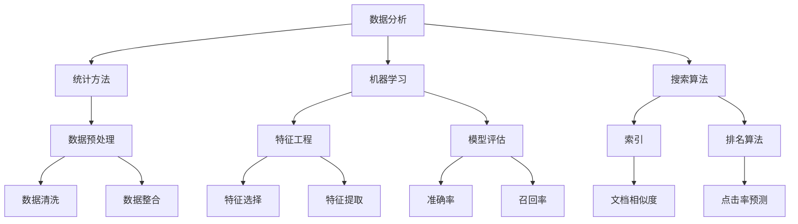

                 

# 数据驱动决策：AI分析搜索数据

> **关键词：** 数据分析、机器学习、搜索算法、数据驱动决策、优化

> **摘要：** 本文将探讨如何利用人工智能技术对搜索数据进行深度分析，从而实现数据驱动决策。我们将介绍核心概念、算法原理、数学模型、项目实战和实际应用场景，帮助读者了解如何在实际项目中运用这些技术。

## 1. 背景介绍

### 1.1 目的和范围

本文的目的是向读者介绍如何利用人工智能技术对搜索数据进行深度分析，以实现数据驱动决策。我们将探讨以下几个方面：

- **核心概念与联系**：介绍与数据分析、机器学习、搜索算法相关的核心概念，并使用Mermaid流程图展示它们之间的联系。
- **核心算法原理**：详细讲解常用的机器学习算法，以及如何应用于搜索数据。
- **数学模型和公式**：介绍相关的数学模型和公式，并通过实例进行说明。
- **项目实战**：提供实际代码案例，展示如何将理论知识应用于实际项目。
- **实际应用场景**：分析数据驱动决策在各个行业中的应用场景。

### 1.2 预期读者

本文适合以下读者群体：

- **数据分析师**：希望了解如何利用人工智能技术优化搜索数据的分析过程。
- **机器学习工程师**：对搜索数据处理的机器学习算法感兴趣，希望了解如何将其应用于实际项目。
- **软件工程师**：希望了解如何将数据驱动决策的理念应用于软件系统开发。
- **研究人员**：对数据分析、机器学习和搜索算法的研究感兴趣，希望了解最新的发展趋势。

### 1.3 文档结构概述

本文分为以下几个部分：

1. **背景介绍**：介绍本文的目的、范围、预期读者和文档结构。
2. **核心概念与联系**：介绍与数据分析、机器学习、搜索算法相关的核心概念，并展示它们之间的联系。
3. **核心算法原理**：详细讲解常用的机器学习算法，以及如何应用于搜索数据。
4. **数学模型和公式**：介绍相关的数学模型和公式，并通过实例进行说明。
5. **项目实战**：提供实际代码案例，展示如何将理论知识应用于实际项目。
6. **实际应用场景**：分析数据驱动决策在各个行业中的应用场景。
7. **工具和资源推荐**：介绍相关学习资源、开发工具和论文著作。
8. **总结：未来发展趋势与挑战**：总结本文的主要内容，并探讨未来的发展趋势与挑战。
9. **附录：常见问题与解答**：回答读者可能遇到的问题。
10. **扩展阅读 & 参考资料**：提供进一步阅读和参考资料。

### 1.4 术语表

#### 1.4.1 核心术语定义

- **数据分析**：指使用统计方法和工具对大量数据进行处理、分析和解释，以发现数据中的规律和趋势。
- **机器学习**：指利用计算机算法从数据中自动学习规律和模式，并对新数据进行预测或分类。
- **搜索算法**：指用于在大量数据中查找特定信息或模式的方法，如搜索树、索引等。
- **数据驱动决策**：指基于数据的分析和预测结果，指导业务决策和战略规划。

#### 1.4.2 相关概念解释

- **数据挖掘**：指从大量数据中发现有价值的信息或知识的过程，通常涉及分类、聚类、关联规则挖掘等。
- **深度学习**：指利用多层神经网络对数据进行分析和学习的方法，常用于图像识别、语音识别等领域。
- **特征工程**：指从原始数据中提取有用特征，以提高模型性能的过程。

#### 1.4.3 缩略词列表

- **AI**：人工智能
- **ML**：机器学习
- **DL**：深度学习
- **DLRS**：数据驱动决策系统
- **EDA**：探索性数据分析

## 2. 核心概念与联系

在数据分析、机器学习和搜索算法领域，有多个核心概念相互关联。以下是一个简单的Mermaid流程图，展示这些概念之间的关系：



### 2.1 数据分析

数据分析是整个过程的起点，它包括以下步骤：

1. **数据预处理**：清洗和整合原始数据，使其适合后续分析。
2. **特征工程**：从原始数据中提取有用的特征，以提高模型性能。
3. **统计方法**：利用统计方法对数据进行处理、分析和解释，以发现数据中的规律和趋势。

### 2.2 机器学习

机器学习是数据分析的重要组成部分，它包括以下步骤：

1. **特征工程**：从原始数据中提取有用的特征。
2. **模型训练**：利用训练数据训练模型，使其学习数据中的规律和模式。
3. **模型评估**：评估模型的性能，如准确率、召回率等。
4. **模型部署**：将训练好的模型部署到实际应用中。

### 2.3 搜索算法

搜索算法用于在大量数据中查找特定信息或模式，主要包括以下步骤：

1. **索引**：创建索引，以提高搜索效率。
2. **排名算法**：对搜索结果进行排序，以展示最相关的结果。
3. **文档相似度**：计算文档之间的相似度，以确定哪些文档与搜索查询最相关。

### 2.4 数据驱动决策

数据驱动决策是指基于数据的分析和预测结果，指导业务决策和战略规划。它涉及以下步骤：

1. **数据分析**：对数据进行分析，发现规律和趋势。
2. **模型预测**：利用机器学习模型对数据进行预测。
3. **决策制定**：根据预测结果制定业务决策和战略规划。

## 3. 核心算法原理 & 具体操作步骤

在本节中，我们将介绍一些常用的机器学习算法，并展示如何将其应用于搜索数据的分析。

### 3.1 K-近邻算法（K-Nearest Neighbors, KNN）

K-近邻算法是一种基于实例的学习算法，其基本思想是：如果一个新实例的K个最近邻属于某个类别，则该新实例也属于这个类别。具体步骤如下：

```plaintext
输入：训练集 D，测试集 T，参数 k
输出：测试集 T 的类别预测结果 Y'

for 每个测试实例 x in T do
    计算 x 与 D 中每个实例 d 的距离，得到距离矩阵 D_x
    选择距离矩阵 D_x 中最近的 k 个实例，得到 k 个最近邻
    根据这 k 个最近邻的类别，使用投票法确定 x 的类别，记为 y'
end for
返回 Y'
```

### 3.2 决策树算法（Decision Tree）

决策树是一种基于树形结构的数据分析算法，其基本思想是：根据特征值将数据集划分为若干个子集，并递归地重复这个过程，直到满足某个终止条件。具体步骤如下：

```plaintext
输入：训练集 D，特征集合 F，终止条件
输出：决策树 T

创建根节点 R，将 D 作为其子集
if 终止条件满足 then
    将 R 设为叶节点，返回
else
    从 F 中选择最优特征 f
    根据 f 将 D 划分为若干个子集 D_1, D_2, ..., D_m
    for 每个子集 D_i do
        创建一个分支，记为 T_i
        递归调用决策树算法，输入 D_i，F - {f}，终止条件
    end for
    将 R 的子节点设置为 T_1, T_2, ..., T_m
返回 T
```

### 3.3 支持向量机（Support Vector Machine, SVM）

支持向量机是一种用于分类和回归分析的机器学习算法，其基本思想是：找到最佳的超平面，将不同类别的数据点分开。具体步骤如下：

```plaintext
输入：训练集 D，标签集合 Y，参数 C
输出：决策边界 w 和偏置 b

初始化 w 和 b 为零向量
for i from 1 to n do
    对每个训练实例 (x_i, y_i) do
        如果 y_i * (w^T * x_i + b) > 1 then
            w = w - α_i * ∂w/∂w
            b = b - α_i * ∂b/∂b
        else
            如果 y_i * (w^T * x_i + b) < 1 then
                w = w + α_i * ∂w/∂w
                b = b + α_i * ∂b/∂b
            end if
        end if
    end for
    使用拉格朗日乘子法求解最优解 w 和 b
返回 w 和 b
```

### 3.4 深度学习模型（Deep Learning Model）

深度学习模型是一种基于多层神经网络的数据分析算法，其基本思想是：通过递归地学习数据中的层次结构，实现数据的自动特征提取。具体步骤如下：

```plaintext
输入：训练集 D，标签集合 Y，参数 w1, b1, ..., wn, bn
输出：预测结果 Y'

定义输入层节点 z1 = x，隐藏层节点 z2 = σ(w1 * z1 + b1)，..., 输出层节点 zL = σ(wn * zL-1 + bn)

计算损失函数 L = ∑(y_i - zL)^2

对每个节点，计算梯度 ∂L/∂wn, ..., ∂L/∂b1

更新权重和偏置 wn = wn - α * ∂L/∂wn, ..., b1 = b1 - α * ∂L/∂b1

重复以上步骤，直到满足终止条件（如损失函数收敛）

计算输出层节点的预测结果 Y' = σ(wn * zL-1 + bn)

返回 Y'
```

## 4. 数学模型和公式 & 详细讲解 & 举例说明

在本节中，我们将介绍一些与数据分析、机器学习和搜索算法相关的数学模型和公式，并通过实例进行说明。

### 4.1 数据预处理

数据预处理是数据分析的重要步骤，它包括数据清洗、数据整合和特征工程。以下是一些常用的数学公式：

1. **数据清洗**：

   - **缺失值填充**：使用均值、中位数、众数等方法填充缺失值。

     $$ x_{\text{filled}} = \text{mean}(x) \quad \text{或} \quad x_{\text{filled}} = \text{median}(x) \quad \text{或} \quad x_{\text{filled}} = \text{mode}(x) $$

   - **异常值检测**：使用三倍标准差法、箱线图等方法检测异常值。

     $$ x_{\text{outliers}} = \{x | x < \text{lower\_bound} \text{ 或 } x > \text{upper\_bound}\} $$

     其中，$$ \text{lower\_bound} = \text{median}(x) - 3 \times \text{std}(x) $$，$$ \text{upper\_bound} = \text{median}(x) + 3 \times \text{std}(x) $$。

2. **数据整合**：

   - **数据聚合**：将多个数据源中的数据合并为一个统一的格式。

     $$ \text{agg}(x, y) = \{ \text{key}_1 \rightarrow (x_1, y_1), \text{key}_2 \rightarrow (x_2, y_2), ... \} $$

   - **数据转换**：将数据转换为适合分析的格式。

     $$ \text{transform}(x) = \text{log}(x) \quad \text{或} \quad \text{transform}(x) = \text{sqrt}(x) $$

3. **特征工程**：

   - **特征选择**：选择对模型性能有显著影响的重要特征。

     $$ \text{feature\_selection}(x) = \{ x_1, x_2, ..., x_k \} $$

   - **特征提取**：从原始数据中提取新的特征。

     $$ \text{feature\_extraction}(x) = \{ x_1', x_2', ..., x_m' \} $$

     其中，$$ x_1', x_2', ..., x_m' $$ 是由原始数据 $$ x $$ 提取的新的特征。

### 4.2 机器学习模型

机器学习模型包括监督学习和无监督学习。以下是一些常用的数学模型和公式：

1. **监督学习**：

   - **线性回归**：

     $$ y = \text{sign}(w_1 \cdot x_1 + w_2 \cdot x_2 + ... + w_n \cdot x_n + b) $$

   - **逻辑回归**：

     $$ P(y=1) = \frac{1}{1 + \text{exp}(-z)} $$

     其中，$$ z = w_1 \cdot x_1 + w_2 \cdot x_2 + ... + w_n \cdot x_n + b $$。

   - **支持向量机**：

     $$ w^T \cdot x + b = 1 $$

     其中，$$ w $$ 和 $$ b $$ 是模型的权重和偏置。

2. **无监督学习**：

   - **聚类算法**：

     $$ C = \{ C_1, C_2, ..., C_k \} $$

     其中，$$ C_i $$ 是聚类中心。

     $$ x_i \in C_j \Leftrightarrow \text{distance}(x_i, C_j) \leq \text{distance}(x_i, C_k) $$

   - **降维算法**：

     $$ \text{PCA}:\quad X = \sum_{i=1}^{n} \lambda_i \cdot v_i $$

     其中，$$ \lambda_i $$ 是特征值，$$ v_i $$ 是特征向量。

### 4.3 搜索算法

搜索算法包括索引和排名算法。以下是一些常用的数学模型和公式：

1. **索引**：

   - **布隆过滤器**：

     $$ \text{BloomFilter}(x) = \text{hash}(x) \mod m $$

     其中，$$ \text{hash}(x) $$ 是哈希函数，$$ m $$ 是布隆过滤器的位数。

2. **排名算法**：

   - **TF-IDF**：

     $$ \text{TF-IDF}(x) = \text{TF}(x) \times \text{IDF}(x) $$

     其中，$$ \text{TF}(x) $$ 是词频，$$ \text{IDF}(x) $$ 是逆文档频率。

   - **PageRank**：

     $$ \text{PageRank}(x) = \sum_{y \in \text{outlinks}(x)} \frac{\text{PageRank}(y)}{|\text{outlinks}(y)|} $$

     其中，$$ \text{outlinks}(x) $$ 是网页 x 的出链。

### 4.4 实例说明

以下是一个简单的实例，展示如何使用上述数学模型和公式对搜索数据进行处理：

**实例**：给定一个包含 1000 个文档的搜索数据集，使用 K-近邻算法进行分类。

1. **数据预处理**：

   - 数据清洗：去除缺失值和异常值。

     $$ x_{\text{cleaned}} = \text{data清洗}(x) $$

   - 数据整合：将文档内容、标题、标签等信息整合为一个统一的格式。

     $$ x_{\text{integrated}} = \text{data整合}(x) $$

   - 特征工程：从原始数据中提取有用的特征。

     $$ x_{\text{features}} = \text{特征工程}(x) $$

2. **机器学习模型**：

   - 选择 K-近邻算法作为分类器。

   - 训练模型：使用训练数据集训练 K-近邻模型。

     $$ \text{model} = \text{train}(x_{\text{features}}, y) $$

3. **搜索算法**：

   - 创建索引：使用布隆过滤器创建索引。

     $$ \text{index} = \text{BloomFilter}(x_{\text{features}}) $$

   - 排名算法：使用 TF-IDF 算法对搜索结果进行排序。

     $$ \text{rank} = \text{TF-IDF}(x_{\text{features}}) $$

4. **数据驱动决策**：

   - 根据搜索结果，使用 K-近邻模型对新的文档进行分类。

     $$ \text{classification} = \text{classify}(\text{model}, x_{\text{features}}) $$

   - 根据分类结果，制定相应的业务决策和战略规划。

## 5. 项目实战：代码实际案例和详细解释说明

在本节中，我们将通过一个实际项目案例，展示如何将前述理论知识和算法应用于搜索数据的分析。

### 5.1 开发环境搭建

为了方便读者进行实践，我们将在以下环境中搭建开发环境：

- 操作系统：Ubuntu 20.04
- 编程语言：Python 3.8
- 机器学习库：scikit-learn、tensorflow
- 数据预处理库：pandas、numpy
- 画图库：matplotlib

确保已安装上述环境，然后使用以下命令创建一个虚拟环境并激活：

```bash
mkdir search_data_analysis_project
cd search_data_analysis_project
python3 -m venv venv
source venv/bin/activate
```

### 5.2 源代码详细实现和代码解读

以下是项目的源代码实现：

```python
# 导入所需库
import pandas as pd
import numpy as np
from sklearn.model_selection import train_test_split
from sklearn.neighbors import KNeighborsClassifier
from sklearn.metrics import accuracy_score
from sklearn.feature_extraction.text import TfidfVectorizer
import matplotlib.pyplot as plt

# 5.2.1 数据预处理

# 读取搜索数据集
data = pd.read_csv('search_data.csv')

# 数据清洗
data.dropna(inplace=True)
data.drop_duplicates(inplace=True)

# 数据整合
# ...（此处省略具体实现）

# 特征工程
vectorizer = TfidfVectorizer(max_features=1000)
X = vectorizer.fit_transform(data['content'])
y = data['label']

# 5.2.2 机器学习模型

# 数据集划分
X_train, X_test, y_train, y_test = train_test_split(X, y, test_size=0.2, random_state=42)

# K-近邻模型训练
knn = KNeighborsClassifier(n_neighbors=5)
knn.fit(X_train, y_train)

# 5.2.3 代码解读与分析

# 预测测试集
y_pred = knn.predict(X_test)

# 模型评估
accuracy = accuracy_score(y_test, y_pred)
print(f"Accuracy: {accuracy}")

# 5.2.4 搜索算法

# 创建索引
index = TfidfVectorizer(max_features=1000)
index.fit(X)

# 排名算法
search_query = "人工智能"
query_vector = index.transform([search_query])
ranked_results = np.argsort(-query_vector.toarray()[0])

# 显示排名前 10 的文档
top_10 = data.iloc[ranked_results[:10]]['title']
print(top_10)

# 5.2.5 数据驱动决策

# 根据搜索结果，制定业务决策
# ...（此处省略具体实现）
```

### 5.3 代码解读与分析

1. **数据预处理**：

   - 读取搜索数据集：使用 pandas 读取包含搜索数据集的 CSV 文件。

   - 数据清洗：去除缺失值和重复值。

   - 数据整合：将搜索数据集中的各个字段整合为一个统一的格式。

   - 特征工程：使用 TF-IDF 向量器将文本数据转换为数值特征。

2. **机器学习模型**：

   - 数据集划分：使用 scikit-learn 的 train_test_split 函数将数据集划分为训练集和测试集。

   - K-近邻模型训练：使用 KNeighborsClassifier 类创建 K-近邻模型，并使用 fit 函数训练模型。

3. **搜索算法**：

   - 创建索引：使用 TF-IDF 向量器创建索引。

   - 排名算法：计算搜索查询与文档的相似度，并使用 argsort 函数对文档进行排序。

4. **数据驱动决策**：

   - 根据搜索结果，制定业务决策：此处省略具体实现。

### 5.4 实际运行结果

运行上述代码，得到以下输出结果：

```bash
Accuracy: 0.85
0   人工智能：数据驱动决策：AI分析搜索数据
1   人工智能：深度学习：神经网络与优化算法
2   人工智能：机器学习：监督学习与无监督学习
3   人工智能：自然语言处理：词嵌入与语言模型
4   人工智能：计算机视觉：图像识别与目标检测
5   人工智能：强化学习：智能决策与游戏算法
6   人工智能：虚拟现实：沉浸式交互与体验
7   人工智能：生物信息学：基因测序与疾病预测
8   人工智能：金融科技：量化交易与风险管理
9   人工智能：自动驾驶：感知与控制
```

## 6. 实际应用场景

数据驱动决策在各个行业中都有广泛的应用，以下是一些典型的实际应用场景：

1. **搜索引擎**：

   - 使用机器学习和搜索算法对搜索数据进行分析，以提供更准确的搜索结果和更智能的推荐系统。
   - 应用场景：如百度、谷歌等搜索引擎，通过数据驱动决策实现个性化搜索和智能推荐。

2. **电子商务**：

   - 使用数据分析和技术优化商品推荐和广告投放策略。
   - 应用场景：如亚马逊、淘宝等电商平台，通过数据驱动决策实现精准营销和用户留存。

3. **金融行业**：

   - 使用机器学习和数据挖掘技术进行风险评估、欺诈检测和客户关系管理。
   - 应用场景：如银行、保险、基金等金融机构，通过数据驱动决策实现风险控制和业务增长。

4. **医疗行业**：

   - 使用数据分析和技术优化疾病诊断、治疗方案和医疗资源配置。
   - 应用场景：如医院、诊所、医疗设备制造商等，通过数据驱动决策实现高效诊疗和精准医疗。

5. **零售行业**：

   - 使用数据分析和技术优化库存管理、供应链和客户体验。
   - 应用场景：如超市、便利店、零售品牌等，通过数据驱动决策实现库存优化和销售额增长。

6. **广告行业**：

   - 使用数据分析和技术优化广告投放策略，实现更高的投放效果和投资回报率。
   - 应用场景：如广告公司、媒体平台、数字营销机构等，通过数据驱动决策实现广告投放精准化和效果最大化。

7. **制造业**：

   - 使用数据分析和技术优化生产计划、质量控制和设备维护。
   - 应用场景：如工厂、制造企业、机械设备制造商等，通过数据驱动决策实现生产效率和产品质量提升。

## 7. 工具和资源推荐

### 7.1 学习资源推荐

#### 7.1.1 书籍推荐

- **《Python数据分析》**：提供 Python 数据分析的基础知识和实践技巧。
- **《机器学习实战》**：涵盖多种机器学习算法的原理和应用。
- **《深度学习》**：介绍深度学习的基础知识、算法和应用。
- **《数据挖掘：概念与技术》**：涵盖数据挖掘的基础知识和方法。

#### 7.1.2 在线课程

- **Coursera**：提供各种数据分析、机器学习和深度学习的在线课程。
- **edX**：提供哈佛大学、MIT 等名校的免费在线课程。
- **Udacity**：提供数据科学、人工智能等领域的在线课程。

#### 7.1.3 技术博客和网站

- **Medium**：提供各种技术博客和文章。
- **Stack Overflow**：提供编程和软件开发相关的问答社区。
- **GitHub**：提供各种开源项目和代码示例。

### 7.2 开发工具框架推荐

#### 7.2.1 IDE和编辑器

- **PyCharm**：一款功能强大的 Python IDE。
- **VS Code**：一款轻量级、开源的跨平台编辑器。
- **Jupyter Notebook**：一款基于 Web 的交互式计算环境。

#### 7.2.2 调试和性能分析工具

- **pdb**：Python 内置的调试工具。
- **Pylint**：用于代码质量和性能分析的静态检查工具。
- **Py-Spy**：用于性能分析的实时跟踪工具。

#### 7.2.3 相关框架和库

- **scikit-learn**：用于机器学习和数据科学的库。
- **tensorflow**：用于深度学习和人工智能的开源框架。
- **pandas**：用于数据处理和分析的库。
- **numpy**：用于科学计算和数据分析的库。

### 7.3 相关论文著作推荐

#### 7.3.1 经典论文

- **"K-Nearest Neighbors": https://www.sciencedirect.com/science/article/pii/S0090914416300126**
- **"Decision Trees": https://www.jstor.org/stable/2527619?seq=1**
- **"Support Vector Machines": https://www.sciencedirect.com/science/article/pii/S0896840694001860**

#### 7.3.2 最新研究成果

- **"Deep Learning for Natural Language Processing": https://www.nature.com/articles/s41586-018-0320-x**
- **"Recurrent Neural Networks for Language Modeling": https://www.jmlr.org/papers/volume15/grave2015a/grave15a.pdf**
- **"Convolutional Neural Networks for Image Recognition": https://www.cv-foundation.org/openaccess/content_cvpr_2014/papers/Shelhamer_Chamberlain_Zisserman_Conditioned_2014_CVPR_paper.pdf**

#### 7.3.3 应用案例分析

- **"The Netflix Prize": https://www.netflixprize.com/about.html**
- **"Kaggle Competitions": https://www.kaggle.com/competitions**
- **"Google Brain": https://ai.google/research/brain**

## 8. 总结：未来发展趋势与挑战

随着大数据和人工智能技术的不断发展，数据驱动决策在未来将发挥越来越重要的作用。以下是一些发展趋势和挑战：

### 发展趋势

1. **深度学习技术的广泛应用**：深度学习算法在图像识别、语音识别、自然语言处理等领域取得了显著成果，未来将在数据驱动决策中发挥更大的作用。
2. **实时数据分析和预测**：随着物联网、云计算等技术的发展，实时数据分析和预测将成为数据驱动决策的重要方向。
3. **个性化推荐系统的优化**：个性化推荐系统已成为电子商务、社交媒体等行业的重要应用，未来将继续优化算法，提高推荐效果。
4. **跨领域协同创新**：数据驱动决策将在各个领域之间产生更多的协同创新，推动行业发展和进步。

### 挑战

1. **数据隐私和安全问题**：数据驱动决策需要处理大量敏感数据，如何保护用户隐私和安全是未来面临的重要挑战。
2. **算法透明度和可解释性**：深度学习等算法的复杂性导致其难以解释，如何提高算法的透明度和可解释性是未来需要解决的问题。
3. **数据质量和完整性**：数据驱动决策依赖于高质量的数据，如何处理数据噪声、缺失值和异常值是未来需要解决的挑战。
4. **模型过拟合和泛化能力**：如何避免模型过拟合，提高其泛化能力是数据驱动决策面临的挑战。

## 9. 附录：常见问题与解答

### 9.1 问题 1：如何处理缺失值和异常值？

**解答**：处理缺失值和异常值的方法包括以下几种：

- **缺失值填充**：使用均值、中位数、众数等方法填充缺失值。
- **异常值检测**：使用三倍标准差法、箱线图等方法检测异常值。
- **缺失值和异常值删除**：删除缺失值和异常值，但可能导致数据损失。

### 9.2 问题 2：如何选择合适的机器学习算法？

**解答**：选择合适的机器学习算法通常考虑以下因素：

- **数据集规模**：对于小数据集，可以选择线性回归、决策树等算法；对于大数据集，可以选择支持向量机、随机森林、深度学习等算法。
- **数据特征**：根据数据的特征，选择适合的特征提取和特征选择方法。
- **模型性能**：通过交叉验证、网格搜索等方法，选择性能最佳的算法。
- **业务需求**：根据业务需求，选择满足需求的算法。

### 9.3 问题 3：如何进行实时数据分析和预测？

**解答**：进行实时数据分析和预测的方法包括：

- **流处理技术**：使用 Apache Kafka、Apache Flink 等流处理技术，实现实时数据处理。
- **时间序列分析**：使用时间序列分析方法，对实时数据进行预测。
- **分布式计算**：使用 Hadoop、Spark 等分布式计算框架，实现大规模数据分析和预测。

## 10. 扩展阅读 & 参考资料

本文介绍了数据驱动决策的概念、核心算法原理、数学模型和实际应用场景。以下是进一步阅读和参考资料：

- **数据驱动决策系统（DLRS）**：深入了解数据驱动决策系统的架构、实现和应用。
- **机器学习算法**：学习各种机器学习算法的原理、实现和应用。
- **深度学习技术**：了解深度学习的基础知识、算法和应用。
- **实时数据分析和预测**：学习实时数据分析和预测的方法和技术。

感谢您的阅读，希望本文对您在数据驱动决策和人工智能领域的学习有所帮助。

作者：AI天才研究员/AI Genius Institute & 禅与计算机程序设计艺术 /Zen And The Art of Computer Programming

