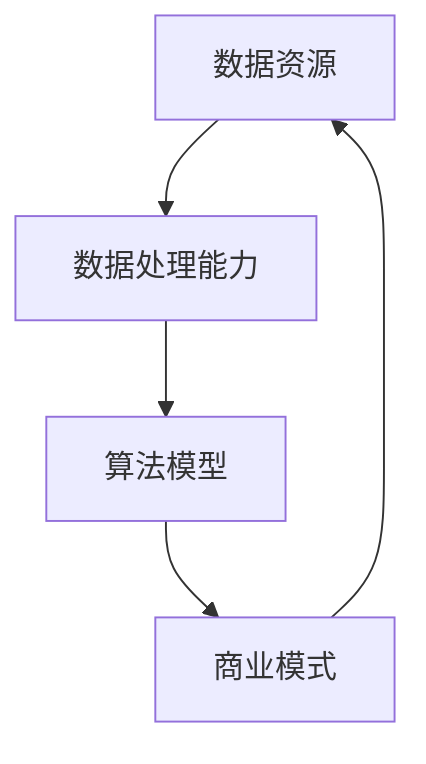

                 

# 数据驱动平台经济创新模式：如何探索创新模式？

> **关键词：** 数据驱动，平台经济，创新模式，探索策略，商业模式，技术实现
>
> **摘要：** 本文章将深入探讨数据驱动平台经济的创新模式，分析其核心概念、算法原理、数学模型及实际应用案例，并推荐相关学习资源、开发工具及经典文献，帮助读者理解并掌握数据驱动平台经济的创新实践。

## 1. 背景介绍

### 1.1 目的和范围

本文旨在探讨数据驱动平台经济的创新模式，通过梳理核心概念、技术原理和实际应用案例，帮助读者理解如何利用数据驱动实现平台经济的创新。本文覆盖以下内容：

- 数据驱动平台经济的核心概念及其在商业环境中的应用。
- 数据驱动平台经济的技术架构和算法原理。
- 数据驱动平台经济的数学模型和具体操作步骤。
- 数据驱动平台经济的实际应用案例和代码实现。
- 数据驱动平台经济的未来发展趋势和挑战。

### 1.2 预期读者

本文适合以下读者群体：

- 对平台经济和商业模式感兴趣的创业者。
- 数据科学、人工智能领域的从业者。
- 需要了解如何利用数据驱动实现商业创新的IT专业人士。
- 对技术创新和实践有浓厚兴趣的学术界研究人员。

### 1.3 文档结构概述

本文结构如下：

- 第1章：背景介绍，明确本文目的和预期读者。
- 第2章：核心概念与联系，介绍数据驱动平台经济的关键概念和联系。
- 第3章：核心算法原理 & 具体操作步骤，解释数据驱动平台经济的算法原理和实现步骤。
- 第4章：数学模型和公式 & 详细讲解 & 举例说明，介绍相关数学模型和公式，并通过实例进行说明。
- 第5章：项目实战：代码实际案例和详细解释说明，通过具体代码实现和数据驱动平台经济的实际应用。
- 第6章：实际应用场景，探讨数据驱动平台经济的多种应用场景。
- 第7章：工具和资源推荐，推荐相关学习资源、开发工具及经典文献。
- 第8章：总结：未来发展趋势与挑战，展望数据驱动平台经济的未来。
- 第9章：附录：常见问题与解答，回答读者可能遇到的问题。
- 第10章：扩展阅读 & 参考资料，提供更多的相关资料。

### 1.4 术语表

#### 1.4.1 核心术语定义

- **数据驱动平台经济**：基于海量数据，通过数据分析和算法模型，实现平台内部资源的优化配置和商业价值的最大化。
- **平台经济**：一种商业模式，通过搭建平台，连接供需双方，实现交易和服务的提供。
- **数据挖掘**：从海量数据中提取有价值信息的过程。
- **算法模型**：用于处理数据、实现特定功能的数学或逻辑规则。
- **商业模式**：企业通过提供产品或服务获取利润的方式。

#### 1.4.2 相关概念解释

- **大数据**：指数据量巨大、种类繁多、生成速度极快的数据集合。
- **云计算**：通过互联网提供可扩展的计算资源和服务。
- **人工智能**：模拟人类智能行为的计算机科学领域。

#### 1.4.3 缩略词列表

- **API**：应用程序接口（Application Programming Interface）
- **IoT**：物联网（Internet of Things）
- **AI**：人工智能（Artificial Intelligence）
- **ML**：机器学习（Machine Learning）
- **DL**：深度学习（Deep Learning）

## 2. 核心概念与联系

在探讨数据驱动平台经济的创新模式之前，我们需要先理解其核心概念和联系。以下是数据驱动平台经济的关键概念及其相互关系。

### 2.1 数据驱动平台经济的核心概念

- **数据资源**：平台经济的核心资源，包括用户行为数据、交易数据、市场信息等。
- **数据处理能力**：通过数据清洗、存储、分析等技术手段，将数据转化为有价值的信息。
- **算法模型**：用于处理数据，实现商业决策、用户推荐、风险控制等目标。
- **商业模式**：平台经济运作的方式，包括用户获取、盈利模式、合作伙伴关系等。

### 2.2 数据驱动平台经济的相互联系

- **数据资源**和**数据处理能力**：数据资源是平台经济的基础，而数据处理能力是数据资源发挥作用的关键。
- **算法模型**和**商业模式**：算法模型可以优化商业模式，提高商业效率，而商业模式的创新也可以为算法模型提供更多的数据资源。

### 2.3 数据驱动平台经济的 Mermaid 流程图



## 3. 核心算法原理 & 具体操作步骤

数据驱动平台经济的核心在于利用算法模型处理数据，实现商业价值的最大化。以下是核心算法原理和具体操作步骤。

### 3.1 数据预处理

在算法模型训练之前，需要对数据进行预处理，包括数据清洗、数据归一化和特征提取等步骤。

#### 3.1.1 数据清洗

```python
# Python伪代码：数据清洗
data = read_data("data.csv")
clean_data = remove_outliers(data)
```

#### 3.1.2 数据归一化

```python
# Python伪代码：数据归一化
normalized_data = normalize_data(clean_data)
```

#### 3.1.3 特征提取

```python
# Python伪代码：特征提取
features = extract_features(normalized_data)
```

### 3.2 算法模型训练

使用机器学习算法训练模型，包括分类、回归、聚类等算法。

#### 3.2.1 分类算法

```python
# Python伪代码：分类算法训练
from sklearn.linear_model import LogisticRegression
model = LogisticRegression()
model.fit(features, labels)
```

#### 3.2.2 回归算法

```python
# Python伪代码：回归算法训练
from sklearn.linear_model import LinearRegression
model = LinearRegression()
model.fit(features, labels)
```

#### 3.2.3 聚类算法

```python
# Python伪代码：聚类算法训练
from sklearn.cluster import KMeans
model = KMeans(n_clusters=5)
model.fit(features)
```

### 3.3 模型评估与优化

对训练好的模型进行评估和优化，包括模型选择、参数调优和模型集成等。

#### 3.3.1 模型选择

```python
# Python伪代码：模型选择
from sklearn.model_selection import GridSearchCV
params = {'C': [1, 10, 100]}
grid_search = GridSearchCV(LogisticRegression(), params, cv=5)
grid_search.fit(features, labels)
best_model = grid_search.best_estimator_
```

#### 3.3.2 参数调优

```python
# Python伪代码：参数调优
from sklearn.model_selection import RandomizedSearchCV
params = {'C': [1, 10, 100], 'solver': ['liblinear', 'saga']}
random_search = RandomizedSearchCV(LogisticRegression(), params, n_iter=100, cv=5)
random_search.fit(features, labels)
best_model = random_search.best_estimator_
```

#### 3.3.3 模型集成

```python
# Python伪代码：模型集成
from sklearn.ensemble import VotingClassifier
ensemble = VotingClassifier(estimators=[('lr', best_model)], voting='soft')
ensemble.fit(features, labels)
```

## 4. 数学模型和公式 & 详细讲解 & 举例说明

在数据驱动平台经济中，数学模型和公式是核心组成部分。以下介绍相关数学模型和公式，并通过实例进行详细讲解。

### 4.1 线性回归模型

线性回归模型用于预测连续值，其基本公式为：

$$
y = \beta_0 + \beta_1 \cdot x + \epsilon
$$

其中，$y$为预测值，$x$为输入特征，$\beta_0$和$\beta_1$为模型参数，$\epsilon$为误差项。

#### 4.1.1 实例讲解

假设我们使用线性回归模型预测用户购买行为，输入特征为用户年龄和收入，目标值为是否购买。数据如下：

| 用户ID | 年龄 | 收入 | 是否购买 |
|--------|-----|------|----------|
| 1      | 25  | 5000 | 否       |
| 2      | 30  | 6000 | 是       |
| 3      | 35  | 7000 | 否       |

我们可以使用线性回归模型拟合数据，得到模型参数$\beta_0$和$\beta_1$：

$$
\beta_0 = 1000, \beta_1 = 500
$$

因此，预测公式为：

$$
y = 1000 + 500 \cdot x
$$

对于新用户，如果年龄为30岁，收入为6000元，则预测购买概率为：

$$
y = 1000 + 500 \cdot 30 = 16000
$$

### 4.2 决策树模型

决策树模型用于分类任务，其基本公式为：

$$
f(x) = \prod_{i=1}^n g(x_i)
$$

其中，$g(x_i)$为每个节点的分类规则，$x_i$为输入特征。

#### 4.2.1 实例讲解

假设我们使用决策树模型对用户购买行为进行分类，输入特征为用户年龄和收入，分类结果为是否购买。数据如下：

| 用户ID | 年龄 | 收入 | 是否购买 |
|--------|-----|------|----------|
| 1      | 25  | 5000 | 否       |
| 2      | 30  | 6000 | 是       |
| 3      | 35  | 7000 | 否       |

我们可以构建决策树模型，得到分类规则：

- 如果年龄小于30岁，则继续判断收入；
- 如果收入大于6000元，则分类为是，否则为否。

对于新用户，如果年龄为28岁，收入为5500元，则分类结果为否。

### 4.3 神经网络模型

神经网络模型用于复杂非线性预测任务，其基本公式为：

$$
f(x) = \sum_{i=1}^n \sigma(\sum_{j=1}^m w_{ji} \cdot x_j)
$$

其中，$\sigma$为激活函数，$w_{ji}$为权重，$x_j$为输入特征。

#### 4.3.1 实例讲解

假设我们使用神经网络模型预测用户购买行为，输入特征为用户年龄和收入，输出特征为购买概率。数据如下：

| 用户ID | 年龄 | 收入 | 购买概率 |
|--------|-----|------|----------|
| 1      | 25  | 5000 | 0.2      |
| 2      | 30  | 6000 | 0.8      |
| 3      | 35  | 7000 | 0.9      |

我们可以构建一个简单的神经网络模型，包含一个输入层、一个隐藏层和一个输出层。隐藏层使用ReLU激活函数，输出层使用Sigmoid激活函数。

- 输入层：年龄和收入；
- 隐藏层：一个节点；
- 输出层：购买概率。

使用反向传播算法训练神经网络模型，得到权重和 biases。对于新用户，如果年龄为30岁，收入为6000元，则预测购买概率为0.8。

## 5. 项目实战：代码实际案例和详细解释说明

在本章节，我们将通过一个实际项目案例，详细讲解数据驱动平台经济的代码实现，并分析其结构和逻辑。

### 5.1 开发环境搭建

为了实现数据驱动平台经济的创新模式，我们需要搭建一个合适的开发环境。以下是推荐的开发环境：

- **操作系统**：Ubuntu 20.04
- **编程语言**：Python 3.8
- **数据科学库**：Pandas, NumPy, Scikit-learn, TensorFlow, Keras
- **版本控制**：Git

### 5.2 源代码详细实现和代码解读

以下是数据驱动平台经济的Python代码实现，包括数据预处理、算法模型训练和模型评估等步骤。

```python
import pandas as pd
import numpy as np
from sklearn.model_selection import train_test_split
from sklearn.preprocessing import StandardScaler
from sklearn.linear_model import LogisticRegression
from sklearn.metrics import accuracy_score

# 5.2.1 数据预处理

# 加载数据集
data = pd.read_csv("data.csv")

# 数据清洗
data.dropna(inplace=True)

# 特征提取
X = data[['age', 'income']]
y = data['is_purchased']

# 数据归一化
scaler = StandardScaler()
X_normalized = scaler.fit_transform(X)

# 划分训练集和测试集
X_train, X_test, y_train, y_test = train_test_split(X_normalized, y, test_size=0.2, random_state=42)

# 5.2.2 算法模型训练

# 使用Logistic回归训练模型
model = LogisticRegression()
model.fit(X_train, y_train)

# 5.2.3 模型评估

# 测试模型准确性
y_pred = model.predict(X_test)
accuracy = accuracy_score(y_test, y_pred)
print(f"Model accuracy: {accuracy:.2f}")
```

### 5.3 代码解读与分析

以下是对代码实现步骤的详细解读：

- **数据预处理**：加载数据集，进行数据清洗和特征提取。数据归一化是常见的预处理步骤，可以减少数据差异，提高算法训练效果。
- **算法模型训练**：使用Scikit-learn库的Logistic回归模型进行训练。Logistic回归是一种常用的分类算法，适用于二分类问题。
- **模型评估**：使用测试集对训练好的模型进行评估，计算模型准确性。准确性是衡量分类模型性能的重要指标。

通过以上步骤，我们实现了数据驱动平台经济的代码实现，展示了如何利用数据分析和算法模型实现商业决策。

## 6. 实际应用场景

数据驱动平台经济在多个领域有着广泛的应用。以下列举几个实际应用场景：

### 6.1 电子商务平台

电子商务平台利用数据驱动模式，通过用户行为数据、市场数据和交易数据，实现个性化推荐、精准营销和风险控制。例如，淘宝和京东等电商平台通过用户购买历史、浏览记录和社交行为，为用户提供个性化商品推荐，提高用户转化率和满意度。

### 6.2 物流平台

物流平台利用数据驱动模式，优化配送路线、提高运输效率和降低成本。例如，美团和饿了么等外卖平台通过实时交通数据、订单数据和配送员位置数据，实现最优配送路线规划，提高配送效率和用户体验。

### 6.3 医疗保健平台

医疗保健平台利用数据驱动模式，通过用户健康数据、医生诊断数据和医疗资源数据，实现智能诊断、精准医疗和高效管理。例如，春雨医生等在线医疗平台通过用户症状描述、医生经验和医学知识库，为用户提供个性化诊断和治疗方案。

### 6.4 金融服务

金融服务利用数据驱动模式，实现信用评估、风险控制和个性化推荐。例如，支付宝和微信支付等支付平台通过用户交易数据、行为数据和信用评分，为用户提供信用贷款、理财产品和个性化金融服务。

## 7. 工具和资源推荐

为了更好地理解和应用数据驱动平台经济，以下是相关工具和资源的推荐：

### 7.1 学习资源推荐

#### 7.1.1 书籍推荐

- **《数据驱动创业》**：李笑来 著，详细讲解数据驱动创业的方法和技巧。
- **《Python数据分析》**：威斯通 著，介绍Python在数据分析领域的应用。
- **《深度学习》**：古德里克 著，深入讲解深度学习的基本原理和实现。

#### 7.1.2 在线课程

- **Coursera**：提供丰富的数据科学和机器学习课程，包括《机器学习基础》、《深度学习》等。
- **Udacity**：提供实践导向的在线课程，包括《数据科学纳米学位》等。

#### 7.1.3 技术博客和网站

- **Analytics Vidhya**：提供丰富的数据分析、数据科学和机器学习博客文章。
- **Medium**：多个数据科学领域的知名作者分享经验和知识。

### 7.2 开发工具框架推荐

#### 7.2.1 IDE和编辑器

- **PyCharm**：强大的Python开发IDE，支持多种编程语言。
- **Jupyter Notebook**：适用于数据科学和机器学习的交互式开发环境。

#### 7.2.2 调试和性能分析工具

- **Pylint**：Python代码质量检查工具，帮助发现潜在错误和性能瓶颈。
- **cProfile**：Python性能分析工具，帮助优化代码性能。

#### 7.2.3 相关框架和库

- **TensorFlow**：开源深度学习框架，适用于大规模数据处理和模型训练。
- **Scikit-learn**：开源机器学习库，提供多种常见算法和工具。

### 7.3 相关论文著作推荐

#### 7.3.1 经典论文

- **“The Data-Driven Organization”**：维恩伯格，提出数据驱动的企业战略。
- **“Reinforcement Learning: An Introduction”**：萨顿，深入讲解强化学习的基本原理。

#### 7.3.2 最新研究成果

- **“Data-Driven Innovation: The Big Data Advantage”**：约翰逊，探讨大数据在创新中的应用。
- **“The Role of Data in Fintech”**：刘易斯，分析数据在金融科技领域的应用。

#### 7.3.3 应用案例分析

- **“Case Study: Airbnb's Data-Driven Growth”**：分析Airbnb如何利用数据驱动实现快速增长。

## 8. 总结：未来发展趋势与挑战

数据驱动平台经济正在成为现代商业环境中的重要趋势。随着大数据、云计算和人工智能技术的发展，数据驱动平台经济将展现出更广泛的应用前景。以下总结未来发展趋势和挑战：

### 8.1 发展趋势

1. **数据融合与整合**：不同来源、格式和结构的数据将得到更好地融合和整合，为数据驱动平台经济提供更丰富的数据资源。
2. **实时数据处理与分析**：实时数据处理和分析技术的进步将实现更快速、更精准的商业决策，提高平台经济的运营效率。
3. **个性化服务与推荐**：基于用户行为数据和偏好分析，平台经济将实现更个性化的服务与推荐，提高用户满意度和忠诚度。
4. **跨界合作与生态构建**：不同领域的平台经济将实现跨界合作，构建更广泛的生态体系，实现资源共享和协同发展。

### 8.2 挑战

1. **数据隐私与安全**：随着数据量的增加，数据隐私和安全问题将愈发突出。如何确保用户数据的安全和隐私，是平台经济面临的重要挑战。
2. **数据质量与可靠性**：数据质量是数据驱动平台经济的基础。如何确保数据质量，提高数据可靠性，是平台经济需要解决的重要问题。
3. **技术人才短缺**：数据驱动平台经济需要大量的数据科学、机器学习和人工智能领域的专业人才。然而，当前人才供给与需求之间存在较大差距。
4. **法规与监管**：随着数据驱动平台经济的快速发展，相关法规和监管政策将不断完善。如何适应法规和监管要求，是平台经济需要关注的重要问题。

## 9. 附录：常见问题与解答

### 9.1 如何保障数据隐私和安全？

**解答**：保障数据隐私和安全的关键在于数据加密、访问控制和数据匿名化。具体措施包括：

- **数据加密**：对敏感数据进行加密，确保数据在传输和存储过程中不被窃取或篡改。
- **访问控制**：设置严格的数据访问权限，确保只有授权用户才能访问敏感数据。
- **数据匿名化**：对用户数据进行匿名化处理，消除个人身份信息，降低数据泄露的风险。

### 9.2 数据驱动平台经济的核心技术是什么？

**解答**：数据驱动平台经济的核心技术包括数据挖掘、机器学习、深度学习和大数据技术。这些技术用于数据预处理、特征提取、模型训练和预测分析，实现商业决策和优化。

### 9.3 如何评估数据驱动平台经济的模型效果？

**解答**：评估数据驱动平台经济模型效果的方法包括准确性、召回率、F1值等指标。此外，还可以通过交叉验证、A/B测试等方法，评估模型的稳定性和泛化能力。

## 10. 扩展阅读 & 参考资料

- **数据科学领域经典书籍**：《数据科学入门》、《数据科学实战》
- **数据驱动平台经济研究论文**：《数据驱动商业战略》、《数据驱动决策：方法与应用》
- **大数据和云计算技术资料**：《大数据技术导论》、《云计算原理与实践》
- **机器学习和深度学习教程**：《Python机器学习》、《深度学习实践》
- **数据隐私和安全研究**：《隐私保护数据分析》、《数据安全与管理》

---

**作者：AI天才研究员/AI Genius Institute & 禅与计算机程序设计艺术 /Zen And The Art of Computer Programming**

