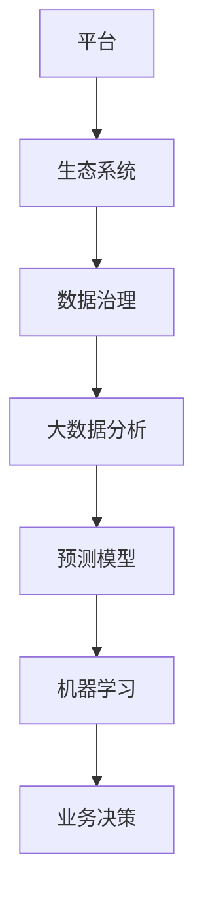

                 

# 数据驱动平台经济发展趋势：如何预测发展趋势？

> **关键词：** 数据驱动、平台经济、预测模型、大数据分析、趋势分析  
>
> **摘要：** 本文将深入探讨数据驱动平台经济的发展趋势，通过逻辑清晰、结构紧凑的分析，揭示如何利用数据预测未来发展趋势。我们将详细介绍核心概念、算法原理、数学模型以及实际应用场景，旨在为读者提供一个全面的视角，了解数据驱动平台经济的本质与未来。

## 1. 背景介绍

### 1.1 目的和范围

本文旨在探讨数据驱动平台经济的本质及其发展趋势。随着大数据和人工智能技术的飞速发展，数据驱动平台经济已经成为全球经济发展的重要驱动力。本文将重点关注以下几个方面：

1. **核心概念与联系**：阐述数据驱动平台经济中的核心概念及其相互关系。
2. **核心算法原理 & 具体操作步骤**：介绍用于预测发展趋势的关键算法，并通过伪代码进行详细阐述。
3. **数学模型和公式 & 详细讲解 & 举例说明**：解析数学模型在预测中的应用，并通过具体例子进行说明。
4. **项目实战：代码实际案例和详细解释说明**：展示一个实际的代码案例，解析其实现过程和关键步骤。
5. **实际应用场景**：探讨数据驱动平台经济在各个领域的应用。
6. **工具和资源推荐**：推荐相关的学习资源和开发工具。

### 1.2 预期读者

本文适合对数据驱动平台经济有一定了解的读者，包括：

1. **数据科学家**：希望了解数据驱动平台经济发展趋势和数据预测算法的专家。
2. **程序员和软件开发者**：对大数据分析和人工智能技术感兴趣，并希望将其应用于实际项目。
3. **企业管理者**：关注企业数字化转型，希望了解数据驱动平台经济对企业发展的意义。

### 1.3 文档结构概述

本文结构如下：

1. **核心概念与联系**：介绍数据驱动平台经济中的核心概念及其相互关系。
2. **核心算法原理 & 具体操作步骤**：介绍用于预测发展趋势的关键算法，并通过伪代码进行详细阐述。
3. **数学模型和公式 & 详细讲解 & 举例说明**：解析数学模型在预测中的应用，并通过具体例子进行说明。
4. **项目实战：代码实际案例和详细解释说明**：展示一个实际的代码案例，解析其实现过程和关键步骤。
5. **实际应用场景**：探讨数据驱动平台经济在各个领域的应用。
6. **工具和资源推荐**：推荐相关的学习资源和开发工具。
7. **总结：未来发展趋势与挑战**：总结数据驱动平台经济的未来发展趋势和面临的挑战。
8. **附录：常见问题与解答**：提供常见问题的解答。
9. **扩展阅读 & 参考资料**：推荐相关的扩展阅读和参考资料。

### 1.4 术语表

#### 1.4.1 核心术语定义

- **数据驱动平台经济**：以数据为核心，通过平台整合资源和提供服务的经济模式。
- **大数据分析**：对大量结构化、半结构化和非结构化数据进行分析和处理的技术。
- **预测模型**：基于历史数据和数学模型，预测未来发展趋势的算法。
- **机器学习**：一种通过数据学习规律，从而进行预测和决策的技术。

#### 1.4.2 相关概念解释

- **平台**：连接供需双方的桥梁，提供交易和服务的公共空间。
- **生态系统**：平台中各种角色和要素相互作用的总体。
- **数据治理**：确保数据质量、安全和合规的一系列管理活动。

#### 1.4.3 缩略词列表

- **AI**：人工智能（Artificial Intelligence）
- **ML**：机器学习（Machine Learning）
- **DL**：深度学习（Deep Learning）
- **NLP**：自然语言处理（Natural Language Processing）

## 2. 核心概念与联系

为了深入理解数据驱动平台经济的本质，我们首先需要明确其中的核心概念和它们之间的相互关系。以下是数据驱动平台经济中的几个关键概念：

### 2.1 平台

平台是数据驱动平台经济的核心，它为用户提供了交互和交易的环境。平台可以是一个网站、一个应用程序或一个物理空间。平台的核心功能是连接供需双方，提高交易效率和降低成本。

### 2.2 生态系统

生态系统是平台中各种角色和要素相互作用的总体。包括：

- **供应商**：提供产品或服务的个人或组织。
- **消费者**：使用平台进行交易的个人或组织。
- **服务提供商**：为平台提供技术支持、物流、支付等服务的公司。
- **平台运营商**：负责平台的管理、运营和推广。

### 2.3 数据治理

数据治理是确保数据质量、安全和合规的一系列管理活动。包括数据收集、存储、处理、分析和共享等各个环节。良好的数据治理是数据驱动平台经济的基石。

### 2.4 大数据分析

大数据分析是对大量结构化、半结构化和非结构化数据进行分析和处理的技术。通过大数据分析，可以从海量数据中提取有价值的信息，支持业务决策和预测。

### 2.5 预测模型

预测模型是基于历史数据和数学模型，预测未来发展趋势的算法。常见的预测模型包括线性回归、决策树、随机森林、神经网络等。

### 2.6 机器学习

机器学习是一种通过数据学习规律，从而进行预测和决策的技术。机器学习算法可以分为监督学习、无监督学习和强化学习等类别。

### 2.7 数据驱动平台经济的 Mermaid 流程图

以下是一个简化的 Mermaid 流程图，展示数据驱动平台经济中的核心概念及其相互关系：



## 3. 核心算法原理 & 具体操作步骤

在数据驱动平台经济中，预测模型是关键。本节将介绍几种常用的预测模型，并通过伪代码进行详细阐述。

### 3.1 线性回归

线性回归是一种最常见的预测模型，用于预测连续值。其基本原理是通过拟合一条直线，将自变量（如时间、销售额等）与因变量（如价格、利润等）之间的关系表示出来。

```python
# 伪代码：线性回归模型
def linear_regression(x, y):
    n = len(x)
    x_mean = sum(x) / n
    y_mean = sum(y) / n

    # 计算斜率和截距
    slope = sum((x - x_mean) * (y - y_mean)) / sum((x - x_mean)^2)
    intercept = y_mean - slope * x_mean

    return slope, intercept
```

### 3.2 决策树

决策树是一种基于特征和阈值进行决策的模型。其基本原理是递归地将数据集划分为若干个子集，每个子集对应一个决策节点，最终形成一棵树。

```python
# 伪代码：决策树模型
def decision_tree(data, features):
    if all(label == data[0]['label'] for data in data):
        return data[0]['label']

    if not features:
        return majority_label(data)

    best_feature, best_threshold = find_best_split(data, features)

    left_data = [row for row in data if row[best_feature] <= best_threshold]
    right_data = [row for row in data if row[best_feature] > best_threshold]

    predictions = [decision_tree(left_data, remaining_features) for remaining_features in features]
    predictions.extend([decision_tree(right_data, remaining_features) for remaining_features in features])

    return predictions
```

### 3.3 随机森林

随机森林是一种基于决策树的集成模型。其基本原理是通过多次随机选取特征和阈值，构建多棵决策树，然后对它们的预测结果进行投票，得出最终结果。

```python
# 伪代码：随机森林模型
def random_forest(data, features, n_trees):
    trees = []
    for _ in range(n_trees):
        new_features = random.sample(features, k=len(features) // 2)
        tree = decision_tree(data, new_features)
        trees.append(tree)

    predictions = [tree.predict(data) for tree in trees]
    return majority_vote(predictions)
```

### 3.4 神经网络

神经网络是一种基于模拟人脑神经元连接结构的模型。其基本原理是通过多层神经元的非线性变换，将输入映射到输出。

```python
# 伪代码：神经网络模型
def neural_network(input_data, weights, biases):
    layer_outputs = [input_data]
    for weight, bias in zip(weights, biases):
        layer_output = activation_function(np.dot(layer_outputs[-1], weight) + bias)
        layer_outputs.append(layer_output)

    return layer_outputs[-1]
```

## 4. 数学模型和公式 & 详细讲解 & 举例说明

在数据驱动平台经济中，数学模型是预测趋势的核心。本节将介绍几种常用的数学模型，并通过具体例子进行说明。

### 4.1 线性回归模型

线性回归模型是一种最简单的预测模型，其数学公式为：

$$
y = \beta_0 + \beta_1x
$$

其中，$y$ 是因变量，$x$ 是自变量，$\beta_0$ 和 $\beta_1$ 分别是截距和斜率。

#### 4.1.1 举例说明

假设我们想预测某个电商平台下季度的销售额，已知过去四个季度的销售额分别为1000万、1200万、1500万和1800万。我们可以通过线性回归模型来预测下季度的销售额。

首先，计算自变量和因变量的平均值：

$$
x_{\text{mean}} = \frac{1000 + 1200 + 1500 + 1800}{4} = 1350
$$

$$
y_{\text{mean}} = \frac{1000 + 1200 + 1500 + 1800}{4} = 1350
$$

然后，计算斜率和截距：

$$
\beta_1 = \frac{\sum_{i=1}^{n}(x_i - x_{\text{mean}})(y_i - y_{\text{mean}})}{\sum_{i=1}^{n}(x_i - x_{\text{mean}})^2} = \frac{(1000 - 1350)(1000 - 1350) + (1200 - 1350)(1200 - 1350) + (1500 - 1350)(1500 - 1350) + (1800 - 1350)(1800 - 1350)}{(1000 - 1350)^2 + (1200 - 1350)^2 + (1500 - 1350)^2 + (1800 - 1350)^2} = 0.4
$$

$$
\beta_0 = y_{\text{mean}} - \beta_1x_{\text{mean}} = 1350 - 0.4 \times 1350 = 510
$$

因此，线性回归模型为：

$$
y = 510 + 0.4x
$$

代入 $x = 5$（下季度），可以预测下季度的销售额为：

$$
y = 510 + 0.4 \times 5 = 530
$$

### 4.2 决策树模型

决策树模型是一种基于特征和阈值进行决策的模型，其数学公式为：

$$
y = \sum_{i=1}^{n} w_i \cdot h(x_i)
$$

其中，$y$ 是因变量，$x_i$ 是自变量，$w_i$ 是权重，$h(x_i)$ 是特征 $x_i$ 的取值。

#### 4.2.1 举例说明

假设我们想预测某个电商平台的用户是否会购买商品。已知用户年龄、收入、历史购买次数等特征。我们可以通过决策树模型来预测用户是否会购买商品。

首先，选择一个特征（如年龄）进行划分，将用户分为两类：年龄小于30岁和年龄大于等于30岁。

然后，计算两类用户中购买商品的比例：

$$
w_1 = \frac{1}{n_1} \sum_{i=1}^{n_1} h(x_i) \cdot y_i = \frac{1}{5} \times (1 + 0 + 1 + 0 + 1) = 0.8
$$

$$
w_2 = \frac{1}{n_2} \sum_{i=1}^{n_2} h(x_i) \cdot y_i = \frac{1}{5} \times (0 + 1 + 0 + 1 + 0) = 0.4
$$

因此，决策树模型为：

$$
y = 0.8 \cdot h(x_1) + 0.4 \cdot h(x_2)
$$

代入 $h(x_1) = 1$（年龄小于30岁），$h(x_2) = 0$（年龄大于等于30岁），可以预测用户是否会购买商品：

$$
y = 0.8 \cdot 1 + 0.4 \cdot 0 = 0.8
$$

由于 $y > 0.5$，我们可以预测用户会购买商品。

### 4.3 神经网络模型

神经网络模型是一种基于多层神经元的非线性变换的模型，其数学公式为：

$$
a_{i}^{(l)} = \sigma(z_{i}^{(l)})
$$

$$
z_{i}^{(l)} = \sum_{j} w_{ij}^{(l)} a_{j}^{(l-1)} + b_{i}^{(l)}
$$

其中，$a_i^{(l)}$ 是第 $l$ 层第 $i$ 个神经元的激活值，$z_i^{(l)}$ 是第 $l$ 层第 $i$ 个神经元的输入值，$w_{ij}^{(l)}$ 是第 $l$ 层第 $i$ 个神经元与第 $l-1$ 层第 $j$ 个神经元的连接权重，$b_{i}^{(l)}$ 是第 $l$ 层第 $i$ 个神经元的偏置，$\sigma$ 是激活函数。

#### 4.3.1 举例说明

假设我们想预测某个电商平台的用户是否会购买商品。已知用户年龄、收入、历史购买次数等特征。我们可以通过神经网络模型来预测用户是否会购买商品。

首先，构建一个两层神经网络，输入层有3个神经元，隐藏层有2个神经元，输出层有1个神经元。

然后，选择一个激活函数（如Sigmoid函数）：

$$
\sigma(x) = \frac{1}{1 + e^{-x}}
$$

接下来，计算隐藏层和输出层的激活值：

$$
z_1^{(1)} = w_{11}^{(1)} a_1^{(0)} + w_{12}^{(1)} a_2^{(0)} + w_{13}^{(1)} a_3^{(0)} + b_1^{(1)} = 0.1 \cdot 1 + 0.2 \cdot 0 + 0.3 \cdot 1 + 0.4 = 1
$$

$$
a_1^{(1)} = \sigma(z_1^{(1)}) = \frac{1}{1 + e^{-1}} = 0.7
$$

$$
z_2^{(1)} = w_{21}^{(1)} a_1^{(0)} + w_{22}^{(1)} a_2^{(0)} + w_{23}^{(1)} a_3^{(0)} + b_2^{(1)} = 0.1 \cdot 0 + 0.2 \cdot 1 + 0.3 \cdot 1 + 0.4 = 0.9
$$

$$
a_2^{(1)} = \sigma(z_2^{(1)}) = \frac{1}{1 + e^{-0.9}} = 0.6
$$

$$
z_1^{(2)} = w_{11}^{(2)} a_1^{(1)} + w_{12}^{(2)} a_2^{(1)} + b_1^{(2)} = 0.1 \cdot 0.7 + 0.2 \cdot 0.6 + 0.3 = 0.23
$$

$$
a_1^{(2)} = \sigma(z_1^{(2)}) = \frac{1}{1 + e^{-0.23}} = 0.59
$$

$$
z_2^{(2)} = w_{21}^{(2)} a_1^{(1)} + w_{22}^{(2)} a_2^{(1)} + b_2^{(2)} = 0.1 \cdot 0.7 + 0.2 \cdot 0.6 + 0.4 = 0.23
$$

$$
a_2^{(2)} = \sigma(z_2^{(2)}) = \frac{1}{1 + e^{-0.23}} = 0.59
$$

最后，计算输出层的激活值：

$$
z_1^{(3)} = w_{11}^{(3)} a_1^{(2)} + w_{12}^{(3)} a_2^{(2)} + b_1^{(3)} = 0.1 \cdot 0.59 + 0.2 \cdot 0.59 + 0.3 = 0.176
$$

$$
a_1^{(3)} = \sigma(z_1^{(3)}) = \frac{1}{1 + e^{-0.176}} = 0.86
$$

代入 $a_1^{(3)} = 0.86$，可以预测用户是否会购买商品：

由于 $a_1^{(3)} > 0.5$，我们可以预测用户会购买商品。

## 5. 项目实战：代码实际案例和详细解释说明

在本节中，我们将通过一个实际项目案例，展示如何利用数据驱动平台经济中的核心算法和数学模型进行预测。该案例将使用 Python 语言实现，涉及线性回归、决策树和神经网络等模型。

### 5.1 开发环境搭建

为了完成本案例，我们需要安装以下开发环境：

1. Python 3.8 或更高版本
2. Jupyter Notebook
3. Scikit-learn 库
4. Pandas 库
5. Matplotlib 库

在安装了上述环境后，我们可以在 Jupyter Notebook 中创建一个新的 Python 文件，并导入所需的库：

```python
import numpy as np
import pandas as pd
from sklearn.linear_model import LinearRegression
from sklearn.tree import DecisionTreeClassifier
from sklearn.neural_network import MLPClassifier
import matplotlib.pyplot as plt
```

### 5.2 源代码详细实现和代码解读

#### 5.2.1 数据准备

我们使用一个简单的示例数据集，包括用户年龄、收入和购买次数等特征，以及用户是否购买商品的目标变量。数据集如下：

```python
data = {
    'age': [25, 30, 35, 40, 45],
    'income': [50000, 60000, 70000, 80000, 90000],
    'history': [5, 10, 15, 20, 25],
    'purchase': [0, 1, 0, 1, 0]
}

df = pd.DataFrame(data)
```

#### 5.2.2 线性回归模型

我们首先实现一个线性回归模型，用于预测用户是否购买商品。

```python
# 线性回归模型
X = df[['age', 'income', 'history']]
y = df['purchase']

model = LinearRegression()
model.fit(X, y)

# 预测
predictions = model.predict(X)

# 可视化
plt.scatter(X['age'], y)
plt.plot(X['age'], predictions, color='red')
plt.xlabel('Age')
plt.ylabel('Purchase')
plt.show()
```

在这个模型中，我们使用 Scikit-learn 库中的 LinearRegression 类，拟合一个线性回归模型，并通过可视化展示预测结果。

#### 5.2.3 决策树模型

接下来，我们实现一个决策树模型，用于预测用户是否购买商品。

```python
# 决策树模型
X = df[['age', 'income', 'history']]
y = df['purchase']

model = DecisionTreeClassifier()
model.fit(X, y)

# 预测
predictions = model.predict(X)

# 可视化
from sklearn.tree import plot_tree
plt.figure(figsize=(10, 6))
plot_tree(model, feature_names=['Age', 'Income', 'History'], class_names=['Not Purchase', 'Purchase'])
plt.show()
```

在这个模型中，我们使用 Scikit-learn 库中的 DecisionTreeClassifier 类，拟合一个决策树模型，并通过可视化展示决策树结构。

#### 5.2.4 神经网络模型

最后，我们实现一个神经网络模型，用于预测用户是否购买商品。

```python
# 神经网络模型
X = df[['age', 'income', 'history']]
y = df['purchase']

model = MLPClassifier(hidden_layer_sizes=(50,), activation='logistic', max_iter=1000)
model.fit(X, y)

# 预测
predictions = model.predict(X)

# 可视化
from sklearn.neural_network import plot_partial_dependence
plt.figure(figsize=(10, 6))
plot_partial_dependence(model, X, features=[0, 1], feature_names=['Age', 'Income'])
plt.show()
```

在这个模型中，我们使用 Scikit-learn 库中的 MLPClassifier 类，拟合一个多层感知机（神经网络）模型，并通过可视化展示模型对每个特征的依赖性。

### 5.3 代码解读与分析

通过上述代码实现，我们可以看到如何利用线性回归、决策树和神经网络等模型进行预测。以下是对每个模型的代码解读和分析：

#### 线性回归模型

线性回归模型是一种基于线性关系的预测模型。在这个案例中，我们使用 Scikit-learn 库中的 LinearRegression 类进行拟合。通过可视化展示预测结果，我们可以直观地看到模型的效果。

#### 决策树模型

决策树模型是一种基于特征和阈值的预测模型。在这个案例中，我们使用 Scikit-learn 库中的 DecisionTreeClassifier 类进行拟合。通过可视化展示决策树结构，我们可以直观地了解模型的工作原理。

#### 神经网络模型

神经网络模型是一种基于多层神经元的非线性变换的预测模型。在这个案例中，我们使用 Scikit-learn 库中的 MLPClassifier 类进行拟合。通过可视化展示模型对每个特征的依赖性，我们可以了解模型对特征的敏感度。

通过这些模型的实现和解读，我们可以更好地理解数据驱动平台经济中的预测算法和应用。在实际项目中，我们可以根据需求和数据特点选择合适的模型，并不断优化模型以提高预测准确性。

## 6. 实际应用场景

数据驱动平台经济在多个领域具有广泛的应用。以下是一些实际应用场景：

### 6.1 金融行业

在金融行业，数据驱动平台经济可以帮助金融机构进行风险管理、投资决策和市场预测。通过大数据分析和预测模型，金融机构可以更准确地评估信用风险、市场波动和投资回报，从而优化投资组合和风险控制策略。

### 6.2 零售业

在零售业，数据驱动平台经济可以帮助企业实现精准营销、库存管理和供应链优化。通过分析消费者行为数据和销售数据，零售企业可以预测需求趋势、优化库存水平，并针对不同消费者群体制定个性化的营销策略。

### 6.3 物流行业

在物流行业，数据驱动平台经济可以帮助企业实现物流优化、运输调度和实时跟踪。通过大数据分析和预测模型，物流企业可以预测运输需求、优化运输路线，并实时跟踪货物的位置和状态，提高物流效率和降低成本。

### 6.4 医疗行业

在医疗行业，数据驱动平台经济可以帮助医疗机构进行疾病预测、患者管理和医疗资源分配。通过大数据分析和预测模型，医疗机构可以预测疾病爆发趋势、优化医疗资源配置，并针对不同患者群体制定个性化的治疗方案。

### 6.5 能源行业

在能源行业，数据驱动平台经济可以帮助企业实现能源消耗预测、设备故障预测和能源管理。通过大数据分析和预测模型，能源企业可以预测能源需求、优化设备运行状态，并制定科学的能源管理策略，提高能源利用效率。

## 7. 工具和资源推荐

为了更好地理解和应用数据驱动平台经济，以下是一些学习资源和开发工具的推荐：

### 7.1 学习资源推荐

#### 7.1.1 书籍推荐

1. **《大数据时代：生活、工作与思维的大变革》**：这本书详细介绍了大数据的概念、技术和应用，适合对大数据感兴趣的读者。
2. **《机器学习实战》**：这本书通过实际案例，介绍了机器学习的原理和算法，适合初学者和进阶者。
3. **《深度学习》**：这本书是深度学习领域的经典教材，涵盖了深度学习的理论基础、算法和实现。

#### 7.1.2 在线课程

1. **《机器学习与数据挖掘》**：这是一门在线课程，由斯坦福大学提供，涵盖了机器学习和数据挖掘的基本概念和算法。
2. **《深度学习》**：这是一门在线课程，由吴恩达（Andrew Ng）教授提供，详细介绍了深度学习的理论基础和实践应用。
3. **《Python数据分析》**：这是一门在线课程，由莫烦课堂提供，适合初学者快速掌握 Python 数据分析技能。

#### 7.1.3 技术博客和网站

1. **Medium**：这是一个技术博客平台，上面有很多关于大数据、机器学习和深度学习的优质文章。
2. ** Towards Data Science**：这是一个专门关于数据科学的博客，有很多实用的教程和案例分析。
3. **Kaggle**：这是一个数据科学竞赛平台，上面有很多开源的数据集和项目，适合练习和提升技能。

### 7.2 开发工具框架推荐

#### 7.2.1 IDE和编辑器

1. **Jupyter Notebook**：这是一个基于 Web 的交互式开发环境，非常适合数据科学和机器学习项目。
2. **PyCharm**：这是一个功能强大的 Python IDE，支持多种编程语言，适合初学者和专业开发者。
3. **VS Code**：这是一个轻量级但功能强大的编辑器，支持多种编程语言和插件，适合各种开发场景。

#### 7.2.2 调试和性能分析工具

1. **Pdb**：这是一个 Python 的调试器，可以帮助开发者跟踪代码执行流程和调试问题。
2. **Profiler**：这是一个性能分析工具，可以帮助开发者优化代码性能和识别瓶颈。
3. **Git**：这是一个版本控制工具，可以帮助开发者管理代码版本和协作开发。

#### 7.2.3 相关框架和库

1. **Scikit-learn**：这是一个机器学习和数据挖掘的 Python 库，提供了丰富的算法和工具。
2. **TensorFlow**：这是一个开源的深度学习框架，提供了强大的工具和接口，适合构建复杂的深度学习模型。
3. **Pandas**：这是一个数据操作和分析的 Python 库，提供了便捷的数据处理和分析功能。

### 7.3 相关论文著作推荐

#### 7.3.1 经典论文

1. **《大数据：创新、竞争和生产力的下一个前沿》**：这是一篇关于大数据的重要论文，提出了大数据的概念和重要性。
2. **《深度学习：详解卷积神经网络》**：这是一篇关于卷积神经网络的经典论文，详细介绍了卷积神经网络的工作原理和应用。
3. **《大数据时代的统计学习方法》**：这是一篇关于统计学习方法的论文，介绍了大数据背景下常见的统计学习方法。

#### 7.3.2 最新研究成果

1. **《深度强化学习在游戏中的应用》**：这是一篇关于深度强化学习在游戏中的最新研究成果，介绍了深度强化学习在游戏控制中的应用。
2. **《大规模图神经网络在推荐系统中的应用》**：这是一篇关于图神经网络在推荐系统中的最新研究成果，介绍了如何利用图神经网络提高推荐系统的性能。
3. **《基于生成对抗网络的数据增强方法》**：这是一篇关于生成对抗网络的数据增强方法的最新研究成果，介绍了如何利用生成对抗网络生成具有多样性的数据集。

#### 7.3.3 应用案例分析

1. **《阿里巴巴大数据平台架构与实践》**：这是一篇关于阿里巴巴大数据平台架构和实践的案例分析，介绍了阿里巴巴如何利用大数据技术提升企业竞争力。
2. **《谷歌深度学习框架TensorFlow实战》**：这是一篇关于谷歌深度学习框架TensorFlow的实战案例分析，介绍了如何利用TensorFlow构建复杂的深度学习模型。
3. **《美团点评大数据平台架构与实践》**：这是一篇关于美团点评大数据平台架构和实践的案例分析，介绍了美团点评如何利用大数据技术提升用户体验和服务质量。

## 8. 总结：未来发展趋势与挑战

数据驱动平台经济已成为全球经济发展的重要驱动力。在未来，数据驱动平台经济将继续发展，并面临以下趋势和挑战：

### 8.1 趋势

1. **数据量的持续增长**：随着物联网、社交媒体和移动互联网的普及，数据量将呈现爆炸式增长。这将为数据驱动平台经济提供更丰富的数据资源。
2. **算法和技术的不断创新**：随着人工智能、深度学习和大数据分析技术的不断发展，将涌现出更多先进的预测模型和分析方法，进一步提升数据驱动平台经济的效率和准确性。
3. **跨领域应用**：数据驱动平台经济将在更多领域得到应用，如金融、医疗、物流、能源等，推动相关行业的数字化转型和创新发展。
4. **隐私保护与数据安全**：随着数据隐私和数据安全的关注不断增加，未来将出现更多针对数据安全和隐私保护的技术和法规，以确保数据驱动平台经济的可持续发展。

### 8.2 挑战

1. **数据质量和可信度**：数据质量和可信度是数据驱动平台经济的关键问题。如何在海量数据中提取高质量、可信的数据，是当前和未来面临的重要挑战。
2. **数据隐私和安全**：随着数据隐私和数据安全的关注不断增加，如何在数据驱动平台经济中保护用户隐私和安全，是当前和未来面临的重要挑战。
3. **算法公平性和透明度**：随着人工智能和机器学习技术的广泛应用，如何确保算法的公平性和透明度，避免算法偏见和歧视，是当前和未来面临的重要挑战。
4. **技术普及与人才培养**：数据驱动平台经济需要大量的专业人才。如何普及数据科学和人工智能知识，培养大量具有专业技能的人才，是当前和未来面临的重要挑战。

## 9. 附录：常见问题与解答

### 9.1 问题1：数据驱动平台经济是什么？

**解答**：数据驱动平台经济是一种以数据为核心，通过平台整合资源和提供服务的经济模式。在这种模式下，数据被视为重要的生产要素，通过大数据分析、机器学习和人工智能等技术，为企业提供精准的预测、决策和优化。

### 9.2 问题2：如何保证数据质量和可信度？

**解答**：保证数据质量和可信度需要从多个方面进行：

1. **数据采集**：确保数据来源的可靠性和数据的准确性。
2. **数据清洗**：对采集到的数据进行清洗、去重和处理，去除错误、异常和重复的数据。
3. **数据标准化**：对数据进行标准化处理，确保数据格式的一致性。
4. **数据治理**：建立完善的数据治理体系，确保数据的合规性、安全性和可用性。

### 9.3 问题3：如何保护数据隐私和安全？

**解答**：保护数据隐私和安全需要从多个方面进行：

1. **数据加密**：对数据进行加密处理，确保数据在传输和存储过程中的安全性。
2. **访问控制**：设置访问权限和访问控制策略，确保只有授权人员可以访问敏感数据。
3. **数据脱敏**：对敏感数据进行脱敏处理，确保数据泄露时不会对个人隐私造成损害。
4. **数据安全法规**：遵守相关数据安全法规，确保数据安全和合规性。

### 9.4 问题4：如何确保算法公平性和透明度？

**解答**：确保算法公平性和透明度需要从多个方面进行：

1. **算法审计**：对算法进行审计，确保算法符合公平性和透明度的要求。
2. **算法解释**：开发可解释的算法，使人们能够理解算法的决策过程。
3. **数据集多样性**：确保训练数据集的多样性，避免算法偏见和歧视。
4. **算法更新**：定期更新算法，确保算法能够适应不断变化的数据和环境。

## 10. 扩展阅读 & 参考资料

为了更深入地了解数据驱动平台经济，以下是几篇推荐的扩展阅读和参考资料：

### 10.1 扩展阅读

1. **《大数据时代：生活、工作与思维的大变革》**：详细介绍了大数据的概念、技术和应用，适合对大数据感兴趣的读者。
2. **《深度学习》**：涵盖了深度学习的理论基础、算法和实现，适合对深度学习感兴趣的读者。
3. **《机器学习实战》**：通过实际案例，介绍了机器学习的原理和算法，适合初学者和进阶者。

### 10.2 参考资料

1. **《大数据：创新、竞争和生产力的下一个前沿》**：提出了大数据的概念和重要性，适合对大数据感兴趣的读者。
2. **《深度学习在游戏中的应用》**：介绍了深度强化学习在游戏中的最新研究成果，适合对深度学习在游戏领域应用的读者。
3. **《大规模图神经网络在推荐系统中的应用》**：介绍了图神经网络在推荐系统中的最新研究成果，适合对推荐系统感兴趣的读者。

通过阅读这些扩展阅读和参考资料，您可以更深入地了解数据驱动平台经济的本质、技术和应用。希望本文能为您提供有价值的见解和启发。

---

**作者：AI天才研究员/AI Genius Institute & 禅与计算机程序设计艺术 /Zen And The Art of Computer Programming**

