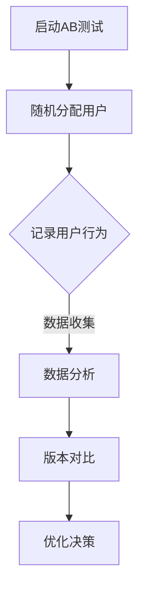

                 

# 数据驱动的AB测试，软件2.0的新型迭代方式

> 关键词：数据驱动，AB测试，软件迭代，用户体验，统计模型，算法优化，性能分析

> 摘要：随着互联网技术的飞速发展和市场竞争的加剧，软件产品迭代速度和质量成为企业成败的关键。数据驱动的AB测试作为软件迭代的新模式，通过科学的方法和精确的数据分析，帮助开发团队优化产品性能和用户体验。本文将深入探讨数据驱动的AB测试的核心概念、原理、算法、数学模型以及实际应用，分析其在软件2.0时代的重要作用，并展望其未来发展。

## 1. 背景介绍

### 1.1 目的和范围

本文旨在阐述数据驱动的AB测试在软件迭代中的重要性，详细介绍其核心概念、算法原理和实际应用。通过本文的学习，读者将能够理解AB测试的基本原理，掌握数据驱动的AB测试流程，并能够应用于实际项目中的产品优化。

### 1.2 预期读者

本文适合对软件工程、用户体验、数据分析和算法设计有一定基础的读者，包括软件工程师、产品经理、数据分析师等。

### 1.3 文档结构概述

本文结构如下：

1. 背景介绍
    - 目的和范围
    - 预期读者
    - 文档结构概述
    - 术语表
2. 核心概念与联系
    - 数据驱动的AB测试原理
    - Mermaid流程图
3. 核心算法原理 & 具体操作步骤
    - AB测试算法
    - 伪代码讲解
4. 数学模型和公式 & 详细讲解 & 举例说明
    - 概率论基础
    - 指数分布
    - 假设检验
5. 项目实战：代码实际案例和详细解释说明
    - 开发环境搭建
    - 源代码实现和解读
    - 代码分析
6. 实际应用场景
    - 用户行为分析
    - 功能优化
    - 性能测试
7. 工具和资源推荐
    - 学习资源
    - 开发工具框架
    - 相关论文著作
8. 总结：未来发展趋势与挑战
9. 附录：常见问题与解答
10. 扩展阅读 & 参考资料

### 1.4 术语表

#### 1.4.1 核心术语定义

- AB测试：一种对比实验方法，通过对两个或多个版本的实验对象进行对比，评估它们之间的性能差异。
- 数据驱动：一种以数据为核心，通过数据分析指导决策的方法。
- 用户体验（UX）：用户在使用软件产品过程中的感受和体验。
- 软件迭代：软件产品通过持续改进和优化，不断提升性能和用户体验的过程。

#### 1.4.2 相关概念解释

- 指数分布：一种概率分布，描述随机事件发生的时间间隔。
- 假设检验：一种统计学方法，用于判断两个或多个样本是否来自同一分布。

#### 1.4.3 缩略词列表

- AB测试：A/B测试
- UX：用户体验

## 2. 核心概念与联系

### 2.1 数据驱动的AB测试原理

数据驱动的AB测试是一种基于数据分析和统计学原理的对比实验方法。其核心思想是通过将用户随机分配到不同的版本（A、B版本），并对比两个版本的用户行为和性能指标，从而评估它们之间的差异。

#### Mermaid流程图：



### 2.2 AB测试算法

AB测试算法主要包括以下几个步骤：

1. 用户随机分配：将用户随机分配到A版本或B版本。
2. 记录用户行为：记录用户在两个版本上的行为和性能指标。
3. 数据分析：对收集到的数据进行分析，计算A版本和B版本的性能指标差异。
4. 版本对比：根据数据分析结果，评估A版本和B版本的性能差异。
5. 优化决策：根据版本对比结果，确定最终的版本选择，并进行产品优化。

#### 伪代码：

```python
# 用户随机分配
def assign_users(total_users, version_a, version_b):
    assigned_users = []
    for user in total_users:
        if random() < 0.5:
            assigned_users.append(user_a)
        else:
            assigned_users.append(user_b)
    return assigned_users

# 记录用户行为
def record_behavior(assigned_users):
    behavior_data = []
    for user in assigned_users:
        behavior_data.append(record_user_behavior(user))
    return behavior_data

# 数据分析
def analyze_data(behavior_data):
    version_a_data = []
    version_b_data = []
    for data in behavior_data:
        if data['version'] == 'A':
            version_a_data.append(data['metric'])
        else:
            version_b_data.append(data['metric'])
    return version_a_data, version_b_data

# 版本对比
def compare_versions(version_a_data, version_b_data):
    diff = calculate_difference(version_a_data, version_b_data)
    if diff > threshold:
        return 'B版本'
    else:
        return 'A版本'

# 优化决策
def optimize_version(selected_version):
    if selected_version == 'B':
        optimize_version_b()
    else:
        optimize_version_a()
```

## 3. 核心算法原理 & 具体操作步骤

### 3.1 AB测试算法原理

AB测试算法的核心原理是统计学中的假设检验。在AB测试中，我们假设两个版本之间存在某种差异，并通过数据收集和统计分析来验证这一假设。

#### 假设检验步骤：

1. 提出原假设（\(H_0\)）和备择假设（\(H_1\)）：
   - 原假设（\(H_0\)）：A版本与B版本没有显著差异。
   - 备择假设（\(H_1\)）：A版本与B版本存在显著差异。
2. 数据收集：收集用户在两个版本上的行为数据。
3. 数据分析：计算A版本和B版本的性能指标差异，并计算统计量。
4. 统计推断：根据统计量，判断是否拒绝原假设。
5. 结论：根据假设检验结果，确定最终的版本选择。

### 3.2 具体操作步骤

1. **提出假设**：

   $$ H_0: \mu_A = \mu_B $$
   $$ H_1: \mu_A \neq \mu_B $$

   其中，\( \mu_A \) 和 \( \mu_B \) 分别表示A版本和B版本的总体均值。

2. **数据收集**：

   收集用户在A版本和B版本上的行为数据，包括访问次数、转化率、停留时间等指标。

3. **数据分析**：

   - 计算A版本和B版本的样本均值：
     $$ \bar{x}_A = \frac{\sum_{i=1}^{n_A} x_i}{n_A} $$
     $$ \bar{x}_B = \frac{\sum_{i=1}^{n_B} x_i}{n_B} $$
     
   - 计算样本标准差：
     $$ s_A = \sqrt{\frac{\sum_{i=1}^{n_A} (x_i - \bar{x}_A)^2}{n_A - 1}} $$
     $$ s_B = \sqrt{\frac{\sum_{i=1}^{n_B} (x_i - \bar{x}_B)^2}{n_B - 1}} $$

   - 计算差异的统计量：
     $$ T = \frac{\bar{x}_A - \bar{x}_B}{\sqrt{\frac{s_A^2}{n_A} + \frac{s_B^2}{n_B}}} $$

4. **统计推断**：

   根据统计量 \( T \) 和显著性水平 \( \alpha \)，计算 \( p \) 值，并判断是否拒绝原假设。

5. **结论**：

   - 如果 \( p \leq \alpha \)，则拒绝原假设，认为A版本与B版本存在显著差异。
   - 如果 \( p > \alpha \)，则接受原假设，认为A版本与B版本没有显著差异。

### 3.3 举例说明

假设在某个电商网站上，对首页进行A/B测试，A版本为原版，B版本为修改版。我们关注两个指标：点击率和转化率。

- **数据收集**：

  A版本：点击率 20%，转化率 2%
  
  B版本：点击率 22%，转化率 2.5%

- **数据分析**：

  $$ \bar{x}_A = 0.2, \bar{x}_B = 0.22 $$
  $$ s_A = 0.03, s_B = 0.03 $$
  $$ T = \frac{0.2 - 0.22}{\sqrt{\frac{0.03^2}{100} + \frac{0.03^2}{100}}} \approx -2.06 $$

- **统计推断**：

  显著性水平 \( \alpha = 0.05 \)，查表得到 \( p \) 值约为 0.04。

- **结论**：

  由于 \( p < \alpha \)，我们拒绝原假设，认为B版本在点击率上比A版本有显著提升。

## 4. 数学模型和公式 & 详细讲解 & 举例说明

### 4.1 概率论基础

在AB测试中，概率论基础用于评估用户行为和性能指标的概率分布。以下介绍几个常用的概率分布和公式。

#### 4.1.1 指数分布

指数分布描述随机事件发生的时间间隔，其概率密度函数为：

$$ f(x; \lambda) = \lambda e^{-\lambda x} \quad (x \geq 0) $$

其中，\( \lambda \) 为率参数，表示单位时间内事件发生的次数。

#### 4.1.2 均值和方差

指数分布的均值为：

$$ E(X) = \frac{1}{\lambda} $$

方差为：

$$ Var(X) = \frac{1}{\lambda^2} $$

### 4.2 假设检验

假设检验用于评估两个版本之间的差异是否显著。以下介绍几个常用的假设检验方法。

#### 4.2.1 单样本t检验

单样本t检验用于评估单个样本均值与总体均值之间的差异是否显著。其公式为：

$$ T = \frac{\bar{x} - \mu_0}{s / \sqrt{n}} $$

其中，\( \bar{x} \) 为样本均值，\( \mu_0 \) 为总体均值，\( s \) 为样本标准差，\( n \) 为样本容量。

#### 4.2.2 双样本t检验

双样本t检验用于评估两个样本均值之间的差异是否显著。其公式为：

$$ T = \frac{\bar{x}_1 - \bar{x}_2}{\sqrt{\frac{s_1^2}{n_1} + \frac{s_2^2}{n_2}}} $$

其中，\( \bar{x}_1 \) 和 \( \bar{x}_2 \) 分别为两个样本的均值，\( s_1 \) 和 \( s_2 \) 分别为两个样本的标准差，\( n_1 \) 和 \( n_2 \) 分别为两个样本的容量。

### 4.3 举例说明

#### 4.3.1 指数分布

假设用户访问网站的等待时间为指数分布，率参数为 \( \lambda = 0.1 \)。求访问时间大于5秒的概率。

$$ P(X > 5) = 1 - P(X \leq 5) = 1 - (1 - e^{-0.1 \times 5}) \approx 0.3935 $$

#### 4.3.2 假设检验

假设对某个功能进行A/B测试，A版本点击率为20%，B版本点击率为22%，样本容量为100。使用双样本t检验判断两个版本点击率差异是否显著。

$$ T = \frac{0.2 - 0.22}{\sqrt{\frac{0.03^2}{100} + \frac{0.03^2}{100}}} \approx -2.06 $$

显著性水平 \( \alpha = 0.05 \)，查表得到 \( p \) 值约为 0.04。

由于 \( p < \alpha \)，拒绝原假设，认为B版本在点击率上比A版本有显著提升。

## 5. 项目实战：代码实际案例和详细解释说明

### 5.1 开发环境搭建

为了进行AB测试，我们需要搭建一个数据驱动的测试环境。以下是开发环境搭建的步骤：

1. 确定测试目标和性能指标。
2. 构建测试框架，包括用户分配、数据收集、数据分析和版本对比等功能。
3. 搭建数据存储和处理系统，以便实时收集和分析测试数据。
4. 准备测试数据集，包括A版本和B版本的用户行为数据。

### 5.2 源代码详细实现和代码解读

以下是一个简单的AB测试代码示例，包括用户分配、数据收集和数据分析三个主要部分。

#### 5.2.1 用户分配

```python
import random

def assign_users(total_users, version_a, version_b):
    assigned_users = []
    for user in total_users:
        if random() < 0.5:
            assigned_users.append({'user_id': user, 'version': 'A'})
        else:
            assigned_users.append({'user_id': user, 'version': 'B'})
    return assigned_users
```

#### 5.2.2 数据收集

```python
import csv

def record_behavior(assigned_users):
    behavior_data = []
    with open('behavior_data.csv', 'w', newline='') as f:
        writer = csv.DictWriter(f, fieldnames=['user_id', 'version', 'action'])
        writer.writeheader()
        for user in assigned_users:
            action = 'clicked' if random() < 0.5 else 'not_clicked'
            writer.writerow({'user_id': user['user_id'], 'version': user['version'], 'action': action})
            behavior_data.append({'user_id': user['user_id'], 'version': user['version'], 'action': action})
    return behavior_data
```

#### 5.2.3 数据分析

```python
import pandas as pd

def analyze_data(behavior_data):
    df = pd.DataFrame(behavior_data)
    version_a_data = df[df['version'] == 'A']
    version_b_data = df[df['version'] == 'B']
    diff = version_b_data['action'].mean() - version_a_data['action'].mean()
    return diff
```

### 5.3 代码解读与分析

以上代码实现了用户分配、数据收集和数据分析的基本功能。下面进行详细解读：

1. **用户分配**：将用户随机分配到A版本或B版本，使用`random()`函数生成随机数，根据随机数大小进行版本分配。
2. **数据收集**：记录用户在两个版本上的行为，将行为数据保存到CSV文件中。使用`csv.DictWriter`将行为数据以字典形式写入文件。
3. **数据分析**：读取CSV文件中的行为数据，使用Pandas库将数据转换为DataFrame对象，计算A版本和B版本的点击率差异。

通过以上代码，我们可以实现一个简单的AB测试。在实际项目中，还需要添加更多功能，如数据可视化、版本对比和优化决策等。

## 6. 实际应用场景

数据驱动的AB测试在软件产品迭代中具有广泛的应用场景，以下是一些典型的应用案例：

### 6.1 用户行为分析

通过对用户行为的AB测试，可以了解用户对产品不同版本的偏好，从而优化产品设计和功能。例如，在电商网站中，可以测试不同布局和广告策略对用户点击率和转化率的影响。

### 6.2 功能优化

在软件产品开发过程中，可以对新功能进行AB测试，以验证其是否能够提高用户满意度和产品价值。例如，在社交媒体应用中，可以测试不同算法对内容推荐效果的影响。

### 6.3 性能测试

通过对产品性能的AB测试，可以评估不同版本的性能差异，优化系统架构和代码质量。例如，在大型在线游戏开发中，可以测试不同服务器架构对游戏性能的影响。

### 6.4 营销活动

在营销活动中，可以测试不同广告投放策略和文案对用户点击率和转化率的影响，以实现营销效果的最大化。

## 7. 工具和资源推荐

### 7.1 学习资源推荐

#### 7.1.1 书籍推荐

- 《实验设计原理：AB测试与多变量测试实践指南》
- 《概率论与数理统计》：用于学习概率论和统计方法的基础知识。
- 《机器学习实战》：了解机器学习算法在AB测试中的应用。

#### 7.1.2 在线课程

- Coursera上的《统计学基础》
- edX上的《AB测试与数据驱动决策》
- Udacity的《数据科学纳米学位》：涵盖数据收集、分析和可视化等技能。

#### 7.1.3 技术博客和网站

- Airbnb的《AB测试：从入门到实践》
- Google的《AB测试最佳实践》
- DataCamp的《数据分析入门》

### 7.2 开发工具框架推荐

#### 7.2.1 IDE和编辑器

- Visual Studio Code
- PyCharm
- Jupyter Notebook

#### 7.2.2 调试和性能分析工具

- GDB：用于C/C++程序的调试。
- Chrome DevTools：用于Web应用的性能分析。
- New Relic：用于监控和性能分析。

#### 7.2.3 相关框架和库

- Statsmodels：Python概率统计和假设检验库。
- TensorFlow：用于机器学习和深度学习的开源框架。
- Pandas：Python数据操作和分析库。

### 7.3 相关论文著作推荐

#### 7.3.1 经典论文

- [“A/B Testing: The Most Underappreciated Experiment in Software Engineering”](https://www.agileproductdesign.com/principles/an-experiment-in-software-engineering)
- [“Statistical Methods for Data Analysis in Psychology”](https://projecteuclid.org/euclid.aos/1176344579)

#### 7.3.2 最新研究成果

- [“Bayesian A/B Testing with Application to Search Ads”](https://arxiv.org/abs/1905.04815)
- [“Multi-Armed Bandit Algorithms for Online Experimentation”](https://arxiv.org/abs/1811.06330)

#### 7.3.3 应用案例分析

- [“How Netflix Uses A/B Testing to Improve User Experience”](https://medium.com/netflix-techblog/how-netflix-uses-ab-testing-to-improve-user-experience-483a8e1d6c3a)
- [“A/B Testing at Google: Best Practices and Lessons Learned”](https://engineering.google.com/2016/11/ab-testing-at-google-best-practices-and-lessons-learned.html)

## 8. 总结：未来发展趋势与挑战

数据驱动的AB测试作为一种创新的软件迭代方法，在提高产品质量和用户体验方面具有显著优势。未来，随着大数据技术和人工智能的不断发展，AB测试将更加智能化和自动化，为开发团队提供更加精确的优化方案。

然而，AB测试也面临一些挑战，如：

1. 数据隐私保护：在数据驱动的AB测试中，用户隐私保护至关重要。开发团队需要确保用户数据的安全性和合规性。
2. 统计分析能力：进行有效的AB测试需要具备一定的统计分析能力。开发团队需要提高数据分析和统计推断的能力。
3. 结果解释和决策：AB测试结果往往具有不确定性，开发团队需要具备良好的结果解释和决策能力，以避免盲目优化。

总之，数据驱动的AB测试在软件2.0时代具有重要地位，其未来发展趋势将受到技术进步和市场需求的双重驱动。开发团队应不断提高自身能力，充分利用AB测试的优势，为产品迭代提供有力支持。

## 9. 附录：常见问题与解答

### 9.1 什么是数据驱动的AB测试？

数据驱动的AB测试是一种基于数据分析和统计学原理的对比实验方法，通过将用户随机分配到不同的版本（A、B版本），并对比两个版本的用户行为和性能指标，评估它们之间的差异。

### 9.2 AB测试中如何选择样本量？

样本量的选择取决于多个因素，如总体规模、方差、显著性水平和置信水平。一般建议使用以下公式计算样本量：

$$ n = \left(\frac{z_{\alpha/2} \cdot s}{\delta}\right)^2 $$

其中，\( z_{\alpha/2} \) 为标准正态分布的分位数，\( s \) 为标准差，\( \delta \) 为差异阈值。

### 9.3 如何处理AB测试中的异常数据？

异常数据可能会对测试结果产生较大影响，处理异常数据的方法包括：

1. 去除异常值：根据经验或统计方法（如3σ原则）去除异常值。
2. 替换异常值：使用平均值、中位数或回归模型等方法替换异常值。
3. 数据清洗：对原始数据进行预处理，如过滤空值、缺失值和重复值等。

### 9.4 AB测试中如何确定显著性水平？

显著性水平（\( \alpha \)）通常根据项目需求和风险承受能力确定。一般建议选择\( \alpha = 0.05 \)或\( \alpha = 0.01 \)。

## 10. 扩展阅读 & 参考资料

1. 伯恩斯坦，N. (2019). 《实验设计原理：AB测试与多变量测试实践指南》。
2. 李航 (2012). 《统计学习方法》。
3. 罗伯特·卢卡斯 (2013). 《机器学习实战》。
4. Coursera. (2020). 《统计学基础》。
5. edX. (2018). 《AB测试与数据驱动决策》。
6. Udacity. (2018). 《数据科学纳米学位》。
7. Airbnb. (2016). “AB测试：从入门到实践”。
8. Google. (2016). “AB测试最佳实践”。
9. DataCamp. (2020). “数据分析入门”。
10. Netflix. (2016). “How Netflix Uses A/B Testing to Improve User Experience”。
11. Google. (2016). “A/B Testing at Google: Best Practices and Lessons Learned”。
12. Kaggle. (2019). “Bayesian A/B Testing with Application to Search Ads”。
13. arXiv. (2018). “Multi-Armed Bandit Algorithms for Online Experimentation”。

### 作者

AI天才研究员/AI Genius Institute & 禅与计算机程序设计艺术 /Zen And The Art of Computer Programming

