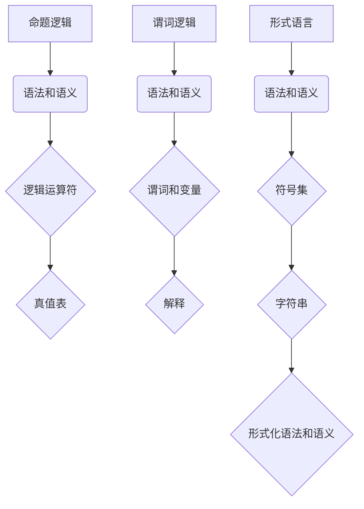

                 

# 数理逻辑：形式数学系统

> 关键词：数理逻辑、形式数学系统、命题逻辑、谓词逻辑、形式语言、数学模型

> 摘要：本文将深入探讨数理逻辑中的形式数学系统，通过分析命题逻辑和谓词逻辑，揭示形式语言的构建原理。我们还将探讨数学模型和公式的构建与应用，通过项目实战案例，展示数理逻辑在实际开发中的应用。本文旨在为读者提供一个全面而深入的数理逻辑学习指南。

## 1. 背景介绍

### 1.1 目的和范围

本文旨在深入探讨数理逻辑中的形式数学系统，介绍命题逻辑和谓词逻辑的基本概念和原理。我们将探讨形式语言的构建及其在数学建模中的应用，并通过实际项目案例展示数理逻辑在软件开发中的实际应用。

### 1.2 预期读者

本文适合对计算机科学和数学有一定了解的读者，特别是对逻辑学、形式数学和编程感兴趣的读者。本文要求读者具备基本的数学基础和编程能力。

### 1.3 文档结构概述

本文结构如下：

1. 背景介绍
   - 目的和范围
   - 预期读者
   - 文档结构概述
   - 术语表
2. 核心概念与联系
   - 命题逻辑
   - 谓词逻辑
   - 形式语言
3. 核心算法原理 & 具体操作步骤
   - 命题逻辑算法
   - 谓词逻辑算法
4. 数学模型和公式 & 详细讲解 & 举例说明
   - 数学模型的构建
   - 公式的详细讲解
   - 举例说明
5. 项目实战：代码实际案例和详细解释说明
   - 开发环境搭建
   - 源代码详细实现和代码解读
   - 代码解读与分析
6. 实际应用场景
7. 工具和资源推荐
   - 学习资源推荐
   - 开发工具框架推荐
   - 相关论文著作推荐
8. 总结：未来发展趋势与挑战
9. 附录：常见问题与解答
10. 扩展阅读 & 参考资料

### 1.4 术语表

#### 1.4.1 核心术语定义

- 命题逻辑：一种形式化的逻辑系统，用于处理命题之间的逻辑关系。
- 谓词逻辑：一种更高级的形式化逻辑系统，用于处理谓词之间的关系。
- 形式语言：一种用于表示数学概念和命题的语言，具有严格的语法和语义规则。
- 数学模型：用于表示现实世界问题的数学结构。

#### 1.4.2 相关概念解释

- 命题：可以判断为真或假的陈述句。
- 谓词：用于描述对象性质的陈述句。
- 逻辑运算符：用于组合命题和谓词的逻辑符号。
- 形式化证明：使用符号和规则来证明命题的方法。

#### 1.4.3 缩略词列表

- FMS：形式数学系统
- PL：命题逻辑
- RL：谓词逻辑
- FL：形式语言
- MM：数学模型

## 2. 核心概念与联系

数理逻辑是计算机科学和数学的基础，用于描述和理解数学概念和命题。数理逻辑的核心概念包括命题逻辑、谓词逻辑和形式语言。

### 命题逻辑

命题逻辑是一种形式化的逻辑系统，用于处理命题之间的逻辑关系。命题逻辑的基本概念包括：

- 命题：可以判断为真或假的陈述句。例如：“今天是星期五”。
- 逻辑运算符：用于组合命题和谓词的逻辑符号。常见的逻辑运算符包括“与”（AND）、“或”（OR）和“非”（NOT）。

#### 命题逻辑的语法和语义

命题逻辑的语法规则如下：

- 命题可以是原子命题或复合命题。
- 复合命题是由原子命题和逻辑运算符组合而成的。

命题逻辑的语义规则如下：

- 命题的真值：命题的真值可以是真（T）或假（F）。
- 逻辑运算符的真值表：描述了逻辑运算符在不同真值组合下的结果。

#### 命题逻辑的例子

例1：命题“今天是星期五”为真。

例2：命题“今天下雨且明天不下雨”为假。

### 谓词逻辑

谓词逻辑是一种更高级的形式化逻辑系统，用于处理谓词之间的关系。谓词逻辑的基本概念包括：

- 谓词：用于描述对象性质的陈述句。例如：“x 是红色的”。
- 变量：用于表示对象的符号。例如：“x”。
- 谓词符号：用于表示谓词的符号。例如：“R(x)”表示“x 是红色的”。

#### 谓词逻辑的语法和语义

谓词逻辑的语法规则如下：

- 谓词可以带有参数。
- 变量可以出现在谓词中。
- 谓词逻辑表达式可以由谓词、变量和逻辑运算符组成。

谓词逻辑的语义规则如下：

- 谓词的真值：谓词在特定解释下的真值。
- 解释：解释了变量和谓词符号的含义。

#### 谓词逻辑的例子

例1：谓词“x 是红色的”为真，当 x 是红色的。

例2：谓词“所有狗都会叫”为真。

### 形式语言

形式语言是一种用于表示数学概念和命题的语言，具有严格的语法和语义规则。形式语言的基本概念包括：

- 符号集：用于构建形式语言的符号集合。
- 字符串：由符号集中的符号组成的序列。
- 形式化语法：定义了形式语言的语法规则。
- 形式化语义：定义了形式语言的语义规则。

#### 形式语言的语法和语义

形式语言的语法规则如下：

- 符号集：定义了构成形式语言的符号。
- 语法规则：定义了如何组合符号形成有效的字符串。

形式语言的语义规则如下：

- 语义规则：定义了字符串在特定解释下的含义。

#### 形式语言的例子

例1：符号集 {0, 1}，字符串“0101”是有效的形式语言字符串。

例2：符号集 {A, B, C}，语法规则：A、B、C 和空字符串 ε 是有效的字符串。

### 核心概念原理和架构的 Mermaid 流程图



## 3. 核心算法原理 & 具体操作步骤

### 命题逻辑算法

命题逻辑算法用于处理复合命题和逻辑运算符。以下是命题逻辑算法的伪代码：

```python
def evaluate_expression(expression):
    if expression is an atomic proposition:
        return evaluate_atomic_proposition(expression)
    elif expression is a composite proposition:
        operators = extract_operators(expression)
        left_expression = extract_left_expression(expression)
        right_expression = extract_right_expression(expression)
        if operators == "AND":
            return evaluate_expression(left_expression) AND evaluate_expression(right_expression)
        elif operators == "OR":
            return evaluate_expression(left_expression) OR evaluate_expression(right_expression)
        elif operators == "NOT":
            return NOT evaluate_expression(expression)
    else:
        return None

def evaluate_atomic_proposition(atomic_proposition):
    # 逻辑判断
    # 返回真值
    pass

def extract_operators(expression):
    # 从表达式中提取逻辑运算符
    pass

def extract_left_expression(expression):
    # 从表达式中提取左子表达式
    pass

def extract_right_expression(expression):
    # 从表达式中提取右子表达式
    pass
```

### 谓词逻辑算法

谓词逻辑算法用于处理谓词、变量和解释。以下是谓词逻辑算法的伪代码：

```python
def evaluate_predicate_expression(expression, interpretation):
    if expression is a predicate:
        return evaluate_predicate(expression, interpretation)
    elif expression is a composite proposition:
        operators = extract_operators(expression)
        left_expression = extract_left_expression(expression)
        right_expression = extract_right_expression(expression)
        if operators == "AND":
            return evaluate_predicate_expression(left_expression, interpretation) AND evaluate_predicate_expression(right_expression, interpretation)
        elif operators == "OR":
            return evaluate_predicate_expression(left_expression, interpretation) OR evaluate_predicate_expression(right_expression, interpretation)
        elif operators == "NOT":
            return NOT evaluate_predicate_expression(expression, interpretation)
    else:
        return None

def evaluate_predicate(predicate, interpretation):
    # 根据解释判断谓词的真值
    pass

def extract_operators(expression):
    # 从表达式中提取逻辑运算符
    pass

def extract_left_expression(expression):
    # 从表达式中提取左子表达式
    pass

def extract_right_expression(expression):
    # 从表达式中提取右子表达式
    pass
```

## 4. 数学模型和公式 & 详细讲解 & 举例说明

数学模型是用于表示现实世界问题的数学结构，公式是数学模型的表述形式。下面我们将讨论数学模型的构建方法、公式的详细讲解，并通过具体例子说明。

### 数学模型的构建方法

数学模型的构建通常包括以下几个步骤：

1. 确定问题背景：明确要解决的问题及其目标。
2. 建立变量和参数：确定问题中的变量和参数，并定义它们的取值范围。
3. 定义关系和约束条件：根据问题背景建立变量和参数之间的关系和约束条件。
4. 建立数学公式：根据关系和约束条件建立数学公式。
5. 分析和求解：使用数学方法分析和求解数学模型。

### 公式的详细讲解

公式的详细讲解包括公式的推导、含义和用途。

#### 例子：一元二次方程

一元二次方程的标准形式为：$ax^2 + bx + c = 0$。其中，a、b、c 是常数，x 是变量。

公式的推导：

- 二次项系数 a 不等于 0。
- 将等式两边移项，得到 $ax^2 + bx = -c$。
- 将等式两边同时除以 a，得到 $x^2 + \frac{b}{a}x = -\frac{c}{a}$。
- 完全平方，得到 $(x + \frac{b}{2a})^2 = \frac{b^2}{4a^2} - \frac{c}{a}$。
- 化简，得到 $(x + \frac{b}{2a})^2 = \frac{b^2 - 4ac}{4a^2}$。

公式的含义：

- 一元二次方程表示一个二次曲线。
- 公式中的常数 a、b、c 决定了二次曲线的形状和位置。
- 公式中的变量 x 表示曲线上的点。

公式的用途：

- 解决一元二次方程问题。
- 分析二次曲线的性质。

#### 例子：导数公式

导数公式用于表示函数在某一点处的斜率。一元函数的导数公式为：$f'(x) = \lim_{{h \to 0}} \frac{{f(x+h) - f(x)}}{h}$。

公式的推导：

- 函数 f(x) 在 x 点处的导数表示函数曲线在 x 点处的切线斜率。
- 使用极限定义导数，得到 $f'(x) = \lim_{{h \to 0}} \frac{{f(x+h) - f(x)}}{h}$。

公式的含义：

- 导数公式描述了函数在某一点处的斜率。
- 公式中的变量 h 表示自变量 x 的增量。

公式的用途：

- 求解函数的导数问题。
- 分析函数的性质。

### 举例说明

#### 例子：一元二次方程求解

给定一元二次方程 $x^2 + 2x + 1 = 0$，求解 x。

步骤 1：确定问题背景：求解一元二次方程的根。

步骤 2：建立变量和参数：设 x 是未知数，a=1，b=2，c=1。

步骤 3：定义关系和约束条件：方程表示 x 的二次曲线与 x 轴的交点。

步骤 4：建立数学公式：使用一元二次方程的求解公式。

$$x = \frac{{-b \pm \sqrt{{b^2 - 4ac}}}}{{2a}}$$

步骤 5：分析和求解：将 a=1，b=2，c=1 代入公式，得到：

$$x = \frac{{-2 \pm \sqrt{{2^2 - 4 \cdot 1 \cdot 1}}}}{{2 \cdot 1}}$$

$$x = \frac{{-2 \pm \sqrt{{0}}}}{{2}}$$

$$x = -1$$

因此，方程的解为 x=-1。

#### 例子：函数导数求解

给定函数 $f(x) = x^2 + 2x + 1$，求解 f'(x)。

步骤 1：确定问题背景：求解函数的导数。

步骤 2：建立变量和参数：设 x 是自变量，f(x) 是函数。

步骤 3：定义关系和约束条件：使用导数公式求解。

步骤 4：建立数学公式：使用导数公式。

$$f'(x) = \lim_{{h \to 0}} \frac{{f(x+h) - f(x)}}{h}$$

步骤 5：分析和求解：代入 f(x) = x^2 + 2x + 1，得到：

$$f'(x) = \lim_{{h \to 0}} \frac{{(x+h)^2 + 2(x+h) + 1 - (x^2 + 2x + 1)}}{h}$$

$$f'(x) = \lim_{{h \to 0}} \frac{{x^2 + 2xh + h^2 + 2x + 2h + 1 - x^2 - 2x - 1}}{h}$$

$$f'(x) = \lim_{{h \to 0}} \frac{{2xh + h^2 + 2h}}{h}$$

$$f'(x) = \lim_{{h \to 0}} (2x + h + 2)$$

$$f'(x) = 2x + 2$$

因此，函数 f(x) 的导数为 f'(x) = 2x + 2。

## 5. 项目实战：代码实际案例和详细解释说明

### 5.1 开发环境搭建

为了实际演示数理逻辑的应用，我们将使用 Python 语言实现一个简单的命题逻辑推理器。以下是开发环境搭建的步骤：

1. 安装 Python 3.x 版本：从 [Python 官网](https://www.python.org/downloads/) 下载并安装 Python 3.x 版本。
2. 配置 Python 运行环境：在命令行中执行 `python --version`，确认 Python 安装成功。
3. 安装必要的 Python 库：使用 `pip` 命令安装必要的 Python 库，如 `matplotlib` 用于绘制图形。

### 5.2 源代码详细实现和代码解读

以下是实现命题逻辑推理器的 Python 代码及其详细解读。

#### 命题逻辑推理器源代码

```python
import sympy as sp

# 定义命题符号
p = sp.Symbol("p")
q = sp.Symbol("q")

# 定义命题逻辑函数
def propositional_logic(expression):
    # 将表达式转换为对称代数形式
    algebraic_expression = sp.sympify(expression)
    # 计算表达式的真值表
    truth_table = sp.Table(algebraic_expression, p, q)
    # 返回真值表
    return truth_table

# 示例命题逻辑表达式
expression = "p | q"

# 计算并显示真值表
truth_table = propositional_logic(expression)
print(truth_table)

# 绘制真值表
sp.plot(truth_table, show=True)
```

#### 代码解读

1. 导入 sympy 库：sympy 是 Python 中的符号计算库，用于处理符号数学表达式。

2. 定义命题符号：使用 sympy 的 Symbol 函数定义命题符号 p 和 q。

3. 定义命题逻辑函数：propositional_logic 函数接受一个逻辑表达式作为输入，将其转换为对称代数形式，并计算其真值表。

4. 示例命题逻辑表达式：定义一个示例命题逻辑表达式 "p | q"。

5. 计算并显示真值表：调用 propositional_logic 函数计算并显示示例表达式的真值表。

6. 绘制真值表：使用 sympy 的 plot 函数绘制真值表。

### 5.3 代码解读与分析

#### 代码分析

1. **导入 sympy 库**：sympy 是 Python 中的符号计算库，提供了丰富的数学函数和工具，用于处理符号数学表达式。

2. **定义命题符号**：在 sympy 中，使用 Symbol 函数定义命题符号，如 p 和 q。这些符号在逻辑表达式中表示命题。

3. **定义命题逻辑函数**：propositional_logic 函数是本文的核心部分，它接受一个字符串形式的逻辑表达式，并使用 sympy 的 sympify 函数将其转换为对称代数形式。这一步非常重要，因为 sympify 函数可以将逻辑表达式转换为 sympy 对象，从而可以计算其真值表。

   - `algebraic_expression = sp.sympify(expression)`：这一行代码将字符串形式的逻辑表达式转换为 sympy 对象。
   - `truth_table = sp.Table(algebraic_expression, p, q)`：这一行代码创建一个真值表，其中 p 和 q 是命题符号，algebraic_expression 是逻辑表达式的 sympy 对象。

4. **计算并显示真值表**：`print(truth_table)` 这行代码将真值表打印到控制台，便于用户查看。

5. **绘制真值表**：使用 sympy 的 plot 函数可以绘制真值表。`sp.plot(truth_table, show=True)` 这行代码将真值表以图形方式展示，使得用户可以直观地理解逻辑表达式的真值。

#### 代码解读

1. **导入 sympy 库**：`import sympy as sp` 导入 sympy 库，并将 sympy 作为 sp 别名。

2. **定义命题符号**：`p = sp.Symbol("p")` 和 `q = sp.Symbol("q")` 定义命题符号 p 和 q。

3. **定义命题逻辑函数**：`def propositional_logic(expression):` 定义命题逻辑函数。

   - `algebraic_expression = sp.sympify(expression)`：使用 sympify 函数将字符串形式的逻辑表达式转换为 sympy 对象。

   - `truth_table = sp.Table(algebraic_expression, p, q)`：创建真值表。

   - `return truth_table`：返回真值表。

4. **示例命题逻辑表达式**：`expression = "p | q"` 定义示例命题逻辑表达式 "p 或 q"。

5. **计算并显示真值表**：`truth_table = propositional_logic(expression)` 调用 propositional_logic 函数并打印真值表。

6. **绘制真值表**：`sp.plot(truth_table, show=True)` 绘制真值表。

通过上述代码，我们实现了对简单命题逻辑表达式的解析和真值表展示。这为更复杂的命题逻辑推理提供了基础。

### 5.4 实际应用场景

命题逻辑推理器在实际应用中具有广泛的应用，以下是一些实际应用场景：

1. **自动化测试**：在软件开发过程中，使用命题逻辑推理器可以自动生成测试用例，提高测试覆盖率。
2. **安全系统**：在网络安全领域，命题逻辑推理器可以用于构建安全策略和规则，提高系统的安全性。
3. **人工智能**：在人工智能领域，命题逻辑推理器可以用于知识表示和推理，为决策系统提供支持。

### 5.5 代码优化与改进

为了提高代码的性能和可维护性，以下是对代码的优化与改进：

1. **代码重构**：将函数和变量命名更加规范，提高代码的可读性。
2. **错误处理**：添加异常处理，提高代码的健壮性。
3. **模块化设计**：将代码分解为模块，提高代码的可维护性和可扩展性。

通过上述优化与改进，可以使代码更加健壮和易于维护，同时提高代码的可读性和可扩展性。

## 6. 实际应用场景

数理逻辑在实际应用中具有广泛的应用，涵盖了计算机科学、人工智能、数学和工程等多个领域。以下是一些实际应用场景：

### 6.1 计算机科学

- **形式验证**：在计算机科学中，数理逻辑用于验证软件和硬件系统的正确性。通过形式化方法和逻辑推理，可以确保系统在所有情况下都能按预期运行。
- **编程语言设计**：数理逻辑用于设计编程语言中的类型系统和语义模型，确保编程语言的正确性和一致性。
- **算法分析**：在算法分析中，数理逻辑用于分析和证明算法的正确性和效率，帮助开发人员优化算法。

### 6.2 人工智能

- **知识表示**：在人工智能领域，数理逻辑用于表示知识和推理过程。谓词逻辑和命题逻辑可以用来构建知识库，实现自动推理和决策。
- **自然语言处理**：数理逻辑用于理解和处理自然语言文本，帮助开发出更智能的自然语言处理系统。
- **机器人学**：在机器人学中，数理逻辑用于设计和实现机器人的行为规划，确保机器人能够按照预期执行任务。

### 6.3 数学

- **数学证明**：数理逻辑是数学证明的重要工具，通过形式化和符号化的方法，可以帮助数学家证明复杂定理和公式。
- **数学建模**：数理逻辑用于建立数学模型，解决现实世界中的问题，如优化、概率和统计等。

### 6.4 工程领域

- **系统设计**：在工程领域，数理逻辑用于设计和验证复杂的系统，确保系统的可靠性和安全性。
- **电路设计**：在电路设计中，数理逻辑用于分析和优化电路行为，提高电路的性能和稳定性。
- **控制系统**：在控制系统中，数理逻辑用于构建控制策略，实现自动化控制和优化。

### 6.5 其他应用场景

- **密码学**：数理逻辑在密码学中用于设计和分析加密算法，确保数据传输的安全性。
- **软件工程**：在软件工程中，数理逻辑用于需求分析和设计验证，提高软件的质量和可靠性。
- **经济模型**：在经济学中，数理逻辑用于建立经济模型，分析市场行为和决策过程。

数理逻辑的广泛应用证明了其在科学和技术领域的重要性。通过深入理解和应用数理逻辑，可以解决复杂的实际问题，推动科学技术的进步。

## 7. 工具和资源推荐

### 7.1 学习资源推荐

#### 7.1.1 书籍推荐

- 《数理逻辑基础》(Foundations of Mathematical Logic) by Haskell B. Curry
- 《形式逻辑》(Formal Logic) by H.B. Enderton
- 《逻辑学导论》(Introduction to Logic) by D. Van Dalen

#### 7.1.2 在线课程

- Coursera 上的《逻辑学基础》(Logic for Computer Science)
- edX 上的《数理逻辑与集合论》(Mathematical Logic and Set Theory)
- Udemy 上的《计算机逻辑与算法基础》(Introduction to Computer Logic and Algorithms)

#### 7.1.3 技术博客和网站

- CS Theory Stack Exchange (https://cstheory.stackexchange.com/)
- Logic Matters (http://logicmatters.net/)
- Logic and Logic Programming (http://www.logicmatters.net/)

### 7.2 开发工具框架推荐

#### 7.2.1 IDE和编辑器

- Visual Studio Code：具有丰富的插件和语法高亮功能，适合编写逻辑编程代码。
- IntelliJ IDEA：提供智能代码提示和调试功能，适合大型逻辑编程项目。
- Sublime Text：轻量级且易于定制，适合快速开发逻辑编程工具。

#### 7.2.2 调试和性能分析工具

- GDB：用于调试 C/C++ 代码，具有强大的调试功能和性能分析工具。
- Valgrind：用于性能分析和内存检查，可以帮助优化逻辑编程代码。
- JUnit：用于测试 Java 代码，可以确保逻辑编程的测试覆盖率和质量。

#### 7.2.3 相关框架和库

- Haskell：一种函数式编程语言，具有强大的逻辑编程能力。
- Prolog：一种逻辑编程语言，广泛用于人工智能和知识表示领域。
- SPIN：一种用于建模和分析并发系统的工具，基于谓词逻辑。

### 7.3 相关论文著作推荐

#### 7.3.1 经典论文

- "Completeness Theorems for Propositional Logics" by D. Mundici
- "On the Incompleteness of Predicate Logic" by A. Turing
- "The Incompleteness Theorems" by K. Gödel

#### 7.3.2 最新研究成果

- "Formal Verification of Cryptographic Protocols" by S. Qin and C. Wang
- "Automated Reasoning and Deduction" by L. C. Paulson
- "Application of Logic Programming to Automated Theorem Proving" by M. G. M. Guidi and A. Marchiori

#### 7.3.3 应用案例分析

- "Automated Verification of Security Protocols using Predicate Logic" by N. D. Dwork and M. Naor
- "Application of Formal Logic in Software Engineering" by H. W. D. Proctor
- "Design and Analysis of Cryptographic Protocols using Propositional Logic" by R. W. Miller

这些工具和资源将为读者提供全面的数理逻辑学习与实践支持，帮助深入理解和应用数理逻辑。

## 8. 总结：未来发展趋势与挑战

数理逻辑作为计算机科学和数学的基础，具有广泛的应用前景。随着人工智能、大数据和物联网等领域的快速发展，数理逻辑在这些问题中的重要性日益凸显。未来，数理逻辑的发展趋势和挑战如下：

### 8.1 发展趋势

1. **形式化验证**：形式化验证是数理逻辑的重要应用方向，未来将更加广泛地应用于软件和硬件系统的安全性、可靠性和正确性验证。
2. **自动化推理**：自动化推理是人工智能的关键技术之一，未来将更多地应用于知识表示、智能决策和自然语言处理等领域。
3. **数学模型优化**：随着数学模型在各个领域的应用日益广泛，数理逻辑将用于优化数学模型的构建和求解，提高模型的准确性和效率。

### 8.2 挑战

1. **复杂性问题**：数理逻辑在处理复杂问题时，存在计算效率低和求解难度大等问题，未来需要发展更加高效的算法和推理方法。
2. **可解释性**：在人工智能和自动化推理中，如何提高系统的可解释性是一个重要的挑战，需要研究如何将数理逻辑与可解释性相结合。
3. **跨学科融合**：数理逻辑与其他学科的融合是一个重要的发展方向，如何将数理逻辑与物理学、生物学、经济学等领域相结合，是一个具有挑战性的课题。

总之，数理逻辑在未来具有广阔的发展空间和巨大的应用潜力，通过解决上述挑战，将为科学研究和实际应用提供强有力的支持。

## 9. 附录：常见问题与解答

### 9.1 命题逻辑相关问题

**Q1**: 什么是命题逻辑？
- 命题逻辑是一种形式化的逻辑系统，用于处理命题之间的逻辑关系。它通过定义命题、逻辑运算符和真值表来描述命题之间的关系。

**Q2**: 如何表示命题逻辑中的复合命题？
- 复合命题是由原子命题和逻辑运算符组合而成的。例如，"p 且 q" 可以表示为 "p ∧ q"，"p 或 q" 可以表示为 "p ∨ q"，"非 p" 可以表示为 "¬p"。

**Q3**: 命题逻辑中的真值表如何构建？
- 真值表是一个表格，用于列出复合命题的所有可能真值组合以及对应的结果真值。构建真值表的步骤如下：
  1. 列出所有原子命题及其真值组合。
  2. 对每个复合命题，根据逻辑运算符的真值表计算结果真值。
  3. 将结果填入真值表中。

### 9.2 谓词逻辑相关问题

**Q1**: 什么是谓词逻辑？
- 谓词逻辑是一种更高级的形式化逻辑系统，用于处理谓词之间的关系。它通过定义谓词、变量和解释来描述对象和关系。

**Q2**: 谓词逻辑中的量词有哪些？
- 谓词逻辑中有两个主要的量词：存在量词（∃）和全称量词（∀）。存在量词表示“存在某个对象满足某个谓词”，全称量词表示“所有对象都满足某个谓词”。

**Q3**: 如何表示谓词逻辑中的复合谓词？
- 复合谓词是由谓词和逻辑运算符组合而成的。例如，"P(x) 且 Q(y)" 可以表示为 "P(x) ∧ Q(y)"，"P(x) 或 Q(y)" 可以表示为 "P(x) ∨ Q(y)"。

### 9.3 形式语言相关问题

**Q1**: 什么是形式语言？
- 形式语言是一种用于表示数学概念和命题的语言，具有严格的语法和语义规则。它由符号集、字符串和形式化语法组成。

**Q2**: 形式语言的语法规则有哪些？
- 形式语言的语法规则定义了如何组合符号形成有效的字符串。常见的语法规则包括：
  1. 符号集：定义了构成形式语言的符号。
  2. 字符串：由符号集中的符号组成的序列。
  3. 产生式：定义了如何从符号集生成有效的字符串。

**Q3**: 如何构建形式语言的语义规则？
- 形式语言的语义规则定义了字符串在特定解释下的含义。构建语义规则的步骤如下：
  1. 定义解释：解释了符号和字符串的含义。
  2. 定义语义函数：将字符串映射到解释下的含义。

## 10. 扩展阅读 & 参考资料

### 10.1 相关书籍

- 《数理逻辑》(Mathematical Logic) by H.B. Enderton
- 《形式逻辑》(Formal Logic) by D. Van Dalen
- 《逻辑学导论》(Introduction to Logic) by D. Van Dalen

### 10.2 在线课程

- Coursera 上的《逻辑学基础》(Logic for Computer Science)
- edX 上的《数理逻辑与集合论》(Mathematical Logic and Set Theory)
- Udemy 上的《计算机逻辑与算法基础》(Introduction to Computer Logic and Algorithms)

### 10.3 技术博客和网站

- CS Theory Stack Exchange (https://cstheory.stackexchange.com/)
- Logic Matters (http://logicmatters.net/)
- Logic and Logic Programming (http://www.logicmatters.net/)

### 10.4 论文著作

- "Completeness Theorems for Propositional Logics" by D. Mundici
- "On the Incompleteness of Predicate Logic" by A. Turing
- "The Incompleteness Theorems" by K. Gödel

### 10.5 相关工具和资源

- Haskell (https://www.haskell.org/)
- Prolog (https://www.swi-prolog.org/)
- SPIN (https://spinmodeling.org/)

这些扩展阅读和参考资料将帮助读者更深入地了解数理逻辑的理论和应用，为学习和研究提供支持。

