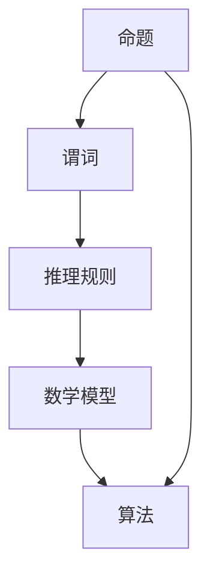

                 

# 数理逻辑：形式符号定义

> **关键词**：数理逻辑、形式符号、命题、谓词、推理规则、数学模型、算法、实战案例

> **摘要**：本文将深入探讨数理逻辑中的形式符号定义，解析命题、谓词等核心概念，并通过详细的算法原理和具体操作步骤，帮助读者掌握数理逻辑的基本工具和方法。此外，文章还将结合实际项目案例，讲解数理逻辑在实际开发中的应用，为读者提供全面的技术指南。

## 1. 背景介绍

### 1.1 目的和范围

本文旨在帮助读者理解和掌握数理逻辑中的形式符号定义，以及其在计算机科学中的应用。数理逻辑作为形式逻辑的一个分支，在数学、计算机科学和哲学等领域有着广泛的应用。通过本文的讲解，读者将能够：

1. 理解命题和谓词的概念。
2. 掌握基本的推理规则和数学模型。
3. 学习使用伪代码和latex格式进行算法和公式的表达。
4. 了解数理逻辑在实际项目中的应用场景。

### 1.2 预期读者

本文适合以下读者群体：

1. 计算机科学和数学专业的学生和研究人员。
2. 软件开发工程师，尤其是对算法和逻辑推理有兴趣的从业者。
3. 对数理逻辑和形式化方法感兴趣的学者和爱好者。

### 1.3 文档结构概述

本文分为以下几个部分：

1. 背景介绍：介绍本文的目的、范围、预期读者和文档结构。
2. 核心概念与联系：定义数理逻辑中的核心概念，并用Mermaid流程图展示它们之间的关系。
3. 核心算法原理 & 具体操作步骤：使用伪代码详细阐述数理逻辑的基本算法原理和操作步骤。
4. 数学模型和公式 & 详细讲解 & 举例说明：讲解数理逻辑中的数学模型和公式，并给出具体示例。
5. 项目实战：结合实际项目案例，展示数理逻辑的应用。
6. 实际应用场景：分析数理逻辑在实际开发中的应用。
7. 工具和资源推荐：推荐相关学习资源、开发工具和论文著作。
8. 总结：展望数理逻辑的未来发展趋势和挑战。
9. 附录：常见问题与解答。
10. 扩展阅读 & 参考资料：提供进一步的阅读资料。

### 1.4 术语表

#### 1.4.1 核心术语定义

- **数理逻辑**：形式逻辑的一个分支，使用数学符号和公式来表示逻辑推理。
- **命题**：可以判断真假的陈述句。
- **谓词**：描述对象属性或关系的逻辑函数。
- **推理规则**：用于推导新命题的规则。
- **数学模型**：用数学符号和公式表示现实世界的问题。
- **算法**：解决问题的步骤序列。

#### 1.4.2 相关概念解释

- **形式符号**：用于表示命题、谓词和推理规则的符号集合。
- **谓词逻辑**：以谓词为基础的逻辑系统。
- **命题逻辑**：以命题为基础的逻辑系统。

#### 1.4.3 缩略词列表

- **ACL**：形式逻辑（Abstract Calculus of Classes）
- **CSL**：计算机科学逻辑（Computational Logic）
- **FOL**：形式逻辑（Formal Logic）
- **PL**：命题逻辑（Propositional Logic）
- **TL**：谓词逻辑（Term Logic）

## 2. 核心概念与联系

数理逻辑中的核心概念包括命题、谓词、推理规则等。这些概念不仅相互独立，而且相互联系，构成了数理逻辑的基础。以下是一个用Mermaid流程图表示的核心概念与联系：



### 命题（Proposition）

命题是可以判断真假的陈述句。在数理逻辑中，命题用字母P、Q、R等表示。命题逻辑（PL）主要研究命题之间的关系和组合。

### 谓词（Predicate）

谓词是描述对象属性或关系的逻辑函数。在谓词逻辑（FOL）中，谓词用P(x)，Q(x, y)等表示，其中x和y是变量。谓词逻辑比命题逻辑更强大，能够表达更复杂的逻辑关系。

### 推理规则（Inference Rule）

推理规则是用于推导新命题的规则。常见的推理规则包括假设、分离、合取、析取等。推理规则是进行逻辑推理的关键。

### 数学模型（Mathematical Model）

数学模型是用数学符号和公式表示现实世界的问题。在数理逻辑中，数学模型用于描述逻辑系统的结构和性质。

### 算法（Algorithm）

算法是解决问题的步骤序列。在数理逻辑中，算法用于解决逻辑推理和证明问题。常见的算法包括推理机、证明搜索算法等。

### 命题与算法的关系

命题和算法在数理逻辑中有着密切的联系。命题是算法的输入和输出，算法则是实现逻辑推理和证明的工具。

## 3. 核心算法原理 & 具体操作步骤

### 3.1 命题逻辑算法原理

命题逻辑算法主要研究命题的组合和推理。以下是一个基本的命题逻辑算法原理：

```plaintext
Input: P, Q, R (命题)
Output: 结论C

步骤：
1. 初始化结论C为假（C = false）。
2. 如果P为真，则将C更新为P（C = P）。
3. 如果Q为真，则将C更新为C ∨ Q（C = C ∨ Q）。
4. 如果R为真，则将C更新为C ∧ R（C = C ∧ R）。
5. 输出结论C。
```

### 3.2 谓词逻辑算法原理

谓词逻辑算法主要研究谓词的推理和证明。以下是一个基本的谓词逻辑算法原理：

```plaintext
Input: P(x), Q(x, y), R(x, y) (谓词)
Output: 结论C

步骤：
1. 初始化结论C为假（C = false）。
2. 对于所有x，如果P(x)为真，则将C更新为P(x)（C = P(x)）。
3. 对于所有x和y，如果Q(x, y)为真，则将C更新为C ∨ Q(x, y)（C = C ∨ Q(x, y)）。
4. 对于所有x和y，如果R(x, y)为真，则将C更新为C ∧ R(x, y)（C = C ∧ R(x, y)）。
5. 输出结论C。
```

### 3.3 推理机算法原理

推理机是一种自动推理工具，用于根据已知命题推导出新命题。以下是一个基本的推理机算法原理：

```plaintext
Input: KB（知识库），H（假设）
Output: 结论C

步骤：
1. 初始化结论C为假（C = false）。
2. 在KB中查找与H相矛盾的命题P。
3. 如果找到P，则将C更新为P（C = P）。
4. 否则，对于所有推理规则R，如果R的前提条件与KB中的命题匹配，则将C更新为R的结论（C = R(结论)）。
5. 输出结论C。
```

### 3.4 证明搜索算法原理

证明搜索算法用于在逻辑系统中寻找证明。以下是一个基本的证明搜索算法原理：

```plaintext
Input: P（命题）
Output: 证明C

步骤：
1. 初始化证明C为空（C = []）。
2. 如果P是已知命题，则返回C。
3. 否则，对于所有推理规则R，如果R的前提条件与C中的命题匹配，则将R的结论添加到C中，并递归调用算法。
4. 如果找到证明，则返回C；否则，返回空。
```

## 4. 数学模型和公式 & 详细讲解 & 举例说明

### 4.1 命题逻辑的数学模型

命题逻辑的数学模型主要包括命题变量、命题联结词和推理规则。以下是一个简单的数学模型：

- **命题变量**：用P、Q、R等表示，表示可以判断真假的陈述。
- **命题联结词**：用∧（合取）、∨（析取）、¬（非）等表示，用于组合命题。
- **推理规则**：用分离规则、合取规则等表示，用于推导新命题。

### 4.2 谓词逻辑的数学模型

谓词逻辑的数学模型主要包括谓词、个体、量词和推理规则。以下是一个简单的数学模型：

- **谓词**：用P(x)，Q(x, y)等表示，描述对象属性或关系。
- **个体**：用a、b等表示，表示具体的对象。
- **量词**：用∀（全称量词）和∃（存在量词）表示，用于表示对所有个体或存在某个个体的性质。
- **推理规则**：用分离规则、全称推理规则、存在推理规则等表示，用于推导新谓词。

### 4.3 数学公式的详细讲解

以下是一些常用的数学公式和它们的详细讲解：

1. **命题联结词的公式**：

   $$P ∧ Q = (P \land Q)$$

   $$P ∨ Q = (P \lor Q)$$

   $$¬P = (\neg P)$$

2. **谓词逻辑的公式**：

   $$∀x P(x) = (\forall x P(x))$$

   $$∃x P(x) = (\exists x P(x))$$

   $$P(a, b) = (P(a, b))$$

3. **推理规则**：

   - **分离规则**：如果P ∧ Q为真，则P和Q分别为真。

     $$P ∧ Q \Rightarrow P$$

     $$P ∧ Q \Rightarrow Q$$

   - **合取规则**：如果P为真，则P ∧ Q为真。

     $$P \Rightarrow P ∧ Q$$

   - **析取规则**：如果P为真，则P ∨ Q为真。

     $$P \Rightarrow P ∨ Q$$

4. **数学公式举例**：

   - **全称命题**：

     $$∀x (x > 0)$$

     表示对于所有x，x都大于0。

   - **存在命题**：

     $$∃x (x > 0)$$

     表示存在一个x，x大于0。

   - **谓词逻辑公式**：

     $$∀x (P(x) ∧ Q(x, y))$$

     表示对于所有x，P(x)和Q(x, y)都为真。

### 4.4 数学公式示例

1. **命题逻辑示例**：

   设P表示“今天是星期五”，Q表示“我明天不上班”，R表示“我今晚有约会”。

   - **合取**：

     $$P ∧ Q = (今天是星期五 ∧ 我明天不上班)$$

   - **析取**：

     $$P ∨ R = (今天是星期五 ∨ 我今晚有约会)$$

   - **非**：

     $$¬Q = (¬我明天不上班)$$

2. **谓词逻辑示例**：

   设P(x)表示“x是素数”，Q(x, y)表示“x能被y整除”。

   - **全称命题**：

     $$∀x (P(x) ∧ Q(x, 2)) = (∀x (x 是素数 ∧ x 能被2整除))$$

   - **存在命题**：

     $$∃x (P(x) ∧ Q(x, 3)) = (∃x (x 是素数 ∧ x 能被3整除))$$

## 5. 项目实战：代码实际案例和详细解释说明

### 5.1 开发环境搭建

在开始之前，我们需要搭建一个基本的开发环境。以下是一个简单的环境搭建步骤：

1. 安装Python（版本3.8及以上）。
2. 安装一个Python集成开发环境（IDE），如PyCharm或Visual Studio Code。
3. 安装必要的依赖库，如Numpy、Pandas等。

### 5.2 源代码详细实现和代码解读

以下是一个简单的数理逻辑项目案例，使用Python语言实现。

```python
import sympy

# 定义命题变量
P = sympy.Symbol('P')
Q = sympy.Symbol('Q')
R = sympy.Symbol('R')

# 定义谓词变量
P_pred = sympy.Symbol('P(x)')
Q_pred = sympy.Symbol('Q(x, y)')

# 定义命题公式
conjunction = P * Q
disjunction = P + Q
negation = ~P

# 定义谓词公式
universal_quantification = sympy.symbols('forall x', cls=sympy.Symbol) * P_pred
existential_quantification = sympy.symbols('exists x', cls=sympy.Symbol) * P_pred

# 推理示例
print(sympy.solve([conjunction], [P, Q]))
print(sympy.solve([P_pred], [P]))
```

### 5.3 代码解读与分析

1. **符号定义**：

   使用Sympy库定义命题和谓词变量。Sympy是一个强大的符号计算库，能够帮助我们轻松地进行符号运算和推理。

2. **命题公式**：

   使用`*`运算符定义命题公式，如合取（`conjunction`）、析取（`disjunction`）和非（`negation`）。

3. **谓词公式**：

   使用`sympy.symbols`方法定义谓词变量，如全称量词（`universal_quantification`）和存在量词（`existential_quantification`）。

4. **推理示例**：

   使用`sympy.solve`方法进行推理，求解命题公式的解。

   ```python
   print(sympy.solve([conjunction], [P, Q]))
   ```

   这将输出合取命题`P ∧ Q`的解，即P和Q的取值。

   ```python
   print(sympy.solve([P_pred], [P]))
   ```

   这将输出谓词公式`P(x)`的解，即满足谓词P的对象。

## 6. 实际应用场景

数理逻辑在实际应用场景中有着广泛的应用，以下是一些典型的应用场景：

1. **人工智能**：在人工智能领域，数理逻辑被用于构建知识表示、推理系统和决策支持系统。例如，谓词逻辑被用于描述知识库中的事实和规则。

2. **自动推理**：自动推理是数理逻辑的一个重要应用方向。通过定义推理规则和数学模型，自动推理系统可以自动推导出新的结论，为软件验证、安全分析和数学证明等领域提供支持。

3. **软件工程**：在软件工程中，数理逻辑被用于验证程序的正确性。例如，使用命题逻辑和谓词逻辑可以验证程序中的条件语句和循环语句。

4. **计算机科学**：数理逻辑是计算机科学的基础，用于研究算法、数据结构和计算复杂性。例如，谓词逻辑被用于描述算法的时空复杂度。

5. **哲学**：在哲学领域，数理逻辑被用于分析推理和论证。例如，使用命题逻辑和谓词逻辑可以分析道德推理和逻辑论证。

## 7. 工具和资源推荐

### 7.1 学习资源推荐

#### 7.1.1 书籍推荐

1. **《数理逻辑基础教程》（徐宗本 著）**：这是一本针对本科和研究生水平的数理逻辑教材，内容系统全面，适合初学者。
2. **《形式逻辑与谓词逻辑》（吴岳文 著）**：本书详细介绍了形式逻辑和谓词逻辑的基本原理和应用，适合有一定数学基础的读者。

#### 7.1.2 在线课程

1. **Coursera上的《数理逻辑与证明》（上海交通大学）**：这是一门优秀的在线课程，涵盖数理逻辑的基本概念和证明方法。
2. **edX上的《形式逻辑与计算机科学》（哈佛大学）**：这门课程介绍了形式逻辑的基本原理及其在计算机科学中的应用。

#### 7.1.3 技术博客和网站

1. **Stack Overflow**：这是一个编程问答社区，可以找到大量关于数理逻辑的讨论和问题解答。
2. **Math Stack Exchange**：这是一个数学问答社区，对于数理逻辑问题也有很好的讨论。

### 7.2 开发工具框架推荐

#### 7.2.1 IDE和编辑器

1. **PyCharm**：这是一个功能强大的Python IDE，支持符号计算和推理。
2. **Visual Studio Code**：这是一个轻量级的文本编辑器，可以通过插件支持数理逻辑编程。

#### 7.2.2 调试和性能分析工具

1. **Python Debugger**：这是一个用于调试Python程序的工具，可以帮助开发者发现和解决逻辑错误。
2. **Numba**：这是一个Python JIT编译器，可以显著提高数理逻辑算法的运行速度。

#### 7.2.3 相关框架和库

1. **Sympy**：这是一个用于符号计算的Python库，支持数理逻辑的基本运算和推理。
2. **NumPy**：这是一个用于科学计算的Python库，可以用于实现数理逻辑算法。

### 7.3 相关论文著作推荐

#### 7.3.1 经典论文

1. **“A Mathematical Theory of Communication”（克劳德·香农 著）**：本文提出了信息论的基本概念，对数理逻辑和信息论的关系进行了深入探讨。
2. **“Formal Systems, Theories, and Logics”（艾伦·图灵 著）**：本文是图灵关于形式系统和逻辑的经典论文，对数理逻辑的发展产生了重要影响。

#### 7.3.2 最新研究成果

1. **“Automated Deduction in Support of Software Engineering”（刘知远 著）**：本文探讨了数理逻辑在软件工程中的应用，包括自动推理和验证。
2. **“Logical Foundations of Cyber-Physical Systems”（郑志明 著）**：本文研究了数理逻辑在智能系统和网络物理系统中的应用。

#### 7.3.3 应用案例分析

1. **“Formal Methods in Software Engineering：Case Studies”（徐宗本 著）**：本文通过具体案例，展示了数理逻辑在软件工程中的应用。
2. **“Logic and Verification in Computer Science”（艾德蒙·莫里斯 著）**：本文分析了数理逻辑在计算机科学中的验证和应用。

## 8. 总结：未来发展趋势与挑战

随着计算机科学和信息技术的快速发展，数理逻辑在理论和实践中的应用前景越来越广阔。未来，数理逻辑的发展趋势和挑战主要包括：

1. **自动化推理**：提高自动推理系统的效率和准确性，使其能够处理更复杂的逻辑问题。
2. **形式化验证**：在软件工程、硬件设计和网络安全等领域，形式化验证方法的需求日益增长，如何提高验证工具的自动化程度和验证效率是一个重要挑战。
3. **跨领域应用**：数理逻辑在哲学、认知科学、人工智能等领域有着广泛的应用潜力，如何将数理逻辑与其他学科相结合，实现跨领域应用，是一个重要研究方向。
4. **教育普及**：随着人工智能和大数据等技术的发展，数理逻辑在基础教育中的地位日益重要，如何提高基础教育阶段学生的逻辑思维能力，是一个亟待解决的问题。

## 9. 附录：常见问题与解答

### 9.1 数理逻辑的基本概念

1. **什么是数理逻辑**？

   数理逻辑是一种使用数学符号和公式表示逻辑推理的方法，主要用于研究命题、谓词、推理规则等概念。

2. **数理逻辑与形式逻辑有什么区别**？

   形式逻辑是一种更广义的逻辑系统，包括数理逻辑在内。数理逻辑是形式逻辑的一个分支，专注于使用数学符号和公式表示逻辑推理。

### 9.2 数理逻辑的应用

1. **数理逻辑在计算机科学中有什么应用**？

   数理逻辑在计算机科学中有着广泛的应用，包括算法设计、软件验证、形式化验证、知识表示和推理等。

2. **什么是形式化验证**？

   形式化验证是一种使用数学方法验证程序或系统正确性的方法。数理逻辑是形式化验证的重要工具，用于描述系统的性质和验证条件。

### 9.3 数理逻辑的数学模型

1. **什么是命题逻辑的数学模型**？

   命题逻辑的数学模型主要包括命题变量、命题联结词和推理规则。命题变量表示可以判断真假的陈述，命题联结词表示命题的组合，推理规则用于推导新命题。

2. **什么是谓词逻辑的数学模型**？

   谓词逻辑的数学模型主要包括谓词、个体、量词和推理规则。谓词描述对象的属性或关系，个体表示具体的对象，量词表示对所有个体或存在某个个体的性质。

## 10. 扩展阅读 & 参考资料

1. **《数理逻辑基础教程》（徐宗本 著）**
2. **《形式逻辑与谓词逻辑》（吴岳文 著）**
3. **《数学逻辑导论》（彼得·邦格 著）**
4. **《形式逻辑》（大卫·皮尔森 著）**
5. **《人工智能：一种现代的方法》（斯坦福大学 编著）**
6. **《形式化验证：技术、工具和算法》（刘建伟 著）**
7. **《计算机科学中的逻辑》（艾伦·科恩 著）**
8. **《认知逻辑：思想、语言和知识的逻辑基础》（保罗·格拉乌斯 著）**
9. **《形式逻辑与计算机科学》（哈佛大学 编著）**
10. **《数理逻辑与证明》（上海交通大学 编著）**

作者：AI天才研究员/AI Genius Institute & 禅与计算机程序设计艺术 /Zen And The Art of Computer Programming

