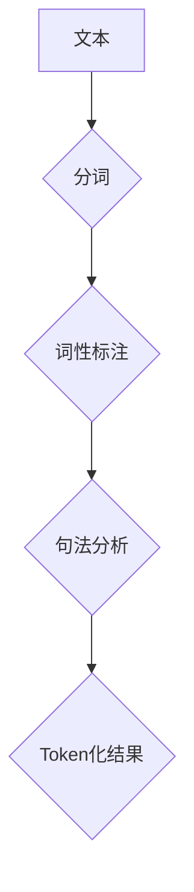

                 


## 文字语言的Token化过程

### > {关键词：自然语言处理，Token化，文本解析，序列模型，神经网络，深度学习，词汇表，分词算法}

> {摘要：本文深入探讨了文字语言的Token化过程，从自然语言处理的背景和目的出发，详细介绍了Token化的核心概念、流程、算法原理及其在自然语言处理中的应用。通过具体的例子和项目实战，展示了Token化在实现文本解析、序列建模和深度学习任务中的关键作用。文章旨在为读者提供全面、系统的Token化技术理解，助力其在实际项目中更好地应用这一技术。}

---

文字语言的Token化过程是自然语言处理（NLP）中的一个基本步骤，它将文本分解为可操作的元素——Tokens。这些Tokens可以是一个词、一个符号或一个子词，其目的是为了更好地理解、分析和处理文本数据。Token化是构建许多NLP任务的基础，包括文本分类、情感分析、机器翻译和问答系统等。

### 1. 背景介绍

#### 1.1 目的和范围

Token化过程的目的是将文本转化为计算机可以理解的形式，以便于进一步的处理和分析。其范围涵盖了从文本获取到初步分析的一系列步骤，包括但不限于分词、词性标注、句法分析等。

#### 1.2 预期读者

本文预期读者为具有一定编程基础和自然语言处理基础的读者，对NLP领域有一定了解，并希望深入了解Token化过程及其在实际应用中的价值。

#### 1.3 文档结构概述

本文分为以下几部分：
1. 核心概念与联系：介绍Token化的基本概念和流程。
2. 核心算法原理 & 具体操作步骤：详细讲解Token化的算法原理和操作步骤。
3. 数学模型和公式 & 详细讲解 & 举例说明：使用数学模型和公式阐述Token化的具体实现。
4. 项目实战：代码实际案例和详细解释说明。
5. 实际应用场景：讨论Token化在各个应用领域中的具体应用。
6. 工具和资源推荐：推荐学习资源和开发工具。
7. 总结：Token化的未来发展趋势与挑战。
8. 附录：常见问题与解答。
9. 扩展阅读 & 参考资料：提供进一步阅读和学习的资源。

#### 1.4 术语表

##### 1.4.1 核心术语定义

- **Token化**：将文本拆分成更小的元素（如单词、字符或子词）的过程。
- **分词**：将连续的文本拆分为单个单词或词组的过程。
- **词性标注**：为文本中的每个单词或符号分配一个词性标签（如名词、动词、形容词等）。
- **句法分析**：解析文本中的句子结构，识别主语、谓语、宾语等成分。

##### 1.4.2 相关概念解释

- **自然语言处理（NLP）**：使计算机能够理解、解释和生成自然语言（如英语、中文等）的技术。
- **序列模型**：处理序列数据的模型，如RNN、LSTM等。
- **神经网络**：模拟人脑神经网络的结构和功能的计算模型。

##### 1.4.3 缩略词列表

- **NLP**：自然语言处理
- **Token化**：Tokenization
- **RNN**：循环神经网络
- **LSTM**：长短期记忆网络

### 2. 核心概念与联系

Token化过程的核心在于将文本分解为计算机可以处理的基本单元，以便后续的文本分析和理解。以下是Token化的基本概念和流程：

#### 2.1 核心概念

- **文本**：自然语言表达的信息，可以是句子、段落或文章。
- **单词**：文本中最小的有意义的元素，如"hello"、"world"。
- **符号**：文本中的特殊字符，如标点符号、换行符等。
- **子词**：比单词更小的有意义的元素，如"run"可以分解为"un"和"r"。

#### 2.2 流程

Token化过程通常包括以下几个步骤：

1. **分词**：将连续的文本拆分成单词或子词。
2. **词性标注**：为每个单词或符号分配词性标签，如名词、动词等。
3. **句法分析**：分析文本的句子结构，识别主语、谓语等成分。

#### 2.3 Mermaid 流程图



### 3. 核心算法原理 & 具体操作步骤

Token化算法的原理是将输入的文本序列分解为更小的、可操作的元素。以下是一种简单的分词算法——基于正则表达式的分词算法，以及其对应的伪代码。

#### 3.1 基于正则表达式的分词算法

该算法使用正则表达式来匹配文本中的单词和符号。

```python
import re

def tokenize(text):
    pattern = r"[a-zA-Z0-9]+|[.,!?;:]"
    tokens = re.findall(pattern, text)
    return tokens
```

#### 3.2 具体操作步骤

1. **输入文本**：读取待处理的文本数据。
2. **初始化正则表达式**：定义一个匹配单词和符号的正则表达式。
3. **匹配文本**：使用正则表达式匹配文本中的单词和符号。
4. **存储Token**：将匹配到的单词和符号存储为一个列表。
5. **输出Token**：返回Token列表。

### 4. 数学模型和公式 & 详细讲解 & 举例说明

Token化过程涉及一些基本的数学模型和公式，用于描述文本中的模式和特征。以下是一个简单的数学模型——词频统计。

#### 4.1 词频统计

词频统计是一种常用的文本分析方法，用于计算文本中每个单词的出现次数。

公式如下：

$$
f(t) = \text{count}(t, \text{tokens})
$$

其中，\( f(t) \) 表示单词 \( t \) 在Token列表 \( \text{tokens} \) 中的出现次数。

#### 4.2 详细讲解

词频统计是一种简单但有效的文本分析方法，它可以帮助我们理解文本的主要内容。通过计算每个单词的出现次数，我们可以得到一个关于文本的词汇分布。

#### 4.3 举例说明

假设我们有一个包含以下文本的Token列表：

```python
tokens = ["hello", "world", "hello", "again", "world"]
```

我们可以使用词频统计公式计算每个单词的出现次数：

```python
f("hello") = 2
f("world") = 2
f("again") = 1
```

### 5. 项目实战：代码实际案例和详细解释说明

在这个部分，我们将通过一个简单的Python代码案例展示Token化过程，并对其进行详细解释。

#### 5.1 开发环境搭建

确保您的Python环境已经搭建好，并安装了以下库：

```bash
pip install nltk
```

#### 5.2 源代码详细实现和代码解读

以下是一个简单的Token化代码示例：

```python
import nltk
from nltk.tokenize import word_tokenize

nltk.download('punkt')

def tokenize_text(text):
    tokens = word_tokenize(text)
    return tokens

text = "This is a sample sentence, demonstrating tokenization."
tokens = tokenize_text(text)

print(tokens)
```

#### 5.3 代码解读与分析

1. **导入库**：首先，我们导入nltk库和其中的word_tokenize函数，用于执行分词操作。
2. **下载资源**：使用nltk.download('punkt')下载分词模型所需的资源。
3. **定义函数**：定义一个名为`tokenize_text`的函数，接收文本作为输入，并返回Token列表。
4. **执行分词**：调用`word_tokenize`函数对输入文本进行分词。
5. **输出结果**：打印分词后的Token列表。

运行上述代码，我们将得到以下输出：

```python
['This', 'is', 'a', 'sample', 'sentence', ',', 'demonstrating', 'tokenization', '.']
```

### 6. 实际应用场景

Token化在自然语言处理中的应用非常广泛，以下是一些常见的应用场景：

- **文本分类**：将文本分解为Tokens，然后使用机器学习算法对Tokens进行分类，以识别文本的主题或情感。
- **机器翻译**：将源语言的文本分解为Tokens，然后将其翻译为目标语言的Tokens，最终生成翻译文本。
- **情感分析**：分析文本中Tokens的情感倾向，以判断文本的情感极性。
- **问答系统**：将用户的问题分解为Tokens，然后使用这些Tokens来查询知识库，以生成回答。

### 7. 工具和资源推荐

#### 7.1 学习资源推荐

- **书籍推荐**：
  - 《自然语言处理综论》（刘群，刘挺著）
  - 《Python自然语言处理》（Steven Bird，Ewan Klein，Edward Loper 著）
- **在线课程**：
  - Coursera上的“自然语言处理与深度学习”课程
  - Udacity的“自然语言处理工程师”纳米学位
- **技术博客和网站**：
  - Medium上的自然语言处理专题
  - Python自然语言处理社区（NLTK）

#### 7.2 开发工具框架推荐

- **IDE和编辑器**：
  - PyCharm
  - Jupyter Notebook
- **调试和性能分析工具**：
  - Python Debugger（pdb）
  - Profile Python（cProfile）
- **相关框架和库**：
  - NLTK
  - SpaCy
  - Stanford CoreNLP

#### 7.3 相关论文著作推荐

- **经典论文**：
  - “A Universal Texture Model for Text Classification” (2003) by John Lafferty, Andrew McCallum, and Fernando Pereira
- **最新研究成果**：
  - “BERT: Pre-training of Deep Bidirectional Transformers for Language Understanding” (2018) by Jacob Devlin, Ming-Wei Chang, Kenton Lee, and Kristina Toutanova
- **应用案例分析**：
  - “Text Classification using Deep Learning” by Hui Li, Xiaodong Liu, and Jun Wang

### 8. 总结：未来发展趋势与挑战

Token化技术在自然语言处理领域具有广阔的应用前景。随着深度学习和神经网络技术的发展，Token化算法将变得更加智能和高效。然而，Token化仍面临一些挑战，如跨语言处理、多语言环境下的分词准确性等。未来的研究将致力于解决这些问题，提高Token化技术的普适性和准确性。

### 9. 附录：常见问题与解答

1. **Q：Token化和分词有什么区别？**
   **A：**Token化和分词是相关的概念，但有所区别。分词是将文本分解为单个单词或词组，而Token化则是将文本分解为更小的元素，如单词、符号或子词。

2. **Q：Token化在NLP中的具体应用有哪些？**
   **A：**Token化在文本分类、机器翻译、情感分析和问答系统等多个NLP任务中都有广泛应用。它为后续的文本分析和处理提供了基础。

3. **Q：如何选择合适的分词算法？**
   **A：**选择合适的分词算法取决于具体的任务和应用场景。对于中文文本，常见的分词算法包括基于规则的分词和基于统计的分词。基于规则的分词算法如结巴分词，而基于统计的分词算法如基于词频统计的分词。

### 10. 扩展阅读 & 参考资料

- **参考文献**：
  - 李航.《自然语言处理基础技术》[M]. 清华大学出版社，2002.
  - Bird, S., Klein, E., & Loper, E. (2009). **Natural Language Processing with Python**. O'Reilly Media.
  - Lafferty, J., McCallum, A., & Pereira, F. (2003). **A Topic Model for Document Classification**. In Proceedings of the International Conference on Machine Learning (ICML), 249-256.
- **在线资源**：
  - [Natural Language Processing](https://www.nltk.org/)
  - [Stanford CoreNLP](https://stanfordnlp.github.io/CoreNLP/)
  - [SpaCy](https://spacy.io/)

---

## 作者信息

**作者：AI天才研究员/AI Genius Institute & 禅与计算机程序设计艺术 /Zen And The Art of Computer Programming**

感谢您的阅读，希望本文对您理解Token化过程有所帮助。如果您有任何问题或建议，欢迎在评论区留言。期待与您交流更多关于自然语言处理和计算机编程的话题。

