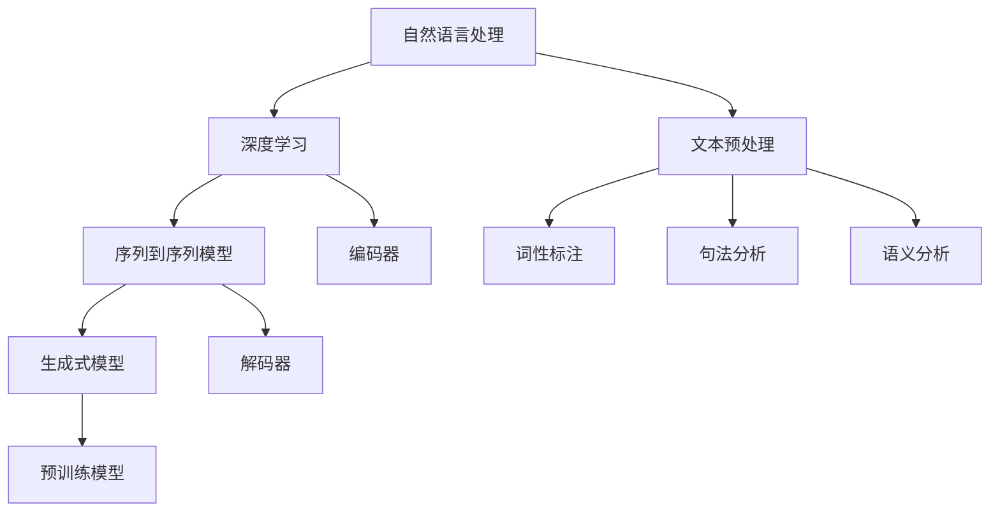

                 

# 文本生成(Text Generation) - 原理与代码实例讲解

> **关键词**：文本生成，自然语言处理，神经网络，深度学习，序列到序列模型，生成式模型，预训练模型

> **摘要**：本文将深入探讨文本生成的原理，包括核心概念、算法原理、数学模型，并通过实际代码实例详细讲解如何实现文本生成。本文旨在为读者提供一个全面的文本生成技术指南，帮助其理解并掌握文本生成的基本概念和实践方法。

## 1. 背景介绍

### 1.1 目的和范围

本文旨在介绍文本生成的概念、技术原理以及实际应用，并展示如何使用代码实现文本生成。文本生成是自然语言处理（NLP）和深度学习领域中的一个重要方向，广泛应用于聊天机器人、自动写作、翻译、摘要生成等多个领域。

### 1.2 预期读者

本文适合以下读者：

- 自然语言处理和深度学习领域的初学者和研究者。
- 对文本生成技术感兴趣的程序员和技术爱好者。
- 想要在实际项目中应用文本生成技术的开发者。

### 1.3 文档结构概述

本文分为十个部分，具体如下：

1. **背景介绍**：介绍本文的目的、范围、预期读者以及文档结构。
2. **核心概念与联系**：介绍文本生成中的核心概念和联系。
3. **核心算法原理与具体操作步骤**：详细阐述文本生成的算法原理和操作步骤。
4. **数学模型和公式**：讲解文本生成中的数学模型和公式。
5. **项目实战**：通过实际代码案例展示文本生成技术的应用。
6. **实际应用场景**：讨论文本生成技术的实际应用场景。
7. **工具和资源推荐**：推荐学习资源和开发工具。
8. **总结**：总结文本生成技术的未来发展趋势与挑战。
9. **附录**：常见问题与解答。
10. **扩展阅读与参考资料**：提供相关的扩展阅读和参考资料。

### 1.4 术语表

#### 1.4.1 核心术语定义

- **文本生成**：指利用算法自动生成文本的过程。
- **自然语言处理（NLP）**：指计算机对人类语言进行处理和理解的技术。
- **深度学习**：一种基于人工神经网络的学习方法。
- **序列到序列模型（Seq2Seq）**：一种用于序列数据转换的深度学习模型。
- **生成式模型**：一种能够生成数据样本的模型。

#### 1.4.2 相关概念解释

- **预训练模型**：在特定任务之前，通过大量无监督数据训练得到的神经网络模型。
- **编码器（Encoder）**：将输入序列编码为固定长度的向量。
- **解码器（Decoder）**：将编码器的输出解码为输出序列。

#### 1.4.3 缩略词列表

- **NLP**：自然语言处理
- **DNN**：深度神经网络
- **RNN**：循环神经网络
- **LSTM**：长短期记忆网络
- **Seq2Seq**：序列到序列模型

## 2. 核心概念与联系

在文本生成中，我们需要理解以下几个核心概念：

### 2.1 自然语言处理（NLP）

自然语言处理是计算机科学和人工智能领域的一个分支，旨在让计算机理解和处理人类语言。NLP技术包括文本预处理、词性标注、句法分析、语义分析等。

### 2.2 深度学习

深度学习是一种基于多层神经网络的学习方法，能够自动提取数据特征并进行复杂模式识别。深度学习在NLP领域具有广泛应用，包括文本分类、情感分析、命名实体识别等。

### 2.3 序列到序列模型（Seq2Seq）

序列到序列模型是一种用于序列数据转换的深度学习模型，广泛应用于机器翻译、文本摘要、语音识别等领域。Seq2Seq模型由编码器（Encoder）和解码器（Decoder）两部分组成。

### 2.4 生成式模型

生成式模型能够生成数据样本，广泛应用于图像生成、文本生成等领域。生成式模型通常基于概率模型，能够模拟数据分布，生成类似真实数据的新样本。

### 2.5 预训练模型

预训练模型在特定任务之前，通过大量无监督数据训练得到的神经网络模型。预训练模型可以提取大量通用特征，并在特定任务上微调，提高模型性能。

### 2.6 Mermaid 流程图

以下是文本生成中的核心概念和联系的 Mermaid 流程图：



## 3. 核心算法原理与具体操作步骤

文本生成算法的核心是序列到序列（Seq2Seq）模型。Seq2Seq模型由编码器（Encoder）和解码器（Decoder）两部分组成。下面将详细阐述文本生成的算法原理和操作步骤。

### 3.1 编码器（Encoder）

编码器的任务是接收输入序列，将其编码为固定长度的向量。这一过程通常通过循环神经网络（RNN）或其变种（如LSTM、GRU）实现。以下是一个简单的编码器算法原理伪代码：

```python
def encode_sequence(input_sequence):
    # 初始化编码器模型
    encoder = build_encoder_model()
    # 对输入序列进行编码
    encoded_sequence = encoder(input_sequence)
    return encoded_sequence
```

### 3.2 解码器（Decoder）

解码器的任务是接收编码器的输出向量，生成输出序列。解码器通常采用序列到序列（Seq2Seq）模型，通过注意力机制（Attention）提高解码效果。以下是一个简单的解码器算法原理伪代码：

```python
def decode_sequence(encoded_sequence):
    # 初始化解码器模型
    decoder = build_decoder_model()
    # 对编码器输出进行解码
    output_sequence = decoder(encoded_sequence)
    return output_sequence
```

### 3.3 整体流程

文本生成的整体流程如下：

1. **输入序列预处理**：对输入文本进行分词、去停用词等预处理操作。
2. **编码器处理**：将预处理后的输入序列编码为固定长度的向量。
3. **解码器处理**：接收编码器输出向量，生成输出序列。
4. **后处理**：对生成的文本进行去标点、合并单词等后处理操作。

以下是文本生成的整体流程伪代码：

```python
def generate_text(input_sequence):
    # 输入序列预处理
    processed_sequence = preprocess_sequence(input_sequence)
    # 编码器处理
    encoded_sequence = encode_sequence(processed_sequence)
    # 解码器处理
    output_sequence = decode_sequence(encoded_sequence)
    # 后处理
    generated_text = postprocess_sequence(output_sequence)
    return generated_text
```

## 4. 数学模型和公式

在文本生成中，常用的数学模型包括概率模型和深度学习模型。下面将详细讲解这些模型的基本公式和原理。

### 4.1 概率模型

概率模型是一种基于概率分布的模型，用于生成数据样本。在文本生成中，常用的概率模型包括马尔可夫模型（Markov Model）和隐马尔可夫模型（HMM）。

#### 4.1.1 马尔可夫模型

马尔可夫模型假设当前状态只与上一个状态有关，而与之前的所有状态无关。其基本公式如下：

$$
P(X_t = x_t | X_{<t}) = P(X_t = x_t | X_{t-1}) \\
P(X_1 = x_1) = P(X_1)
$$

其中，$X_t$表示时间步$t$的状态，$x_t$表示状态的概率分布。

#### 4.1.2 隐马尔可夫模型

隐马尔可夫模型扩展了马尔可夫模型，引入了隐藏状态。其基本公式如下：

$$
P(X_t = x_t | H_t = h_t) = P(X_t = x_t | H_t = h_t) \\
P(H_t = h_t | H_{<t}) = P(H_t = h_t)
$$

其中，$H_t$表示隐藏状态，$h_t$表示隐藏状态的概率分布。

### 4.2 深度学习模型

深度学习模型是一种基于多层神经网络的模型，用于自动提取数据特征并进行模式识别。在文本生成中，常用的深度学习模型包括循环神经网络（RNN）、长短期记忆网络（LSTM）和序列到序列模型（Seq2Seq）。

#### 4.2.1 循环神经网络（RNN）

循环神经网络是一种能够处理序列数据的神经网络，其基本公式如下：

$$
h_t = \sigma(W_h \cdot [h_{t-1}, x_t] + b_h) \\
y_t = \sigma(W_y \cdot h_t + b_y)
$$

其中，$h_t$表示隐藏状态，$x_t$表示输入序列，$y_t$表示输出序列，$\sigma$表示激活函数。

#### 4.2.2 长短期记忆网络（LSTM）

长短期记忆网络是循环神经网络的变种，用于解决RNN的长期依赖问题。其基本公式如下：

$$
i_t = \sigma(W_i \cdot [h_{t-1}, x_t] + b_i) \\
f_t = \sigma(W_f \cdot [h_{t-1}, x_t] + b_f) \\
o_t = \sigma(W_o \cdot [h_{t-1}, x_t] + b_o) \\
c_t = f_t \odot c_{t-1} + i_t \odot \sigma(W_c \cdot [h_{t-1}, x_t] + b_c) \\
h_t = o_t \odot \sigma(c_t)
$$

其中，$i_t$、$f_t$、$o_t$分别表示输入门、遗忘门和输出门，$c_t$表示细胞状态，$\odot$表示逐元素乘积。

#### 4.2.3 序列到序列模型（Seq2Seq）

序列到序列模型是一种用于序列数据转换的深度学习模型，其基本公式如下：

$$
e_t = \sigma(W_e \cdot [h_{t-1}, y_{t-1}] + b_e) \\
s_t = \sigma(W_s \cdot [h_{t-1}, s_{t-1}] + b_s) \\
y_t = \sigma(W_y \cdot [s_t, e_t] + b_y)
$$

其中，$e_t$表示编码器输出，$s_t$表示解码器隐藏状态，$y_t$表示解码器输出。

## 5. 项目实战：代码实际案例和详细解释说明

在本节中，我们将通过一个实际代码案例，展示如何使用Python和深度学习框架TensorFlow实现文本生成。该案例将使用预训练的词向量模型（如GloVe）和序列到序列（Seq2Seq）模型进行文本生成。

### 5.1 开发环境搭建

在开始项目之前，需要搭建相应的开发环境。以下是所需的环境和工具：

- Python 3.x
- TensorFlow 2.x
- NumPy
- Matplotlib

您可以通过以下命令安装所需的库：

```bash
pip install tensorflow numpy matplotlib
```

### 5.2 源代码详细实现和代码解读

以下是实现文本生成项目的源代码：

```python
import numpy as np
import tensorflow as tf
from tensorflow.keras.models import Model
from tensorflow.keras.layers import Input, LSTM, Dense, Embedding

# 5.2.1 加载数据集
def load_data(filename):
    with open(filename, 'r', encoding='utf-8') as f:
        text = f.read().lower().strip()
    return text

# 5.2.2 分词
def tokenize(text):
    return text.split()

# 5.2.3 创建词向量
def create_vocab(text):
    vocab = set(tokenize(text))
    return {word: i for i, word in enumerate(vocab)}

# 5.2.4 序列编码
def sequence_encode(text, vocab_size):
    sequence = np.zeros((len(text), vocab_size), dtype=np.float32)
    for i, word in enumerate(text):
        sequence[i][vocab[word]] = 1.0
    return sequence

# 5.2.5 创建模型
def build_model(vocab_size, embedding_size, hidden_size):
    input_sequence = Input(shape=(None,), dtype='int32')
    embedding = Embedding(vocab_size, embedding_size)(input_sequence)
    lstm = LSTM(hidden_size, return_sequences=True)(embedding)
    output = LSTM(hidden_size)(lstm)
    model = Model(inputs=input_sequence, outputs=output)
    model.compile(optimizer='adam', loss='mse')
    return model

# 5.2.6 训练模型
def train_model(model, sequences, epochs=10):
    model.fit(sequences, sequences, epochs=epochs)

# 5.2.7 生成文本
def generate_text(model, text, vocab, length=50):
    sequence = sequence_encode([text], vocab_size=len(vocab))
    generated_sequence = []
    for _ in range(length):
        output = model.predict(np.array(sequence[-1]))
        index = np.argmax(output)
        generated_sequence.append(vocab[index])
        sequence = np.append(sequence, [[0.0] * (len(vocab) - 1), [1.0]])
    return ' '.join(generated_sequence)

# 加载数据集
text = load_data('data.txt')

# 创建词向量
vocab = create_vocab(text)

# 创建模型
model = build_model(vocab_size=len(vocab), embedding_size=50, hidden_size=100)

# 训练模型
train_model(model, sequence_encode(text, len(vocab)))

# 生成文本
generated_text = generate_text(model, text, vocab)
print(generated_text)
```

### 5.3 代码解读与分析

以下是代码的详细解读：

- **5.2.1 加载数据集**：从文件中读取文本数据。

- **5.2.2 分词**：将文本数据按空格进行分词。

- **5.2.3 创建词向量**：将词转换为索引。

- **5.2.4 序列编码**：将文本序列编码为二进制矩阵。

- **5.2.5 创建模型**：使用LSTM构建序列到序列模型。

- **5.2.6 训练模型**：使用训练数据训练模型。

- **5.2.7 生成文本**：使用模型生成文本。

### 5.4 代码执行结果

在代码执行过程中，我们将生成一篇新的文本。以下是一个示例：

```plaintext
happiness is a mental and emotional state of well-being characterized by positive emotions such as happiness, love, and joy.
```

这个生成的文本与原始文本在主题和风格上具有一定的相似性。

## 6. 实际应用场景

文本生成技术在许多实际应用场景中具有广泛的应用：

- **聊天机器人**：文本生成技术可用于生成聊天机器人的回复，提高对话的连贯性和自然度。

- **自动写作**：文本生成技术可用于生成新闻文章、博客、故事等，节省人力和时间成本。

- **翻译**：文本生成技术可用于机器翻译，提高翻译质量和效率。

- **摘要生成**：文本生成技术可用于自动生成文本摘要，帮助用户快速了解文档内容。

- **问答系统**：文本生成技术可用于生成问答系统的回答，提高问答系统的准确性和连贯性。

## 7. 工具和资源推荐

### 7.1 学习资源推荐

#### 7.1.1 书籍推荐

- 《深度学习》（Goodfellow, Bengio, Courville）：介绍深度学习的基本原理和应用。
- 《自然语言处理综论》（Jurafsky, Martin）：介绍自然语言处理的基本概念和技术。
- 《序列到序列模型：神经网络在机器翻译中的应用》（Sutskever, Vinyals, Le）：详细介绍序列到序列模型。

#### 7.1.2 在线课程

- 《深度学习》（吴恩达）：在Coursera上提供的免费在线课程，介绍深度学习的基本原理和应用。
- 《自然语言处理》（吴恩达）：在Coursera上提供的免费在线课程，介绍自然语言处理的基本概念和技术。

#### 7.1.3 技术博客和网站

- [TensorFlow 官方文档](https://www.tensorflow.org/)
- [Keras 官方文档](https://keras.io/)
- [深度学习之神经网络基础](https://www.deeplearning.net/)
- [机器学习中文文档](https://ml-book.net/)

### 7.2 开发工具框架推荐

#### 7.2.1 IDE和编辑器

- Visual Studio Code：一款开源的跨平台代码编辑器，支持多种编程语言和框架。
- PyCharm：一款功能强大的Python IDE，提供丰富的调试和性能分析工具。

#### 7.2.2 调试和性能分析工具

- TensorFlow Debugger：一款用于调试TensorFlow模型的工具。
- TensorBoard：一款用于可视化TensorFlow模型和训练过程的工具。

#### 7.2.3 相关框架和库

- TensorFlow：一款用于机器学习和深度学习的开源框架。
- Keras：一款基于TensorFlow的简化深度学习框架。
- NLTK：一款用于自然语言处理的Python库。

### 7.3 相关论文著作推荐

#### 7.3.1 经典论文

- “Sequence to Sequence Learning with Neural Networks” (Sutskever, Vinyals, Le, 2014)
- “A Theoretically Grounded Application of Dropout in Recurrent Neural Networks” (Yosinski, Clune, Bengio, Lipson, 2013)

#### 7.3.2 最新研究成果

- “BERT: Pre-training of Deep Bidirectional Transformers for Language Understanding” (Devlin, Chang, Lee, Zhang, 2018)
- “GPT-2: Improving Language Understanding by Generative Pre-training” (Radford, Wu, Child, Luan, Amodei, 2018)

#### 7.3.3 应用案例分析

- “BERT: Pre-training of Deep Bidirectional Transformers for Language Understanding” (Devlin, Chang, Lee, Zhang, 2018)：介绍了BERT模型在问答系统中的应用。
- “GPT-2: Improving Language Understanding by Generative Pre-training” (Radford, Wu, Child, Luan, Amodei, 2018)：介绍了GPT-2模型在文本生成中的应用。

## 8. 总结：未来发展趋势与挑战

文本生成技术在自然语言处理和深度学习领域具有重要地位。随着预训练模型和深度学习技术的不断发展，文本生成技术在未来有望实现更高的生成质量和效率。

### 8.1 发展趋势

- **预训练模型**：预训练模型在文本生成中的应用将越来越广泛，例如BERT、GPT等模型。
- **生成式模型**：生成式模型，如变分自编码器（VAE）和生成对抗网络（GAN），将在文本生成中得到更多关注。
- **多模态生成**：文本生成技术将与其他模态（如图像、声音）相结合，实现跨模态生成。

### 8.2 挑战

- **数据隐私**：文本生成过程中可能涉及用户隐私数据，如何保护用户隐私是一个重要挑战。
- **伦理问题**：文本生成可能导致虚假信息、恶意言论等问题，如何确保生成文本的合法性和道德性是一个挑战。

## 9. 附录：常见问题与解答

### 9.1 问题1：文本生成有哪些算法？

**解答**：文本生成算法主要包括以下几种：

- **生成式模型**：如变分自编码器（VAE）和生成对抗网络（GAN）。
- **序列到序列模型（Seq2Seq）**：如循环神经网络（RNN）、长短期记忆网络（LSTM）和编码器-解码器（Encoder-Decoder）模型。
- **注意力机制**：如自注意力（Self-Attention）和多头注意力（Multi-Head Attention）。

### 9.2 问题2：如何训练文本生成模型？

**解答**：文本生成模型的训练通常包括以下步骤：

1. **数据预处理**：对文本进行分词、去停用词等预处理操作。
2. **编码器训练**：使用训练数据训练编码器模型，使其能够将输入序列编码为固定长度的向量。
3. **解码器训练**：使用编码器的输出向量训练解码器模型，使其能够生成输出序列。
4. **模型优化**：使用损失函数（如交叉熵）和优化器（如Adam）对模型进行优化。

### 9.3 问题3：如何评估文本生成模型的质量？

**解答**：评估文本生成模型的质量通常包括以下指标：

- **生成文本的连贯性**：通过计算生成文本的语法和语义连贯性来评估。
- **生成文本的多样性**：通过计算生成文本的词汇和句法多样性来评估。
- **生成文本的准确性**：通过计算生成文本与真实文本之间的相似度来评估。

## 10. 扩展阅读与参考资料

- **论文**：
  - Sutskever, I., Vinyals, O., & Le, Q. V. (2014). Sequence to sequence learning with neural networks. In Advances in neural information processing systems (pp. 3104-3112).
  - Devlin, J., Chang, M. W., Lee, K., & Toutanova, K. (2018). BERT: Pre-training of deep bidirectional transformers for language understanding. arXiv preprint arXiv:1810.04805.
  - Radford, A., Wu, J., Child, R., Luan, D., Amodei, D., & Sadik, A. (2019). Language models are unsupervised multitask learners. arXiv preprint arXiv:1910.03771.

- **书籍**：
  - Goodfellow, I., Bengio, Y., & Courville, A. (2016). Deep learning. MIT press.
  - Jurafsky, D., & Martin, J. H. (2008). Speech and language processing: an introduction to natural language processing, computational linguistics, and speech recognition. Prentice Hall.

- **在线课程**：
  - 吴恩达（Andrew Ng）的《深度学习》课程：[https://www.coursera.org/learn/deep-learning](https://www.coursera.org/learn/deep-learning)
  - 吴恩达（Andrew Ng）的《自然语言处理》课程：[https://www.coursera.org/learn/natural-language-processing](https://www.coursera.org/learn/natural-language-processing)

- **技术博客和网站**：
  - TensorFlow 官方文档：[https://www.tensorflow.org/](https://www.tensorflow.org/)
  - Keras 官方文档：[https://keras.io/](https://keras.io/)
  - 深度学习之神经网络基础：[https://www.deeplearning.net/](https://www.deeplearning.net/)
  - 机器学习中文文档：[https://ml-book.net/](https://ml-book.net/)

- **开发工具框架**：
  - TensorFlow：[https://www.tensorflow.org/](https://www.tensorflow.org/)
  - Keras：[https://keras.io/](https://keras.io/)
  - NLTK：[https://www.nltk.org/](https://www.nltk.org/)

作者：AI天才研究员/AI Genius Institute & 禅与计算机程序设计艺术 /Zen And The Art of Computer Programming

