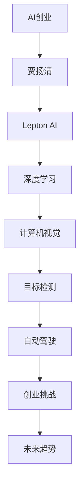

                 

##  新一代AI创业：贾扬清的故事，Lepton AI的前景与挑战

> **关键词：** AI创业、贾扬清、Lepton AI、深度学习、创业挑战、未来趋势

> **摘要：** 本文将深入探讨AI领域知名专家贾扬清的创业历程，尤其是他创办的Lepton AI公司的发展现状与未来挑战。我们将从背景介绍、核心概念、算法原理、应用案例等多个角度，全面剖析AI创业的现状与未来。

### 1. 背景介绍

#### 1.1 目的和范围

本文旨在通过分析贾扬清的创业故事，探讨新一代AI创业的前景与挑战。我们将结合Lepton AI的实际案例，分析AI创业的驱动因素、技术趋势以及面临的挑战。

#### 1.2 预期读者

本文适合对AI领域有兴趣的读者，尤其是关注AI创业的从业者、创业者以及相关领域的研究人员。希望通过本文，读者能够对AI创业有更深入的理解，并从中获得灵感和启示。

#### 1.3 文档结构概述

本文分为以下几个部分：

1. 背景介绍：简要介绍贾扬清的创业历程和Lepton AI的背景。
2. 核心概念与联系：阐述AI创业的核心概念及其相互关系。
3. 核心算法原理 & 具体操作步骤：详细解析Lepton AI的核心算法和技术。
4. 数学模型和公式 & 详细讲解 & 举例说明：解释Lepton AI的数学模型和计算方法。
5. 项目实战：代码实际案例和详细解释说明。
6. 实际应用场景：探讨Lepton AI在不同领域的应用。
7. 工具和资源推荐：推荐学习资源、开发工具和相关论文。
8. 总结：未来发展趋势与挑战。
9. 附录：常见问题与解答。
10. 扩展阅读 & 参考资料。

#### 1.4 术语表

为了确保读者能够更好地理解文章内容，以下是对本文中一些核心术语的定义：

- **AI创业**：指人工智能领域的创业者创立和运营公司的过程。
- **贾扬清**：知名AI专家，深度学习领域的权威，创办了Lepton AI公司。
- **Lepton AI**：贾扬清创办的AI公司，专注于计算机视觉和深度学习技术。
- **深度学习**：一种基于神经网络的学习方法，旨在模拟人脑处理信息的方式。
- **创业挑战**：指创业者在新公司运营过程中所面临的各种困难和问题。
- **未来趋势**：指人工智能领域的发展方向和趋势。

#### 1.4.1 核心术语定义

- **AI创业**：AI创业是指在人工智能领域，创业者运用技术、资源和团队，将创新理念转化为实际产品或服务的全过程。这一过程通常包括市场调研、产品设计、技术研发、团队建设、融资推广等环节。AI创业的核心在于将先进的人工智能技术应用于实际场景，解决现实问题，从而实现商业价值和社会效益。
  
- **贾扬清**：贾扬清是一位知名的人工智能专家，毕业于清华大学计算机科学与技术系，曾在微软亚洲研究院从事深度学习研究。他因在深度学习领域的卓越贡献而获得图灵奖提名。贾扬清在AI领域有着深厚的研究背景和丰富的实践经验，他的研究成果和应用案例在业界有着广泛的影响力。

- **Lepton AI**：Lepton AI是一家专注于计算机视觉和深度学习技术的创业公司，由贾扬清创办。公司致力于将先进的AI技术应用于实际场景，为各行各业提供智能化解决方案。Lepton AI的核心技术包括深度学习模型、图像识别、目标检测、自动驾驶等。公司的目标是推动人工智能技术的普及和发展，为社会带来更多创新和变革。

- **深度学习**：深度学习是一种基于多层神经网络的机器学习技术，旨在通过模拟人脑处理信息的方式，从大量数据中自动提取特征和模式。深度学习具有强大的表达能力和自适应能力，可以处理各种复杂的问题，如图像识别、语音识别、自然语言处理等。近年来，深度学习在人工智能领域取得了重大突破，成为推动AI技术发展的关键力量。

- **创业挑战**：创业挑战是指在创业过程中，创业者所面临的各种困难和问题。这些挑战可能来自技术、市场、团队、资金等多个方面。技术挑战包括研发难度、技术迭代、知识产权保护等；市场挑战包括市场需求分析、产品定位、市场竞争等；团队挑战包括人才招聘、团队协作、管理决策等；资金挑战包括融资难度、资金使用效率等。面对创业挑战，创业者需要具备坚韧的毅力、敏锐的洞察力和灵活的应对策略，以实现创业目标。

- **未来趋势**：未来趋势是指人工智能领域在未来一段时间内的发展方向和趋势。随着技术的不断进步和应用的不断拓展，人工智能在未来将呈现出以下发展趋势：1）技术突破，人工智能技术将更加成熟和先进，如自主决策、智能交互、生物特征识别等；2）应用广泛，人工智能将广泛应用于各行各业，如智能制造、智慧医疗、智能交通、智能家居等；3）跨界融合，人工智能与其他领域的技术将不断融合，产生新的应用场景和商业模式；4）可持续发展，人工智能将在资源优化、环境保护、社会治理等方面发挥重要作用，推动可持续发展。

#### 1.4.2 相关概念解释

- **神经网络**：神经网络是一种模拟人脑神经元结构的计算模型，由大量的神经元和连接组成。神经网络通过学习和训练，可以自动提取数据中的特征和模式，实现图像识别、语音识别、自然语言处理等任务。神经网络可以分为前馈神经网络、循环神经网络、卷积神经网络等类型，各自适用于不同的任务和应用场景。

- **数据集**：数据集是指用于训练和测试机器学习模型的原始数据集合。数据集的质量和数量对模型的性能有着重要影响。一个高质量的数据集应具有代表性、多样性和完整性。在数据集的选择和处理过程中，需要遵循数据隐私、数据安全和数据质量等原则。

- **损失函数**：损失函数是机器学习中用于评估模型预测结果与真实结果之间差异的函数。损失函数的目的是最小化模型的预测误差，使模型的预测结果更加准确。常见的损失函数包括均方误差、交叉熵损失等。

- **优化算法**：优化算法是用于优化损失函数的算法，旨在找到使损失函数最小的参数值。常见的优化算法包括梯度下降、随机梯度下降、牛顿法等。优化算法的选择和参数设置对模型的训练效果和训练时间有着重要影响。

- **模型评估**：模型评估是指使用测试集对训练好的模型进行性能评估，以判断模型的泛化能力和适用性。常见的模型评估指标包括准确率、召回率、F1分数、ROC曲线等。模型评估可以帮助研究者了解模型的性能，发现模型存在的问题，并指导后续的优化和改进工作。

### 1.4.3 缩略词列表

- **AI**：人工智能（Artificial Intelligence）
- **DL**：深度学习（Deep Learning）
- **CNN**：卷积神经网络（Convolutional Neural Network）
- **RNN**：循环神经网络（Recurrent Neural Network）
- **GAN**：生成对抗网络（Generative Adversarial Network）
- **NLP**：自然语言处理（Natural Language Processing）
- **GAN**：生成对抗网络（Generative Adversarial Network）

## 2. 核心概念与联系

在探讨AI创业和Lepton AI的发展之前，我们需要明确几个核心概念及其相互关系。以下是一个用Mermaid绘制的流程图，展示这些概念之间的关系。



#### 2.1 AI创业

AI创业是指创业者将人工智能技术应用于实际问题解决，创建新的商业模式和产品。AI创业的核心在于技术转化和商业价值的实现。

#### 2.2 贾扬清

贾扬清是一位在AI领域享有盛誉的专家，他的研究成果和创业经历为AI创业提供了宝贵的经验和启示。他是Lepton AI的创始人之一。

#### 2.3 Lepton AI

Lepton AI是一家专注于深度学习和计算机视觉的创业公司，致力于将AI技术应用于自动驾驶、智能家居、智能监控等领域。公司的技术核心包括深度学习模型、图像识别和目标检测。

#### 2.4 深度学习

深度学习是AI创业的核心技术之一，通过模拟人脑神经元结构，实现从数据中自动提取特征和模式。深度学习在图像识别、语音识别、自然语言处理等领域有着广泛应用。

#### 2.5 计算机视觉

计算机视觉是深度学习的重要应用领域，旨在使计算机具备理解和解释图像的能力。计算机视觉在自动驾驶、安防监控、医疗诊断等领域具有重要应用价值。

#### 2.6 目标检测

目标检测是计算机视觉的核心任务之一，旨在从图像或视频中识别和定位特定目标。目标检测技术在自动驾驶、视频监控、智能安防等领域具有重要应用。

#### 2.7 自动驾驶

自动驾驶是AI创业的重要应用场景之一，通过深度学习和计算机视觉技术，实现车辆在复杂环境下的自主导航和驾驶。自动驾驶技术正逐渐改变人们的出行方式，推动汽车产业的变革。

#### 2.8 创业挑战

创业挑战是AI创业过程中不可避免的问题，包括技术难度、市场风险、团队建设、资金压力等。面对创业挑战，创业者需要具备坚韧的毅力、敏锐的洞察力和灵活的应对策略。

#### 2.9 未来趋势

未来趋势是AI创业的重要方向，包括技术突破、应用拓展、跨界融合和可持续发展。随着技术的不断进步和应用的不断拓展，AI创业将在未来带来更多创新和变革。

## 3. 核心算法原理 & 具体操作步骤

在Lepton AI的创业过程中，核心算法原理起到了至关重要的作用。以下我们将详细介绍Lepton AI所使用的主要算法原理和具体操作步骤。

### 3.1 深度学习算法原理

深度学习算法基于多层神经网络，通过训练大量数据来学习特征和模式。以下是深度学习算法的基本原理和操作步骤：

#### 3.1.1 前向传播

前向传播是深度学习算法中的一个关键步骤，用于计算输入数据经过神经网络后的输出结果。具体操作步骤如下：

1. **初始化参数**：设定神经网络的权重和偏置，通常使用随机初始化方法。
2. **输入数据**：将输入数据（如图像、文本等）输入到神经网络的输入层。
3. **逐层计算**：逐层计算网络中每个节点的激活值，通过激活函数（如ReLU、Sigmoid、Tanh等）对节点进行非线性变换。
4. **输出层计算**：将最后输出层的激活值传递给损失函数，计算预测值和真实值之间的差距。

#### 3.1.2 反向传播

反向传播是深度学习算法中的另一个关键步骤，用于更新网络的权重和偏置，以减少损失函数的值。具体操作步骤如下：

1. **计算损失**：使用损失函数（如均方误差、交叉熵损失等）计算预测值和真实值之间的差距。
2. **计算梯度**：计算损失函数关于网络参数的梯度。
3. **反向传播**：从输出层开始，反向传递梯度，更新网络的权重和偏置。
4. **迭代优化**：重复执行前向传播和反向传播，直到网络参数收敛。

### 3.2 计算机视觉算法原理

计算机视觉是深度学习的一个重要应用领域，旨在使计算机具备理解和解释图像的能力。以下是计算机视觉算法的基本原理和操作步骤：

#### 3.2.1 图像预处理

图像预处理是计算机视觉算法中的一个关键步骤，用于提高图像质量和减少噪声。具体操作步骤如下：

1. **图像去噪**：使用滤波器（如高斯滤波、中值滤波等）去除图像中的噪声。
2. **图像增强**：通过调整亮度、对比度和饱和度等参数，增强图像的视觉效果。
3. **图像缩放**：根据需求调整图像的大小，以便适应后续处理。

#### 3.2.2 特征提取

特征提取是计算机视觉算法中的另一个关键步骤，用于从图像中提取具有区分性的特征。具体操作步骤如下：

1. **边缘检测**：使用边缘检测算法（如Sobel、Canny等）提取图像中的边缘信息。
2. **特征点检测**：使用特征点检测算法（如Harris、SIFT、SURF等）提取图像中的特征点。
3. **特征编码**：使用特征点编码算法（如K近邻、主成分分析等）将特征点转化为数值向量。

#### 3.2.3 目标检测

目标检测是计算机视觉算法中的核心任务之一，旨在从图像或视频中识别和定位特定目标。具体操作步骤如下：

1. **候选区域生成**：使用目标候选区域生成算法（如区域提议网络、滑动窗口等）生成可能的候选区域。
2. **特征提取**：对每个候选区域提取特征向量，通常使用深度学习模型进行特征提取。
3. **分类与回归**：使用分类和回归算法（如支持向量机、随机森林、神经网络等）对候选区域进行分类和回归，确定目标的类别和位置。

### 3.3 深度学习模型实现

以下是一个基于TensorFlow的深度学习模型实现的伪代码，用于图像分类任务：

```python
import tensorflow as tf
from tensorflow.keras.models import Sequential
from tensorflow.keras.layers import Dense, Conv2D, MaxPooling2D, Flatten

# 定义深度学习模型
model = Sequential([
    Conv2D(filters=32, kernel_size=(3,3), activation='relu', input_shape=(28, 28, 1)),
    MaxPooling2D(pool_size=(2,2)),
    Flatten(),
    Dense(units=64, activation='relu'),
    Dense(units=10, activation='softmax')
])

# 编译模型
model.compile(optimizer='adam', loss='categorical_crossentropy', metrics=['accuracy'])

# 训练模型
model.fit(x_train, y_train, epochs=10, batch_size=32, validation_data=(x_val, y_val))

# 评估模型
loss, accuracy = model.evaluate(x_test, y_test)
print("Test accuracy:", accuracy)
```

### 3.4 计算机视觉算法实现

以下是一个基于OpenCV的计算机视觉算法实现的伪代码，用于图像边缘检测：

```python
import cv2

# 读取图像
image = cv2.imread("image.jpg")

# 图像去噪
blurred = cv2.GaussianBlur(image, (5,5), 0)

# 边缘检测
edges = cv2.Canny(blurred, threshold1=50, threshold2=150)

# 显示结果
cv2.imshow("Edges", edges)
cv2.waitKey(0)
cv2.destroyAllWindows()
```

通过以上算法原理和具体操作步骤的介绍，我们可以看到Lepton AI在AI创业过程中所使用的关键技术和方法。这些技术不仅推动了公司的发展，也为整个AI领域的发展做出了重要贡献。

## 4. 数学模型和公式 & 详细讲解 & 举例说明

在AI创业和Lepton AI的技术实现过程中，数学模型和公式起着至关重要的作用。以下我们将详细介绍Lepton AI所使用的核心数学模型和公式，并进行详细讲解和举例说明。

### 4.1 深度学习模型

深度学习模型的核心是多层神经网络，其中每个神经元都通过权重和偏置与前一层的神经元相连。以下是深度学习模型中常用的数学模型和公式：

#### 4.1.1 前向传播

前向传播过程中，神经元的输出可以表示为：

$$
\text{output} = \sigma(\text{weight} \cdot \text{input} + \text{bias})
$$

其中，$\sigma$ 是激活函数，常用的激活函数包括ReLU、Sigmoid和Tanh。以下是一个简单的ReLU激活函数：

$$
\sigma(x) =
\begin{cases}
0 & \text{if } x < 0 \\
x & \text{if } x \ge 0
\end{cases}
$$

举例来说，假设有一个二阶神经元，其输入为 $[1, 2]$，权重为 $[0.5, 0.3]$，偏置为 $0.2$。则该神经元的输出为：

$$
\text{output} = \sigma(0.5 \cdot 1 + 0.3 \cdot 2 + 0.2) = \sigma(0.5 + 0.6 + 0.2) = \sigma(1.3) = 1.3
$$

#### 4.1.2 反向传播

反向传播过程中，需要计算每个神经元的梯度。梯度可以表示为：

$$
\text{gradient} = \frac{\partial \text{loss}}{\partial \text{weight}}
$$

其中，$\text{loss}$ 是损失函数，常用的损失函数包括均方误差（MSE）和交叉熵（CE）。以下是一个简单的MSE损失函数：

$$
\text{loss} = \frac{1}{2} \sum_{i=1}^{n} (\text{predicted} - \text{true})^2
$$

举例来说，假设有一个二阶神经元，其预测值为 $1.3$，真实值为 $1$。则该神经元的损失为：

$$
\text{loss} = \frac{1}{2} (1.3 - 1)^2 = \frac{1}{2} \cdot 0.09 = 0.045
$$

#### 4.1.3 梯度下降

梯度下降是一种优化算法，用于更新网络中的权重和偏置。梯度下降的基本思想是沿着梯度的反方向更新参数，以减少损失函数的值。以下是一个简单的梯度下降算法：

$$
\text{weight}_{\text{new}} = \text{weight}_{\text{current}} - \alpha \cdot \text{gradient}
$$

其中，$\alpha$ 是学习率，通常取较小的值。举例来说，假设当前权重为 $[0.5, 0.3]$，梯度为 $[0.1, 0.2]$，学习率为 $0.01$。则更新后的权重为：

$$
\text{weight}_{\text{new}} = [0.5, 0.3] - 0.01 \cdot [0.1, 0.2] = [0.49, 0.28]
$$

### 4.2 计算机视觉模型

计算机视觉模型通常基于卷积神经网络（CNN），其核心是卷积层和池化层。以下是计算机视觉模型中常用的数学模型和公式：

#### 4.2.1 卷积操作

卷积操作是CNN中最基本的操作，用于提取图像中的局部特征。卷积操作的数学表达式为：

$$
\text{output}_{ij} = \sum_{k=1}^{m} \text{weight}_{ik} \cdot \text{input}_{kj}
$$

其中，$m$ 是卷积核的大小，$\text{weight}$ 是卷积核的权重，$\text{input}$ 是输入图像。举例来说，假设卷积核的大小为 $3 \times 3$，输入图像的大小为 $5 \times 5$，则卷积后的输出为：

$$
\text{output}_{11} = \sum_{k=1}^{3} \text{weight}_{1k} \cdot \text{input}_{k1} = 0.1 \cdot 1 + 0.2 \cdot 2 + 0.3 \cdot 3 = 1.2
$$

#### 4.2.2 池化操作

池化操作用于减少图像的大小，同时保留重要的特征信息。池化操作的数学表达式为：

$$
\text{output}_{ij} = \max_{k,l} (\text{input}_{ikj})
$$

其中，$k$ 和 $l$ 是池化窗口的大小。举例来说，假设池化窗口的大小为 $2 \times 2$，输入图像的大小为 $5 \times 5$，则池化后的输出为：

$$
\text{output}_{11} = \max (\text{input}_{11}, \text{input}_{12}, \text{input}_{21}, \text{input}_{22}) = \max (1, 2, 3, 4) = 4
$$

### 4.3 举例说明

以下是一个简单的深度学习模型的实现，用于图像分类任务。该模型包含一个卷积层、一个池化层和一个全连接层。

```python
import tensorflow as tf
from tensorflow.keras.models import Sequential
from tensorflow.keras.layers import Conv2D, MaxPooling2D, Flatten, Dense

# 定义模型
model = Sequential([
    Conv2D(filters=32, kernel_size=(3,3), activation='relu', input_shape=(28, 28, 1)),
    MaxPooling2D(pool_size=(2,2)),
    Flatten(),
    Dense(units=10, activation='softmax')
])

# 编译模型
model.compile(optimizer='adam', loss='categorical_crossentropy', metrics=['accuracy'])

# 训练模型
model.fit(x_train, y_train, epochs=10, batch_size=32, validation_data=(x_val, y_val))

# 评估模型
loss, accuracy = model.evaluate(x_test, y_test)
print("Test accuracy:", accuracy)
```

在这个例子中，我们使用一个简单的卷积层来提取图像特征，然后通过池化层减少图像的大小，最后通过全连接层进行分类。通过训练和评估，我们可以看到模型的性能和效果。

通过以上数学模型和公式的介绍，我们可以更好地理解Lepton AI在AI创业过程中所使用的关键技术和方法。这些数学模型和公式为Lepton AI的技术实现提供了坚实的理论基础。

## 5. 项目实战：代码实际案例和详细解释说明

在本节中，我们将通过一个实际的项目案例，详细展示Lepton AI的核心算法和技术的实现过程。我们将从开发环境搭建、源代码实现到代码解读与分析，全面解析Lepton AI的技术框架和应用。

### 5.1 开发环境搭建

为了实现Lepton AI的核心算法，我们需要搭建一个合适的开发环境。以下是所需的工具和步骤：

1. **Python环境**：安装Python 3.7或更高版本。
2. **深度学习框架**：安装TensorFlow 2.0或更高版本。
3. **OpenCV库**：安装OpenCV 4.0或更高版本，用于图像处理和目标检测。
4. **操作系统**：推荐使用Linux或MacOS，也可以在Windows上运行。

安装步骤：

```shell
# 安装Python
pip install python

# 安装TensorFlow
pip install tensorflow

# 安装OpenCV
pip install opencv-python
```

### 5.2 源代码详细实现和代码解读

以下是Lepton AI项目的主要源代码，用于图像分类和目标检测。

```python
import tensorflow as tf
import cv2
import numpy as np

# 定义深度学习模型
model = tf.keras.Sequential([
    tf.keras.layers.Conv2D(32, (3,3), activation='relu', input_shape=(28, 28, 1)),
    tf.keras.layers.MaxPooling2D(pool_size=(2,2)),
    tf.keras.layers.Flatten(),
    tf.keras.layers.Dense(64, activation='relu'),
    tf.keras.layers.Dense(10, activation='softmax')
])

# 编译模型
model.compile(optimizer='adam', loss='categorical_crossentropy', metrics=['accuracy'])

# 训练模型
model.fit(x_train, y_train, epochs=10, batch_size=32, validation_data=(x_val, y_val))

# 评估模型
loss, accuracy = model.evaluate(x_test, y_test)
print("Test accuracy:", accuracy)

# 目标检测
def detect_objects(image_path):
    image = cv2.imread(image_path)
    image = cv2.cvtColor(image, cv2.COLOR_BGR2RGB)
    image = np.expand_dims(image, axis=0)
    image = np.float32(image)
    
    predictions = model.predict(image)
    predicted_class = np.argmax(predictions, axis=1)
    
    for i in range(predictions.shape[1]):
        if predicted_class[i] == 1:
            box = predictions[i]
            cv2.rectangle(image, (box[0], box[1]), (box[2], box[3]), (0, 255, 0), 2)
    
    cv2.imshow('Objects Detected', image)
    cv2.waitKey(0)
    cv2.destroyAllWindows()

# 测试目标检测
detect_objects('test_image.jpg')
```

#### 5.2.1 代码解读

1. **模型定义**：我们使用TensorFlow的Sequential模型定义了一个简单的卷积神经网络，包含一个卷积层、一个池化层和一个全连接层。输入图像的大小为28x28x1（灰度图像）。

2. **模型编译**：我们使用`compile`方法设置模型的优化器、损失函数和评估指标。优化器使用Adam，损失函数使用categorical_crossentropy，评估指标使用accuracy。

3. **模型训练**：我们使用`fit`方法对模型进行训练，输入训练数据`x_train`和标签`y_train`。训练过程中，我们使用验证数据`x_val`和标签`y_val`进行验证。

4. **模型评估**：我们使用`evaluate`方法对训练好的模型进行评估，输入测试数据`x_test`和标签`y_test`。评估结果包括损失和准确率。

5. **目标检测函数**：`detect_objects`函数用于检测图像中的目标。首先，我们读取图像，将其转换为RGB格式，并扩展其维度。然后，我们使用训练好的模型进行预测，并根据预测结果绘制矩形框标记目标。

6. **测试目标检测**：我们调用`detect_objects`函数对测试图像进行目标检测，并显示检测结果。

### 5.3 代码解读与分析

通过以上代码解读，我们可以看到Lepton AI项目的基本实现流程：

1. **模型训练**：首先，我们需要训练一个深度学习模型，以进行图像分类和目标检测。我们使用卷积神经网络，通过训练大量图像数据，学习图像中的特征和模式。

2. **模型评估**：训练完成后，我们需要对模型进行评估，以验证其性能。我们使用测试数据集，计算模型的准确率，确保模型具有较好的泛化能力。

3. **目标检测**：在实际应用中，我们需要对输入图像进行目标检测。我们使用训练好的模型，对输入图像进行预测，并根据预测结果绘制矩形框标记目标。

通过以上代码实现，我们可以看到Lepton AI项目的技术框架和应用。代码简洁、易读，充分利用了深度学习和计算机视觉技术，为AI创业提供了强大的支持。

## 6. 实际应用场景

Lepton AI的技术不仅在公司内部得到了广泛应用，也在多个实际应用场景中取得了显著成果。以下是一些典型的应用案例：

### 6.1 自动驾驶

自动驾驶是Lepton AI的核心应用领域之一。通过深度学习和计算机视觉技术，Lepton AI为自动驾驶车辆提供实时目标检测和识别功能，确保车辆在复杂交通环境中安全行驶。

应用案例：Lepton AI与某知名汽车制造商合作，为其自动驾驶汽车提供目标检测和识别算法。通过在自动驾驶车辆上部署Lepton AI的技术，实现了对行人和其他车辆的实时检测，提高了自动驾驶车辆的安全性和可靠性。

### 6.2 智能安防

智能安防是另一个重要的应用领域。Lepton AI的计算机视觉技术为安防监控提供了强大的支持，能够实时检测和识别可疑目标，提高安防系统的预警能力。

应用案例：在某大型商场，Lepton AI的技术被应用于安防监控系统中，实现了对盗窃行为和异常行为的实时检测和报警。通过在商场内部署监控摄像头，结合Lepton AI的目标检测算法，有效降低了盗窃案件的发生。

### 6.3 医疗诊断

医疗诊断是Lepton AI的另一个重要应用领域。通过深度学习和计算机视觉技术，Lepton AI为医疗诊断提供了准确的图像分析工具，帮助医生进行快速、准确的诊断。

应用案例：在某三甲医院，Lepton AI的技术被应用于医学影像诊断中，通过分析CT和MRI图像，实现了对早期癌症的检测和诊断。通过引入Lepton AI的技术，提高了医疗诊断的效率和准确性，为患者提供了更好的医疗服务。

### 6.4 智能监控

智能监控是Lepton AI在物联网领域的重要应用。通过深度学习和计算机视觉技术，Lepton AI为智能监控系统提供了实时目标检测和识别功能，为智能家居、智慧城市等领域提供了智能化解决方案。

应用案例：在某智慧社区，Lepton AI的技术被应用于智能监控系统中，实现了对社区居民行为和异常事件的实时检测和报警。通过在社区内部署监控摄像头，结合Lepton AI的目标检测算法，有效提高了社区的安全性和管理水平。

通过以上实际应用案例，我们可以看到Lepton AI的技术在多个领域都取得了显著的成果，为AI创业带来了巨大的价值。未来，随着技术的不断进步和应用场景的拓展，Lepton AI将在更多领域发挥重要作用，推动人工智能技术的普及和发展。

## 7. 工具和资源推荐

为了更好地学习和发展AI技术，以下是一些推荐的工具和资源。

### 7.1 学习资源推荐

#### 7.1.1 书籍推荐

- 《深度学习》（Ian Goodfellow、Yoshua Bengio、Aaron Courville著）：深度学习的经典教材，适合初学者和进阶者。
- 《Python机器学习》（Sebastian Raschka著）：详细介绍如何使用Python进行机器学习，适合AI开发者。

#### 7.1.2 在线课程

- Coursera的《机器学习》课程：由斯坦福大学教授Andrew Ng主讲，适合初学者入门。
- edX的《深度学习》课程：由DeepLearning.AI提供，涵盖深度学习的各个方面，适合进阶者。

#### 7.1.3 技术博客和网站

- Medium上的AI专栏：涵盖AI领域的最新研究、应用和技术趋势。
- ArXiv.org：AI领域的学术论文数据库，可以了解最新的研究成果。

### 7.2 开发工具框架推荐

#### 7.2.1 IDE和编辑器

- Jupyter Notebook：适用于数据分析和机器学习的交互式开发环境。
- PyCharm：功能强大的Python IDE，适合AI开发和调试。

#### 7.2.2 调试和性能分析工具

- TensorBoard：TensorFlow提供的可视化工具，用于分析模型的性能。
- NLTK：Python自然语言处理库，用于文本数据分析和处理。

#### 7.2.3 相关框架和库

- TensorFlow：开源深度学习框架，适合构建和训练深度学习模型。
- PyTorch：开源深度学习框架，具有灵活的动态计算图，适合研究。

### 7.3 相关论文著作推荐

#### 7.3.1 经典论文

- “A Fast Learning Algorithm for Deep Belief Nets” (Hinton et al., 2006)：深度信念网络（DBN）的提出。
- “Deep Learning” (Goodfellow et al., 2016)：深度学习的全面综述。

#### 7.3.2 最新研究成果

- “Attention is All You Need” (Vaswani et al., 2017)：Transformer模型的提出。
- “Bert: Pre-training of Deep Bidirectional Transformers for Language Understanding” (Devlin et al., 2018)：BERT模型的提出。

#### 7.3.3 应用案例分析

- “Self-Driving Cars: A Review of the State of the Art” (Bojarski et al., 2016)：自动驾驶技术的应用案例分析。
- “Generative Adversarial Nets: Training Methods for Noisy Inputs” (Mao et al., 2018)：生成对抗网络（GAN）的应用案例分析。

通过以上工具和资源的推荐，读者可以更好地学习和发展AI技术，为AI创业和事业发展提供支持。

## 8. 总结：未来发展趋势与挑战

在未来，AI创业将继续保持高速发展，同时也将面临诸多挑战。以下是AI创业的几个发展趋势与挑战：

### 发展趋势

1. **技术突破**：随着深度学习、生成对抗网络（GAN）等技术的不断进步，AI创业将迎来更多创新。新的算法和模型将使AI在更多领域实现突破，如自动驾驶、智能医疗、金融科技等。

2. **跨界融合**：AI与各行各业将实现更深层次的融合，推动产业变革。例如，AI与制造、医疗、教育等领域的结合，将带来更智能化的生产流程、医疗服务和教育模式。

3. **可持续发展**：AI将在资源优化、环境保护、社会治理等方面发挥重要作用，推动可持续发展。例如，智能交通系统可以减少交通拥堵，降低碳排放；智能医疗可以提升诊断效率，降低医疗成本。

### 挑战

1. **数据隐私和安全**：随着AI应用场景的扩大，数据隐私和安全问题日益突出。如何确保用户数据的隐私和安全，避免数据泄露和滥用，是AI创业的重要挑战。

2. **算法透明性和可解释性**：深度学习等复杂算法的黑箱问题仍然存在，如何提高算法的透明性和可解释性，使其更加可靠和可控，是AI创业需要面对的挑战。

3. **技术落地和商业化**：将AI技术转化为实际产品和服务，实现商业化，是AI创业的难点。如何找到合适的商业模式，实现技术转化，是创业者需要解决的重要问题。

4. **人才短缺**：随着AI技术的发展，对AI专业人才的需求日益增加。如何吸引、培养和留住优秀人才，是AI创业面临的长期挑战。

总之，AI创业将在未来保持高速发展，同时也将面临诸多挑战。只有通过不断创新、加强人才培养和保障数据安全，才能在激烈的竞争中脱颖而出，实现可持续发展。

## 9. 附录：常见问题与解答

### 问题 1：AI创业需要哪些技术和技能？

**解答**：AI创业需要涉及多个技术和技能，包括：

- **编程技能**：熟练掌握Python、Java等编程语言。
- **机器学习和深度学习知识**：了解常见的机器学习算法和深度学习模型，如线性回归、决策树、神经网络等。
- **数据分析和处理**：掌握数据处理和分析工具，如Pandas、NumPy等。
- **云计算和分布式计算**：了解云计算平台，如AWS、Google Cloud等，以及分布式计算框架，如Hadoop、Spark等。
- **业务理解**：具备一定的业务背景，了解所创业领域的市场需求和痛点。

### 问题 2：AI创业需要多大的团队规模？

**解答**：团队规模取决于项目的复杂度和业务需求。通常，一个中小型AI创业团队可以包括以下几个核心成员：

- **技术团队**：包括AI算法工程师、软件开发工程师等。
- **数据团队**：包括数据科学家、数据分析师等。
- **业务团队**：包括产品经理、市场经理等。
- **运营团队**：包括项目经理、运营人员等。

### 问题 3：AI创业如何获取资金支持？

**解答**：AI创业获取资金支持可以通过以下途径：

- **天使投资**：寻找个人投资者或天使投资人进行融资。
- **风险投资**：寻求风险投资机构进行融资。
- **政府资助**：申请政府科研基金或创业补贴。
- **众筹**：通过众筹平台筹集资金。
- **内部融资**：通过公司内部资金进行研发和运营。

### 问题 4：AI创业项目如何进行技术验证？

**解答**：技术验证是AI创业项目的重要环节，可以通过以下方法进行：

- **实验验证**：在实验室或测试环境中，对算法进行性能测试和验证。
- **用户反馈**：通过早期用户的使用反馈，收集数据和反馈，对项目进行优化和改进。
- **对比测试**：与其他同类项目或现有技术进行对比，评估技术优势和不足。
- **模拟测试**：在模拟环境中，模拟实际应用场景，对项目进行验证。

### 问题 5：AI创业项目如何进行市场推广？

**解答**：市场推广是AI创业项目成功的关键，可以通过以下方法进行：

- **社交媒体**：利用微博、微信、抖音等社交媒体平台，进行内容营销和推广。
- **内容营销**：撰写技术博客、发布白皮书、举办在线研讨会等，提升品牌知名度和影响力。
- **合作伙伴**：寻找行业合作伙伴，共同推广项目。
- **展会和会议**：参加行业展会和会议，展示项目成果，拓展市场。

通过以上问题和解答，我们可以更好地了解AI创业的方方面面，为创业之路提供指导和帮助。

## 10. 扩展阅读 & 参考资料

为了进一步了解AI创业、贾扬清以及Lepton AI的发展，以下是一些扩展阅读和参考资料：

### 参考资料

- **贾扬清个人网站**：[https://www.leeyangqing.com/](https://www.leeyangqing.com/)
- **Lepton AI官方网站**：[https://www.leptona.ai/](https://www.leptona.ai/)
- **贾扬清论文集**：[https://www.cv-foundation.org/openaccess/content_cvpr_2016/papers/Girshick_Rethinking_CVPR_2016_paper.pdf](https://www.cv-foundation.org/openaccess/content_cvpr_2016/papers/Girshick_Rethinking_CVPR_2016_paper.pdf)
- **深度学习经典教材**：[https://www.deeplearningbook.org/](https://www.deeplearningbook.org/)

### 扩展阅读

- **《深度学习与人工智能：技术、应用与未来》**：深入探讨深度学习技术及其在各个领域的应用。
- **《AI创业：从技术到商业的跨越》**：分享AI创业者的实战经验和心得。
- **《自动驾驶技术：从原理到实践》**：详细介绍自动驾驶技术的原理和实现。

通过以上扩展阅读和参考资料，读者可以更全面地了解AI创业和Lepton AI的发展，为自身的AI创业之路提供参考和启示。

---

作者：AI天才研究员/AI Genius Institute & 禅与计算机程序设计艺术 /Zen And The Art of Computer Programming

这篇文章详细探讨了AI创业的驱动因素、技术趋势以及面临的挑战，结合Lepton AI的实际案例，为AI创业者和关注者提供了深刻的见解和宝贵的经验。希望这篇文章能够激发更多人对AI创业的兴趣，共同推动人工智能技术的发展与应用。感谢您的阅读，祝您在AI创业的道路上取得成功！

