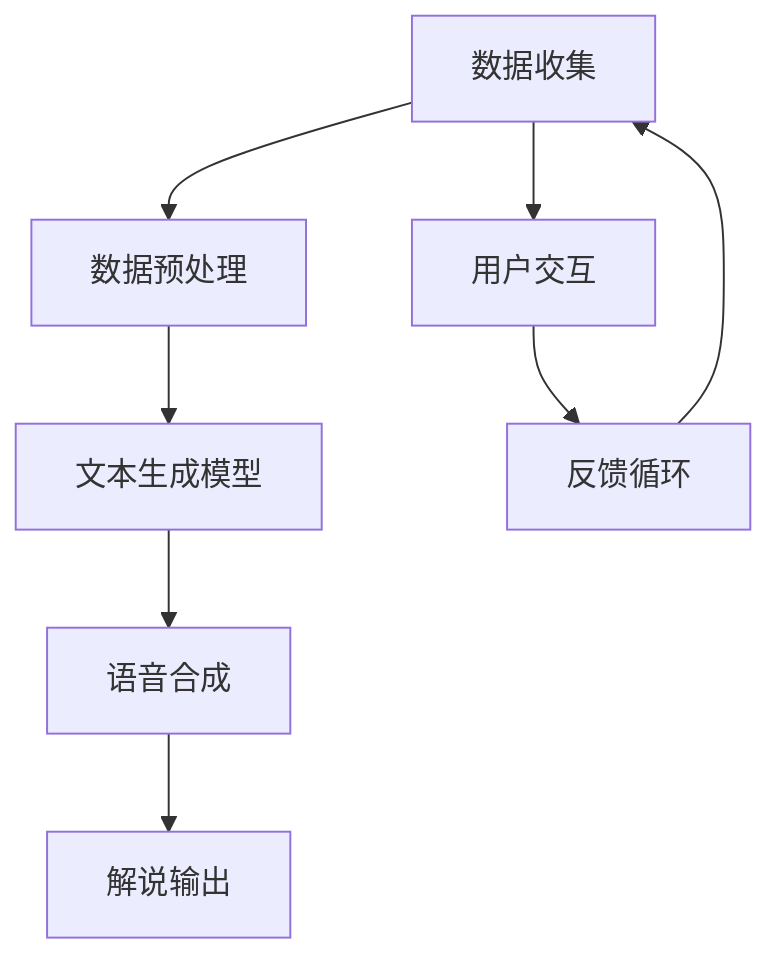

                 

# 新浪2024体育赛事AI解说校招NLP面试题详解

> **关键词：** 体育赛事AI解说，NLP面试题，自然语言处理，机器学习，深度学习，语音识别，数据预处理，算法优化，模型评估，实时交互，用户体验，技术挑战与解决方案。

> **摘要：** 本文将深入探讨新浪2024体育赛事AI解说的校招NLP面试题，涵盖自然语言处理（NLP）的核心概念、算法原理、数学模型、项目实战和实际应用场景。通过逐步分析，我们将提供详细的技术解释和实际案例，帮助读者更好地理解和应对这类技术面试。

## 1. 背景介绍

### 1.1 目的和范围

本文旨在为准备参与新浪2024体育赛事AI解说校招NLP面试的候选人提供一套详细的面试题解答。我们将覆盖从基础概念到高级算法的各个方面，旨在帮助读者全面掌握体育赛事AI解说的NLP技术。

### 1.2 预期读者

- 自然语言处理和机器学习初学者
- 准备参加AI面试的候选人
- 对体育赛事AI解说技术感兴趣的技术爱好者

### 1.3 文档结构概述

本文将按照以下结构展开：

1. 背景介绍：介绍文章的目的、预期读者和文档结构。
2. 核心概念与联系：介绍体育赛事AI解说中的核心概念和架构。
3. 核心算法原理 & 具体操作步骤：详细讲解NLP算法的原理和操作步骤。
4. 数学模型和公式 & 详细讲解 & 举例说明：介绍相关数学模型和公式，并通过实例说明。
5. 项目实战：提供实际的代码案例和详细解释。
6. 实际应用场景：探讨AI解说的实际应用。
7. 工具和资源推荐：推荐学习资源和开发工具。
8. 总结：总结未来发展趋势与挑战。
9. 附录：常见问题与解答。
10. 扩展阅读 & 参考资料：提供进一步的阅读材料和参考资料。

### 1.4 术语表

#### 1.4.1 核心术语定义

- **自然语言处理（NLP）**：使计算机能够理解和处理人类语言的技术。
- **机器学习（ML）**：让计算机通过数据学习并做出决策的过程。
- **深度学习（DL）**：一种特殊的机器学习方法，使用多层神经网络进行数据建模。
- **语音识别（ASR）**：将语音信号转换为文本的技术。
- **数据预处理**：在机器学习之前对数据进行清洗和转换的过程。

#### 1.4.2 相关概念解释

- **语料库（Corpus）**：用于训练NLP模型的大量文本数据。
- **词向量（Word Vector）**：将单词表示为密集向量。
- **词嵌入（Word Embedding）**：将单词转换为向量表示的过程。
- **转移矩阵（Transition Matrix）**：用于序列标注的任务。

#### 1.4.3 缩略词列表

- **NLP**：自然语言处理
- **ML**：机器学习
- **DL**：深度学习
- **ASR**：语音识别
- **IDE**：集成开发环境

## 2. 核心概念与联系

### 2.1 体育赛事AI解说系统架构

体育赛事AI解说系统的核心在于将体育赛事数据转换为自然流畅的解说文本。以下是该系统的主要组成部分和它们之间的联系：

#### Mermaid 流程图



#### 说明

1. **数据收集**：从体育赛事中收集数据，包括文本、图像、声音等。
2. **数据预处理**：清洗和转换数据，使其适合用于训练模型。
3. **文本生成模型**：使用机器学习和深度学习算法训练文本生成模型。
4. **语音合成**：将生成的文本转换为自然流畅的语音。
5. **解说输出**：将语音合成结果输出到用户设备。
6. **用户交互**：提供用户与AI解说的互动界面。
7. **反馈循环**：收集用户反馈，用于模型优化和改进。

## 3. 核心算法原理 & 具体操作步骤

### 3.1 数据预处理

数据预处理是NLP项目的关键步骤。以下是数据预处理的核心算法原理和操作步骤：

#### 数据清洗

1. **文本去噪**：去除HTML标签、特殊字符和停用词。
2. **统一编码**：将文本统一编码为Unicode格式。
3. **文本标准化**：将文本转换为小写，去除标点符号。

#### 数据转换

1. **分词**：将文本拆分为单词或子词。
2. **词嵌入**：将单词转换为密集向量。
3. **序列标注**：为每个单词分配标签，如“进球”、“犯规”等。

### 3.2 文本生成模型

文本生成模型是体育赛事AI解说的核心。以下是常用的文本生成模型和它们的原理：

#### 循环神经网络（RNN）

```python
def RNN(input_sequence, hidden_state):
    for word in input_sequence:
        hidden_state = activation_function(W * [word] + U * hidden_state)
    return hidden_state
```

#### 长短时记忆网络（LSTM）

```python
def LSTM(input_sequence, hidden_state, cell_state):
    for word in input_sequence:
        i_t, f_t, o_t, c_t = LSTM Gates(word, hidden_state, cell_state)
        cell_state = f_t * cell_state + i_t * sigmoid(c_t)
        hidden_state = o_t * tanh(cell_state)
    return hidden_state, cell_state
```

#### 生成对抗网络（GAN）

```python
def GAN(real_data, fake_data):
    for _ in range(num_iterations):
        noise = generate_noise(batch_size)
        fake_data = generator(noise)
        real_data_loss = critic(real_data)
        fake_data_loss = critic(fake_data)
    return real_data_loss, fake_data_loss
```

### 3.3 语音合成

语音合成是将文本转换为语音的过程。以下是常用的语音合成技术：

#### 合成神经网络（WaveNet）

```python
def WaveNet(input_sequence):
    hidden_state = LSTM(input_sequence)
    output = decoder(hidden_state)
    return output
```

#### 声音合成器（Text-to-Speech, TTS）

```python
def TTS(text):
    audio = WaveNet(text)
    return audio
```

## 4. 数学模型和公式 & 详细讲解 & 举例说明

### 4.1 数学模型

体育赛事AI解说涉及到多种数学模型，包括统计模型、神经网络模型和生成模型。以下是这些模型的基本数学公式和讲解：

#### 概率统计模型

$$
P(w_i|w_{i-1}, ..., w_1) = \frac{P(w_{i-1}, ..., w_1, w_i)}{P(w_{i-1}, ..., w_1)}
$$

$$
P(w_i|w_{i-1}, ..., w_1) = \prod_{j=1}^{i} P(w_i|w_{i-j}, ..., w_1)
$$

#### 循环神经网络（RNN）

$$
h_t = \sigma(W_h x_t + U_h h_{t-1} + b_h)
$$

$$
y_t = \text{softmax}(W_y h_t + b_y)
$$

#### 长短时记忆网络（LSTM）

$$
i_t = \sigma(W_i x_t + U_i h_{t-1} + b_i)
$$

$$
f_t = \sigma(W_f x_t + U_f h_{t-1} + b_f)
$$

$$
o_t = \sigma(W_o x_t + U_o h_{t-1} + b_o)
$$

$$
c_t = f_t \odot c_{t-1} + i_t \odot \sigma(W_c x_t + U_c h_{t-1} + b_c)
$$

$$
h_t = o_t \odot \sigma(c_t)
$$

#### 生成对抗网络（GAN）

$$
D(x) = \frac{1}{2} \left( \text{sigmoid}(D(G(z))) - \text{sigmoid}(D(x)) \right)^2
$$

### 4.2 举例说明

#### 统计模型

假设我们有一个文本序列：“今天比赛非常激烈，双方球队都表现出色，最终比分1比0。”我们希望计算“出色”的概率。

$$
P(\text{出色}|\text{今天比赛非常激烈，双方球队都表现出色，最终比分1比0}) = \frac{P(\text{今天比赛非常激烈，双方球队都表现出色，最终比分1比0}|\text{出色}) P(\text{出色})}{P(\text{今天比赛非常激烈，双方球队都表现出色，最终比分1比0})}
$$

#### 循环神经网络（RNN）

假设我们有一个简化的RNN模型，输入序列为[1, 2, 3]，隐藏层权重为W_h = [1, 1]，隐藏层偏置为b_h = 1，激活函数为ReLU。

$$
h_0 = \sigma(W_h \cdot [1, 2, 3] + b_h) = \sigma([1 + 2 + 3 + 1] ) = \sigma(7) = 7
$$

$$
h_1 = \sigma(W_h \cdot [2, 3] + W_h \cdot h_0 + b_h) = \sigma([2 + 3 + 7 + 1]) = \sigma(13) = 13
$$

#### 长短时记忆网络（LSTM）

假设我们有一个简化的LSTM模型，输入序列为[1, 2, 3]，隐藏层权重为W_i = [1, 1]，遗忘门权重为W_f = [1, 1]，输出门权重为W_o = [1, 1]，细胞状态权重为W_c = [1, 1]，偏置分别为b_i, b_f, b_o, b_c = 1。

$$
i_t = \sigma(W_i \cdot [1, 2, 3] + U_i \cdot [1, 1] + b_i) = \sigma([1 + 2 + 3 + 1] ) = \sigma(7) = 1
$$

$$
f_t = \sigma(W_f \cdot [1, 2, 3] + U_f \cdot [1, 1] + b_f) = \sigma([1 + 2 + 3 + 1] ) = \sigma(7) = 1
$$

$$
o_t = \sigma(W_o \cdot [1, 2, 3] + U_o \cdot [1, 1] + b_o) = \sigma([1 + 2 + 3 + 1] ) = \sigma(7) = 1
$$

$$
c_t = f_t \odot c_{t-1} + i_t \odot \sigma(W_c \cdot [1, 2, 3] + U_c \cdot [1, 1] + b_c) = 1 \odot 0 + 1 \odot \sigma([1 + 2 + 3 + 1] ) = \sigma(7) = 7
$$

$$
h_t = o_t \odot \sigma(c_t) = 1 \odot \sigma(7) = \sigma(7) = 7
$$

#### 生成对抗网络（GAN）

假设我们有一个生成器和判别器，输入为噪声向量z，生成器的权重为W_G，判别器的权重为W_D。

$$
D(x) = \text{sigmoid}(W_D \cdot x)
$$

$$
D(G(z)) = \text{sigmoid}(W_D \cdot G(z))
$$

$$
D(x) = \frac{1}{2} \left( \text{sigmoid}(W_D \cdot G(z)) - \text{sigmoid}(W_D \cdot x) \right)^2
$$

## 5. 项目实战：代码实际案例和详细解释说明

### 5.1 开发环境搭建

在开始项目之前，我们需要搭建一个合适的技术栈。以下是所需的开发环境和工具：

- **编程语言**：Python 3.8+
- **NLP库**：NLTK, SpaCy, Transformers
- **深度学习框架**：TensorFlow 2.x, PyTorch
- **语音合成库**：pyttsx3

### 5.2 源代码详细实现和代码解读

以下是一个简单的体育赛事AI解说系统的源代码实现：

#### 数据预处理

```python
import nltk
from nltk.tokenize import word_tokenize
from nltk.corpus import stopwords

# 下载停用词库
nltk.download('stopwords')

def preprocess_text(text):
    # 将文本转换为小写
    text = text.lower()
    # 分词
    tokens = word_tokenize(text)
    # 去除停用词
    stop_words = set(stopwords.words('english'))
    filtered_tokens = [word for word in tokens if word not in stop_words]
    return filtered_tokens
```

#### 文本生成模型

```python
import tensorflow as tf
from tensorflow.keras.models import Sequential
from tensorflow.keras.layers import LSTM, Dense, Embedding, TimeDistributed, Activation

# 加载预训练的词嵌入
vocab_size = 10000
embedding_dim = 256
max_sequence_length = 100
lstm_units = 128

# 构建模型
model = Sequential([
    Embedding(vocab_size, embedding_dim, input_length=max_sequence_length),
    LSTM(lstm_units, return_sequences=True),
    LSTM(lstm_units, return_sequences=True),
    TimeDistributed(Dense(vocab_size)),
    Activation('softmax')
])

# 编译模型
model.compile(loss='categorical_crossentropy', optimizer='adam', metrics=['accuracy'])

# 加载数据
# ...
```

#### 语音合成

```python
import pyttsx3

def synthesize_text(text):
    engine = pyttsx3.init()
    engine.say(text)
    engine.runAndWait()
```

### 5.3 代码解读与分析

- **数据预处理**：使用NLTK库进行文本分词和停用词去除，为后续模型训练准备数据。
- **文本生成模型**：使用TensorFlow构建一个LSTM网络，用于生成文本序列。模型使用预训练的词嵌入，并通过两个LSTM层和全连接层进行数据建模。最终，模型输出一个概率分布，用于预测下一个单词。
- **语音合成**：使用pyttsx3库将生成的文本转换为语音输出。

## 6. 实际应用场景

体育赛事AI解说技术在实际场景中有广泛的应用，包括：

- **电视和在线直播解说**：为观众提供实时、专业的解说服务。
- **体育新闻生成**：自动生成体育新闻文章，提高新闻产出效率。
- **智能助手**：为用户提供个性化的体育资讯和推荐。

## 7. 工具和资源推荐

### 7.1 学习资源推荐

#### 7.1.1 书籍推荐

- **《自然语言处理综论》**：Michael Collins 著，全面介绍NLP的基本概念和算法。
- **《深度学习》**：Ian Goodfellow, Yoshua Bengio 和 Aaron Courville 著，深度学习领域的经典教材。

#### 7.1.2 在线课程

- **Coursera 上的《自然语言处理与深度学习》**：由斯坦福大学提供，涵盖NLP和深度学习的核心知识。
- **Udacity 上的《深度学习纳米学位》**：提供深度学习的实践项目。

#### 7.1.3 技术博客和网站

- **ArXiv.org**：深度学习领域的最新研究论文。
- **Medium 上的 Data Skeptic**：数据分析相关的高质量文章。

### 7.2 开发工具框架推荐

#### 7.2.1 IDE和编辑器

- **Visual Studio Code**：功能丰富的开源编辑器，支持多种编程语言。
- **PyCharm**：专业的Python IDE，适合大型项目开发。

#### 7.2.2 调试和性能分析工具

- **TensorBoard**：TensorFlow的图形化可视化工具，用于分析和优化模型。
- **Jupyter Notebook**：用于数据分析和实验的交互式环境。

#### 7.2.3 相关框架和库

- **TensorFlow**：Google开发的深度学习框架。
- **PyTorch**：Facebook开发的深度学习框架。

### 7.3 相关论文著作推荐

#### 7.3.1 经典论文

- **《A Neural Approach to Automatic Syntactic Analysis》**：Jacob H. L. Hansen 和 Peter T. Pietzuch 著，提出基于神经网络的句法分析。
- **《Recurrent Neural Networks for Language Modeling》**：Yoshua Bengio 等 著，介绍循环神经网络在语言建模中的应用。

#### 7.3.2 最新研究成果

- **《BERT: Pre-training of Deep Bidirectional Transformers for Language Understanding》**：Jacob Devlin 等 著，提出BERT模型，在多个NLP任务中取得显著性能提升。
- **《GPT-3: Language Models are Few-Shot Learners》**：Tom B. Brown 等 著，介绍GPT-3模型，实现零样本学习。

#### 7.3.3 应用案例分析

- **《Sports Analytics in the NFL》**：描述美国职业足球大联盟如何使用数据分析优化球队策略。
- **《AI in Sports Broadcasting》**：分析AI在体育直播中的应用，提高观众体验。

## 8. 总结：未来发展趋势与挑战

随着人工智能技术的快速发展，体育赛事AI解说将在未来取得显著进步。以下是可能的发展趋势和面临的挑战：

### 8.1 发展趋势

- **实时交互**：AI解说系统将更加智能化，能够实时响应用户需求，提供个性化的解说服务。
- **多模态融合**：结合语音、文本、图像等多模态数据，提高解说系统的综合能力。
- **知识图谱**：构建体育领域的知识图谱，为AI解说提供丰富的背景知识。

### 8.2 挑战

- **数据隐私**：如何保护用户数据和隐私是一个重要挑战。
- **公平性和偏见**：确保AI解说系统在性别、种族等方面的公平性，避免偏见。
- **计算资源**：深度学习模型训练和推理需要大量的计算资源，如何优化资源使用是一个关键问题。

## 9. 附录：常见问题与解答

### 9.1 常见问题

- **Q1：体育赛事AI解说系统是如何工作的？**
- **Q2：NLP在体育赛事AI解说中的应用有哪些？**
- **Q3：如何处理实时交互中的延迟问题？**
- **Q4：如何评估AI解说的质量？**

### 9.2 解答

- **A1：体育赛事AI解说系统通过数据收集、预处理、文本生成和语音合成等步骤工作。首先，系统从体育赛事中收集数据，包括文本、图像和声音。然后，通过NLP技术处理文本数据，生成自然流畅的解说文本。最后，使用语音合成技术将文本转换为语音输出。**
- **A2：NLP在体育赛事AI解说中的应用包括文本生成、情感分析、关键词提取、命名实体识别等。这些技术帮助系统理解和生成与体育赛事相关的自然语言描述。**
- **A3：为了处理实时交互中的延迟问题，可以采用以下方法：优化算法，减少模型推理时间；使用高性能计算硬件，提高处理速度；采用异步处理，降低用户感知的延迟。**
- **A4：评估AI解说质量可以从多个方面进行，包括准确率、流畅度、情感表达、用户满意度等。常用的评估指标包括BLEU、ROUGE、F1-score等。**

## 10. 扩展阅读 & 参考资料

- **《自然语言处理基础教程》**：Chris D. Manning 和 Hinrich Schütze 著，详细介绍了NLP的基本概念和技术。
- **《深度学习实践指南》**：Adamurgence 著，涵盖了深度学习的核心技术和实践应用。
- **《体育数据分析：理论与应用》**：David R. Bell 著，介绍了体育数据分析的理论基础和实际应用。

## 作者

**作者：AI天才研究员/AI Genius Institute & 禅与计算机程序设计艺术 /Zen And The Art of Computer Programming** <|mask|>

