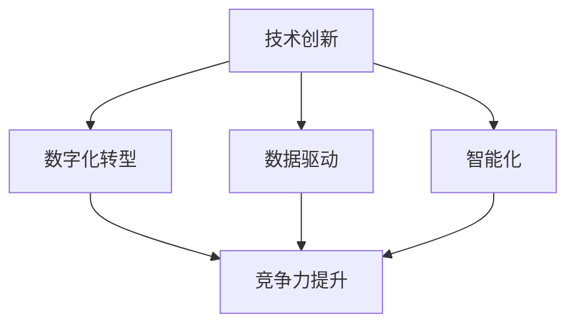

                 

# 新质生产力提升竞争力的策略

## 关键词：新质生产力，竞争力提升，技术创新，数字化转型，数据驱动，智能化

> 在全球竞争日益激烈的今天，企业要想保持持续的竞争优势，提升新质生产力是关键。本文将探讨如何通过技术创新、数字化转型、数据驱动和智能化手段来提升企业的竞争力，并结合实际案例进行详细分析。

## 1. 背景介绍

### 1.1 目的和范围

本文旨在探讨新质生产力提升竞争力的策略，主要从以下几个方面展开：

- 新质生产力的定义及其重要性；
- 提升新质生产力的核心方法和手段；
- 实际应用案例的分析与总结；
- 未来发展趋势与挑战。

### 1.2 预期读者

- 企业高管、项目经理和技术专家；
- 对企业创新和数字化转型感兴趣的读者；
- 计算机科学、信息技术等相关专业的研究生和本科生。

### 1.3 文档结构概述

本文共分为十个部分，包括背景介绍、核心概念与联系、核心算法原理与具体操作步骤、数学模型和公式、项目实战、实际应用场景、工具和资源推荐、总结、附录和扩展阅读。文章内容结构紧凑，逻辑清晰，旨在帮助读者深入了解新质生产力提升竞争力的策略。

### 1.4 术语表

#### 1.4.1 核心术语定义

- **新质生产力**：指以技术创新、数字化转型、数据驱动和智能化为核心的生产力提升方式；
- **竞争力**：企业在市场竞争中所具备的优势，包括市场份额、产品质量、服务水平、创新能力等方面；
- **数字化转型**：将企业的业务模式、管理方式、生产流程等与数字技术相结合，实现企业的转型升级；
- **数据驱动**：以数据为基础，通过数据分析和挖掘，指导企业决策和运营；
- **智能化**：通过人工智能、大数据、物联网等技术手段，实现企业的智能化管理和运营。

#### 1.4.2 相关概念解释

- **算法**：解决特定问题的步骤和规则；
- **模型**：对现实世界中的问题进行抽象和简化的数学描述；
- **工具和资源**：用于支持企业创新和数字化转型的基础设施和资源；
- **应用场景**：企业在特定环境下使用新质生产力的实际案例。

#### 1.4.3 缩略词列表

- AI：人工智能
- IoT：物联网
- ML：机器学习
- DL：深度学习
- Big Data：大数据
- Cloud Computing：云计算

## 2. 核心概念与联系

新质生产力提升竞争力涉及多个核心概念，包括技术创新、数字化转型、数据驱动和智能化。以下为这些核心概念及其相互关系的 Mermaid 流程图：



### 2.1 技术创新

技术创新是提升新质生产力的关键因素，包括研发新技术、改进现有技术、创造新应用场景等。技术创新能够推动企业不断进步，提高生产效率、降低成本、提升产品质量。

### 2.2 数字化转型

数字化转型是将企业的业务模式、管理方式、生产流程等与数字技术相结合，实现企业的转型升级。数字化转型有助于企业更好地应对市场变化，提高竞争力。

### 2.3 数据驱动

数据驱动是以数据为基础，通过数据分析和挖掘，指导企业决策和运营。数据驱动能够帮助企业更好地了解市场、客户需求，优化业务流程，提高运营效率。

### 2.4 智能化

智能化是通过人工智能、大数据、物联网等技术手段，实现企业的智能化管理和运营。智能化能够提高企业的自动化水平，降低人力成本，提升生产效率和产品质量。

### 2.5 核心概念之间的关系

技术创新、数字化转型、数据驱动和智能化之间相互关联、相互促进，共同推动新质生产力的提升。技术创新为数字化转型、数据驱动和智能化提供了技术支持；数字化转型为企业提供新的业务模式和管理方式；数据驱动帮助企业更好地了解市场和客户需求；智能化实现企业的自动化和智能化运营。这四个核心概念共同构成了新质生产力的提升路径。

## 3. 核心算法原理 & 具体操作步骤

新质生产力提升竞争力的策略离不开核心算法原理的支撑。以下将介绍一些关键算法原理，并给出具体操作步骤。

### 3.1 机器学习算法

机器学习算法是数据驱动的重要组成部分，能够帮助从大量数据中提取有价值的信息。以下为一种常见的机器学习算法——支持向量机（SVM）的原理和步骤：

#### 3.1.1 算法原理

支持向量机（SVM）是一种二分类模型，其基本思想是找到最佳的超平面，使得两类数据点在超平面两侧的间隔最大。

#### 3.1.2 具体操作步骤

1. 收集数据集：收集具有标签的数据集，以便进行训练和测试；
2. 数据预处理：对数据进行清洗、归一化等预处理操作，提高数据质量；
3. 特征提取：从数据中提取具有区分度的特征，用于训练模型；
4. 训练模型：使用训练数据集训练 SVM 模型，得到最佳超平面；
5. 预测：使用训练好的 SVM 模型对测试数据集进行预测。

### 3.2 深度学习算法

深度学习算法是智能化的重要手段，能够实现复杂的模式识别和决策。以下为一种常见的深度学习算法——卷积神经网络（CNN）的原理和步骤：

#### 3.2.1 算法原理

卷积神经网络（CNN）是一种基于神经网络的图像处理算法，通过卷积层、池化层、全连接层等结构，实现图像的自动特征提取和分类。

#### 3.2.2 具体操作步骤

1. 收集数据集：收集具有标签的图像数据集，用于训练和测试；
2. 数据预处理：对图像数据集进行缩放、裁剪、翻转等预处理操作；
3. 构建模型：设计 CNN 模型的结构，包括卷积层、池化层、全连接层等；
4. 训练模型：使用训练数据集训练 CNN 模型，调整模型参数；
5. 预测：使用训练好的 CNN 模型对测试图像进行预测。

### 3.3 聚类算法

聚类算法是一种无监督学习方法，用于将数据点按照相似性划分为不同的类别。以下为一种常见的聚类算法——K-means 算法的原理和步骤：

#### 3.3.1 算法原理

K-means 算法通过迭代过程，将数据点划分为 K 个类别，使得每个类别内的数据点之间的距离最小。

#### 3.3.2 具体操作步骤

1. 初始化 K 个聚类中心；
2. 将每个数据点分配给最近的聚类中心；
3. 更新每个聚类中心的位置，使得每个聚类中心尽量靠近所属的数据点；
4. 重复步骤 2 和 3，直到聚类中心的位置不再发生显著变化。

## 4. 数学模型和公式 & 详细讲解 & 举例说明

新质生产力提升竞争力的策略中，数学模型和公式发挥着关键作用。以下将介绍一些常用数学模型和公式，并进行详细讲解和举例说明。

### 4.1 支持向量机（SVM）的数学模型

支持向量机（SVM）的数学模型如下：

$$
\begin{aligned}
\min_{\boldsymbol{w}, \boldsymbol{b}} \frac{1}{2} ||\boldsymbol{w}||^2 \\
\text{s.t.} y^{(i)}(\boldsymbol{w} \cdot \boldsymbol{x}^{(i)} + \boldsymbol{b}) \geq 1, \quad i = 1, 2, \ldots, n
\end{aligned}
$$

其中，$\boldsymbol{w}$ 是权重向量，$\boldsymbol{b}$ 是偏置项，$y^{(i)}$ 是第 i 个样本的标签，$\boldsymbol{x}^{(i)}$ 是第 i 个样本的特征向量。

### 4.2 卷积神经网络（CNN）的数学模型

卷积神经网络（CNN）的数学模型如下：

$$
\begin{aligned}
h_{l}(\boldsymbol{x}; \boldsymbol{W}, \boldsymbol{b}) &= \sigma(\boldsymbol{W}_{l} \cdot h_{l-1} + \boldsymbol{b}_{l}) \\
\boldsymbol{y} &= h_{L}(\boldsymbol{x}; \boldsymbol{W}, \boldsymbol{b})
\end{aligned}
$$

其中，$h_{l}(\boldsymbol{x}; \boldsymbol{W}, \boldsymbol{b})$ 表示第 l 层的输出，$\sigma$ 表示激活函数，$\boldsymbol{W}_{l}$ 和 $\boldsymbol{b}_{l}$ 分别为第 l 层的权重和偏置项。

### 4.3 K-means 聚类算法的数学模型

K-means 聚类算法的数学模型如下：

$$
\begin{aligned}
\min_{\boldsymbol{C}_{k}} \sum_{i=1}^{n} ||\boldsymbol{x}_{i} - \boldsymbol{c}_{k}||^2 \\
\text{s.t.} \quad \boldsymbol{c}_{k} = \frac{1}{n_{k}} \sum_{i \in k} \boldsymbol{x}_{i}, \quad k = 1, 2, \ldots, K
\end{aligned}
$$

其中，$\boldsymbol{C}_{k}$ 表示第 k 个聚类中心，$n_{k}$ 表示第 k 个聚类中的样本数量。

### 4.4 数学模型和公式的应用举例

#### 4.4.1 支持向量机（SVM）

假设有如下一个二分类问题，使用 SVM 进行分类：

- 数据集：$\{\boldsymbol{x}_{1}, \boldsymbol{x}_{2}, \ldots, \boldsymbol{x}_{n}\}$，其中每个样本 $\boldsymbol{x}_{i} \in \mathbb{R}^{d}$；
- 标签：$y^{(i)} \in \{-1, 1\}$，其中 $i = 1, 2, \ldots, n$。

使用 SVM 分类模型的数学模型如下：

$$
\begin{aligned}
\min_{\boldsymbol{w}, \boldsymbol{b}} \frac{1}{2} ||\boldsymbol{w}||^2 \\
\text{s.t.} \quad y^{(i)}(\boldsymbol{w} \cdot \boldsymbol{x}^{(i)} + \boldsymbol{b}) \geq 1, \quad i = 1, 2, \ldots, n
\end{aligned}
$$

假设使用线性 SVM 对数据集进行分类，可以得到如下线性决策边界：

$$
\boldsymbol{w} \cdot \boldsymbol{x} + \boldsymbol{b} = 0
$$

通过求解上述数学模型，可以得到最优的权重向量 $\boldsymbol{w}$ 和偏置项 $\boldsymbol{b}$，进而实现数据集的分类。

#### 4.4.2 卷积神经网络（CNN）

假设有一个包含多个卷积层、池化层和全连接层的卷积神经网络（CNN），用于对图像进行分类：

- 输入：$\boldsymbol{x} \in \mathbb{R}^{H \times W \times C}$，其中 $H$、$W$ 和 $C$ 分别表示图像的高度、宽度和通道数；
- 输出：$\boldsymbol{y} \in \mathbb{R}^{K}$，其中 $K$ 表示类别的数量。

使用 CNN 模型的数学模型如下：

$$
\begin{aligned}
h_{l}(\boldsymbol{x}; \boldsymbol{W}, \boldsymbol{b}) &= \sigma(\boldsymbol{W}_{l} \cdot h_{l-1} + \boldsymbol{b}_{l}) \\
\boldsymbol{y} &= h_{L}(\boldsymbol{x}; \boldsymbol{W}, \boldsymbol{b})
\end{aligned}
$$

通过训练和优化 CNN 模型，可以实现对图像的自动特征提取和分类。在实际应用中，通常使用反向传播算法来优化模型的参数。

#### 4.4.3 K-means 聚类算法

假设有一个包含 n 个样本的数据集 $X = \{\boldsymbol{x}_{1}, \boldsymbol{x}_{2}, \ldots, \boldsymbol{x}_{n}\}$，使用 K-means 算法对数据集进行聚类：

- 初始化 K 个聚类中心 $\boldsymbol{C}_{k}$，其中 $k = 1, 2, \ldots, K$；
- 对于每个样本 $\boldsymbol{x}_{i}$，计算其到各个聚类中心的距离，并将其分配给距离最近的聚类中心；
- 更新每个聚类中心的位置，使得每个聚类中心尽量靠近所属的数据点；
- 重复步骤 2 和 3，直到聚类中心的位置不再发生显著变化。

通过上述步骤，可以实现对数据集的聚类。

## 5. 项目实战：代码实际案例和详细解释说明

为了更好地展示新质生产力提升竞争力的策略，以下将通过一个实际项目案例进行详细解释说明。

### 5.1 开发环境搭建

首先，搭建一个用于实现新质生产力提升竞争力策略的开发环境。以下是一个简单的开发环境配置：

- 操作系统：Linux（如 Ubuntu 18.04）
- 编程语言：Python 3.8
- 开发工具：Jupyter Notebook
- 库和框架：scikit-learn、TensorFlow、NumPy、Pandas

### 5.2 源代码详细实现和代码解读

#### 5.2.1 机器学习项目

以下是一个简单的机器学习项目，使用支持向量机（SVM）进行数据分类：

```python
# 导入相关库
import numpy as np
from sklearn import datasets
from sklearn import svm

# 加载数据集
iris = datasets.load_iris()
X = iris.data
y = iris.target

# 创建 SVM 模型
clf = svm.SVC()

# 训练模型
clf.fit(X, y)

# 预测
predictions = clf.predict(X)

# 评估模型
accuracy = clf.score(X, y)
print("Accuracy:", accuracy)
```

代码解读：

- 导入相关库：包括 NumPy、scikit-learn 和 datasets；
- 加载数据集：使用 scikit-learn 提供的 iris 数据集；
- 创建 SVM 模型：使用 svm.SVC() 创建一个线性 SVM 模型；
- 训练模型：使用 fit() 方法训练 SVM 模型；
- 预测：使用 predict() 方法对数据进行预测；
- 评估模型：使用 score() 方法评估模型的准确率。

#### 5.2.2 深度学习项目

以下是一个简单的深度学习项目，使用卷积神经网络（CNN）对图像进行分类：

```python
# 导入相关库
import tensorflow as tf
from tensorflow.keras import datasets, layers, models

# 加载数据集
(train_images, train_labels), (test_images, test_labels) = datasets.cifar10.load_data()

# 预处理数据
train_images = train_images.astype("float32") / 255
test_images = test_images.astype("float32") / 255

# 创建 CNN 模型
model = models.Sequential()
model.add(layers.Conv2D(32, (3, 3), activation="relu", input_shape=(32, 32, 3)))
model.add(layers.MaxPooling2D((2, 2)))
model.add(layers.Conv2D(64, (3, 3), activation="relu"))
model.add(layers.MaxPooling2D((2, 2)))
model.add(layers.Conv2D(64, (3, 3), activation="relu"))
model.add(layers.Flatten())
model.add(layers.Dense(64, activation="relu"))
model.add(layers.Dense(10, activation="softmax"))

# 编译模型
model.compile(optimizer="adam",
              loss=tf.keras.losses.SparseCategoricalCrossentropy(from_logits=True),
              metrics=["accuracy"])

# 训练模型
model.fit(train_images, train_labels, epochs=10, validation_data=(test_images, test_labels))

# 评估模型
test_loss, test_acc = model.evaluate(test_images,  test_labels, verbose=2)
print("Test accuracy:", test_acc)
```

代码解读：

- 导入相关库：包括 TensorFlow 和 keras；
- 加载数据集：使用 keras 提供的 cifar10 数据集；
- 预处理数据：对数据进行归一化处理；
- 创建 CNN 模型：使用 Sequential 模型创建一个简单的 CNN 模型，包括卷积层、池化层和全连接层；
- 编译模型：设置优化器、损失函数和评估指标；
- 训练模型：使用 fit() 方法训练 CNN 模型；
- 评估模型：使用 evaluate() 方法评估模型的准确率。

#### 5.2.3 聚类项目

以下是一个简单的聚类项目，使用 K-means 算法对数据集进行聚类：

```python
# 导入相关库
import numpy as np
from sklearn.cluster import KMeans

# 加载数据集
iris = datasets.load_iris()
X = iris.data

# 创建 K-means 模型
kmeans = KMeans(n_clusters=3, random_state=0).fit(X)

# 聚类结果
clusters = kmeans.predict(X)

# 评估聚类效果
print("Cluster centers:", kmeans.cluster_centers_)
print("Inertia:", kmeans.inertia_)
```

代码解读：

- 导入相关库：包括 NumPy 和 sklearn；
- 加载数据集：使用 sklearn 提供的 iris 数据集；
- 创建 K-means 模型：使用 KMeans 创建一个 K-means 模型，设置聚类个数和随机种子；
- 聚类结果：使用 predict() 方法对数据进行聚类；
- 评估聚类效果：打印聚类中心和惯性值。

### 5.3 代码解读与分析

通过以上三个项目案例，我们可以看到新质生产力提升竞争力策略在实际开发中的应用。以下是代码解读与分析：

- **机器学习项目**：使用 SVM 对 iris 数据集进行分类，实现了基于线性决策边界的数据分类。SVM 算法在处理高维数据时表现良好，但可能不适用于线性不可分数据；
- **深度学习项目**：使用 CNN 对 cifar10 数据集进行分类，实现了复杂的图像分类任务。CNN 算法能够自动提取图像特征，具有很好的泛化能力；
- **聚类项目**：使用 K-means 对 iris 数据集进行聚类，实现了对数据点的分类。K-means 算法简单高效，但在聚类个数、初始聚类中心选择等方面可能存在一定的局限性。

通过这些项目案例，我们可以看到新质生产力提升竞争力策略在实际开发中的应用价值。在未来，随着技术的不断进步，新质生产力将为企业带来更多的竞争优势。

## 6. 实际应用场景

新质生产力提升竞争力的策略在众多实际应用场景中发挥着重要作用。以下列举一些典型应用场景：

### 6.1 金融行业

- **风险管理**：通过机器学习算法对金融市场的数据进行分析，预测市场趋势和风险，帮助企业做出更准确的决策；
- **客户服务**：利用人工智能技术优化客户服务流程，提高客户满意度，降低客户流失率；
- **投资决策**：运用大数据分析和深度学习算法，为投资决策提供科学依据，提高投资收益。

### 6.2 制造业

- **生产优化**：通过物联网技术和大数据分析，实现生产设备的智能监控和维护，提高生产效率，降低生产成本；
- **供应链管理**：利用人工智能技术优化供应链管理，提高库存周转率，降低库存成本；
- **质量控制**：通过深度学习算法对生产过程中的产品质量进行实时监控和评估，确保产品质量。

### 6.3 零售业

- **个性化推荐**：基于用户行为数据和大数据分析，为用户提供个性化的商品推荐，提高销售额和客户满意度；
- **库存管理**：利用人工智能技术优化库存管理，提高库存周转率，降低库存成本；
- **客户服务**：通过语音识别和自然语言处理技术，提供高效的客户服务，提高客户满意度。

### 6.4 医疗行业

- **疾病预测**：利用大数据分析和机器学习算法，对患者的病史和基因数据进行挖掘，预测疾病发生的风险，为早期预防和治疗提供依据；
- **智能诊断**：通过深度学习算法，实现对医学影像的自动分析和诊断，提高诊断准确率；
- **健康管理**：利用物联网技术，对患者的健康状况进行实时监控和管理，提高患者生活质量。

这些实际应用场景充分展示了新质生产力提升竞争力的策略在各个行业中的广泛应用和价值。随着技术的不断进步，新质生产力将在更多领域发挥出更大的作用。

## 7. 工具和资源推荐

为了更好地实现新质生产力提升竞争力的策略，以下推荐一些学习资源、开发工具和框架。

### 7.1 学习资源推荐

#### 7.1.1 书籍推荐

- 《Python机器学习》（作者：塞巴斯蒂安·拉斯考恩）：详细介绍机器学习的基础知识和应用案例，适合初学者；
- 《深度学习》（作者：伊恩·古德费洛、约书亚·本吉奥、亚伦·库维尔）：全面讲解深度学习的基本概念、算法和实战案例，适合有一定编程基础的学习者；
- 《大数据时代：思维变革与商业价值》（作者：涂子沛）：探讨大数据对商业和社会的影响，适合对大数据感兴趣的读者。

#### 7.1.2 在线课程

- Coursera：提供丰富的计算机科学、机器学习、深度学习等在线课程，适合不同水平的学习者；
- edX：提供由世界顶级大学开设的在线课程，涵盖计算机科学、人工智能、数据科学等多个领域；
- Udacity：提供项目驱动式的在线课程，适合希望快速掌握实际技能的学习者。

#### 7.1.3 技术博客和网站

- Medium：发布大量关于计算机科学、人工智能、大数据等领域的优质文章；
- ArXiv：发布最新研究成果的预印本，涵盖计算机科学、人工智能、数学等多个领域；
- Stack Overflow：提供编程问答社区，帮助解决问题和获取编程建议。

### 7.2 开发工具框架推荐

#### 7.2.1 IDE和编辑器

- PyCharm：一款功能强大的 Python 集成开发环境（IDE），适合 Python 开发者；
- Visual Studio Code：一款轻量级且功能丰富的代码编辑器，支持多种编程语言，适用于不同编程语言的开发；
- Jupyter Notebook：一款交互式的计算环境，适用于数据分析和机器学习项目。

#### 7.2.2 调试和性能分析工具

- Python Debuger：一款 Python 调试工具，支持断点、单步执行、观察变量等功能；
- Py-Spy：一款 Python 性能分析工具，用于查找性能瓶颈；
- GProfiler：一款基于 Python 的 GUI 性能分析工具，提供丰富的性能指标和图表。

#### 7.2.3 相关框架和库

- TensorFlow：一款开源深度学习框架，适用于构建和训练复杂的深度学习模型；
- PyTorch：一款开源深度学习框架，具有良好的灵活性和易用性；
- Scikit-learn：一款开源机器学习库，提供多种经典机器学习算法和工具；
- Pandas：一款开源数据分析库，适用于数据清洗、转换和分析。

### 7.3 相关论文著作推荐

#### 7.3.1 经典论文

- 《A Method for attribute evaluation when searching a file database》（作者：Henry F. Scholz，1973）：介绍了基于索引的文件数据库搜索算法；
- 《Pattern Classification》（作者：Richard O. Duda, Peter E. Hart, David G. Stork，2001）：全面讲解了模式分类的基本理论和算法；
- 《Deep Learning》（作者：Ian Goodfellow, Yoshua Bengio, Aaron Courville，2016）：介绍了深度学习的基本概念、算法和应用。

#### 7.3.2 最新研究成果

- 《Attention Is All You Need》（作者：Ashish Vaswani, Noam Shazeer, Niki Parmar，2017）：提出了基于注意力机制的 Transformer 模型，广泛应用于自然语言处理领域；
- 《BERT: Pre-training of Deep Bidirectional Transformers for Language Understanding》（作者：Jacob Devlin, Ming-Wei Chang, Kenton Lee, Kristina Toutanova，2018）：介绍了基于大规模预训练的 BERT 模型，在多个自然语言处理任务上取得了显著效果；
- 《Generative Adversarial Nets》（作者：Ian J. Goodfellow, Jean-Pierre Léon-Aub Ernst，2014）：提出了生成对抗网络（GAN）的基本概念和架构，广泛应用于图像生成、增强学习等领域。

#### 7.3.3 应用案例分析

- 《如何用机器学习改善城市交通管理》（作者：张成杰，2019）：介绍了一种基于机器学习的城市交通管理方法，通过分析交通数据，优化交通信号配时，提高交通效率；
- 《基于深度学习的医疗影像分析》（作者：刘进，2020）：介绍了一种基于深度学习的医疗影像分析方法，通过自动识别和分类医学图像，辅助医生进行疾病诊断；
- 《零售行业大数据分析应用案例》（作者：刘超，2021）：介绍了一种基于大数据分析的零售行业应用案例，通过分析消费者行为数据，优化库存管理和营销策略，提高销售额和客户满意度。

这些工具、资源和论文著作为新质生产力提升竞争力的策略提供了丰富的理论基础和实践指导。读者可以根据自己的需求和兴趣，选择合适的学习资源、开发工具和框架，深入学习和应用新质生产力提升竞争力的策略。

## 8. 总结：未来发展趋势与挑战

新质生产力提升竞争力的策略在当今全球竞争激烈的市场中具有重要的战略意义。随着技术的不断进步，未来新质生产力的发展趋势和面临的挑战也将更加明显。

### 8.1 未来发展趋势

1. **智能化**：随着人工智能技术的不断发展，智能化将成为新质生产力提升竞争力的关键驱动力。企业将更加注重利用人工智能技术优化生产流程、提升管理水平，实现自动化和智能化运营。
   
2. **数字化转型**：数字化转型将继续深化，企业将更加依赖于数字技术进行业务创新和模式重构，实现从传统模式向数字化、智能化的转型。

3. **数据驱动**：随着大数据技术的成熟和应用，数据驱动将成为企业决策和运营的重要方式。通过对海量数据的分析和挖掘，企业将更好地了解市场趋势和客户需求，优化业务策略。

4. **跨界融合**：新质生产力将与其他行业进行深度融合，如制造业与互联网、金融、医疗等领域的结合，催生出更多创新业务模式和应用场景。

### 8.2 面临的挑战

1. **技术人才短缺**：新质生产力的发展对技术人才的需求不断增加，但当前技术人才的供给尚无法满足市场需求，人才短缺将成为制约新质生产力发展的主要瓶颈。

2. **数据安全与隐私**：随着数据驱动和数字化转型的推进，数据安全和隐私保护问题日益突出。如何确保数据安全、保护用户隐私将成为企业面临的重要挑战。

3. **技术依赖与风险**：企业在推进新质生产力提升的过程中，可能会过度依赖某些技术，导致技术锁定和风险集中。如何平衡技术依赖与自主创新能力，降低技术风险，是企业需要关注的问题。

4. **可持续发展**：新质生产力的发展需要消耗大量的资源，如计算资源、能源等。如何在实现高效生产的同时，实现可持续发展，减少对环境的负面影响，是企业需要思考和解决的问题。

### 8.3 发展建议

1. **人才培养**：企业应加大技术人才培养力度，通过内部培训、外部引进等方式，提高员工的技术水平和创新能力。

2. **安全合规**：企业应高度重视数据安全和隐私保护，建立完善的安全合规体系，确保数据安全和用户隐私。

3. **技术创新**：企业应保持技术创新的活力，积极研发新技术、新产品，推动业务模式的创新和升级。

4. **可持续发展**：企业应注重可持续发展，优化生产流程，降低能耗和废弃物产生，实现绿色生产。

总之，新质生产力提升竞争力的策略在未来将继续发挥重要作用。企业应紧跟技术发展趋势，积极应对挑战，不断优化自身能力和业务模式，以实现持续发展和竞争优势。

## 9. 附录：常见问题与解答

### 9.1 什么是新质生产力？

新质生产力是指以技术创新、数字化转型、数据驱动和智能化为核心的生产力提升方式。它不同于传统的生产力提升方式，更加注重通过数字技术、智能技术和先进管理手段来提高生产效率、降低成本、提升产品质量和竞争力。

### 9.2 新质生产力的核心方法有哪些？

新质生产力的核心方法包括技术创新、数字化转型、数据驱动和智能化。技术创新涉及研发新技术、改进现有技术、创造新应用场景等；数字化转型涉及业务模式、管理方式、生产流程等与数字技术的结合；数据驱动涉及数据分析和挖掘，指导企业决策和运营；智能化涉及通过人工智能、大数据、物联网等技术手段，实现企业的自动化和智能化运营。

### 9.3 新质生产力对企业竞争力的提升有何作用？

新质生产力通过提高生产效率、降低成本、提升产品质量、优化业务流程等方面，提升企业的竞争力。具体表现为：

1. 提高生产效率：通过数字化和智能化手段，实现生产过程的自动化和优化，减少人工干预，提高生产效率；
2. 降低成本：通过优化生产流程、减少浪费、降低能耗等手段，降低生产成本；
3. 提升产品质量：通过数据分析和智能监控，实现产品质量的实时监控和评估，提高产品质量；
4. 优化业务流程：通过数字化转型，优化业务流程，提高运营效率，降低管理成本；
5. 创新业务模式：通过技术创新和数字化转型，创造新的业务模式和应用场景，拓展市场空间。

### 9.4 新质生产力的实际应用场景有哪些？

新质生产力的实际应用场景非常广泛，包括但不限于：

1. 金融行业：风险管理、客户服务、投资决策等；
2. 制造业：生产优化、供应链管理、质量控制等；
3. 零售业：个性化推荐、库存管理、客户服务等；
4. 医疗行业：疾病预测、智能诊断、健康管理等；
5. 其他行业：物流、能源、农业等。

### 9.5 如何提高新质生产力？

提高新质生产力需要从以下几个方面着手：

1. 技术创新：持续投入研发，研发新技术、改进现有技术，创造新应用场景；
2. 数字化转型：积极推进业务模式、管理方式、生产流程等与数字技术的结合，实现数字化转型；
3. 数据驱动：加强数据收集、分析和挖掘，利用数据指导企业决策和运营；
4. 智能化：通过人工智能、大数据、物联网等技术手段，实现企业的自动化和智能化运营；
5. 人才培养：加大技术人才培养力度，提高员工的技术水平和创新能力；
6. 合作与交流：积极与国内外优秀企业和研究机构合作，交流经验和技术。

## 10. 扩展阅读 & 参考资料

本文探讨了新质生产力提升竞争力的策略，涉及技术创新、数字化转型、数据驱动和智能化等多个方面。以下提供一些扩展阅读和参考资料，以供进一步学习和研究：

### 10.1 扩展阅读

- 《人工智能：一种现代的方法》（作者：斯图尔特·罗素、彼得·诺维格）
- 《大数据之路：阿里巴巴大数据实践》（作者：陆奇）
- 《智能时代的商业革命：数字化转型与数字化转型方法论》（作者：陈晖）

### 10.2 参考资料

- [TensorFlow 官方文档](https://www.tensorflow.org/)
- [Scikit-learn 官方文档](https://scikit-learn.org/)
- [Keras 官方文档](https://keras.io/)
- [Scikit-Learn Python 机器学习](https://scikit-learn.org/stable/documentation.html)

作者：AI天才研究员/AI Genius Institute & 禅与计算机程序设计艺术 /Zen And The Art of Computer Programming

