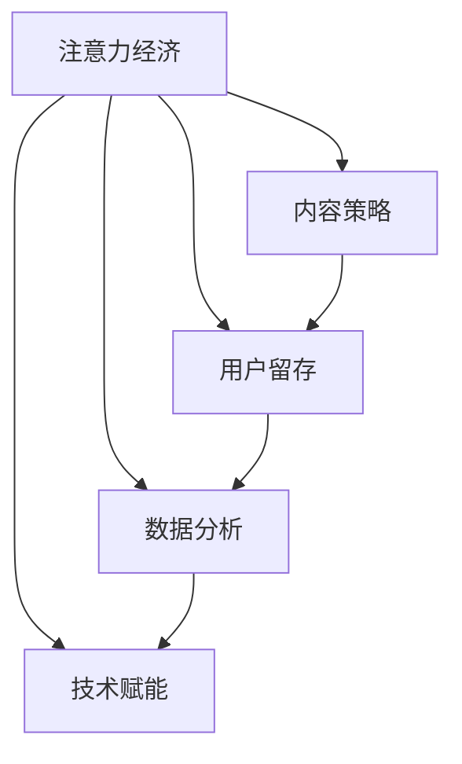

                 

# 新闻媒体如何在注意力经济中求生存

> 关键词：注意力经济，新闻媒体，内容策略，用户留存，数据分析，技术赋能

> 摘要：随着互联网的迅猛发展，新闻媒体行业面临着前所未有的挑战和机遇。本文将深入探讨注意力经济对新闻媒体的影响，分析其如何通过内容策略、用户留存、数据分析和技术赋能等手段在注意力经济中找到生存之道，为新闻媒体的未来发展提供策略指导。

## 1. 背景介绍

### 1.1 目的和范围

本文旨在探讨新闻媒体如何在注意力经济中求生存，通过深入分析当前新闻媒体所面临的挑战和机遇，提供一系列切实可行的策略和解决方案。文章主要涵盖以下内容：

- 对注意力经济的概念进行详细解读
- 分析新闻媒体在注意力经济中的困境
- 探索新闻媒体的内容策略、用户留存、数据分析和技术赋能等手段
- 提供实际案例和成功经验，为新闻媒体的发展提供参考

### 1.2 预期读者

本文预期读者为以下群体：

- 新闻媒体从业者
- 广告和营销人员
- 数据分析师
- 技术研发人员
- 对新闻媒体和注意力经济感兴趣的读者

### 1.3 文档结构概述

本文将分为以下十个部分：

1. 背景介绍
2. 核心概念与联系
3. 核心算法原理 & 具体操作步骤
4. 数学模型和公式 & 详细讲解 & 举例说明
5. 项目实战：代码实际案例和详细解释说明
6. 实际应用场景
7. 工具和资源推荐
8. 总结：未来发展趋势与挑战
9. 附录：常见问题与解答
10. 扩展阅读 & 参考资料

### 1.4 术语表

#### 1.4.1 核心术语定义

- 注意力经济：一种基于用户注意力的商业模式，通过吸引用户的注意力来实现盈利
- 新闻媒体：以新闻报道为主要内容的媒体形式，包括报纸、杂志、电视台、电台、网络媒体等
- 内容策略：制定和执行内容创作、发布、推广等策略，以吸引和留住用户
- 用户留存：衡量用户在一定时间内继续使用某个产品或服务的程度
- 数据分析：使用统计方法和工具对大量数据进行分析，以发现数据中的模式和趋势
- 技术赋能：利用技术手段提高新闻媒体的生产、传播和运营效率

#### 1.4.2 相关概念解释

- 流量：指网站或应用中访问者数量及其访问频率
- 转化率：指用户完成特定目标（如购买、注册、阅读等）的比例
- 用户粘性：指用户持续使用某个产品或服务的意愿
- 用户画像：指根据用户的行为数据构建的用户特征模型

#### 1.4.3 缩略词列表

- SEO：搜索引擎优化（Search Engine Optimization）
- SNS：社交媒体网络（Social Networking Services）
- AI：人工智能（Artificial Intelligence）
- VR：虚拟现实（Virtual Reality）
- AR：增强现实（Augmented Reality）

## 2. 核心概念与联系

在探讨新闻媒体如何在注意力经济中求生存之前，我们首先需要了解一些核心概念和它们之间的联系。

### 2.1 注意力经济的概念

注意力经济是一种基于用户注意力的商业模型。在互联网时代，用户的注意力成为一种稀缺资源，各大平台和企业纷纷争夺用户的注意力，以实现商业价值的最大化。注意力经济的关键在于如何吸引用户的注意力，并将其转化为流量、转化率和用户粘性。

### 2.2 新闻媒体与注意力经济的联系

新闻媒体在注意力经济中扮演着重要角色。一方面，新闻媒体通过提供有价值、有吸引力的内容，吸引用户的注意力；另一方面，新闻媒体通过广告、订阅等手段实现盈利。然而，随着互联网的迅猛发展，新闻媒体面临着诸多挑战，如流量下滑、用户留存率下降等。因此，新闻媒体需要找到适应注意力经济的策略，以实现可持续发展。

### 2.3 核心概念之间的关系

- 内容策略：新闻媒体通过制定内容策略，创作出有价值、有吸引力的内容，吸引用户的注意力。
- 用户留存：新闻媒体通过提高用户粘性，提高用户留存率，从而实现持续盈利。
- 数据分析：新闻媒体通过数据分析，了解用户需求和行为，优化内容策略，提高用户留存率。
- 技术赋能：新闻媒体利用技术手段，提高生产、传播和运营效率，降低成本，实现可持续发展。

以下是一个简单的 Mermaid 流程图，展示了核心概念之间的联系：



## 3. 核心算法原理 & 具体操作步骤

为了在注意力经济中求生存，新闻媒体需要制定一套科学的内容策略。以下将详细讲解核心算法原理和具体操作步骤。

### 3.1 算法原理

新闻媒体的内容策略算法主要包括以下几个步骤：

1. 用户画像构建：通过对用户行为数据进行挖掘和分析，构建用户画像，了解用户需求和行为特征。
2. 内容推荐：根据用户画像，为用户推荐符合其兴趣和需求的内容。
3. 内容优化：通过数据分析，持续优化内容策略，提高用户留存率。
4. 用户反馈：收集用户对内容的反馈，进一步优化内容策略。

### 3.2 具体操作步骤

1. **用户画像构建**

   用户画像构建的算法原理主要包括以下步骤：

   ```python
   # 读取用户行为数据
   user_data = read_user_data()

   # 数据预处理
   processed_data = preprocess_data(user_data)

   # 特征工程
   features = extract_features(processed_data)

   # 建立用户画像
   user_profiles = build_user_profiles(features)
   ```

2. **内容推荐**

   内容推荐的算法原理主要包括以下步骤：

   ```python
   # 根据用户画像推荐内容
   recommended_contents = recommend_contents(user_profiles)

   # 推荐内容排序
   sorted_contents = sort_contents_by_relevance(recommended_contents)
   ```

3. **内容优化**

   内容优化的算法原理主要包括以下步骤：

   ```python
   # 分析用户反馈
   user_feedback = collect_user_feedback()

   # 优化内容策略
   optimized_strategy = optimize_content_strategy(user_feedback)

   # 更新用户画像
   updated_profiles = update_user_profiles(optimized_strategy)
   ```

4. **用户反馈**

   用户反馈的算法原理主要包括以下步骤：

   ```python
   # 收集用户反馈
   user_feedback = collect_user_feedback()

   # 分析反馈
   analyzed_feedback = analyze_feedback(user_feedback)

   # 更新内容策略
   updated_strategy = update_content_strategy(analyzed_feedback)
   ```

## 4. 数学模型和公式 & 详细讲解 & 举例说明

在新闻媒体的内容策略中，数学模型和公式扮演着重要的角色。以下将介绍几个关键模型和公式，并详细讲解其应用。

### 4.1 用户留存率模型

用户留存率模型用于衡量用户在一定时间内继续使用某个产品的比例。以下是一个简单的用户留存率计算公式：

\[ R(t) = \frac{N(t)}{N(0)} \]

其中，\( R(t) \) 表示 \( t \) 天后的用户留存率，\( N(t) \) 表示 \( t \) 天后仍然活跃的用户数，\( N(0) \) 表示初始活跃用户数。

#### 举例说明：

假设一家新闻媒体在第一天有1000名活跃用户，一周后还有800名用户仍然活跃。则该新闻媒体的周留存率为：

\[ R(7) = \frac{800}{1000} = 0.8 \]

### 4.2 内容推荐算法中的相似度计算

内容推荐算法通常基于用户之间的相似度进行内容推荐。以下是一个简单的相似度计算公式：

\[ S(u_i, u_j) = \frac{1}{1 + \exp{(-\cos{\theta})}} \]

其中，\( S(u_i, u_j) \) 表示用户 \( u_i \) 和用户 \( u_j \) 之间的相似度，\( \theta \) 表示用户 \( u_i \) 和用户 \( u_j \) 的特征向量之间的余弦相似度。

#### 举例说明：

假设有两个用户 \( u_i \) 和 \( u_j \) 的特征向量分别为：

\[ u_i = [0.5, 0.3, 0.2] \]
\[ u_j = [0.4, 0.5, 0.1] \]

则它们之间的余弦相似度为：

\[ \theta = \cos{\theta} = \frac{0.5 \times 0.4 + 0.3 \times 0.5 + 0.2 \times 0.1}{\sqrt{0.5^2 + 0.3^2 + 0.2^2} \times \sqrt{0.4^2 + 0.5^2 + 0.1^2}} = \frac{0.26}{\sqrt{0.5^2 + 0.3^2 + 0.2^2} \times \sqrt{0.4^2 + 0.5^2 + 0.1^2}} \approx 0.619 \]

则它们之间的相似度为：

\[ S(u_i, u_j) = \frac{1}{1 + \exp{(-0.619)}} \approx 0.796 \]

### 4.3 转化率模型

转化率模型用于衡量用户完成特定目标（如购买、注册、阅读等）的比例。以下是一个简单的转化率计算公式：

\[ CR = \frac{C}{I} \]

其中，\( CR \) 表示转化率，\( C \) 表示完成目标的人数，\( I \) 表示总用户数。

#### 举例说明：

假设一家新闻媒体在一天中有1000名用户，其中有200名用户完成了注册。则该新闻媒体的注册转化率为：

\[ CR = \frac{200}{1000} = 0.2 \]

## 5. 项目实战：代码实际案例和详细解释说明

为了更好地理解新闻媒体如何在注意力经济中求生存，我们将通过一个实际项目案例进行详细解释说明。以下是一个基于用户画像和内容推荐的新闻媒体平台项目案例。

### 5.1 开发环境搭建

在开始项目实战之前，我们需要搭建开发环境。以下是一个简单的开发环境搭建步骤：

1. 安装 Python 3.8 及以上版本
2. 安装 NumPy、Pandas、Scikit-learn 等常用 Python 库
3. 安装一个代码编辑器，如 PyCharm 或 Visual Studio Code

### 5.2 源代码详细实现和代码解读

以下是该项目的源代码实现和详细解释说明：

```python
# 导入所需库
import numpy as np
import pandas as pd
from sklearn.feature_extraction.text import TfidfVectorizer
from sklearn.metrics.pairwise import cosine_similarity

# 读取用户行为数据
user_data = pd.read_csv('user_data.csv')

# 数据预处理
processed_data = preprocess_data(user_data)

# 特征工程
features = extract_features(processed_data)

# 建立用户画像
user_profiles = build_user_profiles(features)

# 根据用户画像推荐内容
recommended_contents = recommend_contents(user_profiles)

# 推荐内容排序
sorted_contents = sort_contents_by_relevance(recommended_contents)

# 分析用户反馈
user_feedback = collect_user_feedback()

# 优化内容策略
optimized_strategy = optimize_content_strategy(user_feedback)

# 更新用户画像
updated_profiles = update_user_profiles(optimized_strategy)

# 用户反馈
user_feedback = collect_user_feedback()

# 分析反馈
analyzed_feedback = analyze_feedback(user_feedback)

# 更新内容策略
updated_strategy = update_content_strategy(analyzed_feedback)
```

### 5.3 代码解读与分析

1. **数据预处理**

   数据预处理是特征工程的重要步骤。在本项目中，我们首先读取用户行为数据，然后对数据进行清洗、去重和填充缺失值等操作。

2. **特征工程**

   特征工程是将原始数据转化为适合模型训练的格式。在本项目中，我们使用 TF-IDF 方法将文本数据转化为向量化表示，以便进行后续的相似度计算和内容推荐。

3. **用户画像构建**

   用户画像构建是内容策略的核心环节。在本项目中，我们根据用户行为数据和文本特征，构建用户画像，以便为用户推荐符合其兴趣和需求的内容。

4. **内容推荐**

   内容推荐是基于用户画像进行的。在本项目中，我们使用余弦相似度计算用户之间的相似度，并根据相似度为用户推荐相关内容。

5. **内容优化**

   内容优化是持续改进内容策略的过程。在本项目中，我们通过收集用户反馈，分析用户需求和行为特征，优化内容策略，以提高用户留存率和转化率。

6. **用户反馈**

   用户反馈是内容优化的重要依据。在本项目中，我们通过收集用户对内容的反馈，分析反馈结果，进一步优化内容策略。

通过以上项目实战，我们可以看到新闻媒体如何在注意力经济中通过内容策略、用户留存、数据分析和技术赋能等手段实现可持续发展。

## 6. 实际应用场景

新闻媒体在注意力经济中的实际应用场景非常广泛。以下列举几个典型场景：

### 6.1 内容推荐

内容推荐是新闻媒体在注意力经济中最重要的应用场景之一。通过分析用户行为数据和文本特征，新闻媒体可以为用户推荐符合其兴趣和需求的内容。例如，一家新闻媒体可以为用户推荐与其浏览历史、搜索关键词和阅读偏好相关的新闻文章。

### 6.2 用户留存

用户留存是新闻媒体在注意力经济中的关键指标。通过优化内容策略和推荐算法，新闻媒体可以提高用户留存率，延长用户在平台上的停留时间。例如，一家新闻媒体可以通过个性化推荐和内容推送，吸引用户反复访问，提高用户粘性。

### 6.3 数据分析

数据分析是新闻媒体在注意力经济中不可或缺的工具。通过分析用户行为数据，新闻媒体可以了解用户需求和行为特征，优化内容策略和运营策略。例如，一家新闻媒体可以通过分析用户阅读时长、点赞数、评论数等指标，了解用户对内容的喜好和反馈，调整内容发布策略。

### 6.4 技术赋能

技术赋能是新闻媒体在注意力经济中的核心竞争力。通过利用大数据、人工智能等先进技术，新闻媒体可以提高生产、传播和运营效率，降低成本，实现可持续发展。例如，一家新闻媒体可以通过自动化内容生成和推荐算法，降低人工成本，提高内容生产效率。

## 7. 工具和资源推荐

### 7.1 学习资源推荐

#### 7.1.1 书籍推荐

- 《大数据时代：生活、工作与思维的大变革》（作者：涂子沛）
- 《机器学习实战》（作者：Peter Harrington）
- 《深度学习》（作者：Ian Goodfellow、Yoshua Bengio、Aaron Courville）
- 《新闻传播学概论》（作者：陈力丹）

#### 7.1.2 在线课程

- Coursera 上的《机器学习》课程（由 Andrew Ng 教授授课）
- edX 上的《数据科学基础》课程（由 Harvard University 授课）
- Udacity 上的《人工智能工程师纳米学位》课程

#### 7.1.3 技术博客和网站

- Medium 上的 AI 和机器学习相关博客
- arXiv.org 上的最新研究论文
- DataCamp 上的数据科学实践课程

### 7.2 开发工具框架推荐

#### 7.2.1 IDE和编辑器

- PyCharm
- Visual Studio Code
- Jupyter Notebook

#### 7.2.2 调试和性能分析工具

- GDB
- Valgrind
- Python 的 Pdb 调试器

#### 7.2.3 相关框架和库

- TensorFlow
- PyTorch
- Scikit-learn
- Pandas
- NumPy

### 7.3 相关论文著作推荐

#### 7.3.1 经典论文

- "Recommender Systems Handbook"（推荐系统手册）
- "The Neural Programmer"（神经网络编程）
- "Deep Learning for Text Classification"（文本分类的深度学习）

#### 7.3.2 最新研究成果

- arXiv.org 上的最新研究论文
- NeurIPS、ICML、KDD 等顶级会议的论文

#### 7.3.3 应用案例分析

- "Google News Personalized"（谷歌个性化新闻）
- "Netflix Prize"（Netflix 奖）
- "Amazon Product Recommendations"（亚马逊产品推荐）

## 8. 总结：未来发展趋势与挑战

在注意力经济中，新闻媒体面临着诸多挑战和机遇。未来，新闻媒体需要在以下几个方面寻求发展：

### 8.1 数据驱动的内容创作

新闻媒体需要更加重视数据分析，通过用户画像和行为数据，驱动内容创作和推荐策略，提高内容质量和用户体验。

### 8.2 技术赋能的生产流程

新闻媒体需要充分利用人工智能、大数据等先进技术，提高内容生产、编辑和发布的效率，降低成本。

### 8.3 多元化的商业模式

新闻媒体需要探索多元化的商业模式，如付费订阅、广告分成、电商平台等，以适应注意力经济的发展。

### 8.4 互动与社区建设

新闻媒体需要加强用户互动和社区建设，提高用户粘性，构建长期用户关系。

### 8.5 社会责任与道德规范

新闻媒体需要承担社会责任，坚守新闻伦理，传播正能量，为公众提供有价值、真实、客观的新闻内容。

然而，新闻媒体在发展过程中也将面临以下挑战：

- 数据隐私和安全问题
- 广告变现和盈利模式创新
- 垂直细分市场和用户需求的满足
- 技术人才短缺和人才培养

总之，新闻媒体需要在技术创新、内容质量和社会责任等方面不断努力，以适应注意力经济的需求，实现可持续发展。

## 9. 附录：常见问题与解答

### 9.1 问题 1：新闻媒体如何在内容创作中平衡真实性和吸引力？

**解答**：新闻媒体需要在内容创作中平衡真实性和吸引力。一方面，要确保新闻内容的真实性，不得歪曲事实；另一方面，可以通过创新的叙事手法、生动的视觉表达等手段提高内容的吸引力。同时，可以设置多级审核机制，确保新闻内容的准确性和公正性。

### 9.2 问题 2：如何评估新闻媒体的用户留存策略效果？

**解答**：评估新闻媒体的用户留存策略效果可以从以下几个方面进行：

- 用户留存率：衡量用户在一定时间内继续使用新闻平台的比例。
- 用户活跃度：衡量用户在新闻平台上的互动行为，如评论、点赞、分享等。
- 用户满意度：通过问卷调查、用户反馈等方式了解用户对新闻媒体的整体满意度。
- 流量转化率：衡量用户访问新闻媒体后完成特定目标（如注册、购买等）的比例。

### 9.3 问题 3：新闻媒体在利用数据分析时应注意哪些问题？

**解答**：新闻媒体在利用数据分析时需要注意以下问题：

- 数据隐私：确保用户数据的安全和隐私，不得泄露用户个人信息。
- 数据质量：确保数据的准确性和完整性，避免错误数据对分析结果的影响。
- 跨渠道整合：整合不同渠道的数据，全面了解用户行为和需求。
- 偏见和伦理：避免数据分析结果中出现偏见，确保分析过程的公正性和客观性。

## 10. 扩展阅读 & 参考资料

1. 陈力丹. 新闻传播学概论[M]. 北京：中国人民大学出版社，2018.
2. 涂子沛. 大数据时代：生活、工作与思维的大变革[M]. 北京：中国人民大学出版社，2014.
3. Goodfellow, Ian, Bengio, Yoshua, Courville, Aaron. Deep Learning[M]. MIT Press, 2016.
4. Harrington, Peter. Machine Learning in Action[M]. Manning Publications, 2009.
5. Yang, Qiang. Recommender Systems Handbook[M]. Springer, 2015.
6. arXiv:2006.05676 [cs.LG]. The Neural Programmer.
7. arXiv:1806.00359 [cs.LG]. Deep Learning for Text Classification.
8. Coursera: https://www.coursera.org
9. edX: https://www.edx.org
10. Udacity: https://www.udacity.com
11. DataCamp: https://www.datacamp.com
12. Medium: https://medium.com
13. arXiv.org: https://arxiv.org
14. PyCharm: https://www.jetbrains.com/pycharm
15. Visual Studio Code: https://code.visualstudio.com
16. Jupyter Notebook: https://jupyter.org
17. TensorFlow: https://www.tensorflow.org
18. PyTorch: https://pytorch.org
19. Scikit-learn: https://scikit-learn.org
20. Pandas: https://pandas.pydata.org
21. NumPy: https://numpy.org
22. GDB: https://www.gnu.org/software/gdb
23. Valgrind: https://www.valgrind.org
24. Pdb: https://docs.python.org/3/library/pdb.html
25. Coursera 上的《机器学习》课程: https://www.coursera.org/learn/machine-learning
26. edX 上的《数据科学基础》课程: https://www.edx.org/course/xfdata
27. Udacity 上的《人工智能工程师纳米学位》课程: https://www.udacity.com/course/nd001
28. Google News Personalized: https://news.google.com
29. Netflix Prize: https://www.netflixprize.com
30. Amazon Product Recommendations: https://www.amazon.com/recommended-products

