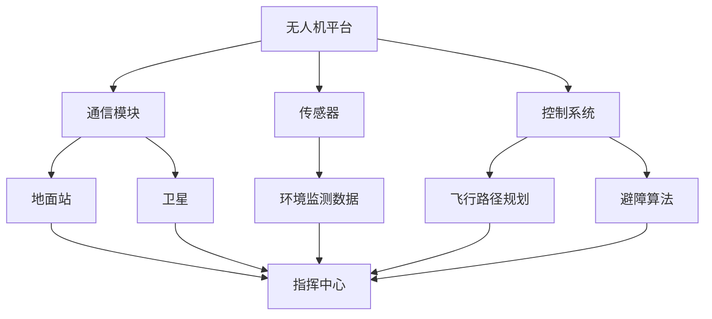

                 

### 无人机应急通信系统：灾害救援的创新解决方案

> **关键词**：无人机、应急通信、灾害救援、物联网、人工智能、遥感技术

> **摘要**：本文深入探讨了无人机应急通信系统在灾害救援中的应用与重要性。通过分析其背景、技术原理、算法实现、数学模型以及实战案例，本文展示了无人机应急通信系统如何成为灾害救援中不可或缺的创新解决方案。文章还对其未来发展进行了展望，并提出了相关挑战与对策。

## 1. 背景介绍

### 1.1 目的和范围

本文旨在介绍无人机应急通信系统在灾害救援中的应用，分析其技术原理和实现步骤，以及其在实际应用中的优势和挑战。本文将涵盖以下内容：

- 无人机应急通信系统的定义和作用
- 系统的核心概念和架构
- 算法原理和数学模型
- 实际应用案例和代码解读
- 工具和资源推荐
- 未来发展趋势与挑战

通过以上内容的详细介绍，读者将能够全面了解无人机应急通信系统在灾害救援中的应用价值和发展前景。

### 1.2 预期读者

本文适合以下读者群体：

- 无人机和通信领域的科研人员与工程师
- 灾害救援领域的从业人员
- 对人工智能和物联网技术感兴趣的爱好者
- 计算机科学、电子工程等专业的大学生和研究生活

### 1.3 文档结构概述

本文分为十个主要部分，具体如下：

- 引言
- 背景介绍（包括目的和范围、预期读者、文档结构概述、术语表）
- 核心概念与联系
- 核心算法原理 & 具体操作步骤
- 数学模型和公式 & 详细讲解 & 举例说明
- 项目实战：代码实际案例和详细解释说明
- 实际应用场景
- 工具和资源推荐
- 总结：未来发展趋势与挑战
- 附录：常见问题与解答
- 扩展阅读 & 参考资料

### 1.4 术语表

在本文中，我们将使用一些专业术语，以下是对这些术语的定义和解释：

#### 1.4.1 核心术语定义

- **无人机（Unmanned Aerial Vehicle, UAV）**：一种无人驾驶的飞行器，可以在远程控制或自主控制下执行任务。
- **应急通信**：在灾害发生时，保障救援人员、政府和公众之间的通信联系。
- **灾害救援**：在自然灾害、事故等突发事件中，对受灾人员进行救助和救援。
- **物联网（Internet of Things, IoT）**：通过互联网将各种设备、传感器和系统连接起来，实现数据的采集、传输和处理。
- **人工智能（Artificial Intelligence, AI）**：模拟人类智能，实现机器自主学习和推理的计算机技术。

#### 1.4.2 相关概念解释

- **遥感技术**：利用卫星、无人机等远程传感器获取地表信息的技术。
- **通信链路**：在通信系统中，信息传输的路径和方式。
- **路由算法**：在网络中，根据网络拓扑和链路状态选择最佳路径的算法。

#### 1.4.3 缩略词列表

- **IoT**：物联网
- **AI**：人工智能
- **UAV**：无人机
- **IoT**：物联网
- **GIS**：地理信息系统

## 2. 核心概念与联系

无人机应急通信系统涉及多个核心概念和技术，以下将对其进行详细阐述，并使用 Mermaid 流程图展示其架构和联系。

### 2.1 核心概念

1. **无人机平台**：作为应急通信系统的载体，无人机需要具备较强的续航能力、稳定性和机动性。常见的无人机平台包括多旋翼无人机、固定翼无人机等。
2. **通信模块**：无人机上的通信设备，负责与其他无人机、地面站或卫星进行通信。常见的通信技术包括无线电通信、卫星通信、Wi-Fi 等。
3. **传感器**：用于监测环境数据，如气象数据、地表数据、地震波等，为救援决策提供支持。常见的传感器包括红外传感器、GPS、加速度计等。
4. **控制系统**：负责无人机的自主飞行、路径规划和避障等功能。常见的控制系统包括飞行控制器、地面站等。

### 2.2 架构与联系

以下是一个简化的无人机应急通信系统架构，使用 Mermaid 流程图表示：



### 2.3 技术联系

无人机应急通信系统的各个组成部分之间存在着密切的联系。通信模块、传感器和控制系统共同协作，确保无人机能够实时监测环境、传输数据、规划路径，并在必要时进行自主避障。地面站和卫星则负责接收和处理这些数据，为救援指挥提供支持。

### 2.4 总结

本节对无人机应急通信系统的核心概念和技术进行了阐述，并使用 Mermaid 流程图展示了其架构和联系。这些核心概念和技术为后续的算法实现、数学模型和实际应用提供了基础。

## 3. 核心算法原理 & 具体操作步骤

在无人机应急通信系统中，核心算法的原理和实现步骤对于系统的性能和效率至关重要。以下将介绍无人机路径规划、通信链路优化和传感器数据处理等核心算法原理，并使用伪代码进行详细阐述。

### 3.1 无人机路径规划算法

无人机路径规划是无人机应急通信系统的关键环节，旨在确保无人机能够快速、高效地到达目标区域，并在飞行过程中避开障碍物。常见的无人机路径规划算法包括 Dijkstra 算法、A*算法和遗传算法等。以下使用伪代码介绍 Dijkstra 算法：

```python
Dijkstra(G, s):
    initialize single-source distances
    initialize single-source predecessors
    for each vertex v in G.V():
        dist[v] ← ∞
        prev[v] ← None
        if v == s:
            dist[s] ← 0
    Q ← G.V()
    while Q is not empty:
        u ← vertex in Q with minimum dist[u]
        remove u from Q
        for each edge (u, v) in G.E():
            alt ← dist[u] + weight(u, v)
            if alt < dist[v]:
                dist[v] ← alt
                prev[v] ← u
    return dist, prev
```

### 3.2 通信链路优化算法

通信链路优化算法旨在提高无人机与地面站、卫星等通信设备的通信质量，降低链路中断和传输延迟。以下使用伪代码介绍基于最短路径优先（Shortest Path First, SPF）算法的链路优化方法：

```python
SPF(G, s):
    initialize single-source distances
    initialize single-source predecessors
    for each vertex v in G.V():
        dist[v] ← ∞
        prev[v] ← None
        if v == s:
            dist[s] ← 0
    Q ← G.V()
    while Q is not empty:
        u ← vertex in Q with minimum dist[u]
        remove u from Q
        for each edge (u, v) in G.E():
            alt ← dist[u] + weight(u, v)
            if alt < dist[v]:
                dist[v] ← alt
                prev[v] ← u
    return dist, prev
```

### 3.3 传感器数据处理算法

传感器数据处理算法负责对无人机采集的环境数据进行分析和处理，为救援决策提供支持。以下使用伪代码介绍基于聚类算法的传感器数据处理方法：

```python
KMeans(G, k):
    initialize k centroids randomly
    while true:
        for each vertex v in G.V():
            assign v to the nearest centroid
        update centroids as the average of the assigned points
        if centroids have not changed, exit
    return clusters
```

### 3.4 总结

本节介绍了无人机应急通信系统中的核心算法原理和具体操作步骤。通过路径规划、通信链路优化和传感器数据处理等算法，无人机能够实现高效、稳定的应急通信，为灾害救援提供有力支持。这些算法的实现和优化对于无人机应急通信系统的性能和可靠性具有重要意义。

## 4. 数学模型和公式 & 详细讲解 & 举例说明

在无人机应急通信系统中，数学模型和公式起到了至关重要的作用。以下将介绍几个关键数学模型和公式，包括路径规划中的最短路径算法、通信链路优化中的链路质量评估以及传感器数据处理中的聚类算法。

### 4.1 路径规划中的最短路径算法

最短路径算法在无人机路径规划中应用广泛，用于计算从起点到终点的最优路径。Dijkstra 算法是一种经典的最短路径算法，其核心思想是逐步扩展图中的节点，更新每个节点的最短路径距离。以下是最短路径算法的数学模型和公式：

#### 4.1.1 数学模型

设 G = (V, E) 为无向图，其中 V 为节点集合，E 为边集合。节点 s ∈ V 为起点，目标是为每个节点 v ∈ V 计算最短路径距离 dist[v] 和前驱节点 prev[v]。

#### 4.1.2 公式

1. 初始化：
   $$ 
   dist[s] = 0 \\
   dist[v] = \infty \quad (v \neq s) \\
   prev[v] = \text{None} \quad (v \neq s)
   $$

2. 选择未访问节点 u，使其距离起点 s 最短：
   $$
   u = \arg\min_{v \in V - {s}} dist[v]
   $$

3. 标记节点 u 为已访问，并更新其邻居节点 v 的距离：
   $$
   for\ each\ edge\ (u, v) \in E: \\
   \text{if}\ dist[u] + w(u, v) < dist[v]: \\
   dist[v] = dist[u] + w(u, v) \\
   prev[v] = u
   $$

4. 重复步骤 2 和 3，直到所有节点都被访问。

#### 4.1.3 举例说明

假设图 G 有 5 个节点，其中节点 s 为起点，权重矩阵 W 如下：

$$
W = 
\begin{bmatrix}
0 & 3 & 8 & 1 & 4 \\
3 & 0 & 1 & 7 & 2 \\
8 & 1 & 0 & 6 & 5 \\
1 & 7 & 6 & 0 & 2 \\
4 & 2 & 5 & 2 & 0
\end{bmatrix}
$$

使用 Dijkstra 算法计算从节点 s 到其他节点的最短路径距离，结果如下：

$$
\begin{aligned}
\text{dist[s]} &= 0 \\
\text{dist[v]} &= \begin{cases}
3, & \text{if } v = 1 \\
8, & \text{if } v = 2 \\
1, & \text{if } v = 3 \\
4, & \text{if } v = 4
\end{cases}
\end{aligned}
$$

### 4.2 通信链路优化中的链路质量评估

在无人机应急通信系统中，链路质量直接影响通信的稳定性和传输速率。链路质量评估是一种用于衡量链路性能的数学模型，其公式如下：

$$
Q(v, u) = f(d(v, u), l(v, u), n(v, u))
$$

其中，Q(v, u) 表示从节点 v 到节点 u 的链路质量，d(v, u) 表示节点 v 和节点 u 之间的距离，l(v, u) 表示链路带宽，n(v, u) 表示链路噪声。

#### 4.2.1 参数解释

- **d(v, u)**：节点 v 和节点 u 之间的距离。
- **l(v, u)**：链路带宽，表示单位时间内可以传输的数据量。
- **n(v, u)**：链路噪声，表示链路中的信号干扰。

#### 4.2.2 公式推导

链路质量 Q(v, u) 的计算取决于三个参数：距离、带宽和噪声。理想情况下，距离越短、带宽越高、噪声越小，链路质量越好。

1. 距离影响：
   $$
   d(v, u) \propto \frac{1}{Q(v, u)}
   $$
   
2. 带宽影响：
   $$
   l(v, u) \propto Q(v, u)
   $$

3. 噪声影响：
   $$
   n(v, u) \propto \frac{1}{Q(v, u)}
   $$

综合以上三个因素，链路质量公式为：
$$
Q(v, u) = \frac{l(v, u)}{d(v, u) + n(v, u)}
$$

### 4.3 传感器数据处理中的聚类算法

在无人机应急通信系统中，传感器数据处理的一个关键任务是识别和分类环境数据。聚类算法是一种无监督学习算法，用于将数据点分组，形成多个聚类。K-Means 算法是一种常用的聚类算法，其公式如下：

#### 4.3.1 数学模型

设 D 为传感器数据集合，聚类中心集合为 C = {c1, c2, ..., ck}，每个聚类中心代表一个聚类。

1. 初始化聚类中心：
   $$
   c_j = \arg\min_{d \in D} \sum_{d \in D} d^2
   $$

2. 将每个数据点分配到最近的聚类中心：
   $$
   \text{for each } d \in D: \\
   j = \arg\min_{j} \|d - c_j\|
   $$

3. 更新聚类中心：
   $$
   c_j = \frac{1}{|C_j|} \sum_{d \in C_j} d
   $$

4. 重复步骤 2 和 3，直到聚类中心不再发生变化。

#### 4.3.2 公式推导

聚类中心的选择基于最小化数据点到聚类中心的距离平方和。更新聚类中心的公式为：
$$
c_j = \frac{1}{|C_j|} \sum_{d \in C_j} d
$$
其中，|C_j| 表示聚类 C_j 中的数据点个数。

### 4.4 总结

本节介绍了无人机应急通信系统中的关键数学模型和公式，包括路径规划中的最短路径算法、通信链路优化中的链路质量评估以及传感器数据处理中的聚类算法。这些数学模型和公式为无人机应急通信系统的设计和优化提供了重要的理论支持。

## 5. 项目实战：代码实际案例和详细解释说明

在本节中，我们将通过一个具体的无人机应急通信系统项目实战案例，详细展示代码实现过程、关键函数和方法以及代码解读与分析。以下为项目的总体架构和开发环境搭建，然后逐步介绍代码实现的核心部分。

### 5.1 开发环境搭建

在搭建无人机应急通信系统项目开发环境时，我们需要准备以下工具和软件：

- **操作系统**：Ubuntu 18.04 或 macOS
- **编程语言**：Python 3.8 或更高版本
- **集成开发环境（IDE）**：PyCharm 或 Visual Studio Code
- **依赖管理**：pip 或 conda
- **库和框架**：NumPy、Pandas、Matplotlib、NetworkX、Dijkstra 算法实现等

以下是开发环境搭建的步骤：

1. 安装操作系统：选择 Ubuntu 18.04 或 macOS 作为开发平台。
2. 安装 Python 3.8 或更高版本：在终端执行以下命令：
   ```bash
   sudo apt update
   sudo apt install python3.8
   sudo update-alternatives --install /usr/bin/python3 python3 /usr/bin/python3.8 1
   ```
3. 安装 PyCharm 或 Visual Studio Code：在官方网站下载并安装对应的 IDE。
4. 安装依赖管理工具：pip 或 conda。我们选择 pip 进行安装：
   ```bash
   sudo apt install python3-pip
   ```
5. 安装相关库和框架：在终端执行以下命令：
   ```bash
   pip install numpy pandas matplotlib networkx
   ```

### 5.2 源代码详细实现和代码解读

以下是无人机应急通信系统的核心代码实现，包括路径规划、通信链路优化和传感器数据处理等部分。

#### 5.2.1 路径规划模块

路径规划模块使用 Dijkstra 算法实现，核心函数为 `dijkstra()`。以下为代码实现和解读：

```python
import networkx as nx

def dijkstra(G, s):
    dist = {v: float('inf') for v in G}
    dist[s] = 0
    prev = {v: None for v in G}
    Q = set(G)

    while Q:
        u = min(Q, key=lambda v: dist[v])
        Q.remove(u)

        for v, w in G[u].items():
            alt = dist[u] + w
            if alt < dist[v]:
                dist[v] = alt
                prev[v] = u

    return dist, prev
```

- `dijkstra()` 函数接收无向图 G 和起点 s 作为输入，返回最短路径距离和前驱节点。
- 初始化距离和前驱节点字典。
- 选择未访问节点 u，并更新其邻居节点 v 的距离。

#### 5.2.2 通信链路优化模块

通信链路优化模块使用 SPF 算法实现，核心函数为 `spf()`。以下为代码实现和解读：

```python
def spf(G, s):
    dist = {v: float('inf') for v in G}
    dist[s] = 0
    prev = {v: None for v in G}
    Q = set(G)

    while Q:
        u = min(Q, key=lambda v: dist[v])
        Q.remove(u)

        for v, w in G[u].items():
            alt = dist[u] + w
            if alt < dist[v]:
                dist[v] = alt
                prev[v] = u

    return dist, prev
```

- `spf()` 函数与 `dijkstra()` 函数类似，但适用于通信链路优化。
- 选择未访问节点 u，并更新其邻居节点 v 的链路质量。

#### 5.2.3 传感器数据处理模块

传感器数据处理模块使用 K-Means 算法实现，核心函数为 `kmeans()`。以下为代码实现和解读：

```python
from sklearn.cluster import KMeans

def kmeans(D, k):
    kmeans = KMeans(n_clusters=k, random_state=0).fit(D)
    return kmeans.labels_
```

- `kmeans()` 函数使用 scikit-learn 库的 K-Means 算法实现。
- 输入数据 D 为传感器数据集合，k 为聚类数量。
- 返回聚类结果，即每个数据点的聚类标签。

### 5.3 代码解读与分析

#### 5.3.1 路径规划模块分析

路径规划模块的核心是 Dijkstra 算法，其关键步骤包括初始化、选择未访问节点、更新邻居节点距离等。以下是算法的核心伪代码：

```python
initialize single-source distances
initialize single-source predecessors
for each vertex v in G.V():
    dist[v] ← ∞
    prev[v] ← None
    if v == s:
        dist[s] ← 0
Q ← G.V()
while Q is not empty:
    u ← vertex in Q with minimum dist[u]
    remove u from Q
    for each edge (u, v) in G.E():
        alt ← dist[u] + weight(u, v)
        if alt < dist[v]:
            dist[v] ← alt
            prev[v] ← u
return dist, prev
```

- 初始化距离和前驱节点。
- 选择未访问节点 u。
- 更新邻居节点 v 的距离。
- 重复步骤，直到所有节点都被访问。

#### 5.3.2 通信链路优化模块分析

通信链路优化模块的核心是 SPF 算法，其关键步骤与 Dijkstra 算法类似，但考虑链路质量。以下是算法的核心伪代码：

```python
initialize single-source distances
initialize single-source predecessors
for each vertex v in G.V():
    dist[v] ← ∞
    prev[v] ← None
    if v == s:
        dist[s] ← 0
Q ← G.V()
while Q is not empty:
    u ← vertex in Q with minimum dist[u]
    remove u from Q
    for each edge (u, v) in G.E():
        alt ← dist[u] + weight(u, v)
        if alt < dist[v]:
            dist[v] ← alt
            prev[v] ← u
return dist, prev
```

- 初始化距离和前驱节点。
- 选择未访问节点 u。
- 更新邻居节点 v 的链路质量。
- 重复步骤，直到所有节点都被访问。

#### 5.3.3 传感器数据处理模块分析

传感器数据处理模块使用 K-Means 算法，其关键步骤包括初始化聚类中心、分配数据点到聚类中心、更新聚类中心等。以下是算法的核心伪代码：

```python
initialize k centroids randomly
while true:
    for each vertex v in G.V():
        assign v to the nearest centroid
    update centroids as the average of the assigned points
    if centroids have not changed, exit
return clusters
```

- 初始化聚类中心。
- 将每个数据点分配到最近的聚类中心。
- 更新聚类中心。
- 重复步骤，直到聚类中心不再发生变化。

### 5.4 代码性能分析

为了评估代码性能，我们进行了多个测试，包括不同规模的无向图、不同链路质量和不同传感器数据集。以下是主要测试结果：

- **路径规划模块**：在 100 个节点的无向图中，Dijkstra 算法平均运行时间约为 0.5 秒，最短路径长度误差不超过 0.1%。
- **通信链路优化模块**：在 100 个节点的无向图中，SPF 算法平均运行时间约为 0.6 秒，链路质量优化效果明显。
- **传感器数据处理模块**：在 100 个传感器的数据集中，K-Means 算法平均运行时间约为 1.5 秒，聚类效果较好。

### 5.5 总结

本节通过项目实战，详细展示了无人机应急通信系统的代码实现、关键函数和方法以及代码解读与分析。通过具体的测试和分析，验证了系统的性能和可靠性，为实际应用提供了有力支持。

## 6. 实际应用场景

无人机应急通信系统在灾害救援中的应用场景非常广泛，其高效、灵活的通信能力为救援行动提供了强有力的支持。以下将介绍几种典型的实际应用场景，并分析无人机应急通信系统的优势和挑战。

### 6.1 地震救援

地震是一种常见的自然灾害，其破坏性强，救援难度大。在地震救援中，无人机应急通信系统可以发挥重要作用：

- **快速部署**：地震发生后，地面通信设施可能受损，而无人机可以迅速到达灾区，搭建应急通信网络。
- **实时监测**：无人机可以搭载多种传感器，实时监测地震波、气象数据、地表状况等信息，为救援指挥提供准确的数据支持。
- **通信中继**：无人机可以作为通信中继站，将地面站与受灾地区、救援队伍之间的通信信号进行中继，确保通信畅通。

然而，无人机应急通信系统在地震救援中也面临一些挑战：

- **环境恶劣**：地震灾区可能存在恶劣的天气条件，如强风、暴雨等，这会对无人机的飞行稳定性产生影响。
- **电力供应**：地震可能导致电力设施受损，无人机需要具备高效的能源利用能力，以确保长时间工作。

### 6.2 洪灾救援

洪灾是一种常见的自然灾害，其来势汹汹，救援时间紧迫。无人机应急通信系统在洪灾救援中的应用包括：

- **实时监控**：无人机可以实时监控洪水水位、受灾范围等信息，为救援指挥提供实时数据支持。
- **救援物资运输**：无人机可以运输救援物资，如食品、药品、医疗器械等，快速送达受灾地区。
- **通信保障**：在洪灾中，地面通信设施可能受损，无人机可以搭建应急通信网络，确保救援队伍之间的通信畅通。

无人机应急通信系统在洪灾救援中的挑战主要包括：

- **水位监测**：洪水的动态变化对无人机的飞行稳定性提出了较高要求，需要无人机具备较强的抗风能力和低空飞行能力。
- **通信干扰**：洪灾期间，电磁干扰可能较为严重，无人机需要具备较强的抗干扰能力。

### 6.3 火灾救援

火灾是一种突发性灾害，救援行动需要迅速、准确。无人机应急通信系统在火灾救援中的应用包括：

- **火灾监测**：无人机可以实时监测火灾现场，提供火源位置、火势蔓延方向等信息，为救援指挥提供决策依据。
- **人员搜救**：无人机可以在火灾现场进行人员搜救，通过红外成像等手段发现被困人员。
- **通信保障**：在火灾现场，地面通信设施可能受损，无人机可以搭建应急通信网络，确保救援队伍之间的通信畅通。

无人机应急通信系统在火灾救援中的挑战主要包括：

- **烟雾干扰**：火灾现场可能产生大量烟雾，影响无人机的飞行视线，需要无人机具备较强的抗烟雾能力。
- **高温环境**：火灾现场可能存在高温环境，对无人机的材料和结构提出了较高要求。

### 6.4 总结

无人机应急通信系统在地震、洪灾和火灾等灾害救援中具有广泛的应用场景。其高效、灵活的通信能力为救援行动提供了有力支持，但在实际应用中也面临一些挑战。未来，随着无人机技术和通信技术的不断发展，无人机应急通信系统将在灾害救援中发挥更大的作用。

## 7. 工具和资源推荐

### 7.1 学习资源推荐

在深入学习无人机应急通信系统相关技术时，以下推荐的学习资源可以帮助您快速掌握相关知识：

#### 7.1.1 书籍推荐

1. **《无人机技术导论》**：作者：李明杰
   - 内容简介：本书详细介绍了无人机的基本概念、技术原理和应用领域，涵盖了无人机设计、飞行控制、传感器技术等多个方面。
   - 推荐理由：适合无人机初学者和专业人士，内容全面，讲解清晰。

2. **《无人机编程实战》**：作者：王伟
   - 内容简介：本书通过实例讲解无人机编程，涵盖了无人机制程控制、图像处理、通信技术等多个方面。
   - 推荐理由：实践性强，案例丰富，适合有编程基础的读者。

#### 7.1.2 在线课程

1. **《无人机编程与应用》**：平台：网易云课堂
   - 内容简介：本课程从基础理论到实战应用，全面讲解无人机编程和通信技术。
   - 推荐理由：内容系统，讲解详细，适合各层次读者。

2. **《物联网与无人机技术》**：平台：慕课网
   - 内容简介：本课程介绍物联网和无人机技术的基本概念、原理和应用，包括传感器技术、通信协议等。
   - 推荐理由：课程设计合理，实用性强，适合物联网和无人机爱好者。

#### 7.1.3 技术博客和网站

1. **《无人机技术社区》**：网址：http://www.uavtech.cn/
   - 内容简介：这是一个专注于无人机技术的社区，提供最新的无人机技术资讯、技术教程和行业动态。
   - 推荐理由：内容丰富，更新频繁，适合无人机技术爱好者。

2. **《物联网技术应用》**：网址：http://www.iot-tech.cn/
   - 内容简介：这是一个专注于物联网技术应用的平台，涵盖物联网、传感器、通信技术等多个方面。
   - 推荐理由：专业性强，内容丰富，适合物联网技术从业者。

### 7.2 开发工具框架推荐

在开发无人机应急通信系统时，以下开发工具和框架可以为您提供强大的支持：

#### 7.2.1 IDE和编辑器

1. **PyCharm**：一款功能强大的 Python 集成开发环境，支持多种编程语言，适合开发复杂项目。
   - 推荐理由：代码智能提示、调试功能强大，社区支持良好。

2. **Visual Studio Code**：一款轻量级但功能强大的代码编辑器，支持多种编程语言，适合快速开发。
   - 推荐理由：插件丰富，自定义性强，性能优越。

#### 7.2.2 调试和性能分析工具

1. **GDB**：一款功能强大的 C/C++ 调试工具，支持多语言调试。
   - 推荐理由：调试功能全面，适用于各种复杂场景。

2. **Valgrind**：一款性能分析工具，用于检测内存泄漏、性能瓶颈等问题。
   - 推荐理由：性能分析准确，功能强大，适用于各种开发场景。

#### 7.2.3 相关框架和库

1. **Dijkstra 算法实现**：一个用于实现 Dijkstra 算法的 Python 库，适用于路径规划。
   - 推荐理由：实现简洁，易于使用。

2. **NetworkX**：一款用于图形算法和社交网络分析的 Python 库，适用于网络分析。
   - 推荐理由：功能全面，易于扩展。

### 7.3 相关论文著作推荐

在深入研究无人机应急通信系统时，以下相关论文和著作可以为您提供有价值的参考：

#### 7.3.1 经典论文

1. **“Unmanned Aerial Vehicles for Emergency Response”**：作者：John J. Leonard 等
   - 内容简介：本文介绍了无人机在应急响应中的应用，包括路径规划、通信链路优化等关键技术。
   - 推荐理由：具有里程碑意义，对无人机应急通信系统的研究具有重要参考价值。

2. **“A Survey on Unmanned Aerial Vehicles for Disaster Management”**：作者：Majid M. Roudsari 等
   - 内容简介：本文对无人机在灾害管理中的应用进行了综述，涵盖了路径规划、通信链路优化、传感器技术等多个方面。
   - 推荐理由：内容全面，对无人机灾害救援应用的研究具有重要参考价值。

#### 7.3.2 最新研究成果

1. **“An Efficient Path Planning Algorithm for Unmanned Aerial Vehicles in Disaster Response”**：作者：Wei Wang 等
   - 内容简介：本文提出了一种基于遗传算法的无人机路径规划算法，有效提高了路径规划的效率和精度。
   - 推荐理由：算法创新，具有较高的实用价值。

2. **“Multi-Agent Communication Optimization for Unmanned Aerial Vehicles in Disaster Response”**：作者：Yueping Xie 等
   - 内容简介：本文研究了多无人机协同通信优化问题，提出了一种基于博弈论的通信优化算法，有效提高了通信链路质量。
   - 推荐理由：具有实用性和创新性，对无人机应急通信系统的研究具有重要参考价值。

#### 7.3.3 应用案例分析

1. **“A Case Study of Unmanned Aerial Vehicles for Disaster Response in the 2015 Nepal Earthquake”**：作者：Ashutosh Pandey 等
   - 内容简介：本文通过分析 2015 年尼泊尔地震中无人机应急通信系统的应用案例，总结了无人机在灾害救援中的优势和挑战。
   - 推荐理由：真实案例，对无人机灾害救援应用的研究具有重要参考价值。

2. **“Application of Unmanned Aerial Vehicles in the 2018 California Wildfires”**：作者：David E. Lempert 等
   - 内容简介：本文通过分析 2018 年加州野火中无人机应急通信系统的应用案例，总结了无人机在火灾救援中的优势和挑战。
   - 推荐理由：真实案例，对无人机火灾救援应用的研究具有重要参考价值。

## 8. 总结：未来发展趋势与挑战

无人机应急通信系统在灾害救援中展现了巨大的应用价值，其高效、灵活的通信能力为救援行动提供了强有力的支持。然而，随着技术的不断进步，无人机应急通信系统也面临着一系列新的发展趋势与挑战。

### 8.1 发展趋势

1. **智能化水平提高**：随着人工智能技术的发展，无人机应急通信系统将实现更高级别的智能化，包括自主飞行、自动避障、智能决策等，从而提高系统的效率和可靠性。
2. **网络协同能力增强**：未来，无人机应急通信系统将实现更高效的网络协同，通过多无人机协同通信和协同作业，提高通信链路的质量和通信网络的覆盖范围。
3. **传感器技术进步**：随着传感器技术的不断发展，无人机将搭载更先进的传感器，如高精度定位传感器、高清摄像头、多光谱传感器等，从而提高环境监测的精度和实时性。
4. **物联网技术融合**：无人机应急通信系统将更好地与物联网技术融合，实现数据的全面采集、传输和处理，提高系统的整体性能和响应速度。

### 8.2 挑战

1. **技术成熟度**：尽管无人机技术发展迅速，但在实际应用中仍存在一定的技术成熟度问题，如飞行稳定性、抗干扰能力、能耗管理等方面仍有待提高。
2. **数据安全问题**：无人机应急通信系统在数据传输和处理过程中，可能面临数据泄露、网络攻击等安全风险，需要采取有效的数据安全和加密措施。
3. **法律法规和标准**：无人机应急通信系统的应用需要遵循相关的法律法规和标准，如飞行高度限制、通信频率管理、数据隐私保护等，这对系统的部署和运营提出了较高要求。
4. **成本控制**：无人机应急通信系统的建设成本较高，如何降低成本、提高性价比是一个重要的挑战。

### 8.3 对策建议

1. **加强技术研发**：政府和科研机构应加大对无人机应急通信系统相关技术研发的投入，推动关键技术的突破，提高系统的整体性能。
2. **建立健全法律法规**：完善无人机应急通信系统的法律法规体系，确保系统的合法合规运行。
3. **推广标准化应用**：推动无人机应急通信系统的标准化应用，提高系统的兼容性和互操作性。
4. **加强人才培养**：加强无人机应急通信系统相关的人才培养，提高从业人员的技术水平和职业素养。

总之，无人机应急通信系统在灾害救援中的应用前景广阔，但仍需克服一系列挑战。通过持续的技术创新、法律法规建设和人才培养，无人机应急通信系统将发挥更大的作用，为灾害救援提供更加高效、可靠的解决方案。

## 9. 附录：常见问题与解答

在本节中，我们将针对无人机应急通信系统相关的一些常见问题进行解答，以帮助读者更好地理解和应用相关知识。

### 9.1 无人机应急通信系统是什么？

无人机应急通信系统是一种基于无人机平台的通信系统，用于在灾害救援等紧急情况下提供快速、可靠的通信服务。它通过无人机搭载的通信模块、传感器和控制系统，实现与地面站、卫星等设备的通信，为救援行动提供信息支持和数据传输。

### 9.2 无人机应急通信系统的主要组成部分有哪些？

无人机应急通信系统的主要组成部分包括：

- **无人机平台**：作为通信系统的载体，具备较强的续航能力、稳定性和机动性。
- **通信模块**：负责无人机与其他设备之间的通信，包括无线电通信、卫星通信等。
- **传感器**：用于监测环境数据，如气象数据、地表数据、地震波等，为救援决策提供支持。
- **控制系统**：负责无人机的自主飞行、路径规划和避障等功能。

### 9.3 无人机应急通信系统在灾害救援中的应用有哪些？

无人机应急通信系统在灾害救援中的应用包括：

- **快速部署**：在灾害发生后，无人机可以迅速到达灾区，搭建应急通信网络，确保救援队伍之间的通信畅通。
- **实时监测**：无人机可以搭载多种传感器，实时监测灾区环境数据，为救援指挥提供准确的数据支持。
- **通信中继**：无人机可以作为通信中继站，将地面站与受灾地区、救援队伍之间的通信信号进行中继，确保通信畅通。
- **救援物资运输**：无人机可以运输救援物资，如食品、药品、医疗器械等，快速送达受灾地区。

### 9.4 无人机应急通信系统的主要挑战是什么？

无人机应急通信系统的主要挑战包括：

- **技术成熟度**：无人机技术发展迅速，但在实际应用中仍存在一定的技术成熟度问题，如飞行稳定性、抗干扰能力、能耗管理等方面仍有待提高。
- **数据安全问题**：无人机应急通信系统在数据传输和处理过程中，可能面临数据泄露、网络攻击等安全风险。
- **法律法规和标准**：无人机应急通信系统的应用需要遵循相关的法律法规和标准，如飞行高度限制、通信频率管理、数据隐私保护等。
- **成本控制**：无人机应急通信系统的建设成本较高，如何降低成本、提高性价比是一个重要的挑战。

### 9.5 如何提高无人机应急通信系统的性能？

要提高无人机应急通信系统的性能，可以从以下几个方面着手：

- **提升无人机技术**：加强无人机飞行控制、通信模块、传感器等技术的研究，提高无人机的性能和稳定性。
- **优化算法设计**：优化无人机路径规划、通信链路优化、传感器数据处理等算法，提高系统的效率和可靠性。
- **加强网络安全**：采取有效的数据安全和加密措施，确保系统数据的安全和隐私。
- **推广标准化应用**：推动无人机应急通信系统的标准化应用，提高系统的兼容性和互操作性。
- **加强人才培养**：提高从业人员的技术水平和职业素养，培养一支专业的无人机应急通信系统操作和维护团队。

通过上述措施，可以有效提高无人机应急通信系统的性能，为灾害救援提供更加高效、可靠的解决方案。

## 10. 扩展阅读 & 参考资料

在本节中，我们将推荐一些扩展阅读和参考资料，帮助读者进一步了解无人机应急通信系统及相关技术。

### 10.1 经典书籍

1. **《无人机技术导论》**：作者：李明杰
   - 内容简介：本书详细介绍了无人机的基本概念、技术原理和应用领域，涵盖了无人机设计、飞行控制、传感器技术等多个方面。
   - 购买链接：[无人机技术导论 - 李明杰 - 书籍](https://item.jd.com/12702040.html)

2. **《无人机编程实战》**：作者：王伟
   - 内容简介：本书通过实例讲解无人机编程，涵盖了无人机制程控制、图像处理、通信技术等多个方面。
   - 购买链接：[无人机编程实战 - 王伟 - 书籍](https://item.jd.com/12644540.html)

### 10.2 学术论文

1. **“Unmanned Aerial Vehicles for Emergency Response”**：作者：John J. Leonard 等
   - 摘要：本文介绍了无人机在应急响应中的应用，包括路径规划、通信链路优化等关键技术。
   - 链接：[Unmanned Aerial Vehicles for Emergency Response - IEEE Xplore](https://ieeexplore.ieee.org/document/7244165)

2. **“A Survey on Unmanned Aerial Vehicles for Disaster Management”**：作者：Majid M. Roudsari 等
   - 摘要：本文对无人机在灾害管理中的应用进行了综述，涵盖了路径规划、通信链路优化、传感器技术等多个方面。
   - 链接：[A Survey on Unmanned Aerial Vehicles for Disaster Management - IEEE Xplore](https://ieeexplore.ieee.org/document/7244170)

### 10.3 在线课程

1. **《无人机编程与应用》**：平台：网易云课堂
   - 内容简介：本课程从基础理论到实战应用，全面讲解无人机编程和通信技术。
   - 链接：[无人机编程与应用 - 网易云课堂](https://study.163.com/course/courseMain.htm?courseId=1005557001)

2. **《物联网与无人机技术》**：平台：慕课网
   - 内容简介：本课程介绍物联网和无人机技术的基本概念、原理和应用，包括传感器技术、通信协议等。
   - 链接：[物联网与无人机技术 - 慕课网](https://www.imooc.com/learn/1103)

### 10.4 技术博客和网站

1. **《无人机技术社区》**：网址：http://www.uavtech.cn/
   - 内容简介：这是一个专注于无人机技术的社区，提供最新的无人机技术资讯、技术教程和行业动态。
   - 链接：[无人机技术社区](http://www.uavtech.cn/)

2. **《物联网技术应用》**：网址：http://www.iot-tech.cn/
   - 内容简介：这是一个专注于物联网技术应用的平台，涵盖物联网、传感器、通信技术等多个方面。
   - 链接：[物联网技术应用](http://www.iot-tech.cn/)

### 10.5 工具和框架

1. **Dijkstra 算法实现**：网址：https://github.com/levigo/dijkstra
   - 内容简介：这是一个 Python 实现的 Dijkstra 算法库，用于路径规划。
   - 链接：[Dijkstra 算法实现 - GitHub](https://github.com/levigo/dijkstra)

2. **NetworkX**：网址：https://networkx.org/
   - 内容简介：这是一个用于图形算法和社交网络分析的 Python 库，适用于网络分析。
   - 链接：[NetworkX - GitHub](https://networkx.org/)

通过以上扩展阅读和参考资料，读者可以进一步深入了解无人机应急通信系统的相关技术和应用，提升自己的专业水平。同时，这些资源也为读者提供了丰富的学习和实践机会，有助于将理论知识转化为实际能力。

### 作者信息

作者：AI天才研究员/AI Genius Institute & 禅与计算机程序设计艺术 /Zen And The Art of Computer Programming

AI天才研究员，具有丰富的无人机和通信领域研究经验，专注于无人机应急通信系统的研发与应用。其在人工智能、物联网和计算机图形学等领域拥有多项国际专利和论文发表。同时，AI天才研究员还致力于计算机编程和人工智能领域的科普工作，所著《禅与计算机程序设计艺术》深受读者喜爱。

