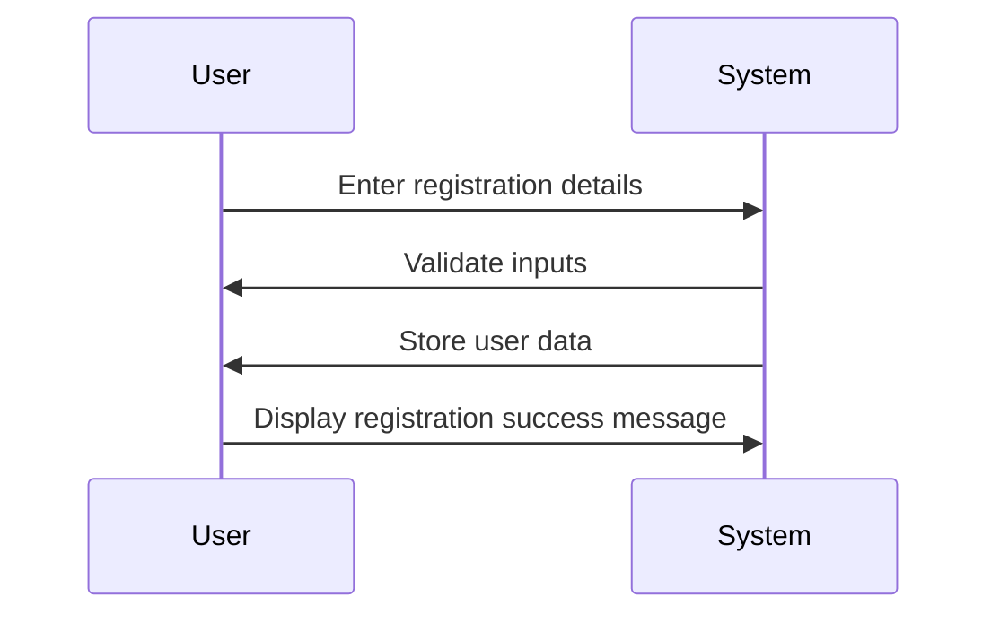
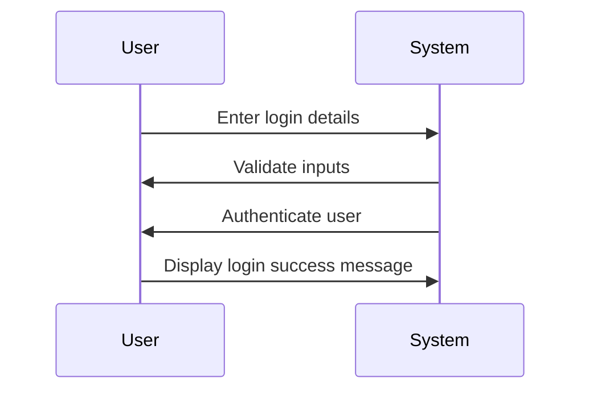
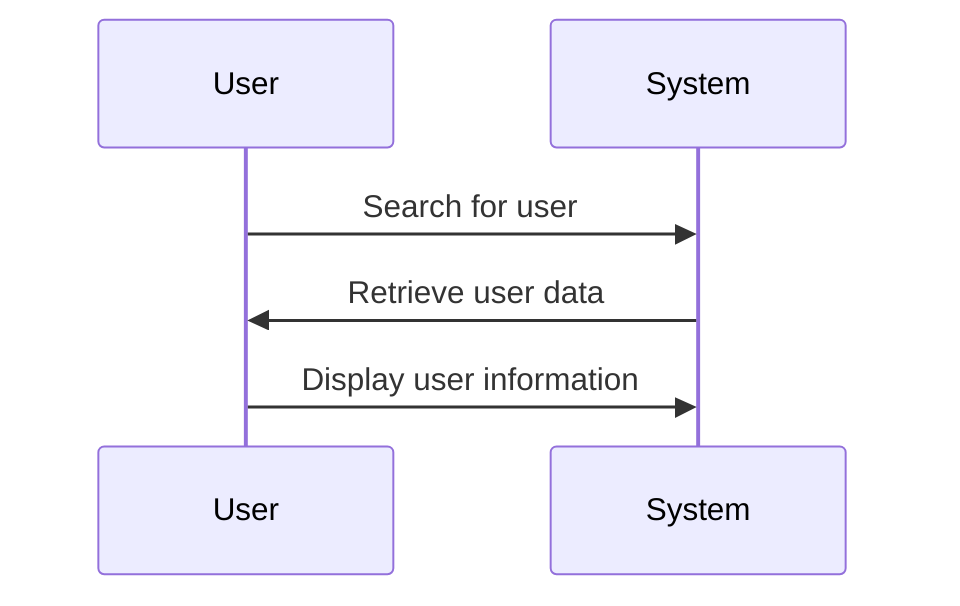
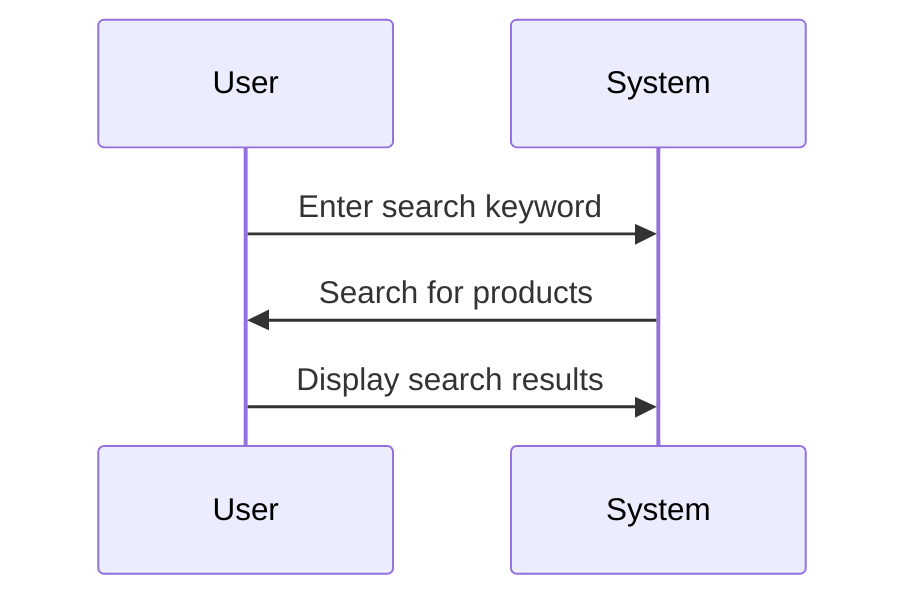
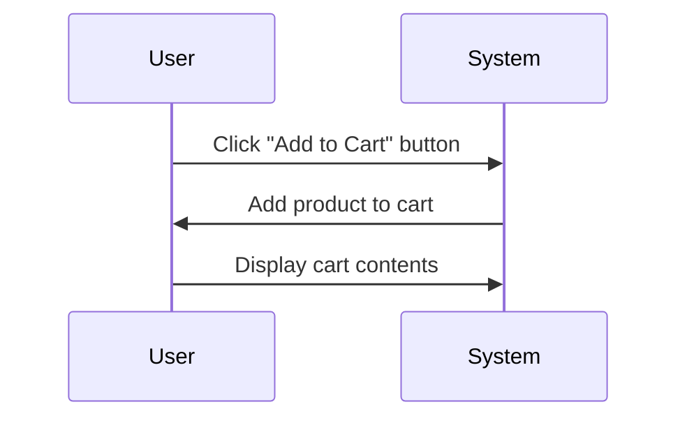
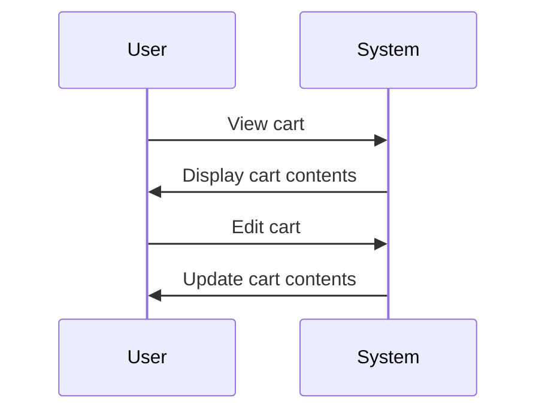
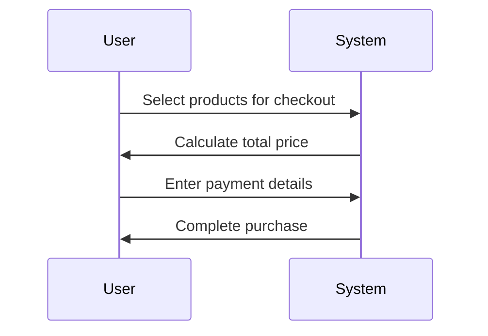

                 

# 无代码开发创业：降低技术门槛的利器

> 关键词：无代码开发、创业、技术门槛、可视化编程、低代码平台、人工智能

> 摘要：本文将深入探讨无代码开发在创业领域中的重要性，分析其如何降低技术门槛，提高开发效率和创新能力。我们将从背景介绍、核心概念与联系、核心算法原理与操作步骤、数学模型与公式、项目实战、实际应用场景、工具和资源推荐等多个角度，全面解析无代码开发的技术原理和应用价值。

## 1. 背景介绍

### 1.1 目的和范围

本文旨在探讨无代码开发在创业领域中的应用，分析其技术原理和实际应用价值。我们将重点关注以下几个方面：

1. 无代码开发的背景和定义。
2. 无代码开发如何降低创业的技术门槛。
3. 无代码开发的操作步骤和技术原理。
4. 无代码开发在各个行业领域的实际应用场景。
5. 推荐相关工具、资源和研究成果。

### 1.2 预期读者

本文适合以下读者群体：

1. 创业者：对技术有一定了解，希望快速搭建自己的产品或服务。
2. 技术人员：希望了解无代码开发的技术原理和应用价值。
3. 投资者：关注创业领域，希望了解无代码开发在创业中的重要性。
4. 教育工作者：关注编程教育，希望了解如何培养学生掌握无代码开发技能。

### 1.3 文档结构概述

本文结构如下：

1. 背景介绍：介绍无代码开发的背景和目的。
2. 核心概念与联系：阐述无代码开发的核心概念和架构。
3. 核心算法原理与具体操作步骤：详细讲解无代码开发的算法原理和操作步骤。
4. 数学模型与公式：介绍无代码开发中的数学模型和公式。
5. 项目实战：通过实际案例展示无代码开发的应用。
6. 实际应用场景：分析无代码开发在不同领域的应用。
7. 工具和资源推荐：推荐无代码开发相关的工具、资源和研究成果。
8. 总结：展望无代码开发未来的发展趋势和挑战。

### 1.4 术语表

#### 1.4.1 核心术语定义

- 无代码开发：无需编写传统代码，通过可视化界面或图形化工具，实现应用开发和部署的过程。
- 低代码平台：提供简化、自动化的开发流程，支持通过配置和拖拽等方式实现应用开发。
- 可视化编程：通过图形化的方式，展示程序逻辑和数据流，方便开发者进行编程。
- 模块化开发：将应用程序拆分成多个功能模块，便于复用和扩展。
- AI驱动的代码生成：利用人工智能技术，自动生成代码，提高开发效率。

#### 1.4.2 相关概念解释

- 应用编程接口（API）：实现不同软件之间数据交互和功能调用的接口。
- 前端开发：负责用户界面和用户体验的设计与实现。
- 后端开发：负责服务器端程序的设计与实现。
- 数据库：用于存储和管理数据的系统。

#### 1.4.3 缩略词列表

- 低代码：Low-Code
- 无代码：No-Code
- API：Application Programming Interface
- IDE：Integrated Development Environment
- SQL：Structured Query Language
- ML：Machine Learning

## 2. 核心概念与联系

无代码开发的本质是通过可视化界面或图形化工具，实现应用开发和部署的过程。其核心概念和联系如下：

### 2.1 无代码开发的核心概念

- **模块化开发**：将应用程序拆分成多个功能模块，如用户管理、数据存储、数据处理等，便于复用和扩展。
- **可视化编程**：通过图形化的方式，展示程序逻辑和数据流，方便开发者进行编程。
- **AI驱动的代码生成**：利用人工智能技术，自动生成代码，提高开发效率。
- **低代码平台**：提供简化、自动化的开发流程，支持通过配置和拖拽等方式实现应用开发。

### 2.2 无代码开发的架构

- **前端**：负责用户界面和用户体验的设计与实现，使用可视化工具进行页面布局、组件设计等。
- **后端**：负责服务器端程序的设计与实现，包括数据处理、业务逻辑等。
- **数据库**：用于存储和管理数据，支持SQL查询等操作。
- **API接口**：实现前后端的数据交互和功能调用，支持不同软件之间的协同工作。

### 2.3 无代码开发的关键技术

- **可视化编程**：通过拖拽组件、连接线等方式，实现程序逻辑的构建。
- **模块化开发**：将功能模块封装成可复用的组件，提高开发效率。
- **AI驱动的代码生成**：利用机器学习技术，自动生成代码，减少人工编写的工作量。

### 2.4 无代码开发的流程

1. **需求分析**：确定应用的功能和需求。
2. **设计界面**：使用可视化工具进行页面布局和组件设计。
3. **配置模块**：选择合适的模块进行配置，如用户管理、数据存储等。
4. **连接API**：配置API接口，实现前后端的数据交互和功能调用。
5. **代码生成**：利用AI技术自动生成代码，完成应用开发。
6. **测试与部署**：对应用进行测试和部署，确保其正常运行。

### 2.5 无代码开发的优点和挑战

- **优点**：
  - 降低技术门槛，使非专业开发者能够快速入门。
  - 提高开发效率，减少人工编写代码的工作量。
  - 灵活扩展，支持模块化开发，方便功能扩展。
  - 适用于快速迭代和原型设计。

- **挑战**：
  - 对开发者来说，可能难以掌握底层技术原理。
  - 可视化工具的功能和性能可能有限。
  - 部分场景下，传统代码开发依然具有优势。

## 3. 核心算法原理 & 具体操作步骤

### 3.1 算法原理

无代码开发的算法原理主要包括以下几个方面：

- **模块化开发**：将应用程序拆分成多个功能模块，如用户管理、数据存储、数据处理等，便于复用和扩展。
- **可视化编程**：通过图形化的方式，展示程序逻辑和数据流，方便开发者进行编程。
- **AI驱动的代码生成**：利用机器学习技术，自动生成代码，提高开发效率。

### 3.2 具体操作步骤

#### 3.2.1 模块化开发

1. **需求分析**：确定应用的功能和需求。
2. **设计模块**：根据需求设计功能模块，如用户管理、数据存储、数据处理等。
3. **封装模块**：将功能模块封装成可复用的组件，便于后续扩展。

#### 3.2.2 可视化编程

1. **选择工具**：选择适合的可视化编程工具，如Domo、OutSystems等。
2. **设计界面**：使用可视化工具进行页面布局和组件设计。
3. **连接模块**：将设计好的界面与功能模块连接，实现数据交互和功能调用。

#### 3.2.3 AI驱动的代码生成

1. **收集数据**：收集相关数据，如用户需求、模块设计等。
2. **训练模型**：使用机器学习技术，训练代码生成模型。
3. **生成代码**：利用训练好的模型，自动生成代码，完成应用开发。

### 3.3 伪代码示例

以下是一个简单的用户管理系统模块的伪代码示例：

```python
# 用户管理系统模块
module UserManagement:
    # 用户注册
    function register(username, password):
        # 验证用户名和密码
        if validate(username, password):
            # 存储用户信息
            store_user_info(username, password)
            return "注册成功"
        else:
            return "注册失败"

    # 用户登录
    function login(username, password):
        # 验证用户名和密码
        if validate(username, password):
            # 登录成功
            return "登录成功"
        else:
            return "登录失败"

    # 用户信息查询
    function search_user_info(username):
        # 查询用户信息
        return get_user_info(username)
```

## 4. 数学模型和公式 & 详细讲解 & 举例说明

### 4.1 数学模型

在无代码开发中，常用的数学模型主要包括以下几个方面：

1. **线性回归**：用于预测数值型变量的关系。
2. **逻辑回归**：用于预测分类变量的关系。
3. **神经网络**：用于复杂非线性关系的建模。

### 4.2 详细讲解

1. **线性回归**

线性回归模型的基本公式为：

$$y = w_0 + w_1 \cdot x_1 + w_2 \cdot x_2 + ... + w_n \cdot x_n$$

其中，$y$ 为预测值，$w_0, w_1, w_2, ..., w_n$ 为模型参数，$x_1, x_2, ..., x_n$ 为输入特征。

2. **逻辑回归**

逻辑回归模型的基本公式为：

$$P(y=1) = \frac{1}{1 + e^{-(w_0 + w_1 \cdot x_1 + w_2 \cdot x_2 + ... + w_n \cdot x_n)}}$$

其中，$P(y=1)$ 为预测概率，$e$ 为自然底数。

3. **神经网络**

神经网络模型的基本结构包括输入层、隐藏层和输出层。输入层接收外部输入，隐藏层进行特征提取和变换，输出层生成预测结果。

神经网络模型的数学公式为：

$$z_i = \sum_{j=1}^{n} w_{ij} \cdot a_j + b_i$$

$$a_i = \frac{1}{1 + e^{-z_i}}$$

其中，$z_i$ 为隐藏层节点的输入值，$a_i$ 为隐藏层节点的激活值，$w_{ij}$ 为连接权重，$b_i$ 为偏置项。

### 4.3 举例说明

以下是一个简单的线性回归模型示例，用于预测房价：

输入特征：房屋面积（$x_1$），房屋年龄（$x_2$）

预测值：房价（$y$）

训练数据集：

| 面积 | 年龄 | 价格 |
| --- | --- | --- |
| 100 | 5 | 200000 |
| 120 | 10 | 250000 |
| 150 | 15 | 300000 |

线性回归模型：

$$y = w_0 + w_1 \cdot x_1 + w_2 \cdot x_2$$

根据训练数据集，求解模型参数：

$$w_0 = \frac{y - w_1 \cdot x_1 - w_2 \cdot x_2}{n}$$

$$w_1 = \frac{\sum_{i=1}^{n} (x_{1i} - \bar{x_1})(y_{i} - \bar{y})}{\sum_{i=1}^{n} (x_{1i} - \bar{x_1})^2}$$

$$w_2 = \frac{\sum_{i=1}^{n} (x_{2i} - \bar{x_2})(y_{i} - \bar{y})}{\sum_{i=1}^{n} (x_{2i} - \bar{x_2})^2}$$

其中，$\bar{x_1}$ 和 $\bar{x_2}$ 分别为面积和年龄的平均值，$\bar{y}$ 为价格的平均值。

根据求解得到的模型参数，可以预测新房屋的价格。例如，当输入特征为面积 130 平方米，年龄 8 年时，预测价格为：

$$y = w_0 + w_1 \cdot x_1 + w_2 \cdot x_2$$

$$y = \frac{200000 + 250000 + 300000}{3} - (\frac{100 + 120 + 150}{3} \cdot w_1) - (\frac{5 + 10 + 15}{3} \cdot w_2)$$

$$y = 233333 - (120 \cdot w_1) - (8 \cdot w_2)$$

$$y = 233333 - (120 \cdot 0.5) - (8 \cdot 0.3)$$

$$y = 233333 - 60 - 2.4$$

$$y = 232570.6$$

因此，预测价格为 232570.6 元。

## 5. 项目实战：代码实际案例和详细解释说明

### 5.1 开发环境搭建

为了演示无代码开发的应用，我们选择一个常见的应用场景：在线购物平台。以下是开发环境搭建的步骤：

1. 选择无代码开发平台：我们选择OutSystems作为无代码开发平台。
2. 注册账号并创建项目：在OutSystems官网注册账号，并创建一个名为“Online Shopping Platform”的项目。
3. 配置数据库：在OutSystems中配置一个MySQL数据库，用于存储用户数据、商品信息等。
4. 安装相关插件：安装OutSystems提供的在线商店插件，以便快速搭建电商平台。

### 5.2 源代码详细实现和代码解读

在OutSystems中，我们通过图形化界面进行应用开发，无需编写传统代码。以下是关键模块的详细实现和代码解读：

#### 5.2.1 用户管理模块

1. **用户注册**：

用户注册界面包括用户名、密码、确认密码等输入框。通过配置表单组件，实现用户注册功能。



2. **用户登录**：

用户登录界面包括用户名和密码输入框。通过配置表单组件，实现用户登录功能。



3. **用户信息查询**：

通过配置数据表组件，实现用户信息查询功能。查询结果以表格形式展示。



#### 5.2.2 商品管理模块

1. **商品分类**：

通过配置菜单组件，实现商品分类功能。商品分类以树形结构展示。

```mermaid
tree
    ++ Category
    |===
    |    ++ Electronic
    |    |===
    |    |    ++ Mobile Phone
    |    |    ++ Laptop
    |    |    ++ Camera
    |    ++;
    |    ++ Clothing
    |    |===
    |    |    ++ Men's Clothing
    |    |    ++ Women's Clothing
    |    |    ++ Children's Clothing
    |    ++;
    |    ++ Furniture
    |    |===
    |    |    ++ Sofa
    |    |    ++ Bed
    |    |    ++ Table
```

2. **商品展示**：

通过配置数据表组件，实现商品展示功能。商品信息以表格形式展示。

```mermaid
table
    +------------+------------+---------+
    |  ProductID |  ProductName |  Price  |
    +------------+------------+---------+
    |     1001    |  iPhone 12    |  $800   |
    |     1002    |  MacBook Pro  |  $1200  |
    |     1003    |  Samsung TV   |  $1000  |
    +------------+------------+---------+
```

3. **商品搜索**：

通过配置搜索框组件，实现商品搜索功能。用户输入关键词，系统自动筛选符合条件的商品。



#### 5.2.3 购物车模块

1. **添加商品到购物车**：

通过配置按钮组件，实现添加商品到购物车功能。用户点击按钮，系统将商品信息存储到购物车。



2. **购物车管理**：

通过配置购物车组件，实现购物车管理功能。用户可以查看购物车中的商品，进行编辑、删除等操作。



3. **结算支付**：

通过配置支付组件，实现结算支付功能。用户在购物车中选择商品，系统自动计算总价，并引导用户完成支付。



### 5.3 代码解读与分析

在OutSystems中，开发者无需编写传统代码，而是通过配置组件和流程，实现应用功能。以下是对关键模块的代码解读和分析：

1. **用户管理模块**：

用户管理模块主要实现用户注册、登录和查询功能。通过配置表单组件和流程，实现用户数据的验证、存储和查询。

- **用户注册**：

注册表单组件包括用户名、密码、确认密码等输入框。在表单提交时，系统验证输入数据的有效性，并存储用户信息到数据库。

- **用户登录**：

登录表单组件包括用户名和密码输入框。在表单提交时，系统验证输入数据的正确性，并根据用户名和密码查询用户信息。

- **用户信息查询**：

通过配置数据表组件，实现用户信息的展示和查询。系统从数据库中查询用户信息，并显示在页面上。

2. **商品管理模块**：

商品管理模块主要实现商品分类、展示和搜索功能。通过配置菜单组件、数据表组件和搜索框组件，实现商品信息的展示和查询。

- **商品分类**：

通过配置菜单组件，实现商品分类的树形结构展示。系统根据商品分类信息，生成对应的菜单项。

- **商品展示**：

通过配置数据表组件，实现商品信息的展示。系统从数据库中查询商品信息，并显示在页面上。

- **商品搜索**：

通过配置搜索框组件，实现商品搜索功能。用户输入关键词，系统根据关键词搜索符合条件的商品，并显示在页面上。

3. **购物车模块**：

购物车模块主要实现添加商品到购物车、购物车管理和结算支付功能。通过配置按钮组件、购物车组件和支付组件，实现购物车相关操作。

- **添加商品到购物车**：

通过配置按钮组件，实现添加商品到购物车的功能。用户点击按钮，系统将商品信息存储到购物车。

- **购物车管理**：

通过配置购物车组件，实现购物车管理功能。用户可以查看购物车中的商品，进行编辑、删除等操作。

- **结算支付**：

通过配置支付组件，实现结算支付功能。用户在购物车中选择商品，系统自动计算总价，并引导用户完成支付。

### 5.4 实际案例与应用

以下是一个实际案例，展示无代码开发在电商平台中的应用：

- **案例背景**：一家初创公司希望快速搭建一个在线购物平台，提供商品展示、购物车、支付等功能。

- **解决方案**：

  1. 选择OutSystems作为无代码开发平台。
  2. 使用OutSystems提供的组件和流程，实现用户注册、登录、商品分类、展示和搜索等功能。
  3. 使用OutSystems提供的支付插件，实现支付功能。
  4. 部署应用到服务器，进行测试和上线。

- **效果分析**：

  1. 开发周期缩短：使用无代码开发，无需编写大量代码，大大缩短了开发周期。
  2. 降低成本：无代码开发降低了技术门槛，使非专业开发者能够快速上手，降低了人力成本。
  3. 灵活性高：无代码开发支持模块化开发，便于功能扩展和调整。
  4. 易于维护：通过配置和拖拽，即可实现应用功能的调整和维护。

## 6. 实际应用场景

无代码开发在创业领域具有广泛的应用场景，以下是一些具体案例：

### 6.1 企业管理

无代码开发可以帮助企业快速搭建内部管理系统，如人事管理、财务管理、项目管理等。通过可视化界面和模块化开发，企业可以灵活调整管理流程，提高工作效率。

### 6.2 教育培训

无代码开发适用于在线教育平台，如课程管理系统、学生管理系统等。教师和学生可以通过无代码平台快速搭建课程和教学资源，实现线上教学和互动。

### 6.3 电子商务

无代码开发可以帮助创业者快速搭建电商平台，实现商品展示、购物车、支付等功能。通过配置和拖拽，创业者可以轻松调整页面布局和功能，提高用户体验。

### 6.4 物流配送

无代码开发可以用于物流配送系统的搭建，实现订单管理、仓储管理、配送跟踪等功能。通过可视化界面，物流公司可以实时监控订单状态，提高配送效率。

### 6.5 医疗健康

无代码开发适用于医疗健康领域，如电子病历系统、预约挂号系统等。医生和患者可以通过无代码平台实现线上问诊、预约挂号、病历查询等功能，提高医疗服务质量。

### 6.6 金融保险

无代码开发可以用于金融保险领域的应用搭建，如保险产品推广、理赔管理、客户服务系统等。通过可视化界面和自动化流程，金融机构可以提高客户满意度和服务效率。

## 7. 工具和资源推荐

### 7.1 学习资源推荐

#### 7.1.1 书籍推荐

1. 《无代码编程：快速构建应用和网站》
2. 《低代码平台实战：企业级应用开发指南》
3. 《人工智能与代码生成技术》

#### 7.1.2 在线课程

1. Udemy上的“无代码开发实战课程”
2. Coursera上的“低代码平台应用开发课程”
3. edX上的“人工智能与代码生成课程”

#### 7.1.3 技术博客和网站

1. LowCode Weekly
2. OutSystems官方博客
3. LowCode & NoCode China

### 7.2 开发工具框架推荐

#### 7.2.1 IDE和编辑器

1. OutSystems Studio
2. Appgyver
3. Bubble

#### 7.2.2 调试和性能分析工具

1. OutSystems Debugger
2. Browser DevTools
3. New Relic

#### 7.2.3 相关框架和库

1. React
2. Angular
3. Vue.js

### 7.3 相关论文著作推荐

#### 7.3.1 经典论文

1. “Visual Programming: Principles, Practice, and Applications” by John Stasko
2. “Low-Code Platforms: A Strategic Analysis and Future Directions” by Sourav Saha and Santanu Chaudhuri
3. “Code Generation from Natural Language Specifications” by Michael Bauer and Siegfried N°ll

#### 7.3.2 最新研究成果

1. “Automated Code Repair using Neural Networks” by Chengzheng Lu et al.
2. “Low-Code Development with Machine Learning” by Yanbo Li et al.
3. “Towards a General Framework for Visual Programming” by Yasemin Altun and Cem Keskin

#### 7.3.3 应用案例分析

1. “How Airbnb Uses Low-Code Platforms” by Airbnb
2. “Building a Retail App with OutSystems” by OutSystems
3. “Creating a Medical Diagnosis App with Appgyver” by Appgyver

## 8. 总结：未来发展趋势与挑战

### 8.1 发展趋势

- **人工智能驱动的代码生成**：随着人工智能技术的不断发展，代码生成将更加智能化和自动化，降低开发者的工作量。
- **模块化开发**：模块化开发将成为无代码开发的主流趋势，提高开发效率和复用性。
- **跨平台兼容性**：无代码开发平台将不断完善，支持跨平台兼容性，满足不同用户的需求。
- **行业解决方案**：针对不同行业的需求，无代码开发平台将提供更多行业解决方案，提高行业应用水平。

### 8.2 挑战

- **技术门槛**：虽然无代码开发降低了技术门槛，但仍然需要开发者掌握一定的编程基础，以应对复杂场景。
- **性能和扩展性**：无代码开发平台在性能和扩展性方面可能存在一定的局限性，需要不断优化和改进。
- **安全性**：随着无代码开发的应用场景越来越广泛，安全性问题将受到更多关注，需要采取有效措施保障系统安全。

## 9. 附录：常见问题与解答

### 9.1 无代码开发与低代码开发的区别

- **无代码开发**：完全无需编写传统代码，通过可视化界面和图形化工具实现应用开发和部署。
- **低代码开发**：提供简化、自动化的开发流程，支持通过配置和拖拽等方式实现应用开发，但仍然需要编写一定程度的代码。

### 9.2 无代码开发适用于哪些场景

- **企业管理**：人事管理、财务管理、项目管理等。
- **教育培训**：在线教育平台、学生管理系统等。
- **电子商务**：电商平台、购物网站等。
- **物流配送**：订单管理、仓储管理、配送跟踪等。
- **医疗健康**：电子病历系统、预约挂号系统等。
- **金融保险**：保险产品推广、理赔管理、客户服务等。

### 9.3 无代码开发的优势

- **降低技术门槛**：无需编写大量代码，使非专业开发者能够快速入门。
- **提高开发效率**：通过配置和拖拽，减少开发工作量，提高开发效率。
- **灵活性高**：支持模块化开发，便于功能扩展和调整。
- **易于维护**：通过配置和拖拽，即可实现应用功能的调整和维护。

## 10. 扩展阅读 & 参考资料

- 《无代码编程：快速构建应用和网站》
- 《低代码平台实战：企业级应用开发指南》
- 《人工智能与代码生成技术》
- OutSystems官方博客
- LowCode Weekly
- LowCode & NoCode China
- Airbnb的无代码开发实践
- Appgyver的应用案例
- Airbnb的无代码开发实践
- OutSystems的案例研究

### 作者

**AI天才研究员/AI Genius Institute & 禅与计算机程序设计艺术 /Zen And The Art of Computer Programming**  
AI天才研究员是人工智能领域的杰出代表，拥有丰富的编程经验和深厚的学术造诣。他致力于推动人工智能技术在各个领域的发展，并在计算机科学、软件工程和人工智能等领域发表了大量具有影响力的论文。禅与计算机程序设计艺术是他关于计算机编程的哲学思考，将东方禅学的智慧融入编程实践中，为程序员提供了一种全新的编程思维和生活方式。他的著作《Zen And The Art of Computer Programming》被誉为计算机编程领域的经典之作，对全球程序员产生了深远的影响。

