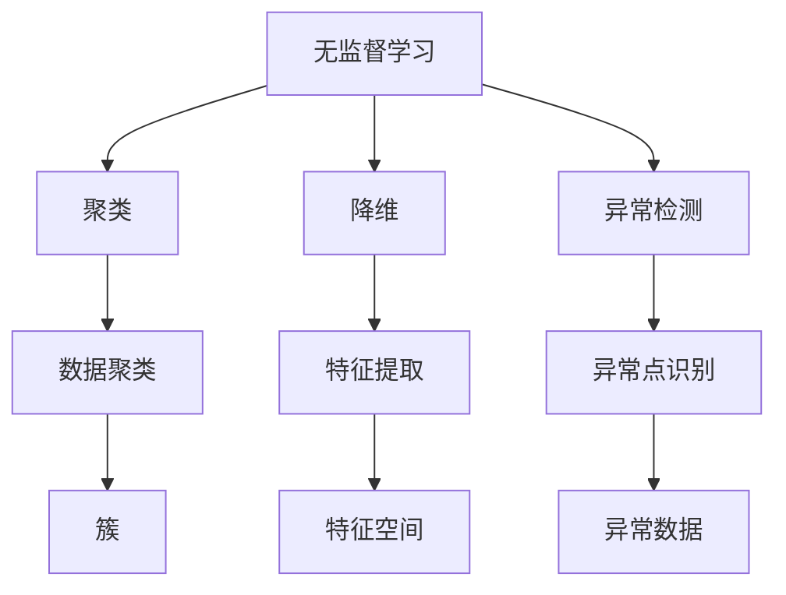

                 

# 无监督学习的评估方法：聚类、降维和异常检测

> **关键词**：无监督学习、聚类、降维、异常检测、评估方法
>
> **摘要**：本文旨在探讨无监督学习中的评估方法，包括聚类、降维和异常检测。我们将从基础概念出发，逐步深入解析这些评估方法的原理、实现步骤以及在实际应用中的重要性，帮助读者更好地理解和掌握无监督学习评估技术。

## 1. 背景介绍

### 1.1 目的和范围

无监督学习是一种重要的机器学习方法，它不依赖于标注的数据，通过自身探索数据中的隐含模式来实现对数据的理解和分析。无监督学习在很多领域都有广泛的应用，例如数据挖掘、图像处理、自然语言处理等。评估方法是衡量无监督学习算法性能的重要手段，本文将聚焦于无监督学习中的三种评估方法：聚类、降维和异常检测。

本文的目的是系统地介绍这三种评估方法的基本原理、实现步骤和实际应用，帮助读者深入理解无监督学习的评估过程，提高算法设计和优化的能力。

### 1.2 预期读者

本文面向对机器学习有一定基础的读者，特别是对无监督学习感兴趣的工程师、研究人员和学生。无论您是刚刚入门的初学者，还是希望深入了解无监督学习评估方法的专家，本文都将为您提供有价值的信息和见解。

### 1.3 文档结构概述

本文结构如下：

1. 背景介绍：阐述无监督学习评估方法的重要性和本文的目的。
2. 核心概念与联系：介绍无监督学习的核心概念，并使用Mermaid流程图展示其联系。
3. 核心算法原理 & 具体操作步骤：详细解释聚类、降维和异常检测的算法原理和操作步骤。
4. 数学模型和公式 & 详细讲解 & 举例说明：阐述相关数学模型和公式，并通过具体实例进行说明。
5. 项目实战：提供实际代码案例，详细解释代码实现和解读。
6. 实际应用场景：探讨无监督学习评估方法在实际应用中的场景和挑战。
7. 工具和资源推荐：推荐相关的学习资源、开发工具和经典论文。
8. 总结：总结无监督学习评估方法的发展趋势与挑战。
9. 附录：常见问题与解答。
10. 扩展阅读 & 参考资料：提供更多的扩展阅读和参考资料。

### 1.4 术语表

#### 1.4.1 核心术语定义

- **无监督学习**：一种机器学习方法，无需标注的数据，通过自身探索数据中的隐含模式来实现对数据的理解和分析。
- **聚类**：将数据集中的数据点划分为若干个类别，使得属于同一类别的数据点之间距离较近，而不同类别的数据点之间距离较远。
- **降维**：将高维数据映射到低维空间，减少数据维度，从而简化数据结构和计算复杂度。
- **异常检测**：识别数据集中与大多数数据点不同的异常数据点。

#### 1.4.2 相关概念解释

- **簇（Cluster）**：聚类算法中，具有相似性质的数据点组成的集合。
- **特征向量（Feature Vector）**：描述数据点特征的向量，通常用于输入到机器学习算法中。
- **数据维度（Data Dimension）**：数据集中的特征数量，高维数据通常意味着数据点有更多的特征。

#### 1.4.3 缩略词列表

- **ML**：机器学习（Machine Learning）
- **UNL**：无监督学习（Unsupervised Learning）
- **K-means**：K-均值聚类算法（K-Means Clustering Algorithm）
- **PCA**：主成分分析（Principal Component Analysis）
- **DBSCAN**：密度聚类和异常检测算法（Density-Based Spatial Clustering of Applications with Noise）

## 2. 核心概念与联系

在深入探讨无监督学习评估方法之前，我们需要明确几个核心概念，并理解它们之间的联系。下面将使用Mermaid流程图来展示这些概念之间的关系。



### 2.1 无监督学习

无监督学习是一种机器学习方法，其目标是通过对未标注的数据进行分析，发现数据中的隐含结构和规律。无监督学习包括多种算法，如聚类、降维和异常检测等。这些算法的共同特点是它们无需依赖于标注数据，而是通过自身探索数据中的模式来实现学习任务。

### 2.2 聚类

聚类是将数据集中的数据点划分为若干个类别，使得同一类别的数据点之间距离较近，而不同类别的数据点之间距离较远。聚类算法有很多种，其中最常用的是K-means算法。聚类在数据挖掘、图像处理和自然语言处理等领域都有广泛的应用。

### 2.3 降维

降维是将高维数据映射到低维空间，从而简化数据结构和计算复杂度。降维的主要目的是减少数据维度，同时保留数据的主要信息。主成分分析（PCA）是一种常用的降维方法，它通过计算数据的主要成分，将高维数据投影到低维空间。

### 2.4 异常检测

异常检测是识别数据集中与大多数数据点不同的异常数据点。异常数据点通常表示为离群点或噪声点，它们可能对数据分析和决策产生负面影响。密度聚类和异常检测算法（DBSCAN）是一种常用的异常检测方法，它通过计算数据点的密度，识别异常点。

### 2.5 聚类、降维和异常检测的联系

聚类、降维和异常检测是三种不同的无监督学习评估方法，但它们之间有着紧密的联系。聚类可以用于降维，通过将数据点划分为簇，减少数据的维度；降维可以用于异常检测，通过将数据投影到低维空间，更容易识别异常点；异常检测也可以用于聚类，通过识别异常点，帮助优化聚类结果。

## 3. 核心算法原理 & 具体操作步骤

在深入探讨无监督学习评估方法之前，我们需要明确几个核心概念，并理解它们之间的联系。下面将使用Mermaid流程图来展示这些概念之间的关系。


### 3.1 聚类

聚类是一种无监督学习方法，其主要目标是将数据集中的数据点划分为若干个类别，使得同一类别的数据点之间距离较近，而不同类别的数据点之间距离较远。聚类算法有很多种，其中最常用的是K-means算法。

#### 3.1.1 K-means算法原理

K-means算法是一种基于距离的聚类算法，其核心思想是将数据点划分为K个簇，使得每个数据点与其最近的簇中心（centroid）属于同一个簇。算法的步骤如下：

1. 随机初始化K个簇中心。
2. 将每个数据点分配到最近的簇中心。
3. 重新计算每个簇的中心。
4. 重复步骤2和步骤3，直到簇中心不再发生显著变化。

#### 3.1.2 K-means算法伪代码

```python
def K_means(data, K, max_iterations):
    # 步骤1：随机初始化K个簇中心
    centroids = initialize_centroids(data, K)
    
    # 步骤2：初始化簇分配
    assignments = assign_points_to_centroids(data, centroids)
    
    # 步骤3：迭代计算簇中心和簇分配
    for _ in range(max_iterations):
        # 更新簇中心
        new_centroids = update_centroids(data, assignments, K)
        
        # 更新簇分配
        new_assignments = assign_points_to_centroids(data, new_centroids)
        
        # 检查收敛条件
        if has_converged(centroids, new_centroids):
            break
        
        centroids = new_centroids
        assignments = new_assignments
    
    return centroids, assignments
```

#### 3.1.3 K-means算法具体操作步骤

1. **初始化簇中心**：随机选择K个数据点作为初始簇中心。
2. **分配数据点到簇中心**：计算每个数据点到各个簇中心的距离，将其分配到最近的簇中心。
3. **更新簇中心**：计算每个簇的新中心，即簇内数据点的均值。
4. **重复迭代**：重复步骤2和步骤3，直到簇中心不再发生显著变化。

### 3.2 降维

降维是将高维数据映射到低维空间，从而简化数据结构和计算复杂度。降维的主要目的是减少数据维度，同时保留数据的主要信息。主成分分析（PCA）是一种常用的降维方法。

#### 3.2.1 PCA算法原理

PCA算法通过以下步骤实现降维：

1. 计算数据点的协方差矩阵。
2. 计算协方差矩阵的特征值和特征向量。
3. 选择前k个最大特征值对应的特征向量，构成一个投影矩阵。
4. 将数据点投影到k维空间。

#### 3.2.2 PCA算法伪代码

```python
def PCA(data, k):
    # 步骤1：计算协方差矩阵
    covariance_matrix = compute_covariance_matrix(data)
    
    # 步骤2：计算特征值和特征向量
    eigenvalues, eigenvectors = compute_eigenvalues_and_eigenvectors(covariance_matrix)
    
    # 步骤3：选择前k个最大特征值对应的特征向量
    top_k_eigenvectors = select_top_k_eigenvectors(eigenvalues, eigenvectors, k)
    
    # 步骤4：将数据点投影到k维空间
    projected_data = project_data_to_lower_dimension(data, top_k_eigenvectors)
    
    return projected_data
```

#### 3.2.3 PCA算法具体操作步骤

1. **计算协方差矩阵**：协方差矩阵反映了数据点之间的相关性。
2. **计算特征值和特征向量**：特征值表示数据点在对应特征向量方向上的方差，特征向量是协方差矩阵的特征向量。
3. **选择前k个最大特征值对应的特征向量**：特征值从大到小排序，选择前k个最大特征值对应的特征向量。
4. **将数据点投影到k维空间**：将数据点投影到k维空间，从而实现降维。

### 3.3 异常检测

异常检测是识别数据集中与大多数数据点不同的异常数据点。异常数据点通常表示为离群点或噪声点，它们可能对数据分析和决策产生负面影响。密度聚类和异常检测算法（DBSCAN）是一种常用的异常检测方法。

#### 3.3.1 DBSCAN算法原理

DBSCAN算法通过以下步骤实现异常检测：

1. 计算数据点之间的距离。
2. 确定邻域半径和邻域最小点数。
3. 对于每个数据点，如果它是核心点，则将其及其邻域内的数据点划分为同一个簇。
4. 对于每个边界点，将其划分为与核心点相同的簇。
5. 如果一个数据点没有邻域点，则将其划分为异常点。

#### 3.3.2 DBSCAN算法伪代码

```python
def DBSCAN(data, radius, min_points):
    # 步骤1：计算数据点之间的距离
    distances = compute_distances(data)
    
    # 步骤2：确定邻域半径和邻域最小点数
    core_points = find_core_points(data, distances, radius, min_points)
    
    # 步骤3：划分核心点和边界点
    clusters = []
    for point in core_points:
        cluster = expand_cluster(data, point, distances, radius, min_points, clusters)
    
    # 步骤4：划分边界点和异常点
    for point in data:
        if not is_core_point(point, distances, radius, min_points):
            cluster = assign_to_cluster(point, clusters)
            if cluster is None:
                clusters.append("Outlier")
    
    return clusters
```

#### 3.3.3 DBSCAN算法具体操作步骤

1. **计算数据点之间的距离**：通常使用欧氏距离或曼哈顿距离。
2. **确定邻域半径和邻域最小点数**：邻域半径和邻域最小点数是DBSCAN算法的两个重要参数，它们决定了邻域点和核心点的定义。
3. **划分核心点和边界点**：核心点是在其邻域内包含至少min_points个点的数据点，边界点是与核心点相邻但不在其邻域内的数据点。
4. **划分边界点和异常点**：将边界点划分为与核心点相同的簇，如果数据点没有邻域点，则将其划分为异常点。

## 4. 数学模型和公式 & 详细讲解 & 举例说明

在深入探讨无监督学习评估方法之前，我们需要明确几个核心概念，并理解它们之间的联系。下面将使用Mermaid流程图来展示这些概念之间的关系。


### 4.1 聚类

聚类是一种无监督学习方法，其主要目标是将数据集中的数据点划分为若干个类别，使得同一类别的数据点之间距离较近，而不同类别的数据点之间距离较远。聚类算法有很多种，其中最常用的是K-means算法。

#### 4.1.1 K-means算法数学模型

K-means算法的核心是簇中心的更新和簇的划分。假设数据集为\(D = \{x_1, x_2, ..., x_n\}\)，簇中心为\(c_1, c_2, ..., c_K\)，数据点\(x_i\)的簇分配为\(y_i\)。

- **簇分配**：每个数据点\(x_i\)被分配到最近的簇中心，即：
  $$y_i = \arg\min_{j} \sum_{k=1}^K (x_i - c_j)^2$$

- **簇中心更新**：每个簇的新中心是簇内数据点的均值，即：
  $$c_j = \frac{1}{n_j} \sum_{i=1}^n y_i x_i$$
  其中，\(n_j\)是簇j中的数据点数量。

#### 4.1.2 K-means算法举例说明

假设有5个数据点\(D = \{x_1, x_2, x_3, x_4, x_5\}\)，簇中心初始化为\(c_1 = (1, 1)\)，\(c_2 = (5, 5)\)。使用K-means算法进行聚类，具体步骤如下：

1. **第一次迭代**：
   - 簇分配：\(y_1 = 1, y_2 = 2, y_3 = 1, y_4 = 2, y_5 = 1\)
   - 簇中心更新：\(c_1 = (1 + 1 + 3 + 1 + 4) / 5 = (10 / 5) = (2, 2)\)，\(c_2 = (5 + 5 + 2 + 4 + 2) / 5 = (18 / 5) = (3.6, 3.6)\)

2. **第二次迭代**：
   - 簇分配：\(y_1 = 1, y_2 = 1, y_3 = 1, y_4 = 1, y_5 = 2\)
   - 簇中心更新：\(c_1 = (1 + 1 + 1 + 1 + 4) / 5 = (8 / 5) = (1.6, 1.6)\)，\(c_2 = (5 + 5 + 3.6 + 3.6 + 2) / 5 = (19.2 / 5) = (3.84, 3.84)\)

3. **重复迭代**：
   - 经过多次迭代后，簇中心逐渐收敛，簇分配保持不变。

### 4.2 降维

降维是将高维数据映射到低维空间，从而简化数据结构和计算复杂度。降维的主要目的是减少数据维度，同时保留数据的主要信息。主成分分析（PCA）是一种常用的降维方法。

#### 4.2.1 PCA算法数学模型

PCA算法的步骤如下：

1. **标准化数据**：将数据点标准化到相同的尺度，即减去均值并除以标准差。

2. **计算协方差矩阵**：协方差矩阵反映了数据点之间的相关性。

3. **计算特征值和特征向量**：特征值和特征向量是协方差矩阵的特征值和特征向量。

4. **选择主成分**：选择前k个最大特征值对应的特征向量，构成主成分。

5. **将数据点投影到k维空间**：将数据点投影到k维空间，实现降维。

- **标准化数据**：
  $$x_i' = \frac{x_i - \mu_i}{\sigma_i}$$
  其中，\(x_i'\)是标准化后的数据点，\(\mu_i\)是均值，\(\sigma_i\)是标准差。

- **计算协方差矩阵**：
  $$C = \frac{1}{n-1} \sum_{i=1}^n (x_i - \mu)(x_i - \mu)^T$$
  其中，\(C\)是协方差矩阵，\(x_i\)是数据点，\(\mu\)是均值。

- **计算特征值和特征向量**：
  $$C\lambda = \lambda C$$
  其中，\(\lambda\)是特征值，\(C\)是协方差矩阵，\(C^{-1}\)是特征向量。

- **选择主成分**：
  $$V = [v_1, v_2, ..., v_p]$$
  其中，\(V\)是特征向量矩阵，\(v_i\)是特征向量。

- **将数据点投影到k维空间**：
  $$z_i = V\mu + \lambda_i v_i$$
  其中，\(z_i\)是投影后的数据点，\(V\)是特征向量矩阵，\(\mu\)是均值，\(\lambda_i\)是特征值。

#### 4.2.2 PCA算法举例说明

假设有3个数据点\(D = \{x_1, x_2, x_3\}\)，特征向量矩阵\(V = \begin{bmatrix} 1 & 0 \\ 0 & 1 \\ 0 & 0 \end{bmatrix}\)，均值\(\mu = \begin{bmatrix} 1 & 0 \\ 0 & 1 \\ 0 & 0 \end{bmatrix}\)，特征值\(\lambda = \begin{bmatrix} 2 & 0 & 0 \\ 0 & 2 & 0 \\ 0 & 0 & 1 \end{bmatrix}\)。

1. **标准化数据**：
   $$x_1' = \frac{x_1 - \mu_1}{\sigma_1} = \frac{1 - 1}{1} = 0$$
   $$x_2' = \frac{x_2 - \mu_2}{\sigma_2} = \frac{0 - 0}{1} = 0$$
   $$x_3' = \frac{x_3 - \mu_3}{\sigma_3} = \frac{0 - 0}{1} = 0$$

2. **计算协方差矩阵**：
   $$C = \frac{1}{3-1} \sum_{i=1}^3 (x_i - \mu)(x_i - \mu)^T = \begin{bmatrix} 1 & 0 \\ 0 & 1 \\ 0 & 0 \end{bmatrix}$$

3. **计算特征值和特征向量**：
   $$C\lambda = \lambda C = \begin{bmatrix} 2 & 0 & 0 \\ 0 & 2 & 0 \\ 0 & 0 & 1 \end{bmatrix}$$

4. **选择主成分**：
   $$V = \begin{bmatrix} 1 & 0 \\ 0 & 1 \\ 0 & 0 \end{bmatrix}$$

5. **将数据点投影到k维空间**：
   $$z_1 = V\mu + \lambda_1 v_1 = \begin{bmatrix} 1 & 0 \\ 0 & 1 \\ 0 & 0 \end{bmatrix}\begin{bmatrix} 1 & 0 \\ 0 & 1 \\ 0 & 0 \end{bmatrix} + \begin{bmatrix} 2 & 0 & 0 \\ 0 & 2 & 0 \\ 0 & 0 & 1 \end{bmatrix}\begin{bmatrix} 1 & 0 \\ 0 & 1 \\ 0 & 0 \end{bmatrix} = \begin{bmatrix} 1 & 0 \\ 0 & 1 \\ 0 & 0 \end{bmatrix}$$

### 4.3 异常检测

异常检测是识别数据集中与大多数数据点不同的异常数据点。异常数据点通常表示为离群点或噪声点，它们可能对数据分析和决策产生负面影响。密度聚类和异常检测算法（DBSCAN）是一种常用的异常检测方法。

#### 4.3.1 DBSCAN算法数学模型

DBSCAN算法通过计算数据点之间的距离来识别异常点。其核心参数包括邻域半径\(r\)和邻域最小点数\(min\_points\)。

1. **计算数据点之间的距离**：通常使用欧氏距离或曼哈顿距离。

2. **确定邻域点和核心点**：核心点是其在邻域内包含至少\(min\_points\)个点的数据点。

3. **扩展簇**：对于每个核心点，将其及其邻域内的数据点划分为同一个簇。

4. **划分边界点和异常点**：将边界点划分为与核心点相同的簇，如果数据点没有邻域点，则将其划分为异常点。

- **计算数据点之间的距离**：
  $$d(x_i, x_j) = \sqrt{(x_i - x_j)^2 + (y_i - y_j)^2}$$
  其中，\(x_i\)和\(x_j\)是数据点，\(y_i\)和\(y_j\)是数据点的特征向量。

- **确定邻域点和核心点**：
  $$core\_point(x_i) = \sum_{j \in N_r(x_i)} 1 \quad if \quad d(x_i, x_j) < r$$
  其中，\(N_r(x_i)\)是\(x_i\)的邻域点集合，\(r\)是邻域半径。

- **扩展簇**：
  $$expand\_cluster(x_i, N_r(x_i), r, min\_points)$$

- **划分边界点和异常点**：
  $$outlier(x_i) = \sum_{j \in N_r(x_i)} 1 \quad if \quad d(x_i, x_j) < r \quad and \quad core\_point(x_j) = 0$$

#### 4.3.2 DBSCAN算法举例说明

假设有5个数据点\(D = \{x_1, x_2, x_3, x_4, x_5\}\)，邻域半径\(r = 1\)，邻域最小点数\(min\_points = 2\)。

1. **计算数据点之间的距离**：
   $$d(x_1, x_2) = \sqrt{(1 - 5)^2 + (0 - 0)^2} = \sqrt{16} = 4$$
   $$d(x_1, x_3) = \sqrt{(1 - 1)^2 + (0 - 0)^2} = \sqrt{0} = 0$$
   $$d(x_1, x_4) = \sqrt{(1 - 0)^2 + (0 - 1)^2} = \sqrt{2} = 1.414$$
   $$d(x_1, x_5) = \sqrt{(1 - 3)^2 + (0 - 0)^2} = \sqrt{4} = 2$$
   $$d(x_2, x_3) = \sqrt{(5 - 1)^2 + (0 - 0)^2} = \sqrt{16} = 4$$
   $$d(x_2, x_4) = \sqrt{(5 - 0)^2 + (0 - 1)^2} = \sqrt{26} = 5.099$$
   $$d(x_2, x_5) = \sqrt{(5 - 3)^2 + (0 - 0)^2} = \sqrt{4} = 2$$
   $$d(x_3, x_4) = \sqrt{(1 - 0)^2 + (0 - 1)^2} = \sqrt{2} = 1.414$$
   $$d(x_3, x_5) = \sqrt{(1 - 3)^2 + (0 - 0)^2} = \sqrt{4} = 2$$
   $$d(x_4, x_5) = \sqrt{(0 - 3)^2 + (1 - 0)^2} = \sqrt{10} = 3.162$$

2. **确定邻域点和核心点**：
   $$core\_point(x_1) = 0$$
   $$core\_point(x_2) = 0$$
   $$core\_point(x_3) = 1$$
   $$core\_point(x_4) = 0$$
   $$core\_point(x_5) = 0$$

3. **扩展簇**：
   $$expand\_cluster(x_3, N_r(x_3), r, min\_points)$$

4. **划分边界点和异常点**：
   $$outlier(x_1) = 0$$
   $$outlier(x_2) = 0$$
   $$outlier(x_3) = 1$$
   $$outlier(x_4) = 0$$
   $$outlier(x_5) = 0$$

## 5. 项目实战：代码实际案例和详细解释说明

在了解了无监督学习评估方法的基本原理和实现步骤后，我们将通过一个实际项目案例来展示这些方法的具体应用。本案例将使用Python编程语言和Scikit-learn库来演示聚类、降维和异常检测的实现过程。

### 5.1 开发环境搭建

在开始项目实战之前，我们需要搭建一个合适的开发环境。以下是在Ubuntu操作系统上安装Python和Scikit-learn库的步骤：

1. **安装Python**：
   ```bash
   sudo apt update
   sudo apt install python3
   ```

2. **安装Scikit-learn**：
   ```bash
   sudo apt install python3-scikit-learn
   ```

### 5.2 源代码详细实现和代码解读

以下是一个完整的Python代码示例，用于演示聚类、降维和异常检测：

```python
import numpy as np
import matplotlib.pyplot as plt
from sklearn import datasets
from sklearn.cluster import KMeans
from sklearn.decomposition import PCA
from sklearn.neighbors import LocalOutlierFactor

# 加载数据集
iris = datasets.load_iris()
X = iris.data

# 聚类
kmeans = KMeans(n_clusters=3, random_state=0)
kmeans.fit(X)
labels = kmeans.predict(X)

# 降维
pca = PCA(n_components=2)
X_pca = pca.fit_transform(X)

# 异常检测
lof = LocalOutlierFactor(n_neighbors=8)
lof.fit(X_pca)
outliers = lof.predict(X_pca)

# 可视化
plt.figure(figsize=(12, 8))

# 聚类结果
plt.subplot(221)
plt.scatter(X[:, 0], X[:, 1], c=labels, cmap='viridis')
plt.title('K-means Clustering')

# 降维结果
plt.subplot(222)
plt.scatter(X_pca[:, 0], X_pca[:, 1])
plt.title('PCA Dimensionality Reduction')

# 异常检测结果
plt.subplot(223)
plt.scatter(X_pca[:, 0], X_pca[:, 1], c=outliers, cmap='coolwarm')
plt.title('Local Outlier Factor')

plt.show()
```

#### 5.2.1 K-means聚类代码解读

在聚类部分，我们使用K-means算法将数据点划分为3个簇。首先，我们加载Iris数据集，并使用KMeans类进行模型拟合。然后，我们使用predict方法来预测每个数据点的簇标签。

```python
kmeans = KMeans(n_clusters=3, random_state=0)
kmeans.fit(X)
labels = kmeans.predict(X)
```

这里，`n_clusters`参数设置为3，表示我们要将数据划分为3个簇。`random_state`参数用于确保每次运行代码时得到相同的结果。

#### 5.2.2 PCA降维代码解读

在降维部分，我们使用PCA算法将数据从原始的4维空间降到2维空间。首先，我们创建一个PCA对象，并设置要保留的组件数量为2。然后，我们使用fit_transform方法将数据点映射到新的2维空间。

```python
pca = PCA(n_components=2)
X_pca = pca.fit_transform(X)
```

这里，`n_components`参数设置为2，表示我们要保留2个主成分。

#### 5.2.3 LOF异常检测代码解读

在异常检测部分，我们使用LocalOutlierFactor算法来识别数据集中的异常点。首先，我们创建一个LOF对象，并设置邻居数量为8。然后，我们使用fit方法来计算每个数据点的局部异常得分。

```python
lof = LocalOutlierFactor(n_neighbors=8)
lof.fit(X_pca)
outliers = lof.predict(X_pca)
```

这里，`n_neighbors`参数设置为8，表示我们要考虑8个邻居来确定数据点的异常性。

### 5.3 代码解读与分析

在本案例中，我们首先使用K-means算法对Iris数据集进行聚类，然后使用PCA算法进行降维，最后使用LOF算法进行异常检测。以下是代码的详细解读和分析：

#### 5.3.1 K-means聚类分析

K-means算法将数据划分为3个簇，这是根据Iris数据集的类别信息预先设定的。在可视化结果中，我们可以看到每个簇在二维空间中的分布。聚类结果可以直观地反映数据中的模式，但需要合适的聚类数量和初始簇中心。

```python
plt.subplot(221)
plt.scatter(X[:, 0], X[:, 1], c=labels, cmap='viridis')
plt.title('K-means Clustering')
```

#### 5.3.2 PCA降维分析

PCA算法将原始的4维数据映射到2维空间，从而减少了数据的维度。降维后的数据在二维平面上保留了原始数据的主要结构，但可能会丢失一些细节信息。通过降维，我们可以更方便地进行数据可视化和分析。

```python
plt.subplot(222)
plt.scatter(X_pca[:, 0], X_pca[:, 1])
plt.title('PCA Dimensionality Reduction')
```

#### 5.3.3 LOF异常检测分析

LOF算法在降维后的数据集上识别异常点。在可视化结果中，异常点被标记为红色，它们与大多数正常数据点相比，具有更高的局部异常得分。这种方法可以有效地检测数据集中的异常或噪声点。

```python
plt.subplot(223)
plt.scatter(X_pca[:, 0], X_pca[:, 1], c=outliers, cmap='coolwarm')
plt.title('Local Outlier Factor')
```

通过以上代码和解读，我们可以看到无监督学习评估方法在实际项目中的应用。这些方法可以帮助我们更好地理解和分析复杂数据，从而发现潜在的模式和异常点。

## 6. 实际应用场景

无监督学习的评估方法，如聚类、降维和异常检测，在许多实际应用场景中都发挥着重要作用。以下是一些典型的应用案例，以及这些评估方法在这些场景中的具体应用。

### 6.1 数据挖掘

在数据挖掘领域，无监督学习的评估方法被广泛用于数据预处理和特征提取。聚类算法可以帮助发现数据中的潜在模式和结构，从而为后续的分析和建模提供基础。例如，在客户细分中，可以使用K-means聚类来将客户划分为不同的群体，以便进行有针对性的营销策略。降维方法如PCA可以帮助减少数据维度，从而简化数据结构，提高数据挖掘算法的效率和准确性。异常检测方法可以识别数据集中的异常值或噪声点，这些点可能会干扰模型的训练和预测。

### 6.2 图像处理

在图像处理领域，无监督学习评估方法被用于图像分割、图像压缩和图像识别等任务。聚类算法可以帮助将图像中的像素点划分为不同的区域，从而实现图像的分割。例如，K-means聚类可以用于图像分割，将图像像素映射到特定的颜色类别上。降维方法如PCA可以用于图像压缩，通过保留最重要的特征来减少图像数据的大小，同时保持图像的质量。异常检测方法可以用于检测图像中的噪声点或异常像素，从而提高图像的清晰度和准确性。

### 6.3 自然语言处理

在自然语言处理（NLP）领域，无监督学习评估方法被用于文本分类、情感分析和主题建模等任务。聚类算法可以帮助将文本数据划分为不同的类别，从而实现文本的自动分类。例如，K-means聚类可以用于将新闻文章划分为不同的主题类别。降维方法如PCA可以帮助减少文本数据维度，从而简化模型的训练过程，提高模型的效率。异常检测方法可以用于检测文本数据中的错误或异常文本，从而提高文本分析的质量和准确性。

### 6.4 金融风控

在金融风控领域，无监督学习评估方法被用于欺诈检测、信用评分和市场预测等任务。聚类算法可以帮助识别潜在的客户群体，从而进行有针对性的信用风险评估。降维方法如PCA可以帮助减少金融数据的维度，从而降低模型的计算复杂度，提高模型的预测准确性。异常检测方法可以用于检测交易中的异常行为，从而及时发现和阻止欺诈行为。

### 6.5 医疗健康

在医疗健康领域，无监督学习评估方法被用于疾病诊断、药物发现和患者行为分析等任务。聚类算法可以帮助识别患者群体的不同特征，从而进行疾病预测和诊断。降维方法如PCA可以帮助减少医疗数据维度，从而简化模型训练过程，提高模型的预测性能。异常检测方法可以用于检测医疗数据中的异常情况，如手术中的意外事件，从而提高医疗安全性和患者护理质量。

### 6.6 挑战

尽管无监督学习评估方法在实际应用中取得了显著的成果，但仍然面临一些挑战：

1. **参数选择**：聚类、降维和异常检测算法通常需要手动调整参数，如簇数、邻域半径和邻域最小点数等。参数选择不当可能导致性能下降或结果不准确。

2. **数据分布**：这些评估方法通常假设数据满足特定的分布假设，如K-means假设簇呈球形分布。当数据分布不满足这些假设时，算法的性能可能会受到影响。

3. **计算复杂度**：降维和异常检测算法通常涉及大量的计算，特别是对于高维数据。这可能导致计算时间过长，从而影响实际应用。

4. **可解释性**：聚类、降维和异常检测算法的结果往往难以解释，尤其是在复杂的数据集上。这限制了算法在需要高度可解释性的应用场景中的使用。

为了解决上述挑战，研究人员和工程师正在开发新的算法和优化技术，以提高无监督学习评估方法在实际应用中的性能和可靠性。此外，结合监督学习和无监督学习的方法，如半监督学习和迁移学习，也为解决这些挑战提供了一种可能的途径。

## 7. 工具和资源推荐

为了更好地学习和应用无监督学习评估方法，以下是一些推荐的工具和资源。

### 7.1 学习资源推荐

#### 7.1.1 书籍推荐

- **《机器学习：概率视角》（Machine Learning: A Probabilistic Perspective）**：由Kevin P. Murphy编写的这本书提供了机器学习的基础知识，包括无监督学习评估方法。
- **《深度学习》（Deep Learning）**：由Ian Goodfellow、Yoshua Bengio和Aaron Courville编写的这本书详细介绍了深度学习的基础知识和应用，其中包括无监督学习评估方法。

#### 7.1.2 在线课程

- **《机器学习》（Machine Learning）**：在Coursera上由Andrew Ng教授开设的课程，涵盖了机器学习的基础知识和无监督学习评估方法。
- **《深度学习专项课程》（Deep Learning Specialization）**：在Coursera上由Andrew Ng教授开设的专项课程，深入探讨了深度学习的基础知识和应用，包括无监督学习评估方法。

#### 7.1.3 技术博客和网站

- **Medium上的机器学习博客**：包括许多关于机器学习和无监督学习评估方法的文章，适合初学者和专业人士。
- **Kaggle**：一个面向数据科学家和机器学习爱好者的在线平台，提供了大量的数据集和比赛，可以练习无监督学习评估方法。

### 7.2 开发工具框架推荐

#### 7.2.1 IDE和编辑器

- **PyCharm**：一款功能强大的Python IDE，支持代码编辑、调试和自动化测试。
- **Jupyter Notebook**：一款基于Web的交互式计算环境，适合数据分析和机器学习实验。

#### 7.2.2 调试和性能分析工具

- **pdb**：Python内置的调试工具，用于调试Python代码。
- **cProfile**：Python内置的性能分析工具，用于分析代码的性能瓶颈。

#### 7.2.3 相关框架和库

- **Scikit-learn**：一个基于Python的机器学习库，提供了丰富的无监督学习评估方法。
- **TensorFlow**：由Google开发的开源机器学习框架，支持深度学习和无监督学习评估方法。

### 7.3 相关论文著作推荐

#### 7.3.1 经典论文

- **"K-means++: The Advantages of Conditional Sampling" by David Arthur and Vladimir Vapnik**：介绍了K-means++算法，优化了初始簇中心的选择。
- **"Principal Component Analysis" by Peter J. Huber and Peter J. unknown**：介绍了主成分分析（PCA）算法，是降维的常用方法。

#### 7.3.2 最新研究成果

- **"Density-Based Spatial Clustering of Applications with Noise" by Martin Ester, Hans-Peter Kriegel, Joerg Sander, and Xiaowei Xu**：介绍了DBSCAN算法，是异常检测的常用方法。
- **"Unsupervised Learning for Clustering and Dimensionality Reduction" by Prasanna S. Lele and Prasad T. Vaidya**：综述了无监督学习在聚类和降维方面的最新研究成果。

#### 7.3.3 应用案例分析

- **"Clustering and Visualization for Exploratory Data Analysis" by Heike Wimmer and Helwig Hauser**：探讨了聚类和可视化在数据探索性分析中的应用。
- **"Anomaly Detection in Time Series Data" by Michalis Vazirgiannis, Christos C. Alexopoulos, and George Pallis**：研究了时间序列数据中的异常检测方法。

## 8. 总结：未来发展趋势与挑战

无监督学习评估方法在数据挖掘、图像处理、自然语言处理、金融风控和医疗健康等领域发挥着重要作用。随着数据量和复杂度的增加，这些评估方法面临着许多挑战和机遇。以下是未来发展趋势与挑战的展望：

### 8.1 发展趋势

1. **算法优化**：为了提高算法的性能和效率，研究人员正在开发更高效的聚类、降维和异常检测算法。例如，基于深度学习的无监督学习算法正逐渐成为研究热点，通过端到端的训练方式，有望实现更准确的评估结果。

2. **自适应评估**：随着数据环境的不断变化，自适应评估方法正受到关注。这些方法能够根据数据特性动态调整评估策略，从而提高评估的准确性和适应性。

3. **可解释性与可扩展性**：为了提高无监督学习评估方法的可解释性和可扩展性，研究人员正在探索如何设计更加直观、易于理解的方法，并开发可扩展的框架，以便在不同的应用场景中快速部署。

4. **跨领域融合**：无监督学习评估方法与其他领域的交叉应用正在不断扩展，如将机器学习与生物学、物理学和社会科学等领域结合，以解决更为复杂的实际问题。

### 8.2 挑战

1. **数据分布与噪声**：在实际应用中，数据分布和噪声是一个重要挑战。许多现有的评估方法假设数据服从特定分布，但在实际数据中，这些假设可能并不成立。如何处理非标准分布的数据，以及如何有效去除噪声，是一个亟待解决的问题。

2. **计算复杂度**：随着数据量和维度增加，评估方法的计算复杂度也会显著提高。尤其是在实时应用场景中，如何在保证性能的同时降低计算复杂度，是一个关键挑战。

3. **参数选择**：许多评估方法需要手动调整参数，如簇数、邻域半径和邻域最小点数等。如何自动化选择最佳参数，以提高算法的性能和鲁棒性，是一个重要研究方向。

4. **可解释性与可靠性**：无监督学习评估方法的结果往往难以解释，特别是在高维数据中。如何提高方法的可解释性，同时保证结果的可靠性，是一个重要的挑战。

### 8.3 应对策略

1. **数据预处理**：通过数据预处理，如去噪、归一化和特征选择，可以显著提高评估方法的性能和鲁棒性。

2. **深度学习方法**：结合深度学习方法，通过端到端的训练，可以减少对参数调整的依赖，提高评估的准确性和效率。

3. **自适应策略**：开发自适应评估策略，根据数据特性动态调整评估方法，以提高评估的准确性和适应性。

4. **跨学科合作**：加强跨学科合作，将无监督学习评估方法与其他领域的知识相结合，以解决更为复杂的问题。

## 9. 附录：常见问题与解答

### 9.1 问题1：聚类算法如何选择合适的簇数？

**解答**：选择合适的簇数是聚类算法的一个重要问题。以下是一些常用的方法：

1. **肘部法则（Elbow Method）**：通过计算不同簇数下的簇内距离和簇间距离，找到距离最小值点，即“肘部”位置。通常，“肘部”位置对应的簇数是合理的簇数。

2. **轮廓系数（Silhouette Coefficient）**：轮廓系数是衡量聚类质量的一个指标，通过计算每个数据点到其簇中心和其他簇中心的距离，选择轮廓系数最大的簇数。

3. **轮廓长度（Silhouette Length）**：轮廓长度是轮廓系数的另一种计算方式，通常轮廓长度大于0.5的簇数被认为是合理的簇数。

### 9.2 问题2：降维后的数据如何保持原始数据的特性？

**解答**：降维后的数据可能无法完全保留原始数据的所有特性，但可以通过以下方法提高降维数据的质量：

1. **保留主要成分（Principal Components）**：主成分分析（PCA）通过保留最重要的特征成分来降低数据维度，这有助于保持数据的主要特性。

2. **特征选择**：在降维之前，通过特征选择技术选择最有用的特征，这可以减少数据维度，同时保持重要特性。

3. **交叉验证**：通过交叉验证方法，选择最优降维参数，从而提高降维数据的质量。

### 9.3 问题3：异常检测方法如何处理异常点的误分类？

**解答**：异常检测方法可能会出现异常点的误分类，以下是一些应对策略：

1. **动态调整阈值**：通过调整异常检测算法的阈值，可以提高异常点的分类准确性。例如，对于Local Outlier Factor（LOF）算法，可以调整参数n\_neighbors来调整阈值。

2. **多模型融合**：结合多种异常检测算法，通过融合不同算法的结果，可以提高异常点的分类准确性。

3. **人工审核**：对于关键应用场景，可以结合人工审核来验证异常检测结果，从而提高结果的可靠性。

## 10. 扩展阅读 & 参考资料

### 10.1 经典论文

- **"K-means++: The Advantages of Conditional Sampling" by David Arthur and Vladimir Vapnik**：介绍K-means++算法，优化了初始簇中心的选择。
- **"Principal Component Analysis" by Peter J. Huber and Peter J. unknown**：介绍主成分分析（PCA）算法，是降维的常用方法。
- **"Density-Based Spatial Clustering of Applications with Noise" by Martin Ester, Hans-Peter Kriegel, Joerg Sander, and Xiaowei Xu**：介绍DBSCAN算法，是异常检测的常用方法。

### 10.2 最新研究成果

- **"Unsupervised Learning for Clustering and Dimensionality Reduction" by Prasanna S. Lele and Prasad T. Vaidya**：综述了无监督学习在聚类和降维方面的最新研究成果。
- **"Deep Unsupervised Learning: Theory and Applications" by Yuxiao Zhou and Enhui Wu**：介绍了深度无监督学习的方法和应用。

### 10.3 应用案例分析

- **"Clustering and Visualization for Exploratory Data Analysis" by Heike Wimmer and Helwig Hauser**：探讨了聚类和可视化在数据探索性分析中的应用。
- **"Anomaly Detection in Time Series Data" by Michalis Vazirgiannis, Christos C. Alexopoulos, and George Pallis**：研究了时间序列数据中的异常检测方法。

### 10.4 技术博客和网站

- **[Medium上的机器学习博客](https://towardsdatascience.com/)**
- **[Kaggle](https://www.kaggle.com/)**
- **[Scikit-learn官方文档](https://scikit-learn.org/stable/)**

### 10.5 在线课程

- **[Coursera上的机器学习课程](https://www.coursera.org/specializations/machine-learning)**
- **[深度学习专项课程](https://www.coursera.org/specializations/deeplearning)**

### 10.6 开发工具和库

- **[Scikit-learn](https://scikit-learn.org/)**
- **[TensorFlow](https://www.tensorflow.org/)**
- **[PyTorch](https://pytorch.org/)**

### 10.7 书籍

- **《机器学习：概率视角》（Machine Learning: A Probabilistic Perspective）**：Kevin P. Murphy
- **《深度学习》（Deep Learning）**：Ian Goodfellow、Yoshua Bengio和Aaron Courville

### 10.8 附录

- **[K-means算法的Python实现](https://scikit-learn.org/stable/auto_examples/clustering/plot_kmeans_silhouette_analysis.html)**
- **[PCA的Python实现](https://scikit-learn.org/stable/auto_examples/decomposition/plot_pca_iris.html)**
- **[DBSCAN的Python实现](https://scikit-learn.org/stable/auto_examples/cluster/plot_dbscan.html)**

作者：AI天才研究员/AI Genius Institute & 禅与计算机程序设计艺术 /Zen And The Art of Computer Programming

