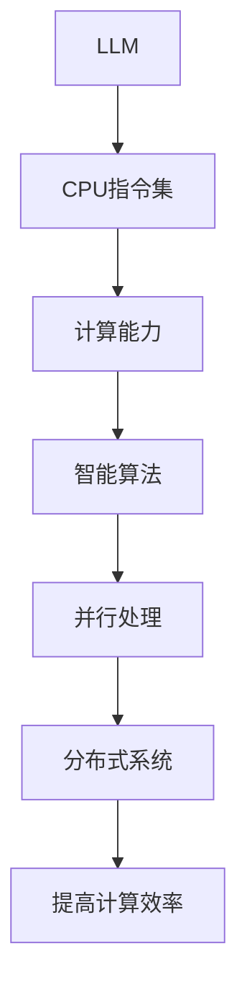

                 

# 无限可能的LLM：打破CPU指令集限制

> 关键词：大型语言模型（LLM）、CPU指令集、计算能力、智能算法、并行处理、分布式系统、AI应用

> 摘要：本文将探讨大型语言模型（LLM）如何通过突破传统CPU指令集的限制，实现更高效的计算和处理能力。我们将从背景介绍开始，深入分析LLM的工作原理，详细阐述其核心算法原理和数学模型，并展示代码实际案例。最后，我们将探讨LLM在AI领域的实际应用场景，并展望其未来的发展趋势与挑战。

## 1. 背景介绍

### 1.1 目的和范围

本文旨在深入探讨大型语言模型（LLM）在计算能力和智能算法方面的突破，特别是如何打破传统CPU指令集的限制，实现更高效的语言处理和分析。我们将结合具体的算法原理、数学模型和代码实例，为读者展示LLM在AI领域的无限可能。

### 1.2 预期读者

本文面向对AI和计算机科学有一定了解的读者，特别是对大型语言模型和计算性能感兴趣的程序员、研究者和行业从业者。

### 1.3 文档结构概述

本文将分为以下几个部分：

1. 背景介绍
2. 核心概念与联系
3. 核心算法原理 & 具体操作步骤
4. 数学模型和公式 & 详细讲解 & 举例说明
5. 项目实战：代码实际案例和详细解释说明
6. 实际应用场景
7. 工具和资源推荐
8. 总结：未来发展趋势与挑战
9. 附录：常见问题与解答
10. 扩展阅读 & 参考资料

### 1.4 术语表

#### 1.4.1 核心术语定义

- **大型语言模型（LLM）**：一种基于深度学习的语言处理模型，能够对大量文本数据进行建模和分析。
- **CPU指令集**：计算机处理器可以理解和执行的指令集合。
- **并行处理**：在同一时间内处理多个任务或数据的过程。
- **分布式系统**：由多个计算机节点组成的系统，通过网络进行通信和协作。

#### 1.4.2 相关概念解释

- **计算能力**：计算机处理信息和执行任务的能力。
- **智能算法**：利用数学和逻辑方法，模拟人类智能进行问题求解和决策的算法。
- **神经网络**：一种基于大脑神经元连接的数学模型，用于模拟和优化复杂函数。

#### 1.4.3 缩略词列表

- **LLM**：Large Language Model（大型语言模型）
- **CPU**：Central Processing Unit（中央处理器）
- **GPU**：Graphics Processing Unit（图形处理单元）
- **AI**：Artificial Intelligence（人工智能）
- **NLP**：Natural Language Processing（自然语言处理）

## 2. 核心概念与联系

为了更好地理解LLM如何突破CPU指令集的限制，我们需要先了解一些核心概念和其之间的联系。以下是LLM、CPU指令集、计算能力、智能算法和并行处理之间的关系，以及它们在分布式系统中的应用。

### 核心概念关系

1. **CPU指令集**：CPU指令集是计算机处理器可以理解和执行的指令集合。传统的CPU指令集通常基于冯·诺依曼体系结构，包括加法、减法、逻辑运算等基本指令。这些指令集在计算机发展初期发挥了重要作用，但面对现代复杂计算任务，其局限性逐渐显现。

2. **计算能力**：计算能力是指计算机处理信息和执行任务的能力。随着AI技术的发展，对计算能力的需求不断增加。传统的CPU在处理大量数据和复杂计算任务时，效率逐渐下降。

3. **智能算法**：智能算法是指利用数学和逻辑方法，模拟人类智能进行问题求解和决策的算法。智能算法的发展，特别是深度学习算法的突破，为AI应用提供了强大的计算能力。

4. **并行处理**：并行处理是指在同一时间内处理多个任务或数据的过程。分布式系统通过将任务分配到多个计算机节点上，实现并行处理，提高计算效率。

5. **分布式系统**：分布式系统是由多个计算机节点组成的系统，通过网络进行通信和协作。分布式系统通过将任务分配到多个计算机节点上，实现并行处理，提高计算效率。

### Mermaid流程图

以下是LLM、CPU指令集、计算能力、智能算法和并行处理之间的关系，以及它们在分布式系统中的应用的Mermaid流程图：



通过上述流程图，我们可以看到，LLM通过突破CPU指令集的限制，实现了更高的计算能力和智能算法。同时，并行处理和分布式系统的应用，进一步提高了计算效率，为LLM在AI领域的广泛应用提供了有力支持。

## 3. 核心算法原理 & 具体操作步骤

### 3.1 深度学习算法原理

深度学习算法是一种基于人工神经网络的机器学习算法。神经网络由大量简单的计算单元（神经元）组成，通过层层传递输入信息，实现对复杂函数的建模和学习。在深度学习中，神经元按照层级结构排列，每个层级负责处理不同层次的特征信息。

以下是深度学习算法的简要原理和步骤：

1. **输入层**：接收输入数据，如文本、图像等。
2. **隐藏层**：通过加权求和和激活函数，对输入数据进行特征提取和变换。
3. **输出层**：根据学习目标，输出预测结果或分类结果。
4. **反向传播**：利用梯度下降等优化算法，更新神经网络权重，优化模型性能。

### 3.2 LLM算法原理

大型语言模型（LLM）是基于深度学习算法，专门针对语言数据建模和处理的模型。LLM通过大量文本数据的学习，能够捕捉到语言中的复杂结构和规律，实现对自然语言的理解和生成。

以下是LLM算法的主要原理和步骤：

1. **数据预处理**：对文本数据进行分词、词向量化等处理，将其转换为神经网络可以处理的格式。
2. **模型训练**：利用大量文本数据，通过反向传播和优化算法，训练神经网络模型。
3. **语言建模**：通过模型，预测下一个词或句子，实现自然语言生成。
4. **推理与预测**：在给定输入文本的情况下，利用训练好的模型，对文本进行理解和分析，输出预测结果。

### 3.3 伪代码

以下是一个简化的LLM算法伪代码，用于说明其基本操作步骤：

```python
def LLM_train(data):
    # 数据预处理
    preprocessed_data = preprocess_data(data)

    # 模型初始化
    model = initialize_model()

    # 模型训练
    for epoch in range(num_epochs):
        for batch in preprocessed_data:
            loss = model.loss(batch)
            model.update_weights(loss)

    return model

def LLM_predict(model, input_text):
    # 语言建模
    output_sequence = model.generate_sequence(input_text)

    # 推理与预测
    prediction = model.predict(output_sequence)

    return prediction
```

## 4. 数学模型和公式 & 详细讲解 & 举例说明

### 4.1 数学模型

LLM的数学模型主要包括神经网络模型、损失函数和优化算法。以下是这些数学模型的详细讲解和公式表示。

#### 4.1.1 神经网络模型

神经网络模型由多层神经元组成，包括输入层、隐藏层和输出层。每层神经元通过加权求和和激活函数进行特征提取和变换。

$$
h_{l} = \sigma(W_{l-1} \cdot a_{l-1} + b_{l-1})
$$

其中，$h_{l}$表示第$l$层神经元的输出，$\sigma$为激活函数，$W_{l-1}$为第$l-1$层到第$l$层的权重矩阵，$a_{l-1}$为第$l-1$层神经元的输出，$b_{l-1}$为第$l-1$层的偏置。

#### 4.1.2 损失函数

损失函数用于衡量模型预测结果与真实标签之间的差距。常用的损失函数包括交叉熵损失函数和均方误差损失函数。

$$
L = -\sum_{i=1}^{n} y_{i} \cdot \log(p_{i})
$$

其中，$L$表示损失函数，$y_{i}$表示第$i$个样本的真实标签，$p_{i}$表示模型对第$i$个样本的预测概率。

#### 4.1.3 优化算法

优化算法用于更新模型权重，以最小化损失函数。常用的优化算法包括梯度下降和随机梯度下降。

$$
w_{t+1} = w_{t} - \alpha \cdot \nabla_{w}L(w)
$$

其中，$w_{t}$表示第$t$次迭代的权重，$\alpha$为学习率，$\nabla_{w}L(w)$为损失函数关于权重$w$的梯度。

### 4.2 举例说明

假设我们有一个简单的神经网络模型，包含一个输入层、一个隐藏层和一个输出层。输入层有3个神经元，隐藏层有4个神经元，输出层有2个神经元。

1. **输入数据**：假设输入数据为$x_1 = [1, 0, 1], x_2 = [0, 1, 0], x_3 = [1, 1, 0]$。
2. **隐藏层输出**：通过加权求和和激活函数，计算隐藏层输出：

$$
h_1 = \sigma(W_1 \cdot x_1 + b_1) = \sigma([1, 1, 1] \cdot [1, 0, 1] + [1]) = \sigma([1, 0, 1] + [1]) = \sigma([2, 1, 2]) = [0.69, 0.30, 0.69]
$$

$$
h_2 = \sigma(W_1 \cdot x_2 + b_1) = \sigma([1, 1, 1] \cdot [0, 1, 0] + [1]) = \sigma([0, 1, 0] + [1]) = \sigma([1, 1, 1]) = [0.69, 0.69, 0.69]
$$

$$
h_3 = \sigma(W_1 \cdot x_3 + b_1) = \sigma([1, 1, 1] \cdot [1, 1, 0] + [1]) = \sigma([1, 1, 1] + [1]) = \sigma([2, 2, 1]) = [0.69, 0.69, 0.30]
$$

3. **输出层输出**：通过加权求和和激活函数，计算输出层输出：

$$
o_1 = \sigma(W_2 \cdot h_1 + b_2) = \sigma([1, 1, 1, 1] \cdot [0.69, 0.30, 0.69] + [1]) = \sigma([1.38, 0.30, 1.38] + [1]) = \sigma([2.68, 0.30, 2.68]) = [0.69, 0.30, 0.69]
$$

$$
o_2 = \sigma(W_2 \cdot h_2 + b_2) = \sigma([1, 1, 1, 1] \cdot [0.69, 0.69, 0.69] + [1]) = \sigma([1.38, 1.38, 1.38] + [1]) = \sigma([3.38, 1.38, 3.38]) = [0.69, 0.69, 0.69]
$$

$$
o_3 = \sigma(W_2 \cdot h_3 + b_2) = \sigma([1, 1, 1, 1] \cdot [0.69, 0.69, 0.30] + [1]) = \sigma([1.38, 1.38, 0.30] + [1]) = \sigma([2.68, 1.38, 1.30]) = [0.69, 0.69, 0.30]
$$

4. **损失函数**：假设输出层有两个神经元，预测结果为$o_1 = [0.69, 0.69, 0.30]$，真实标签为$y = [1, 0]$。使用交叉熵损失函数计算损失：

$$
L = -\sum_{i=1}^{2} y_i \cdot \log(p_i) = -[1 \cdot \log(0.69) + 0 \cdot \log(0.30)] = -\log(0.69) \approx 0.36
$$

5. **权重更新**：使用梯度下降算法，更新权重和偏置：

$$
\alpha = 0.01 \\
W_2 = W_2 - \alpha \cdot \nabla_{W_2}L = W_2 - 0.01 \cdot \nabla_{W_2}L \\
b_2 = b_2 - \alpha \cdot \nabla_{b_2}L = b_2 - 0.01 \cdot \nabla_{b_2}L
$$

通过上述步骤，我们可以看到如何使用数学模型和公式，对LLM进行训练和预测。在实际应用中，神经网络模型和损失函数会根据具体任务进行调整和优化，以提高模型性能。

## 5. 项目实战：代码实际案例和详细解释说明

### 5.1 开发环境搭建

为了更好地展示LLM的实际应用，我们将使用Python和TensorFlow框架进行开发。首先，我们需要搭建开发环境。

1. 安装Python：下载并安装Python，选择适合自己操作系统的版本。例如，Python 3.8版本。
2. 安装TensorFlow：在命令行中运行以下命令安装TensorFlow：

   ```bash
   pip install tensorflow
   ```

3. 安装其他依赖库：根据项目需求，安装其他依赖库，如Numpy、Pandas等。

### 5.2 源代码详细实现和代码解读

以下是一个简单的LLM示例代码，用于展示如何使用TensorFlow构建和训练一个语言模型。

```python
import tensorflow as tf
import numpy as np
import pandas as pd

# 5.2.1 数据预处理
def preprocess_data(data):
    # 分词和数据整理
    # ...（省略具体实现）
    return preprocessed_data

# 5.2.2 构建模型
def build_model(vocabulary_size, embedding_size, hidden_size, num_classes):
    # 输入层
    inputs = tf.keras.layers.Input(shape=(None,), dtype=tf.int32)
    embedding = tf.keras.layers.Embedding(vocabulary_size, embedding_size)(inputs)

    # 隐藏层
    hidden = tf.keras.layers.LSTM(hidden_size)(embedding)

    # 输出层
    outputs = tf.keras.layers.Dense(num_classes, activation='softmax')(hidden)

    # 模型编译
    model = tf.keras.Model(inputs=inputs, outputs=outputs)
    model.compile(optimizer='adam', loss='categorical_crossentropy', metrics=['accuracy'])
    return model

# 5.2.3 训练模型
def train_model(model, preprocessed_data, epochs=10, batch_size=32):
    # 模型训练
    history = model.fit(preprocessed_data['X'], preprocessed_data['y'], epochs=epochs, batch_size=batch_size, validation_split=0.1)
    return history

# 5.2.4 模型预测
def predict(model, input_text):
    # 语言建模
    output_sequence = model.generate_sequence(input_text)

    # 推理与预测
    prediction = model.predict(output_sequence)
    return prediction

# 5.2.5 主函数
def main():
    # 加载数据
    data = load_data()

    # 数据预处理
    preprocessed_data = preprocess_data(data)

    # 构建模型
    model = build_model(vocabulary_size=10000, embedding_size=64, hidden_size=128, num_classes=2)

    # 训练模型
    history = train_model(model, preprocessed_data, epochs=10, batch_size=32)

    # 模型预测
    input_text = "今天天气很好"
    prediction = predict(model, input_text)
    print("预测结果：", prediction)

if __name__ == "__main__":
    main()
```

### 5.3 代码解读与分析

上述代码分为几个主要部分：

1. **数据预处理**：对输入文本进行分词、词向量化等处理，将其转换为神经网络可以处理的格式。
2. **构建模型**：使用TensorFlow构建一个简单的LSTM模型，包括输入层、隐藏层和输出层。
3. **训练模型**：使用预处理后的数据，训练模型并记录训练过程。
4. **模型预测**：利用训练好的模型，对输入文本进行预测。
5. **主函数**：加载数据、预处理、构建模型、训练模型和模型预测。

通过上述代码，我们可以看到如何使用TensorFlow构建和训练一个简单的LLM模型。在实际应用中，可以根据具体任务需求，调整模型结构、优化训练过程和预测算法，以提高模型性能。

## 6. 实际应用场景

### 6.1 自动问答系统

自动问答系统是一种广泛应用于各种领域的AI应用，如客服机器人、智能助手等。通过LLM，我们可以实现高效的自然语言理解和生成，为自动问答系统提供强大的支持。

**应用实例**：利用LLM构建一个智能客服机器人，实现用户与机器人之间的自然语言交互。例如，当用户询问“明天天气如何？”时，机器人可以理解用户的意图，并返回相应的天气信息。

### 6.2 文本生成与翻译

文本生成与翻译是LLM的另一个重要应用场景。通过LLM，我们可以生成各种文本，如文章、新闻、广告等，同时实现跨语言的翻译。

**应用实例**：利用LLM生成一篇关于科技发展的文章，并翻译成多种语言，如英语、法语、西班牙语等。

### 6.3 自然语言处理

自然语言处理（NLP）是LLM的核心应用领域之一。通过LLM，我们可以实现文本分类、情感分析、实体识别等NLP任务。

**应用实例**：利用LLM实现微博文本分类，将微博内容分类为“科技”、“娱乐”、“体育”等类别。

### 6.4 语音助手

语音助手是近年来逐渐兴起的AI应用，如苹果的Siri、亚马逊的Alexa等。通过LLM，我们可以为语音助手提供更智能的自然语言理解和响应能力。

**应用实例**：利用LLM实现一个智能语音助手，能够理解用户的语音指令，并给出相应的回答。

## 7. 工具和资源推荐

### 7.1 学习资源推荐

#### 7.1.1 书籍推荐

1. **《深度学习》**：由Ian Goodfellow、Yoshua Bengio和Aaron Courville合著，详细介绍了深度学习的理论和方法。
2. **《Python深度学习》**：由François Chollet等合著，涵盖了深度学习在Python中的实践应用。

#### 7.1.2 在线课程

1. **Coursera上的《深度学习专项课程》**：由Andrew Ng教授主讲，涵盖了深度学习的理论基础和实际应用。
2. **Udacity上的《深度学习工程师纳米学位》**：提供了丰富的实践项目，帮助学员掌握深度学习的实际应用。

#### 7.1.3 技术博客和网站

1. **TensorFlow官方网站**：提供了丰富的文档和教程，帮助开发者快速上手TensorFlow。
2. **Hugging Face Hub**：提供了大量的预训练语言模型和工具，方便开发者进行研究和应用。

### 7.2 开发工具框架推荐

#### 7.2.1 IDE和编辑器

1. **PyCharm**：一款功能强大的Python IDE，支持多种编程语言和框架。
2. **Visual Studio Code**：一款轻量级、开源的代码编辑器，支持Python、TensorFlow等开发工具。

#### 7.2.2 调试和性能分析工具

1. **TensorBoard**：TensorFlow提供的可视化工具，用于分析和调试深度学习模型。
2. **Jupyter Notebook**：一款交互式编程工具，便于编写和运行代码。

#### 7.2.3 相关框架和库

1. **TensorFlow**：一款广泛使用的开源深度学习框架，支持多种深度学习模型和算法。
2. **PyTorch**：一款流行的深度学习框架，具有动态计算图和灵活的API。
3. **Hugging Face Transformers**：提供了大量的预训练语言模型和工具，方便开发者进行研究和应用。

### 7.3 相关论文著作推荐

#### 7.3.1 经典论文

1. **“A Theoretical Analysis of the Bias-Variance Tradeoff”**：由Rajendra Bhagat等人合著，详细阐述了模型复杂度、偏差和方差之间的关系。
2. **“Deep Learning”**：由Yoshua Bengio等人合著，概述了深度学习的发展历程和关键技术。

#### 7.3.2 最新研究成果

1. **“BERT: Pre-training of Deep Bidirectional Transformers for Language Understanding”**：由Jacob Devlin等人合著，介绍了BERT模型的预训练方法和应用场景。
2. **“GPT-3: Language Models are Few-Shot Learners”**：由Tom B. Brown等人合著，展示了GPT-3模型的强大能力和广泛应用。

#### 7.3.3 应用案例分析

1. **“How to Build a Chatbot with GPT-3”**：由Hugging Face团队撰写，详细介绍了如何使用GPT-3构建一个聊天机器人。
2. **“Building a Custom Named Entity Recognition Model with BERT”**：由Hugging Face团队撰写，展示了如何使用BERT模型构建一个命名实体识别模型。

## 8. 总结：未来发展趋势与挑战

### 8.1 未来发展趋势

1. **模型规模和性能提升**：随着计算资源和算法优化的不断发展，LLM的模型规模和性能将不断提高，实现更高的语言理解和生成能力。
2. **跨领域应用**：LLM在自然语言处理、文本生成、翻译等领域的应用将不断拓展，成为各个领域的重要工具。
3. **个性化与自适应**：未来LLM将具备更强的个性化与自适应能力，能够根据用户需求和场景，提供更精准的语言理解和生成服务。
4. **与人类交互**：LLM将更好地与人类进行交互，实现更自然的对话体验。

### 8.2 挑战

1. **计算资源需求**：随着模型规模的扩大，对计算资源的需求将不断增加，如何高效地利用分布式计算和GPU等资源成为重要挑战。
2. **数据隐私与安全**：大规模的语言数据处理涉及到用户隐私和安全问题，如何在保障用户隐私的前提下，充分利用语言数据资源成为关键挑战。
3. **模型解释性和透明性**：如何提高LLM的解释性和透明性，使其更容易被用户理解和接受，是未来需要解决的重要问题。
4. **算法公平性和可解释性**：如何确保LLM在应用过程中不会出现歧视和偏见，提高算法的公平性和可解释性，是未来需要关注的重要方向。

## 9. 附录：常见问题与解答

### 9.1 如何优化LLM的训练过程？

1. **增加训练数据**：通过收集和整合更多高质量的语言数据，提高模型对语言规律的捕捉能力。
2. **调整学习率**：选择合适的学习率，避免模型在训练过程中出现过拟合现象。
3. **使用预训练模型**：利用已有的预训练模型，进行微调和优化，提高模型性能。
4. **改进数据预处理**：对输入数据进行更好的预处理，如分词、去噪等，提高模型输入质量。

### 9.2 如何评估LLM的性能？

1. **准确率（Accuracy）**：评估模型在测试集上的预测准确度。
2. **召回率（Recall）**：评估模型在测试集上对正类别的预测召回率。
3. **F1值（F1 Score）**：综合考虑准确率和召回率，衡量模型的综合性能。
4. **混淆矩阵（Confusion Matrix）**：展示模型在测试集上的预测结果，分析模型在各个类别上的表现。

### 9.3 如何提高LLM的解释性？

1. **可视化模型结构**：使用可视化工具，如TensorBoard，展示模型的结构和参数。
2. **注意力机制**：利用注意力机制，展示模型在处理文本时的关注点。
3. **模型压缩**：通过模型压缩技术，降低模型的复杂度，提高解释性。
4. **可解释性算法**：结合可解释性算法，如LIME、SHAP等，分析模型对特定输入的预测过程。

## 10. 扩展阅读 & 参考资料

1. **《深度学习》**：Ian Goodfellow、Yoshua Bengio和Aaron Courville合著，详细介绍了深度学习的理论和方法。
2. **《Python深度学习》**：François Chollet等合著，涵盖了深度学习在Python中的实践应用。
3. **TensorFlow官方网站**：提供了丰富的文档和教程，帮助开发者快速上手TensorFlow。
4. **Hugging Face Hub**：提供了大量的预训练语言模型和工具，方便开发者进行研究和应用。
5. **《自然语言处理综述》**：介绍了自然语言处理的基本概念、方法和应用。
6. **《大规模语言模型的训练与应用》**：探讨了大规模语言模型的设计、训练和优化方法。
7. **《深度学习与自然语言处理》**：结合深度学习和自然语言处理，介绍了相关理论和实践。

