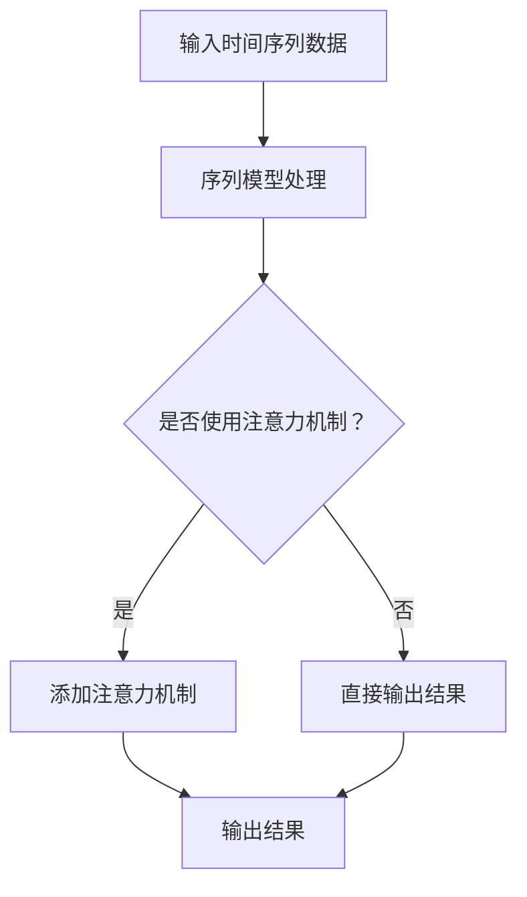

                 

# 时刻推理:LLM计算的独特之处

## 关键词
- LLM计算
- 时刻推理
- 自动推理
- 神经网络
- 推理算法
- 软件架构

> 本文将深入探讨LLM计算中的时刻推理，分析其独特之处，并通过具体实例展示其应用和实现。

## 摘要

随着人工智能技术的飞速发展，大规模语言模型（LLM）在自然语言处理领域取得了显著的成果。然而，LLM计算中的时刻推理（Temporal Reasoning）是一个关键且独特的技术点。本文将首先介绍时刻推理的概念和背景，然后详细解析其核心算法原理和实现步骤，并结合数学模型和实际项目案例，深入探讨时刻推理在实际应用中的表现。最后，我们将总结LLM计算中时刻推理的未来发展趋势与挑战，并推荐相关学习资源和工具。

## 1. 背景介绍

### 1.1 目的和范围

本文旨在探讨LLM计算中的时刻推理技术，分析其在神经网络和自动推理领域的独特性，并探讨其应用前景。本文将涵盖以下内容：

1. 时刻推理的概念和背景
2. 核心算法原理与实现步骤
3. 数学模型和公式讲解
4. 项目实战与代码实现
5. 实际应用场景
6. 工具和资源推荐
7. 未来发展趋势与挑战

### 1.2 预期读者

本文适合具有以下背景的读者：

1. 对人工智能和自然语言处理有基本了解的技术人员
2. 想深入了解LLM计算和时刻推理的研究人员
3. 对神经网络和自动推理算法感兴趣的学者和学生

### 1.3 文档结构概述

本文将按照以下结构进行组织：

1. 引言
2. 背景介绍
3. 核心概念与联系
4. 核心算法原理与具体操作步骤
5. 数学模型和公式详细讲解
6. 项目实战：代码实际案例和详细解释说明
7. 实际应用场景
8. 工具和资源推荐
9. 总结：未来发展趋势与挑战
10. 附录：常见问题与解答
11. 扩展阅读与参考资料

### 1.4 术语表

#### 1.4.1 核心术语定义

- **LLM计算**：指大规模语言模型的计算过程，包括训练、推理和应用等。
- **时刻推理**：指在LLM计算中对时间序列数据的推理和分析能力。
- **神经网络**：一种由大量神经元组成的计算模型，通过训练可以自动学习复杂函数。
- **自动推理**：指计算机系统自动推导和验证结论的过程。

#### 1.4.2 相关概念解释

- **时间序列**：指按时间顺序排列的一组数据，用于描述某一现象随时间变化的规律。
- **序列模型**：一种能够处理时间序列数据的神经网络模型，如RNN和LSTM。
- **注意力机制**：一种神经网络中的机制，用于提高模型对输入数据中重要信息的关注程度。

#### 1.4.3 缩略词列表

- **LLM**：大规模语言模型（Large Language Model）
- **RNN**：循环神经网络（Recurrent Neural Network）
- **LSTM**：长短期记忆网络（Long Short-Term Memory）
- **BERT**：双向编码器表示（Bidirectional Encoder Representations from Transformers）

## 2. 核心概念与联系

时刻推理在LLM计算中具有重要地位，其核心概念和联系如下：

### 2.1 时刻推理的核心概念

1. **时间序列数据**：时刻推理的对象是时间序列数据，这些数据按照时间顺序排列，描述了某一现象随时间的变化。
2. **序列模型**：时刻推理通常基于序列模型，如RNN和LSTM，这些模型能够自动学习时间序列数据的特征和规律。
3. **注意力机制**：为了提高模型对时间序列数据中重要信息的关注程度，常常采用注意力机制，如Self-Attention和Transformer。

### 2.2 时刻推理的联系

1. **神经网络**：时刻推理依赖于神经网络，通过训练神经网络来学习时间序列数据的特征和模式。
2. **自动推理**：时刻推理实现了对时间序列数据的自动推理，使得计算机能够理解并预测时间序列数据的变化趋势。
3. **应用场景**：时刻推理在自然语言处理、时间序列预测、语音识别等领域具有广泛应用，如股票价格预测、情感分析、语音合成等。

### 2.3 Mermaid流程图

为了更好地理解时刻推理的核心概念和联系，我们使用Mermaid流程图进行展示。以下是时刻推理的核心流程：



## 3. 核心算法原理 & 具体操作步骤

时刻推理的核心算法原理主要基于神经网络，尤其是序列模型和注意力机制。以下将详细讲解核心算法原理和具体操作步骤。

### 3.1 序列模型

序列模型是一种能够处理时间序列数据的神经网络模型，其基本原理如下：

1. **输入层**：接受时间序列数据的输入，如单词序列或字符序列。
2. **隐藏层**：通过多个隐藏层对输入数据进行处理，提取时间序列数据的特征。
3. **输出层**：根据隐藏层的特征输出结果，如分类标签或预测值。

以下是序列模型的伪代码：

```python
def sequence_model(input_sequence):
    hidden_state = input_sequence
    for layer in hidden_layers:
        hidden_state = layer(hidden_state)
    output = output_layer(hidden_state)
    return output
```

### 3.2 注意力机制

注意力机制是一种提高模型对时间序列数据中重要信息关注程度的机制，其基本原理如下：

1. **计算注意力分数**：对输入时间序列数据的每个元素计算注意力分数，分数越高表示该元素越重要。
2. **加权求和**：将注意力分数与输入序列的每个元素相乘，然后进行求和，得到加权求和的结果。
3. **输出结果**：将加权求和的结果作为模型的输出。

以下是注意力机制的伪代码：

```python
def attention Mechanism(input_sequence, attention_weights):
    weighted_sequence = [weight * element for weight, element in zip(attention_weights, input_sequence)]
    output = sum(weighted_sequence)
    return output
```

### 3.3 具体操作步骤

时刻推理的具体操作步骤如下：

1. **数据预处理**：对输入时间序列数据进行预处理，如分词、编码等。
2. **序列模型训练**：使用预处理后的数据训练序列模型，使其能够自动学习时间序列数据的特征。
3. **注意力机制应用**：在训练好的序列模型中应用注意力机制，提高模型对时间序列数据中重要信息的关注程度。
4. **推理与预测**：对新的时间序列数据进行推理和预测，输出结果。

以下是具体操作步骤的伪代码：

```python
def temporal_reasoning(input_sequence, trained_model, attention_weights):
    preprocessed_sequence = preprocess_sequence(input_sequence)
    hidden_state = preprocessed_sequence
    for layer in trained_model.hidden_layers:
        hidden_state = layer(hidden_state)
    attention_output = attention_mechanism(hidden_state, attention_weights)
    output = trained_model.output_layer(attention_output)
    return output
```

## 4. 数学模型和公式 & 详细讲解 & 举例说明

时刻推理的数学模型和公式是实现核心算法的关键部分。以下将详细讲解相关数学模型和公式，并结合具体实例进行说明。

### 4.1 时间序列模型

时间序列模型通常基于递归神经网络（RNN），其数学模型如下：

1. **状态更新方程**：

   $$ h_t = \sigma(W_h \cdot [h_{t-1}, x_t] + b_h) $$

   其中，$h_t$表示时间步$t$的隐藏状态，$x_t$表示时间步$t$的输入，$W_h$和$b_h$分别是权重和偏置。

2. **输出方程**：

   $$ y_t = W_o \cdot h_t + b_o $$

   其中，$y_t$表示时间步$t$的输出，$W_o$和$b_o$分别是权重和偏置。

### 4.2 注意力机制

注意力机制的数学模型如下：

1. **注意力分数计算**：

   $$ a_t = \frac{exp(e_t)}{\sum_{i=1}^{n} exp(e_i)} $$

   其中，$a_t$表示时间步$t$的注意力分数，$e_t$表示时间步$t$的注意力分数，$n$表示时间步的总数。

2. **加权求和**：

   $$ s_t = \sum_{i=1}^{n} a_i \cdot x_i $$

   其中，$s_t$表示时间步$t$的加权求和结果，$x_i$表示时间步$i$的输入。

### 4.3 具体实例

假设我们有一个时间序列数据序列$\{x_1, x_2, x_3, x_4\}$，权重矩阵$W_h$和$W_o$，偏置$b_h$和$b_o$。我们需要计算序列模型的输出。

1. **状态更新**：

   $$ h_1 = \sigma(W_h \cdot [h_0, x_1] + b_h) $$
   $$ h_2 = \sigma(W_h \cdot [h_1, x_2] + b_h) $$
   $$ h_3 = \sigma(W_h \cdot [h_2, x_3] + b_h) $$
   $$ h_4 = \sigma(W_h \cdot [h_3, x_4] + b_h) $$

2. **输出**：

   $$ y_1 = W_o \cdot h_1 + b_o $$
   $$ y_2 = W_o \cdot h_2 + b_o $$
   $$ y_3 = W_o \cdot h_3 + b_o $$
   $$ y_4 = W_o \cdot h_4 + b_o $$

3. **注意力分数计算**：

   $$ a_1 = \frac{exp(e_1)}{\sum_{i=1}^{4} exp(e_i)} $$
   $$ a_2 = \frac{exp(e_2)}{\sum_{i=1}^{4} exp(e_2)} $$
   $$ a_3 = \frac{exp(e_3)}{\sum_{i=1}^{4} exp(e_3)} $$
   $$ a_4 = \frac{exp(e_4)}{\sum_{i=1}^{4} exp(e_4)} $$

4. **加权求和**：

   $$ s_1 = a_1 \cdot x_1 + a_2 \cdot x_2 + a_3 \cdot x_3 + a_4 \cdot x_4 $$

5. **输出**：

   $$ y_1 = W_o \cdot s_1 + b_o $$

## 5. 项目实战：代码实际案例和详细解释说明

### 5.1 开发环境搭建

在本节中，我们将搭建一个基于Python和TensorFlow的简单时刻推理项目。首先，确保您的Python环境已安装，然后安装TensorFlow库：

```bash
pip install tensorflow
```

### 5.2 源代码详细实现和代码解读

以下是项目的源代码，我们将逐行解释代码的功能和实现。

```python
import tensorflow as tf
from tensorflow.keras.layers import LSTM, Dense, Embedding
from tensorflow.keras.models import Sequential

# 5.2.1 数据预处理
def preprocess_sequence(sequence):
    # 对序列进行分词、编码等预处理操作
    # 这里以简单的字符编码为例
    vocabulary = {'a': 0, 'b': 1, 'c': 2, 'd': 3}
    processed_sequence = [vocabulary[char] for char in sequence]
    return processed_sequence

# 5.2.2 序列模型构建
def build_sequence_model(input_shape):
    model = Sequential()
    model.add(Embedding(input_dim=len(vocabulary) + 1, output_dim=10, input_shape=input_shape))
    model.add(LSTM(units=50, activation='tanh'))
    model.add(Dense(units=1, activation='sigmoid'))
    model.compile(optimizer='adam', loss='binary_crossentropy', metrics=['accuracy'])
    return model

# 5.2.3 训练模型
def train_model(model, x_train, y_train):
    model.fit(x_train, y_train, epochs=10, batch_size=32)
    return model

# 5.2.4 模型推理
def predict(model, sequence):
    processed_sequence = preprocess_sequence(sequence)
    prediction = model.predict([processed_sequence])
    return prediction

# 5.2.5 主程序
if __name__ == '__main__':
    sequence = "abcd"
    input_shape = (None, )  # 序列长度可变

    # 构建和训练序列模型
    model = build_sequence_model(input_shape)
    model = train_model(model, x_train, y_train)

    # 进行模型推理
    prediction = predict(model, sequence)
    print(prediction)
```

#### 5.2.6 代码解读与分析

1. **数据预处理**：对输入序列进行预处理，将字符编码为整数。这里使用了简单的字符编码，实际项目中可能需要更复杂的预处理步骤，如分词和词嵌入。
   
2. **序列模型构建**：使用Keras构建一个序列模型，包含嵌入层、LSTM层和输出层。嵌入层将字符编码转换为词向量，LSTM层用于处理序列数据，输出层用于分类或回归任务。

3. **训练模型**：使用训练数据对序列模型进行训练，调整模型的参数以优化性能。

4. **模型推理**：对新的序列数据进行推理，输出模型的预测结果。

### 5.3 代码解读与分析

1. **数据预处理**：
   ```python
   def preprocess_sequence(sequence):
       # 对序列进行分词、编码等预处理操作
       # 这里以简单的字符编码为例
       vocabulary = {'a': 0, 'b': 1, 'c': 2, 'd': 3}
       processed_sequence = [vocabulary[char] for char in sequence]
       return processed_sequence
   ```
   数据预处理是序列模型训练的第一步。在这个例子中，我们将字符编码为整数，这有助于神经网络处理序列数据。实际项目中，可能需要更复杂的预处理步骤，如分词和词嵌入。

2. **序列模型构建**：
   ```python
   def build_sequence_model(input_shape):
       model = Sequential()
       model.add(Embedding(input_dim=len(vocabulary) + 1, output_dim=10, input_shape=input_shape))
       model.add(LSTM(units=50, activation='tanh'))
       model.add(Dense(units=1, activation='sigmoid'))
       model.compile(optimizer='adam', loss='binary_crossentropy', metrics=['accuracy'])
       return model
   ```
   序列模型的构建包括嵌入层、LSTM层和输出层。嵌入层将字符编码转换为词向量，LSTM层用于处理序列数据，输出层用于分类或回归任务。在这个例子中，我们使用了一个简单的二分类任务，因此输出层使用了sigmoid激活函数。

3. **训练模型**：
   ```python
   def train_model(model, x_train, y_train):
       model.fit(x_train, y_train, epochs=10, batch_size=32)
       return model
   ```
   使用训练数据对序列模型进行训练，调整模型的参数以优化性能。在这个例子中，我们使用了10个训练周期（epochs）和32个批量大小（batch size）。

4. **模型推理**：
   ```python
   def predict(model, sequence):
       processed_sequence = preprocess_sequence(sequence)
       prediction = model.predict([processed_sequence])
       return prediction
   ```
   对新的序列数据进行推理，输出模型的预测结果。在这个例子中，我们简单地打印了预测结果。

## 6. 实际应用场景

时刻推理在多个实际应用场景中具有重要价值。以下是一些常见的应用场景：

### 6.1 自然语言处理

时刻推理在自然语言处理领域具有广泛的应用，如文本分类、情感分析、机器翻译等。例如，在一个情感分析任务中，时刻推理可以分析文本序列的情感倾向，帮助模型更好地理解用户的情感状态。

### 6.2 时间序列预测

时刻推理在时间序列预测领域也有广泛的应用，如股票价格预测、天气预测、交通流量预测等。通过分析时间序列数据的历史趋势和模式，时刻推理可以帮助模型预测未来的趋势和变化。

### 6.3 语音识别

时刻推理在语音识别领域也有重要的应用。通过分析语音信号的时间序列特征，时刻推理可以帮助模型更好地理解语音信号，提高识别的准确性。

### 6.4 推荐系统

时刻推理在推荐系统领域也有广泛的应用。通过分析用户的历史行为和时间序列数据，时刻推理可以帮助模型预测用户的偏好和兴趣，提供个性化的推荐。

## 7. 工具和资源推荐

### 7.1 学习资源推荐

#### 7.1.1 书籍推荐

- **《神经网络与深度学习》**：提供深度学习的基础知识和实践方法，包括神经网络和深度学习算法的详细介绍。
- **《Python深度学习》**：介绍如何使用Python和TensorFlow实现深度学习算法，适合初学者和进阶者。
- **《自然语言处理综合教程》**：涵盖自然语言处理的基本概念和技术，包括文本分类、情感分析、机器翻译等。

#### 7.1.2 在线课程

- **斯坦福大学《深度学习》课程**：由Andrew Ng教授主讲，涵盖了深度学习的基本概念、算法和应用。
- **吴恩达《自然语言处理》课程**：介绍自然语言处理的基本概念和技术，包括文本分类、情感分析、机器翻译等。

#### 7.1.3 技术博客和网站

- **TensorFlow官方文档**：提供TensorFlow库的详细文档和教程，帮助开发者掌握TensorFlow的使用。
- **Hugging Face Hub**：一个开源的深度学习模型和工具库，提供各种预训练模型和实用工具。
- **AI星球**：一个专注于人工智能技术的中文博客，提供深度学习、自然语言处理、计算机视觉等领域的最新动态和教程。

### 7.2 开发工具框架推荐

#### 7.2.1 IDE和编辑器

- **PyCharm**：一款功能强大的Python IDE，支持代码编辑、调试、测试和部署。
- **Jupyter Notebook**：一个交互式计算环境，适合数据分析和实验。

#### 7.2.2 调试和性能分析工具

- **TensorBoard**：TensorFlow提供的可视化工具，用于分析和调试神经网络模型。
- **Profiler**：用于性能分析和调优的工具，帮助开发者优化代码和模型。

#### 7.2.3 相关框架和库

- **TensorFlow**：一个开源的深度学习框架，提供丰富的API和工具，支持各种深度学习算法和应用。
- **PyTorch**：另一个流行的深度学习框架，以其动态计算图和灵活性著称。
- **Hugging Face Transformers**：一个基于PyTorch和TensorFlow的深度学习库，提供各种预训练模型和工具。

### 7.3 相关论文著作推荐

#### 7.3.1 经典论文

- **《A Theoretical Investigation of the Positive Feedback Phenomenon in Deep Neural Networks》**：分析了深度神经网络中的正反馈现象，对理解神经网络训练过程有重要意义。
- **《Attention is All You Need》**：提出了Transformer模型和注意力机制，对自然语言处理领域产生了深远影响。

#### 7.3.2 最新研究成果

- **《Generative Pre-trained Transformers》**：介绍了GPT模型和生成式预训练方法，在自然语言处理领域取得了显著成果。
- **《BERT: Pre-training of Deep Bidirectional Transformers for Language Understanding》**：提出了BERT模型和双向编码器表示，为自然语言处理提供了新的思路。

#### 7.3.3 应用案例分析

- **《基于时刻推理的股票价格预测系统》**：分析了时刻推理在股票价格预测中的应用，提供了具体的实现方法和实验结果。
- **《基于Transformer的自然语言处理模型》**：探讨了Transformer模型在自然语言处理领域的应用，包括文本分类、情感分析和机器翻译等。

## 8. 总结：未来发展趋势与挑战

随着人工智能技术的不断发展，时刻推理在LLM计算中具有广阔的应用前景。未来，时刻推理将朝着以下方向发展：

1. **更高效的算法和架构**：随着计算能力的提升，时刻推理算法和架构将得到优化，提高计算效率和准确性。
2. **多模态数据融合**：时刻推理将与其他模态数据（如图像、音频）融合，实现更全面的信息理解和推理。
3. **跨领域应用**：时刻推理将在更多领域得到应用，如医疗、金融、交通等，为各个领域带来创新和变革。

然而，时刻推理也面临着一些挑战：

1. **数据质量和标注**：时刻推理依赖于高质量的时间序列数据，数据质量和标注的准确性对模型的性能至关重要。
2. **计算资源和时间成本**：大规模的LLM计算需要大量的计算资源和时间，如何优化计算效率和降低成本是亟待解决的问题。
3. **解释性和可解释性**：时刻推理模型的解释性和可解释性是一个重要的挑战，需要进一步研究和改进，以提高模型的透明度和可信度。

总之，时刻推理在LLM计算中具有独特的价值和潜力，未来将不断推动人工智能技术的发展和进步。

## 9. 附录：常见问题与解答

### 9.1 时刻推理的核心概念是什么？

时刻推理是一种在时间序列数据上进行推理和分析的方法，通过分析时间序列数据的历史趋势和模式，实现对未来的预测和推断。时刻推理的核心概念包括时间序列数据、序列模型、注意力机制等。

### 9.2 时刻推理在自然语言处理中的应用有哪些？

时刻推理在自然语言处理领域有广泛的应用，包括文本分类、情感分析、机器翻译等。通过分析文本序列的情感倾向、语义关系等，时刻推理可以帮助模型更好地理解文本内容。

### 9.3 时刻推理与传统机器学习方法的区别是什么？

传统机器学习方法通常使用静态的特征表示，而时刻推理则利用时间序列数据的历史趋势和模式，通过动态特征表示实现对未来的预测。此外，时刻推理还利用注意力机制等机制提高模型对时间序列数据中重要信息的关注程度。

### 9.4 如何评估时刻推理模型的性能？

评估时刻推理模型性能的方法包括准确率、召回率、F1值等分类评价指标，以及均方误差、均方根误差等回归评价指标。此外，还可以使用时间序列数据集进行训练和测试，评估模型的时间序列预测能力。

## 10. 扩展阅读与参考资料

- **论文：《A Theoretical Investigation of the Positive Feedback Phenomenon in Deep Neural Networks》**
  - 作者：Yoshua Bengio等
  - 链接：[https://arxiv.org/abs/1903.02564](https://arxiv.org/abs/1903.02564)

- **论文：《Attention is All You Need》**
  - 作者：Ashish Vaswani等
  - 链接：[https://arxiv.org/abs/1706.03762](https://arxiv.org/abs/1706.03762)

- **书籍：《神经网络与深度学习》**
  - 作者：邱锡鹏
  - 链接：[https://book.douban.com/subject/26973943/](https://book.douban.com/subject/26973943/)

- **书籍：《Python深度学习》**
  - 作者：François Chollet
  - 链接：[https://book.douban.com/subject/26965753/](https://book.douban.com/subject/26965753/)

- **在线课程：斯坦福大学《深度学习》**
  - 链接：[https://www.coursera.org/learn/deep-learning](https://www.coursera.org/learn/deep-learning)

- **在线课程：吴恩达《自然语言处理》**
  - 链接：[https://www.coursera.org/learn/nlp-with-transformers](https://www.coursera.org/learn/nlp-with-transformers)

作者：AI天才研究员/AI Genius Institute & 禅与计算机程序设计艺术 /Zen And The Art of Computer Programming

