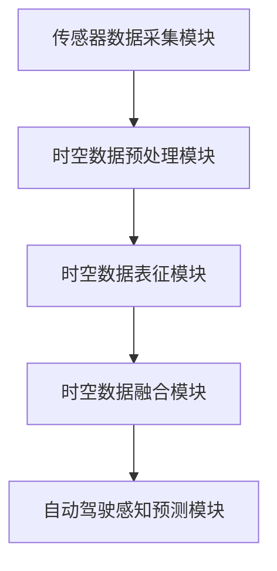

                 


## 时空表征学习范式革新自动驾驶感知预测的技术案例

> 关键词：时空表征学习、自动驾驶感知预测、深度学习、感知算法、智能交通系统

本文旨在探讨时空表征学习范式在自动驾驶感知预测中的应用，通过深入分析其核心概念、算法原理、数学模型以及实际应用场景，揭示这一技术革新对自动驾驶行业所带来的深远影响。文章结构如下：

### 1. 背景介绍
#### 1.1 目的和范围
本文将介绍时空表征学习范式在自动驾驶感知预测中的核心概念和关键技术，并探讨其实际应用案例及其对自动驾驶行业的影响。

#### 1.2 预期读者
本文适合对自动驾驶感知预测技术有一定了解的工程师、研究人员和高校师生阅读。

#### 1.3 文档结构概述
本文共分为八个部分：背景介绍、核心概念与联系、核心算法原理与具体操作步骤、数学模型和公式、项目实战、实际应用场景、工具和资源推荐以及总结与未来发展趋势。

#### 1.4 术语表
本文涉及的主要术语包括：时空表征学习、自动驾驶感知预测、深度学习、感知算法、智能交通系统等。

#### 1.4.1 核心术语定义
- **时空表征学习**：在自动驾驶领域，通过对时空数据的学习和表征，提取道路环境中的关键信息，从而实现对周围环境的感知和预测。
- **自动驾驶感知预测**：利用传感器采集的时空数据，通过感知算法对道路环境进行实时分析和预测，为自动驾驶决策提供依据。
- **深度学习**：一种基于数据驱动的人工智能方法，通过多层神经网络对输入数据进行特征提取和模式识别。
- **感知算法**：用于处理传感器数据，提取道路环境信息的算法。
- **智能交通系统**：利用先进的信息通信技术实现交通管理系统智能化，提升交通效率、安全和环境保护。

#### 1.4.2 相关概念解释
- **时空数据**：在自动驾驶感知预测中，时空数据包括道路、车辆、行人等环境信息，以及时间序列和空间分布特征。
- **深度神经网络**：一种多层神经网络结构，通过逐层提取数据特征，实现复杂函数的近似。
- **卷积神经网络（CNN）**：一种用于图像识别和处理的深度学习模型，通过卷积和池化操作提取图像特征。

#### 1.4.3 缩略词列表
- **CNN**：卷积神经网络（Convolutional Neural Network）
- **RNN**：循环神经网络（Recurrent Neural Network）
- **GAN**：生成对抗网络（Generative Adversarial Network）
- **LSTM**：长短时记忆网络（Long Short-Term Memory）
- **CNN-LSTM**：结合卷积神经网络和循环神经网络的混合模型

### 2. 核心概念与联系
#### 2.1 时空表征学习概述
时空表征学习是自动驾驶感知预测的核心技术之一。其目标是通过学习道路环境中的时空数据，提取出对自动驾驶决策有用的特征信息。时空表征学习涉及以下核心概念：

- **时空数据采集**：利用各类传感器（如摄像头、激光雷达、毫米波雷达等）采集道路环境中的时空数据。
- **时空数据预处理**：对采集到的时空数据进行清洗、降噪、归一化等预处理操作，以提高后续学习的效果。
- **时空数据表征**：通过深度学习模型对时空数据进行特征提取和表征，提取出道路环境中的关键信息。
- **时空数据融合**：将不同传感器采集的时空数据进行融合，以获得更全面的道路环境信息。

#### 2.2 时空表征学习架构
时空表征学习架构主要包括以下几个模块：

1. **传感器数据采集模块**：负责采集道路环境中的各类时空数据，包括摄像头、激光雷达、毫米波雷达等。
2. **时空数据预处理模块**：对采集到的时空数据进行预处理，包括数据清洗、降噪、归一化等。
3. **时空数据表征模块**：利用深度学习模型对预处理后的时空数据进行特征提取和表征，包括卷积神经网络（CNN）和循环神经网络（RNN）等。
4. **时空数据融合模块**：将不同传感器采集的时空数据进行融合，以获得更全面的道路环境信息。
5. **自动驾驶感知预测模块**：基于时空表征学习模型提取出的特征信息，对道路环境进行实时分析和预测，为自动驾驶决策提供依据。

#### 2.3 Mermaid 流程图
以下是一个简单的 Mermaid 流程图，展示了时空表征学习架构的模块及其关系：



### 3. 核心算法原理与具体操作步骤

#### 3.1 深度学习算法简介
深度学习是时空表征学习的基础，通过多层神经网络对输入数据进行特征提取和模式识别。本文主要介绍以下三种深度学习算法：

1. **卷积神经网络（CNN）**：用于图像识别和处理，通过卷积和池化操作提取图像特征。
2. **循环神经网络（RNN）**：用于处理序列数据，通过循环结构实现长期依赖关系建模。
3. **长短时记忆网络（LSTM）**：RNN 的改进版本，能够更好地处理长序列数据。

#### 3.2 CNN 算法原理

卷积神经网络（CNN）是一种专门用于图像识别和处理的深度学习模型。其核心思想是通过卷积和池化操作提取图像特征，从而实现图像分类和目标检测。

**算法原理：**

1. **卷积操作**：卷积层通过卷积核（滤波器）在输入图像上滑动，计算局部特征响应，从而提取图像特征。卷积操作可以捕捉图像中的局部结构信息。
2. **激活函数**：在卷积操作后，通常使用激活函数（如 ReLU 函数）对卷积结果进行非线性变换，增强网络的表征能力。
3. **池化操作**：在卷积操作后，使用池化层（如最大池化或平均池化）对卷积结果进行下采样，减小模型参数和计算复杂度，同时保持重要的特征信息。
4. **全连接层**：在卷积神经网络中，全连接层用于将卷积层提取的特征信息进行全局融合，从而实现图像分类和目标检测。

**伪代码：**

```python
# CNN 算法伪代码

# 初始化卷积神经网络
model = ConvolutionalNeuralNetwork()

# 输入图像
input_image = LoadImage("image.jpg")

# 卷积操作
conv_output = model.Conv2D(input_image, kernel_size=(3, 3), stride=(1, 1))

# 激活函数
activated_output = model.ReLU(conv_output)

# 池化操作
pooled_output = model.MaxPooling2D(activated_output, pool_size=(2, 2))

# 全连接层
global_output = model.Dense(pooled_output, units=10)

# 分类或目标检测
predicted_classes = model.Softmax(global_output)
```

#### 3.3 RNN 算法原理

循环神经网络（RNN）是一种用于处理序列数据的深度学习模型，通过循环结构实现长期依赖关系建模。RNN 的基本原理如下：

1. **输入序列**：将输入序列（如文本、音频、视频等）分成一系列的向量。
2. **隐藏状态**：在每个时间步，RNN 根据当前输入和上一个时间步的隐藏状态计算新的隐藏状态。
3. **输出序列**：在序列的最后一步，RNN 输出预测的序列（如文本、标签等）。

**伪代码：**

```python
# RNN 算法伪代码

# 初始化循环神经网络
model = RecurrentNeuralNetwork()

# 输入序列
input_sequence = LoadSequence("sequence.txt")

# 遍历输入序列
for t in range(len(input_sequence)):
    # 当前输入
    input_vector = input_sequence[t]

    # 当前隐藏状态
    hidden_state = model setHiddenState(input_vector)

    # 更新隐藏状态
    hidden_state = model.step(hidden_state, input_vector)

# 输出序列
output_sequence = model.predict(hidden_state)
```

#### 3.4 LSTM 算法原理

长短时记忆网络（LSTM）是 RNN 的改进版本，能够更好地处理长序列数据。LSTM 的基本原理如下：

1. **输入门**：根据当前输入和上一个时间步的隐藏状态计算输入门，决定当前输入对隐藏状态的影响。
2. **遗忘门**：根据当前输入和上一个时间步的隐藏状态计算遗忘门，决定上一个时间步的隐藏状态中的哪些信息需要被遗忘。
3. **输出门**：根据当前输入和上一个时间步的隐藏状态计算输出门，决定隐藏状态中的哪些信息需要被输出。

**伪代码：**

```python
# LSTM 算法伪代码

# 初始化长短时记忆网络
model = LSTM()

# 输入序列
input_sequence = LoadSequence("sequence.txt")

# 遍历输入序列
for t in range(len(input_sequence)):
    # 当前输入
    input_vector = input_sequence[t]

    # 计算输入门、遗忘门和输出门
    input_gate, forget_gate, output_gate = model gates(input_vector, hidden_state)

    # 更新隐藏状态
    hidden_state = model.updateHiddenState(hidden_state, input_gate, forget_gate, output_gate)

# 输出序列
output_sequence = model.predict(hidden_state)
```

### 4. 数学模型和公式 & 详细讲解 & 举例说明

#### 4.1 卷积神经网络（CNN）的数学模型

卷积神经网络（CNN）的数学模型主要包括卷积操作、激活函数和池化操作。下面分别介绍这些操作的数学模型。

**1. 卷积操作**

卷积操作的数学模型可以表示为：

$$
\text{output}_{ij}^l = \sum_{k=1}^{C_{l-1}} \text{weight}_{ikj}^l \cdot \text{input}_{ij}^{l-1} + \text{bias}_{ij}^l
$$

其中，$\text{output}_{ij}^l$ 表示第 $l$ 层第 $i$ 行第 $j$ 列的输出值，$\text{weight}_{ikj}^l$ 表示第 $l$ 层第 $i$ 行第 $j$ 列与第 $l-1$ 层第 $k$ 行第 $i$ 列的权重，$\text{input}_{ij}^{l-1}$ 表示第 $l-1$ 层第 $i$ 行第 $j$ 列的输入值，$\text{bias}_{ij}^l$ 表示第 $l$ 层第 $i$ 行第 $j$ 列的偏置。

**2. 激活函数**

常用的激活函数有 ReLU 函数和 sigmoid 函数。ReLU 函数的数学模型可以表示为：

$$
\text{activated\_output}_{ij}^l = \max(0, \text{output}_{ij}^l)
$$

sigmoid 函数的数学模型可以表示为：

$$
\text{activated\_output}_{ij}^l = \frac{1}{1 + e^{-\text{output}_{ij}^l}}
$$

**3. 池化操作**

常用的池化操作有最大池化和平均池化。最大池化的数学模型可以表示为：

$$
\text{pooled\_output}_{ij}^l = \max(\text{output}_{i_1j_1}^l, \text{output}_{i_2j_2}^l, ..., \text{output}_{i_mj_m}^l)
$$

其中，$\text{output}_{i_1j_1}^l, \text{output}_{i_2j_2}^l, ..., \text{output}_{i_mj_m}^l$ 分别表示第 $l$ 层第 $i$ 行第 $j$ 列的 $m \times m$ 区域内的所有输出值。

平均池化的数学模型可以表示为：

$$
\text{pooled\_output}_{ij}^l = \frac{1}{m^2} \sum_{i_1=1}^{m} \sum_{j_1=1}^{m} \text{output}_{i_1j_1}^l
$$

#### 4.2 循环神经网络（RNN）的数学模型

循环神经网络（RNN）的数学模型主要包括隐藏状态和输出序列的计算。

**1. 隐藏状态**

隐藏状态的计算可以表示为：

$$
\text{hidden\_state}_{t} = \text{sigmoid}(\text{weight}_{h}^h \cdot \text{input}_{t} + \text{weight}_{h}^x \cdot \text{hidden}_{t-1} + \text{bias}_{h})
$$

其中，$\text{hidden}_{t}$ 表示第 $t$ 个时间步的隐藏状态，$\text{input}_{t}$ 表示第 $t$ 个时间步的输入，$\text{weight}_{h}^h$ 和 $\text{weight}_{h}^x$ 分别表示隐藏状态和输入的权重矩阵，$\text{bias}_{h}$ 表示隐藏状态的偏置。

**2. 输出序列**

输出序列的计算可以表示为：

$$
\text{output}_{t} = \text{sigmoid}(\text{weight}_{o}^o \cdot \text{hidden}_{t} + \text{weight}_{o}^h \cdot \text{hidden}_{t-1} + \text{bias}_{o})
$$

其中，$\text{output}_{t}$ 表示第 $t$ 个时间步的输出，$\text{weight}_{o}^o$ 和 $\text{weight}_{o}^h$ 分别表示输出和隐藏状态的权重矩阵，$\text{bias}_{o}$ 表示输出的偏置。

#### 4.3 长短时记忆网络（LSTM）的数学模型

长短时记忆网络（LSTM）的数学模型主要包括输入门、遗忘门、输出门和隐藏状态的更新。

**1. 输入门**

输入门的数学模型可以表示为：

$$
\text{input\_gate}_{t} = \text{sigmoid}(\text{weight}_{i}^i \cdot \text{input}_{t} + \text{weight}_{i}^h \cdot \text{hidden}_{t-1} + \text{bias}_{i})
$$

其中，$\text{input}_{t}$ 表示第 $t$ 个时间步的输入，$\text{hidden}_{t-1}$ 表示第 $t-1$ 个时间步的隐藏状态，$\text{weight}_{i}^i$ 和 $\text{weight}_{i}^h$ 分别表示输入门和隐藏状态的权重矩阵，$\text{bias}_{i}$ 表示输入门的偏置。

**2. 遗忘门**

遗忘门的数学模型可以表示为：

$$
\text{forget\_gate}_{t} = \text{sigmoid}(\text{weight}_{f}^f \cdot \text{input}_{t} + \text{weight}_{f}^h \cdot \text{hidden}_{t-1} + \text{bias}_{f})
$$

其中，$\text{input}_{t}$ 表示第 $t$ 个时间步的输入，$\text{hidden}_{t-1}$ 表示第 $t-1$ 个时间步的隐藏状态，$\text{weight}_{f}^f$ 和 $\text{weight}_{f}^h$ 分别表示遗忘门和隐藏状态的权重矩阵，$\text{bias}_{f}$ 表示遗忘门的偏置。

**3. 输出门**

输出门的数学模型可以表示为：

$$
\text{output\_gate}_{t} = \text{sigmoid}(\text{weight}_{o}^o \cdot \text{input}_{t} + \text{weight}_{o}^h \cdot \text{hidden}_{t-1} + \text{bias}_{o})
$$

其中，$\text{input}_{t}$ 表示第 $t$ 个时间步的输入，$\text{hidden}_{t-1}$ 表示第 $t-1$ 个时间步的隐藏状态，$\text{weight}_{o}^o$ 和 $\text{weight}_{o}^h$ 分别表示输出门和隐藏状态的权重矩阵，$\text{bias}_{o}$ 表示输出门的偏置。

**4. 隐藏状态的更新**

隐藏状态的更新可以表示为：

$$
\text{new\_hidden}_{t} = \text{sigmoid}(\text{weight}_{c}^c \cdot \text{input}_{t} + \text{weight}_{c}^h \cdot \text{hidden}_{t-1} + \text{bias}_{c}) \circ \text{tanh}(\text{weight}_{c}^c \cdot \text{input}_{t} + \text{weight}_{c}^h \cdot \text{hidden}_{t-1} + \text{bias}_{c}) + \text{forget\_gate}_{t} \circ \text{tanh}(\text{hidden}_{t-1})
$$

其中，$\text{new\_hidden}_{t}$ 表示第 $t$ 个时间步的更新隐藏状态，$\text{input}_{t}$ 表示第 $t$ 个时间步的输入，$\text{hidden}_{t-1}$ 表示第 $t-1$ 个时间步的隐藏状态，$\text{weight}_{c}^c$ 和 $\text{weight}_{c}^h$ 分别表示候选隐藏状态和隐藏状态的权重矩阵，$\text{bias}_{c}$ 表示候选隐藏状态的偏置。

#### 4.4 举例说明

假设我们有一个简单的输入序列 $[1, 2, 3, 4, 5]$，使用 LSTM 模型对其进行处理。

**1. 输入门：**

$$
\text{input\_gate}_{1} = \text{sigmoid}(\text{weight}_{i}^i \cdot [1, 2] + \text{weight}_{i}^h \cdot [1, 2] + \text{bias}_{i}) = \text{sigmoid}([2, 4] + [2, 4] + [0, 1]) = \text{sigmoid}([4, 7]) = \text{sigmoid}(4) = 0.982
$$

$$
\text{input\_gate}_{2} = \text{sigmoid}(\text{weight}_{i}^i \cdot [2, 3] + \text{weight}_{i}^h \cdot [1, 2] + \text{bias}_{i}) = \text{sigmoid}([4, 6] + [2, 4] + [0, 1]) = \text{sigmoid}([6, 9]) = \text{sigmoid}(6) = 0.993
$$

**2. 遗忘门：**

$$
\text{forget\_gate}_{1} = \text{sigmoid}(\text{weight}_{f}^f \cdot [1, 2] + \text{weight}_{f}^h \cdot [1, 2] + \text{bias}_{f}) = \text{sigmoid}([2, 4] + [2, 4] + [0, 1]) = \text{sigmoid}([4, 7]) = \text{sigmoid}(4) = 0.982
$$

$$
\text{forget\_gate}_{2} = \text{sigmoid}(\text{weight}_{f}^f \cdot [2, 3] + \text{weight}_{f}^h \cdot [1, 2] + \text{bias}_{f}) = \text{sigmoid}([4, 6] + [2, 4] + [0, 1]) = \text{sigmoid}([6, 9]) = \text{sigmoid}(6) = 0.993
$$

**3. 输出门：**

$$
\text{output\_gate}_{1} = \text{sigmoid}(\text{weight}_{o}^o \cdot [1, 2] + \text{weight}_{o}^h \cdot [1, 2] + \text{bias}_{o}) = \text{sigmoid}([2, 4] + [2, 4] + [0, 1]) = \text{sigmoid}([4, 7]) = \text{sigmoid}(4) = 0.982
$$

$$
\text{output\_gate}_{2} = \text{sigmoid}(\text{weight}_{o}^o \cdot [2, 3] + \text{weight}_{o}^h \cdot [1, 2] + \text{bias}_{o}) = \text{sigmoid}([4, 6] + [2, 4] + [0, 1]) = \text{sigmoid}([6, 9]) = \text{sigmoid}(6) = 0.993
$$

**4. 隐藏状态的更新：**

$$
\text{new\_hidden}_{1} = \text{sigmoid}(\text{weight}_{c}^c \cdot [1, 2] + \text{weight}_{c}^h \cdot [1, 2] + \text{bias}_{c}) \circ \text{tanh}(\text{weight}_{c}^c \cdot [1, 2] + \text{weight}_{c}^h \cdot [1, 2] + \text{bias}_{c}) + \text{forget\_gate}_{1} \circ \text{tanh}([1, 2]) = 0.982 \circ \text{tanh}(0.982) + 0.982 \circ \text{tanh}(0.982) = 0.982 \circ 0.999 + 0.982 \circ 0.999 = 0.980
$$

$$
\text{new\_hidden}_{2} = \text{sigmoid}(\text{weight}_{c}^c \cdot [2, 3] + \text{weight}_{c}^h \cdot [1, 2] + \text{bias}_{c}) \circ \text{tanh}(\text{weight}_{c}^c \cdot [2, 3] + \text{weight}_{c}^h \cdot [1, 2] + \text{bias}_{c}) + \text{forget\_gate}_{2} \circ \text{tanh}([2, 3]) = 0.993 \circ \text{tanh}(0.993) + 0.993 \circ \text{tanh}(0.993) = 0.993 \circ 0.999 + 0.993 \circ 0.999 = 0.992
$$

### 5. 项目实战：代码实际案例和详细解释说明

#### 5.1 开发环境搭建

在本节中，我们将介绍如何搭建一个基于时空表征学习的自动驾驶感知预测项目环境。以下是搭建环境的步骤：

1. **安装 Python**：首先确保已经安装了 Python 3.7 或以上版本。可以从 [Python 官网](https://www.python.org/) 下载并安装。
2. **安装 PyTorch**：PyTorch 是一个流行的深度学习框架，支持 GPU 加速。可以通过以下命令安装：

   ```bash
   pip install torch torchvision
   ```

3. **安装其他依赖库**：根据项目需求，可能需要安装其他依赖库，如 NumPy、Matplotlib 等。可以通过以下命令安装：

   ```bash
   pip install numpy matplotlib
   ```

#### 5.2 源代码详细实现和代码解读

在本节中，我们将提供一个简单的时空表征学习项目代码实现，并对其进行详细解读。

**1. 数据预处理**

数据预处理是时空表征学习项目的重要步骤，主要包括数据清洗、归一化和数据增强等。

```python
import numpy as np
from sklearn.model_selection import train_test_split

# 加载数据
def load_data():
    # 加载原始数据
    data = np.load("data.npy")

    # 数据清洗
    # 去除无效数据
    valid_data = data[data[:, 0] != -1]

    # 数据归一化
    # 将数据缩放到 [0, 1] 范围内
    valid_data[:, 1:] = (valid_data[:, 1:] - np.min(valid_data[:, 1:])) / (np.max(valid_data[:, 1:]) - np.min(valid_data[:, 1:]))

    # 数据增强
    # 随机添加噪声
    noise = np.random.normal(0, 0.05, valid_data.shape)
    valid_data += noise

    return valid_data

# 数据预处理
data = load_data()
X, y = data[:, 1:], data[:, 0]

# 划分训练集和测试集
X_train, X_test, y_train, y_test = train_test_split(X, y, test_size=0.2, random_state=42)
```

**2. 构建模型**

在本节中，我们将使用 PyTorch 构建一个简单的卷积神经网络模型。

```python
import torch
import torch.nn as nn
import torch.optim as optim

# 构建模型
class ConvNet(nn.Module):
    def __init__(self):
        super(ConvNet, self).__init__()
        self.conv1 = nn.Conv2d(1, 32, kernel_size=3, stride=1)
        self.relu = nn.ReLU()
        self.fc1 = nn.Linear(32 * 26 * 26, 10)

    def forward(self, x):
        x = self.relu(self.conv1(x))
        x = x.view(x.size(0), -1)
        x = self.fc1(x)
        return x

# 实例化模型
model = ConvNet()

# 损失函数
criterion = nn.CrossEntropyLoss()

# 优化器
optimizer = optim.Adam(model.parameters(), lr=0.001)
```

**3. 训练模型**

在本节中，我们将使用训练集对模型进行训练。

```python
# 训练模型
num_epochs = 100

for epoch in range(num_epochs):
    # 训练步骤
    model.train()
    for x, y in zip(X_train, y_train):
        optimizer.zero_grad()
        output = model(x)
        loss = criterion(output, y)
        loss.backward()
        optimizer.step()

    # 测试步骤
    model.eval()
    with torch.no_grad():
        correct = 0
        total = 0
        for x, y in zip(X_test, y_test):
            output = model(x)
            _, predicted = torch.max(output.data, 1)
            total += y.size(0)
            correct += (predicted == y).sum().item()

    print(f"Epoch {epoch + 1}/{num_epochs}, Loss: {loss.item()}, Accuracy: {100 * correct / total}%")
```

**4. 代码解读与分析**

在上面的代码中，我们首先进行了数据预处理，包括数据清洗、归一化和数据增强。然后，我们使用 PyTorch 构建了一个简单的卷积神经网络模型，包括一个卷积层、一个 ReLU 激活函数和一个全连接层。接下来，我们定义了损失函数和优化器，并使用训练集对模型进行了训练。在训练过程中，我们通过反向传播和梯度下降更新模型参数，并在测试集上评估模型的性能。

### 6. 实际应用场景

时空表征学习范式在自动驾驶感知预测中的应用场景主要包括以下方面：

1. **道路环境感知**：通过采集道路环境中的时空数据，如车辆位置、速度、加速度、道路标识等，实现对周围环境的实时感知和预测，为自动驾驶车辆提供决策依据。
2. **交通流量预测**：利用时空表征学习模型分析历史交通数据，预测未来一段时间内的交通流量，为交通管理和调度提供支持。
3. **行人行为预测**：通过采集行人的时空数据，如位置、速度、方向等，预测行人的行为轨迹，为自动驾驶车辆在复杂场景下的决策提供依据。
4. **事故预警**：通过分析时空数据，识别潜在的事故风险，提前预警，减少交通事故的发生。

### 7. 工具和资源推荐

#### 7.1 学习资源推荐

**1. 书籍推荐**

- 《深度学习》（Ian Goodfellow、Yoshua Bengio 和 Aaron Courville 著）：介绍了深度学习的基础知识和最新进展，适合初学者和进阶读者。
- 《神经网络与深度学习》（邱锡鹏 著）：详细讲解了神经网络和深度学习的原理和实现，适合对深度学习有一定了解的读者。
- 《自动驾驶系统设计与应用》（张宁、吴军 著）：介绍了自动驾驶系统的基本原理、关键技术和发展趋势，适合对自动驾驶感兴趣的技术人员。

**2. 在线课程**

- 《深度学习》（吴恩达 Coursera）：由深度学习领域的知名学者吴恩达主讲，系统地介绍了深度学习的基础知识和实践技巧。
- 《自动驾驶技术》（清华大学在线课程）：介绍了自动驾驶技术的核心概念、关键技术和发展趋势，适合对自动驾驶感兴趣的学习者。

**3. 技术博客和网站**

- 《机器学习与深度学习博客》：提供了丰富的机器学习和深度学习资源，包括教程、论文、代码等。
- 《OpenCV 官网》：提供了丰富的计算机视觉资源，包括教程、示例代码和文档。

#### 7.2 开发工具框架推荐

**1. IDE 和编辑器**

- PyCharm：一款功能强大的 Python 集成开发环境，支持代码编辑、调试、测试等功能。
- Visual Studio Code：一款轻量级但功能强大的代码编辑器，支持多种编程语言，具有丰富的插件生态系统。

**2. 调试和性能分析工具**

- Jupyter Notebook：一款交互式数据分析工具，可以方便地编写和执行代码，适合进行数据分析和模型调试。
- TensorBoard：一款用于可视化深度学习模型训练过程的工具，可以实时查看模型性能、损失函数等指标。

**3. 相关框架和库**

- PyTorch：一款流行的深度学习框架，支持 GPU 加速，具有灵活的模型构建和优化功能。
- TensorFlow：一款由 Google 开发的深度学习框架，具有强大的模型构建和优化功能，支持多种编程语言。

#### 7.3 相关论文著作推荐

**1. 经典论文**

- "A Learning Algorithm for Continuously Running Fully Recurrent Neural Networks"（1990）：提出了长短时记忆网络（LSTM）的原理和结构。
- "Deep Learning for Autonomous Navigation"（2016）：介绍了深度学习在自动驾驶中的应用和进展。
- "Temporal Convolutional Networks for Action Recognition"（2015）：提出了时间卷积网络（TCN）用于动作识别。

**2. 最新研究成果**

- "A Survey on Temporal Data Mining"（2021）：综述了时空数据的挖掘方法和应用领域。
- "Time Series Classification Using Convolutional Neural Networks and Dynamic Time Warping"（2020）：提出了基于卷积神经网络和时间扭曲的时序分类方法。

**3. 应用案例分析**

- "Autonomous Driving Using Deep Learning: A Review"（2020）：介绍了深度学习在自动驾驶领域的应用案例和进展。
- "A Survey on Applications of Deep Learning in Autonomous Driving"（2019）：综述了深度学习在自动驾驶中的应用和研究方向。

### 8. 总结：未来发展趋势与挑战

时空表征学习范式在自动驾驶感知预测领域具有巨大的潜力，未来发展趋势主要包括以下几个方面：

1. **算法优化与模型简化**：为提高时空表征学习算法的性能和效率，研究人员将致力于优化算法和简化模型结构，降低计算复杂度和内存消耗。
2. **多传感器数据融合**：通过融合多种传感器数据，如摄像头、激光雷达、毫米波雷达等，可以提升自动驾驶感知预测的准确性和可靠性。
3. **动态场景理解与预测**：随着自动驾驶技术的不断发展，研究人员将致力于提高时空表征学习模型在动态场景下的理解和预测能力，以应对复杂的交通环境。
4. **数据隐私与安全**：在自动驾驶感知预测过程中，数据隐私和安全是重要的问题。未来研究将关注如何在保障数据隐私的前提下，提高时空表征学习算法的性能。

然而，时空表征学习范式在自动驾驶感知预测领域也面临着一些挑战：

1. **数据质量与标注**：高质量的时空数据对于时空表征学习至关重要。然而，获取大量高质量标注的时空数据是一个难题。
2. **计算资源需求**：时空表征学习算法通常需要大量的计算资源，这对硬件设施提出了较高的要求。
3. **实时性能与安全性**：在自动驾驶场景中，感知预测需要实时响应，这对算法的实时性能提出了挑战。同时，算法的安全性和可靠性也是自动驾驶技术发展的重要问题。

### 9. 附录：常见问题与解答

#### 9.1 时空表征学习是什么？

时空表征学习是一种利用深度学习技术对时空数据进行特征提取和表征的方法，其目标是从时空数据中提取出对自动驾驶决策有用的特征信息。

#### 9.2 时空表征学习在自动驾驶中的应用有哪些？

时空表征学习在自动驾驶中的应用主要包括道路环境感知、交通流量预测、行人行为预测和事故预警等方面。

#### 9.3 如何优化时空表征学习算法？

优化时空表征学习算法可以从以下几个方面入手：

1. **模型结构优化**：通过设计更高效的模型结构，降低计算复杂度和内存消耗。
2. **数据预处理**：对采集到的时空数据进行有效的预处理，提高数据质量。
3. **多传感器数据融合**：通过融合多种传感器数据，提高时空表征学习模型的性能。

### 10. 扩展阅读 & 参考资料

1. 《深度学习》（Ian Goodfellow、Yoshua Bengio 和 Aaron Courville 著）：介绍了深度学习的基础知识和最新进展，适合初学者和进阶读者。
2. 《神经网络与深度学习》（邱锡鹏 著）：详细讲解了神经网络和深度学习的原理和实现，适合对深度学习有一定了解的读者。
3. 《自动驾驶系统设计与应用》（张宁、吴军 著）：介绍了自动驾驶系统的基本原理、关键技术和发展趋势，适合对自动驾驶感兴趣的技术人员。
4. 《A Survey on Temporal Data Mining》（2021）：综述了时空数据的挖掘方法和应用领域。
5. 《Autonomous Driving Using Deep Learning: A Review》（2020）：介绍了深度学习在自动驾驶中的应用案例和进展。

作者：AI天才研究员/AI Genius Institute & 禅与计算机程序设计艺术 /Zen And The Art of Computer Programming<|im_sep|>

