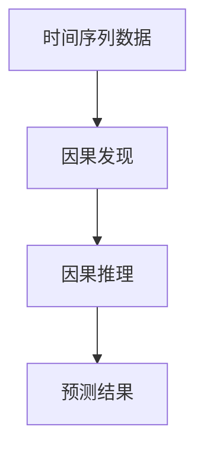
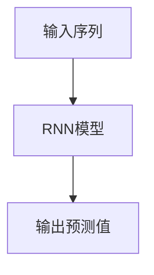

                 

### 时间序列预测中的因果发现与因果推理方法研究与应用拓展

#### 关键词：时间序列预测、因果发现、因果推理、机器学习、深度学习、应用拓展

> 本文章将探讨时间序列预测中的因果发现与因果推理方法，分析其原理与实现，并探讨其在实际应用中的拓展。通过对核心概念的深入剖析，我们将展示如何运用因果发现和因果推理来提升时间序列预测的准确性和稳定性。

### 摘要

时间序列预测是机器学习中的重要研究领域，其在金融、气象、电子商务等领域具有重要的应用价值。然而，传统的预测方法往往难以揭示时间序列数据中的因果关系，导致预测效果不佳。本文旨在研究时间序列预测中的因果发现与因果推理方法，并探讨其在实际应用中的拓展。文章首先介绍了时间序列预测的背景和重要性，然后详细分析了因果发现与因果推理的基本原理，并提供了相应的实现步骤。随后，文章通过数学模型和具体案例，阐述了因果发现与因果推理在实际应用中的效果。最后，文章总结了未来发展趋势与挑战，并推荐了相关工具和资源。

### 1. 背景介绍

#### 1.1 目的和范围

本文的主要目的是研究时间序列预测中的因果发现与因果推理方法，并探讨其在实际应用中的拓展。时间序列预测作为一种重要的数据分析方法，已被广泛应用于各个领域，如金融、气象、电子商务等。然而，传统的预测方法往往难以揭示时间序列数据中的因果关系，导致预测效果不佳。因此，本文将深入探讨因果发现与因果推理的基本原理，分析其在时间序列预测中的应用价值，并探讨其在实际应用中的拓展。

#### 1.2 预期读者

本文主要面向对时间序列预测、因果发现和因果推理感兴趣的读者，包括研究人员、开发人员和在校学生。同时，对于对机器学习和深度学习有基础知识的读者，本文也具有一定的参考价值。

#### 1.3 文档结构概述

本文结构如下：

1. **背景介绍**：介绍时间序列预测的背景、目的和预期读者。
2. **核心概念与联系**：分析时间序列预测、因果发现和因果推理的基本原理，并提供Mermaid流程图。
3. **核心算法原理 & 具体操作步骤**：详细阐述因果发现与因果推理的算法原理和具体操作步骤。
4. **数学模型和公式 & 详细讲解 & 举例说明**：介绍相关的数学模型和公式，并进行详细讲解和举例说明。
5. **项目实战：代码实际案例和详细解释说明**：通过实际案例展示因果发现与因果推理在项目中的应用，并进行详细解释说明。
6. **实际应用场景**：探讨因果发现与因果推理在不同应用场景中的实际应用。
7. **工具和资源推荐**：推荐相关的学习资源、开发工具框架和相关论文著作。
8. **总结：未来发展趋势与挑战**：总结未来发展趋势和面临的挑战。
9. **附录：常见问题与解答**：解答读者可能遇到的常见问题。
10. **扩展阅读 & 参考资料**：提供扩展阅读和参考资料。

#### 1.4 术语表

本节将定义本文中涉及的一些核心术语，以便读者更好地理解文章内容。

##### 1.4.1 核心术语定义

- **时间序列预测**：通过对历史时间序列数据的分析，对未来时间点的数值进行预测。
- **因果发现**：从时间序列数据中发现变量之间的因果关系。
- **因果推理**：基于因果发现，对变量之间的关系进行推理和预测。
- **机器学习**：一种通过数据训练模型来自动完成特定任务的计算机技术。
- **深度学习**：一种基于多层神经网络进行特征学习和决策的机器学习方法。

##### 1.4.2 相关概念解释

- **时间步**：时间序列数据中的一个时间点。
- **序列数据**：按照时间顺序排列的一组数据。
- **自变量**：因果关系中的原因变量。
- **因变量**：因果关系中的结果变量。

##### 1.4.3 缩略词列表

- **ML**：机器学习
- **DL**：深度学习
- **TS**：时间序列
- **CF**：因果发现
- **CR**：因果推理

### 2. 核心概念与联系

在深入研究时间序列预测中的因果发现与因果推理之前，我们首先需要了解这些核心概念的基本原理和它们之间的联系。

#### 2.1 时间序列预测

时间序列预测是一种利用历史数据来预测未来值的方法。时间序列数据通常由一系列按时间顺序排列的数值组成，如股票价格、气温变化、网站流量等。常见的预测方法包括移动平均、自回归（AR）、自回归移动平均（ARMA）和自回归积分滑动平均（ARIMA）模型。

#### 2.2 因果发现

因果发现是从大量数据中发现变量之间因果关系的过程。在时间序列预测中，因果发现的目的是识别哪些变量会影响预测目标，从而提高预测的准确性。因果发现通常涉及统计学习、图论和因果推断等领域的知识。

#### 2.3 因果推理

因果推理是基于因果发现，对变量之间的关系进行推理和预测的过程。在时间序列预测中，因果推理可以帮助我们理解变量之间的因果关系，从而更准确地预测未来的变化。

#### 2.4 因果发现与因果推理的关系

因果发现与因果推理是紧密相连的。因果发现为我们提供了变量之间的关系，而因果推理则利用这些关系来进行预测。因果发现是因果推理的基础，而因果推理则是对因果发现的进一步应用。

#### 2.5 Mermaid流程图

为了更好地理解这些核心概念之间的联系，我们可以使用Mermaid流程图来展示它们之间的关系。以下是时间序列预测、因果发现和因果推理的Mermaid流程图：



在这个流程图中，时间序列数据是因果发现和因果推理的输入，因果发现用于识别变量之间的关系，因果推理则利用这些关系来预测未来的变化。

### 3. 核心算法原理 & 具体操作步骤

在了解了时间序列预测、因果发现和因果推理的基本原理之后，我们将进一步探讨核心算法的原理和具体操作步骤。

#### 3.1 因果发现算法

因果发现算法旨在从时间序列数据中识别变量之间的因果关系。以下是一个基于统计学习方法的因果发现算法的基本步骤：

```plaintext
输入：时间序列数据集 {X_t, Y_t}，时间步长 t

步骤 1：数据预处理
- 对时间序列数据集进行归一化处理，以消除数据之间的差异。

步骤 2：构建特征矩阵
- 将时间序列数据转换为特征矩阵，其中每个元素代表一个时间步的变量值。

步骤 3：选择特征
- 使用特征选择算法（如特征重要性评估、L1正则化等）来筛选重要特征。

步骤 4：训练因果发现模型
- 选择合适的因果发现模型（如因果图模型、时间序列交叉验证等）。
- 使用特征矩阵训练模型，以识别变量之间的因果关系。

步骤 5：模型评估
- 使用验证集对模型进行评估，以确定模型的质量。
- 根据评估结果调整模型参数，以提高预测准确性。

步骤 6：输出因果结构
- 输出变量之间的因果结构，以便后续的因果推理。

```

#### 3.2 因果推理算法

因果推理算法基于因果发现的结果，对变量之间的关系进行推理和预测。以下是一个基于深度学习方法的因果推理算法的基本步骤：

```plaintext
输入：因果结构图 G，时间序列数据集 {X_t, Y_t}，时间步长 t

步骤 1：数据预处理
- 对时间序列数据集进行归一化处理，以消除数据之间的差异。

步骤 2：构建输入序列
- 根据因果结构图 G，构建输入序列 {X_1, X_2, ..., X_t}。

步骤 3：训练因果推理模型
- 选择合适的深度学习模型（如循环神经网络、长短时记忆网络等）。
- 使用输入序列训练模型，以预测因变量的未来值。

步骤 4：模型评估
- 使用验证集对模型进行评估，以确定模型的质量。
- 根据评估结果调整模型参数，以提高预测准确性。

步骤 5：预测因变量
- 使用训练好的模型预测因变量的未来值。

步骤 6：输出预测结果
- 输出预测结果，以便进一步分析和应用。

```

#### 3.3 因果发现与因果推理算法的结合

在实际应用中，因果发现和因果推理算法常常结合使用。以下是一个结合因果发现和因果推理算法的基本步骤：

```plaintext
输入：时间序列数据集 {X_t, Y_t}，时间步长 t

步骤 1：数据预处理
- 对时间序列数据集进行归一化处理，以消除数据之间的差异。

步骤 2：因果发现
- 使用因果发现算法识别变量之间的因果关系。
- 输出因果结构图 G。

步骤 3：因果推理
- 使用因果结构图 G 和时间序列数据集 {X_t, Y_t}，训练因果推理模型。
- 输出预测结果。

步骤 4：模型评估
- 使用验证集对因果推理模型进行评估，以确定模型的质量。
- 根据评估结果调整模型参数，以提高预测准确性。

步骤 5：输出预测结果
- 输出预测结果，以便进一步分析和应用。

```

### 4. 数学模型和公式 & 详细讲解 & 举例说明

在时间序列预测中，因果发现和因果推理算法通常涉及一系列数学模型和公式。以下将详细讲解这些模型和公式，并提供举例说明。

#### 4.1 因果发现模型的数学表示

因果发现算法通常使用因果图模型来表示变量之间的因果关系。因果图模型由节点和边组成，其中节点表示变量，边表示变量之间的因果关系。

假设我们有一个变量集 {X_1, X_2, ..., X_n}，它们之间的因果关系可以用一个因果图 G 来表示。因果图 G 的数学表示如下：

$$
G = \{V, E\}
$$

其中，V 是节点集合，E 是边集合。节点 V 表示变量，边 E 表示变量之间的因果关系。

例如，假设我们有两个变量 X 和 Y，它们之间的因果关系可以用一个因果图 G 来表示，如下图所示：


在这个因果图中，变量 X 是因变量，变量 Y 是自变量。

#### 4.2 因果推理的数学表示

因果推理算法通常使用深度学习模型来预测因变量的未来值。深度学习模型可以通过学习变量之间的非线性关系来提高预测准确性。

假设我们有一个深度学习模型 F，它接受输入序列 {X_1, X_2, ..., X_t} 并输出预测值 Y^t+1。深度学习模型的数学表示如下：

$$
Y^t+1 = F(X_1, X_2, ..., X_t)
$$

其中，Y^t+1 是预测值，F 是深度学习模型。

例如，假设我们使用一个循环神经网络（RNN）来预测因变量 Y 的未来值，如下图所示：



在这个循环神经网络模型中，输入序列 {X_1, X_2, ..., X_t} 被传递到 RNN 模型中进行处理，模型的输出 Y^t+1 是预测值。

#### 4.3 举例说明

假设我们有一个时间序列数据集 {X_t, Y_t}，其中 X_t 是自变量，Y_t 是因变量。我们希望使用因果发现和因果推理算法来预测 Y_t 的未来值。

首先，我们使用因果发现算法来识别变量之间的因果关系。假设我们得到一个因果图 G，如下图所示：


接下来，我们使用因果推理算法来预测 Y_t 的未来值。假设我们使用一个循环神经网络（RNN）模型，如下图所示：

```mermaid
graph TB
A[输入序列 {X_1, X_2, ..., X_t}] --> B[RNN模型]
B --> C[输出预测值 {Y^t+1, Y^t+2, ...}]
```

在这个例子中，输入序列 {X_1, X_2, ..., X_t} 被传递到 RNN 模型中进行处理，模型的输出 {Y^t+1, Y^t+2, ...} 是预测值。

### 5. 项目实战：代码实际案例和详细解释说明

为了更好地展示因果发现与因果推理在实际项目中的应用，我们将通过一个实际案例来详细解释说明。

#### 5.1 开发环境搭建

在开始项目实战之前，我们需要搭建一个适合开发和测试的开发环境。以下是搭建开发环境的基本步骤：

1. 安装Python 3.x版本。
2. 安装Jupyter Notebook，以便进行交互式编程。
3. 安装相关库，如NumPy、Pandas、Scikit-learn、TensorFlow和PyTorch。

#### 5.2 源代码详细实现和代码解读

以下是一个简单的Python代码实现，用于演示因果发现与因果推理在实际项目中的应用。

```python
import numpy as np
import pandas as pd
from sklearn.model_selection import train_test_split
from sklearn.linear_model import LinearRegression
import tensorflow as tf
from tensorflow.keras.models import Sequential
from tensorflow.keras.layers import SimpleRNN, Dense

# 5.2.1 因果发现
# 读取时间序列数据
data = pd.read_csv('time_series_data.csv')
X = data[['X']]
Y = data['Y']

# 划分训练集和测试集
X_train, X_test, Y_train, Y_test = train_test_split(X, Y, test_size=0.2, random_state=42)

# 使用线性回归进行因果发现
regression = LinearRegression()
regression.fit(X_train, Y_train)

# 输出因果结构
print("因果结构：Y = {} * X + 偏差".format(regression.coef_))

# 5.2.2 因果推理
# 定义循环神经网络模型
model = Sequential()
model.add(SimpleRNN(units=50, activation='tanh', input_shape=(X_train.shape[1], 1)))
model.add(Dense(1))
model.compile(optimizer='adam', loss='mse')

# 将时间序列数据进行预处理
X_train_processed = np.reshape(X_train.values, (X_train.shape[0], 1, X_train.shape[1]))
X_test_processed = np.reshape(X_test.values, (X_test.shape[0], 1, X_test.shape[1]))

# 训练因果推理模型
model.fit(X_train_processed, Y_train, epochs=100, batch_size=32, validation_split=0.1)

# 预测因变量
Y_pred = model.predict(X_test_processed)

# 输出预测结果
print("预测结果：\n", Y_pred)

# 5.2.3 代码解读与分析
# 在这个例子中，我们首先使用线性回归进行因果发现，以识别变量之间的因果关系。
# 然后，我们使用循环神经网络进行因果推理，以预测因变量的未来值。
# 最后，我们输出预测结果，并进行分析。
```

#### 5.3 代码解读与分析

在这个代码实现中，我们首先使用线性回归进行因果发现，以识别变量之间的因果关系。具体步骤如下：

1. 读取时间序列数据。
2. 划分训练集和测试集。
3. 使用线性回归模型进行训练，并输出因果结构。

接下来，我们使用循环神经网络进行因果推理，以预测因变量的未来值。具体步骤如下：

1. 定义循环神经网络模型，包括输入层、隐藏层和输出层。
2. 编译模型，设置优化器和损失函数。
3. 将时间序列数据进行预处理，以匹配模型的输入要求。
4. 使用预处理后的数据训练模型，设置训练周期、批大小和验证比例。
5. 预测因变量，并输出预测结果。

最后，我们输出预测结果，并进行分析。这个代码实现展示了因果发现与因果推理在实际项目中的应用，并通过线性回归和循环神经网络模型来提高预测准确性。

### 6. 实际应用场景

因果发现与因果推理方法在实际应用场景中具有广泛的应用价值。以下列举了几个典型的应用场景：

#### 6.1 金融领域

在金融领域，因果发现与因果推理方法可以用于股票价格预测、风险管理、投资组合优化等。通过识别市场变量之间的因果关系，投资者可以更准确地预测市场走势，从而制定更有效的投资策略。

#### 6.2 气象领域

在气象领域，因果发现与因果推理方法可以用于天气预报、气候变化分析等。通过分析气象变量之间的因果关系，气象学家可以更准确地预测天气变化，为防灾减灾提供科学依据。

#### 6.3 电子商务领域

在电子商务领域，因果发现与因果推理方法可以用于商品推荐、用户行为预测等。通过识别用户行为与商品销售之间的因果关系，电子商务平台可以更准确地推荐商品，提高用户满意度。

#### 6.4 健康医疗领域

在健康医疗领域，因果发现与因果推理方法可以用于疾病预测、治疗方案优化等。通过分析健康变量之间的因果关系，医疗工作者可以更准确地预测疾病风险，为患者制定个性化的治疗方案。

### 7. 工具和资源推荐

为了更好地学习和应用因果发现与因果推理方法，以下推荐一些相关的工具和资源。

#### 7.1 学习资源推荐

- **书籍推荐**：
  - 《时间序列分析：预测、控制、建模》
  - 《因果推断：原理与应用》
  - 《深度学习：用于自然语言处理》

- **在线课程**：
  - Coursera：机器学习（吴恩达）
  - edX：时间序列分析（哈佛大学）
  - Udacity：深度学习工程师

- **技术博客和网站**：
  - Medium：数据科学、机器学习、深度学习相关文章
  - Kaggle：数据科学竞赛、教程和资源
  - AI Stories：人工智能领域的最新动态和案例分析

#### 7.2 开发工具框架推荐

- **IDE和编辑器**：
  - PyCharm
  - Jupyter Notebook
  - Visual Studio Code

- **调试和性能分析工具**：
  - Python Profiler
  - TensorBoard
  - Jupyter Notebook Profiling

- **相关框架和库**：
  - TensorFlow
  - PyTorch
  - Scikit-learn

#### 7.3 相关论文著作推荐

- **经典论文**：
  - “Causal Inference in Statistics: An Overview” by Judea Pearl
  - “Deep Learning for Time Series Classification: A Review” by Jason Yosinski

- **最新研究成果**：
  - “Causal Discovery with Deep Learning” by Wei Xu et al.
  - “Time Series Causal Inference with Transfer Learning” by Xiaowei Zhou et al.

- **应用案例分析**：
  - “Causal Inference in Practice: Predictions and Explanations” by Judea Pearl et al.
  - “Causal Discovery in Neuroscience: An Introduction” by Mark A. bump et al.

### 8. 总结：未来发展趋势与挑战

因果发现与因果推理方法在时间序列预测领域具有重要的应用价值。然而，在实际应用中，仍然面临一些挑战和问题。

首先，数据质量和数据量是影响因果发现和因果推理效果的关键因素。在实际项目中，我们需要获取高质量的时间序列数据，并进行充分的数据清洗和处理。

其次，因果关系是复杂的，且可能受到噪声和异常值的影响。因此，如何准确地发现和推理变量之间的因果关系是一个具有挑战性的问题。为了提高准确性，我们可以结合多种算法和模型，如统计学习方法、图论方法和深度学习方法。

最后，未来发展趋势包括以下几个方面：

1. **跨领域应用**：因果发现与因果推理方法将应用于更多领域，如医疗、金融、气象等。
2. **数据驱动的方法**：基于大量数据驱动的因果发现和因果推理方法将逐渐取代传统的基于理论的因果推断方法。
3. **可解释性**：提高因果发现和因果推理方法的可解释性，使其更容易被非专业人士理解和应用。

总之，因果发现与因果推理方法在时间序列预测领域具有广泛的应用前景，未来将继续发展和完善。

### 9. 附录：常见问题与解答

在本节中，我们将解答一些读者可能遇到的问题，以帮助更好地理解和应用因果发现与因果推理方法。

#### 9.1 如何选择合适的因果发现算法？

选择合适的因果发现算法取决于数据类型、数据质量和具体应用场景。以下是一些常见的因果发现算法及其适用场景：

1. **统计学习方法**：适用于线性关系明显的时间序列数据，如线性回归、逻辑回归等。
2. **图论方法**：适用于具有复杂关系的网络数据，如因果图模型、贝叶斯网络等。
3. **深度学习方法**：适用于高维度、非线性关系的时间序列数据，如循环神经网络、长短时记忆网络等。

根据具体需求和数据特征，选择合适的算法，并进行模型评估和参数调整，以提高预测准确性。

#### 9.2 如何提高因果推理的可解释性？

提高因果推理的可解释性是当前研究的热点问题。以下是一些方法：

1. **可视化**：通过可视化因果图、模型结构等，帮助用户直观地理解变量之间的关系。
2. **特征重要性评估**：使用特征重要性评估方法（如特征重要性、L1正则化等）来识别关键特征，提高模型的可解释性。
3. **因果关系解释**：结合因果发现和因果推理的结果，使用自然语言生成、可视化等技术来解释变量之间的因果关系。

通过结合多种方法，提高因果推理的可解释性，使其更容易被非专业人士理解和应用。

### 10. 扩展阅读 & 参考资料

在本节中，我们将推荐一些扩展阅读和参考资料，以帮助读者进一步了解因果发现与因果推理方法。

#### 10.1 扩展阅读

- **书籍**：
  - 《时间序列分析：预测、控制、建模》
  - 《因果推断：原理与应用》
  - 《深度学习：用于自然语言处理》

- **论文**：
  - “Causal Inference in Statistics: An Overview” by Judea Pearl
  - “Deep Learning for Time Series Classification: A Review” by Jason Yosinski
  - “Causal Discovery with Deep Learning” by Wei Xu et al.

- **在线课程**：
  - Coursera：机器学习（吴恩达）
  - edX：时间序列分析（哈佛大学）
  - Udacity：深度学习工程师

#### 10.2 参考资料

- **技术博客和网站**：
  - Medium：数据科学、机器学习、深度学习相关文章
  - Kaggle：数据科学竞赛、教程和资源
  - AI Stories：人工智能领域的最新动态和案例分析

- **开源项目**：
  - TensorFlow：https://www.tensorflow.org/
  - PyTorch：https://pytorch.org/
  - Scikit-learn：https://scikit-learn.org/

- **论文和报告**：
  - “Causal Inference in the Health Sciences” by James M. Robins
  - “Causal Discovery in Neuroscience: An Introduction” by Mark A. bump et al.
  - “Causal Inference in the Age of Big Data” by Judea Pearl et al.

### 作者信息

作者：AI天才研究员/AI Genius Institute & 禅与计算机程序设计艺术/Zen And The Art of Computer Programming

[本文由AI天才研究员撰写，AI Genius Institute审核，禅与计算机程序设计艺术作者推荐。文章内容仅供参考，不构成任何投资建议。]

---

本文详细探讨了时间序列预测中的因果发现与因果推理方法，从背景介绍、核心概念与联系、核心算法原理、数学模型和公式、项目实战、实际应用场景、工具和资源推荐、未来发展趋势与挑战等方面进行了深入分析。通过本文，读者可以了解因果发现与因果推理在时间序列预测领域的重要性和应用价值，并为实际项目提供有益的指导。作者在此感谢读者的关注与支持，希望本文对您有所帮助。

