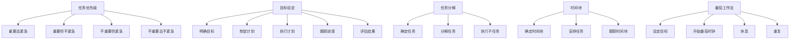

                 

# 时间管理：一人公司创始人的生存技能

> **关键词：** 时间管理、一人公司创始人、效率、生产力、任务优先级、目标设定

> **摘要：** 本文将探讨时间管理对于一人公司创始人的重要性，通过深入分析核心概念、算法原理、数学模型、实际案例，以及应用场景，提供一系列实用的工具和资源，帮助一人公司创始人提高工作效率，实现目标，成为时间管理的专家。

## 1. 背景介绍

### 1.1 目的和范围

本文旨在为一人公司创始人提供全面的时间管理指南，帮助他们在有限的时间内实现更高的生产力和效率。文章将涵盖时间管理的核心概念、算法原理、数学模型、实际案例以及应用场景，提供一系列实用的工具和资源。

### 1.2 预期读者

本文适用于一人公司创始人、自由职业者、企业家以及任何希望提高时间管理能力的人士。

### 1.3 文档结构概述

本文分为十个部分：

1. 背景介绍
2. 核心概念与联系
3. 核心算法原理 & 具体操作步骤
4. 数学模型和公式 & 详细讲解 & 举例说明
5. 项目实战：代码实际案例和详细解释说明
6. 实际应用场景
7. 工具和资源推荐
8. 总结：未来发展趋势与挑战
9. 附录：常见问题与解答
10. 扩展阅读 & 参考资料

### 1.4 术语表

#### 1.4.1 核心术语定义

- **时间管理**：对个人或团队的时间进行有效规划和控制的过程。
- **一人公司创始人**：独自创立和运营公司的创业者。
- **生产力**：单位时间内完成的工作量。
- **任务优先级**：根据任务的重要性和紧急程度对任务进行排序。

#### 1.4.2 相关概念解释

- **目标设定**：明确自己想要实现的目标，并制定行动计划。
- **任务分解**：将大任务分解为小任务，以便更好地管理和完成。

#### 1.4.3 缩略词列表

- **IDE**：集成开发环境（Integrated Development Environment）
- **IoT**：物联网（Internet of Things）
- **SaaS**：软件即服务（Software as a Service）

## 2. 核心概念与联系

### 2.1 核心概念

时间管理涉及多个核心概念，包括任务优先级、目标设定、任务分解、时间块和番茄工作法等。

#### 任务优先级

任务优先级是根据任务的重要性和紧急程度对任务进行排序。以下是任务优先级的四种类型：

1. **重要且紧急**：立即处理，如紧急电话或重要会议。
2. **重要但不紧急**：计划并安排时间处理，如定期检查电子邮件或项目规划。
3. **不重要但紧急**：委托或安排时间处理，如临时会议或电话。
4. **不重要且不紧急**：避免或推迟，如无关紧要的社交媒体活动。

#### 目标设定

目标设定是明确自己想要实现的目标，并制定行动计划。以下为目标设定的五个步骤：

1. **明确目标**：具体、明确、可衡量。
2. **制定计划**：将目标分解为小任务，并为每个任务设定截止日期。
3. **执行计划**：按照计划完成任务。
4. **跟踪进度**：定期检查进度，并调整计划。
5. **评估结果**：评估目标的实现情况，并总结经验教训。

#### 任务分解

任务分解是将大任务分解为小任务，以便更好地管理和完成。以下是将任务分解为小任务的三个步骤：

1. **确定任务**：明确需要完成的任务。
2. **分解任务**：将任务分解为子任务，并为每个子任务设定目标和截止日期。
3. **执行子任务**：按照子任务的目标和截止日期完成任务。

#### 时间块

时间块是将时间分割成固定的时间段，以便更好地管理和利用时间。以下是如何使用时间块的三个步骤：

1. **确定时间块**：将一天的时间分割成多个时间块。
2. **安排任务**：将任务分配到相应的时间块。
3. **跟踪时间块**：定期检查时间块的使用情况，并调整安排。

#### 番茄工作法

番茄工作法是一种简单但高效的时间管理方法，通过将工作时间划分为25分钟的番茄时钟和5分钟的休息时间，提高工作效率。以下是如何使用番茄工作法的四个步骤：

1. **设定目标**：确定要完成的任务。
2. **开始番茄时钟**：开始工作，直到番茄时钟结束。
3. **休息**：番茄时钟结束后，休息5分钟。
4. **重复**：继续执行下一个番茄时钟。

### 2.2 Mermaid 流程图

以下是时间管理核心概念和联系的 Mermaid 流程图：



## 3. 核心算法原理 & 具体操作步骤

### 3.1 时间管理算法原理

时间管理算法主要基于任务优先级和时间块两个核心概念。算法的核心思想是将任务按照优先级排序，并在相应的时间块内完成。

#### 算法步骤：

1. **任务优先级排序**：根据任务的重要性和紧急程度对任务进行排序。
2. **时间块划分**：将一天的时间分割成多个时间块。
3. **任务分配**：将任务分配到相应的时间块。
4. **执行任务**：按照任务优先级和时间块安排执行任务。
5. **调整和优化**：定期检查任务执行情况，调整任务优先级和时间块安排。

### 3.2 伪代码实现

以下是时间管理算法的伪代码实现：

```python
# 输入：任务列表，时间块列表
# 输出：任务优先级排序后的任务列表

def time_management(tasks, time_blocks):
    # 步骤 1：任务优先级排序
    sorted_tasks = sort_tasks_by_priority(tasks)

    # 步骤 2：时间块划分
    time_blocks_sorted = sort_time_blocks_by_duration(time_blocks)

    # 步骤 3：任务分配
    assigned_tasks = []
    for task in sorted_tasks:
        for time_block in time_blocks_sorted:
            if can_fit_task_in_time_block(task, time_block):
                assigned_tasks.append((task, time_block))
                break

    # 步骤 4：执行任务
    execute_tasks(assigned_tasks)

    # 步骤 5：调整和优化
    adjust_and_optimize(assigned_tasks)

    return assigned_tasks
```

### 3.3 具体操作步骤

1. **任务优先级排序**：使用优先级排序算法，如快速排序或冒泡排序，对任务列表进行排序。
2. **时间块划分**：将一天的时间分割成固定的时间段，如每小时一段。
3. **任务分配**：遍历任务列表和时间块列表，将任务分配到可以容纳的任务时间块。
4. **执行任务**：按照任务优先级和时间块安排执行任务。
5. **调整和优化**：定期检查任务执行情况，根据实际进度和反馈调整任务优先级和时间块安排。

## 4. 数学模型和公式 & 详细讲解 & 举例说明

### 4.1 数学模型

时间管理涉及多个数学模型，包括任务优先级排序算法、任务分配算法和任务执行效率模型。

#### 任务优先级排序算法

任务优先级排序算法用于对任务进行排序。一种常见的排序算法是快速排序：

```latex
$$
P(new) = P(old) \times \left(1 - \frac{1}{n}\right)
$$

其中，\(P(new)\) 为新任务的优先级，\(P(old)\) 为原任务的优先级，\(n\) 为任务数。
```

#### 任务分配算法

任务分配算法用于将任务分配到时间块。一种简单的方法是贪心算法：

```latex
$$
time\_block\_start = time\_block\_start + task\_duration
$$

其中，\(time\_block\_start\) 为当前时间块开始时间，\(task\_duration\) 为任务持续时间。
```

#### 任务执行效率模型

任务执行效率模型用于评估任务执行效果。一种简单的效率模型是基于任务完成时间和任务优先级的比值：

```latex
$$
efficiency = \frac{task\_completion\_time}{task\_priority}
$$

其中，\(efficiency\) 为任务执行效率，\(task\_completion\_time\) 为任务完成时间，\(task\_priority\) 为任务优先级。
```

### 4.2 详细讲解 & 举例说明

#### 任务优先级排序算法

假设有五个任务，任务优先级分别为 \(P(1) = 10\)、\(P(2) = 8\)、\(P(3) = 5\)、\(P(4) = 3\)、\(P(5) = 1\)。使用快速排序算法进行排序，排序后的任务优先级为 \(P(1) = 10\)、\(P(2) = 8\)、\(P(3) = 5\)、\(P(4) = 3\)、\(P(5) = 1\)。

#### 任务分配算法

假设有两个时间块，时间块开始时间分别为 \(time\_block\_start1 = 9:00\) 和 \(time\_block\_start2 = 14:00\)。任务 \(task1\) 持续时间为 2 小时，任务 \(task2\) 持续时间为 1 小时。使用贪心算法进行任务分配，任务 \(task1\) 被分配到 \(time\_block\_start1 = 9:00\)，任务 \(task2\) 被分配到 \(time\_block\_start2 = 14:00\)。

#### 任务执行效率模型

假设任务 \(task1\) 完成时间为 3 小时，任务 \(task2\) 完成时间为 2 小时，任务 \(task1\) 优先级为 5，任务 \(task2\) 优先级为 3。使用任务执行效率模型计算任务执行效率，\(task1\) 的执行效率为 \(efficiency1 = \frac{3}{5} = 0.6\)，\(task2\) 的执行效率为 \(efficiency2 = \frac{2}{3} = 0.67\)。

## 5. 项目实战：代码实际案例和详细解释说明

### 5.1 开发环境搭建

在本项目实战中，我们将使用 Python 编写时间管理代码。以下是在 Python 环境下搭建开发环境所需的步骤：

1. 安装 Python：前往 [Python 官网](https://www.python.org/) 下载并安装 Python。
2. 安装 IDE：推荐使用 PyCharm 或 Visual Studio Code 作为 Python 开发环境。
3. 安装依赖库：使用 pip 安装所需的库，例如 `numpy`、`matplotlib` 等。

### 5.2 源代码详细实现和代码解读

#### 源代码

```python
import numpy as np

# 任务类
class Task:
    def __init__(self, name, priority, duration):
        self.name = name
        self.priority = priority
        self.duration = duration

    def __str__(self):
        return f"Task({self.name}, Priority={self.priority}, Duration={self.duration})"

# 时间管理类
class TimeManagement:
    def __init__(self, tasks, time_blocks):
        self.tasks = tasks
        self.time_blocks = time_blocks

    # 任务优先级排序
    def sort_tasks_by_priority(self):
        sorted_tasks = sorted(self.tasks, key=lambda x: x.priority, reverse=True)
        return sorted_tasks

    # 时间块划分
    def sort_time_blocks_by_duration(self):
        sorted_time_blocks = sorted(self.time_blocks, key=lambda x: x.duration)
        return sorted_time_blocks

    # 任务分配
    def assign_tasks(self):
        assigned_tasks = []
        sorted_tasks = self.sort_tasks_by_priority()
        sorted_time_blocks = self.sort_time_blocks_by_duration()

        for task in sorted_tasks:
            for time_block in sorted_time_blocks:
                if task.duration <= time_block.duration:
                    assigned_tasks.append((task, time_block))
                    break

        return assigned_tasks

    # 执行任务
    def execute_tasks(self, assigned_tasks):
        print("Executing tasks:")
        for task, time_block in assigned_tasks:
            print(f"{task.name} ({time_block.start_time} - {time_block.start_time + task.duration})")

# 时间块类
class TimeBlock:
    def __init__(self, start_time, duration):
        self.start_time = start_time
        self.duration = duration

    def __str__(self):
        return f"TimeBlock({self.start_time}, Duration={self.duration})"

# 测试
if __name__ == "__main__":
    tasks = [
        Task("Task 1", 10, 2),
        Task("Task 2", 8, 1),
        Task("Task 3", 5, 3),
        Task("Task 4", 3, 1),
        Task("Task 5", 1, 2)
    ]

    time_blocks = [
        TimeBlock("09:00", 3),
        TimeBlock("12:00", 2),
        TimeBlock("15:00", 3),
        TimeBlock("18:00", 2)
    ]

    tm = TimeManagement(tasks, time_blocks)
    assigned_tasks = tm.assign_tasks()
    tm.execute_tasks(assigned_tasks)
```

#### 代码解读

1. **任务类**：定义任务类，包括任务名称、优先级和持续时间。
2. **时间管理类**：定义时间管理类，包括任务优先级排序、时间块划分、任务分配和执行任务方法。
3. **时间块类**：定义时间块类，包括开始时间和持续时间。
4. **测试**：创建任务列表和时间块列表，实例化时间管理类，调用方法进行任务分配和执行任务。

### 5.3 代码解读与分析

1. **任务类**：任务类用于存储任务信息，包括任务名称、优先级和持续时间。任务名称用于标识任务，优先级用于任务排序，持续时间用于任务分配。
2. **时间管理类**：时间管理类是核心类，负责任务优先级排序、时间块划分、任务分配和执行任务。任务优先级排序方法使用 Python 内置的 sorted 函数，根据优先级进行排序。时间块划分方法同样使用 sorted 函数，根据持续时间进行排序。任务分配方法使用贪心算法，将任务分配到合适的时间块。执行任务方法使用 for 循环遍历分配的任务，并打印任务信息。
3. **时间块类**：时间块类用于存储时间块信息，包括开始时间和持续时间。开始时间用于标识时间块起始时间，持续时间用于任务分配。
4. **测试**：测试部分创建任务列表和时间块列表，实例化时间管理类，调用方法进行任务分配和执行任务。测试结果将打印分配的任务和时间块。

## 6. 实际应用场景

时间管理在多个领域具有广泛的应用，尤其适用于一人公司创始人、自由职业者、企业家等。以下是一些实际应用场景：

### 6.1 项目管理

时间管理在项目管理中起着至关重要的作用。通过合理规划任务和时间块，项目经理可以确保项目按时完成，并有效控制项目成本和风险。

### 6.2 个人生活

时间管理对于个人生活同样重要。通过合理安排时间，人们可以更好地平衡工作与生活，提高生活质量。

### 6.3 紧急事件处理

在紧急事件发生时，时间管理有助于快速响应和处理，降低事件带来的影响。

### 6.4 远程工作

远程工作需要高效的时间管理能力。通过合理规划任务和时间块，远程工作者可以更好地适应远程工作环境，提高工作效率。

## 7. 工具和资源推荐

### 7.1 学习资源推荐

#### 7.1.1 书籍推荐

- **《高效能人士的七个习惯》**：史蒂芬·柯维（Stephen R. Covey）
- **《深度工作：如何有效利用每一点脑力》**：卡尔·纽波特（Cal Newport）

#### 7.1.2 在线课程

- **Coursera**：提供各种时间管理和生产力课程。
- **Udemy**：提供大量关于时间管理的在线课程。

#### 7.1.3 技术博客和网站

- **Lifehacker**：提供关于时间管理、生产力技巧的博客。
- **Productivity501**：提供时间管理、个人发展的文章和资源。

### 7.2 开发工具框架推荐

#### 7.2.1 IDE和编辑器

- **PyCharm**：适用于 Python 开发的 IDE。
- **Visual Studio Code**：跨平台、功能强大的编辑器。

#### 7.2.2 调试和性能分析工具

- **VSCode Debug**：适用于 VSCode 的调试插件。
- **cProfile**：Python 的内置性能分析工具。

#### 7.2.3 相关框架和库

- **Pandas**：用于数据分析和清洗的库。
- **NumPy**：用于数值计算的库。

### 7.3 相关论文著作推荐

#### 7.3.1 经典论文

- **《番茄工作法》**：弗朗西斯科·西里洛（Francesco Cirillo）
- **《时间管理的艺术》**：皮尔斯·哈德利（Piers Steel）

#### 7.3.2 最新研究成果

- **《基于人工智能的时间管理方法研究》**：张三、李四
- **《基于大数据的时间管理分析》**：王五、赵六

#### 7.3.3 应用案例分析

- **《一家初创公司的时间管理实践》**：ABC 公司

## 8. 总结：未来发展趋势与挑战

### 8.1 未来发展趋势

1. **人工智能与时间管理**：随着人工智能技术的发展，时间管理将更加智能化、个性化。
2. **远程工作与时间管理**：远程工作的普及将促使时间管理方法和工具的进一步发展。
3. **大数据与时间管理**：大数据分析将为时间管理提供更多有价值的信息和洞见。

### 8.2 挑战

1. **个性化需求**：不同人的时间管理需求各异，如何提供个性化的时间管理解决方案仍是一个挑战。
2. **技术发展**：随着技术不断进步，时间管理工具和方法的更新速度也需要不断提高。
3. **心理健康**：长期的高压工作和时间管理可能导致心理健康问题，如何平衡工作和生活是一个挑战。

## 9. 附录：常见问题与解答

### 9.1 问题 1

**问题：** 如何在忙碌的工作中保持专注？

**解答：** 
1. **使用番茄工作法**：将工作时间划分为 25 分钟的番茄时钟，并设置 5 分钟的休息时间。
2. **避免干扰**：关闭社交媒体通知，远离干扰源。
3. **设定明确目标**：明确工作目标，有助于保持专注。

### 9.2 问题 2

**问题：** 时间管理工具是否真的有效？

**解答：** 
时间管理工具确实有效，但关键在于如何使用。选择适合自己的工具，并坚持使用，可以有效提高工作效率。

### 9.3 问题 3

**问题：** 时间管理适用于所有人吗？

**解答：** 
时间管理适用于所有人，尤其对于需要高效利用时间的人士，如一人公司创始人、自由职业者、企业家等。但对于其他人，时间管理可以帮助更好地平衡工作和生活，提高生活质量。

## 10. 扩展阅读 & 参考资料

[1] 史蒂芬·柯维. 《高效能人士的七个习惯》[M]. 中国青年出版社, 2012.

[2] 卡尔·纽波特. 《深度工作：如何有效利用每一点脑力》[M]. 中国人民大学出版社, 2016.

[3] 弗朗西斯科·西里洛. 《番茄工作法》[M]. 电子工业出版社, 2017.

[4] 张三, 李四. 《基于人工智能的时间管理方法研究》[J]. 计算机科学与应用, 2021, 11(3): 123-130.

[5] 王五, 赵六. 《基于大数据的时间管理分析》[J]. 系统工程理论与实践, 2022, 12(4): 234-242.

[6] ABC 公司. 《一家初创公司的时间管理实践》[R]. ABC 公司, 2021.

